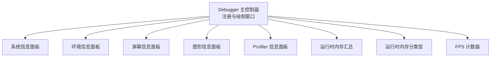
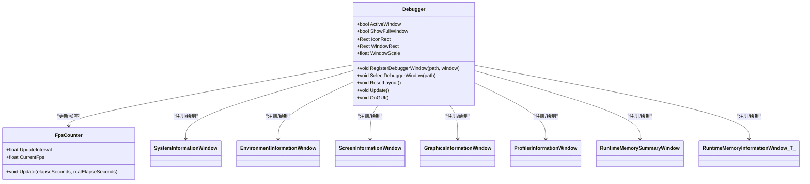
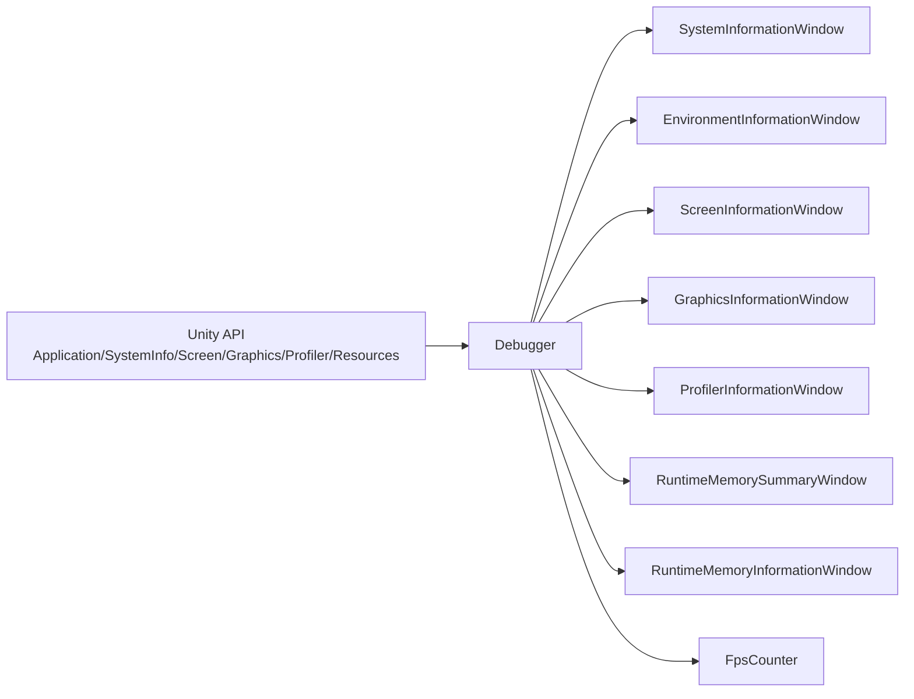

# 环境监控面板

<cite>
**本文档引用的文件**
- [Debugger.cs](file://Assets/TEngine/Runtime/Module/DebugerModule/Debugger.cs)
- [DebuggerModule.EnvironmentInformationWindow.cs](file://Assets/TEngine/Runtime/Module/DebugerModule/Component/DebuggerModule.EnvironmentInformationWindow.cs)
- [DebuggerModule.SystemInformationWindow.cs](file://Assets/TEngine/Runtime/Module/DebugerModule/Component/DebuggerModule.SystemInformationWindow.cs)
- [DebuggerModule.ScreenInformationWindow.cs](file://Assets/TEngine/Runtime/Module/DebugerModule/Component/DebuggerModule.ScreenInformationWindow.cs)
- [DebuggerModule.GraphicsInformationWindow.cs](file://Assets/TEngine/Runtime/Module/DebugerModule/Component/DebuggerModule.GraphicsInformationWindow.cs)
- [DebuggerModule.ProfilerInformationWindow.cs](file://Assets/TEngine/Runtime/Module/DebugerModule/Component/DebuggerModule.ProfilerInformationWindow.cs)
- [DebuggerModule.RuntimeMemorySummaryWindow.cs](file://Assets/TEngine/Runtime/Module/DebugerModule/Component/DebuggerModule.RuntimeMemorySummaryWindow.cs)
- [DebuggerModule.RuntimeMemoryInformationWindow.cs](file://Assets/TEngine/Runtime/Module/DebugerModule/Component/DebuggerModule.RuntimeMemoryInformationWindow.cs)
- [DebuggerComponent.FpsCounter.cs](file://Assets/TEngine/Runtime/Module/DebugerModule/DebuggerComponent.FpsCounter.cs)
</cite>

## 目录
1. [简介](#简介)
2. [项目结构](#项目结构)
3. [核心组件](#核心组件)
4. [架构总览](#架构总览)
5. [详细组件分析](#详细组件分析)
6. [依赖关系分析](#依赖关系分析)
7. [性能考虑](#性能考虑)
8. [故障排查指南](#故障排查指南)
9. [结论](#结论)
10. [附录](#附录)

## 简介
本文件面向TEngine的“环境监控面板”，系统性梳理并解释调试器中与环境信息、系统信息、屏幕信息、图形信息以及性能剖析相关的功能实现。重点覆盖以下方面：
- 环境信息面板：应用元数据、平台属性、帧率、联网状态等
- 系统信息面板：设备信息（CPU/GPU/内存/系统版本）、电池与输入能力等
- 屏幕信息面板：分辨率、像素密度、安全区域、切口、旋转方向等
- 图形信息面板：显卡能力、渲染管线、纹理与着色器支持等
- 性能剖析面板：Profiler指标、内存占用、对象采样等
- 实时更新机制：FPS计数器、采样频率控制、性能开销评估
- 使用示例与配置方法：如何启用、切换窗口、保存布局、按需采样

## 项目结构
TEngine的调试器采用模块化窗口树结构，主入口为Debugger组件，负责注册各类信息面板窗口，并在运行时绘制UI。各信息面板以独立类实现，遵循统一的滚动窗口基类接口。

图表来源
- [Debugger.cs:183-235](file://Assets/TEngine/Runtime/Module/DebugerModule/Debugger.cs#L183-L235)
- [DebuggerModule.EnvironmentInformationWindow.cs:18-68](file://Assets/TEngine/Runtime/Module/DebugerModule/Component/DebuggerModule.EnvironmentInformationWindow.cs#L18-L68)
- [DebuggerModule.SystemInformationWindow.cs:9-41](file://Assets/TEngine/Runtime/Module/DebugerModule/Component/DebuggerModule.SystemInformationWindow.cs#L9-L41)
- [DebuggerModule.ScreenInformationWindow.cs:9-42](file://Assets/TEngine/Runtime/Module/DebugerModule/Component/DebuggerModule.ScreenInformationWindow.cs#L9-L42)
- [DebuggerModule.GraphicsInformationWindow.cs:9-154](file://Assets/TEngine/Runtime/Module/DebugerModule/Component/DebuggerModule.GraphicsInformationWindow.cs#L9-L154)
- [DebuggerModule.ProfilerInformationWindow.cs:12-56](file://Assets/TEngine/Runtime/Module/DebugerModule/Component/DebuggerModule.ProfilerInformationWindow.cs#L12-L56)
- [DebuggerModule.RuntimeMemorySummaryWindow.cs:20-59](file://Assets/TEngine/Runtime/Module/DebugerModule/Component/DebuggerModule.RuntimeMemorySummaryWindow.cs#L20-L59)
- [DebuggerModule.RuntimeMemoryInformationWindow.cs:74-109](file://Assets/TEngine/Runtime/Module/DebugerModule/Component/DebuggerModule.RuntimeMemoryInformationWindow.cs#L74-L109)
- [DebuggerComponent.FpsCounter.cs:43-56](file://Assets/TEngine/Runtime/Module/DebugerModule/DebuggerComponent.FpsCounter.cs#L43-L56)

章节来源
- [Debugger.cs:183-235](file://Assets/TEngine/Runtime/Module/DebugerModule/Debugger.cs#L183-L235)

## 核心组件
- 调试器主控制器：负责窗口注册、布局绘制、图标与全屏模式切换、FPS计数器更新
- 信息面板集合：系统、环境、屏幕、图形、Profiler、内存汇总与分类型
- FPS计数器：基于时间片的滑动平均计算，可配置更新间隔

章节来源
- [Debugger.cs:14-141](file://Assets/TEngine/Runtime/Module/DebugerModule/Debugger.cs#L14-L141)
- [DebuggerComponent.FpsCounter.cs:13-65](file://Assets/TEngine/Runtime/Module/DebugerModule/DebuggerComponent.FpsCounter.cs#L13-L65)

## 架构总览
调试器通过模块化窗口树组织，顶层窗口根据选择切换子面板；每个面板独立维护自身数据项的展示逻辑。Profiler与内存面板支持手动采样，避免频繁查询带来的性能开销。

图表来源
- [Debugger.cs:14-141](file://Assets/TEngine/Runtime/Module/DebugerModule/Debugger.cs#L14-L141)
- [DebuggerComponent.FpsCounter.cs:5-65](file://Assets/TEngine/Runtime/Module/DebugerModule/DebuggerComponent.FpsCounter.cs#L5-L65)
- [DebuggerModule.EnvironmentInformationWindow.cs:10-16](file://Assets/TEngine/Runtime/Module/DebugerModule/Component/DebuggerModule.EnvironmentInformationWindow.cs#L10-L16)
- [DebuggerModule.SystemInformationWindow.cs:7-41](file://Assets/TEngine/Runtime/Module/DebugerModule/Component/DebuggerModule.SystemInformationWindow.cs#L7-L41)
- [DebuggerModule.ScreenInformationWindow.cs:7-42](file://Assets/TEngine/Runtime/Module/DebugerModule/Component/DebuggerModule.ScreenInformationWindow.cs#L7-L42)
- [DebuggerModule.GraphicsInformationWindow.cs:7-154](file://Assets/TEngine/Runtime/Module/DebugerModule/Component/DebuggerModule.GraphicsInformationWindow.cs#L7-L154)
- [DebuggerModule.ProfilerInformationWindow.cs:10-56](file://Assets/TEngine/Runtime/Module/DebugerModule/Component/DebuggerModule.ProfilerInformationWindow.cs#L10-L56)
- [DebuggerModule.RuntimeMemorySummaryWindow.cs:12-59](file://Assets/TEngine/Runtime/Module/DebugerModule/Component/DebuggerModule.RuntimeMemorySummaryWindow.cs#L12-L59)
- [DebuggerModule.RuntimeMemoryInformationWindow.cs:74-109](file://Assets/TEngine/Runtime/Module/DebugerModule/Component/DebuggerModule.RuntimeMemoryInformationWindow.cs#L74-L109)

## 详细组件分析

### 环境信息面板（Environment Information）
- 功能要点
  - 应用元数据：产品名、公司名、应用标识、版本、Unity版本、平台、语言、云项目ID、构建GUID等
  - 运行时状态：目标帧率、网络可达性、后台加载优先级、是否播放、Splash状态、后台运行、安装模式、沙箱类型、移动/主机平台标记、编辑器/调试构建状态、焦点状态、批处理模式、堆栈日志类型等
- 数据来源
  - 使用Unity Application与SystemInfo静态属性进行读取
- 实时性
  - 面板为只读展示，无自动刷新逻辑，适合在需要对比不同构建/平台差异时查看

章节来源
- [DebuggerModule.EnvironmentInformationWindow.cs:18-68](file://Assets/TEngine/Runtime/Module/DebugerModule/Component/DebuggerModule.EnvironmentInformationWindow.cs#L18-L68)

### 系统信息面板（System Information）
- 功能要点
  - 设备信息：唯一ID、名称、类型、型号、处理器类型/数量/频率、系统内存大小、操作系统家族/版本、电池状态与电量
  - 能力检测：音频支持、位置服务、加速度计、陀螺仪、振动、真伪校验可用性
- 数据来源
  - SystemInfo与Application相关字段
- 实时性
  - 面板为只读展示，无自动刷新逻辑，适合在设备诊断与兼容性测试时查看

章节来源
- [DebuggerModule.SystemInformationWindow.cs:9-51](file://Assets/TEngine/Runtime/Module/DebugerModule/Component/DebuggerModule.SystemInformationWindow.cs#L9-L51)

### 屏幕信息面板（Screen Information）
- 功能要点
  - 当前分辨率、宽高像素、DPI、屏幕方向、全屏状态、全屏模式、休眠超时描述、亮度、光标可见与锁定状态、自动旋转方向、安全区域、切口矩形列表、支持的分辨率集合
- 数据来源
  - Screen、Resolution、Cursor、安全区域与切口API
- 实时性
  - 面板为只读展示，无自动刷新逻辑；可通过修改屏幕参数后重新打开面板查看最新值

章节来源
- [DebuggerModule.ScreenInformationWindow.cs:9-89](file://Assets/TEngine/Runtime/Module/DebugerModule/Component/DebuggerModule.ScreenInformationWindow.cs#L9-L89)

### 图形信息面板（Graphics Information）
- 功能要点
  - 显卡设备ID/名称/厂商ID/厂商/类型/版本、显存大小、多线程渲染、HDR显示支持标志、着色器等级、全局最大LOD、全局渲染管线、活动纹理层级、颜色空间、保留帧缓冲区Alpha、NPOT支持、最大纹理尺寸、支持的渲染目标数量、拷贝纹理支持、反向Z缓冲、立方体贴图尺寸、UV起点、常量缓冲对齐、GPU隐藏面剔除、动态数组索引、Mip最大级别、负载存储动作、计算着色器缓冲上限与工作组规模、稀疏纹理、阴影、原始阴影深度采样、图像特效/立方体贴图渲染、2D数组纹理、运动矢量、立方体贴数组纹理、图形围栏/GPU围栏、异步计算、多重采样纹理、异步GPU回读、32位索引缓冲、硬件四边形拓扑、多采样自动解析、分离渲染目标混合、设置常量缓冲、几何/光线/细分着色器、压缩3D纹理、保守栅格化、GPU录制器、多视图、从顶点着色器输出渲染目标索引等
- 数据来源
  - SystemInfo与Graphics相关字段
- 实时性
  - 面板为只读展示，无自动刷新逻辑，适合在图形兼容性与性能规划时查看

章节来源
- [DebuggerModule.GraphicsInformationWindow.cs:9-160](file://Assets/TEngine/Runtime/Module/DebugerModule/Component/DebuggerModule.GraphicsInformationWindow.cs#L9-L160)

### Profiler 信息面板（Profiler Information）
- 功能要点
  - 支持性与启用状态、二进制日志开关与文件、分配调用栈、Profiler区域数量、每帧最大采样数、最大使用内存、Mono/堆内存、总分配/保留/未使用保留内存、图形驱动显存、临时分配器大小、托管缓存HGlobal大小
- 数据来源
  - Profiler静态API与Unity版本条件编译
- 实时性
  - 面板为只读展示，无自动刷新逻辑；适合在性能分析阶段查看当前Profiler状态

章节来源
- [DebuggerModule.ProfilerInformationWindow.cs:12-56](file://Assets/TEngine/Runtime/Module/DebugerModule/Component/DebuggerModule.ProfilerInformationWindow.cs#L12-L56)

### 运行时内存汇总（Runtime Memory Summary）
- 功能要点
  - 提供“采样”按钮，一次性扫描场景中所有对象，按类型聚合统计数量与内存大小，并按大小排序展示
  - 记录采样时间、对象总数与总内存，便于对比前后差异
- 数据来源
  - Resources.FindObjectsOfTypeAll 与 Profiler.GetRuntimeMemorySize*
- 实时性
  - 需手动触发采样；采样过程会遍历场景对象，建议在非关键帧或离线时执行

章节来源
- [DebuggerModule.RuntimeMemorySummaryWindow.cs:20-102](file://Assets/TEngine/Runtime/Module/DebugerModule/Component/DebuggerModule.RuntimeMemorySummaryWindow.cs#L20-L102)

### 运行时内存分类型（Runtime Memory Information Window<T>）
- 功能要点
  - 针对特定类型（如Texture/Mesh/Material等）进行采样，列出对象名称、类型与各自内存大小，支持去重高亮
  - 同样提供采样按钮与时间戳，便于定位大对象与重复实例
- 数据来源
  - 泛型模板类，内部使用Resources.FindObjectsOfTypeAll<T>()与Profiler.GetRuntimeMemorySize*
- 实时性
  - 需手动触发采样；对大量对象的类型采样可能带来显著开销

章节来源
- [DebuggerModule.RuntimeMemoryInformationWindow.cs:74-109](file://Assets/TEngine/Runtime/Module/DebugerModule/Component/DebuggerModule.RuntimeMemoryInformationWindow.cs#L74-L109)

### FPS 计数器（FpsCounter）
- 功能要点
  - 基于固定时间间隔的滑动平均计算，暴露当前FPS值
  - 可设置更新间隔，内部维护帧数、累计耗时与剩余时间
- 实时性
  - 在Update中按帧累加，达到间隔后计算并重置；用于在调试器图标上显示当前帧率

章节来源
- [DebuggerComponent.FpsCounter.cs:13-65](file://Assets/TEngine/Runtime/Module/DebugerModule/DebuggerComponent.FpsCounter.cs#L13-L65)

## 依赖关系分析
- Debugger作为门面，集中管理窗口注册、布局绘制与交互事件
- 各信息面板仅依赖Unity API与工具类（如文本格式化），保持低耦合
- 内存面板依赖Profiler与Resources扫描，存在潜在性能风险
- FPS计数器独立于面板，但被图标面板复用显示

图表来源
- [Debugger.cs:183-235](file://Assets/TEngine/Runtime/Module/DebugerModule/Debugger.cs#L183-L235)
- [DebuggerModule.EnvironmentInformationWindow.cs:23-62](file://Assets/TEngine/Runtime/Module/DebugerModule/Component/DebuggerModule.EnvironmentInformationWindow.cs#L23-L62)
- [DebuggerModule.SystemInformationWindow.cs:14-38](file://Assets/TEngine/Runtime/Module/DebugerModule/Component/DebuggerModule.SystemInformationWindow.cs#L14-L38)
- [DebuggerModule.ScreenInformationWindow.cs:14-39](file://Assets/TEngine/Runtime/Module/DebugerModule/Component/DebuggerModule.ScreenInformationWindow.cs#L14-L39)
- [DebuggerModule.GraphicsInformationWindow.cs:14-89](file://Assets/TEngine/Runtime/Module/DebugerModule/Component/DebuggerModule.GraphicsInformationWindow.cs#L14-L89)
- [DebuggerModule.ProfilerInformationWindow.cs:17-53](file://Assets/TEngine/Runtime/Module/DebugerModule/Component/DebuggerModule.ProfilerInformationWindow.cs#L17-L53)
- [DebuggerModule.RuntimeMemorySummaryWindow.cs:68-99](file://Assets/TEngine/Runtime/Module/DebugerModule/Component/DebuggerModule.RuntimeMemorySummaryWindow.cs#L68-L99)
- [DebuggerModule.RuntimeMemoryInformationWindow.cs:90-109](file://Assets/TEngine/Runtime/Module/DebugerModule/Component/DebuggerModule.RuntimeMemoryInformationWindow.cs#L90-L109)
- [DebuggerComponent.FpsCounter.cs:43-56](file://Assets/TEngine/Runtime/Module/DebugerModule/DebuggerComponent.FpsCounter.cs#L43-L56)

## 性能考虑
- 采样频率与开销
  - 内存面板采样涉及全场景对象扫描与Profiler查询，建议：
    - 控制采样频率（例如每数秒一次）
    - 在非关键帧或离线时执行
    - 分类型采样优先针对热点资源类型
- UI绘制成本
  - 调试器使用GUI绘制，建议：
    - 关闭全屏模式时仅显示图标面板
    - 合理设置窗口缩放比例，避免过大字体与过多标签
- FPS计算
  - FPS计数器采用固定间隔平均，更新间隔过小会增加计算负担；默认0.5秒间隔已较合理

章节来源
- [DebuggerModule.RuntimeMemorySummaryWindow.cs:61-102](file://Assets/TEngine/Runtime/Module/DebugerModule/Component/DebuggerModule.RuntimeMemorySummaryWindow.cs#L61-L102)
- [DebuggerModule.RuntimeMemoryInformationWindow.cs:82-109](file://Assets/TEngine/Runtime/Module/DebugerModule/Component/DebuggerModule.RuntimeMemoryInformationWindow.cs#L82-L109)
- [DebuggerComponent.FpsCounter.cs:25-39](file://Assets/TEngine/Runtime/Module/DebugerModule/DebuggerComponent.FpsCounter.cs#L25-L39)

## 故障排查指南
- 调试器不显示
  - 检查ActiveWindow类型与当前构建/编辑器状态是否匹配
  - 确认已正确挂载并初始化
- 采样无结果或报错
  - 确认Profiler支持且已启用
  - 检查Unity版本与Profiler API兼容性
- FPS显示异常
  - 检查UpdateInterval是否为正数
  - 确认Update中传入的时间参数有效

章节来源
- [Debugger.cs:217-234](file://Assets/TEngine/Runtime/Module/DebugerModule/Debugger.cs#L217-L234)
- [DebuggerComponent.FpsCounter.cs:15-38](file://Assets/TEngine/Runtime/Module/DebugerModule/DebuggerComponent.FpsCounter.cs#L15-L38)

## 结论
TEngine的环境监控面板以模块化方式组织，覆盖应用、系统、屏幕、图形与性能等关键维度。通过手动采样与固定间隔FPS计算，既满足诊断需求又兼顾性能开销。建议在开发与发布前分别进行针对性采样与帧率观测，结合面板数据优化资源与渲染策略。

## 附录

### 使用示例与配置方法
- 启用调试器
  - 在构建配置中设置ActiveWindow类型为“始终开启”或“开发构建时开启”
  - 编辑器内可设置为“仅编辑器开启”
- 切换窗口与布局
  - 图标面板点击进入全屏模式
  - 使用顶部工具栏在不同信息面板间切换
  - 支持拖拽调整窗口位置，右键拖拽标题栏移动
- 保存与恢复布局
  - 调试器自动保存图标与窗口位置、尺寸与缩放比例
  - 重启后自动恢复上次布局
- 执行内存采样
  - 在“运行时内存汇总/分类型”面板点击“采样”
  - 查看对象数量与总内存变化，定位异常增长
- 调整FPS采样间隔
  - 通过FPS计数器的UpdateInterval属性设置采样周期
  - 注意过短间隔会增加计算负担

章节来源
- [Debugger.cs:89-141](file://Assets/TEngine/Runtime/Module/DebugerModule/Debugger.cs#L89-L141)
- [Debugger.cs:217-235](file://Assets/TEngine/Runtime/Module/DebugerModule/Debugger.cs#L217-L235)
- [Debugger.cs:312-317](file://Assets/TEngine/Runtime/Module/DebugerModule/Debugger.cs#L312-L317)
- [DebuggerModule.RuntimeMemorySummaryWindow.cs:25-28](file://Assets/TEngine/Runtime/Module/DebugerModule/Component/DebuggerModule.RuntimeMemorySummaryWindow.cs#L25-L28)
- [DebuggerModule.RuntimeMemoryInformationWindow.cs:74-80](file://Assets/TEngine/Runtime/Module/DebugerModule/Component/DebuggerModule.RuntimeMemoryInformationWindow.cs#L74-L80)
- [DebuggerComponent.FpsCounter.cs:25-39](file://Assets/TEngine/Runtime/Module/DebugerModule/DebuggerComponent.FpsCounter.cs#L25-L39)