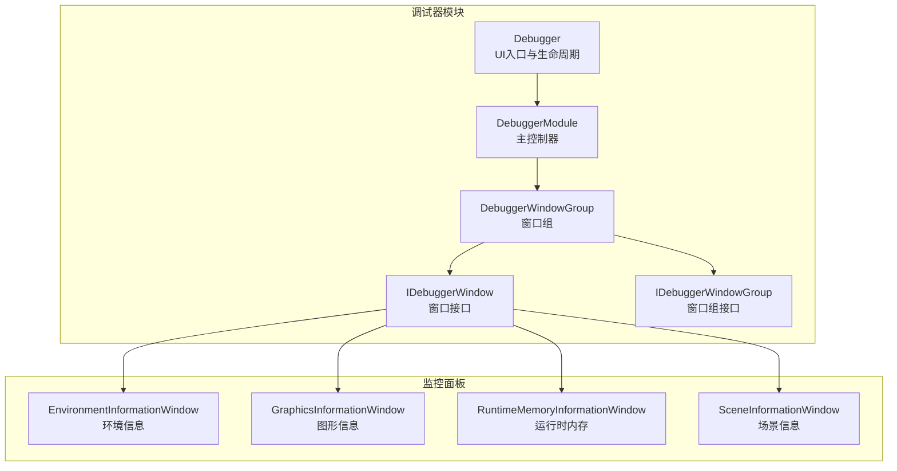
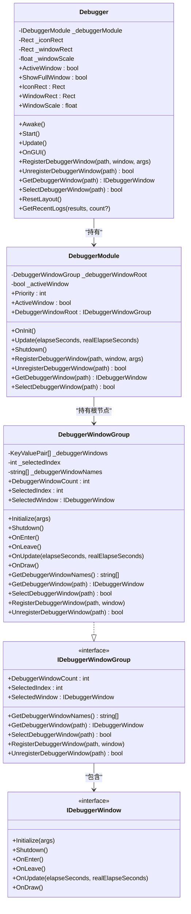
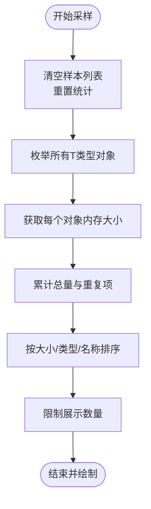
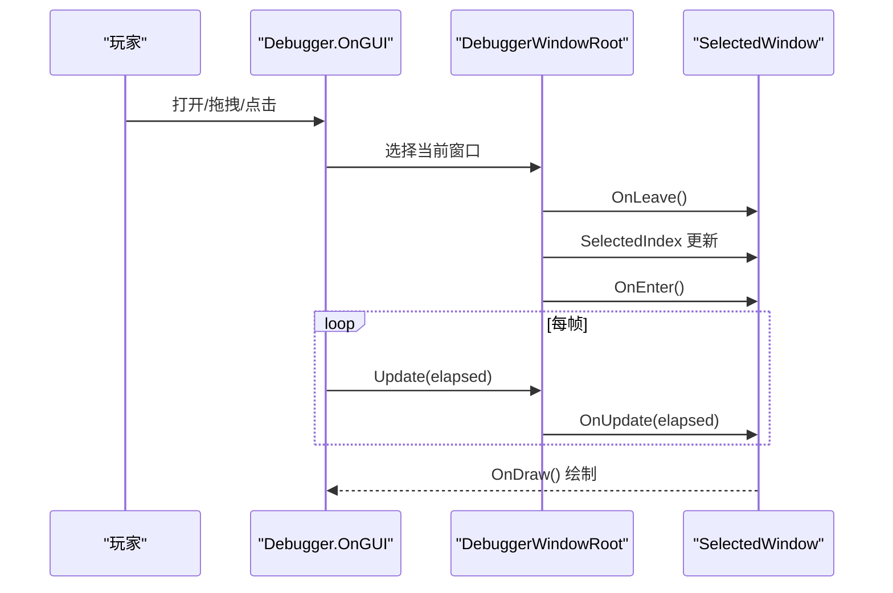
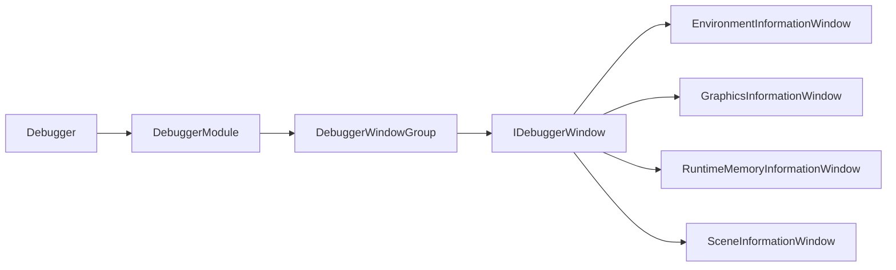

# 调试器监控功能

<cite>
**本文引用的文件**
- [DebuggerModule.cs](file://Assets/TEngine/Runtime/Module/DebugerModule/DebuggerModule.cs)
- [Debugger.cs](file://Assets/TEngine/Runtime/Module/DebugerModule/Debugger.cs)
- [DebuggerManager.DebuggerWindowGroup.cs](file://Assets/TEngine/Runtime/Module/DebugerModule/DebuggerManager.DebuggerWindowGroup.cs)
- [IDebuggerWindow.cs](file://Assets/TEngine/Runtime/Module/DebugerModule/IDebuggerWindow.cs)
- [IDebuggerWindowGroup.cs](file://Assets/TEngine/Runtime/Module/DebugerModule/IDebuggerWindowGroup.cs)
- [EnvironmentInformationWindow.cs](file://Assets/TEngine/Runtime/Module/DebugerModule/Component/DebuggerModule.EnvironmentInformationWindow.cs)
- [GraphicsInformationWindow.cs](file://Assets/TEngine/Runtime/Module/DebugerModule/Component/DebuggerModule.GraphicsInformationWindow.cs)
- [RuntimeMemoryInformationWindow.cs](file://Assets/TEngine/Runtime/Module/DebugerModule/Component/DebuggerModule.RuntimeMemoryInformationWindow.cs)
- [SceneInformationWindow.cs](file://Assets/TEngine/Runtime/Module/DebugerModule/Component/DebuggerModule.SceneInformationWindow.cs)
</cite>

## 目录
1. [简介](#简介)
2. [项目结构](#项目结构)
3. [核心组件](#核心组件)
4. [架构总览](#架构总览)
5. [详细组件分析](#详细组件分析)
6. [依赖关系分析](#依赖关系分析)
7. [性能考量](#性能考量)
8. [故障排查指南](#故障排查指南)
9. [结论](#结论)
10. [附录](#附录)

## 简介
本文件面向TEngine调试器监控功能，系统化梳理调试器模块的整体架构与实现细节，重点覆盖以下方面：
- 调试器主控制器的职责与生命周期
- 各类监控窗口的实现机制与数据来源
- 调试器窗口树形组织与选择切换流程
- 实时监控机制（采样频率、刷新策略、性能影响）
- 配置项与使用方法（启用方式、自定义指标、数据导出）

## 项目结构
调试器模块位于TEngine运行时模块的DebugerModule目录下，采用“主控制器 + 窗口组 + 多个具体监控面板”的分层架构。主控制器负责窗口注册、选择与更新；窗口组负责树形组织与导航；各监控面板负责采集与展示具体指标。

图表来源
- [DebuggerModule.cs:1-116](file://Assets/TEngine/Runtime/Module/DebugerModule/DebuggerModule.cs#L1-L116)
- [Debugger.cs:1-429](file://Assets/TEngine/Runtime/Module/DebugerModule/Debugger.cs#L1-L429)
- [DebuggerManager.DebuggerWindowGroup.cs:1-294](file://Assets/TEngine/Runtime/Module/DebugerModule/DebuggerManager.DebuggerWindowGroup.cs#L1-L294)
- [IDebuggerWindow.cs:1-42](file://Assets/TEngine/Runtime/Module/DebugerModule/IDebuggerWindow.cs#L1-L42)
- [IDebuggerWindowGroup.cs:1-53](file://Assets/TEngine/Runtime/Module/DebugerModule/IDebuggerWindowGroup.cs#L1-L53)
- [EnvironmentInformationWindow.cs:1-72](file://Assets/TEngine/Runtime/Module/DebugerModule/Component/DebuggerModule.EnvironmentInformationWindow.cs#L1-L72)
- [GraphicsInformationWindow.cs:1-163](file://Assets/TEngine/Runtime/Module/DebugerModule/Component/DebuggerModule.GraphicsInformationWindow.cs#L1-L163)
- [RuntimeMemoryInformationWindow.cs:1-135](file://Assets/TEngine/Runtime/Module/DebugerModule/Component/DebuggerModule.RuntimeMemoryInformationWindow.cs#L1-L135)
- [SceneInformationWindow.cs:1-38](file://Assets/TEngine/Runtime/Module/DebugerModule/Component/DebuggerModule.SceneInformationWindow.cs#L1-L38)

章节来源
- [DebuggerModule.cs:1-116](file://Assets/TEngine/Runtime/Module/DebugerModule/DebuggerModule.cs#L1-L116)
- [Debugger.cs:1-429](file://Assets/TEngine/Runtime/Module/DebugerModule/Debugger.cs#L1-L429)
- [DebuggerManager.DebuggerWindowGroup.cs:1-294](file://Assets/TEngine/Runtime/Module/DebugerModule/DebuggerManager.DebuggerWindowGroup.cs#L1-L294)

## 核心组件
- 主控制器（DebuggerModule）
  - 负责窗口注册、选择、查询与统一更新；维护窗口根节点与激活状态；在每帧调用窗口组的更新回调。
- 调试器（Debugger）
  - 负责UI呈现、布局持久化、窗口激活策略、FPS计数与日志聚合；作为UI入口与生命周期管理。
- 窗口组（DebuggerWindowGroup）
  - 树形组织窗口，支持多级路径注册；负责当前选中窗口的进入/离开与绘制；提供窗口名列表与选择索引。
- 接口（IDebuggerWindow / IDebuggerWindowGroup）
  - 统一窗口生命周期：Initialize/Shutdown/OnEnter/OnLeave/OnUpdate/OnDraw；窗口组扩展包含选中窗口与路径查询能力。

章节来源
- [DebuggerModule.cs:1-116](file://Assets/TEngine/Runtime/Module/DebugerModule/DebuggerModule.cs#L1-L116)
- [Debugger.cs:1-429](file://Assets/TEngine/Runtime/Module/DebugerModule/Debugger.cs#L1-L429)
- [DebuggerManager.DebuggerWindowGroup.cs:1-294](file://Assets/TEngine/Runtime/Module/DebugerModule/DebuggerManager.DebuggerWindowGroup.cs#L1-L294)
- [IDebuggerWindow.cs:1-42](file://Assets/TEngine/Runtime/Module/DebugerModule/IDebuggerWindow.cs#L1-L42)
- [IDebuggerWindowGroup.cs:1-53](file://Assets/TEngine/Runtime/Module/DebugerModule/IDebuggerWindowGroup.cs#L1-L53)

## 架构总览
调试器采用“主控制器 + 窗口组 + 多面板”的层次化设计。主控制器持有窗口根节点，窗口组以键值对形式保存窗口或子组；UI层通过路径注册与选择，驱动当前选中窗口的绘制与更新。

图表来源
- [DebuggerModule.cs:1-116](file://Assets/TEngine/Runtime/Module/DebugerModule/DebuggerModule.cs#L1-L116)
- [Debugger.cs:1-429](file://Assets/TEngine/Runtime/Module/DebugerModule/Debugger.cs#L1-L429)
- [DebuggerManager.DebuggerWindowGroup.cs:1-294](file://Assets/TEngine/Runtime/Module/DebugerModule/DebuggerManager.DebuggerWindowGroup.cs#L1-L294)
- [IDebuggerWindow.cs:1-42](file://Assets/TEngine/Runtime/Module/DebugerModule/IDebuggerWindow.cs#L1-L42)
- [IDebuggerWindowGroup.cs:1-53](file://Assets/TEngine/Runtime/Module/DebugerModule/IDebuggerWindowGroup.cs#L1-L53)

## 详细组件分析

### 主控制器（DebuggerModule）
- 职责
  - 管理窗口根节点与激活状态
  - 提供注册/注销/查询/选择窗口的统一入口
  - 在每帧将更新传递给当前选中窗口组
- 生命周期
  - OnInit：初始化根节点与默认状态
  - Update：当激活时，将更新事件转发给根节点
  - Shutdown：关闭所有窗口并重置状态
- 窗口注册
  - 支持“路径/层级”注册，自动构建窗口组树
  - 对重复注册与非法路径进行校验与异常处理

章节来源
- [DebuggerModule.cs:1-116](file://Assets/TEngine/Runtime/Module/DebugerModule/DebuggerModule.cs#L1-L116)
- [DebuggerManager.DebuggerWindowGroup.cs:188-230](file://Assets/TEngine/Runtime/Module/DebugerModule/DebuggerManager.DebuggerWindowGroup.cs#L188-L230)

### 调试器（Debugger）
- 职责
  - UI入口：悬浮图标与完整窗口两种形态
  - 生命周期：Awake/Start/Update/OnGUI/Shutdown
  - 激活策略：根据构建类型与编辑器状态决定是否开启
  - 数据聚合：FPS计数、日志收集、窗口布局持久化
- 窗口注册清单
  - 控制台、系统/环境/屏幕/图形信息、输入（汇总/触控/定位/加速度/陀螺仪/罗盘）、其他（场景/路径/时间/质量）、性能（概览/内存/对象池/引用池）、设置
- 刷新与绘制
  - 每帧更新FPS计数
  - OnGUI中根据激活状态与显示模式绘制窗口或图标
  - 图标模式根据日志级别动态改变颜色与提示

章节来源
- [Debugger.cs:1-429](file://Assets/TEngine/Runtime/Module/DebugerModule/Debugger.cs#L1-L429)

### 窗口组（DebuggerWindowGroup）
- 职责
  - 维护窗口列表与选中索引
  - 提供路径解析与递归选择
  - 将进入/离开/更新/绘制事件传递给当前选中窗口
- 路径注册与注销
  - 支持“父/子”层级路径，自动创建中间组
  - 注销时关闭对应窗口并刷新名称缓存
- 选择切换
  - 通过工具栏索引切换当前选中窗口
  - 切换时触发OnLeave/OnEnter

章节来源
- [DebuggerManager.DebuggerWindowGroup.cs:1-294](file://Assets/TEngine/Runtime/Module/DebugerModule/DebuggerManager.DebuggerWindowGroup.cs#L1-L294)

### 监控面板：环境信息（EnvironmentInformationWindow）
- 功能特性
  - 展示产品名称、公司、平台、语言、帧率、网络可达性、沙箱类型、移动/主机平台标识、编辑器与调试构建状态等
  - 使用条件编译适配不同Unity版本字段
- 数据来源
  - Unity Application与SystemInfo相关属性
- 适用场景
  - 快速确认运行环境与构建配置

章节来源
- [EnvironmentInformationWindow.cs:1-72](file://Assets/TEngine/Runtime/Module/DebugerModule/Component/DebuggerModule.EnvironmentInformationWindow.cs#L1-L72)

### 监控面板：图形信息（GraphicsInformationWindow）
- 功能特性
  - 展示显卡ID/名称/厂商、设备类型/版本、显存、多线程渲染、着色器等级、全局LOD、渲染管线、纹理与渲染目标支持能力等
  - 使用条件编译适配不同Unity版本能力
- 数据来源
  - SystemInfo与Graphics相关属性
- 适用场景
  - 分析图形能力与渲染限制，辅助优化与兼容性判断

章节来源
- [GraphicsInformationWindow.cs:1-163](file://Assets/TEngine/Runtime/Module/DebugerModule/Component/DebuggerModule.GraphicsInformationWindow.cs#L1-L163)

### 监控面板：运行时内存（RuntimeMemoryInformationWindow<T>）
- 功能特性
  - 采样指定Unity Object类型的内存占用，按大小排序展示
  - 支持手动触发采样，显示采样时间、总量与重复项高亮
  - 限制展示条目数量，避免UI过载
- 数据来源与算法
  - 通过Resources.FindObjectsOfTypeAll<T>()枚举对象
  - 使用Profiler.GetRuntimeMemorySizeLong/GetRuntimeMemorySize获取单对象大小
  - 排序规则：先按大小降序，再按类型与名称排序
- 性能注意
  - FindObjectsOfTypeAll会遍历所有资源，建议在空闲时段或小规模场景采样
  - 大量对象时排序与UI绘制可能产生额外开销

图表来源
- [RuntimeMemoryInformationWindow.cs:82-131](file://Assets/TEngine/Runtime/Module/DebugerModule/Component/DebuggerModule.RuntimeMemoryInformationWindow.cs#L82-L131)

章节来源
- [RuntimeMemoryInformationWindow.cs:1-135](file://Assets/TEngine/Runtime/Module/DebugerModule/Component/DebuggerModule.RuntimeMemoryInformationWindow.cs#L1-L135)

### 监控面板：场景信息（SceneInformationWindow）
- 功能特性
  - 展示场景总数、构建内场景数、活动场景句柄/名称/路径/构建索引、脏/加载/有效/根节点数、子场景标记等
- 数据来源
  - Unity SceneManager与Scene相关属性
- 适用场景
  - 场景加载与切换诊断，验证场景有效性与根节点数量

章节来源
- [SceneInformationWindow.cs:1-38](file://Assets/TEngine/Runtime/Module/DebugerModule/Component/DebuggerModule.SceneInformationWindow.cs#L1-L38)

### 调试器窗口生命周期与交互序列

图表来源
- [Debugger.cs:242-389](file://Assets/TEngine/Runtime/Module/DebugerModule/Debugger.cs#L242-L389)
- [DebuggerModule.cs:45-53](file://Assets/TEngine/Runtime/Module/DebugerModule/DebuggerModule.cs#L45-L53)
- [DebuggerManager.DebuggerWindowGroup.cs:82-110](file://Assets/TEngine/Runtime/Module/DebugerModule/DebuggerManager.DebuggerWindowGroup.cs#L82-L110)

## 依赖关系分析
- 松耦合
  - 窗口与窗口组通过接口解耦，便于扩展新面板
  - 主控制器仅依赖接口，不关心具体实现
- 耦合点
  - Debugger持有具体面板实例并在Start中集中注册，形成对面板实现的直接依赖
  - 窗口组内部使用键值对存储，路径解析与选择逻辑集中于单一类
- 可能的循环依赖
  - 当前结构无循环依赖迹象；新增面板需遵循接口约定，避免反向依赖

图表来源
- [Debugger.cs:183-235](file://Assets/TEngine/Runtime/Module/DebugerModule/Debugger.cs#L183-L235)
- [DebuggerModule.cs:67-114](file://Assets/TEngine/Runtime/Module/DebugerModule/DebuggerModule.cs#L67-L114)
- [DebuggerManager.DebuggerWindowGroup.cs:188-230](file://Assets/TEngine/Runtime/Module/DebugerModule/DebuggerManager.DebuggerWindowGroup.cs#L188-L230)

章节来源
- [Debugger.cs:183-235](file://Assets/TEngine/Runtime/Module/DebugerModule/Debugger.cs#L183-L235)
- [DebuggerModule.cs:67-114](file://Assets/TEngine/Runtime/Module/DebugerModule/DebuggerModule.cs#L67-L114)
- [DebuggerManager.DebuggerWindowGroup.cs:188-230](file://Assets/TEngine/Runtime/Module/DebugerModule/DebuggerManager.DebuggerWindowGroup.cs#L188-L230)

## 性能考量
- 采样频率与刷新策略
  - FPS计数器在每帧更新，开销极低
  - 窗口组更新在主控制器Update中转发，仅在激活状态下执行
  - 运行时内存采样为手动触发，避免频繁扫描
- 性能影响
  - 运行时内存采样涉及全量对象枚举与Profiler查询，建议在非关键帧或离线阶段执行
  - 大量UI绘制与排序可能带来额外开销，面板已限制展示数量
- 优化建议
  - 将高频采样移至空闲时段
  - 对大对象集合采用分批采样或抽样策略
  - 避免在热路径中频繁创建临时对象

## 故障排查指南
- 调试器不显示
  - 检查激活策略：AlwaysOpen/OnlyOpenWhenDevelopment/OnlyOpenInEditor
  - 确认主控制器可用与窗口根节点已初始化
- 窗口无法切换
  - 检查路径是否正确，是否存在重复注册或非法路径
  - 确认窗口组的选中索引与名称缓存是否一致
- 内存采样异常
  - 确认对象类型T是否可被FindObjectsOfTypeAll检索
  - 检查Profiler接口可用性（不同Unity版本差异）
- 日志与布局
  - 日志通过控制台窗口聚合；布局位置与缩放通过PlayerPrefs持久化

章节来源
- [Debugger.cs:217-234](file://Assets/TEngine/Runtime/Module/DebugerModule/Debugger.cs#L217-L234)
- [DebuggerModule.cs:72-84](file://Assets/TEngine/Runtime/Module/DebugerModule/DebuggerModule.cs#L72-L84)
- [DebuggerManager.DebuggerWindowGroup.cs:194-230](file://Assets/TEngine/Runtime/Module/DebugerModule/DebuggerManager.DebuggerWindowGroup.cs#L194-L230)
- [RuntimeMemoryInformationWindow.cs:90-114](file://Assets/TEngine/Runtime/Module/DebugerModule/Component/DebuggerModule.RuntimeMemoryInformationWindow.cs#L90-L114)

## 结论
TEngine调试器监控功能以清晰的分层架构实现了从主控制器到窗口组再到具体面板的职责分离，具备良好的可扩展性与可维护性。通过路径化的窗口注册与树形导航，用户可以快速定位并查看各类运行时指标。针对高频采样与UI绘制，建议结合业务节奏进行优化，确保调试体验与性能平衡。

## 附录
- 启用与使用
  - 通过激活策略自动或手动开启调试器
  - 在完整窗口模式下使用工具栏切换面板
  - 运行时内存面板通过按钮触发采样
- 自定义监控指标
  - 新增面板需实现IDebuggerWindow接口
  - 通过RegisterDebuggerWindow(path, window)注册到指定路径
- 导出监控数据
  - 当前实现未内置导出功能；可通过复制面板内容或扩展面板输出接口实现