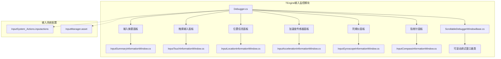
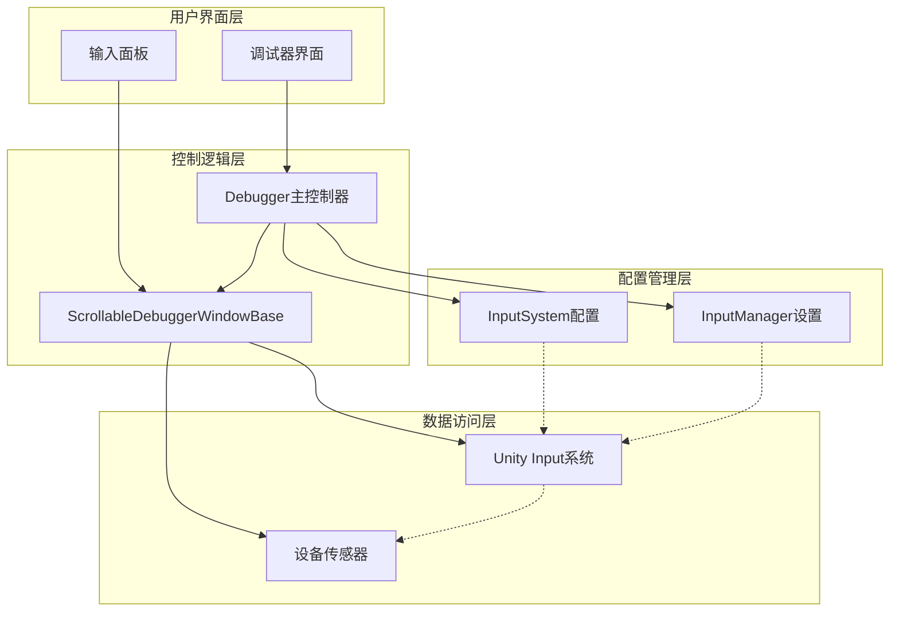
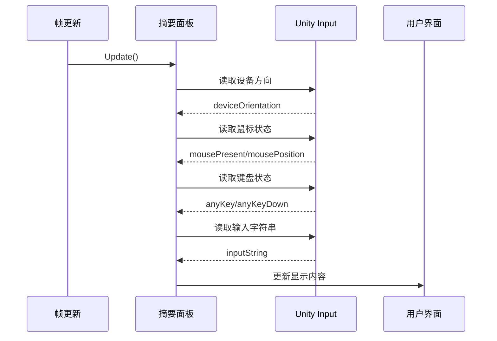
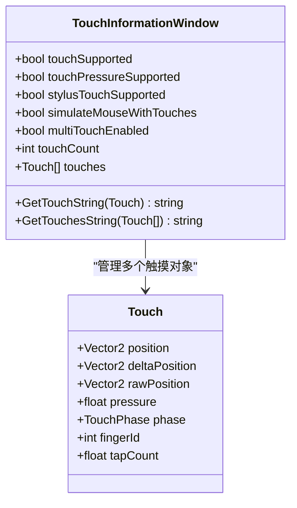
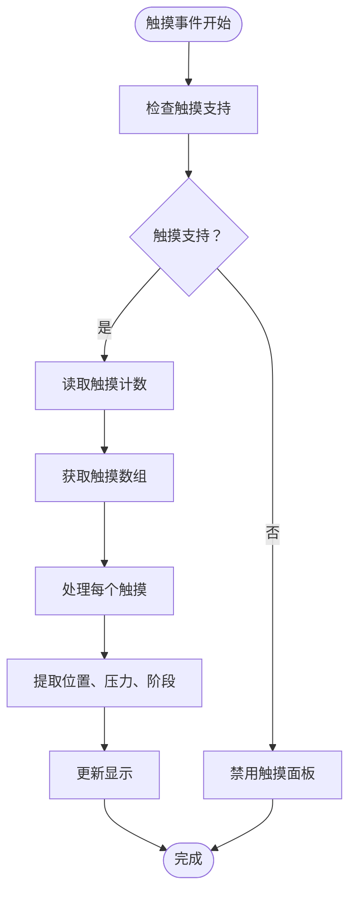
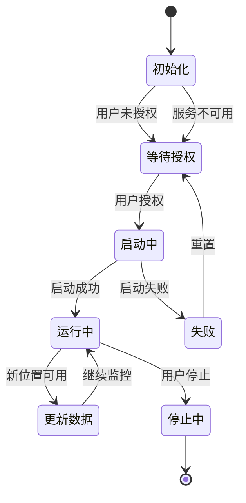
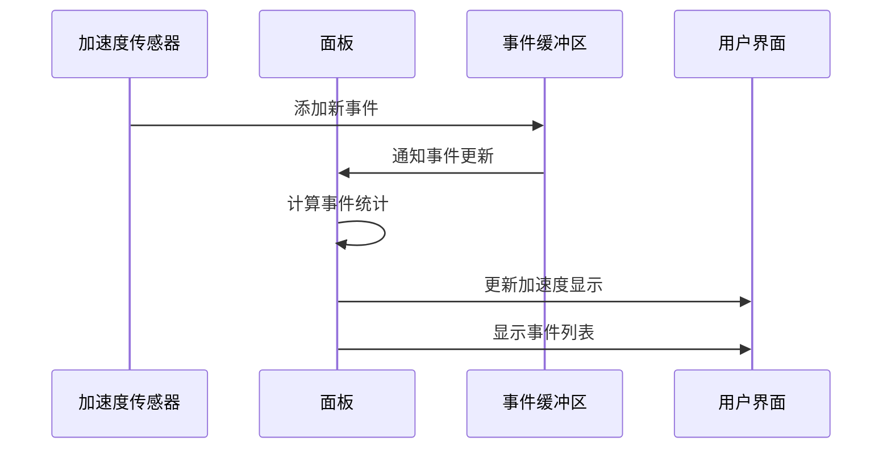
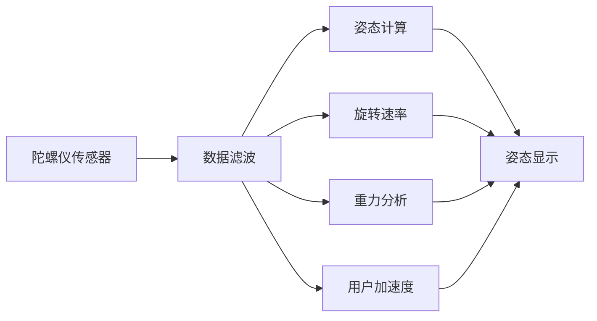
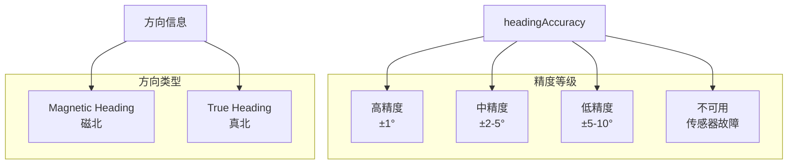
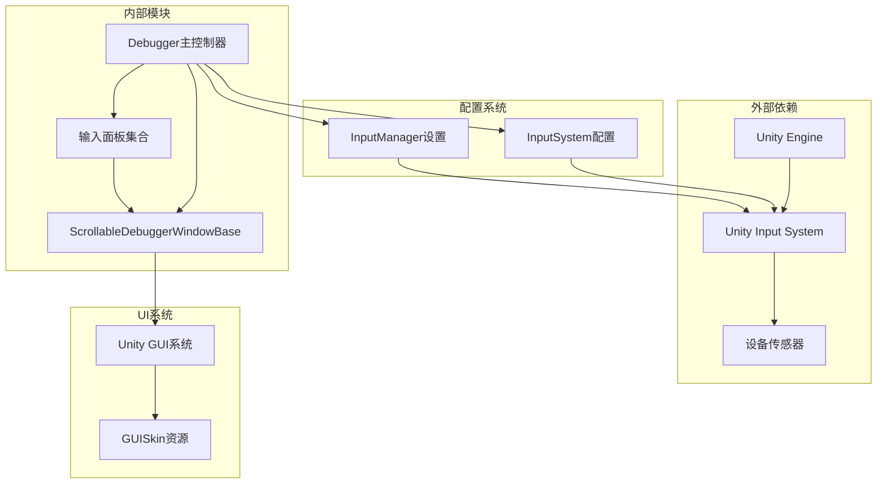

# 输入监控面板

<cite>
**本文档引用的文件**
- [Debugger.cs](file://Assets/TEngine/Runtime/Module/DebugerModule/Debugger.cs)
- [DebuggerModule.ScrollableDebuggerWindowBase.cs](file://Assets/TEngine/Runtime/Module/DebugerModule/Component/DebuggerModule.ScrollableDebuggerWindowBase.cs)
- [DebuggerModule.InputSummaryInformationWindow.cs](file://Assets/TEngine/Runtime/Module/DebugerModule/Component/DebuggerModule.InputSummaryInformationWindow.cs)
- [DebuggerModule.InputTouchInformationWindow.cs](file://Assets/TEngine/Runtime/Module/DebugerModule/Component/DebuggerModule.InputTouchInformationWindow.cs)
- [DebuggerModule.InputLocationInformationWindow.cs](file://Assets/TEngine/Runtime/Module/DebugerModule/Component/DebuggerModule.InputLocationInformationWindow.cs)
- [DebuggerModule.InputAccelerationInformationWindow.cs](file://Assets/TEngine/Runtime/Module/DebugerModule/Component/DebuggerModule.InputAccelerationInformationWindow.cs)
- [DebuggerModule.InputGyroscopeInformationWindow.cs](file://Assets/TEngine/Runtime/Module/DebugerModule/Component/DebuggerModule.InputGyroscopeInformationWindow.cs)
- [DebuggerModule.InputCompassInformationWindow.cs](file://Assets/TEngine/Runtime/Module/DebugerModule/Component/DebuggerModule.InputCompassInformationWindow.cs)
- [InputSystem_Actions.inputactions](file://Assets/TEngine/Extension/InputModule/InputSystem_Actions.inputactions)
- [InputManager.asset](file://ProjectSettings/InputManager.asset)
</cite>

## 目录
1. [简介](#简介)
2. [项目结构](#项目结构)
3. [核心组件](#核心组件)
4. [架构概览](#架构概览)
5. [详细组件分析](#详细组件分析)
6. [依赖关系分析](#依赖关系分析)
7. [性能考虑](#性能考虑)
8. [故障排除指南](#故障排除指南)
9. [结论](#结论)

## 简介

TEngine输入监控面板是Unity引擎中一个强大的调试工具集，专门用于实时监控和分析游戏中的各种输入设备和传感器数据。该系统提供了全面的输入系统可视化功能，包括当前活跃的输入设备检测、输入事件统计、输入延迟测量、触摸输入面板、位置信息面板、加速度传感器面板、陀螺仪面板和指南针面板等功能。

这个输入监控系统基于Unity的原生Input系统构建，通过TEngine的调试器模块进行集成，为开发者提供了深入了解游戏输入行为的宝贵工具。系统支持多种输入源，包括键盘、鼠标、触摸屏、游戏手柄以及移动设备的传感器（加速度计、陀螺仪、指南针）。

## 项目结构

TEngine输入监控面板的代码组织遵循模块化设计原则，主要分布在以下目录结构中：

**图表来源**
- [Debugger.cs:1-429](file://Assets/TEngine/Runtime/Module/DebugerModule/Debugger.cs#L1-L429)
- [DebuggerModule.ScrollableDebuggerWindowBase.cs:1-93](file://Assets/TEngine/Runtime/Module/DebugerModule/Component/DebuggerModule.ScrollableDebuggerWindowBase.cs#L1-L93)

**章节来源**
- [Debugger.cs:1-429](file://Assets/TEngine/Runtime/Module/DebugerModule/Debugger.cs#L1-L429)
- [DebuggerModule.ScrollableDebuggerWindowBase.cs:1-93](file://Assets/TEngine/Runtime/Module/DebugerModule/Component/DebuggerModule.ScrollableDebuggerWindowBase.cs#L1-L93)

## 核心组件

TEngine输入监控面板的核心由以下几个关键组件构成：

### 调试器主控制器
`Debugger`类作为整个输入监控系统的中央控制器，负责管理所有输入相关的调试窗口，并提供统一的接口来访问Unity的Input系统。

### 可滚动调试窗口基类
`ScrollableDebuggerWindowBase`提供了所有输入面板的通用功能，包括滚动视图支持、数据格式化、剪贴板复制等。

### 输入面板集合
系统包含六个专门的输入面板，每个都针对特定类型的输入设备或传感器：

1. **输入摘要面板** - 提供全局输入状态概览
2. **触摸输入面板** - 监控触摸屏交互
3. **位置信息面板** - 处理GPS定位服务
4. **加速度传感器面板** - 分析设备运动
5. **陀螺仪面板** - 监测设备旋转
6. **指南针面板** - 获取方向信息

**章节来源**
- [Debugger.cs:58-63](file://Assets/TEngine/Runtime/Module/DebugerModule/Debugger.cs#L58-L63)
- [DebuggerModule.ScrollableDebuggerWindowBase.cs:7-41](file://Assets/TEngine/Runtime/Module/DebugerModule/Component/DebuggerModule.ScrollableDebuggerWindowBase.cs#L7-L41)

## 架构概览

TEngine输入监控面板采用分层架构设计，确保了良好的可维护性和扩展性：

**图表来源**
- [Debugger.cs:148-235](file://Assets/TEngine/Runtime/Module/DebugerModule/Debugger.cs#L148-L235)
- [InputSystem_Actions.inputactions:1-1057](file://Assets/TEngine/Extension/InputModule/InputSystem_Actions.inputactions#L1-L1057)

系统的核心工作流程如下：

1. **初始化阶段**：Debugger在Awake方法中初始化，创建所有输入面板实例
2. **注册阶段**：在Start方法中，所有输入面板被注册到调试器窗口系统
3. **运行时监控**：每个帧更新时，面板从Unity Input系统读取最新数据
4. **用户交互**：用户可以通过按钮启用/禁用传感器功能

**章节来源**
- [Debugger.cs:148-235](file://Assets/TEngine/Runtime/Module/DebugerModule/Debugger.cs#L148-L235)

## 详细组件分析

### 输入摘要面板

输入摘要面板提供了一个全面的输入系统概览，包含了所有基本输入状态的信息。

#### 功能特性
- 设备方向检测（deviceOrientation）
- 鼠标状态监控（mousePresent, mousePosition, mouseScrollDelta）
- 键盘输入检测（anyKey, anyKeyDown, inputString）
- 输入法编辑器状态（imeIsSelected, imeCompositionMode）
- 组合输入支持（compositionCursorPos, compositionString）

#### 数据流分析

**图表来源**
- [DebuggerModule.InputSummaryInformationWindow.cs:9-29](file://Assets/TEngine/Runtime/Module/DebugerModule/Component/DebuggerModule.InputSummaryInformationWindow.cs#L9-L29)

**章节来源**
- [DebuggerModule.InputSummaryInformationWindow.cs:1-33](file://Assets/TEngine/Runtime/Module/DebugerModule/Component/DebuggerModule.InputSummaryInformationWindow.cs#L1-L33)

### 触摸输入面板

触摸输入面板专注于移动设备的触摸交互监控，提供了详细的触摸数据统计。

#### 核心功能
- 触摸支持检测（touchSupported, touchPressureSupported, stylusTouchSupported）
- 触摸模拟设置（simulateMouseWithTouches, multiTouchEnabled）
- 实时触摸统计（touchCount）
- 触摸事件详情（position, deltaPosition, rawPosition, pressure, phase）

#### 触摸数据结构

**图表来源**
- [DebuggerModule.InputTouchInformationWindow.cs:25-40](file://Assets/TEngine/Runtime/Module/DebugerModule/Component/DebuggerModule.InputTouchInformationWindow.cs#L25-L40)

#### 触摸事件处理流程

**图表来源**
- [DebuggerModule.InputTouchInformationWindow.cs:9-23](file://Assets/TEngine/Runtime/Module/DebugerModule/Component/DebuggerModule.InputTouchInformationWindow.cs#L9-L23)

**章节来源**
- [DebuggerModule.InputTouchInformationWindow.cs:1-43](file://Assets/TEngine/Runtime/Module/DebugerModule/Component/DebuggerModule.InputTouchInformationWindow.cs#L1-L43)

### 位置信息面板

位置信息面板处理GPS定位服务，为需要地理位置功能的游戏提供监控能力。

#### 主要功能
- 定位服务启停控制
- 用户授权状态检查
- 定位服务状态监控
- 精度分析（水平精度、垂直精度）
- 坐标数据（经度、纬度、海拔）
- 时间戳跟踪

#### 定位服务生命周期

**图表来源**
- [DebuggerModule.InputLocationInformationWindow.cs:14-39](file://Assets/TEngine/Runtime/Module/DebugerModule/Component/DebuggerModule.InputLocationInformationWindow.cs#L14-L39)

**章节来源**
- [DebuggerModule.InputLocationInformationWindow.cs:1-44](file://Assets/TEngine/Runtime/Module/DebugerModule/Component/DebuggerModule.InputLocationInformationWindow.cs#L1-L44)

### 加速度传感器面板

加速度传感器面板监控设备的线性加速度变化，为动作游戏和物理模拟提供精确的数据。

#### 数据特性
- 当前加速度向量
- 加速度事件计数
- 事件历史记录（accelerationEvents）
- 每个事件的时间增量

#### 加速度数据处理

**图表来源**
- [DebuggerModule.InputAccelerationInformationWindow.cs:9-19](file://Assets/TEngine/Runtime/Module/DebugerModule/Component/DebuggerModule.InputAccelerationInformationWindow.cs#L9-L19)

**章节来源**
- [DebuggerModule.InputAccelerationInformationWindow.cs:1-39](file://Assets/TEngine/Runtime/Module/DebugerModule/Component/DebuggerModule.InputAccelerationInformationWindow.cs#L1-L39)

### 陀螺仪面板

陀螺仪面板监测设备的角速度和姿态变化，为3D游戏和VR应用提供精确的方向信息。

#### 关键功能
- 陀螺仪启停控制
- 更新间隔设置
- 姿态角（attitude）计算
- 重力向量分析
- 旋转速率监控
- 无偏旋转速率
- 用户加速度

#### 陀螺仪数据流

**图表来源**
- [DebuggerModule.InputGyroscopeInformationWindow.cs:27-36](file://Assets/TEngine/Runtime/Module/DebugerModule/Component/DebuggerModule.InputGyroscopeInformationWindow.cs#L27-L36)

**章节来源**
- [DebuggerModule.InputGyroscopeInformationWindow.cs:1-43](file://Assets/TEngine/Runtime/Module/DebugerModule/Component/DebuggerModule.InputGyroscopeInformationWindow.cs#L1-L43)

### 指南针面板

指南针面板提供设备的磁北方向信息，支持需要方向导航的应用场景。

#### 功能特性
- 指南针启停控制
- 方位精度分析（headingAccuracy）
- 磁北方向（magneticHeading）
- 真北方向（trueHeading）
- 原始磁场向量（rawVector）
- 时间戳同步

#### 指南针数据精度

**图表来源**
- [DebuggerModule.InputCompassInformationWindow.cs:28-35](file://Assets/TEngine/Runtime/Module/DebugerModule/Component/DebuggerModule.InputCompassInformationWindow.cs#L28-L35)

**章节来源**
- [DebuggerModule.InputCompassInformationWindow.cs:1-41](file://Assets/TEngine/Runtime/Module/DebugerModule/Component/DebuggerModule.InputCompassInformationWindow.cs#L1-L41)

## 依赖关系分析

TEngine输入监控面板的依赖关系体现了清晰的层次结构：

**图表来源**
- [Debugger.cs:1-429](file://Assets/TEngine/Runtime/Module/DebugerModule/Debugger.cs#L1-L429)
- [InputSystem_Actions.inputactions:1-800](file://Assets/TEngine/Extension/InputModule/InputSystem_Actions.inputactions#L1-L800)

### 关键依赖点

1. **Unity Input系统**：所有面板直接依赖于Unity的Input类
2. **设备传感器**：加速度计、陀螺仪、指南针等硬件传感器
3. **UI系统**：使用Unity的GUI系统进行界面渲染
4. **配置系统**：依赖InputSystem配置和InputManager设置

**章节来源**
- [Debugger.cs:161-181](file://Assets/TEngine/Runtime/Module/DebugerModule/Debugger.cs#L161-L181)

## 性能考虑

TEngine输入监控面板在设计时充分考虑了性能影响，采用了多种优化策略：

### 内存管理优化
- 使用单例模式确保Debugger实例唯一性
- 面板数据采用按需读取，避免不必要的内存分配
- 字符串拼接使用StringBuilder优化（在底层实现中）

### CPU性能优化
- 面板只在调试器激活时更新
- 使用轻量级的GUI绘制方法
- 避免在每帧进行复杂的数学运算

### 传感器性能优化
- 陀螺仪和指南针提供更新间隔设置
- 传感器数据读取采用非阻塞方式
- 支持动态启停传感器以节省电量

### 最佳实践建议

1. **条件编译**：在发布版本中禁用调试器
2. **按需更新**：只在需要时启用传感器
3. **批量处理**：合并相似的UI更新操作
4. **缓存策略**：缓存昂贵的计算结果

## 故障排除指南

### 常见问题诊断

#### 传感器无法启用
**症状**：点击启用按钮后状态没有改变
**可能原因**：
- 设备不支持相应传感器
- 权限未授予
- 硬件故障

**解决步骤**：
1. 检查设备兼容性
2. 验证应用权限
3. 测试其他应用的传感器功能

#### 触摸数据异常
**症状**：触摸坐标显示错误或跳变
**可能原因**：
- 屏幕校准问题
- 多点触控冲突
- 输入延迟

**解决步骤**：
1. 重新校准触摸屏
2. 检查多点触控设置
3. 减少系统负载

#### 定位服务失效
**症状**：GPS数据长时间无更新
**可能原因**：
- 室内环境信号弱
- 电池优化限制
- 系统权限问题

**解决步骤**：
1. 移动到开阔区域
2. 关闭电池优化
3. 重新授予权限

### 调试技巧

1. **分步调试**：逐个启用传感器面板进行测试
2. **对比分析**：同时运行多个面板对比数据一致性
3. **日志记录**：记录异常情况的时间和环境条件
4. **设备测试**：在不同设备上验证功能一致性

**章节来源**
- [DebuggerModule.InputLocationInformationWindow.cs:14-39](file://Assets/TEngine/Runtime/Module/DebugerModule/Component/DebuggerModule.InputLocationInformationWindow.cs#L14-L39)

## 结论

TEngine输入监控面板是一个功能完整、设计精良的调试工具集，为Unity游戏开发提供了强大的输入系统可视化能力。系统通过模块化设计实现了高度的可维护性和扩展性，同时在性能优化方面也做出了充分考虑。

### 主要优势

1. **全面覆盖**：支持从基本输入到高级传感器的全方位监控
2. **易于使用**：直观的界面设计和丰富的交互功能
3. **性能友好**：最小化对游戏运行时性能的影响
4. **扩展性强**：清晰的架构便于添加新的输入类型支持

### 技术亮点

- 基于Unity原生Input系统的可靠实现
- 模块化的面板设计，便于独立开发和测试
- 完善的错误处理和设备兼容性检查
- 优化的内存和CPU使用策略

### 应用价值

该输入监控面板不仅为开发者提供了深入了解游戏输入行为的工具，也为游戏优化和调试提供了重要的数据支持。通过实时监控各种输入设备的状态，开发者可以更好地理解玩家的交互模式，优化游戏体验，并快速定位和解决输入相关的问题。

随着移动设备和VR/AR技术的发展，TEngine输入监控面板将继续演进，为未来的输入技术提供更好的支持和监控能力。