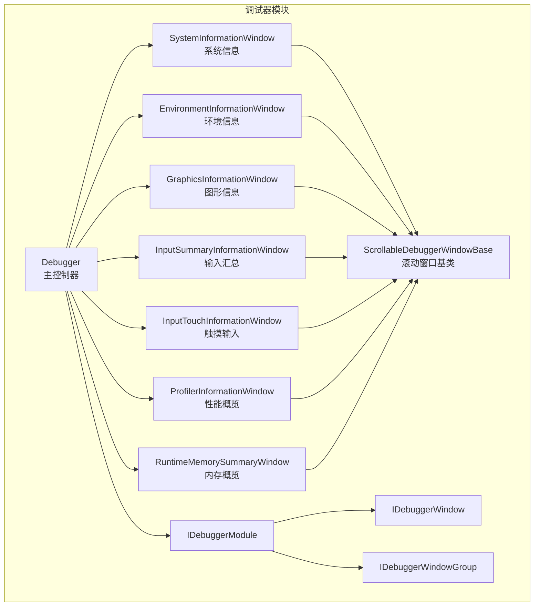
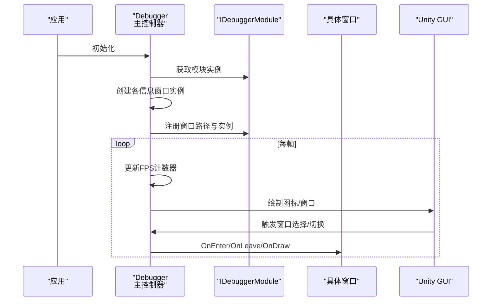
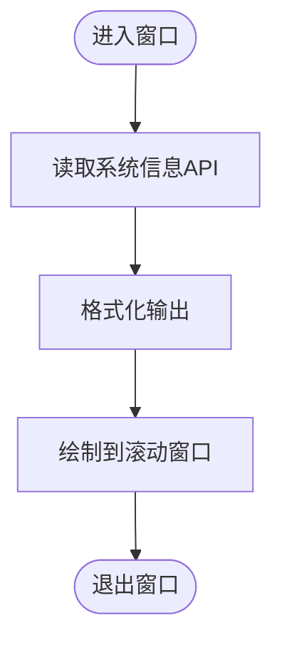
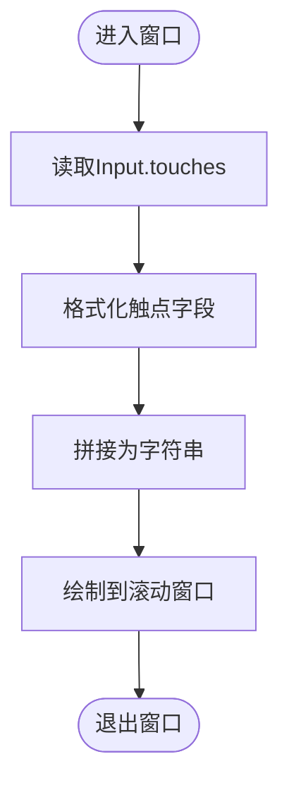
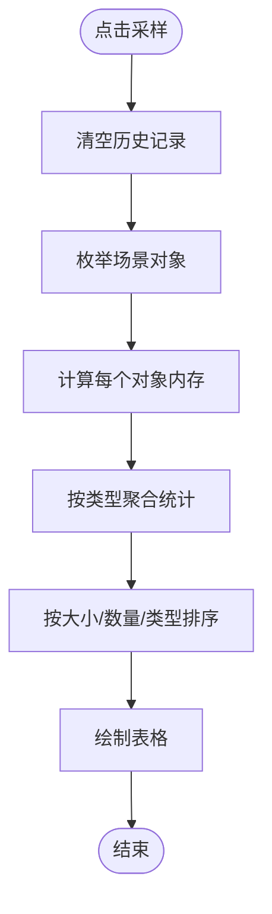
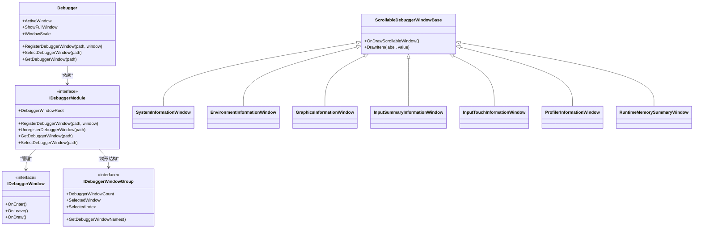

# 信息窗口系统

<cite>
**本文引用的文件**
- [Debugger.cs](file://Assets/TEngine/Runtime/Module/DebugerModule/Debugger.cs)
- [SystemInformationWindow.cs](file://Assets/TEngine/Runtime/Module/DebugerModule/Component/DebuggerModule.SystemInformationWindow.cs)
- [EnvironmentInformationWindow.cs](file://Assets/TEngine/Runtime/Module/DebugerModule/Component/DebuggerModule.EnvironmentInformationWindow.cs)
- [GraphicsInformationWindow.cs](file://Assets/TEngine/Runtime/Module/DebugerModule/Component/DebuggerModule.GraphicsInformationWindow.cs)
- [InputSummaryInformationWindow.cs](file://Assets/TEngine/Runtime/Module/DebugerModule/Component/DebuggerModule.InputSummaryInformationWindow.cs)
- [InputTouchInformationWindow.cs](file://Assets/TEngine/Runtime/Module/DebugerModule/Component/DebuggerModule.InputTouchInformationWindow.cs)
- [ProfilerInformationWindow.cs](file://Assets/TEngine/Runtime/Module/DebugerModule/Component/DebuggerModule.ProfilerInformationWindow.cs)
- [RuntimeMemorySummaryWindow.cs](file://Assets/TEngine/Runtime/Module/DebugerModule/Component/DebuggerModule.RuntimeMemorySummaryWindow.cs)
- [ScrollableDebuggerWindowBase.cs](file://Assets/TEngine/Runtime/Module/DebugerModule/Component/DebuggerModule.ScrollableDebuggerWindowBase.cs)
- [IDebuggerModule.cs](file://Assets/TEngine/Runtime/Module/DebugerModule/IDebuggerModule.cs)
- [IDebuggerWindow.cs](file://Assets/TEngine/Runtime/Module/DebugerModule/IDebuggerWindow.cs)
- [IDebuggerWindowGroup.cs](file://Assets/TEngine/Runtime/Module/DebugerModule/IDebuggerWindowGroup.cs)
</cite>

## 目录
1. [简介](#简介)
2. [项目结构](#项目结构)
3. [核心组件](#核心组件)
4. [架构总览](#架构总览)
5. [详细组件分析](#详细组件分析)
6. [依赖关系分析](#依赖关系分析)
7. [性能考量](#性能考量)
8. [故障排查指南](#故障排查指南)
9. [结论](#结论)
10. [附录](#附录)

## 简介
本文件面向TEngine信息窗口系统，系统性梳理并解释各类信息窗口的功能与用途：系统信息窗口用于展示硬件配置与设备能力；环境信息窗口用于呈现运行时环境参数；图形信息窗口用于分析渲染管线与显卡特性；输入信息窗口用于统计用户交互数据（含汇总、触摸、定位、加速度、陀螺仪、罗盘）。同时，文档深入说明数据采集机制（基于Unity API、性能计数器、设备状态查询）、实时更新机制（刷新频率控制、增量更新策略、性能优化）、定制化扩展方法（新增信息类型、数据格式化、界面美化），以及跨平台兼容性处理方案。

## 项目结构
信息窗口系统位于TEngine运行时模块的调试器子模块下，采用“主控制器 + 多个窗口组件”的分层组织方式：
- 主控制器负责窗口注册、布局绘制、激活状态管理与全局缩放控制
- 各信息窗口继承统一的滚动窗口基类，按功能域独立实现
- 模块接口定义了窗口树形结构、选择切换与注册机制

图表来源
- [Debugger.cs:183-235](file://Assets/TEngine/Runtime/Module/DebugerModule/Debugger.cs#L183-L235)
- [SystemInformationWindow.cs:7-41](file://Assets/TEngine/Runtime/Module/DebugerModule/Component/DebuggerModule.SystemInformationWindow.cs#L7-L41)
- [EnvironmentInformationWindow.cs:10-68](file://Assets/TEngine/Runtime/Module/DebugerModule/Component/DebuggerModule.EnvironmentInformationWindow.cs#L10-L68)
- [GraphicsInformationWindow.cs:7-154](file://Assets/TEngine/Runtime/Module/DebugerModule/Component/DebuggerModule.GraphicsInformationWindow.cs#L7-L154)
- [InputSummaryInformationWindow.cs:7-29](file://Assets/TEngine/Runtime/Module/DebugerModule/Component/DebuggerModule.InputSummaryInformationWindow.cs#L7-L29)
- [InputTouchInformationWindow.cs:7-40](file://Assets/TEngine/Runtime/Module/DebugerModule/Component/DebuggerModule.InputTouchInformationWindow.cs#L7-L40)
- [ProfilerInformationWindow.cs:10-56](file://Assets/TEngine/Runtime/Module/DebugerModule/Component/DebuggerModule.ProfilerInformationWindow.cs#L10-L56)
- [RuntimeMemorySummaryWindow.cs:12-59](file://Assets/TEngine/Runtime/Module/DebugerModule/Component/DebuggerModule.RuntimeMemorySummaryWindow.cs#L12-L59)
- [ScrollableDebuggerWindowBase.cs](file://Assets/TEngine/Runtime/Module/DebugerModule/Component/DebuggerModule.ScrollableDebuggerWindowBase.cs)
- [IDebuggerModule.cs](file://Assets/TEngine/Runtime/Module/DebugerModule/IDebuggerModule.cs)
- [IDebuggerWindow.cs](file://Assets/TEngine/Runtime/Module/DebugerModule/IDebuggerWindow.cs)
- [IDebuggerWindowGroup.cs](file://Assets/TEngine/Runtime/Module/DebugerModule/IDebuggerWindowGroup.cs)

章节来源
- [Debugger.cs:183-235](file://Assets/TEngine/Runtime/Module/DebugerModule/Debugger.cs#L183-L235)

## 核心组件
- 调试器主控制器（Debugger）
  - 负责窗口注册、布局绘制、激活状态与缩放控制
  - 维护FPS计数器，驱动窗口刷新
  - 提供图标模式与全窗口模式切换
- 滚动窗口基类（ScrollableDebuggerWindowBase）
  - 统一滚动区域绘制、项列表渲染与通用格式化工具
- 窗口接口族（IDebuggerModule/IDebuggerWindow/IDebuggerWindowGroup）
  - 定义窗口树形结构、选择与注册契约

章节来源
- [Debugger.cs:12-141](file://Assets/TEngine/Runtime/Module/DebugerModule/Debugger.cs#L12-L141)
- [ScrollableDebuggerWindowBase.cs](file://Assets/TEngine/Runtime/Module/DebugerModule/Component/DebuggerModule.ScrollableDebuggerWindowBase.cs)
- [IDebuggerModule.cs](file://Assets/TEngine/Runtime/Module/DebugerModule/IDebuggerModule.cs)
- [IDebuggerWindow.cs](file://Assets/TEngine/Runtime/Module/DebugerModule/IDebuggerWindow.cs)
- [IDebuggerWindowGroup.cs](file://Assets/TEngine/Runtime/Module/DebugerModule/IDebuggerWindowGroup.cs)

## 架构总览
信息窗口系统采用“集中式控制器 + 分布式窗口”的架构：
- 控制器负责生命周期与UI绘制，窗口仅关注自身数据采集与展示
- 通过模块接口将窗口组织为树形目录，支持多级分类与动态注册
- 使用Unity GUI进行绘制，并支持窗口缩放以适配不同分辨率

图表来源
- [Debugger.cs:148-266](file://Assets/TEngine/Runtime/Module/DebugerModule/Debugger.cs#L148-L266)
- [Debugger.cs:338-389](file://Assets/TEngine/Runtime/Module/DebugerModule/Debugger.cs#L338-L389)
- [IDebuggerModule.cs](file://Assets/TEngine/Runtime/Module/DebugerModule/IDebuggerModule.cs)

## 详细组件分析

### 系统信息窗口（SystemInformationWindow）
- 功能与用途
  - 展示设备唯一标识、名称、类型、型号、处理器信息、内存容量、电池状态与能力支持等
- 数据采集机制
  - 通过Unity系统API读取设备与系统信息
- 实时更新机制
  - 作为静态信息窗口，无需频繁刷新；窗口打开时一次性读取并展示
- 兼容性
  - 针对不同Unity版本使用条件编译，确保API可用性

图表来源
- [SystemInformationWindow.cs:9-41](file://Assets/TEngine/Runtime/Module/DebugerModule/Component/DebuggerModule.SystemInformationWindow.cs#L9-L41)

章节来源
- [SystemInformationWindow.cs:7-52](file://Assets/TEngine/Runtime/Module/DebugerModule/Component/DebuggerModule.SystemInformationWindow.cs#L7-L52)

### 环境信息窗口（EnvironmentInformationWindow）
- 功能与用途
  - 展示产品名、公司名、应用版本、Unity版本、平台、语言、网络可达性、帧率、运行模式等
- 数据采集机制
  - 通过Application与相关API读取运行时环境参数
- 实时更新机制
  - 部分参数（如帧率）由控制器每帧更新，窗口展示当前值
- 兼容性
  - 针对不同Unity版本使用条件编译，保证字段可用

章节来源
- [EnvironmentInformationWindow.cs:10-68](file://Assets/TEngine/Runtime/Module/DebugerModule/Component/DebuggerModule.EnvironmentInformationWindow.cs#L10-L68)

### 图形信息窗口（GraphicsInformationWindow）
- 功能与用途
  - 展示显卡设备ID/名称、厂商、类型、版本、显存、着色器等级、渲染层级、纹理与渲染目标支持等
- 数据采集机制
  - 通过SystemInfo与Graphics等API读取图形能力与限制
- 实时更新机制
  - 作为静态能力信息窗口，无需频繁刷新
- 兼容性
  - 大量条件编译覆盖不同Unity版本的新增能力字段

章节来源
- [GraphicsInformationWindow.cs:7-154](file://Assets/TEngine/Runtime/Module/DebugerModule/Component/DebuggerModule.GraphicsInformationWindow.cs#L7-L154)

### 输入信息窗口（InputSummaryInformationWindow）
- 功能与用途
  - 展示输入汇总状态，如返回键行为、设备方向、鼠标状态、任意键、输入字符串、IME状态等
- 数据采集机制
  - 通过Input相关API读取当前输入状态
- 实时更新机制
  - 每帧读取并展示最新状态

章节来源
- [InputSummaryInformationWindow.cs:7-29](file://Assets/TEngine/Runtime/Module/DebugerModule/Component/DebuggerModule.InputSummaryInformationWindow.cs#L7-L29)

### 触摸输入窗口（InputTouchInformationWindow）
- 功能与用途
  - 展示触摸支持状态、压力支持、笔触支持、模拟鼠标、多点触控开关、当前触控数量与触点数组
- 数据采集机制
  - 通过Input.touches读取触点集合，并格式化输出关键字段（位置、位移、原始位置、压力、阶段）
- 实时更新机制
  - 每帧读取并展示最新触点状态

图表来源
- [InputTouchInformationWindow.cs:9-40](file://Assets/TEngine/Runtime/Module/DebugerModule/Component/DebuggerModule.InputTouchInformationWindow.cs#L9-L40)

章节来源
- [InputTouchInformationWindow.cs:7-40](file://Assets/TEngine/Runtime/Module/DebugerModule/Component/DebuggerModule.InputTouchInformationWindow.cs#L7-L40)

### 性能概览窗口（ProfilerInformationWindow）
- 功能与用途
  - 展示Profiler支持状态、启用状态、二进制日志、分配堆栈、内存占用等关键指标
- 数据采集机制
  - 通过UnityEngine.Profiling命名空间API读取性能与内存统计
- 实时更新机制
  - 每帧由控制器更新FPS，窗口展示当前性能指标

章节来源
- [ProfilerInformationWindow.cs:10-56](file://Assets/TEngine/Runtime/Module/DebugerModule/Component/DebuggerModule.ProfilerInformationWindow.cs#L10-L56)

### 内存概览窗口（RuntimeMemorySummaryWindow）
- 功能与用途
  - 支持手动采样场景中所有对象的运行时内存，按类型聚合统计并排序展示
- 数据采集机制
  - 通过Resources.FindObjectsOfTypeAll获取对象集合并使用Profiler.GetRuntimeMemorySize系列API计算内存
- 实时更新机制
  - 采样按钮触发一次性采样，采样结果按大小/数量/类型排序
- 性能优化
  - 采样过程遍历全场景对象，建议在空闲时段或特定场景触发，避免频繁采样造成卡顿

图表来源
- [RuntimeMemorySummaryWindow.cs:61-102](file://Assets/TEngine/Runtime/Module/DebugerModule/Component/DebuggerModule.RuntimeMemorySummaryWindow.cs#L61-L102)

章节来源
- [RuntimeMemorySummaryWindow.cs:12-122](file://Assets/TEngine/Runtime/Module/DebugerModule/Component/DebuggerModule.RuntimeMemorySummaryWindow.cs#L12-L122)

## 依赖关系分析
- 控制器与模块接口
  - Debugger通过IDebuggerModule注册/选择/获取窗口，形成松耦合的窗口树管理
- 窗口与基类
  - 所有信息窗口继承ScrollableDebuggerWindowBase，共享滚动与格式化能力
- 窗口与Unity API
  - 各窗口直接依赖Unity系统API（SystemInfo、Input、Graphics、Profiler等）进行数据采集

图表来源
- [Debugger.cs:274-307](file://Assets/TEngine/Runtime/Module/DebugerModule/Debugger.cs#L274-L307)
- [IDebuggerModule.cs](file://Assets/TEngine/Runtime/Module/DebugerModule/IDebuggerModule.cs)
- [IDebuggerWindow.cs](file://Assets/TEngine/Runtime/Module/DebugerModule/IDebuggerWindow.cs)
- [IDebuggerWindowGroup.cs](file://Assets/TEngine/Runtime/Module/DebugerModule/IDebuggerWindowGroup.cs)
- [ScrollableDebuggerWindowBase.cs](file://Assets/TEngine/Runtime/Module/DebugerModule/Component/DebuggerModule.ScrollableDebuggerWindowBase.cs)
- [SystemInformationWindow.cs:7](file://Assets/TEngine/Runtime/Module/DebugerModule/Component/DebuggerModule.SystemInformationWindow.cs#L7)
- [EnvironmentInformationWindow.cs:10](file://Assets/TEngine/Runtime/Module/DebugerModule/Component/DebuggerModule.EnvironmentInformationWindow.cs#L10)
- [GraphicsInformationWindow.cs:7](file://Assets/TEngine/Runtime/Module/DebugerModule/Component/DebuggerModule.GraphicsInformationWindow.cs#L7)
- [InputSummaryInformationWindow.cs:7](file://Assets/TEngine/Runtime/Module/DebugerModule/Component/DebuggerModule.InputSummaryInformationWindow.cs#L7)
- [InputTouchInformationWindow.cs:7](file://Assets/TEngine/Runtime/Module/DebugerModule/Component/DebuggerModule.InputTouchInformationWindow.cs#L7)
- [ProfilerInformationWindow.cs:10](file://Assets/TEngine/Runtime/Module/DebugerModule/Component/DebuggerModule.ProfilerInformationWindow.cs#L10)
- [RuntimeMemorySummaryWindow.cs:12](file://Assets/TEngine/Runtime/Module/DebugerModule/Component/DebuggerModule.RuntimeMemorySummaryWindow.cs#L12)

## 性能考量
- 刷新频率控制
  - 控制器每帧更新FPS计数器，窗口按需读取状态；建议将高开销采集（如内存采样）置于按钮触发而非每帧执行
- 增量更新策略
  - 对于静态能力信息窗口（系统/图形/环境），可缓存读取结果并在窗口打开时刷新
  - 对于输入窗口，仅在状态变化时更新，减少冗余绘制
- 性能优化
  - 内存采样涉及全场景对象遍历，应避免在游戏主线程高频触发
  - 使用Unity Profiler与日志窗口辅助定位热点
- 资源与UI
  - 控制器支持窗口缩放与事件系统开关，兼顾不同分辨率与交互需求

章节来源
- [Debugger.cs:237-240](file://Assets/TEngine/Runtime/Module/DebugerModule/Debugger.cs#L237-L240)
- [RuntimeMemorySummaryWindow.cs:61-102](file://Assets/TEngine/Runtime/Module/DebugerModule/Component/DebuggerModule.RuntimeMemorySummaryWindow.cs#L61-L102)

## 故障排查指南
- 窗口未显示
  - 检查调试器激活类型与构建配置（开发构建/编辑器模式）
  - 确认窗口已正确注册到模块树
- 数据异常或缺失
  - 检查Unity版本条件编译宏，确认目标API在当前版本可用
  - 对于内存采样，确认Profiler支持且未被禁用
- UI绘制问题
  - 检查GUISkin与缩放设置，确保GUI矩阵恢复
  - 确认事件系统开关与全窗口模式切换逻辑

章节来源
- [Debugger.cs:217-234](file://Assets/TEngine/Runtime/Module/DebugerModule/Debugger.cs#L217-L234)
- [Debugger.cs:242-266](file://Assets/TEngine/Runtime/Module/DebugerModule/Debugger.cs#L242-L266)
- [ProfilerInformationWindow.cs:12-56](file://Assets/TEngine/Runtime/Module/DebugerModule/Component/DebuggerModule.ProfilerInformationWindow.cs#L12-L56)

## 结论
TEngine信息窗口系统通过统一的控制器与模块接口，将多种信息窗口解耦为独立组件，既满足开发调试需求，又便于扩展与维护。系统充分利用Unity提供的系统API与性能工具，结合条件编译与增量更新策略，在保证可观测性的同时兼顾性能与稳定性。对于新增信息类型与界面美化，遵循现有基类与接口约定即可快速集成。

## 附录
- 新增信息窗口步骤
  - 继承滚动窗口基类，实现绘制逻辑
  - 在控制器启动阶段注册窗口路径与实例
  - 如需菜单树形展示，使用斜杠分隔的路径组织分类
- 数据格式化与界面美化
  - 使用基类提供的绘制工具与文本格式化函数
  - 可通过GUISkin调整样式，注意缩放与分辨率适配
- 跨平台兼容性
  - 使用条件编译宏覆盖不同Unity版本差异
  - 针对移动平台谨慎使用高开销采集，优先采用按钮触发