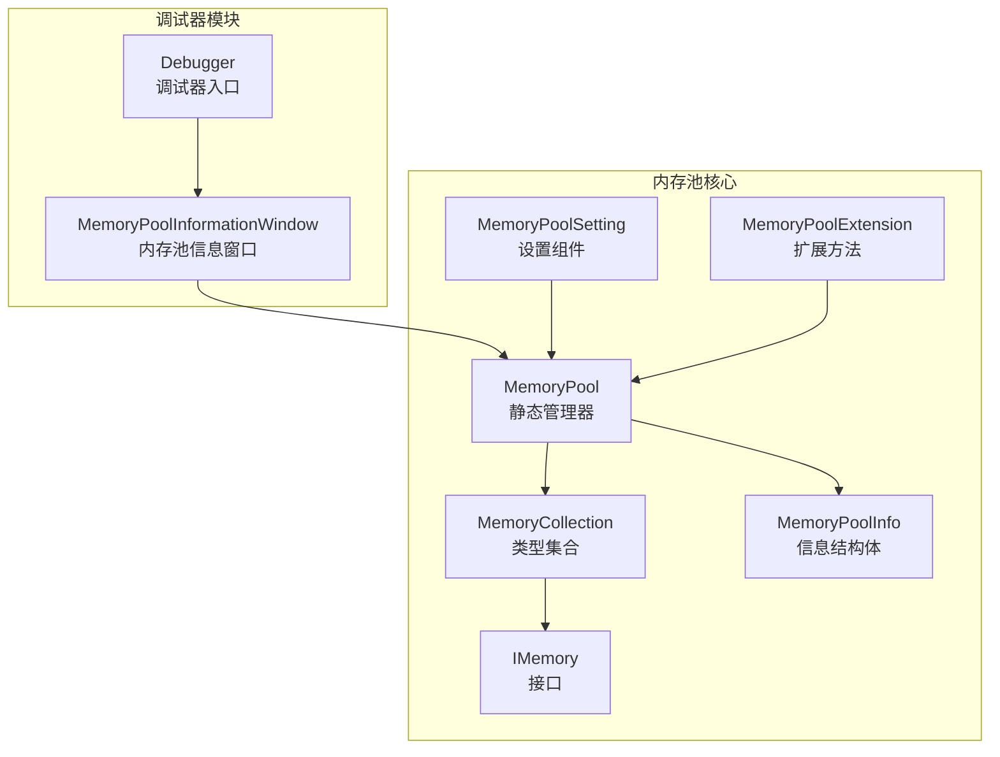
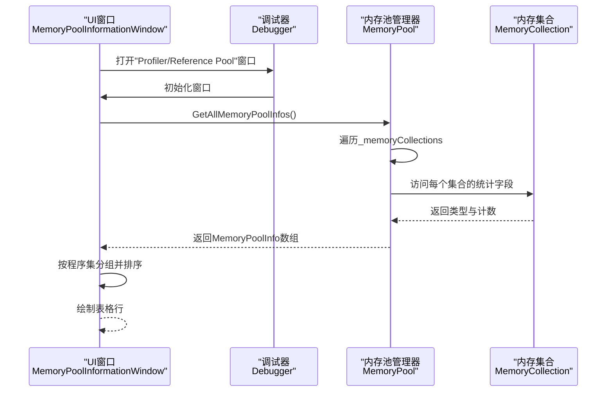
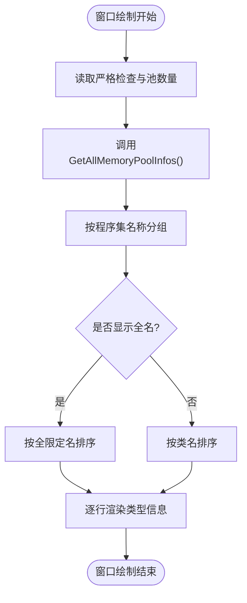
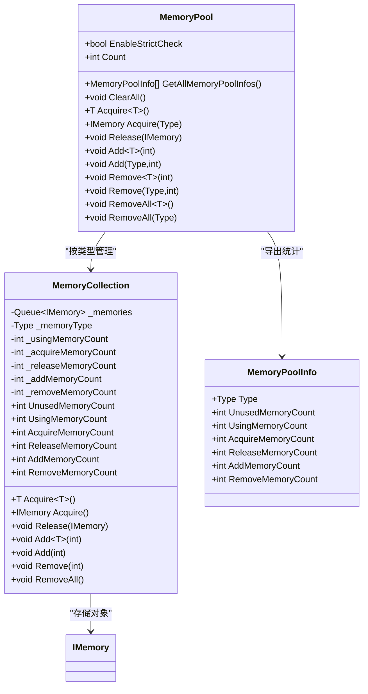
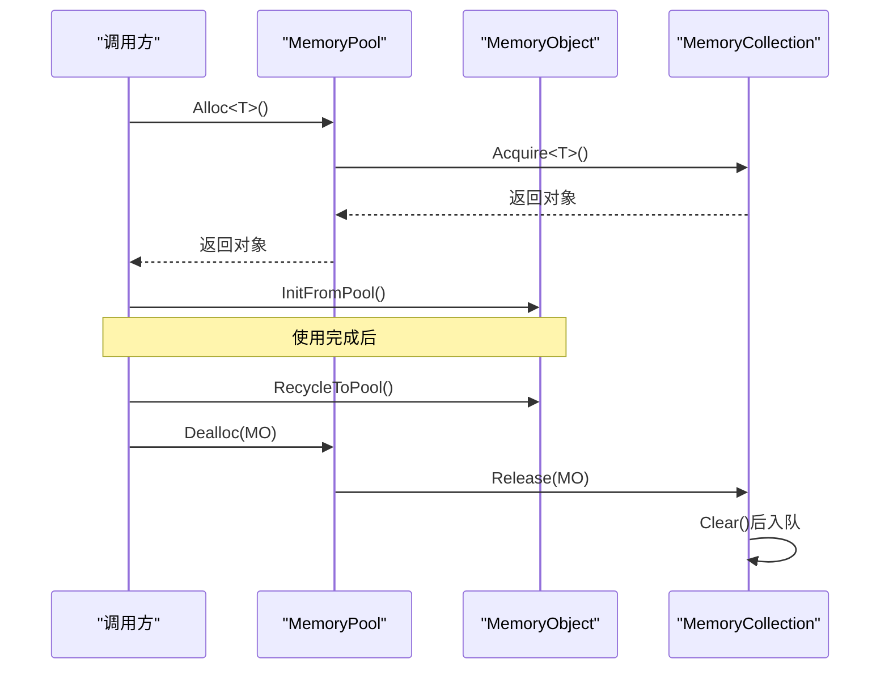
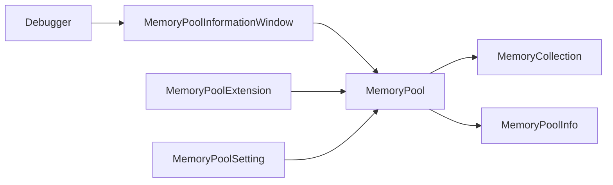

# 内存池状态监控

<cite>
**本文档引用的文件**
- [MemoryPoolInformationWindow.cs](file://Assets/TEngine/Runtime/Module/DebugerModule/Component/DebuggerModule.MemoryPoolInformationWindow.cs)
- [Debugger.cs](file://Assets/TEngine/Runtime/Module/DebugerModule/Debugger.cs)
- [MemoryPool.cs](file://Assets/TEngine/Runtime/Core/MemoryPool/MemoryPool.cs)
- [MemoryPool.MemoryCollection.cs](file://Assets/TEngine/Runtime/Core/MemoryPool/MemoryPool.MemoryCollection.cs)
- [MemoryPoolInfo.cs](file://Assets/TEngine/Runtime/Core/MemoryPool/MemoryPoolInfo.cs)
- [MemoryPoolSetting.cs](file://Assets/TEngine/Runtime/Core/MemoryPool/MemoryPoolSetting.cs)
- [MemoryPoolExtension.cs](file://Assets/TEngine/Runtime/Core/MemoryPool/MemoryPoolExtension.cs)
- [IMemory.cs](file://Assets/TEngine/Runtime/Core/MemoryPool/IMemory.cs)
- [ObjectPoolInformationWindow.cs](file://Assets/TEngine/Runtime/Module/DebugerModule/Component/DebuggerModule.ObjectPoolInformationWindow.cs)
</cite>

## 目录
1. [简介](#简介)
2. [项目结构](#项目结构)
3. [核心组件](#核心组件)
4. [架构概览](#架构概览)
5. [详细组件分析](#详细组件分析)
6. [依赖关系分析](#依赖关系分析)
7. [性能考量](#性能考量)
8. [故障排除指南](#故障排除指南)
9. [结论](#结论)

## 简介
本文件面向TEngine内存池状态监控功能，围绕MemoryPoolInformationWindow监控机制展开，系统性阐述内存池的创建、分配、回收状态的实时监控方式；深入解析内存池生命周期管理中的对象数量统计、内存使用情况与分配效率分析等关键指标；并提供健康检查机制（内存泄漏检测、池溢出预警、性能瓶颈识别）与优化建议（池大小调整、对象复用策略、内存碎片减少），以及常见问题与解决方案。

## 项目结构
TEngine的内存池监控功能由调试器模块与内存池核心实现共同组成：
- 调试器模块负责可视化展示：通过MemoryPoolInformationWindow窗口聚合并展示各类型内存池的状态信息。
- 内存池核心实现负责数据采集与状态维护：MemoryPool提供全局接口与统计信息导出，MemoryCollection负责具体类型的内存池集合与计数。

**图表来源**
- [Debugger.cs:11-81](file://Assets/TEngine/Runtime/Module/DebugerModule/Debugger.cs#L11-L81)
- [MemoryPoolInformationWindow.cs:9-106](file://Assets/TEngine/Runtime/Module/DebugerModule/Component/DebuggerModule.MemoryPoolInformationWindow.cs#L9-L106)
- [MemoryPool.cs:9-207](file://Assets/TEngine/Runtime/Core/MemoryPool/MemoryPool.cs#L9-L207)
- [MemoryPool.MemoryCollection.cs:11-157](file://Assets/TEngine/Runtime/Core/MemoryPool/MemoryPool.MemoryCollection.cs#L11-L157)
- [MemoryPoolInfo.cs:10-119](file://Assets/TEngine/Runtime/Core/MemoryPool/MemoryPoolInfo.cs#L10-L119)
- [MemoryPoolSetting.cs:35-80](file://Assets/TEngine/Runtime/Core/MemoryPool/MemoryPoolSetting.cs#L35-L80)
- [MemoryPoolExtension.cs:8-57](file://Assets/TEngine/Runtime/Core/MemoryPool/MemoryPoolExtension.cs#L8-L57)
- [IMemory.cs:6-14](file://Assets/TEngine/Runtime/Core/MemoryPool/IMemory.cs#L6-L14)

**章节来源**
- [Debugger.cs:11-81](file://Assets/TEngine/Runtime/Module/DebugerModule/Debugger.cs#L11-L81)
- [MemoryPoolInformationWindow.cs:9-106](file://Assets/TEngine/Runtime/Module/DebugerModule/Component/DebuggerModule.MemoryPoolInformationWindow.cs#L9-L106)
- [MemoryPool.cs:9-207](file://Assets/TEngine/Runtime/Core/MemoryPool/MemoryPool.cs#L9-L207)

## 核心组件
- MemoryPoolInformationWindow：调试器子窗口，负责按程序集分组展示各类型内存池的统计信息，并支持全名/短名切换。
- MemoryPool：静态管理器，提供获取信息、清空、增删对象等操作，并维护严格检查开关。
- MemoryCollection：具体类型的内存池集合，内部以队列存储空闲对象，维护使用中/未使用/获取/归还/新增/移除等计数。
- MemoryPoolInfo：只读信息结构体，封装类型与各类计数字段，供外部查询。
- MemoryPoolSetting：运行时设置组件，根据构建配置自动控制严格检查开关。
- MemoryPoolExtension：扩展方法，提供Alloc/Dealloc便捷接口，结合MemoryObject生命周期回调。
- IMemory：内存对象必须实现的清理接口。

**章节来源**
- [MemoryPoolInformationWindow.cs:9-106](file://Assets/TEngine/Runtime/Module/DebugerModule/Component/DebuggerModule.MemoryPoolInformationWindow.cs#L9-L106)
- [MemoryPool.cs:9-207](file://Assets/TEngine/Runtime/Core/MemoryPool/MemoryPool.cs#L9-L207)
- [MemoryPool.MemoryCollection.cs:11-157](file://Assets/TEngine/Runtime/Core/MemoryPool/MemoryPool.MemoryCollection.cs#L11-L157)
- [MemoryPoolInfo.cs:10-119](file://Assets/TEngine/Runtime/Core/MemoryPool/MemoryPoolInfo.cs#L10-L119)
- [MemoryPoolSetting.cs:35-80](file://Assets/TEngine/Runtime/Core/MemoryPool/MemoryPoolSetting.cs#L35-L80)
- [MemoryPoolExtension.cs:8-57](file://Assets/TEngine/Runtime/Core/MemoryPool/MemoryPoolExtension.cs#L8-L57)
- [IMemory.cs:6-14](file://Assets/TEngine/Runtime/Core/MemoryPool/IMemory.cs#L6-L14)

## 架构概览
MemoryPoolInformationWindow通过调用MemoryPool.GetAllMemoryPoolInfos()获取所有内存池信息，再按程序集名称分组展示。MemoryPool内部以类型为键维护MemoryCollection集合，每个集合独立统计其生命周期内的关键指标。

**图表来源**
- [MemoryPoolInformationWindow.cs:20-78](file://Assets/TEngine/Runtime/Module/DebugerModule/Component/DebuggerModule.MemoryPoolInformationWindow.cs#L20-L78)
- [MemoryPool.cs:33-48](file://Assets/TEngine/Runtime/Core/MemoryPool/MemoryPool.cs#L33-L48)
- [MemoryPool.MemoryCollection.cs:32-44](file://Assets/TEngine/Runtime/Core/MemoryPool/MemoryPool.MemoryCollection.cs#L32-L44)

**章节来源**
- [MemoryPoolInformationWindow.cs:20-78](file://Assets/TEngine/Runtime/Module/DebugerModule/Component/DebuggerModule.MemoryPoolInformationWindow.cs#L20-L78)
- [MemoryPool.cs:33-48](file://Assets/TEngine/Runtime/Core/MemoryPool/MemoryPool.cs#L33-L48)

## 详细组件分析

### MemoryPoolInformationWindow 监控机制
- 实时监控项
  - Enable Strict Check：严格检查开关状态
  - Memory Pool Count：当前已注册的内存池数量
  - 按程序集分组：Assembly: {程序集名}
  - 表头字段：类名/全名、Unused、Using、Acquire、Release、Add、Remove
- 排序与显示
  - 支持切换显示全限定类名或仅类名
  - 对同一程序集内的类型按名称进行排序
- 数据来源
  - 调用MemoryPool.GetAllMemoryPoolInfos()获取所有MemoryPoolInfo
  - 通过Type.Assembly.GetName().Name进行分组

**图表来源**
- [MemoryPoolInformationWindow.cs:20-78](file://Assets/TEngine/Runtime/Module/DebugerModule/Component/DebuggerModule.MemoryPoolInformationWindow.cs#L20-L78)
- [MemoryPool.cs:33-48](file://Assets/TEngine/Runtime/Core/MemoryPool/MemoryPool.cs#L33-L48)

**章节来源**
- [MemoryPoolInformationWindow.cs:20-78](file://Assets/TEngine/Runtime/Module/DebugerModule/Component/DebuggerModule.MemoryPoolInformationWindow.cs#L20-L78)

### MemoryPool 生命周期与统计指标
- 关键统计字段
  - UnusedMemoryCount：未使用对象数量（队列长度）
  - UsingMemoryCount：正在使用对象数量（并发计数）
  - AcquireMemoryCount：获取对象总次数
  - ReleaseMemoryCount：归还对象总次数
  - AddMemoryCount：新增对象总次数（包括首次创建与预填充）
  - RemoveMemoryCount：移除对象总次数
- 生命周期事件
  - 获取：若队列为空则新增对象，否则出队复用
  - 归还：调用Clear()后入队，使用计数减一
  - 预填充：Add/Add<T>向队列追加对象
  - 清理：Remove/RemoveAll从队列移除对象

**图表来源**
- [MemoryPool.cs:9-207](file://Assets/TEngine/Runtime/Core/MemoryPool/MemoryPool.cs#L9-L207)
- [MemoryPool.MemoryCollection.cs:11-157](file://Assets/TEngine/Runtime/Core/MemoryPool/MemoryPool.MemoryCollection.cs#L11-L157)
- [MemoryPoolInfo.cs:10-119](file://Assets/TEngine/Runtime/Core/MemoryPool/MemoryPoolInfo.cs#L10-L119)
- [IMemory.cs:6-14](file://Assets/TEngine/Runtime/Core/MemoryPool/IMemory.cs#L6-L14)

**章节来源**
- [MemoryPool.cs:9-207](file://Assets/TEngine/Runtime/Core/MemoryPool/MemoryPool.cs#L9-L207)
- [MemoryPool.MemoryCollection.cs:11-157](file://Assets/TEngine/Runtime/Core/MemoryPool/MemoryPool.MemoryCollection.cs#L11-L157)
- [MemoryPoolInfo.cs:10-119](file://Assets/TEngine/Runtime/Core/MemoryPool/MemoryPoolInfo.cs#L10-L119)

### MemoryPoolExtension 与 MemoryObject 生命周期
- Alloc<T>()：从内存池获取对象并调用InitFromPool()完成初始化
- Dealloc(MemoryObject)：先调用RecycleToPool()回收资源，再Release归还池中
- MemoryObject抽象类提供Clear()默认空实现，便于子类覆盖

**图表来源**
- [MemoryPoolExtension.cs:28-57](file://Assets/TEngine/Runtime/Core/MemoryPool/MemoryPoolExtension.cs#L28-L57)
- [MemoryPool.MemoryCollection.cs:83-98](file://Assets/TEngine/Runtime/Core/MemoryPool/MemoryPool.MemoryCollection.cs#L83-L98)

**章节来源**
- [MemoryPoolExtension.cs:28-57](file://Assets/TEngine/Runtime/Core/MemoryPool/MemoryPoolExtension.cs#L28-L57)
- [MemoryPool.MemoryCollection.cs:83-98](file://Assets/TEngine/Runtime/Core/MemoryPool/MemoryPool.MemoryCollection.cs#L83-L98)

### 健康检查机制
- 严格检查（EnableStrictCheck）
  - 在归还阶段检测重复归还：若开启严格检查且对象已在队列中，则抛出异常
  - 在类型校验阶段确保传入类型满足：非抽象类、实现IMemory接口
- 泄漏检测
  - 通过对比UsingMemoryCount与AcquireMemoryCount、ReleaseMemoryCount，若UsingMemoryCount持续增长且ReleaseMemoryCount不匹配，可能存在泄漏
- 池溢出预警
  - 通过UnusedMemoryCount过低与AddMemoryCount过高组合判断池容量不足，需要扩容
- 性能瓶颈识别
  - AcquireMemoryCount远大于ReleaseMemoryCount可能表明频繁创建新对象而非复用
  - AddMemoryCount与RemoveMemoryCount差异过大可能指示预填充策略不当

**章节来源**
- [MemoryPool.cs:164-185](file://Assets/TEngine/Runtime/Core/MemoryPool/MemoryPool.cs#L164-L185)
- [MemoryPool.MemoryCollection.cs:83-98](file://Assets/TEngine/Runtime/Core/MemoryPool/MemoryPool.MemoryCollection.cs#L83-L98)

### 优化建议
- 池大小调整
  - 观察UnusedMemoryCount与AcquireMemoryCount趋势，动态Add<T>(增量)预热热点类型
  - 对高抖动场景适当提高初始池容量，降低运行期频繁Add成本
- 对象复用策略
  - 优先使用Acquire/Release或Alloc/Dealloc进行对象复用，避免临时对象频繁创建
  - 对于MemoryObject，确保RecycleToPool()正确释放大对象引用，Clear()清理缓存数据
- 减少内存碎片
  - 合理批量Add<T>(count)，减少细粒度频繁分配
  - 定期Remove/RemoveAll清理不再使用的池，保持队列整洁
- 严格检查与性能平衡
  - 开发/测试环境启用严格检查定位问题，发布版本关闭以避免性能损耗

**章节来源**
- [MemoryPool.cs:108-162](file://Assets/TEngine/Runtime/Core/MemoryPool/MemoryPool.cs#L108-L162)
- [MemoryPoolExtension.cs:35-55](file://Assets/TEngine/Runtime/Core/MemoryPool/MemoryPoolExtension.cs#L35-L55)

### 调试与排错
- 常见问题
  - 类型不匹配：Acquire<T>()与集合类型不符会抛出异常
  - 重复归还：严格检查下对同一对象重复Release会抛出异常
  - 归还空对象：Release(null)会抛出异常
- 解决方案
  - 确保类型参数与集合一致，或使用Acquire(Type)/Add(Type)/Remove(Type)
  - 使用Alloc/Dealloc配对，避免直接调用Release
  - 在发布版本关闭严格检查，或仅在开发环境启用
- 参考对比
  - 对比对象池（ObjectPool）与内存池（MemoryPool）的统计维度，辅助定位问题场景

**章节来源**
- [MemoryPool.cs:71-101](file://Assets/TEngine/Runtime/Core/MemoryPool/MemoryPool.cs#L71-L101)
- [MemoryPool.MemoryCollection.cs:46-98](file://Assets/TEngine/Runtime/Core/MemoryPool/MemoryPool.MemoryCollection.cs#L46-L98)
- [ObjectPoolInformationWindow.cs:8-88](file://Assets/TEngine/Runtime/Module/DebugerModule/Component/DebuggerModule.ObjectPoolInformationWindow.cs#L8-L88)

## 依赖关系分析
- 组件耦合
  - MemoryPoolInformationWindow依赖MemoryPool.GetAllMemoryPoolInfos()输出的MemoryPoolInfo
  - MemoryPool内部依赖MemoryCollection按类型管理对象集合
  - MemoryPoolExtension依赖MemoryPool接口实现便捷分配/回收
- 外部集成点
  - MemoryPoolSetting通过构建配置自动控制严格检查开关
  - Debugger模块注册并展示MemoryPoolInformationWindow窗口

**图表来源**
- [MemoryPoolInformationWindow.cs:32-44](file://Assets/TEngine/Runtime/Module/DebugerModule/Component/DebuggerModule.MemoryPoolInformationWindow.cs#L32-L44)
- [MemoryPool.cs:187-205](file://Assets/TEngine/Runtime/Core/MemoryPool/MemoryPool.cs#L187-L205)
- [MemoryPoolExtension.cs:28-57](file://Assets/TEngine/Runtime/Core/MemoryPool/MemoryPoolExtension.cs#L28-L57)
- [MemoryPoolSetting.cs:56-78](file://Assets/TEngine/Runtime/Core/MemoryPool/MemoryPoolSetting.cs#L56-L78)
- [Debugger.cs:214](file://Assets/TEngine/Runtime/Module/DebugerModule/Debugger.cs#L214)

**章节来源**
- [MemoryPoolInformationWindow.cs:32-44](file://Assets/TEngine/Runtime/Module/DebugerModule/Component/DebuggerModule.MemoryPoolInformationWindow.cs#L32-L44)
- [MemoryPool.cs:187-205](file://Assets/TEngine/Runtime/Core/MemoryPool/MemoryPool.cs#L187-L205)
- [MemoryPoolExtension.cs:28-57](file://Assets/TEngine/Runtime/Core/MemoryPool/MemoryPoolExtension.cs#L28-L57)
- [MemoryPoolSetting.cs:56-78](file://Assets/TEngine/Runtime/Core/MemoryPool/MemoryPoolSetting.cs#L56-L78)
- [Debugger.cs:214](file://Assets/TEngine/Runtime/Module/DebugerModule/Debugger.cs#L214)

## 性能考量
- 严格检查的成本
  - EnableStrictCheck开启会显著影响性能，仅在开发/测试阶段启用
- 分配与回收的热点
  - 高频小对象应优先复用，减少GC压力
  - 批量Add<T>(count)优于多次单个Add，降低锁竞争
- 统计开销
  - GetAllMemoryPoolInfos()遍历字典并构造数组，建议在调试面板中按需刷新，避免频繁调用

## 故障排除指南
- 异常排查
  - "Type is invalid."：类型不匹配，检查泛型参数或使用Acquire(Type)/Add(Type)
  - "Memory is invalid."：传入null对象，确认对象生命周期
  - "The memory has been released."：重复归还，检查调用链
- 性能问题
  - FPS下降：检查是否开启了严格检查，考虑关闭或仅在必要时启用
  - 内存抖动：观察Acquire/Release比率，优化对象复用策略
- 窗口显示
  - 无法看到内存池信息：确认在调试器中选择了"Profiler/Reference Pool"窗口

**章节来源**
- [MemoryPool.cs:93-101](file://Assets/TEngine/Runtime/Core/MemoryPool/MemoryPool.cs#L93-L101)
- [MemoryPool.MemoryCollection.cs:48-51](file://Assets/TEngine/Runtime/Core/MemoryPool/MemoryPool.MemoryCollection.cs#L48-L51)
- [MemoryPoolSetting.cs:49-53](file://Assets/TEngine/Runtime/Core/MemoryPool/MemoryPoolSetting.cs#L49-L53)

## 结论
TEngine的内存池监控体系通过MemoryPoolInformationWindow将底层统计指标可视化，配合MemoryPool的严格检查与扩展接口，能够有效支撑内存池的健康监测与性能优化。实践中应结合业务热点类型合理配置池容量，坚持对象复用与及时回收，利用调试器窗口持续跟踪关键指标，从而获得稳定且高性能的内存使用体验。