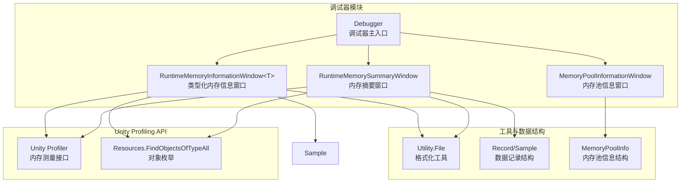
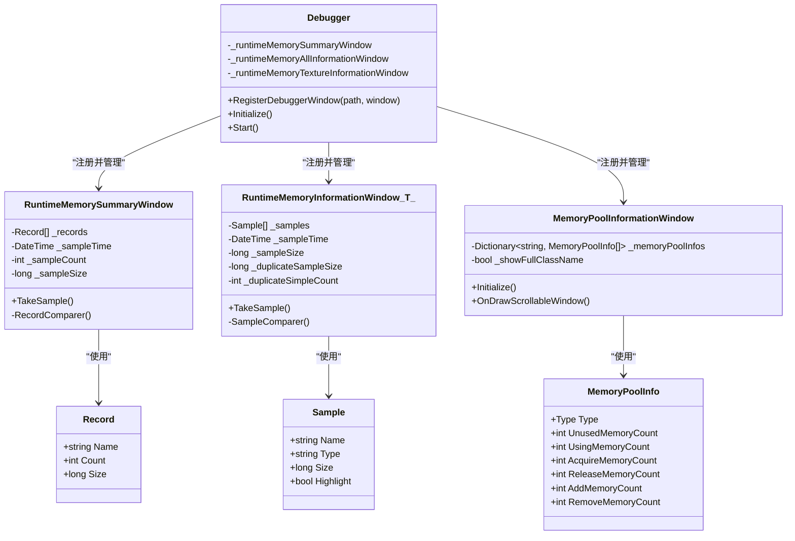
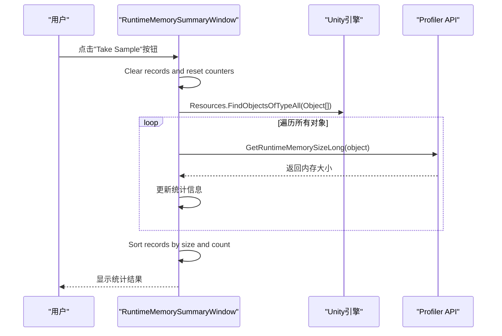
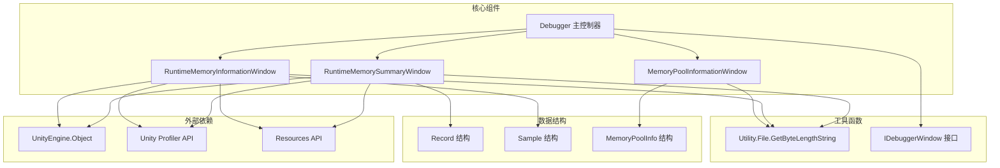

# 内存统计分析

<cite>
**本文档引用的文件**
- [DebuggerModule.RuntimeMemorySummaryWindow.cs](file://Assets/TEngine/Runtime/Module/DebugerModule/Component/DebuggerModule.RuntimeMemorySummaryWindow.cs)
- [DebuggerModule.RuntimeMemorySummaryWindow.Record.cs](file://Assets/TEngine/Runtime/Module/DebugerModule/Component/DebuggerModule.RuntimeMemorySummaryWindow.Record.cs)
- [DebuggerModule.RuntimeMemoryInformationWindow.cs](file://Assets/TEngine/Runtime/Module/DebugerModule/Component/DebuggerModule.RuntimeMemoryInformationWindow.cs)
- [DebuggerModule.RuntimeMemoryInformationWindow.Sample.cs](file://Assets/TEngine/Runtime/Module/DebugerModule/Component/DebuggerModule.RuntimeMemoryInformationWindow.Sample.cs)
- [DebuggerModule.MemoryPoolInformationWindow.cs](file://Assets/TEngine/Runtime/Module/DebugerModule/Component/DebuggerModule.MemoryPoolInformationWindow.cs)
- [Debugger.cs](file://Assets/TEngine/Runtime/Module/DebugerModule/Debugger.cs)
- [IDebuggerWindow.cs](file://Assets/TEngine/Runtime/Module/DebugerModule/IDebuggerWindow.cs)
- [Utility.File.cs](file://Assets/TEngine/Runtime/Core/Utility/Utility.File.cs)
- [MemoryPoolInfo.cs](file://Assets/TEngine/Runtime/Core/MemoryPool/MemoryPoolInfo.cs)
</cite>

## 目录
1. [简介](#简介)
2. [项目结构](#项目结构)
3. [核心组件](#核心组件)
4. [架构概览](#架构概览)
5. [详细组件分析](#详细组件分析)
6. [依赖关系分析](#依赖关系分析)
7. [性能考虑](#性能考虑)
8. [故障排除指南](#故障排除指南)
9. [结论](#结论)
10. [附录](#附录)

## 简介
本文件针对TEngine引擎中的内存统计分析功能进行深入技术文档编写，重点围绕RuntimeMemorySummaryWindow（运行时内存摘要窗口）展开。该功能提供以下关键能力：
- 总内存使用量统计：实时采集场景中所有UnityEngine.Object的内存占用并汇总
- 资源分布比例分析：按类型分组统计各类资源的内存占比与数量分布
- 内存增长趋势追踪：通过多次采样对比，观察内存使用变化趋势
- 高级分析功能：重复对象检测、异常波动识别、内存热点定位
- 决策支持工具：基于统计数据提供内存优化建议与性能瓶颈定位

该功能集成在调试器模块中，通过统一的调试器界面进行访问与操作。

## 项目结构
TEngine的内存统计分析功能位于调试器模块的组件目录下，采用分层设计：
- 调试器主入口：Debugger.cs负责注册和管理所有调试器窗口
- 内存统计组件：RuntimeMemorySummaryWindow负责总体内存统计
- 类型化内存信息：RuntimeMemoryInformationWindow<T>提供特定类型的内存详情
- 内存池信息：MemoryPoolInformationWindow展示内存池使用情况
- 工具函数：Utility.File.cs提供字节长度格式化工具

**图表来源**
- [Debugger.cs:69-215](file://Assets/TEngine/Runtime/Module/DebugerModule/Debugger.cs#L69-L215)
- [DebuggerModule.RuntimeMemorySummaryWindow.cs:12-102](file://Assets/TEngine/Runtime/Module/DebugerModule/Component/DebuggerModule.RuntimeMemorySummaryWindow.cs#L12-L102)
- [DebuggerModule.RuntimeMemoryInformationWindow.cs:12-114](file://Assets/TEngine/Runtime/Module/DebugerModule/Component/DebuggerModule.RuntimeMemoryInformationWindow.cs#L12-L114)

**章节来源**
- [Debugger.cs:69-215](file://Assets/TEngine/Runtime/Module/DebugerModule/Debugger.cs#L69-L215)

## 核心组件
本节详细介绍内存统计分析的核心组件及其职责分工：

### RuntimeMemorySummaryWindow（内存摘要窗口）
- **职责**：提供全局内存使用情况的快速概览
- **数据收集**：遍历场景中所有UnityEngine.Object，调用Profiler.GetRuntimeMemorySize获取内存大小
- **统计聚合**：按类型分组统计对象数量和总内存占用
- **排序规则**：优先按内存大小降序排列，其次按数量排序，最后按类型名称排序

### RuntimeMemoryInformationWindow<T>（类型化内存信息窗口）
- **职责**：提供特定类型资源的详细内存信息
- **数据收集**：针对指定类型T调用Resources.FindObjectsOfTypeAll进行筛选
- **重复检测**：自动识别完全相同的对象实例（同名、同类型、同大小）
- **高亮显示**：对重复对象进行视觉标记

### MemoryPoolInformationWindow（内存池信息窗口）
- **职责**：展示内存池的使用统计信息
- **监控指标**：未使用、正在使用、获取次数、归还次数、添加次数、移除次数
- **组织方式**：按程序集分组显示内存池信息

**章节来源**
- [DebuggerModule.RuntimeMemorySummaryWindow.cs:12-123](file://Assets/TEngine/Runtime/Module/DebugerModule/Component/DebuggerModule.RuntimeMemorySummaryWindow.cs#L12-L123)
- [DebuggerModule.RuntimeMemoryInformationWindow.cs:12-135](file://Assets/TEngine/Runtime/Module/DebugerModule/Component/DebuggerModule.RuntimeMemoryInformationWindow.cs#L12-L135)
- [DebuggerModule.MemoryPoolInformationWindow.cs:9-107](file://Assets/TEngine/Runtime/Module/DebugerModule/Component/DebuggerModule.MemoryPoolInformationWindow.cs#L9-L107)

## 架构概览
TEngine的内存统计分析采用模块化架构设计，各组件协同工作形成完整的内存分析体系：

**图表来源**
- [Debugger.cs:69-215](file://Assets/TEngine/Runtime/Module/DebugerModule/Debugger.cs#L69-L215)
- [DebuggerModule.RuntimeMemorySummaryWindow.cs:14-119](file://Assets/TEngine/Runtime/Module/DebugerModule/Component/DebuggerModule.RuntimeMemorySummaryWindow.cs#L14-L119)
- [DebuggerModule.RuntimeMemoryInformationWindow.cs:16-131](file://Assets/TEngine/Runtime/Module/DebugerModule/Component/DebuggerModule.RuntimeMemoryInformationWindow.cs#L16-L131)
- [DebuggerModule.MemoryPoolInformationWindow.cs:11-103](file://Assets/TEngine/Runtime/Module/DebugerModule/Component/DebuggerModule.MemoryPoolInformationWindow.cs#L11-L103)

## 详细组件分析

### RuntimeMemorySummaryWindow 组件分析

#### 数据结构设计
组件内部使用Record类存储每种类型的统计信息：
- **Name**：资源类型名称
- **Count**：该类型对象数量
- **Size**：该类型总内存占用（字节）

#### 采样流程

**图表来源**
- [DebuggerModule.RuntimeMemorySummaryWindow.cs:61-102](file://Assets/TEngine/Runtime/Module/DebugerModule/Component/DebuggerModule.RuntimeMemorySummaryWindow.cs#L61-L102)

#### 排序算法
统计结果采用多级排序策略：
1. **主要排序**：按内存大小降序排列
2. **次要排序**：按对象数量降序排列  
3. **最终排序**：按类型名称升序排列

这种排序策略确保最重要的内存消耗类型首先显示，便于快速定位内存热点。

**章节来源**
- [DebuggerModule.RuntimeMemorySummaryWindow.cs:14-119](file://Assets/TEngine/Runtime/Module/DebugerModule/Component/DebuggerModule.RuntimeMemorySummaryWindow.cs#L14-L119)
- [DebuggerModule.RuntimeMemorySummaryWindow.Record.cs:7-51](file://Assets/TEngine/Runtime/Module/DebugerModule/Component/DebuggerModule.RuntimeMemorySummaryWindow.Record.cs#L7-L51)

### RuntimeMemoryInformationWindow<T> 组件分析

#### 类型化统计机制
该组件通过泛型约束实现对特定类型资源的专门统计：
- **类型筛选**：使用`Resources.FindObjectsOfTypeAll<T>()`获取指定类型对象
- **重复检测**：比较相邻样本的名称、类型和大小，识别完全重复的对象
- **高亮标记**：对重复对象设置Highlight标志，在UI中进行视觉区分

#### 样本数据结构
Sample类提供详细的单个对象信息：
- **Name**：对象名称
- **Type**：对象类型
- **Size**：对象内存大小
- **Highlight**：是否为重复对象的标记

**章节来源**
- [DebuggerModule.RuntimeMemoryInformationWindow.cs:12-135](file://Assets/TEngine/Runtime/Module/DebugerModule/Component/DebuggerModule.RuntimeMemoryInformationWindow.cs#L12-L135)
- [DebuggerModule.RuntimeMemoryInformationWindow.Sample.cs:7-57](file://Assets/TEngine/Runtime/Module/DebugerModule/Component/DebuggerModule.RuntimeMemoryInformationWindow.Sample.cs#L7-L57)

### MemoryPoolInformationWindow 组件分析

#### 内存池监控
该组件专注于内存池的使用情况监控：
- **统计维度**：未使用、正在使用、获取次数、归还次数、添加次数、移除次数
- **分组显示**：按程序集名称分组，支持显示完整类名或简短类名
- **动态排序**：支持按类名或完整类名进行排序

#### 内存池信息结构
MemoryPoolInfo结构体提供内存池的详细统计信息：
- **Type**：内存池对应的类型
- **UnusedMemoryCount**：未使用内存对象数量
- **UsingMemoryCount**：正在使用内存对象数量
- **AcquireMemoryCount**：获取内存对象总次数
- **ReleaseMemoryCount**：归还内存对象总次数
- **AddMemoryCount**：增加内存对象总次数
- **RemoveMemoryCount**：移除内存对象总次数

**章节来源**
- [DebuggerModule.MemoryPoolInformationWindow.cs:9-107](file://Assets/TEngine/Runtime/Module/DebugerModule/Component/DebuggerModule.MemoryPoolInformationWindow.cs#L9-L107)
- [MemoryPoolInfo.cs:10-117](file://Assets/TEngine/Runtime/Core/MemoryPool/MemoryPoolInfo.cs#L10-L117)

## 依赖关系分析

### 组件间依赖关系

**图表来源**
- [Debugger.cs:69-215](file://Assets/TEngine/Runtime/Module/DebugerModule/Debugger.cs#L69-L215)
- [Utility.File.cs:165-188](file://Assets/TEngine/Runtime/Core/Utility/Utility.File.cs#L165-L188)
- [IDebuggerWindow.cs:6-41](file://Assets/TEngine/Runtime/Module/DebugerModule/IDebuggerWindow.cs#L6-L41)

### 外部API依赖
组件依赖以下Unity引擎API：
- **Profiler.GetRuntimeMemorySizeLong**：获取对象内存大小（64位）
- **Resources.FindObjectsOfTypeAll**：枚举场景中指定类型的对象
- **GUI系统**：用于UI绘制和交互

**章节来源**
- [DebuggerModule.RuntimeMemorySummaryWindow.cs:72-76](file://Assets/TEngine/Runtime/Module/DebugerModule/Component/DebuggerModule.RuntimeMemorySummaryWindow.cs#L72-L76)
- [DebuggerModule.RuntimeMemoryInformationWindow.cs:94-98](file://Assets/TEngine/Runtime/Module/DebugerModule/Component/DebuggerModule.RuntimeMemoryInformationWindow.cs#L94-L98)

## 性能考虑
内存统计分析功能在设计时充分考虑了性能影响：

### 采样性能特征
- **时间复杂度**：O(n) + O(m log m)，其中n为场景中对象总数，m为不同类型的数量
- **空间复杂度**：O(m)，主要用于存储统计结果
- **内存开销**：采样过程会创建临时列表，但会在完成后释放

### 优化策略
1. **延迟计算**：仅在用户点击"Take Sample"时执行采样操作
2. **增量更新**：支持多次采样对比，避免重复计算
3. **UI优化**：限制显示数量，避免大量数据导致的渲染性能问题
4. **条件编译**：根据Unity版本选择合适的Profiler API

### 性能监控
- **FPS显示**：调试器顶部显示当前帧率，帮助监控性能影响
- **异步处理**：采样操作在主线程执行，但尽量减少对游戏逻辑的影响

## 故障排除指南

### 常见问题及解决方案

#### 采样结果显示为空
**可能原因**：
- 场景中没有可枚举的对象
- Profiler API不可用
- 权限限制

**解决方法**：
1. 确认场景中有加载的资源
2. 检查Unity编辑器的Profiler设置
3. 在开发构建中启用必要的权限

#### 内存统计不准确
**可能原因**：
- 对象生命周期管理不当
- 引用循环导致的内存泄漏
- 缓存机制影响统计结果

**诊断步骤**：
1. 使用重复检测功能识别异常对象
2. 对比多次采样结果的变化趋势
3. 检查内存池使用情况

#### UI显示异常
**可能原因**：
- 字符串格式化错误
- GUI布局问题
- 缩放设置异常

**修复方法**：
1. 检查Utility.File.GetByteLengthString的格式化逻辑
2. 调整调试器窗口的缩放比例
3. 重置调试器布局到默认设置

**章节来源**
- [Utility.File.cs:165-188](file://Assets/TEngine/Runtime/Core/Utility/Utility.File.cs#L165-L188)
- [Debugger.cs:312-317](file://Assets/TEngine/Runtime/Module/DebugerModule/Debugger.cs#L312-L317)

## 结论
TEngine的内存统计分析功能提供了全面而高效的内存监控解决方案。通过RuntimeMemorySummaryWindow、RuntimeMemoryInformationWindow<T>和MemoryPoolInformationWindow三个核心组件的协同工作，开发者可以获得：

1. **全面的内存概览**：快速了解整体内存使用情况
2. **深度的类型分析**：针对特定资源类型的详细统计
3. **实时的趋势监控**：通过多次采样对比发现内存变化规律
4. **智能的异常检测**：自动识别重复对象和异常内存使用模式
5. **实用的优化指导**：基于统计数据提供针对性的优化建议

该功能的设计充分考虑了性能影响和用户体验，是TEngine引擎中不可或缺的重要调试工具。

## 附录

### 使用指南
1. **启动调试器**：在开发构建中启用调试器功能
2. **选择内存窗口**：在调试器界面中选择"Profiler/Memory"分类
3. **执行采样**：点击"Take Sample"按钮获取当前内存状态
4. **分析结果**：查看统计表格，识别内存热点和异常情况
5. **对比趋势**：定期执行采样，观察内存使用变化趋势

### 最佳实践
- **定期监控**：建立定期内存检查的开发流程
- **关注异常**：特别注意重复对象和异常增长的资源类型
- **结合其他工具**：将内存统计与其他性能分析工具配合使用
- **及时优化**：发现问题后立即采取相应的优化措施