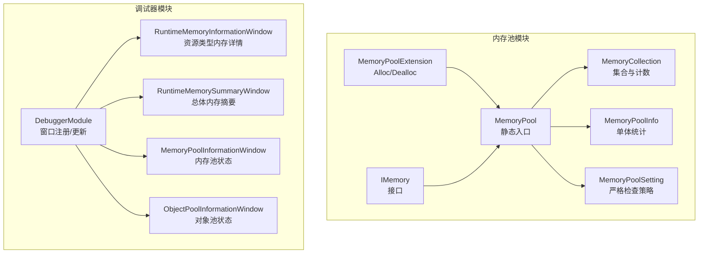
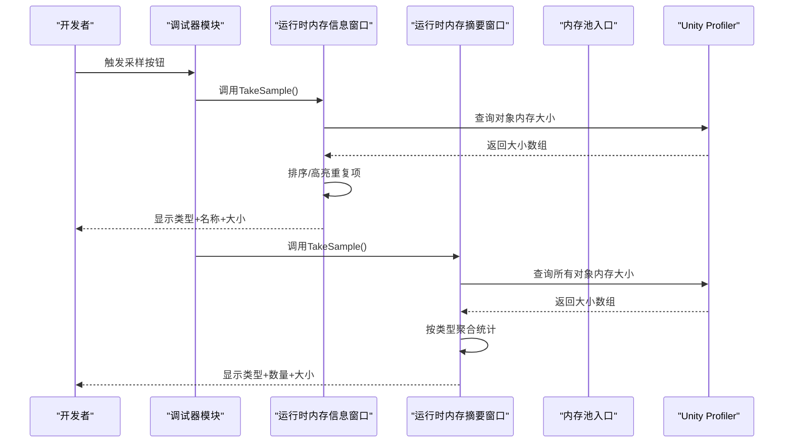
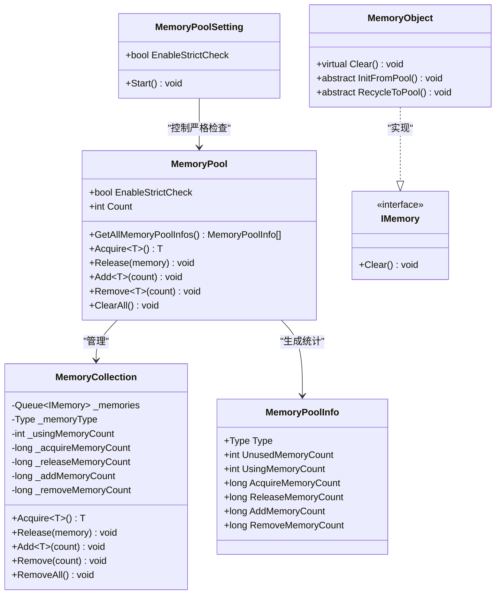
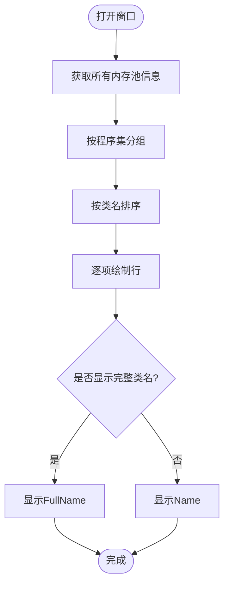
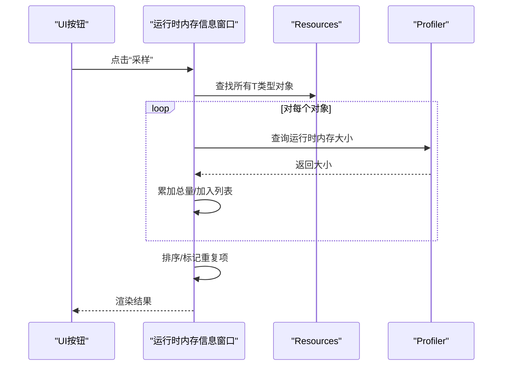
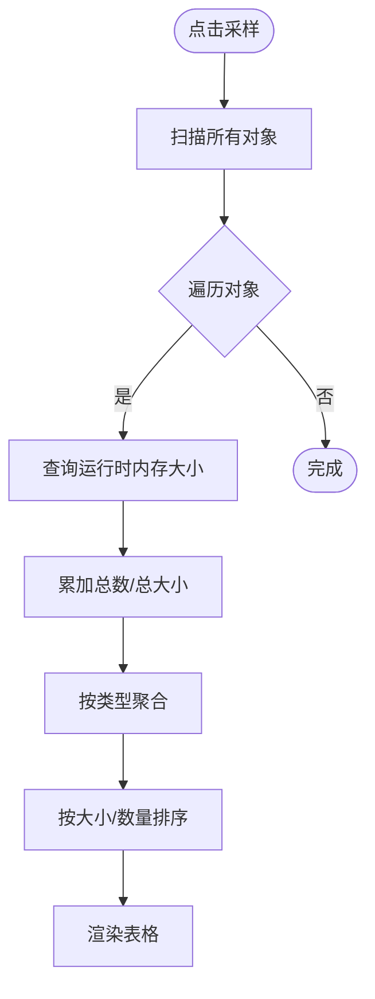
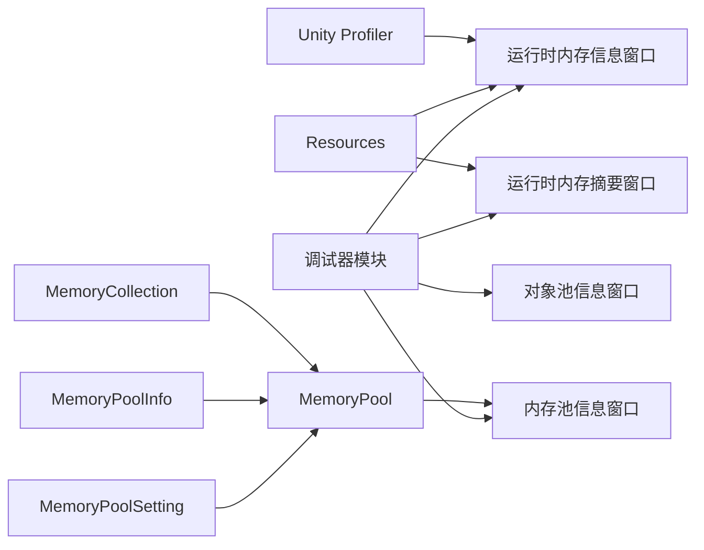

# 内存调试工具

<cite>
**本文引用的文件**
- [MemoryPool.cs](file://Assets/TEngine/Runtime/Core/MemoryPool/MemoryPool.cs)
- [MemoryPool.MemoryCollection.cs](file://Assets/TEngine/Runtime/Core/MemoryPool/MemoryPool.MemoryCollection.cs)
- [MemoryPoolInfo.cs](file://Assets/TEngine/Runtime/Core/MemoryPool/MemoryPoolInfo.cs)
- [MemoryPoolSetting.cs](file://Assets/TEngine/Runtime/Core/MemoryPool/MemoryPoolSetting.cs)
- [MemoryPoolExtension.cs](file://Assets/TEngine/Runtime/Core/MemoryPool/MemoryPoolExtension.cs)
- [IMemory.cs](file://Assets/TEngine/Runtime/Core/MemoryPool/IMemory.cs)
- [DebuggerModule.cs](file://Assets/TEngine/Runtime/Module/DebugerModule/DebuggerModule.cs)
- [RuntimeMemoryInformationWindow.cs](file://Assets/TEngine/Runtime/Module/DebugerModule/Component/DebuggerModule.RuntimeMemoryInformationWindow.cs)
- [RuntimeMemorySummaryWindow.cs](file://Assets/TEngine/Runtime/Module/DebugerModule/Component/DebuggerModule.RuntimeMemorySummaryWindow.cs)
- [RuntimeMemorySummaryWindow.Record.cs](file://Assets/TEngine/Runtime/Module/DebugerModule/Component/DebuggerModule.RuntimeMemorySummaryWindow.Record.cs)
- [MemoryPoolInformationWindow.cs](file://Assets/TEngine/Runtime/Module/DebugerModule/Component/DebuggerModule.MemoryPoolInformationWindow.cs)
- [ObjectPoolInformationWindow.cs](file://Assets/TEngine/Runtime/Module/DebugerModule/Component/DebuggerModule.ObjectPoolInformationWindow.cs)
</cite>

## 目录
1. [简介](#简介)
2. [项目结构](#项目结构)
3. [核心组件](#核心组件)
4. [架构总览](#架构总览)
5. [详细组件分析](#详细组件分析)
6. [依赖关系分析](#依赖关系分析)
7. [性能考量](#性能考量)
8. [故障排查指南](#故障排查指南)
9. [结论](#结论)
10. [附录](#附录)

## 简介
本文件面向TEngine内存调试工具，系统化梳理内存信息窗口、内存摘要窗口与内存池信息窗口的功能与实现，解释运行时内存统计、资源类型内存占用分析、内存池状态监控等核心能力；并提供内存泄漏检测、内存峰值监控、内存碎片分析与大对象跟踪等高级调试技巧及最佳实践。

## 项目结构
TEngine的内存调试能力由“内存池模块”与“调试器模块”协同实现：
- 内存池模块：提供内存对象生命周期管理（获取/归还/扩容/收缩），并暴露统计信息供调试窗口使用。
- 调试器模块：提供可视化窗口，采集并展示运行时内存数据，支持按资源类型与总体维度查看。

图示来源
- [MemoryPool.cs:1-208](file://Assets/TEngine/Runtime/Core/MemoryPool/MemoryPool.cs#L1-L208)
- [MemoryPool.MemoryCollection.cs:1-157](file://Assets/TEngine/Runtime/Core/MemoryPool/MemoryPool.MemoryCollection.cs#L1-L157)
- [MemoryPoolInfo.cs:1-119](file://Assets/TEngine/Runtime/Core/MemoryPool/MemoryPoolInfo.cs#L1-L119)
- [MemoryPoolSetting.cs:1-80](file://Assets/TEngine/Runtime/Core/MemoryPool/MemoryPoolSetting.cs#L1-L80)
- [MemoryPoolExtension.cs:1-57](file://Assets/TEngine/Runtime/Core/MemoryPool/MemoryPoolExtension.cs#L1-L57)
- [IMemory.cs:1-14](file://Assets/TEngine/Runtime/Core/MemoryPool/IMemory.cs#L1-L14)
- [DebuggerModule.cs:1-116](file://Assets/TEngine/Runtime/Module/DebugerModule/DebuggerModule.cs#L1-L116)
- [RuntimeMemoryInformationWindow.cs:1-135](file://Assets/TEngine/Runtime/Module/DebugerModule/Component/DebuggerModule.RuntimeMemoryInformationWindow.cs#L1-L135)
- [RuntimeMemorySummaryWindow.cs:1-123](file://Assets/TEngine/Runtime/Module/DebugerModule/Component/DebuggerModule.RuntimeMemorySummaryWindow.cs#L1-L123)
- [MemoryPoolInformationWindow.cs:1-106](file://Assets/TEngine/Runtime/Module/DebugerModule/Component/DebuggerModule.MemoryPoolInformationWindow.cs#L1-L106)
- [ObjectPoolInformationWindow.cs:1-88](file://Assets/TEngine/Runtime/Module/DebugerModule/Component/DebuggerModule.ObjectPoolInformationWindow.cs#L1-L88)

章节来源
- [DebuggerModule.cs:1-116](file://Assets/TEngine/Runtime/Module/DebugerModule/DebuggerModule.cs#L1-L116)

## 核心组件
- 内存池入口（MemoryPool）：提供获取/归还、扩容/收缩、清空、统计查询等能力；支持严格检查开关。
- 内存集合（MemoryCollection）：维护队列与各类计数（使用中/未使用/获取/归还/新增/移除）。
- 内存池信息（MemoryPoolInfo）：封装单个类型内存池的统计数据。
- 内存池设置（MemoryPoolSetting）：根据构建环境控制严格检查策略。
- 内存扩展（MemoryPoolExtension）：提供Alloc/Dealloc便捷方法，统一初始化与回收流程。
- 调试窗口：
  - 运行时内存信息窗口（按资源类型）：采样并排序显示对象名称、类型与大小。
  - 运行时内存摘要窗口（总体）：按类型聚合统计数量与大小。
  - 内存池信息窗口：按程序集分组展示各类型内存池的使用与计数。
  - 对象池信息窗口：展示对象池集合的容量、使用、过期、优先级等状态。

章节来源
- [MemoryPool.cs:1-208](file://Assets/TEngine/Runtime/Core/MemoryPool/MemoryPool.cs#L1-L208)
- [MemoryPool.MemoryCollection.cs:1-157](file://Assets/TEngine/Runtime/Core/MemoryPool/MemoryPool.MemoryCollection.cs#L1-L157)
- [MemoryPoolInfo.cs:1-119](file://Assets/TEngine/Runtime/Core/MemoryPool/MemoryPoolInfo.cs#L1-L119)
- [MemoryPoolSetting.cs:1-80](file://Assets/TEngine/Runtime/Core/MemoryPool/MemoryPoolSetting.cs#L1-L80)
- [MemoryPoolExtension.cs:1-57](file://Assets/TEngine/Runtime/Core/MemoryPool/MemoryPoolExtension.cs#L1-L57)
- [RuntimeMemoryInformationWindow.cs:1-135](file://Assets/TEngine/Runtime/Module/DebugerModule/Component/DebuggerModule.RuntimeMemoryInformationWindow.cs#L1-L135)
- [RuntimeMemorySummaryWindow.cs:1-123](file://Assets/TEngine/Runtime/Module/DebugerModule/Component/DebuggerModule.RuntimeMemorySummaryWindow.cs#L1-L123)
- [MemoryPoolInformationWindow.cs:1-106](file://Assets/TEngine/Runtime/Module/DebugerModule/Component/DebuggerModule.MemoryPoolInformationWindow.cs#L1-L106)
- [ObjectPoolInformationWindow.cs:1-88](file://Assets/TEngine/Runtime/Module/DebugerModule/Component/DebuggerModule.ObjectPoolInformationWindow.cs#L1-L88)

## 架构总览
内存调试工具通过“采样—统计—展示”的闭环工作流实现：
- 采样：利用Unity Profiler接口对对象进行内存大小测量。
- 统计：按类型聚合或按实例明细记录，维护累计计数与当前状态。
- 展示：以滚动窗口形式输出，支持排序、筛选与切换视图。

图示来源
- [RuntimeMemoryInformationWindow.cs:82-114](file://Assets/TEngine/Runtime/Module/DebugerModule/Component/DebuggerModule.RuntimeMemoryInformationWindow.cs#L82-L114)
- [RuntimeMemorySummaryWindow.cs:61-102](file://Assets/TEngine/Runtime/Module/DebugerModule/Component/DebuggerModule.RuntimeMemorySummaryWindow.cs#L61-L102)

## 详细组件分析

### 内存池模块（MemoryPool）
- 功能要点
  - 获取/归还：从集合队列取出或放回对象，维护使用计数。
  - 扩容/收缩：动态新增或移除对象，记录新增/移除计数。
  - 统计查询：遍历集合生成MemoryPoolInfo数组，供调试窗口使用。
  - 严格检查：可在校验失败时抛出异常，便于定位误用。
- 数据结构与复杂度
  - 队列存储对象，获取/归还为O(1)，扩容/收缩为O(n)。
  - 统计查询需遍历字典，时间复杂度O(n)。
- 错误处理
  - 类型不匹配、空引用、重复归还等场景抛出异常，保证一致性。

图示来源
- [MemoryPool.cs:1-208](file://Assets/TEngine/Runtime/Core/MemoryPool/MemoryPool.cs#L1-L208)
- [MemoryPool.MemoryCollection.cs:1-157](file://Assets/TEngine/Runtime/Core/MemoryPool/MemoryPool.MemoryCollection.cs#L1-L157)
- [MemoryPoolInfo.cs:1-119](file://Assets/TEngine/Runtime/Core/MemoryPool/MemoryPoolInfo.cs#L1-L119)
- [MemoryPoolSetting.cs:1-80](file://Assets/TEngine/Runtime/Core/MemoryPool/MemoryPoolSetting.cs#L1-L80)
- [MemoryPoolExtension.cs:1-57](file://Assets/TEngine/Runtime/Core/MemoryPool/MemoryPoolExtension.cs#L1-L57)
- [IMemory.cs:1-14](file://Assets/TEngine/Runtime/Core/MemoryPool/IMemory.cs#L1-L14)

章节来源
- [MemoryPool.cs:1-208](file://Assets/TEngine/Runtime/Core/MemoryPool/MemoryPool.cs#L1-L208)
- [MemoryPool.MemoryCollection.cs:1-157](file://Assets/TEngine/Runtime/Core/MemoryPool/MemoryPool.MemoryCollection.cs#L1-L157)
- [MemoryPoolInfo.cs:1-119](file://Assets/TEngine/Runtime/Core/MemoryPool/MemoryPoolInfo.cs#L1-L119)
- [MemoryPoolSetting.cs:1-80](file://Assets/TEngine/Runtime/Core/MemoryPool/MemoryPoolSetting.cs#L1-L80)
- [MemoryPoolExtension.cs:1-57](file://Assets/TEngine/Runtime/Core/MemoryPool/MemoryPoolExtension.cs#L1-L57)
- [IMemory.cs:1-14](file://Assets/TEngine/Runtime/Core/MemoryPool/IMemory.cs#L1-L14)

### 内存池信息窗口（MemoryPoolInformationWindow）
- 功能概述
  - 展示严格检查开关与内存池总数。
  - 按程序集分组列出各类型内存池的使用情况：未使用、使用中、获取次数、归还次数、新增次数、移除次数。
  - 支持切换显示完整类名或短类名。
- 数据来源
  - 调用MemoryPool.GetAllMemoryPoolInfos()获取统计数组，再按程序集分组渲染。
- 使用建议
  - 在开发阶段开启严格检查，定位重复归还、类型不匹配等问题。
  - 结合“新增/移除”计数判断是否存在扩容/收缩异常。

图示来源
- [MemoryPoolInformationWindow.cs:16-78](file://Assets/TEngine/Runtime/Module/DebugerModule/Component/DebuggerModule.MemoryPoolInformationWindow.cs#L16-L78)
- [MemoryPool.cs:33-48](file://Assets/TEngine/Runtime/Core/MemoryPool/MemoryPool.cs#L33-L48)

章节来源
- [MemoryPoolInformationWindow.cs:1-106](file://Assets/TEngine/Runtime/Module/DebugerModule/Component/DebuggerModule.MemoryPoolInformationWindow.cs#L1-L106)
- [MemoryPool.cs:33-48](file://Assets/TEngine/Runtime/Core/MemoryPool/MemoryPool.cs#L33-L48)

### 运行时内存信息窗口（按资源类型）
- 功能概述
  - 采样指定类型的对象，计算其运行时内存大小并排序。
  - 高亮重复的对象（同名/同类型/同大小），提示潜在泄漏或缓存问题。
  - 限制显示数量，避免界面卡顿。
- 数据来源
  - 通过Resources.FindObjectsOfTypeAll<T>()获取实例，Profiler.GetRuntimeMemorySize获取大小。
- 使用建议
  - 定期对比采样结果，观察重复项增长趋势。
  - 关注大对象与高频创建对象，评估是否可复用或延迟创建。

图示来源
- [RuntimeMemoryInformationWindow.cs:82-114](file://Assets/TEngine/Runtime/Module/DebugerModule/Component/DebuggerModule.RuntimeMemoryInformationWindow.cs#L82-L114)

章节来源
- [RuntimeMemoryInformationWindow.cs:1-135](file://Assets/TEngine/Runtime/Module/DebugerModule/Component/DebuggerModule.RuntimeMemoryInformationWindow.cs#L1-L135)

### 运行时内存摘要窗口（总体）
- 功能概述
  - 采样所有UnityEngine.Object，按类型聚合统计数量与总大小。
  - 支持按键触发采样，展示采样时间、对象总数与总内存。
- 数据来源
  - 通过Resources.FindObjectsOfTypeAll<UnityEngine.Object>()遍历，Profiler.GetRuntimeMemorySize聚合。
- 使用建议
  - 作为“全局体检”，定期对比不同阶段的统计数据，识别内存增长异常。
  - 关注占比高的类型，结合资源清单定位来源。

图示来源
- [RuntimeMemorySummaryWindow.cs:61-102](file://Assets/TEngine/Runtime/Module/DebugerModule/Component/DebuggerModule.RuntimeMemorySummaryWindow.cs#L61-L102)
- [RuntimeMemorySummaryWindow.Record.cs:1-55](file://Assets/TEngine/Runtime/Module/DebugerModule/Component/DebuggerModule.RuntimeMemorySummaryWindow.Record.cs#L1-L55)

章节来源
- [RuntimeMemorySummaryWindow.cs:1-123](file://Assets/TEngine/Runtime/Module/DebugerModule/Component/DebuggerModule.RuntimeMemorySummaryWindow.cs#L1-L123)
- [RuntimeMemorySummaryWindow.Record.cs:1-55](file://Assets/TEngine/Runtime/Module/DebugerModule/Component/DebuggerModule.RuntimeMemorySummaryWindow.Record.cs#L1-L55)

### 对象池信息窗口（ObjectPoolInformationWindow）
- 功能概述
  - 展示对象池集合数量与各对象池的容量、使用、过期、优先级等状态。
  - 列出每个对象的名称、锁定、使用/计数、标志位与最后使用时间。
- 使用建议
  - 关注CanReleaseCount与ExpireTime，评估回收策略是否合理。
  - 大量锁定对象可能意味着生命周期管理不当。

章节来源
- [ObjectPoolInformationWindow.cs:1-88](file://Assets/TEngine/Runtime/Module/DebugerModule/Component/DebuggerModule.ObjectPoolInformationWindow.cs#L1-L88)

## 依赖关系分析
- 内存池模块内部依赖
  - MemoryPool依赖MemoryCollection与MemoryPoolInfo；MemoryCollection依赖IMemory接口。
  - MemoryPoolExtension基于MemoryPool提供Alloc/Dealloc便捷方法。
- 调试窗口依赖
  - 运行时内存信息/摘要窗口依赖Unity Profiler接口与Resources查找。
  - 内存池信息窗口依赖MemoryPool.GetAllMemoryPoolInfos()。
  - 对象池信息窗口依赖对象池模块接口。
- 耦合与内聚
  - 内存池模块内聚度高，职责清晰；调试窗口通过只读统计接口访问，耦合度低。
  - 严格检查策略通过MemoryPoolSetting注入，便于按环境控制。

图示来源
- [RuntimeMemoryInformationWindow.cs:82-114](file://Assets/TEngine/Runtime/Module/DebugerModule/Component/DebuggerModule.RuntimeMemoryInformationWindow.cs#L82-L114)
- [RuntimeMemorySummaryWindow.cs:61-102](file://Assets/TEngine/Runtime/Module/DebugerModule/Component/DebuggerModule.RuntimeMemorySummaryWindow.cs#L61-L102)
- [MemoryPool.cs:33-48](file://Assets/TEngine/Runtime/Core/MemoryPool/MemoryPool.cs#L33-L48)
- [MemoryPool.MemoryCollection.cs:1-157](file://Assets/TEngine/Runtime/Core/MemoryPool/MemoryPool.MemoryCollection.cs#L1-L157)
- [MemoryPoolInfo.cs:1-119](file://Assets/TEngine/Runtime/Core/MemoryPool/MemoryPoolInfo.cs#L1-L119)
- [MemoryPoolSetting.cs:1-80](file://Assets/TEngine/Runtime/Core/MemoryPool/MemoryPoolSetting.cs#L1-L80)
- [DebuggerModule.cs:1-116](file://Assets/TEngine/Runtime/Module/DebugerModule/DebuggerModule.cs#L1-L116)

章节来源
- [DebuggerModule.cs:1-116](file://Assets/TEngine/Runtime/Module/DebugerModule/DebuggerModule.cs#L1-L116)
- [MemoryPool.cs:1-208](file://Assets/TEngine/Runtime/Core/MemoryPool/MemoryPool.cs#L1-L208)

## 性能考量
- 采样开销
  - 采样涉及遍历大量对象并调用Profiler接口，建议在开发阶段使用，避免在发布版本频繁采样。
- UI渲染
  - 采样结果列表存在上限控制，避免超大数据集导致界面卡顿。
- 严格检查
  - 开启严格检查会显著影响性能，仅在开发/编辑器阶段启用。
- 建议
  - 将采样频率控制在可接受范围内，结合定时任务或事件驱动触发。
  - 对热点类型单独采样，减少全量扫描成本。

## 故障排查指南
- 常见问题
  - 重复归还：严格检查开启时，若同一对象被重复归还会抛出异常，定位到具体类型与调用链。
  - 类型不匹配：Acquire/Release/Add/Remove传入类型与集合声明类型不一致会抛出异常。
  - 归还后再次使用：对象被归还后仍被使用，应检查生命周期管理。
- 定位步骤
  - 打开内存池信息窗口，查看对应类型的“使用中/归还次数/新增次数/移除次数”变化。
  - 使用运行时内存信息窗口，关注重复项与大对象，结合资源清单定位来源。
  - 对比运行时内存摘要窗口不同阶段的数据，识别异常增长类型。
- 修复建议
  - 统一使用MemoryPoolExtension提供的Alloc/Dealloc，确保初始化与回收流程一致。
  - 对热点对象采用内存池复用，避免频繁创建销毁。
  - 合理设置对象池容量与过期时间，平衡内存占用与回收效率。

章节来源
- [MemoryPool.cs:164-185](file://Assets/TEngine/Runtime/Core/MemoryPool/MemoryPool.cs#L164-L185)
- [MemoryPool.MemoryCollection.cs:83-98](file://Assets/TEngine/Runtime/Core/MemoryPool/MemoryPool.MemoryCollection.cs#L83-L98)
- [MemoryPoolInformationWindow.cs:1-106](file://Assets/TEngine/Runtime/Module/DebugerModule/Component/DebuggerModule.MemoryPoolInformationWindow.cs#L1-L106)
- [RuntimeMemoryInformationWindow.cs:1-135](file://Assets/TEngine/Runtime/Module/DebugerModule/Component/DebuggerModule.RuntimeMemoryInformationWindow.cs#L1-L135)
- [RuntimeMemorySummaryWindow.cs:1-123](file://Assets/TEngine/Runtime/Module/DebugerModule/Component/DebuggerModule.RuntimeMemorySummaryWindow.cs#L1-L123)

## 结论
TEngine内存调试工具通过“内存池+调试窗口”的组合，提供了从总体到细节的多维内存观测能力。配合严格检查与采样机制，能够高效定位内存泄漏、异常增长与资源滥用问题。建议在开发阶段充分利用这些工具，形成常态化的内存健康巡检流程。

## 附录
- 最佳实践
  - 开发阶段开启严格检查，快速发现误用。
  - 定期对比运行时内存摘要，建立基线与阈值。
  - 对重复项与大对象进行专项治理，优先优化热点类型。
  - 使用内存池复用高频对象，降低GC压力。
- 高级技巧
  - 内存峰值监控：在关键节点（关卡切换、活动开始）采样，记录峰值与持续时间。
  - 内存碎片分析：关注未使用对象数量与新增/移除比例，评估碎片风险。
  - 大对象跟踪：结合运行时内存信息窗口，定位占用较大的对象并优化其生命周期与结构。