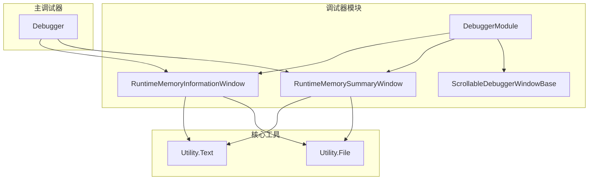
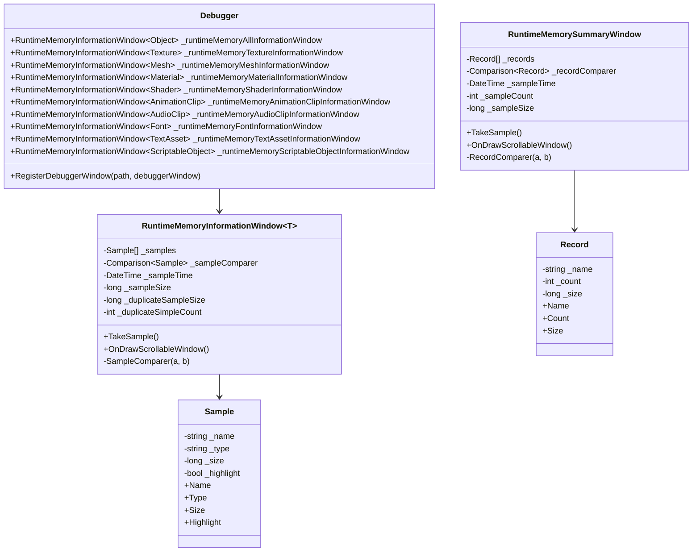
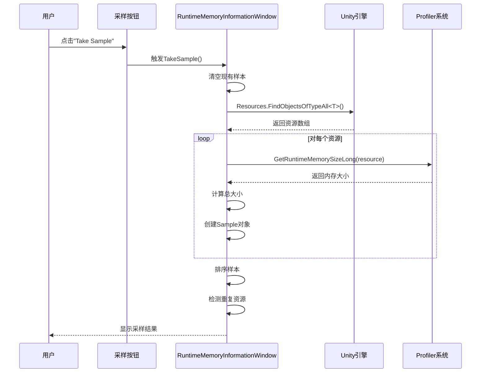
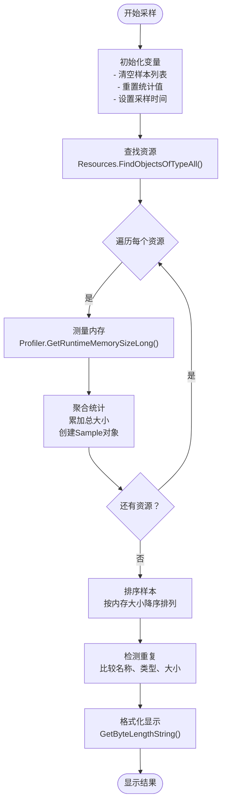
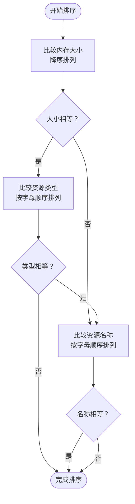
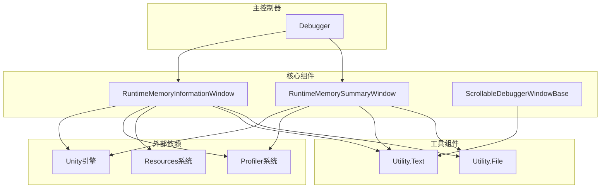

# 运行时内存监控

<cite>
**本文档引用的文件**
- [DebuggerModule.RuntimeMemoryInformationWindow.cs](file://Assets/TEngine/Runtime/Module/DebugerModule/Component/DebuggerModule.RuntimeMemoryInformationWindow.cs)
- [DebuggerModule.RuntimeMemoryInformationWindow.Sample.cs](file://Assets/TEngine/Runtime/Module/DebugerModule/Component/DebuggerModule.RuntimeMemoryInformationWindow.Sample.cs)
- [DebuggerModule.RuntimeMemorySummaryWindow.cs](file://Assets/TEngine/Runtime/Module/DebugerModule/Component/DebuggerModule.RuntimeMemorySummaryWindow.cs)
- [DebuggerModule.RuntimeMemorySummaryWindow.Record.cs](file://Assets/TEngine/Runtime/Module/DebugerModule/Component/DebuggerModule.RuntimeMemorySummaryWindow.Record.cs)
- [DebuggerModule.ScrollableDebuggerWindowBase.cs](file://Assets/TEngine/Runtime/Module/DebugerModule/Component/DebuggerModule.ScrollableDebuggerWindowBase.cs)
- [Utility.Text.cs](file://Assets/TEngine/Runtime/Core/Utility/Utility.Text.cs)
- [Utility.File.cs](file://Assets/TEngine/Runtime/Core/Utility/Utility.File.cs)
- [Debugger.cs](file://Assets/TEngine/Runtime/Module/DebugerModule/Debugger.cs)
</cite>

## 目录
1. [简介](#简介)
2. [项目结构](#项目结构)
3. [核心组件](#核心组件)
4. [架构概览](#架构概览)
5. [详细组件分析](#详细组件分析)
6. [依赖关系分析](#依赖关系分析)
7. [性能考虑](#性能考虑)
8. [故障排除指南](#故障排除指南)
9. [结论](#结论)
10. [附录](#附录)

## 简介

TEngine运行时内存监控功能是一个强大的调试工具集，专门用于实时监控Unity游戏在运行时的内存使用情况。该系统通过RuntimeMemoryInformationWindow类为核心，提供了对各种Unity资源类型的内存采样、统计和可视化功能。

本功能的主要特点包括：
- 支持多种资源类型的内存监控（Texture、Material、GameObject、AudioClip等）
- 实时内存采样和统计
- 智能重复资源识别
- 多层次的内存统计视图
- 用户友好的可视化界面

## 项目结构

TEngine内存监控功能主要位于以下目录结构中：

**图表来源**
- [DebuggerModule.RuntimeMemoryInformationWindow.cs:1-135](file://Assets/TEngine/Runtime/Module/DebugerModule/Component/DebuggerModule.RuntimeMemoryInformationWindow.cs#L1-L135)
- [DebuggerModule.RuntimeMemorySummaryWindow.cs:1-123](file://Assets/TEngine/Runtime/Module/DebugerModule/Component/DebuggerModule.RuntimeMemorySummaryWindow.cs#L1-L123)
- [Debugger.cs:69-81](file://Assets/TEngine/Runtime/Module/DebugerModule/Debugger.cs#L69-L81)

**章节来源**
- [Debugger.cs:69-81](file://Assets/TEngine/Runtime/Module/DebugerModule/Debugger.cs#L69-L81)
- [DebuggerModule.RuntimeMemoryInformationWindow.cs:1-135](file://Assets/TEngine/Runtime/Module/DebugerModule/Component/DebuggerModule.RuntimeMemoryInformationWindow.cs#L1-L135)

## 核心组件

### RuntimeMemoryInformationWindow<T>

这是内存监控系统的核心类，采用泛型设计支持不同类型的Unity资源。其主要职责包括：

- **内存采样**：实时收集指定类型资源的内存使用信息
- **数据统计**：计算总内存占用、平均大小等统计信息
- **重复识别**：自动检测并高亮显示重复的资源实例
- **排序展示**：按内存大小对资源进行降序排列

### Sample数据模型

每个采样结果都封装在Sample类中，包含以下关键属性：
- 资源名称（Name）
- 资源类型（Type）
- 内存大小（Size）
- 高亮状态（Highlight）

### RuntimeMemorySummaryWindow

提供全局内存统计视图，汇总所有资源类型的内存使用情况，支持按类型分组统计。

**章节来源**
- [DebuggerModule.RuntimeMemoryInformationWindow.cs:12-22](file://Assets/TEngine/Runtime/Module/DebugerModule/Component/DebuggerModule.RuntimeMemoryInformationWindow.cs#L12-L22)
- [DebuggerModule.RuntimeMemoryInformationWindow.Sample.cs:7-57](file://Assets/TEngine/Runtime/Module/DebugerModule/Component/DebuggerModule.RuntimeMemoryInformationWindow.Sample.cs#L7-L57)
- [DebuggerModule.RuntimeMemorySummaryWindow.cs:12-18](file://Assets/TEngine/Runtime/Module/DebugerModule/Component/DebuggerModule.RuntimeMemorySummaryWindow.cs#L12-L18)

## 架构概览

**图表来源**
- [Debugger.cs:69-79](file://Assets/TEngine/Runtime/Module/DebugerModule/Debugger.cs#L69-L79)
- [DebuggerModule.RuntimeMemoryInformationWindow.cs:12-21](file://Assets/TEngine/Runtime/Module/DebugerModule/Component/DebuggerModule.RuntimeMemoryInformationWindow.cs#L12-L21)
- [DebuggerModule.RuntimeMemoryInformationWindow.Sample.cs:7-57](file://Assets/TEngine/Runtime/Module/DebugerModule/Component/DebuggerModule.RuntimeMemoryInformationWindow.Sample.cs#L7-L57)
- [DebuggerModule.RuntimeMemorySummaryWindow.cs:12-18](file://Assets/TEngine/Runtime/Module/DebugerModule/Component/DebuggerModule.RuntimeMemorySummaryWindow.cs#L12-L18)
- [DebuggerModule.RuntimeMemorySummaryWindow.Record.cs:7-50](file://Assets/TEngine/Runtime/Module/DebugerModule/Component/DebuggerModule.RuntimeMemorySummaryWindow.Record.cs#L7-L50)

## 详细组件分析

### 内存采样机制

#### 采样触发方式

内存采样通过用户交互触发，主要通过点击"Take Sample"按钮来启动采样过程。采样机制具有以下特点：

**图表来源**
- [DebuggerModule.RuntimeMemoryInformationWindow.cs:82-114](file://Assets/TEngine/Runtime/Module/DebugerModule/Component/DebuggerModule.RuntimeMemoryInformationWindow.cs#L82-L114)

#### 数据收集过程

采样过程严格按照以下步骤执行：

1. **初始化状态**：清空样本列表，重置时间戳和统计值
2. **资源发现**：使用`Resources.FindObjectsOfTypeAll<T>()`获取指定类型的资源实例
3. **内存测量**：对每个资源调用`Profiler.GetRuntimeMemorySizeLong()`获取精确的内存占用
4. **数据聚合**：累加计算总内存使用量
5. **样本创建**：为每个资源创建Sample对象，包含名称、类型和内存大小
6. **排序处理**：按照内存大小进行降序排序
7. **重复检测**：识别并标记重复的资源实例

**章节来源**
- [DebuggerModule.RuntimeMemoryInformationWindow.cs:82-114](file://Assets/TEngine/Runtime/Module/DebugerModule/Component/DebuggerModule.RuntimeMemoryInformationWindow.cs#L82-L114)

### 资源类型分类统计

#### 支持的资源类型

系统为以下Unity核心资源类型提供了专门的监控窗口：

| 资源类型 | 监控窗口 | 使用场景 |
|---------|---------|----------|
| Texture | Texture窗口 | 纹理资源内存监控 |
| Mesh | Mesh窗口 | 3D模型网格内存监控 |
| Material | Material窗口 | 材质资源内存监控 |
| Shader | Shader窗口 | 着色器程序内存监控 |
| AnimationClip | AnimationClip窗口 | 动画数据内存监控 |
| AudioClip | AudioClip窗口 | 音频资源内存监控 |
| Font | Font窗口 | 字体资源内存监控 |
| TextAsset | TextAsset窗口 | 文本资源内存监控 |
| ScriptableObject | ScriptableObject窗口 | 脚本化对象内存监控 |

#### 统计维度

每种资源类型的统计包括：
- **实例数量**：当前场景中该类型资源的实例总数
- **总内存占用**：所有实例的内存使用总量
- **平均内存大小**：单个实例的平均内存占用
- **最大内存实例**：内存占用最大的单个实例
- **重复实例检测**：识别并标记重复的资源实例

**章节来源**
- [Debugger.cs:70-79](file://Assets/TEngine/Runtime/Module/DebugerModule/Debugger.cs#L70-L79)

### 内存大小计算方法

#### 精确内存测量

系统使用Unity Profiler API提供的精确内存测量功能：

**图表来源**
- [DebuggerModule.RuntimeMemoryInformationWindow.cs:82-114](file://Assets/TEngine/Runtime/Module/DebugerModule/Component/DebuggerModule.RuntimeMemoryInformationWindow.cs#L82-L114)

#### 内存格式化显示

系统提供了统一的内存大小格式化功能，支持多种单位的自动转换：

| 单位 | 范围 | 显示格式 |
|------|------|----------|
| Bytes | 0-1023 | "X Bytes" |
| KB | 1024-1,048,575 | "X.XX KB" |
| MB | 1,048,576-1,073,741,823 | "X.XX MB" |
| GB | 1,073,741,824-1,099,511,627,775 | "X.XX GB" |
| TB | 1,099,511,627,776-1,125,899,906,842,623 | "X.XX TB" |
| PB | 1,125,899,906,842,624-1,152,921,504,606,846,975 | "X.XX PB" |
| EB | 1,152,921,504,606,846,976+ | "X.XX EB" |

**章节来源**
- [Utility.File.cs:165-188](file://Assets/TEngine/Runtime/Core/Utility/Utility.File.cs#L165-L188)
- [DebuggerModule.ScrollableDebuggerWindowBase.cs:56-89](file://Assets/TEngine/Runtime/Module/DebugerModule/Component/DebuggerModule.ScrollableDebuggerWindowBase.cs#L56-L89)

### 排序算法实现

#### 主排序规则

系统实现了多级排序算法，确保结果的逻辑性和可读性：

**图表来源**
- [DebuggerModule.RuntimeMemoryInformationWindow.cs:116-131](file://Assets/TEngine/Runtime/Module/DebugerModule/Component/DebuggerModule.RuntimeMemoryInformationWindow.cs#L116-L131)

#### 重复资源识别

系统能够智能识别重复的资源实例，通过以下条件判断：

1. **名称相同**：两个资源实例的名称完全一致
2. **类型相同**：两个资源实例的类型完全一致  
3. **大小相同**：两个资源实例的内存占用完全一致

当满足以上三个条件时，系统会将重复资源标记为高亮状态，便于开发者快速识别潜在的内存浪费问题。

**章节来源**
- [DebuggerModule.RuntimeMemoryInformationWindow.cs:105-113](file://Assets/TEngine/Runtime/Module/DebugerModule/Component/DebuggerModule.RuntimeMemoryInformationWindow.cs#L105-L113)

## 依赖关系分析

### 组件耦合度

**图表来源**
- [DebuggerModule.RuntimeMemoryInformationWindow.cs:1-6](file://Assets/TEngine/Runtime/Module/DebugerModule/Component/DebuggerModule.RuntimeMemoryInformationWindow.cs#L1-L6)
- [DebuggerModule.RuntimeMemorySummaryWindow.cs:1-6](file://Assets/TEngine/Runtime/Module/DebugerModule/Component/DebuggerModule.RuntimeMemorySummaryWindow.cs#L1-L6)
- [Debugger.cs:69-79](file://Assets/TEngine/Runtime/Module/DebugerModule/Debugger.cs#L69-L79)

### 关键依赖关系

1. **Unity Profiler集成**：直接依赖Unity的Profiler API进行精确内存测量
2. **Resources系统集成**：使用Unity的Resources系统发现和枚举资源实例
3. **文本格式化工具**：依赖Utility.Text和Utility.File提供的格式化功能
4. **调试器框架**：作为Debugger模块的一部分，遵循TEngine的调试器架构模式

**章节来源**
- [DebuggerModule.RuntimeMemoryInformationWindow.cs:4-6](file://Assets/TEngine/Runtime/Module/DebugerModule/Component/DebuggerModule.RuntimeMemoryInformationWindow.cs#L4-L6)
- [DebuggerModule.RuntimeMemorySummaryWindow.cs:4-6](file://Assets/TEngine/Runtime/Module/DebugerModule/Component/DebuggerModule.RuntimeMemorySummaryWindow.cs#L4-L6)

## 性能考虑

### 采样频率控制

由于内存采样涉及对所有资源实例的遍历和测量，建议遵循以下频率控制原则：

- **开发阶段**：建议每30-60秒进行一次采样，避免频繁采样影响游戏性能
- **测试阶段**：建议每2-5分钟进行一次采样，重点关注内存增长趋势
- **生产环境**：不建议启用内存监控，仅在调试模式下使用

### 内存峰值检测

系统提供了内置的内存峰值检测功能：

1. **实时监控**：每次采样都会记录当前的时间戳和内存使用量
2. **历史对比**：可以对比不同时间点的内存使用情况
3. **趋势分析**：通过多次采样的结果分析内存使用趋势

### 重复资源识别优化

重复资源识别算法的时间复杂度为O(n)，其中n为资源实例数量。为了优化性能：

- **限制显示数量**：默认只显示前300个最大的资源实例
- **增量更新**：只对新增或变化的资源进行重新计算
- **缓存机制**：对已计算的结果进行缓存，避免重复计算

## 故障排除指南

### 常见问题及解决方案

#### 问题1：采样结果显示为空

**可能原因**：
- 目标资源类型在当前场景中不存在
- 资源被动态销毁或卸载
- 权限限制导致无法访问某些资源

**解决方法**：
1. 确认目标资源类型是否正确
2. 切换到包含目标资源的场景
3. 检查资源的生命周期和加载状态

#### 问题2：内存测量结果异常

**可能原因**：
- Unity版本差异导致的API变化
- 资源类型不支持精确测量
- 缓存数据过期

**解决方法**：
1. 更新到最新版本的Unity引擎
2. 尝试使用不同的资源类型进行测试
3. 重启游戏以清除缓存数据

#### 问题3：重复资源识别误报

**可能原因**：
- 同名但不同类型的资源实例
- 动态创建的资源实例具有相同的属性

**解决方法**：
1. 检查资源的完整类型信息
2. 区分同名但不同用途的资源
3. 调整重复检测的阈值

**章节来源**
- [DebuggerModule.RuntimeMemoryInformationWindow.cs:34-47](file://Assets/TEngine/Runtime/Module/DebugerModule/Component/DebuggerModule.RuntimeMemoryInformationWindow.cs#L34-L47)

### 调试技巧

#### 最佳实践建议

1. **定期监控**：建立定期内存监控的开发流程
2. **基准测试**：建立不同场景下的内存使用基准
3. **趋势分析**：关注内存使用的长期趋势而非瞬时波动
4. **资源优化**：根据监控结果优化资源管理和生命周期

#### 高级功能使用

- **批量资源检查**：同时监控多个资源类型的内存使用
- **历史数据对比**：保存多次采样的结果进行对比分析
- **自动化报告**：将监控结果导出为报告用于团队分享

## 结论

TEngine运行时内存监控功能通过RuntimeMemoryInformationWindow类提供了强大而灵活的内存监控能力。该系统的设计充分考虑了性能、易用性和实用性，为开发者提供了全面的内存使用洞察。

主要优势包括：
- **精确测量**：基于Unity Profiler API的精确内存测量
- **智能识别**：自动检测重复资源实例，帮助识别内存浪费
- **多维度统计**：支持按类型、按场景、按生命周期的多维度统计
- **友好界面**：直观的可视化界面，便于理解和分析

通过合理使用这些功能，开发者可以更好地理解和优化游戏的内存使用，提高应用的性能和稳定性。

## 附录

### 实际使用示例

#### 基本使用流程

1. 在调试器中选择相应的内存监控窗口
2. 点击"Take Sample"按钮启动采样
3. 查看资源列表和统计信息
4. 分析重复资源和内存热点
5. 根据结果优化资源管理策略

#### 高级应用场景

- **性能优化**：识别内存使用异常的资源类型
- **内存泄漏检测**：监控长时间运行中的内存增长
- **资源池优化**：根据使用模式调整资源池配置
- **发布前检查**：在发布前进行全面的内存使用评估