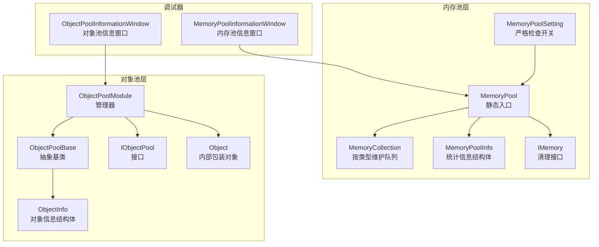
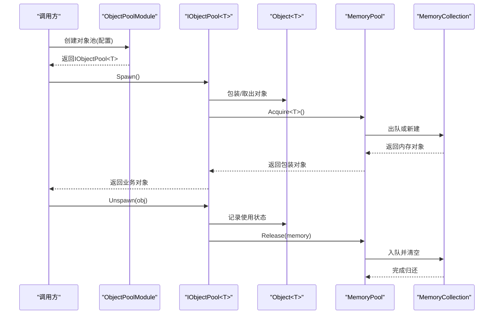
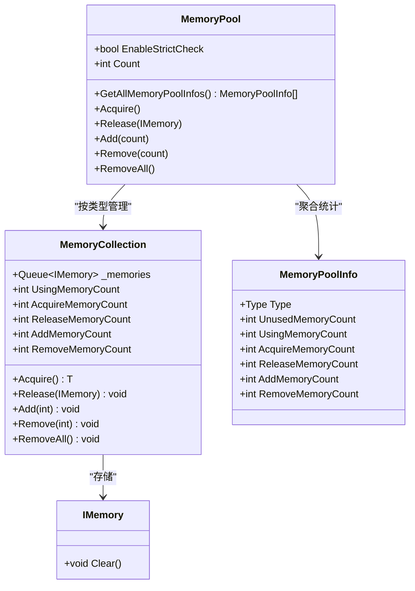
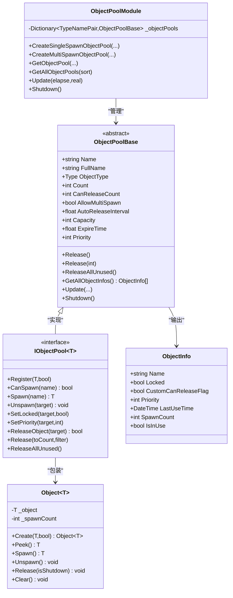
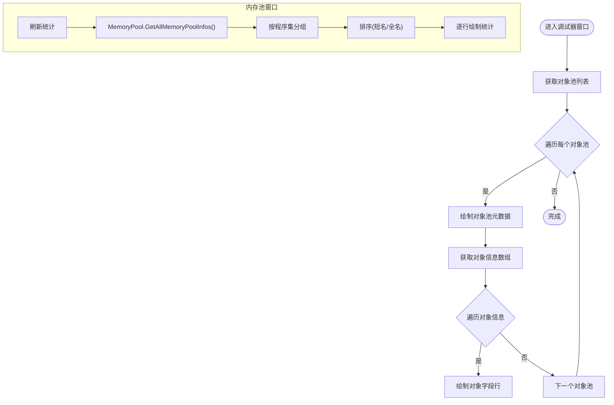
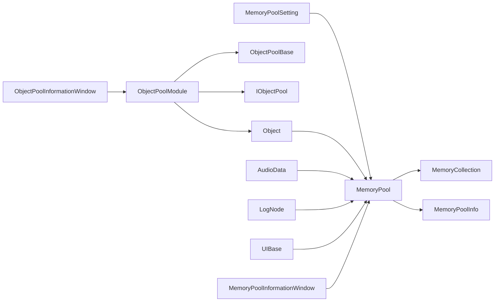

# 对象池性能优化

<cite>
**本文引用的文件**
- [MemoryPool.cs](file://Assets/TEngine/Runtime/Core/MemoryPool/MemoryPool.cs)
- [MemoryPool.MemoryCollection.cs](file://Assets/TEngine/Runtime/Core/MemoryPool/MemoryPool.MemoryCollection.cs)
- [MemoryPoolInfo.cs](file://Assets/TEngine/Runtime/Core/MemoryPool/MemoryPoolInfo.cs)
- [MemoryPoolSetting.cs](file://Assets/TEngine/Runtime/Core/MemoryPool/MemoryPoolSetting.cs)
- [IMemory.cs](file://Assets/TEngine/Runtime/Core/MemoryPool/IMemory.cs)
- [ObjectPoolModule.cs](file://Assets/TEngine/Runtime/Module/ObjectPoolModule/ObjectPoolModule.cs)
- [ObjectPoolBase.cs](file://Assets/TEngine/Runtime/Module/ObjectPoolModule/ObjectPoolBase.cs)
- [IObjectPool.cs](file://Assets/TEngine/Runtime/Module/ObjectPoolModule/IObjectPool.cs)
- [ObjectInfo.cs](file://Assets/TEngine/Runtime/Module/ObjectPoolModule/ObjectInfo.cs)
- [ObjectPoolModule.Object.cs](file://Assets/TEngine/Runtime/Module/ObjectPoolModule/ObjectPoolModule.Object.cs)
- [DebuggerModule.ObjectPoolInformationWindow.cs](file://Assets/TEngine/Runtime/Module/DebugerModule/Component/DebuggerModule.ObjectPoolInformationWindow.cs)
- [DebuggerModule.MemoryPoolInformationWindow.cs](file://Assets/TEngine/Runtime/Module/DebugerModule/Component/DebuggerModule.MemoryPoolInformationWindow.cs)
- [UIBase.cs](file://Assets/GameScripts/HotFix/GameLogic/Module/UIModule/UIBase.cs)
- [AudioData.cs](file://Assets/TEngine/Runtime/Module/AudioModule/AudioData.cs)
- [LogNode.cs](file://Assets/TEngine/Runtime/Module/DebugerModule/Component/DebuggerModule.LogNode.cs)
- [ModuleSystem.cs](file://Assets/TEngine/Runtime/Core/ModuleSystem.cs)
</cite>

## 目录
1. [简介](#简介)
2. [项目结构](#项目结构)
3. [核心组件](#核心组件)
4. [架构总览](#架构总览)
5. [详细组件分析](#详细组件分析)
6. [依赖关系分析](#依赖关系分析)
7. [性能考量](#性能考量)
8. [故障排查指南](#故障排查指南)
9. [结论](#结论)
10. [附录](#附录)

## 简介
本文件围绕TEngine对象池性能优化功能，系统性梳理对象池信息窗口的监控能力（对象创建销毁统计、池化命中率分析、对象生命周期跟踪、内存分配优化效果等），并深入解析对象池模块的实现原理（管理机制、复用策略、池大小动态调整、状态管理）。同时给出配置优化、预创建策略、压力测试与瓶颈识别的最佳实践，以及调试技巧与问题排查方法（泄漏检测、溢出处理、性能回归分析）。

## 项目结构
TEngine将对象池与内存池分层设计：内存池负责通用内存对象的池化与统计；对象池模块在此之上封装具体业务对象的生命周期管理与可视化监控。调试器模块提供对象池与内存池信息窗口，用于运行时观测与诊断。

**图表来源**
- [MemoryPool.cs:1-208](file://Assets/TEngine/Runtime/Core/MemoryPool/MemoryPool.cs#L1-L208)
- [MemoryPool.MemoryCollection.cs:1-157](file://Assets/TEngine/Runtime/Core/MemoryPool/MemoryPool.MemoryCollection.cs#L1-L157)
- [MemoryPoolInfo.cs:1-119](file://Assets/TEngine/Runtime/Core/MemoryPool/MemoryPoolInfo.cs#L1-L119)
- [MemoryPoolSetting.cs:1-80](file://Assets/TEngine/Runtime/Core/MemoryPool/MemoryPoolSetting.cs#L1-L80)
- [IMemory.cs:1-14](file://Assets/TEngine/Runtime/Core/MemoryPool/IMemory.cs#L1-L14)
- [ObjectPoolModule.cs:1-800](file://Assets/TEngine/Runtime/Module/ObjectPoolModule/ObjectPoolModule.cs#L1-L800)
- [ObjectPoolBase.cs:1-134](file://Assets/TEngine/Runtime/Module/ObjectPoolModule/ObjectPoolBase.cs#L1-L134)
- [IObjectPool.cs:1-212](file://Assets/TEngine/Runtime/Module/ObjectPoolModule/IObjectPool.cs#L1-L212)
- [ObjectInfo.cs:1-73](file://Assets/TEngine/Runtime/Module/ObjectPoolModule/ObjectInfo.cs#L1-L73)
- [ObjectPoolModule.Object.cs:1-190](file://Assets/TEngine/Runtime/Module/ObjectPoolModule/ObjectPoolModule.Object.cs#L1-L190)
- [DebuggerModule.ObjectPoolInformationWindow.cs:1-88](file://Assets/TEngine/Runtime/Module/DebugerModule/Component/DebuggerModule.ObjectPoolInformationWindow.cs#L1-L88)
- [DebuggerModule.MemoryPoolInformationWindow.cs:1-107](file://Assets/TEngine/Runtime/Module/DebugerModule/Component/DebuggerModule.MemoryPoolInformationWindow.cs#L1-L107)

**章节来源**
- [MemoryPool.cs:1-208](file://Assets/TEngine/Runtime/Core/MemoryPool/MemoryPool.cs#L1-L208)
- [ObjectPoolModule.cs:1-800](file://Assets/TEngine/Runtime/Module/ObjectPoolModule/ObjectPoolModule.cs#L1-L800)
- [DebuggerModule.ObjectPoolInformationWindow.cs:1-88](file://Assets/TEngine/Runtime/Module/DebugerModule/Component/DebuggerModule.ObjectPoolInformationWindow.cs#L1-L88)
- [DebuggerModule.MemoryPoolInformationWindow.cs:1-107](file://Assets/TEngine/Runtime/Module/DebugerModule/Component/DebuggerModule.MemoryPoolInformationWindow.cs#L1-L107)

## 核心组件
- 内存池（MemoryPool）
  - 提供统一的内存对象池化入口，支持按类型获取/归还、批量增删、统计查询、严格检查开关。
  - 维护每个类型的MemoryCollection，记录未使用、使用中、获取/归还、新增/移除计数。
- 对象池模块（ObjectPoolModule）
  - 管理多个对象池，支持单次/多次获取模式，容量、过期、优先级、自动释放等配置。
  - 提供对象生命周期跟踪（名称、锁定、优先级、最后使用时间、获取计数）。
- 调试器窗口
  - 对象池信息窗口：展示对象池数量、容量、可释放数、过期时间、优先级及每个对象的详细状态。
  - 内存池信息窗口：按程序集分类展示各类型内存池的未使用/使用/获取/归还/新增/移除统计。

**章节来源**
- [MemoryPool.cs:33-48](file://Assets/TEngine/Runtime/Core/MemoryPool/MemoryPool.cs#L33-L48)
- [MemoryPool.MemoryCollection.cs:46-98](file://Assets/TEngine/Runtime/Core/MemoryPool/MemoryPool.MemoryCollection.cs#L46-L98)
- [ObjectPoolBase.cs:42-105](file://Assets/TEngine/Runtime/Module/ObjectPoolModule/ObjectPoolBase.cs#L42-L105)
- [ObjectInfo.cs:28-72](file://Assets/TEngine/Runtime/Module/ObjectPoolModule/ObjectInfo.cs#L28-L72)
- [DebuggerModule.ObjectPoolInformationWindow.cs:22-84](file://Assets/TEngine/Runtime/Module/DebugerModule/Component/DebuggerModule.ObjectPoolInformationWindow.cs#L22-L84)
- [DebuggerModule.MemoryPoolInformationWindow.cs:20-93](file://Assets/TEngine/Runtime/Module/DebugerModule/Component/DebuggerModule.MemoryPoolInformationWindow.cs#L20-L93)

## 架构总览
对象池系统通过“内存池 + 对象池模块 + 调试器”的分层设计实现高性能与可观测性：

**图表来源**
- [ObjectPoolModule.cs:371-733](file://Assets/TEngine/Runtime/Module/ObjectPoolModule/ObjectPoolModule.cs#L371-L733)
- [IObjectPool.cs:118-138](file://Assets/TEngine/Runtime/Module/ObjectPoolModule/IObjectPool.cs#L118-L138)
- [ObjectPoolModule.Object.cs:116-186](file://Assets/TEngine/Runtime/Module/ObjectPoolModule/ObjectPoolModule.Object.cs#L116-L186)
- [MemoryPool.cs:71-101](file://Assets/TEngine/Runtime/Core/MemoryPool/MemoryPool.cs#L71-L101)
- [MemoryPool.MemoryCollection.cs:46-98](file://Assets/TEngine/Runtime/Core/MemoryPool/MemoryPool.MemoryCollection.cs#L46-L98)

## 详细组件分析

### 内存池（MemoryPool）与统计
- 统计维度
  - 未使用计数、使用中计数、获取次数、归还次数、新增次数、移除次数。
  - 通过MemoryPoolInfo结构体对外暴露，便于调试器窗口展示。
- 严格检查
  - 可在开发/编辑器/总是/禁用之间切换，开启后对类型合法性与重复归还进行校验，显著影响性能，仅用于诊断。
- 动态扩缩容
  - 支持按类型批量Add/Remove/RemoveAll，用于预热或收缩池容量。

**图表来源**
- [MemoryPool.cs:9-208](file://Assets/TEngine/Runtime/Core/MemoryPool/MemoryPool.cs#L9-L208)
- [MemoryPool.MemoryCollection.cs:11-157](file://Assets/TEngine/Runtime/Core/MemoryPool/MemoryPool.MemoryCollection.cs#L11-L157)
- [MemoryPoolInfo.cs:10-119](file://Assets/TEngine/Runtime/Core/MemoryPool/MemoryPoolInfo.cs#L10-L119)
- [IMemory.cs:6-14](file://Assets/TEngine/Runtime/Core/MemoryPool/IMemory.cs#L6-L14)

**章节来源**
- [MemoryPool.cs:33-48](file://Assets/TEngine/Runtime/Core/MemoryPool/MemoryPool.cs#L33-L48)
- [MemoryPool.MemoryCollection.cs:46-98](file://Assets/TEngine/Runtime/Core/MemoryPool/MemoryPool.MemoryCollection.cs#L46-L98)
- [MemoryPoolInfo.cs:30-116](file://Assets/TEngine/Runtime/Core/MemoryPool/MemoryPoolInfo.cs#L30-L116)
- [MemoryPoolSetting.cs:34-78](file://Assets/TEngine/Runtime/Core/MemoryPool/MemoryPoolSetting.cs#L34-L78)

### 对象池模块（ObjectPoolModule）与对象包装
- 对象池管理
  - 支持单次/多次获取模式，配置容量、过期时间、优先级、自动释放间隔。
  - 提供按条件查询、排序、全量获取等管理接口。
- 对象包装（Object<T>）
  - 封装业务对象，维护名称、锁定、优先级、自定义释放标志、最后使用时间、获取计数。
  - Spawn/Unspawn时触发业务对象的OnSpawn/OnUnspawn与LastUseTime更新。
  - 归还时通过MemoryPool.Release回收内部包装对象，再由业务对象自身通过IMemory.Clear回收到内存池。
- 生命周期跟踪
  - ObjectInfo结构体汇总对象状态，供调试器窗口展示。

**图表来源**
- [ObjectPoolModule.cs:46-733](file://Assets/TEngine/Runtime/Module/ObjectPoolModule/ObjectPoolModule.cs#L46-L733)
- [ObjectPoolBase.cs:8-134](file://Assets/TEngine/Runtime/Module/ObjectPoolModule/ObjectPoolBase.cs#L8-L134)
- [IObjectPool.cs:9-212](file://Assets/TEngine/Runtime/Module/ObjectPoolModule/IObjectPool.cs#L9-L212)
- [ObjectPoolModule.Object.cs:11-190](file://Assets/TEngine/Runtime/Module/ObjectPoolModule/ObjectPoolModule.Object.cs#L11-L190)
- [ObjectInfo.cs:10-73](file://Assets/TEngine/Runtime/Module/ObjectPoolModule/ObjectInfo.cs#L10-L73)

**章节来源**
- [ObjectPoolModule.cs:371-733](file://Assets/TEngine/Runtime/Module/ObjectPoolModule/ObjectPoolModule.cs#L371-L733)
- [ObjectPoolBase.cs:42-127](file://Assets/TEngine/Runtime/Module/ObjectPoolModule/ObjectPoolBase.cs#L42-L127)
- [IObjectPool.cs:118-210](file://Assets/TEngine/Runtime/Module/ObjectPoolModule/IObjectPool.cs#L118-L210)
- [ObjectPoolModule.Object.cs:116-186](file://Assets/TEngine/Runtime/Module/ObjectPoolModule/ObjectPoolModule.Object.cs#L116-L186)
- [ObjectInfo.cs:28-72](file://Assets/TEngine/Runtime/Module/ObjectPoolModule/ObjectInfo.cs#L28-L72)

### 调试器窗口与监控
- 对象池信息窗口
  - 展示对象池数量、容量、可释放数、过期时间、优先级。
  - 列出每个对象的名称、锁定、计数/在用、自定义释放标志、优先级、最后使用时间。
- 内存池信息窗口
  - 展示严格检查开关、内存池数量。
  - 按程序集分组，显示类型名、未使用、使用中、获取、归还、新增、移除统计。
  - 支持切换显示完整类名。

**图表来源**
- [DebuggerModule.ObjectPoolInformationWindow.cs:22-84](file://Assets/TEngine/Runtime/Module/DebugerModule/Component/DebuggerModule.ObjectPoolInformationWindow.cs#L22-L84)
- [DebuggerModule.MemoryPoolInformationWindow.cs:20-93](file://Assets/TEngine/Runtime/Module/DebugerModule/Component/DebuggerModule.MemoryPoolInformationWindow.cs#L20-L93)
- [MemoryPool.cs:33-48](file://Assets/TEngine/Runtime/Core/MemoryPool/MemoryPool.cs#L33-L48)

**章节来源**
- [DebuggerModule.ObjectPoolInformationWindow.cs:22-84](file://Assets/TEngine/Runtime/Module/DebugerModule/Component/DebuggerModule.ObjectPoolInformationWindow.cs#L22-L84)
- [DebuggerModule.MemoryPoolInformationWindow.cs:20-93](file://Assets/TEngine/Runtime/Module/DebugerModule/Component/DebuggerModule.MemoryPoolInformationWindow.cs#L20-L93)

## 依赖关系分析
- 内存池依赖
  - MemoryPool依赖MemoryCollection按类型维护队列与计数。
  - MemoryPoolSetting控制EnableStrictCheck，影响内存池的类型校验与重复归还检查。
- 对象池依赖
  - ObjectPoolModule依赖Object<T>作为包装器，委托MemoryPool进行内存对象回收。
  - IObjectPool<T>面向上层业务，屏蔽底层包装细节。
- 使用点
  - 多个模块（如音频、日志节点、UI）通过MemoryPool.Acquire/Release进行对象池化，降低GC压力。

**图表来源**
- [MemoryPoolSetting.cs:34-78](file://Assets/TEngine/Runtime/Core/MemoryPool/MemoryPoolSetting.cs#L34-L78)
- [MemoryPool.cs:9-208](file://Assets/TEngine/Runtime/Core/MemoryPool/MemoryPool.cs#L9-L208)
- [ObjectPoolModule.cs:46-733](file://Assets/TEngine/Runtime/Module/ObjectPoolModule/ObjectPoolModule.cs#L46-L733)
- [ObjectPoolModule.Object.cs:116-186](file://Assets/TEngine/Runtime/Module/ObjectPoolModule/ObjectPoolModule.Object.cs#L116-L186)
- [AudioData.cs:45-60](file://Assets/TEngine/Runtime/Module/AudioModule/AudioData.cs#L45-L60)
- [LogNode.cs:94](file://Assets/TEngine/Runtime/Module/DebugerModule/Component/DebuggerModule.LogNode.cs#L94)
- [UIBase.cs:291](file://Assets/GameScripts/HotFix/GameLogic/Module/UIModule/UIBase.cs#L291)
- [UIBase.cs:327](file://Assets/GameScripts/HotFix/GameLogic/Module/UIModule/UIBase.cs#L327)
- [DebuggerModule.ObjectPoolInformationWindow.cs:14](file://Assets/TEngine/Runtime/Module/DebugerModule/Component/DebuggerModule.ObjectPoolInformationWindow.cs#L14)
- [DebuggerModule.MemoryPoolInformationWindow.cs:32](file://Assets/TEngine/Runtime/Module/DebugerModule/Component/DebuggerModule.MemoryPoolInformationWindow.cs#L32)

**章节来源**
- [ModuleSystem.cs:57](file://Assets/TEngine/Runtime/Core/ModuleSystem.cs#L57)
- [MemoryPoolSetting.cs:56-78](file://Assets/TEngine/Runtime/Core/MemoryPool/MemoryPoolSetting.cs#L56-L78)
- [MemoryPool.cs:53-64](file://Assets/TEngine/Runtime/Core/MemoryPool/MemoryPool.cs#L53-L64)

## 性能考量
- 池化命中率分析
  - 通过内存池统计中的“获取次数”与“新增次数”比值评估命中率。命中率高意味着复用充分，GC压力小。
  - 对象池窗口的“可释放数/容量”可辅助判断是否需要扩容或收缩。
- 内存分配优化效果
  - 严格检查（EnableStrictCheck）会显著增加开销，仅在定位问题时启用。
  - 预创建（Add<T>(count)）可降低首次分配抖动，适合热点对象。
- 自动释放与过期
  - 合理设置AutoReleaseInterval与ExpireTime，避免长期持有导致内存占用过高。
- 复用策略
  - 单次获取对象池适合一次性对象，减少状态管理复杂度。
  - 多次获取对象池适合频繁复用对象，需关注锁定与优先级策略。

[本节为通用性能指导，不直接分析特定文件]

## 故障排查指南
- 泄漏检测
  - 若对象池“使用中计数”持续增长且无对应归还，结合对象池窗口查看对象的“最后使用时间/计数/锁定”定位未释放点。
  - 内存池窗口观察“归还次数”与“获取次数”是否平衡。
- 池溢出处理
  - 当对象池容量不足时，应通过“Add<T>(count)”预热或提升Capacity；同时检查对象是否频繁Spawn但未Unspawn。
- 性能回归分析
  - 开启严格检查后性能下降明显，确认是否误用或误判；必要时切换为开发模式或禁用。
  - 使用内存池窗口对比不同版本的“新增/移除”统计，识别异常波动。

**章节来源**
- [MemoryPool.MemoryCollection.cs:83-98](file://Assets/TEngine/Runtime/Core/MemoryPool/MemoryPool.MemoryCollection.cs#L83-L98)
- [ObjectPoolModule.Object.cs:167-176](file://Assets/TEngine/Runtime/Module/ObjectPoolModule/ObjectPoolModule.Object.cs#L167-L176)
- [DebuggerModule.ObjectPoolInformationWindow.cs:37-84](file://Assets/TEngine/Runtime/Module/DebugerModule/Component/DebuggerModule.ObjectPoolInformationWindow.cs#L37-L84)
- [DebuggerModule.MemoryPoolInformationWindow.cs:20-93](file://Assets/TEngine/Runtime/Module/DebugerModule/Component/DebuggerModule.MemoryPoolInformationWindow.cs#L20-L93)

## 结论
TEngine对象池通过“内存池+对象池模块+调试器”的组合，在保证高性能的同时提供了完善的可观测性。通过对象池信息窗口与内存池信息窗口，可以有效监控创建销毁统计、池化命中率、生命周期状态与内存分配优化效果。配合合理的配置（容量、过期、优先级、自动释放）、预创建策略与严格检查开关，可在不同阶段平衡性能与稳定性。

[本节为总结性内容，不直接分析特定文件]

## 附录

### 配置参数与使用示例（路径指引）
- 内存池严格检查
  - 参数：MemoryPoolSetting.EnableStrictCheck（枚举：Always/Development/Editor/Disable）
  - 路径：[MemoryPoolSetting.cs:34-78](file://Assets/TEngine/Runtime/Core/MemoryPool/MemoryPoolSetting.cs#L34-L78)
- 对象池创建（示例：单次/多次获取、容量、过期、优先级、自动释放）
  - 路径：[ObjectPoolModule.cs:371-733](file://Assets/TEngine/Runtime/Module/ObjectPoolModule/ObjectPoolModule.cs#L371-L733)
- 对象池管理与查询
  - 路径：[ObjectPoolModule.cs:297-364](file://Assets/TEngine/Runtime/Module/ObjectPoolModule/ObjectPoolModule.cs#L297-L364)
- 对象生命周期接口
  - 路径：[IObjectPool.cs:98-210](file://Assets/TEngine/Runtime/Module/ObjectPoolModule/IObjectPool.cs#L98-L210)
- 对象包装与回收
  - 路径：[ObjectPoolModule.Object.cs:116-186](file://Assets/TEngine/Runtime/Module/ObjectPoolModule/ObjectPoolModule.Object.cs#L116-L186)
- 内存池统计与清空
  - 路径：[MemoryPool.cs:33-64](file://Assets/TEngine/Runtime/Core/MemoryPool/MemoryPool.cs#L33-L64)
- 调试器窗口
  - 对象池信息窗口：[DebuggerModule.ObjectPoolInformationWindow.cs:22-84](file://Assets/TEngine/Runtime/Module/DebugerModule/Component/DebuggerModule.ObjectPoolInformationWindow.cs#L22-L84)
  - 内存池信息窗口：[DebuggerModule.MemoryPoolInformationWindow.cs:20-93](file://Assets/TEngine/Runtime/Module/DebugerModule/Component/DebuggerModule.MemoryPoolInformationWindow.cs#L20-L93)