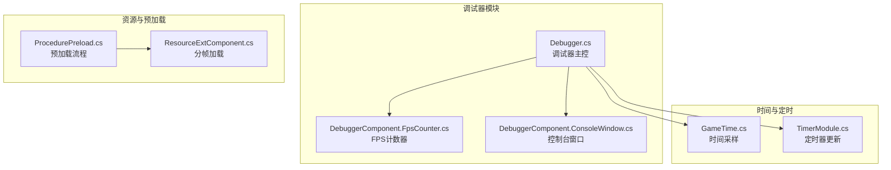
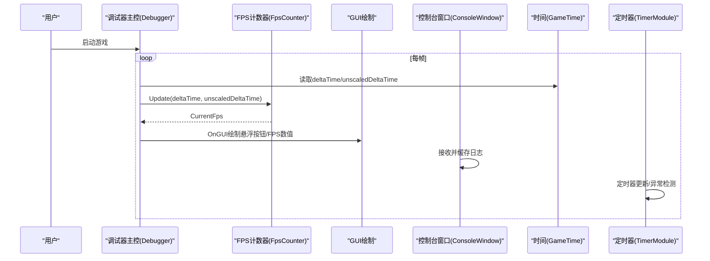
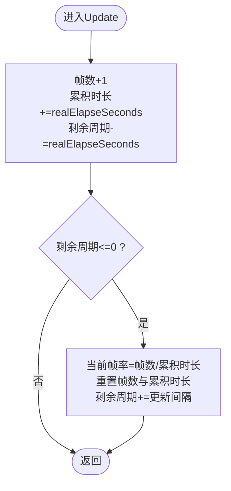
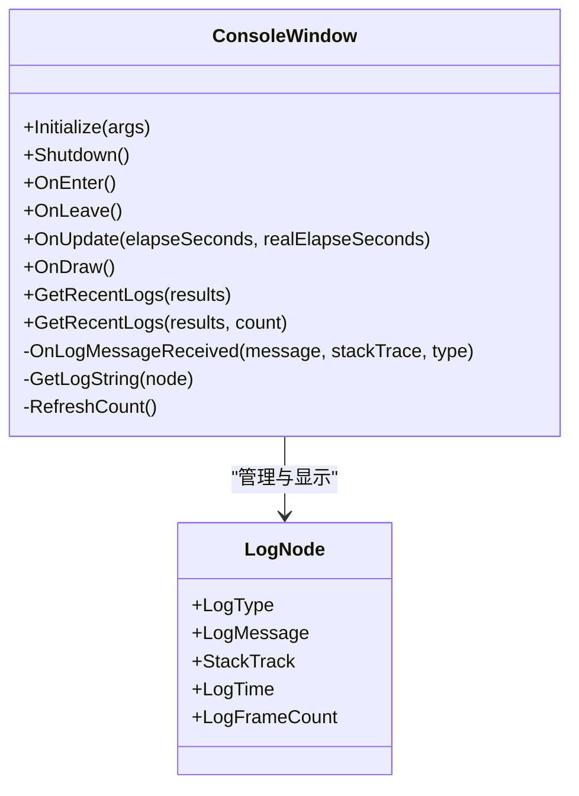
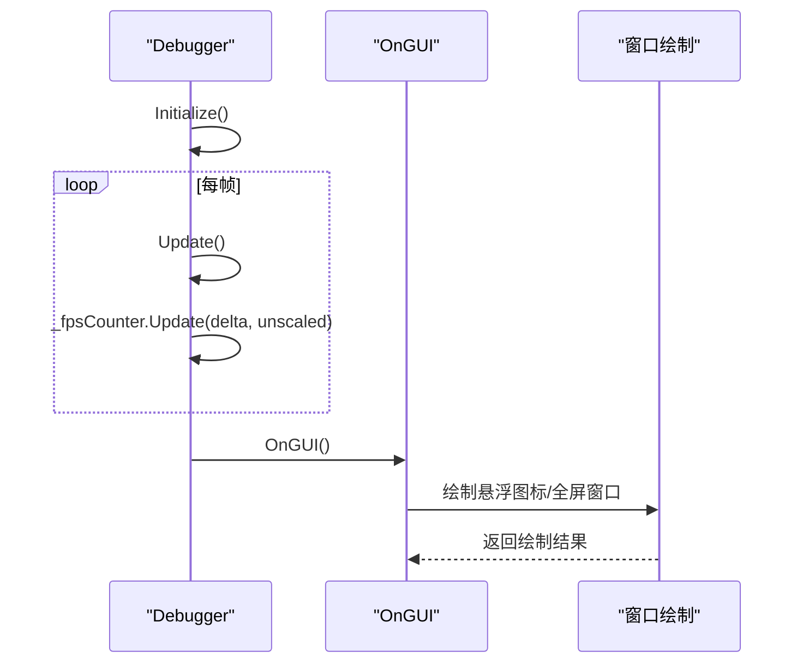
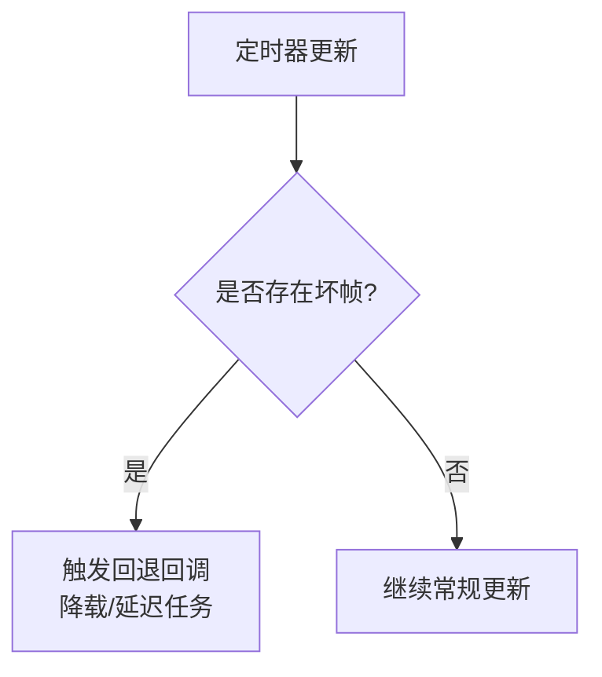
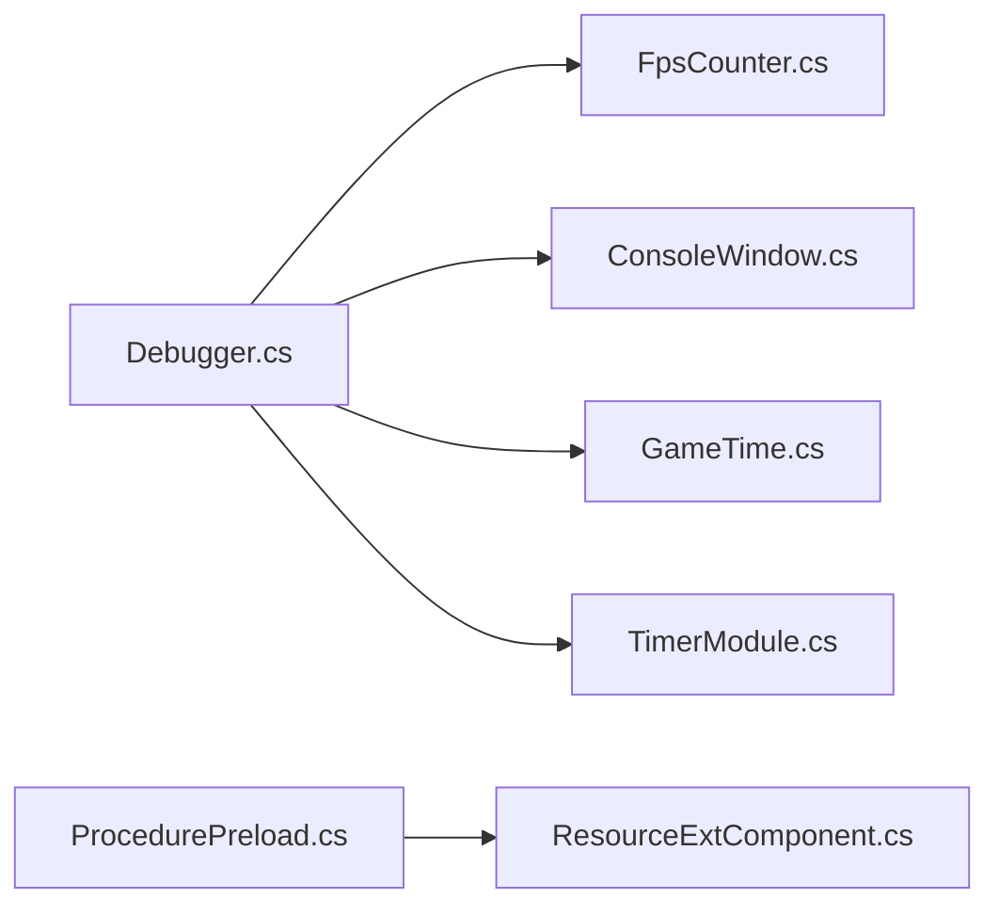

# 帧率性能监控

<cite>
**本文引用的文件**
- [Debugger.cs](file://Assets/TEngine/Runtime/Module/DebugerModule/Debugger.cs)
- [DebuggerComponent.FpsCounter.cs](file://Assets/TEngine/Runtime/Module/DebugerModule/DebuggerComponent.FpsCounter.cs)
- [DebuggerComponent.ConsoleWindow.cs](file://Assets/TEngine/Runtime/Module/DebugerModule/DebuggerComponent.ConsoleWindow.cs)
- [GameTime.cs](file://Assets/TEngine/Runtime/Core/GameTime/GameTime.cs)
- [TimerModule.cs](file://Assets/TEngine/Runtime/Module/TimerModule/TimerModule.cs)
- [ProcedurePreload.cs](file://Assets/GameScripts/Procedure/ProcedurePreload.cs)
- [ResourceExtComponent.cs](file://Assets/TEngine/Runtime/Module/ResourceModule/Extension/ResourceExtComponent.cs)
- [QualitySettings.asset](file://ProjectSettings/QualitySettings.asset)
</cite>

## 目录
1. [简介](#简介)
2. [项目结构](#项目结构)
3. [核心组件](#核心组件)
4. [架构总览](#架构总览)
5. [详细组件分析](#详细组件分析)
6. [依赖关系分析](#依赖关系分析)
7. [性能考量](#性能考量)
8. [故障排查指南](#故障排查指南)
9. [结论](#结论)
10. [附录](#附录)

## 简介
本技术文档聚焦于TEngine中的帧率性能监控能力，系统性解析FPS计数器的实现原理与运行机制，涵盖帧率计算算法、时间采样策略、滑动窗口平均思路、阈值与异常检测的扩展点、控制台窗口的实时输出与日志记录、以及面向实际工程的优化建议与配置参数。文档旨在帮助开发者快速理解并高效使用该监控体系，同时提供可落地的性能优化实践。

## 项目结构
TEngine的帧率监控主要由调试器模块承载，核心文件分布如下：
- 调试器主控：负责窗口生命周期、FPS计数器集成、GUI绘制与窗口管理
- FPS计数器：轻量级滑动窗口平均实现，按固定周期刷新当前帧率
- 控制台窗口：统一日志采集、过滤、滚动与颜色标记，支持复制堆栈
- 时间与定时器：提供帧时间采样与定时回调，支撑性能检测与异常定位
- 预加载与资源：通过资源分帧加载与预热策略降低首帧卡顿，间接提升帧率稳定性

**图表来源**
- [Debugger.cs:1-429](file://Assets/TEngine/Runtime/Module/DebugerModule/Debugger.cs#L1-L429)
- [DebuggerComponent.FpsCounter.cs:1-68](file://Assets/TEngine/Runtime/Module/DebugerModule/DebuggerComponent.FpsCounter.cs#L1-L68)
- [DebuggerComponent.ConsoleWindow.cs:1-409](file://Assets/TEngine/Runtime/Module/DebugerModule/DebuggerComponent.ConsoleWindow.cs#L1-L409)
- [GameTime.cs:1-55](file://Assets/TEngine/Runtime/Core/GameTime/GameTime.cs#L1-L55)
- [TimerModule.cs:363-478](file://Assets/TEngine/Runtime/Module/TimerModule/TimerModule.cs#L363-L478)
- [ProcedurePreload.cs:121-162](file://Assets/GameScripts/Procedure/ProcedurePreload.cs#L121-L162)
- [ResourceExtComponent.cs:44-160](file://Assets/TEngine/Runtime/Module/ResourceModule/Extension/ResourceExtComponent.cs#L44-L160)

**章节来源**
- [Debugger.cs:1-429](file://Assets/TEngine/Runtime/Module/DebugerModule/Debugger.cs#L1-L429)
- [DebuggerComponent.FpsCounter.cs:1-68](file://Assets/TEngine/Runtime/Module/DebugerModule/DebuggerComponent.FpsCounter.cs#L1-L68)
- [DebuggerComponent.ConsoleWindow.cs:1-409](file://Assets/TEngine/Runtime/Module/DebugerModule/DebuggerComponent.ConsoleWindow.cs#L1-L409)
- [GameTime.cs:1-55](file://Assets/TEngine/Runtime/Core/GameTime/GameTime.cs#L1-L55)
- [TimerModule.cs:363-478](file://Assets/TEngine/Runtime/Module/TimerModule/TimerModule.cs#L363-L478)
- [ProcedurePreload.cs:121-162](file://Assets/GameScripts/Procedure/ProcedurePreload.cs#L121-L162)
- [ResourceExtComponent.cs:44-160](file://Assets/TEngine/Runtime/Module/ResourceModule/Extension/ResourceExtComponent.cs#L44-L160)

## 核心组件
- FPS计数器：基于固定周期累加帧时长与帧数，周期结束时计算平均帧率，具备可配置更新间隔与重置逻辑
- 调试器主控：在Update中驱动FPS计数器，OnGUI中绘制悬浮图标与全屏窗口，集成多类信息窗口
- 控制台窗口：统一接收Unity日志，维护队列与过滤开关，支持锁定滚动、复制堆栈、颜色区分
- 时间与定时器：提供Time.deltaTime与Time.unscaledDeltaTime采样，定时器模块在“坏帧”场景触发回退回调
- 预加载与资源：通过分帧处理与预加载策略降低首帧卡顿，提升帧率稳定性

**章节来源**
- [Debugger.cs:169-170](file://Assets/TEngine/Runtime/Module/DebugerModule/Debugger.cs#L169-L170)
- [Debugger.cs:237-240](file://Assets/TEngine/Runtime/Module/DebugerModule/Debugger.cs#L237-L240)
- [DebuggerComponent.FpsCounter.cs:13-23](file://Assets/TEngine/Runtime/Module/DebugerModule/DebuggerComponent.FpsCounter.cs#L13-L23)
- [DebuggerComponent.ConsoleWindow.cs:125-139](file://Assets/TEngine/Runtime/Module/DebugerModule/DebuggerComponent.ConsoleWindow.cs#L125-L139)

## 架构总览
下图展示了帧率监控在TEngine中的整体交互：调试器主控在每帧更新FPS计数器，同时在GUI阶段根据当前帧率动态绘制悬浮按钮；控制台窗口持续收集日志并提供过滤与复制能力；时间与定时器模块提供帧时间采样与异常检测的扩展点；资源模块通过分帧加载与预热策略保障帧率稳定。

**图表来源**
- [Debugger.cs:237-240](file://Assets/TEngine/Runtime/Module/DebugerModule/Debugger.cs#L237-L240)
- [Debugger.cs:414-419](file://Assets/TEngine/Runtime/Module/DebugerModule/Debugger.cs#L414-L419)
- [DebuggerComponent.FpsCounter.cs:43-56](file://Assets/TEngine/Runtime/Module/DebugerModule/DebuggerComponent.FpsCounter.cs#L43-L56)
- [DebuggerComponent.ConsoleWindow.cs:362-374](file://Assets/TEngine/Runtime/Module/DebugerModule/DebuggerComponent.ConsoleWindow.cs#L362-L374)
- [GameTime.cs:45-53](file://Assets/TEngine/Runtime/Core/GameTime/GameTime.cs#L45-L53)
- [TimerModule.cs:363-386](file://Assets/TEngine/Runtime/Module/TimerModule/TimerModule.cs#L363-L386)

## 详细组件分析

### FPS计数器实现原理
- 固定周期累加：每帧递增帧数与累积时长，剩余周期时间递减
- 周期结束计算：当剩余周期<=0时，计算当前帧率=帧数/累积时长，并重置计数器与剩余周期
- 参数校验：构造函数与属性setter对更新间隔进行有效性检查
- 时间采样：Update接收两个时间参数，分别对应缩放与非缩放时间，便于不同场景下的帧率统计

**图表来源**
- [DebuggerComponent.FpsCounter.cs:43-56](file://Assets/TEngine/Runtime/Module/DebugerModule/DebuggerComponent.FpsCounter.cs#L43-L56)

**章节来源**
- [DebuggerComponent.FpsCounter.cs:13-23](file://Assets/TEngine/Runtime/Module/DebugerModule/DebuggerComponent.FpsCounter.cs#L13-L23)
- [DebuggerComponent.FpsCounter.cs:25-39](file://Assets/TEngine/Runtime/Module/DebugerModule/DebuggerComponent.FpsCounter.cs#L25-L39)
- [DebuggerComponent.FpsCounter.cs:43-56](file://Assets/TEngine/Runtime/Module/DebugerModule/DebuggerComponent.FpsCounter.cs#L43-L56)
- [Debugger.cs:237-240](file://Assets/TEngine/Runtime/Module/DebugerModule/Debugger.cs#L237-L240)

### 控制台窗口的实时输出机制
- 日志采集：订阅Unity Application.logMessageReceived，将日志节点入队并限制最大行数
- 过滤与滚动：支持Info/Warning/Error/Fatal四类过滤开关，支持锁定滚动至最新
- 显示与复制：按类型着色显示，支持选择日志并复制消息与堆栈
- 统计计数：实时统计各类日志数量，用于悬浮图标颜色指示

**图表来源**
- [DebuggerComponent.ConsoleWindow.cs:10-409](file://Assets/TEngine/Runtime/Module/DebugerModule/DebuggerComponent.ConsoleWindow.cs#L10-L409)

**章节来源**
- [DebuggerComponent.ConsoleWindow.cs:125-139](file://Assets/TEngine/Runtime/Module/DebugerModule/DebuggerComponent.ConsoleWindow.cs#L125-L139)
- [DebuggerComponent.ConsoleWindow.cs:182-278](file://Assets/TEngine/Runtime/Module/DebugerModule/DebuggerComponent.ConsoleWindow.cs#L182-L278)
- [DebuggerComponent.ConsoleWindow.cs:314-360](file://Assets/TEngine/Runtime/Module/DebugerModule/DebuggerComponent.ConsoleWindow.cs#L314-L360)
- [DebuggerComponent.ConsoleWindow.cs:362-374](file://Assets/TEngine/Runtime/Module/DebugerModule/DebuggerComponent.ConsoleWindow.cs#L362-L374)
- [Debugger.cs:396-412](file://Assets/TEngine/Runtime/Module/DebugerModule/Debugger.cs#L396-L412)

### 调试器主控与GUI绘制
- 初始化：创建FPS计数器、注册各类信息窗口、根据构建类型决定是否激活
- 每帧更新：驱动FPS计数器，使用Time.deltaTime与Time.unscaledDeltaTime
- GUI绘制：根据缩放矩阵绘制悬浮图标或全屏窗口；悬浮图标显示当前帧率与日志统计颜色
- 布局持久化：位置与缩放比例通过PlayerPrefs保存

**图表来源**
- [Debugger.cs:161-181](file://Assets/TEngine/Runtime/Module/DebugerModule/Debugger.cs#L161-L181)
- [Debugger.cs:237-240](file://Assets/TEngine/Runtime/Module/DebugerModule/Debugger.cs#L237-L240)
- [Debugger.cs:242-266](file://Assets/TEngine/Runtime/Module/DebugerModule/Debugger.cs#L242-L266)
- [Debugger.cs:391-419](file://Assets/TEngine/Runtime/Module/DebugerModule/Debugger.cs#L391-L419)

**章节来源**
- [Debugger.cs:161-181](file://Assets/TEngine/Runtime/Module/DebugerModule/Debugger.cs#L161-L181)
- [Debugger.cs:237-240](file://Assets/TEngine/Runtime/Module/DebugerModule/Debugger.cs#L237-L240)
- [Debugger.cs:242-266](file://Assets/TEngine/Runtime/Module/DebugerModule/Debugger.cs#L242-L266)
- [Debugger.cs:391-419](file://Assets/TEngine/Runtime/Module/DebugerModule/Debugger.cs#L391-L419)

### 时间采样与异常检测扩展点
- 时间采样：GameTime提供time/deltaTime/unscaledDeltaTime/fixedDeltaTime/frameCount/unscaledTime等字段
- 异常检测：TimerModule在“坏帧”场景触发回退回调，可用于帧率异常时的降载策略
- 建议：结合FPS计数器与定时器异常回调，实现低帧率预警与自动降载

**图表来源**
- [TimerModule.cs:363-386](file://Assets/TEngine/Runtime/Module/TimerModule/TimerModule.cs#L363-L386)

**章节来源**
- [GameTime.cs:45-53](file://Assets/TEngine/Runtime/Core/GameTime/GameTime.cs#L45-L53)
- [TimerModule.cs:363-386](file://Assets/TEngine/Runtime/Module/TimerModule/TimerModule.cs#L363-L386)

## 依赖关系分析
- 调试器主控依赖FPS计数器进行帧率统计，依赖控制台窗口进行日志展示，依赖时间模块进行时间采样
- FPS计数器依赖Unity时间参数进行累加与计算
- 资源模块通过分帧加载与预加载策略减少主线程压力，间接提升帧率稳定性
- 定时器模块提供异常检测扩展点，可与帧率监控联动

**图表来源**
- [Debugger.cs:1-429](file://Assets/TEngine/Runtime/Module/DebugerModule/Debugger.cs#L1-L429)
- [DebuggerComponent.FpsCounter.cs:1-68](file://Assets/TEngine/Runtime/Module/DebugerModule/DebuggerComponent.FpsCounter.cs#L1-L68)
- [DebuggerComponent.ConsoleWindow.cs:1-409](file://Assets/TEngine/Runtime/Module/DebugerModule/DebuggerComponent.ConsoleWindow.cs#L1-L409)
- [GameTime.cs:1-55](file://Assets/TEngine/Runtime/Core/GameTime/GameTime.cs#L1-L55)
- [TimerModule.cs:363-478](file://Assets/TEngine/Runtime/Module/TimerModule/TimerModule.cs#L363-L478)
- [ProcedurePreload.cs:121-162](file://Assets/GameScripts/Procedure/ProcedurePreload.cs#L121-L162)
- [ResourceExtComponent.cs:44-160](file://Assets/TEngine/Runtime/Module/ResourceModule/Extension/ResourceExtComponent.cs#L44-L160)

**章节来源**
- [Debugger.cs:1-429](file://Assets/TEngine/Runtime/Module/DebugerModule/Debugger.cs#L1-L429)
- [ProcedurePreload.cs:121-162](file://Assets/GameScripts/Procedure/ProcedurePreload.cs#L121-L162)
- [ResourceExtComponent.cs:44-160](file://Assets/TEngine/Runtime/Module/ResourceModule/Extension/ResourceExtComponent.cs#L44-L160)

## 性能考量
- 帧率计算复杂度：O(1)每帧，内存占用极小，适合高频采样
- 时间采样建议：优先使用Time.unscaledDeltaTime进行帧率统计，避免timeScale影响
- 日志开销：控制台窗口采用队列与最大行数限制，避免无限增长导致内存压力
- 预加载与分帧：通过ProcedurePreload与ResourceExtComponent的分帧处理，降低首帧峰值负载
- 定时器异常：利用TimerModule的“坏帧”回调进行降载，保障用户体验

[本节为通用性能指导，不直接分析具体文件]

## 故障排查指南
- FPS显示异常
  - 检查FPS计数器更新间隔是否有效（>0）
  - 确认Update中传入的时间参数是否正确（delta vs unscaled）
  - 参考：[Debugger.cs:237-240](file://Assets/TEngine/Runtime/Module/DebugerModule/Debugger.cs#L237-L240)，[DebuggerComponent.FpsCounter.cs:13-23](file://Assets/TEngine/Runtime/Module/DebugerModule/DebuggerComponent.FpsCounter.cs#L13-L23)
- 悬浮图标不显示或颜色异常
  - 检查控制台窗口日志统计与颜色映射
  - 参考：[Debugger.cs:396-412](file://Assets/TEngine/Runtime/Module/DebugerModule/Debugger.cs#L396-L412)，[DebuggerComponent.ConsoleWindow.cs:382-405](file://Assets/TEngine/Runtime/Module/DebugerModule/DebuggerComponent.ConsoleWindow.cs#L382-L405)
- 日志过多导致卡顿
  - 调整控制台最大行数与过滤开关
  - 参考：[DebuggerComponent.ConsoleWindow.cs:125-139](file://Assets/TEngine/Runtime/Module/DebugerModule/DebuggerComponent.ConsoleWindow.cs#L125-L139)，[DebuggerComponent.ConsoleWindow.cs:362-374](file://Assets/TEngine/Runtime/Module/DebugerModule/DebuggerComponent.ConsoleWindow.cs#L362-L374)
- 帧率波动大
  - 结合定时器异常回调进行降载
  - 参考：[TimerModule.cs:363-386](file://Assets/TEngine/Runtime/Module/TimerModule/TimerModule.cs#L363-L386)
- 首帧卡顿
  - 使用ProcedurePreload与ResourceExtComponent的分帧加载策略
  - 参考：[ProcedurePreload.cs:121-162](file://Assets/GameScripts/Procedure/ProcedurePreload.cs#L121-L162)，[ResourceExtComponent.cs:124-151](file://Assets/TEngine/Runtime/Module/ResourceModule/Extension/ResourceExtComponent.cs#L124-L151)

**章节来源**
- [Debugger.cs:237-240](file://Assets/TEngine/Runtime/Module/DebugerModule/Debugger.cs#L237-L240)
- [DebuggerComponent.FpsCounter.cs:13-23](file://Assets/TEngine/Runtime/Module/DebugerModule/DebuggerComponent.FpsCounter.cs#L13-L23)
- [Debugger.cs:396-412](file://Assets/TEngine/Runtime/Module/DebugerModule/Debugger.cs#L396-L412)
- [DebuggerComponent.ConsoleWindow.cs:125-139](file://Assets/TEngine/Runtime/Module/DebugerModule/DebuggerComponent.ConsoleWindow.cs#L125-L139)
- [DebuggerComponent.ConsoleWindow.cs:362-374](file://Assets/TEngine/Runtime/Module/DebugerModule/DebuggerComponent.ConsoleWindow.cs#L362-L374)
- [TimerModule.cs:363-386](file://Assets/TEngine/Runtime/Module/TimerModule/TimerModule.cs#L363-L386)
- [ProcedurePreload.cs:121-162](file://Assets/GameScripts/Procedure/ProcedurePreload.cs#L121-L162)
- [ResourceExtComponent.cs:124-151](file://Assets/TEngine/Runtime/Module/ResourceModule/Extension/ResourceExtComponent.cs#L124-L151)

## 结论
TEngine的帧率监控以轻量的FPS计数器为核心，配合调试器GUI与控制台窗口，形成完整的实时监控闭环。通过合理的更新间隔、时间采样与日志过滤，可在保证可观测性的前提下最小化性能开销。结合预加载与分帧加载策略，以及定时器异常回调，可进一步提升帧率稳定性与用户体验。

[本节为总结性内容，不直接分析具体文件]

## 附录

### 配置参数与使用示例
- FPS计数器更新间隔
  - 设置方式：通过FPS计数器的UpdateInterval属性
  - 默认值：初始化时设置为0.5秒
  - 参考：[Debugger.cs:170](file://Assets/TEngine/Runtime/Module/DebugerModule/Debugger.cs#L170)，[DebuggerComponent.FpsCounter.cs:25-39](file://Assets/TEngine/Runtime/Module/DebugerModule/DebuggerComponent.FpsCounter.cs#L25-L39)
- GUI缩放与窗口布局
  - 缩放比例：WindowScale
  - 布局持久化：通过PlayerPrefs保存位置与尺寸
  - 参考：[Debugger.cs:137-141](file://Assets/TEngine/Runtime/Module/DebugerModule/Debugger.cs#L137-L141)，[Debugger.cs:172-180](file://Assets/TEngine/Runtime/Module/DebugerModule/Debugger.cs#L172-L180)
- 控制台窗口
  - 最大行数：MaxLine
  - 锁定滚动：LockScroll
  - 过滤开关：InfoFilter/WarningFilter/ErrorFilter/FatalFilter
  - 参考：[DebuggerComponent.ConsoleWindow.cs:31-43](file://Assets/TEngine/Runtime/Module/DebugerModule/DebuggerComponent.ConsoleWindow.cs#L31-L43)，[DebuggerComponent.ConsoleWindow.cs:57-91](file://Assets/TEngine/Runtime/Module/DebugerModule/DebuggerComponent.ConsoleWindow.cs#L57-L91)
- 资源分帧加载
  - 每帧最大处理数：maxProcessPerFrame
  - 参考：[ResourceExtComponent.cs:44-47](file://Assets/TEngine/Runtime/Module/ResourceModule/Extension/ResourceExtComponent.cs#L44-L47)，[ResourceExtComponent.cs:124-151](file://Assets/TEngine/Runtime/Module/ResourceModule/Extension/ResourceExtComponent.cs#L124-L151)
- 质量设置
  - 参考：[QualitySettings.asset:173-239](file://ProjectSettings/QualitySettings.asset#L173-L239)

### 实际优化案例与最佳实践
- 渲染性能调优
  - 降低阴影质量、粒子预算与纹理质量，结合帧率阈值进行A/B测试
  - 参考质量设置项：[QualitySettings.asset:173-239](file://ProjectSettings/QualitySettings.asset#L173-L239)
- 脚本执行优化
  - 将高耗时任务拆分为多帧执行，避免单帧峰值
  - 利用定时器异常回调进行降载
  - 参考：[TimerModule.cs:363-386](file://Assets/TEngine/Runtime/Module/TimerModule/TimerModule.cs#L363-L386)
- 资源加载策略
  - 使用ProcedurePreload进行关键资源预热
  - 使用ResourceExtComponent的分帧加载避免主线程阻塞
  - 参考：[ProcedurePreload.cs:121-162](file://Assets/GameScripts/Procedure/ProcedurePreload.cs#L121-L162)，[ResourceExtComponent.cs:124-151](file://Assets/TEngine/Runtime/Module/ResourceModule/Extension/ResourceExtComponent.cs#L124-L151)

**章节来源**
- [Debugger.cs:170](file://Assets/TEngine/Runtime/Module/DebugerModule/Debugger.cs#L170)
- [DebuggerComponent.FpsCounter.cs:25-39](file://Assets/TEngine/Runtime/Module/DebugerModule/DebuggerComponent.FpsCounter.cs#L25-L39)
- [Debugger.cs:137-141](file://Assets/TEngine/Runtime/Module/DebugerModule/Debugger.cs#L137-L141)
- [Debugger.cs:172-180](file://Assets/TEngine/Runtime/Module/DebugerModule/Debugger.cs#L172-L180)
- [DebuggerComponent.ConsoleWindow.cs:31-43](file://Assets/TEngine/Runtime/Module/DebugerModule/DebuggerComponent.ConsoleWindow.cs#L31-L43)
- [DebuggerComponent.ConsoleWindow.cs:57-91](file://Assets/TEngine/Runtime/Module/DebugerModule/DebuggerComponent.ConsoleWindow.cs#L57-L91)
- [ResourceExtComponent.cs:44-47](file://Assets/TEngine/Runtime/Module/ResourceModule/Extension/ResourceExtComponent.cs#L44-L47)
- [ResourceExtComponent.cs:124-151](file://Assets/TEngine/Runtime/Module/ResourceModule/Extension/ResourceExtComponent.cs#L124-L151)
- [ProcedurePreload.cs:121-162](file://Assets/GameScripts/Procedure/ProcedurePreload.cs#L121-L162)
- [TimerModule.cs:363-386](file://Assets/TEngine/Runtime/Module/TimerModule/TimerModule.cs#L363-L386)
- [QualitySettings.asset:173-239](file://ProjectSettings/QualitySettings.asset#L173-L239)