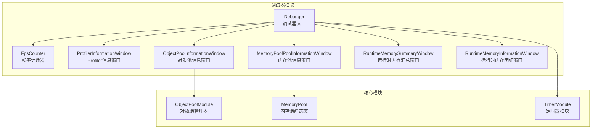
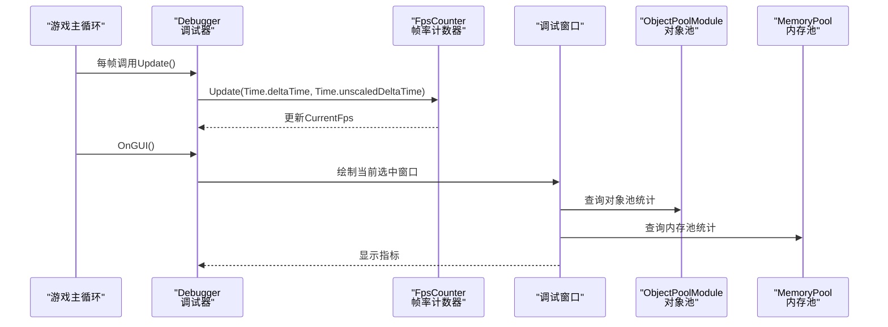
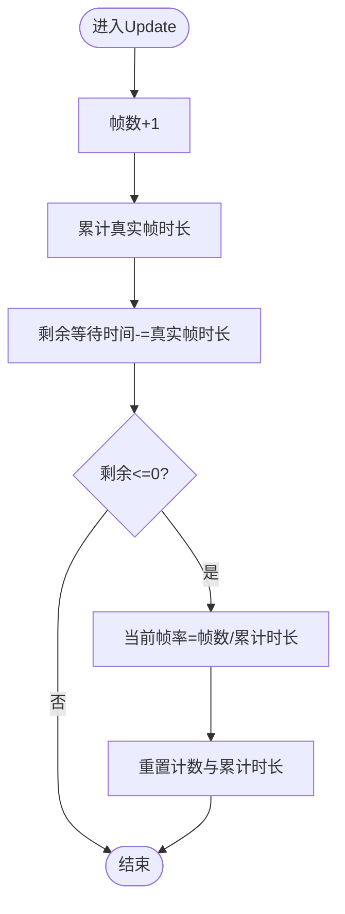
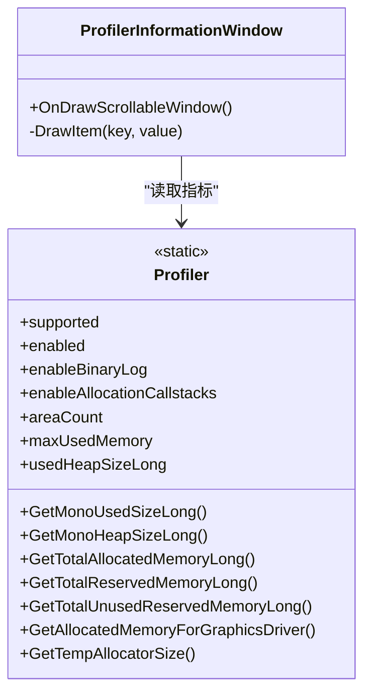
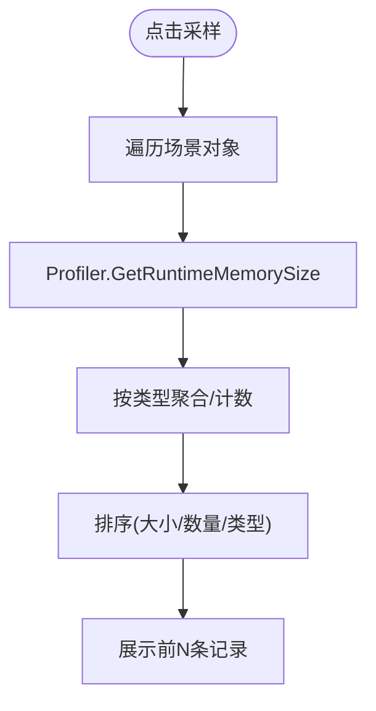
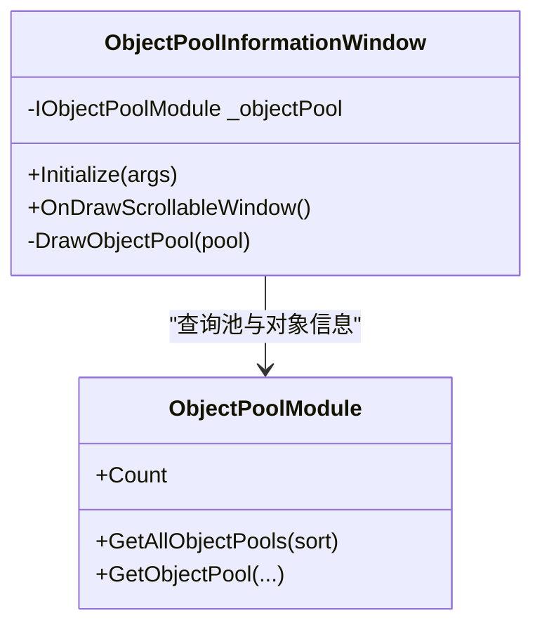
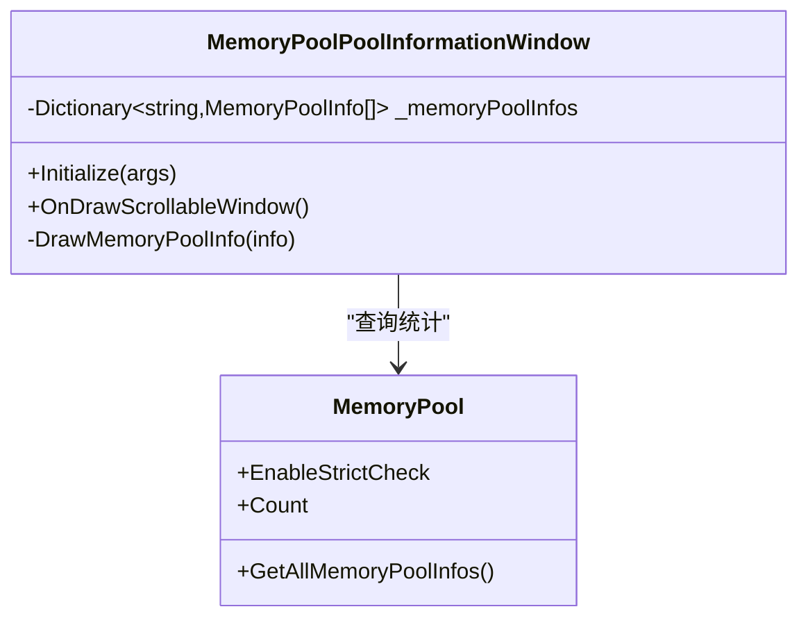
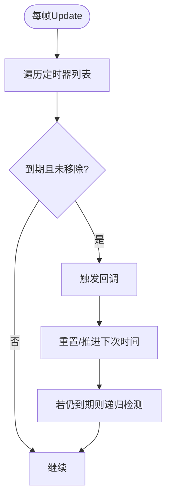
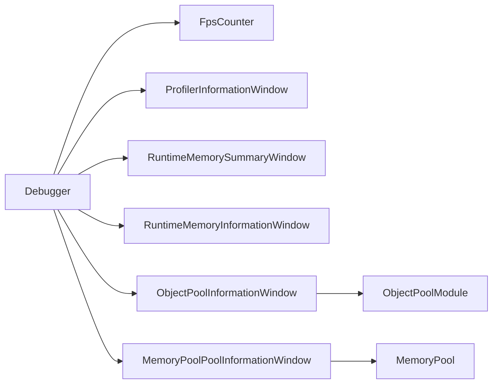

# 性能调试工具

<cite>
**本文引用的文件**
- [Debugger.cs](file://Assets/TEngine/Runtime/Module/DebugerModule/Debugger.cs)
- [DebuggerComponent.FpsCounter.cs](file://Assets/TEngine/Runtime/Module/DebugerModule/DebuggerComponent.FpsCounter.cs)
- [ProfilerInformationWindow.cs](file://Assets/TEngine/Runtime/Module/DebugerModule/Component/DebuggerModule.ProfilerInformationWindow.cs)
- [ObjectPoolInformationWindow.cs](file://Assets/TEngine/Runtime/Module/DebugerModule/Component/DebuggerModule.ObjectPoolInformationWindow.cs)
- [MemoryPoolInformationWindow.cs](file://Assets/TEngine/Runtime/Module/DebugerModule/Component/DebuggerModule.MemoryPoolInformationWindow.cs)
- [RuntimeMemorySummaryWindow.cs](file://Assets/TEngine/Runtime/Module/DebugerModule/Component/DebuggerModule.RuntimeMemorySummaryWindow.cs)
- [RuntimeMemoryInformationWindow.cs](file://Assets/TEngine/Runtime/Module/DebugerModule/Component/DebuggerModule.RuntimeMemoryInformationWindow.cs)
- [MemoryPool.cs](file://Assets/TEngine/Runtime/Core/MemoryPool/MemoryPool.cs)
- [ObjectPoolModule.cs](file://Assets/TEngine/Runtime/Module/ObjectPoolModule/ObjectPoolModule.cs)
- [TimerModule.cs](file://Assets/TEngine/Runtime/Module/TimerModule/TimerModule.cs)
- [QualitySettings.asset](file://ProjectSettings/QualitySettings.asset)
- [techContext.md](file://memory-bank/techContext.md)
</cite>

## 目录
1. [简介](#简介)
2. [项目结构](#项目结构)
3. [核心组件](#核心组件)
4. [架构总览](#架构总览)
5. [详细组件分析](#详细组件分析)
6. [依赖关系分析](#依赖关系分析)
7. [性能考量](#性能考量)
8. [故障排查指南](#故障排查指南)
9. [结论](#结论)
10. [附录](#附录)

## 简介
本文件面向TEngine的性能调试工具，围绕以下目标展开：深入解析FPS计数器的工作原理与使用方法；详解性能分析器窗口的关键指标（CPU使用率、GPU渲染性能、内存分配频率、垃圾回收统计等）；阐述对象池与内存池信息窗口的监控能力（对象创建销毁统计、池化效率分析、内存分配优化建议）；提供性能瓶颈定位与优化策略（渲染性能分析、脚本执行时间测量、资源加载优化）；并给出工具链整合与自动化监控方案。

## 项目结构
TEngine将调试与性能监控集中在“调试器模块”下，核心入口为调试器组件，内部通过注册各类调试窗口实现不同维度的性能观测。同时，对象池与内存池模块提供底层池化能力的数据支持。

**图表来源**
- [Debugger.cs:148-235](file://Assets/TEngine/Runtime/Module/DebugerModule/Debugger.cs#L148-L235)
- [DebuggerComponent.FpsCounter.cs:1-68](file://Assets/TEngine/Runtime/Module/DebugerModule/DebuggerComponent.FpsCounter.cs#L1-L68)
- [ProfilerInformationWindow.cs:1-60](file://Assets/TEngine/Runtime/Module/DebugerModule/Component/DebuggerModule.ProfilerInformationWindow.cs#L1-L60)
- [ObjectPoolInformationWindow.cs:1-88](file://Assets/TEngine/Runtime/Module/DebugerModule/Component/DebuggerModule.ObjectPoolInformationWindow.cs#L1-L88)
- [MemoryPoolInformationWindow.cs:1-107](file://Assets/TEngine/Runtime/Module/DebugerModule/Component/DebuggerModule.MemoryPoolInformationWindow.cs#L1-L107)
- [RuntimeMemorySummaryWindow.cs:1-123](file://Assets/TEngine/Runtime/Module/DebugerModule/Component/DebuggerModule.RuntimeMemorySummaryWindow.cs#L1-L123)
- [RuntimeMemoryInformationWindow.cs:1-135](file://Assets/TEngine/Runtime/Module/DebugerModule/Component/DebuggerModule.RuntimeMemoryInformationWindow.cs#L1-L135)
- [ObjectPoolModule.cs:1-120](file://Assets/TEngine/Runtime/Module/ObjectPoolModule/ObjectPoolModule.cs#L1-L120)
- [MemoryPool.cs:1-208](file://Assets/TEngine/Runtime/Core/MemoryPool/MemoryPool.cs#L1-L208)
- [TimerModule.cs:276-405](file://Assets/TEngine/Runtime/Module/TimerModule/TimerModule.cs#L276-L405)

**章节来源**
- [Debugger.cs:148-235](file://Assets/TEngine/Runtime/Module/DebugerModule/Debugger.cs#L148-L235)
- [techContext.md:178-232](file://memory-bank/techContext.md#L178-L232)

## 核心组件
- 调试器入口：负责窗口注册、激活状态控制、FPS更新与界面绘制。
- FPS计数器：基于累积帧时长与采样周期计算帧率，支持动态更新间隔。
- Profiler信息窗口：展示Unity Profiler关键指标，如堆内存、分配总量、图形驱动内存等。
- 运行时内存窗口：支持对全场景对象或特定类型对象进行内存采样与排序展示。
- 对象池信息窗口：展示对象池数量、各池配置与对象使用详情。
- 内存池信息窗口：展示内存池统计与分配释放次数，支持按程序集分类。
- 定时器模块：提供脚本执行时间测量与循环调用检测，辅助定位卡顿。

**章节来源**
- [Debugger.cs:148-235](file://Assets/TEngine/Runtime/Module/DebugerModule/Debugger.cs#L148-L235)
- [DebuggerComponent.FpsCounter.cs:1-68](file://Assets/TEngine/Runtime/Module/DebugerModule/DebuggerComponent.FpsCounter.cs#L1-L68)
- [ProfilerInformationWindow.cs:1-60](file://Assets/TEngine/Runtime/Module/DebugerModule/Component/DebuggerModule.ProfilerInformationWindow.cs#L1-L60)
- [RuntimeMemorySummaryWindow.cs:1-123](file://Assets/TEngine/Runtime/Module/DebugerModule/Component/DebuggerModule.RuntimeMemorySummaryWindow.cs#L1-L123)
- [RuntimeMemoryInformationWindow.cs:1-135](file://Assets/TEngine/Runtime/Module/DebugerModule/Component/DebuggerModule.RuntimeMemoryInformationWindow.cs#L1-L135)
- [ObjectPoolInformationWindow.cs:1-88](file://Assets/TEngine/Runtime/Module/DebugerModule/Component/DebuggerModule.ObjectPoolInformationWindow.cs#L1-L88)
- [MemoryPoolInformationWindow.cs:1-107](file://Assets/TEngine/Runtime/Module/DebugerModule/Component/DebuggerModule.MemoryPoolInformationWindow.cs#L1-L107)
- [ObjectPoolModule.cs:1-120](file://Assets/TEngine/Runtime/Module/ObjectPoolModule/ObjectPoolModule.cs#L1-L120)
- [MemoryPool.cs:1-208](file://Assets/TEngine/Runtime/Core/MemoryPool/MemoryPool.cs#L1-L208)
- [TimerModule.cs:276-405](file://Assets/TEngine/Runtime/Module/TimerModule/TimerModule.cs#L276-L405)

## 架构总览
调试器采用“入口组件 + 多窗口”的模块化设计。入口组件在启动时注册各类调试窗口，并在每帧更新FPS计数器。窗口通过调用对应模块接口获取实时数据，如对象池与内存池统计、Profiler指标、运行时内存采样等。

**图表来源**
- [Debugger.cs:237-266](file://Assets/TEngine/Runtime/Module/DebugerModule/Debugger.cs#L237-L266)
- [Debugger.cs:414-419](file://Assets/TEngine/Runtime/Module/DebugerModule/Debugger.cs#L414-L419)
- [DebuggerComponent.FpsCounter.cs:43-56](file://Assets/TEngine/Runtime/Module/DebugerModule/DebuggerComponent.FpsCounter.cs#L43-L56)
- [ObjectPoolInformationWindow.cs:12-35](file://Assets/TEngine/Runtime/Module/DebugerModule/Component/DebuggerModule.ObjectPoolInformationWindow.cs#L12-L35)
- [MemoryPoolInformationWindow.cs:16-33](file://Assets/TEngine/Runtime/Module/DebugerModule/Component/DebuggerModule.MemoryPoolInformationWindow.cs#L16-L33)

## 详细组件分析

### FPS计数器
- 工作原理
  - 基于固定采样周期累加真实帧时长，达到周期后计算平均帧率。
  - 提供可变采样间隔，便于在不同场景下平衡精度与开销。
- 关键字段
  - 采样间隔、累计时长、帧数计数、剩余等待时间、当前帧率。
- 使用方法
  - 在调试器入口每帧调用更新，将当前帧率显示在浮动图标或窗口中。
- 性能阈值与异常检测
  - 可结合目标帧率设定阈值，配合日志窗口输出异常帧率区间，用于定位卡顿时段。

**图表来源**
- [DebuggerComponent.FpsCounter.cs:43-56](file://Assets/TEngine/Runtime/Module/DebugerModule/DebuggerComponent.FpsCounter.cs#L43-L56)

**章节来源**
- [DebuggerComponent.FpsCounter.cs:1-68](file://Assets/TEngine/Runtime/Module/DebugerModule/DebuggerComponent.FpsCounter.cs#L1-L68)
- [Debugger.cs:237-240](file://Assets/TEngine/Runtime/Module/DebugerModule/Debugger.cs#L237-L240)
- [Debugger.cs:414-419](file://Assets/TEngine/Runtime/Module/DebugerModule/Debugger.cs#L414-L419)

### 性能分析器窗口（Profiler）
- 指标说明
  - 是否支持Profiler、是否启用、二进制日志开关、分配调用栈开关等。
  - 堆内存相关：Mono已用/堆大小、使用堆大小、总分配/保留/未用保留内存。
  - 图形驱动内存占用、临时分配器大小、Marshal缓存大小等。
- 用途
  - 快速评估整体内存压力与GC影响，识别异常峰值与泄漏风险。

**图表来源**
- [ProfilerInformationWindow.cs:12-56](file://Assets/TEngine/Runtime/Module/DebugerModule/Component/DebuggerModule.ProfilerInformationWindow.cs#L12-L56)

**章节来源**
- [ProfilerInformationWindow.cs:1-60](file://Assets/TEngine/Runtime/Module/DebugerModule/Component/DebuggerModule.ProfilerInformationWindow.cs#L1-L60)

### 运行时内存窗口（汇总与明细）
- 汇总窗口
  - 支持全场景对象采样，按类型聚合统计，展示对象数量与占用字节。
  - 提供排序比较器，按占用大小/数量/类型名排序。
- 明细窗口
  - 针对特定Unity对象类型进行采样，高亮重复对象（同名同类型同大小），辅助定位冗余资源。
- 适用场景
  - 快速发现大体积资源、重复资源与潜在泄漏点。

**图表来源**
- [RuntimeMemorySummaryWindow.cs:61-102](file://Assets/TEngine/Runtime/Module/DebugerModule/Component/DebuggerModule.RuntimeMemorySummaryWindow.cs#L61-L102)
- [RuntimeMemoryInformationWindow.cs:82-114](file://Assets/TEngine/Runtime/Module/DebugerModule/Component/DebuggerModule.RuntimeMemoryInformationWindow.cs#L82-L114)

**章节来源**
- [RuntimeMemorySummaryWindow.cs:1-123](file://Assets/TEngine/Runtime/Module/DebugerModule/Component/DebuggerModule.RuntimeMemorySummaryWindow.cs#L1-L123)
- [RuntimeMemoryInformationWindow.cs:1-135](file://Assets/TEngine/Runtime/Module/DebugerModule/Component/DebuggerModule.RuntimeMemoryInformationWindow.cs#L1-L135)

### 对象池信息窗口
- 监控内容
  - 对象池总数、各池容量、使用数、可释放数、过期时间、优先级等。
  - 展示每个池中的对象信息（名称、锁定、使用/计数、标志、优先级、最后使用时间）。
- 分析要点
  - 通过“可释放数”与“使用数”对比判断池化效率；异常高的“可释放数”可能意味着未正确回收或策略不当。
  - 结合“最后使用时间”定位长期占用对象，排查锁死或未释放问题。

**图表来源**
- [ObjectPoolInformationWindow.cs:12-35](file://Assets/TEngine/Runtime/Module/DebugerModule/Component/DebuggerModule.ObjectPoolInformationWindow.cs#L12-L35)
- [ObjectPoolModule.cs:28-340](file://Assets/TEngine/Runtime/Module/ObjectPoolModule/ObjectPoolModule.cs#L28-L340)

**章节来源**
- [ObjectPoolInformationWindow.cs:1-88](file://Assets/TEngine/Runtime/Module/DebugerModule/Component/DebuggerModule.ObjectPoolInformationWindow.cs#L1-L88)
- [ObjectPoolModule.cs:1-120](file://Assets/TEngine/Runtime/Module/ObjectPoolModule/ObjectPoolModule.cs#L1-L120)

### 内存池信息窗口
- 监控内容
  - 是否启用严格检查、内存池数量。
  - 按程序集分组展示各类类型的内存池统计：未使用、使用中、获取/归还次数、增删次数。
- 分析要点
  - 通过“获取/归还次数”衡量对象生命周期；异常波动可能指示频繁分配释放。
  - “未使用/使用中”比例异常可提示池容量或回收策略问题。

**图表来源**
- [MemoryPoolInformationWindow.cs:16-78](file://Assets/TEngine/Runtime/Module/DebugerModule/Component/DebuggerModule.MemoryPoolInformationWindow.cs#L16-L78)
- [MemoryPool.cs:33-48](file://Assets/TEngine/Runtime/Core/MemoryPool/MemoryPool.cs#L33-L48)

**章节来源**
- [MemoryPoolInformationWindow.cs:1-107](file://Assets/TEngine/Runtime/Module/DebugerModule/Component/DebuggerModule.MemoryPoolInformationWindow.cs#L1-L107)
- [MemoryPool.cs:1-208](file://Assets/TEngine/Runtime/Core/MemoryPool/MemoryPool.cs#L1-L208)

### 脚本执行时间测量与定时器模块
- 循环调用检测
  - 定时器模块在每帧检测是否存在“到期但未移除”的循环任务，避免在同一帧内反复触发导致卡顿。
- 应用场景
  - 与调试器FPS计数器联动，定位异常帧率与循环任务之间的关联。

**图表来源**
- [TimerModule.cs:286-311](file://Assets/TEngine/Runtime/Module/TimerModule/TimerModule.cs#L286-L311)
- [TimerModule.cs:313-386](file://Assets/TEngine/Runtime/Module/TimerModule/TimerModule.cs#L313-L386)

**章节来源**
- [TimerModule.cs:276-405](file://Assets/TEngine/Runtime/Module/TimerModule/TimerModule.cs#L276-L405)

## 依赖关系分析
- 调试器入口依赖模块系统获取具体模块实例，再由窗口各自依赖对应模块接口。
- 对象池与内存池窗口分别依赖对象池模块与内存池静态类。
- FPS计数器与Profiler窗口不依赖业务模块，直接由调试器入口在每帧更新与绘制。

**图表来源**
- [Debugger.cs:161-235](file://Assets/TEngine/Runtime/Module/DebugerModule/Debugger.cs#L161-L235)
- [ObjectPoolInformationWindow.cs:12-20](file://Assets/TEngine/Runtime/Module/DebugerModule/Component/DebuggerModule.ObjectPoolInformationWindow.cs#L12-L20)
- [MemoryPoolInformationWindow.cs:16-18](file://Assets/TEngine/Runtime/Module/DebugerModule/Component/DebuggerModule.MemoryPoolInformationWindow.cs#L16-L18)

**章节来源**
- [Debugger.cs:161-235](file://Assets/TEngine/Runtime/Module/DebugerModule/Debugger.cs#L161-L235)

## 性能考量
- FPS采样周期
  - 较短周期更敏感但开销更大；较长周期更平滑但响应较慢。建议在开发阶段采用较小周期，在发布版本适当增大。
- 内存采样成本
  - 全场景采样涉及大量对象遍历与Profiler查询，建议仅在定位问题时启用，避免持续高频采样造成额外开销。
- 对象池/内存池统计
  - 统计接口为只读快照，通常开销较低；但在极端情况下（池数量巨大）也应避免每帧频繁刷新。
- 质量设置
  - 项目质量设置会影响渲染与资源加载策略，建议在调试工具中结合质量等级进行对比测试。

**章节来源**
- [QualitySettings.asset:215-239](file://ProjectSettings/QualitySettings.asset#L215-L239)
- [techContext.md:228-232](file://memory-bank/techContext.md#L228-L232)

## 故障排查指南
- 帧率骤降
  - 使用FPS计数器观察异常区间；结合Profiler窗口查看堆内存与分配总量变化；检查定时器模块是否存在大量循环任务在同一帧触发。
- 内存异常增长
  - 使用运行时内存汇总窗口定位大对象类型；使用明细窗口高亮重复对象；核对对象池/内存池统计，确认回收与释放是否正常。
- 资源加载卡顿
  - 结合质量设置与异步加载策略，避免主线程阻塞；利用调试器窗口记录日志与指标，形成问题复现路径。

**章节来源**
- [Debugger.cs:414-419](file://Assets/TEngine/Runtime/Module/DebugerModule/Debugger.cs#L414-L419)
- [ProfilerInformationWindow.cs:12-56](file://Assets/TEngine/Runtime/Module/DebugerModule/Component/DebuggerModule.ProfilerInformationWindow.cs#L12-L56)
- [TimerModule.cs:286-386](file://Assets/TEngine/Runtime/Module/TimerModule/TimerModule.cs#L286-L386)

## 结论
TEngine的性能调试工具以调试器入口为核心，通过FPS计数器、Profiler窗口、运行时内存窗口、对象池与内存池窗口以及定时器模块，构建了覆盖CPU、GPU、内存与对象生命周期的多维性能观测体系。结合质量设置与工具链实践，可有效定位瓶颈并制定针对性优化策略。

## 附录
- 工具链整合建议
  - 将FPS计数器与Profiler指标接入CI构建报告，建立回归基线。
  - 对象池/内存池统计可作为发布前检查项，确保回收策略符合预期。
- 自动化监控方案
  - 在测试环境中定期采样运行时内存与对象池状态，异常阈值告警。
  - 将定时器模块的循环调用检测纳入自动化巡检，防止隐藏的卡顿风险。