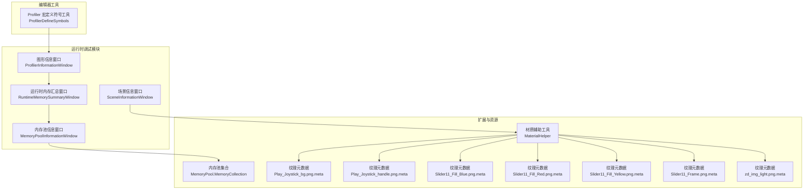
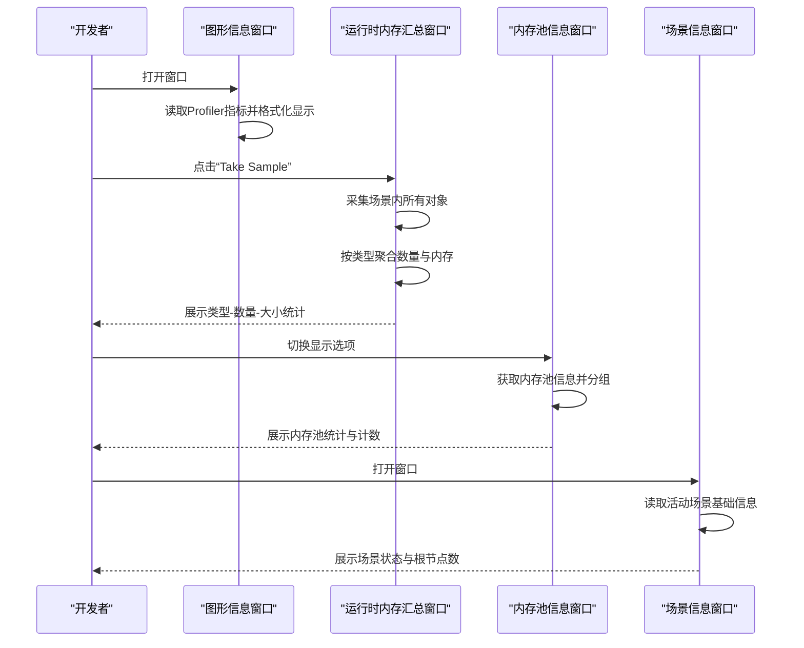
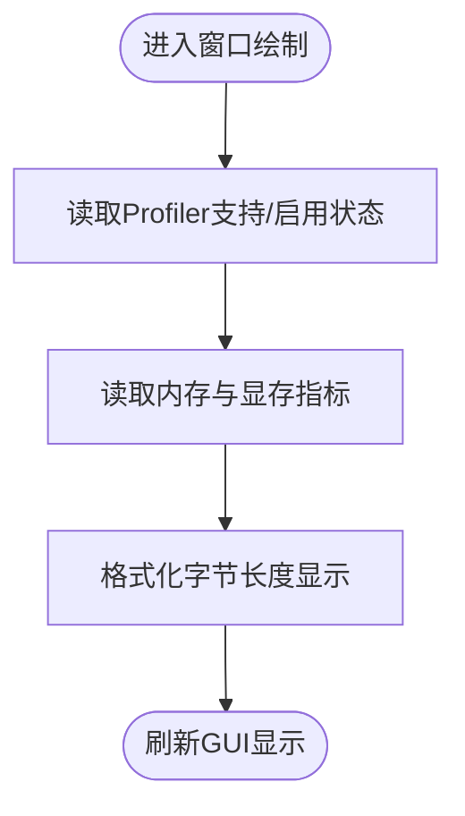
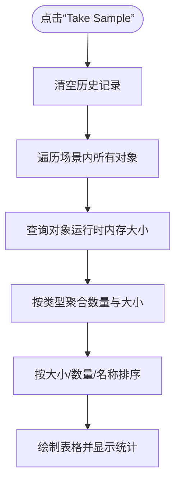
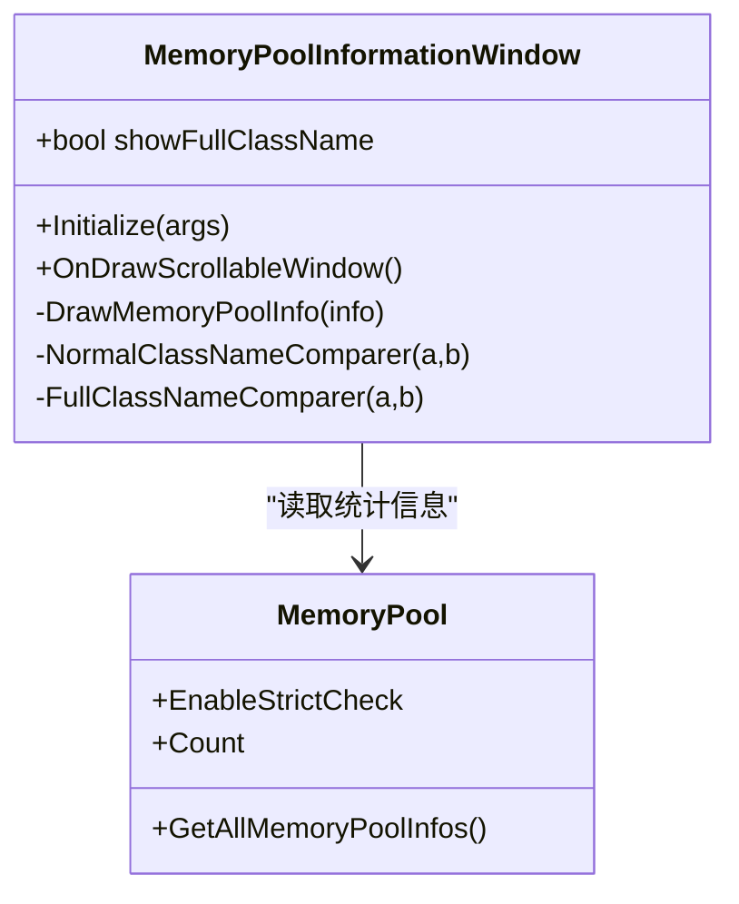
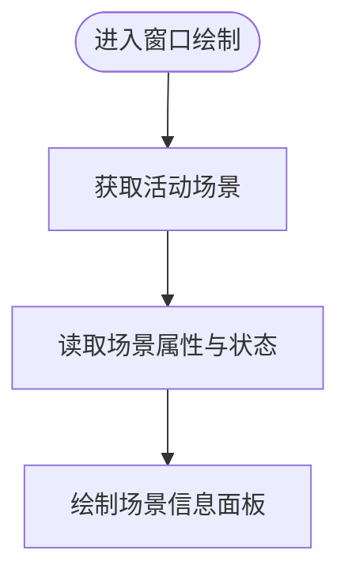
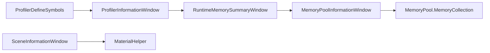

# 资源性能分析

<cite>
**本文引用的文件**
- [DebuggerModule.ProfilerInformationWindow.cs](file://Assets/TEngine/Runtime/Module/DebugerModule/Component/DebuggerModule.ProfilerInformationWindow.cs)
- [DebuggerModule.RuntimeMemorySummaryWindow.cs](file://Assets/TEngine/Runtime/Module/DebugerModule/Component/DebuggerModule.RuntimeMemorySummaryWindow.cs)
- [DebuggerModule.MemoryPoolInformationWindow.cs](file://Assets/TEngine/Runtime/Module/DebugerModule/Component/DebuggerModule.MemoryPoolInformationWindow.cs)
- [DebuggerModule.SceneInformationWindow.cs](file://Assets/TEngine/Runtime/Module/DebugerModule/Component/DebuggerModule.SceneInformationWindow.cs)
- [ProfilerDefineSymbols.cs](file://Assets/TEngine/Editor/DefineSymbols/ProfilerDefineSymbols.cs)
- [Utility.MaterialHelper.cs](file://Assets/TEngine/Runtime/Extension/Material/Utility.MaterialHelper.cs)
- [MemoryPool.MemoryCollection.cs](file://Assets/TEngine/Runtime/Core/MemoryPool/MemoryPool.MemoryCollection.cs)
- [Play_Joystick_bg.png.meta](file://Assets/AssetRaw/UIRaw/Atlas/Battle/Play_Joystick_bg.png.meta)
- [Play_Joystick_handle.png.meta](file://Assets/AssetRaw/UIRaw/Atlas/Battle/Play_Joystick_handle.png.meta)
- [Slider11_Fill_Blue.png.meta](file://Assets/AssetRaw/UIRaw/Atlas/Battle/Slider11_Fill_Blue.png.meta)
- [Slider11_Fill_Red.png.meta](file://Assets/AssetRaw/UIRaw/Atlas/Battle/Slider11_Fill_Red.png.meta)
- [Slider11_Fill_Yellow.png.meta](file://Assets/AssetRaw/UIRaw/Atlas/Battle/Slider11_Fill_Yellow.png.meta)
- [Slider11_Frame.png.meta](file://Assets/AssetRaw/UIRaw/Atlas/Battle/Slider11_Frame.png.meta)
- [zd_img_light.png.meta](file://Assets/AssetRaw/UIRaw/Atlas/Battle/zd_img_light.png.meta)
</cite>

## 目录
1. [简介](#简介)
2. [项目结构](#项目结构)
3. [核心组件](#核心组件)
4. [架构总览](#架构总览)
5. [详细组件分析](#详细组件分析)
6. [依赖关系分析](#依赖关系分析)
7. [性能考量](#性能考量)
8. [故障排查指南](#故障排查指南)
9. [结论](#结论)
10. [附录](#附录)

## 简介
本技术文档围绕 TEngine 的资源性能分析能力展开，系统性梳理图形信息、运行时内存、场景信息三大调试窗口的功能与实现，并结合材质辅助工具与资源元数据配置，给出纹理压缩、材质合并、批处理优化等实用策略与可视化建议。目标是帮助开发者在开发与优化阶段快速定位性能瓶颈，形成可执行的优化路径。

## 项目结构
TEngine 将性能分析能力以“调试器窗口”形式集成在运行时模块中，配合编辑器宏定义工具启用/禁用相关性能标记；同时通过材质辅助工具与资源元数据（如纹理压缩设置）支撑优化落地。

图表来源
- [DebuggerModule.ProfilerInformationWindow.cs:1-60](file://Assets/TEngine/Runtime/Module/DebugerModule/Component/DebuggerModule.ProfilerInformationWindow.cs#L1-L60)
- [DebuggerModule.RuntimeMemorySummaryWindow.cs:1-123](file://Assets/TEngine/Runtime/Module/DebugerModule/Component/DebuggerModule.RuntimeMemorySummaryWindow.cs#L1-L123)
- [DebuggerModule.MemoryPoolInformationWindow.cs:1-107](file://Assets/TEngine/Runtime/Module/DebugerModule/Component/DebuggerModule.MemoryPoolInformationWindow.cs#L1-L107)
- [DebuggerModule.SceneInformationWindow.cs:1-38](file://Assets/TEngine/Runtime/Module/DebugerModule/Component/DebuggerModule.SceneInformationWindow.cs#L1-L38)
- [ProfilerDefineSymbols.cs:1-44](file://Assets/TEngine/Editor/DefineSymbols/ProfilerDefineSymbols.cs#L1-L44)
- [Utility.MaterialHelper.cs:1-100](file://Assets/TEngine/Runtime/Extension/Material/Utility.MaterialHelper.cs#L1-L100)
- [MemoryPool.MemoryCollection.cs:124-156](file://Assets/TEngine/Runtime/Core/MemoryPool/MemoryPool.MemoryCollection.cs#L124-L156)
- [Play_Joystick_bg.png.meta:55-147](file://Assets/AssetRaw/UIRaw/Atlas/Battle/Play_Joystick_bg.png.meta#L55-L147)
- [Play_Joystick_handle.png.meta:55-147](file://Assets/AssetRaw/UIRaw/Atlas/Battle/Play_Joystick_handle.png.meta#L55-L147)
- [Slider11_Fill_Blue.png.meta:55-159](file://Assets/AssetRaw/UIRaw/Atlas/Battle/Slider11_Fill_Blue.png.meta#L55-L159)
- [Slider11_Fill_Red.png.meta:55-159](file://Assets/AssetRaw/UIRaw/Atlas/Battle/Slider11_Fill_Red.png.meta#L55-L159)
- [Slider11_Fill_Yellow.png.meta:55-159](file://Assets/AssetRaw/UIRaw/Atlas/Battle/Slider11_Fill_Yellow.png.meta#L55-L159)
- [Slider11_Frame.png.meta:55-159](file://Assets/AssetRaw/UIRaw/Atlas/Battle/Slider11_Frame.png.meta#L55-L159)
- [zd_img_light.png.meta:55-105](file://Assets/AssetRaw/UIRaw/Atlas/Battle/zd_img_light.png.meta#L55-L105)

章节来源
- [DebuggerModule.ProfilerInformationWindow.cs:1-60](file://Assets/TEngine/Runtime/Module/DebugerModule/Component/DebuggerModule.ProfilerInformationWindow.cs#L1-L60)
- [DebuggerModule.RuntimeMemorySummaryWindow.cs:1-123](file://Assets/TEngine/Runtime/Module/DebugerModule/Component/DebuggerModule.RuntimeMemorySummaryWindow.cs#L1-L123)
- [DebuggerModule.MemoryPoolInformationWindow.cs:1-107](file://Assets/TEngine/Runtime/Module/DebugerModule/Component/DebuggerModule.MemoryPoolInformationWindow.cs#L1-L107)
- [DebuggerModule.SceneInformationWindow.cs:1-38](file://Assets/TEngine/Runtime/Module/DebugerModule/Component/DebuggerModule.SceneInformationWindow.cs#L1-L38)
- [ProfilerDefineSymbols.cs:1-44](file://Assets/TEngine/Editor/DefineSymbols/ProfilerDefineSymbols.cs#L1-L44)
- [Utility.MaterialHelper.cs:1-100](file://Assets/TEngine/Runtime/Extension/Material/Utility.MaterialHelper.cs#L1-L100)
- [MemoryPool.MemoryCollection.cs:124-156](file://Assets/TEngine/Runtime/Core/MemoryPool/MemoryPool.MemoryCollection.cs#L124-L156)

## 核心组件
- 图形信息窗口：采集并展示 Unity Profiler 支持状态、启用状态、二进制日志、分配调用栈、区域数、最大使用内存、Mono/堆内存、显存占用、临时分配器大小等关键指标。
- 运行时内存汇总窗口：对当前场景内所有对象进行采样，按类型统计数量与内存占用，支持排序与时间戳记录，便于对比分析。
- 内存池信息窗口：展示内存池统计与各类型对象的获取/释放/增删计数，支持按程序集分组与全名显示，辅助定位内存热点与泄漏风险。
- 场景信息窗口：输出活动场景的基础信息（名称、路径、构建索引、是否加载/有效/脏/子场景等），以及场景根节点数量，辅助场景级性能分析。
- Profiler 宏定义工具：在编辑器菜单中一键启用/禁用性能分析相关宏定义，便于在不同阶段开启/关闭性能埋点。
- 材质辅助工具：在编辑器模式下修复材质 shader 引用一致性问题，避免因 shader 变更导致的材质失效或额外开销。
- 纹理元数据：通过 .meta 配置纹理压缩质量、平台设置、压缩算法等，直接影响 GPU 内存占用与加载性能。

章节来源
- [DebuggerModule.ProfilerInformationWindow.cs:12-56](file://Assets/TEngine/Runtime/Module/DebugerModule/Component/DebuggerModule.ProfilerInformationWindow.cs#L12-L56)
- [DebuggerModule.RuntimeMemorySummaryWindow.cs:20-59](file://Assets/TEngine/Runtime/Module/DebugerModule/Component/DebuggerModule.RuntimeMemorySummaryWindow.cs#L20-L59)
- [DebuggerModule.MemoryPoolInformationWindow.cs:20-78](file://Assets/TEngine/Runtime/Module/DebugerModule/Component/DebuggerModule.MemoryPoolInformationWindow.cs#L20-L78)
- [DebuggerModule.SceneInformationWindow.cs:10-34](file://Assets/TEngine/Runtime/Module/DebugerModule/Component/DebuggerModule.SceneInformationWindow.cs#L10-L34)
- [ProfilerDefineSymbols.cs:10-42](file://Assets/TEngine/Editor/DefineSymbols/ProfilerDefineSymbols.cs#L10-L42)
- [Utility.MaterialHelper.cs:11-96](file://Assets/TEngine/Runtime/Extension/Material/Utility.MaterialHelper.cs#L11-L96)
- [Play_Joystick_bg.png.meta:67-127](file://Assets/AssetRaw/UIRaw/Atlas/Battle/Play_Joystick_bg.png.meta#L67-L127)

## 架构总览
以下序列图展示了从用户触发到数据呈现的关键流程，涵盖采样、统计与展示三个阶段。

图表来源
- [DebuggerModule.ProfilerInformationWindow.cs:12-56](file://Assets/TEngine/Runtime/Module/DebugerModule/Component/DebuggerModule.ProfilerInformationWindow.cs#L12-L56)
- [DebuggerModule.RuntimeMemorySummaryWindow.cs:25-102](file://Assets/TEngine/Runtime/Module/DebugerModule/Component/DebuggerModule.RuntimeMemorySummaryWindow.cs#L25-L102)
- [DebuggerModule.MemoryPoolInformationWindow.cs:30-78](file://Assets/TEngine/Runtime/Module/DebugerModule/Component/DebuggerModule.MemoryPoolInformationWindow.cs#L30-L78)
- [DebuggerModule.SceneInformationWindow.cs:10-34](file://Assets/TEngine/Runtime/Module/DebugerModule/Component/DebuggerModule.SceneInformationWindow.cs#L10-L34)

## 详细组件分析

### 图形信息窗口（ProfilerInformationWindow）
- 功能要点
  - 显示 Profiler 支持与启用状态、二进制日志开关及日志文件路径、分配调用栈开关（特定版本）、区域数、最大使用内存等。
  - 提供 Mono/堆内存、显存占用、临时分配器大小等关键指标，便于评估渲染与 GC 压力。
- 关键实现路径
  - 指标读取与条件编译分支：[ProfilerInformationWindow.OnDrawScrollableWindow:12-56](file://Assets/TEngine/Runtime/Module/DebugerModule/Component/DebuggerModule.ProfilerInformationWindow.cs#L12-L56)
  - 字节长度格式化工具：[ProfilerInformationWindow.DrawItem:14-56](file://Assets/TEngine/Runtime/Module/DebugerModule/Component/DebuggerModule.ProfilerInformationWindow.cs#L14-L56)

图表来源
- [DebuggerModule.ProfilerInformationWindow.cs:12-56](file://Assets/TEngine/Runtime/Module/DebugerModule/Component/DebuggerModule.ProfilerInformationWindow.cs#L12-L56)

章节来源
- [DebuggerModule.ProfilerInformationWindow.cs:12-56](file://Assets/TEngine/Runtime/Module/DebugerModule/Component/DebuggerModule.ProfilerInformationWindow.cs#L12-L56)

### 运行时内存汇总窗口（RuntimeMemorySummaryWindow）
- 功能要点
  - 提供“采样”按钮，对当前场景所有对象进行内存采样，按类型统计数量与总大小，并按大小/数量/名称排序。
  - 记录采样时间戳，便于对比前后差异。
- 关键实现路径
  - 采样逻辑与排序比较器：[RuntimeMemorySummaryWindow.TakeSample:61-102](file://Assets/TEngine/Runtime/Module/DebugerModule/Component/DebuggerModule.RuntimeMemorySummaryWindow.cs#L61-L102)
  - GUI 绘制与按钮交互：[RuntimeMemorySummaryWindow.OnDrawScrollableWindow:20-59](file://Assets/TEngine/Runtime/Module/DebugerModule/Component/DebuggerModule.RuntimeMemorySummaryWindow.cs#L20-L59)

图表来源
- [DebuggerModule.RuntimeMemorySummaryWindow.cs:61-102](file://Assets/TEngine/Runtime/Module/DebugerModule/Component/DebuggerModule.RuntimeMemorySummaryWindow.cs#L61-L102)

章节来源
- [DebuggerModule.RuntimeMemorySummaryWindow.cs:20-102](file://Assets/TEngine/Runtime/Module/DebugerModule/Component/DebuggerModule.RuntimeMemorySummaryWindow.cs#L20-L102)

### 内存池信息窗口（MemoryPoolInformationWindow）
- 功能要点
  - 展示全局内存池统计（启用严格检查、内存池数量）。
  - 按程序集分组显示各类类型的内存池信息，支持“显示完整类名”切换。
  - 提供“Unused/Using/Acquire/Release/Add/Remove”等计数，辅助定位异常增长与泄漏风险。
- 关键实现路径
  - 分组与排序逻辑：[MemoryPoolInformationWindow.OnDrawScrollableWindow:30-78](file://Assets/TEngine/Runtime/Module/DebugerModule/Component/DebuggerModule.MemoryPoolInformationWindow.cs#L30-L78)
  - 类名比较器：[MemoryPoolInformationWindow.NormalClassNameComparer:95-103](file://Assets/TEngine/Runtime/Module/DebugerModule/Component/DebuggerModule.MemoryPoolInformationWindow.cs#L95-L103)

图表来源
- [DebuggerModule.MemoryPoolInformationWindow.cs:20-103](file://Assets/TEngine/Runtime/Module/DebugerModule/Component/DebuggerModule.MemoryPoolInformationWindow.cs#L20-L103)
- [MemoryPool.MemoryCollection.cs:124-156](file://Assets/TEngine/Runtime/Core/MemoryPool/MemoryPool.MemoryCollection.cs#L124-L156)

章节来源
- [DebuggerModule.MemoryPoolInformationWindow.cs:20-103](file://Assets/TEngine/Runtime/Module/DebugerModule/Component/DebuggerModule.MemoryPoolInformationWindow.cs#L20-L103)
- [MemoryPool.MemoryCollection.cs:124-156](file://Assets/TEngine/Runtime/Core/MemoryPool/MemoryPool.MemoryCollection.cs#L124-L156)

### 场景信息窗口（SceneInformationWindow）
- 功能要点
  - 输出活动场景名称、路径、构建索引、是否加载/有效/脏/子场景等基础信息，以及场景根节点数量。
  - 用于评估场景加载状态、切换成本与潜在的冗余根节点问题。
- 关键实现路径
  - 场景信息读取与绘制：[SceneInformationWindow.OnDrawScrollableWindow:10-34](file://Assets/TEngine/Runtime/Module/DebugerModule/Component/DebuggerModule.SceneInformationWindow.cs#L10-L34)

图表来源
- [DebuggerModule.SceneInformationWindow.cs:10-34](file://Assets/TEngine/Runtime/Module/DebugerModule/Component/DebuggerModule.SceneInformationWindow.cs#L10-L34)

章节来源
- [DebuggerModule.SceneInformationWindow.cs:10-34](file://Assets/TEngine/Runtime/Module/DebugerModule/Component/DebuggerModule.SceneInformationWindow.cs#L10-L34)

### Profiler 宏定义工具（ProfilerDefineSymbols）
- 功能要点
  - 在编辑器菜单中提供“启用/禁用所有 Profiler 宏定义”的快捷入口，便于在不同阶段开启/关闭性能埋点。
- 关键实现路径
  - 菜单项与宏定义管理：[ProfilerDefineSymbols:10-42](file://Assets/TEngine/Editor/DefineSymbols/ProfilerDefineSymbols.cs#L10-L42)

章节来源
- [ProfilerDefineSymbols.cs:10-42](file://Assets/TEngine/Editor/DefineSymbols/ProfilerDefineSymbols.cs#L10-L42)

### 材质辅助工具（MaterialHelper）
- 功能要点
  - 在编辑器模式下修复材质 shader 引用一致性，避免因 shader 变更导致的材质失效或额外开销。
  - 支持对场景、UI、TMP 等对象的材质 shader 修复。
- 关键实现路径
  - 修复逻辑与等待场景根节点可用：[MaterialHelper:11-96](file://Assets/TEngine/Runtime/Extension/Material/Utility.MaterialHelper.cs#L11-L96)

章节来源
- [Utility.MaterialHelper.cs:11-96](file://Assets/TEngine/Runtime/Extension/Material/Utility.MaterialHelper.cs#L11-L96)

## 依赖关系分析
- 窗口间耦合度低，均基于统一的滚动调试窗口基类进行绘制，职责清晰。
- 运行时内存汇总窗口依赖 Unity Profiler API 与资源系统；内存池窗口依赖内存池统计接口；场景窗口依赖场景管理 API。
- 编辑器宏定义工具与运行时窗口无直接依赖，但可通过宏控制运行时行为（例如启用/禁用某些性能分析代码块）。

图表来源
- [ProfilerDefineSymbols.cs:10-42](file://Assets/TEngine/Editor/DefineSymbols/ProfilerDefineSymbols.cs#L10-L42)
- [DebuggerModule.ProfilerInformationWindow.cs:12-56](file://Assets/TEngine/Runtime/Module/DebugerModule/Component/DebuggerModule.ProfilerInformationWindow.cs#L12-L56)
- [DebuggerModule.RuntimeMemorySummaryWindow.cs:61-102](file://Assets/TEngine/Runtime/Module/DebugerModule/Component/DebuggerModule.RuntimeMemorySummaryWindow.cs#L61-L102)
- [DebuggerModule.MemoryPoolInformationWindow.cs:30-78](file://Assets/TEngine/Runtime/Module/DebugerModule/Component/DebuggerModule.MemoryPoolInformationWindow.cs#L30-L78)
- [DebuggerModule.SceneInformationWindow.cs:10-34](file://Assets/TEngine/Runtime/Module/DebugerModule/Component/DebuggerModule.SceneInformationWindow.cs#L10-L34)
- [Utility.MaterialHelper.cs:11-96](file://Assets/TEngine/Runtime/Extension/Material/Utility.MaterialHelper.cs#L11-L96)
- [MemoryPool.MemoryCollection.cs:124-156](file://Assets/TEngine/Runtime/Core/MemoryPool/MemoryPool.MemoryCollection.cs#L124-L156)

章节来源
- [ProfilerDefineSymbols.cs:10-42](file://Assets/TEngine/Editor/DefineSymbols/ProfilerDefineSymbols.cs#L10-L42)
- [DebuggerModule.ProfilerInformationWindow.cs:12-56](file://Assets/TEngine/Runtime/Module/DebugerModule/Component/DebuggerModule.ProfilerInformationWindow.cs#L12-L56)
- [DebuggerModule.RuntimeMemorySummaryWindow.cs:61-102](file://Assets/TEngine/Runtime/Module/DebugerModule/Component/DebuggerModule.RuntimeMemorySummaryWindow.cs#L61-L102)
- [DebuggerModule.MemoryPoolInformationWindow.cs:30-78](file://Assets/TEngine/Runtime/Module/DebugerModule/Component/DebuggerModule.MemoryPoolInformationWindow.cs#L30-L78)
- [DebuggerModule.SceneInformationWindow.cs:10-34](file://Assets/TEngine/Runtime/Module/DebugerModule/Component/DebuggerModule.SceneInformationWindow.cs#L10-L34)
- [Utility.MaterialHelper.cs:11-96](file://Assets/TEngine/Runtime/Extension/Material/Utility.MaterialHelper.cs#L11-L96)
- [MemoryPool.MemoryCollection.cs:124-156](file://Assets/TEngine/Runtime/Core/MemoryPool/MemoryPool.MemoryCollection.cs#L124-L156)

## 性能考量
- 渲染批次与 DrawCall
  - 使用图形信息窗口关注显存占用与临时分配器大小，结合场景根节点数量与材质 shader 一致性，减少不必要的材质切换与渲染状态变化。
  - 通过材质辅助工具修复 shader 引用，避免因 shader 变更导致的额外批次或失败重试。
- GPU 内存
  - 结合纹理元数据中的压缩质量与平台设置，合理选择压缩算法与质量，降低 GPU 内存峰值。
  - 对 UI/特效等高频资源优先采用压缩质量适配策略，平衡画质与内存占用。
- 堆内存与 GC
  - 使用运行时内存汇总窗口观察类型分布，识别异常增长的对象类型；结合内存池窗口的 Acquire/Release/Remove 计数，定位泄漏或频繁分配点。
  - 合理配置内存池严格检查，及时发现越界或重复释放等问题。
- 场景性能
  - 场景信息窗口可辅助判断场景加载状态与根节点数量，避免冗余根节点与未卸载对象造成内存压力。

[本节为通用指导，不直接分析具体文件]

## 故障排查指南
- Profiler 指标为空或不可用
  - 检查图形信息窗口中的“Supported/Enabled”状态；必要时通过宏定义工具启用相关标记后再观察。
- 内存采样结果异常
  - 确认采样时间戳与对象数量；若类型占比异常，结合内存池窗口的计数进行交叉验证。
- 材质 shader 失效或报错
  - 使用材质辅助工具在编辑器模式下修复 shader 引用；确保场景、UI、TMP 对应路径均被覆盖。
- 纹理资源过大
  - 检查对应 .meta 文件中的压缩质量与平台设置，按目标平台调整压缩参数并重新导入。

章节来源
- [DebuggerModule.ProfilerInformationWindow.cs:12-56](file://Assets/TEngine/Runtime/Module/DebugerModule/Component/DebuggerModule.ProfilerInformationWindow.cs#L12-L56)
- [DebuggerModule.RuntimeMemorySummaryWindow.cs:20-59](file://Assets/TEngine/Runtime/Module/DebugerModule/Component/DebuggerModule.RuntimeMemorySummaryWindow.cs#L20-L59)
- [DebuggerModule.MemoryPoolInformationWindow.cs:20-78](file://Assets/TEngine/Runtime/Module/DebugerModule/Component/DebuggerModule.MemoryPoolInformationWindow.cs#L20-L78)
- [Utility.MaterialHelper.cs:11-96](file://Assets/TEngine/Runtime/Extension/Material/Utility.MaterialHelper.cs#L11-L96)
- [Play_Joystick_bg.png.meta:67-127](file://Assets/AssetRaw/UIRaw/Atlas/Battle/Play_Joystick_bg.png.meta#L67-L127)

## 结论
TEngine 的资源性能分析体系以“调试器窗口 + 编辑器工具 + 资源元数据”为核心，覆盖图形、内存、场景与材质等关键维度。通过采样与统计相结合的方式，能够快速定位瓶颈并制定优化策略。建议在开发过程中定期使用这些工具进行回归测试，形成持续的性能监控闭环。

[本节为总结性内容，不直接分析具体文件]

## 附录
- 可视化与报告建议
  - 将运行时内存汇总窗口的采样结果导出为表格，按时间序列对比不同版本的内存分布。
  - 将图形信息窗口的关键指标（显存、临时分配器、堆内存）纳入每日构建报告，建立趋势曲线。
  - 将场景信息窗口的状态与根节点数量纳入场景加载报告，评估切换成本。
- 工具使用清单
  - 启用/禁用 Profiler 宏定义：[ProfilerDefineSymbols:22-42](file://Assets/TEngine/Editor/DefineSymbols/ProfilerDefineSymbols.cs#L22-L42)
  - 采样运行时内存：[RuntimeMemorySummaryWindow:25-28](file://Assets/TEngine/Runtime/Module/DebugerModule/Component/DebuggerModule.RuntimeMemorySummaryWindow.cs#L25-L28)
  - 查看内存池统计：[MemoryPoolInformationWindow:30-78](file://Assets/TEngine/Runtime/Module/DebugerModule/Component/DebuggerModule.MemoryPoolInformationWindow.cs#L30-L78)
  - 查看场景信息：[SceneInformationWindow:10-34](file://Assets/TEngine/Runtime/Module/DebugerModule/Component/DebuggerModule.SceneInformationWindow.cs#L10-L34)
  - 修复材质 shader：[MaterialHelper:11-96](file://Assets/TEngine/Runtime/Extension/Material/Utility.MaterialHelper.cs#L11-L96)