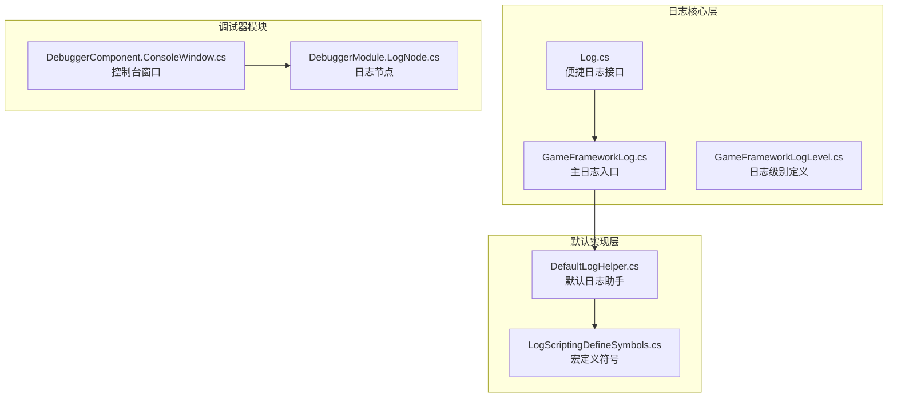
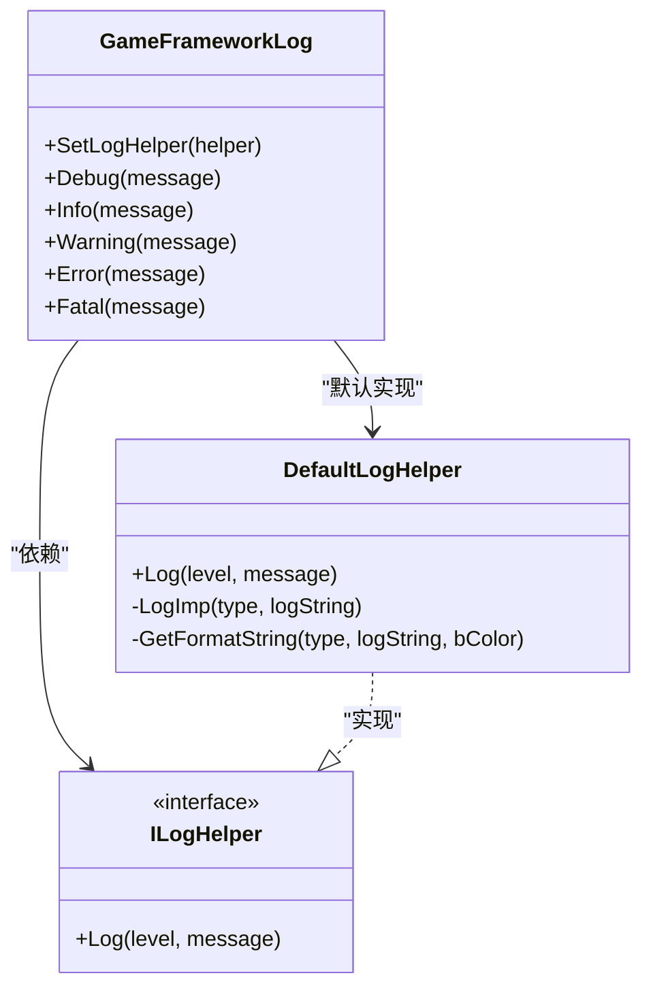
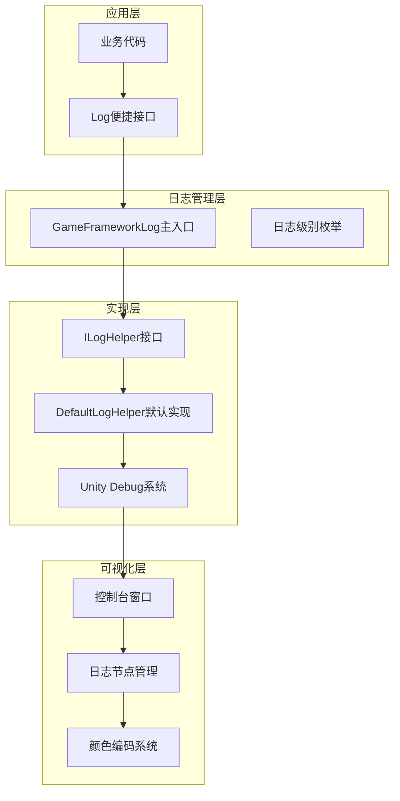
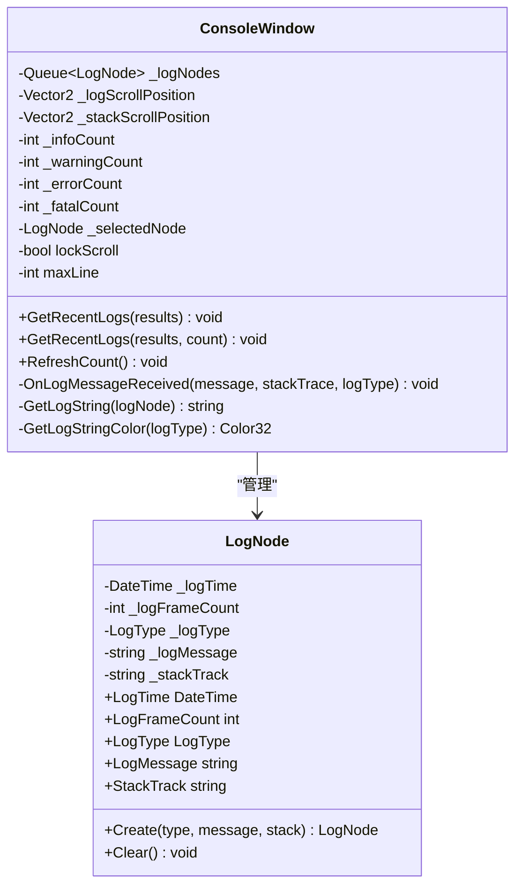
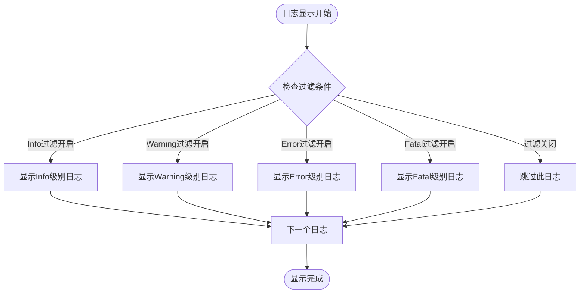
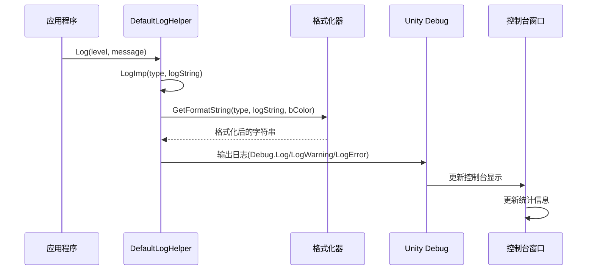
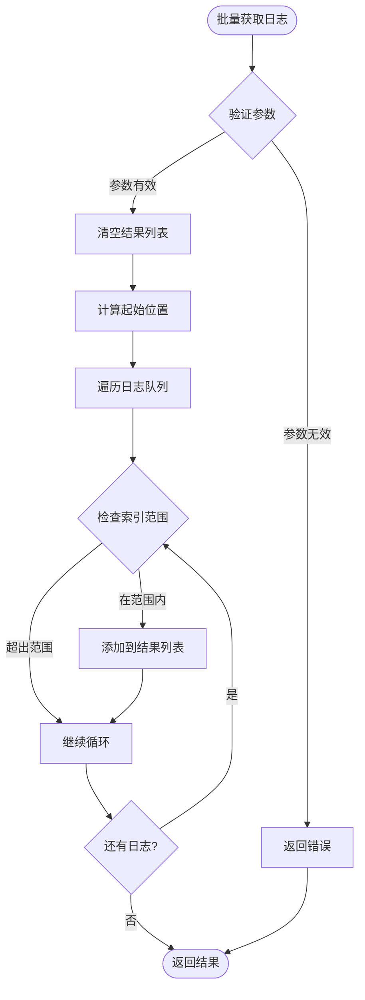

# 控制台日志系统

<cite>
**本文档引用的文件**
- [GameFrameworkLog.cs](file://Assets/TEngine/Runtime/Core/Lib/TEngine/Runtime/Core/Log/GameFrameworkLog.cs)
- [GameFrameworkLogLevel.cs](file://Assets/TEngine/Runtime/Core/Lib/TEngine/Runtime/Core/Log/GameFrameworkLogLevel.cs)
- [Log.cs](file://Assets/TEngine/Runtime/Core/Lib/TEngine/Runtime/Core/Log/Log.cs)
- [DefaultLogHelper.cs](file://Assets/TEngine/Runtime/Core/Lib/TEngine/Runtime/Core/Utility/DefaultHelper/DefaultLogHelper.cs)
- [DebuggerComponent.ConsoleWindow.cs](file://Assets/TEngine/Runtime/Core/Lib/TEngine/Runtime/Module/DebugerModule/DebuggerComponent.ConsoleWindow.cs)
- [DebuggerModule.LogNode.cs](file://Assets/TEngine/Runtime/Core/Lib/TEngine/Runtime/Module/DebugerModule/Component/DebuggerModule.LogNode.cs)
- [LogScriptingDefineSymbols.cs](file://Assets/TEngine/Editor/DefineSymbols/LogScriptingDefineSymbols.cs)
</cite>

## 目录
1. [简介](#简介)
2. [项目结构](#项目结构)
3. [核心组件](#核心组件)
4. [架构概览](#架构概览)
5. [详细组件分析](#详细组件分析)
6. [依赖关系分析](#依赖关系分析)
7. [性能考虑](#性能考虑)
8. [故障排除指南](#故障排除指南)
9. [结论](#结论)
10. [附录](#附录)

## 简介

TEngine控制台日志系统是一个功能完整、高度可定制的日志管理解决方案。该系统提供了多级别的日志记录能力、丰富的颜色编码系统、智能的过滤机制、强大的搜索和复制功能，以及完善的性能优化策略。

系统采用分层架构设计，从底层的日志记录接口到上层的可视化控制台窗口，形成了一个完整的日志生态系统。支持调试、信息、警告、错误和致命错误五种日志级别，并提供了灵活的预编译符号控制机制。

## 项目结构

日志系统主要分布在以下目录结构中：



**图表来源**
- [GameFrameworkLog.cs:1-50](file://Assets/TEngine/Runtime/Core/Lib/TEngine/Runtime/Core/Log/GameFrameworkLog.cs#L1-L50)
- [DefaultLogHelper.cs:1-30](file://Assets/TEngine/Runtime/Core/Lib/TEngine/Runtime/Core/Utility/DefaultHelper/DefaultLogHelper.cs#L1-L30)
- [DebuggerComponent.ConsoleWindow.cs:1-30](file://Assets/TEngine/Runtime/Core/Lib/TEngine/Runtime/Module/DebugerModule/DebuggerComponent.ConsoleWindow.cs#L1-L30)

**章节来源**
- [GameFrameworkLog.cs:1-100](file://Assets/TEngine/Runtime/Core/Lib/TEngine/Runtime/Core/Log/GameFrameworkLog.cs#L1-L100)
- [Log.cs:1-50](file://Assets/TEngine/Runtime/Core/Lib/TEngine/Runtime/Core/Log/Log.cs#L1-L50)

## 核心组件

### 日志级别系统

系统定义了完整的五级日志体系：

| 日志级别 | 数值 | 描述 | 使用场景 |
|---------|------|------|----------|
| Debug | 0 | 调试信息 | 开发阶段的详细调试输出 |
| Info | 1 | 一般信息 | 系统正常运行状态记录 |
| Warning | 2 | 警告信息 | 可能出现问题但不影响运行 |
| Error | 3 | 错误信息 | 功能逻辑错误 |
| Fatal | 4 | 致命错误 | 导致系统异常的日志 |

### 日志记录接口

日志系统提供了统一的记录接口，支持多种数据类型的格式化输出：



**图表来源**
- [GameFrameworkLog.cs:6-17](file://Assets/TEngine/Runtime/Core/Lib/TEngine/Runtime/Core/Log/GameFrameworkLog.cs#L6-L17)
- [GameFrameworkLog.ILogHelper.cs:8-16](file://Assets/TEngine/Runtime/Core/Lib/TEngine/Runtime/Core/Log/GameFrameworkLog.ILogHelper.cs#L8-L16)
- [DefaultLogHelper.cs:18-66](file://Assets/TEngine/Runtime/Core/Lib/TEngine/Runtime/Core/Utility/DefaultHelper/DefaultLogHelper.cs#L18-L66)

**章节来源**
- [GameFrameworkLogLevel.cs:1-34](file://Assets/TEngine/Runtime/Core/Lib/TEngine/Runtime/Core/Log/GameFrameworkLogLevel.cs#L1-L34)
- [GameFrameworkLog.cs:1-200](file://Assets/TEngine/Runtime/Core/Lib/TEngine/Runtime/Core/Log/GameFrameworkLog.cs#L1-L200)

## 架构概览

日志系统采用分层架构设计，确保了良好的可扩展性和可维护性：



**图表来源**
- [Log.cs:8-21](file://Assets/TEngine/Runtime/Core/Lib/TEngine/Runtime/Core/Log/Log.cs#L8-L21)
- [GameFrameworkLog.cs:6-17](file://Assets/TEngine/Runtime/Core/Lib/TEngine/Runtime/Core/Log/GameFrameworkLog.cs#L6-L17)
- [DefaultLogHelper.cs:18-66](file://Assets/TEngine/Runtime/Core/Lib/TEngine/Runtime/Core/Utility/DefaultHelper/DefaultLogHelper.cs#L18-L66)

## 详细组件分析

### 控制台窗口组件

控制台窗口是日志系统的核心可视化组件，提供了丰富的交互功能：

#### 日志节点管理系统



**图表来源**
- [DebuggerModule.LogNode.cs:11-117](file://Assets/TEngine/Runtime/Core/Lib/TEngine/Runtime/Module/DebugerModule/Component/DebuggerModule.LogNode.cs#L11-L117)
- [DebuggerComponent.ConsoleWindow.cs:10-393](file://Assets/TEngine/Runtime/Core/Lib/TEngine/Runtime/Module/DebugerModule/DebuggerComponent.ConsoleWindow.cs#L10-L393)

#### 日志过滤机制

控制台窗口实现了智能的日志过滤系统：



**图表来源**
- [DebuggerComponent.ConsoleWindow.cs:201-242](file://Assets/TEngine/Runtime/Core/Lib/TEngine/Runtime/Module/DebugerModule/DebuggerComponent.ConsoleWindow.cs#L201-L242)

#### 颜色编码系统

系统实现了基于日志级别的颜色编码机制：

| 日志级别 | 颜色代码 | 显示效果 |
|---------|----------|----------|
| Debug | #CFCFCF | 浅灰色 |
| Info | #CFCFCF | 浅灰色 |
| Warning | #FF9400 | 橙色 |
| Error | red | 红色 |
| Fatal | red | 红色 |

**章节来源**
- [DebuggerComponent.ConsoleWindow.cs:194-242](file://Assets/TEngine/Runtime/Core/Lib/TEngine/Runtime/Module/DebugerModule/DebuggerComponent.ConsoleWindow.cs#L194-L242)
- [DefaultLogHelper.cs:75-125](file://Assets/TEngine/Runtime/Core/Lib/TEngine/Runtime/Core/Utility/DefaultHelper/DefaultLogHelper.cs#L75-L125)

### 默认日志助手

DefaultLogHelper是日志系统的默认实现，提供了完整的日志记录功能：

#### 日志格式化流程



**图表来源**
- [DefaultLogHelper.cs:39-66](file://Assets/TEngine/Runtime/Core/Lib/TEngine/Runtime/Core/Utility/DefaultHelper/DefaultLogHelper.cs#L39-L66)
- [DefaultLogHelper.cs:127-171](file://Assets/TEngine/Runtime/Core/Lib/TEngine/Runtime/Core/Utility/DefaultHelper/DefaultLogHelper.cs#L127-L171)

#### 堆栈跟踪收集

系统在警告和错误级别自动收集堆栈跟踪信息：

**章节来源**
- [DefaultLogHelper.cs:127-171](file://Assets/TEngine/Runtime/Core/Lib/TEngine/Runtime/Core/Utility/DefaultHelper/DefaultLogHelper.cs#L127-L171)

### 预编译符号控制系统

系统提供了灵活的日志控制机制，通过预编译符号控制日志输出：

| 宏定义符号 | 功能描述 | 使用场景 |
|-----------|----------|----------|
| ENABLE_LOG | 启用所有日志 | 开发环境 |
| ENABLE_DEBUG_LOG | 启用调试日志 | 调试模式 |
| ENABLE_INFO_LOG | 启用信息日志 | 信息记录 |
| ENABLE_DEBUG_AND_ABOVE_LOG | 启用调试及以上级别 | 综合调试 |
| ENABLE_INFO_AND_ABOVE_LOG | 启用信息及以上级别 | 生产监控 |

**章节来源**
- [Log.cs:15-31](file://Assets/TEngine/Runtime/Core/Lib/TEngine/Runtime/Core/Log/Log.cs#L15-L31)
- [LogScriptingDefineSymbols.cs:112-147](file://Assets/TEngine/Editor/DefineSymbols/LogScriptingDefineSymbols.cs#L112-L147)

## 依赖关系分析

日志系统的依赖关系清晰明确，遵循了单一职责原则：

```mermaid
graph LR
subgraph "外部依赖"
A[UnityEngine.Debug]
B[System.Diagnostics]
C[UnityEditor (编辑器模式)]
end
subgraph "内部模块"
D[GameFrameworkLog]
E[ILogHelper接口]
F[DefaultLogHelper]
G[LogNode]
H[ConsoleWindow]
end
D --> E
F --> D
F --> A
F --> B
H --> G
H --> F
C -.-> F
```

**图表来源**
- [DefaultLogHelper.cs:1-12](file://Assets/TEngine/Runtime/Core/Lib/TEngine/Runtime/Core/Utility/DefaultHelper/DefaultLogHelper.cs#L1-L12)
- [DebuggerComponent.ConsoleWindow.cs:1-10](file://Assets/TEngine/Runtime/Core/Lib/TEngine/Runtime/Module/DebugerModule/DebuggerComponent.ConsoleWindow.cs#L1-L10)

### 内存管理策略

系统采用了高效的内存管理策略：

1. **对象池模式**: 使用MemoryPool对LogNode进行对象复用
2. **队列限制**: 通过maxLine参数限制日志数量
3. **自动清理**: 超出限制时自动释放旧日志节点

**章节来源**
- [DebuggerComponent.ConsoleWindow.cs:370-374](file://Assets/TEngine/Runtime/Core/Lib/TEngine/Runtime/Module/DebugerModule/DebuggerComponent.ConsoleWindow.cs#L370-L374)
- [DebuggerModule.LogNode.cs:93-102](file://Assets/TEngine/Runtime/Core/Lib/TEngine/Runtime/Module/DebugerModule/Component/DebuggerModule.LogNode.cs#L93-L102)

## 性能考虑

### 日志缓冲区管理

系统实现了智能的缓冲区管理机制：

- **动态队列**: 使用Queue<LogNode>实现先进先出的日志存储
- **容量限制**: maxLine参数控制最大日志数量，默认100条
- **内存回收**: 自动释放超出容量的日志节点

### 性能优化策略

1. **条件编译**: 通过预编译符号在不同构建配置下控制日志输出
2. **延迟格式化**: 仅在需要时进行字符串格式化操作
3. **颜色编码缓存**: 预计算颜色值以减少运行时开销
4. **堆栈跟踪按需收集**: 仅在警告和错误级别收集堆栈信息

### 批量处理机制

系统支持批量日志获取功能：



**图表来源**
- [DebuggerComponent.ConsoleWindow.cs:329-360](file://Assets/TEngine/Runtime/Core/Lib/TEngine/Runtime/Module/DebugerModule/DebuggerComponent.ConsoleWindow.cs#L329-L360)

**章节来源**
- [DebuggerComponent.ConsoleWindow.cs:314-360](file://Assets/TEngine/Runtime/Core/Lib/TEngine/Runtime/Module/DebugerModule/DebuggerComponent.ConsoleWindow.cs#L314-L360)

## 故障排除指南

### 常见问题及解决方案

#### 日志不显示问题

**症状**: 应用程序中调用了日志接口但控制台没有显示

**可能原因**:
1. 预编译符号未正确设置
2. 日志级别过滤被禁用
3. 控制台窗口被意外关闭

**解决步骤**:
1. 检查宏定义符号设置
2. 验证日志级别过滤开关
3. 重新打开调试器窗口

#### 内存使用过高

**症状**: 应用运行一段时间后内存占用持续增长

**解决方案**:
1. 调整maxLine参数限制日志数量
2. 定期清理历史日志
3. 在生产环境中禁用Debug级别日志

#### 堆栈跟踪信息缺失

**症状**: 错误日志缺少堆栈跟踪信息

**原因分析**:
1. 日志级别低于Warning
2. 编辑器模式下的特殊处理

**解决方法**:
1. 提升日志级别到Warning或更高
2. 确保在运行时而非编辑器模式下测试

**章节来源**
- [DefaultLogHelper.cs:137-151](file://Assets/TEngine/Runtime/Core/Lib/TEngine/Runtime/Core/Utility/DefaultHelper/DefaultLogHelper.cs#L137-L151)
- [DebuggerComponent.ConsoleWindow.cs:362-374](file://Assets/TEngine/Runtime/Core/Lib/TEngine/Runtime/Module/DebugerModule/DebuggerComponent.ConsoleWindow.cs#L362-L374)

## 结论

TEngine控制台日志系统是一个设计精良、功能完备的日志管理解决方案。系统具有以下突出特点：

1. **架构清晰**: 分层设计确保了良好的可扩展性和可维护性
2. **功能丰富**: 支持多级别日志、颜色编码、智能过滤、堆栈跟踪等功能
3. **性能优秀**: 采用对象池、队列限制等优化策略，有效控制内存使用
4. **易于定制**: 提供接口抽象，支持自定义日志实现和格式化
5. **开发友好**: 集成Unity编辑器功能，提供便捷的调试体验

该系统适用于各种规模的项目，从小型独立游戏到大型多人在线游戏都能提供可靠的日志管理能力。

## 附录

### 扩展和定制指南

#### 自定义日志格式

要实现自定义日志格式，需要实现ILogHelper接口：

```csharp
public class CustomLogHelper : GameFrameworkLog.ILogHelper
{
    public void Log(GameFrameworkLogLevel level, object message)
    {
        // 实现自定义格式化逻辑
        string formattedMessage = FormatMessage(level, message);
        
        // 实现自定义输出逻辑
        CustomOutput(formattedMessage);
    }
    
    private string FormatMessage(GameFrameworkLogLevel level, object message)
    {
        // 自定义格式化实现
        return $"[{DateTime.Now:HH:mm:ss}] [{level}] {message}";
    }
}
```

#### 第三方日志集成

系统支持与第三方日志框架集成，只需实现ILogHelper接口即可无缝接入现有日志基础设施。

#### 日志持久化存储

可以通过扩展DefaultLogHelper，在LogImp方法中添加文件写入逻辑，实现日志的持久化存储功能。