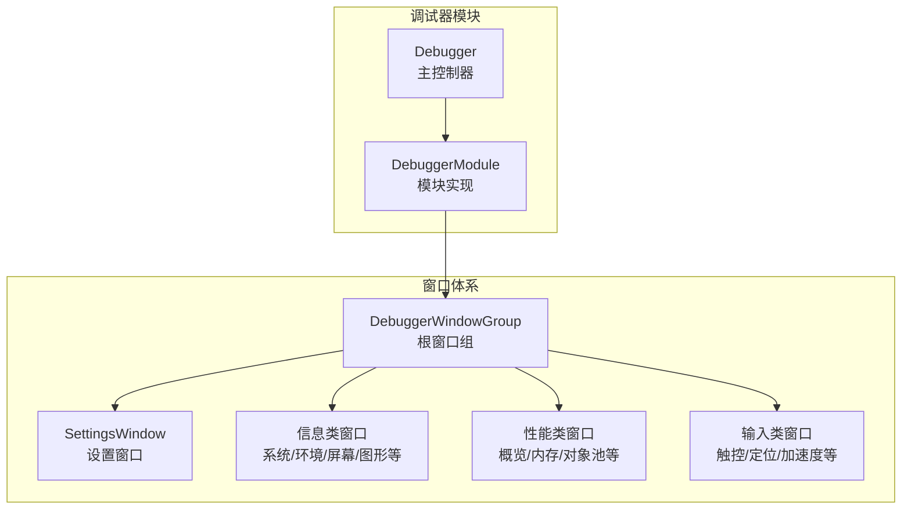
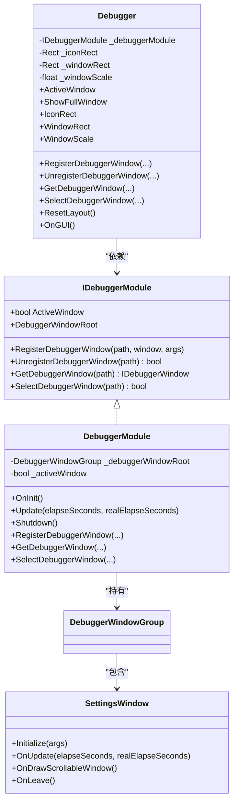
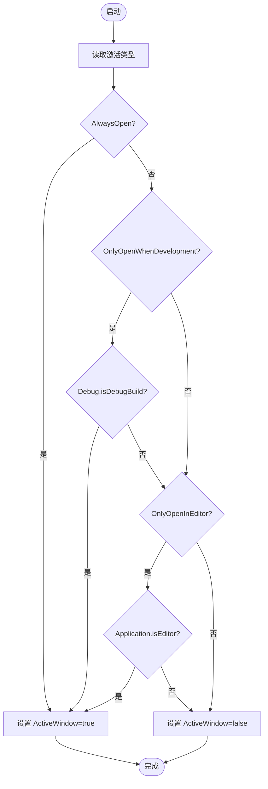
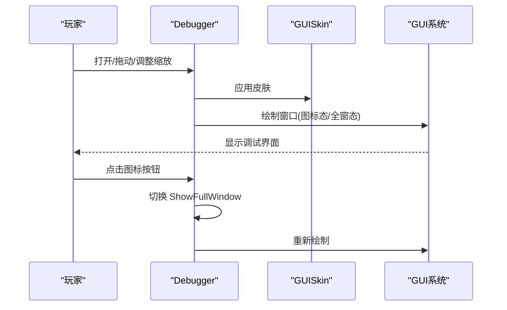
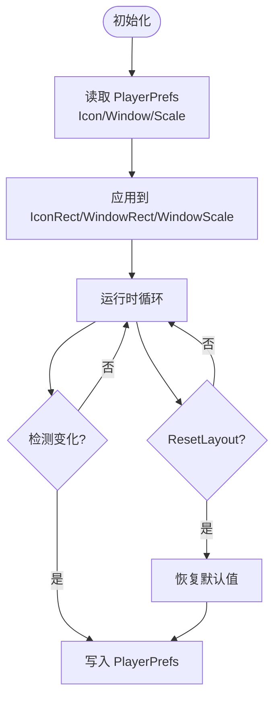
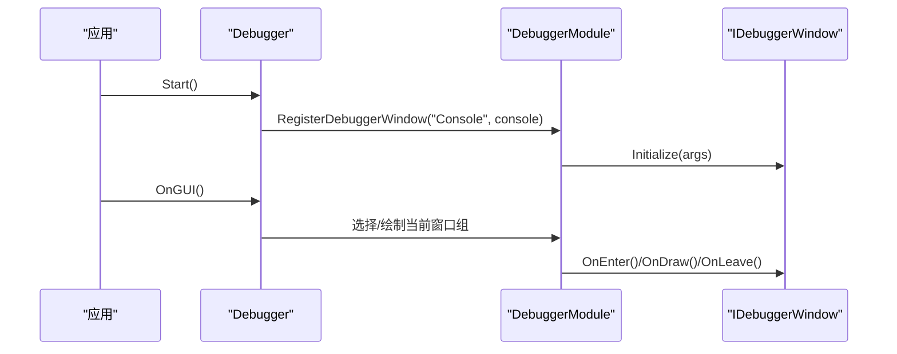
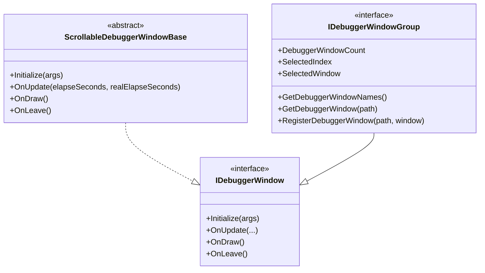
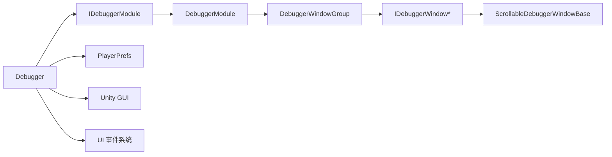

# 调试器定制化

<cite>
**本文引用的文件**
- [Debugger.cs](file://Assets/TEngine/Runtime/Module/DebugerModule/Debugger.cs)
- [DebuggerModule.cs](file://Assets/TEngine/Runtime/Module/DebugerModule/DebuggerModule.cs)
- [DebuggerActiveWindowType.cs](file://Assets/TEngine/Runtime/Module/DebugerModule/DebuggerActiveWindowType.cs)
- [IDebuggerModule.cs](file://Assets/TEngine/Runtime/Module/DebugerModule/IDebuggerModule.cs)
- [IDebuggerWindowGroup.cs](file://Assets/TEngine/Runtime/Module/DebugerModule/IDebuggerWindowGroup.cs)
- [DebuggerModule.SettingsWindow.cs](file://Assets/TEngine/Runtime/Module/DebugerModule/Component/DebuggerModule.SettingsWindow.cs)
- [DebuggerModule.ScrollableDebuggerWindowBase.cs](file://Assets/TEngine/Runtime/Module/DebugerModule/Component/DebuggerModule.ScrollableDebuggerWindowBase.cs)
</cite>

## 目录
1. [简介](#简介)
2. [项目结构](#项目结构)
3. [核心组件](#核心组件)
4. [架构总览](#架构总览)
5. [详细组件分析](#详细组件分析)
6. [依赖关系分析](#依赖关系分析)
7. [性能考量](#性能考量)
8. [故障排查指南](#故障排查指南)
9. [结论](#结论)
10. [附录](#附录)

## 简介
本技术文档围绕 TEngine 调试器的定制化能力展开，重点覆盖以下方面：
- 显示模式配置：常开模式、开发模式、编辑器模式等激活条件与适用场景
- 界面皮肤与视觉定制：GUI 样式、主题切换、字体与颜色方案等
- 配置管理机制：窗口位置与尺寸保存、缩放控制、布局恢复与设置持久化
- 扩展开发指南：自定义调试窗口创建、窗口注册机制、事件处理流程
- 不同开发环境与团队协作下的配置优化与最佳实践

## 项目结构
调试器位于运行时模块目录下，采用“模块 + 窗口”的分层设计：
- 模块层负责生命周期、激活状态与窗口注册
- 窗口层提供具体的功能面板（信息、性能、内存、输入等）
- 设置窗口负责用户偏好的持久化与可视化调整

图表来源
- [DebuggerModule.cs:1-116](file://Assets/TEngine/Runtime/Module/DebugerModule/DebuggerModule.cs#L1-L116)
- [Debugger.cs:1-429](file://Assets/TEngine/Runtime/Module/DebugerModule/Debugger.cs#L1-L429)
- [DebuggerModule.SettingsWindow.cs:1-226](file://Assets/TEngine/Runtime/Module/DebugerModule/Component/DebuggerModule.SettingsWindow.cs#L1-L226)

章节来源
- [DebuggerModule.cs:1-116](file://Assets/TEngine/Runtime/Module/DebugerModule/DebuggerModule.cs#L1-L116)
- [Debugger.cs:1-429](file://Assets/TEngine/Runtime/Module/DebugerModule/Debugger.cs#L1-L429)

## 核心组件
- 调试器模块（DebuggerModule）：实现 IDebuggerModule 接口，负责窗口树的构建、注册与激活状态管理
- 主控制器（Debugger）：挂载于场景对象，负责渲染、布局、激活条件、事件系统交互与设置持久化
- 窗口基类（ScrollableDebuggerWindowBase）：提供可滚动窗口的绘制与更新框架
- 设置窗口（SettingsWindow）：提供窗口位置、尺寸、缩放的可视化调整与持久化
- 激活类型枚举（DebuggerActiveWindowType）：定义调试器的显示模式

章节来源
- [IDebuggerModule.cs:1-55](file://Assets/TEngine/Runtime/Module/DebugerModule/IDebuggerModule.cs#L1-L55)
- [DebuggerModule.cs:1-116](file://Assets/TEngine/Runtime/Module/DebugerModule/DebuggerModule.cs#L1-L116)
- [Debugger.cs:1-429](file://Assets/TEngine/Runtime/Module/DebugerModule/Debugger.cs#L1-L429)
- [DebuggerModule.SettingsWindow.cs:1-226](file://Assets/TEngine/Runtime/Module/DebugerModule/Component/DebuggerModule.SettingsWindow.cs#L1-L226)
- [DebuggerActiveWindowType.cs:1-29](file://Assets/TEngine/Runtime/Module/DebugerModule/DebuggerActiveWindowType.cs#L1-L29)

## 架构总览
调试器采用“模块 + 控制器 + 窗口组”的分层架构，通过模块系统统一管理窗口注册与选择，主控制器负责渲染与用户交互。

图表来源
- [IDebuggerModule.cs:1-55](file://Assets/TEngine/Runtime/Module/DebugerModule/IDebuggerModule.cs#L1-L55)
- [DebuggerModule.cs:1-116](file://Assets/TEngine/Runtime/Module/DebugerModule/DebuggerModule.cs#L1-L116)
- [Debugger.cs:1-429](file://Assets/TEngine/Runtime/Module/DebugerModule/Debugger.cs#L1-L429)
- [DebuggerModule.SettingsWindow.cs:1-226](file://Assets/TEngine/Runtime/Module/DebugerModule/Component/DebuggerModule.SettingsWindow.cs#L1-L226)

## 详细组件分析

### 显示模式配置（激活条件）
调试器支持多种显示模式，由枚举类型控制：
- 总是打开：适用于需要随时查看调试信息的场景
- 仅在开发模式时打开：基于构建配置，适合开发阶段启用
- 仅在编辑器中打开：便于在 Unity 编辑器内调试
- 总是关闭：默认不显示，需手动开启

图表来源
- [Debugger.cs:217-235](file://Assets/TEngine/Runtime/Module/DebugerModule/Debugger.cs#L217-L235)
- [DebuggerActiveWindowType.cs:1-29](file://Assets/TEngine/Runtime/Module/DebugerModule/DebuggerActiveWindowType.cs#L1-L29)

章节来源
- [Debugger.cs:217-235](file://Assets/TEngine/Runtime/Module/DebugerModule/Debugger.cs#L217-L235)
- [DebuggerActiveWindowType.cs:1-29](file://Assets/TEngine/Runtime/Module/DebugerModule/DebuggerActiveWindowType.cs#L1-L29)

### 界面皮肤与视觉定制
- GUI 皮肤：主控制器在渲染前应用指定 GUISkin，实现全局样式
- 缩放矩阵：通过缩放矩阵统一放大/缩小所有窗口内容，便于高分辨率显示器阅读
- 图标态与全窗态：图标态显示 FPS 与日志统计，点击展开为完整窗口；切换时联动 UI 事件系统显隐
- 日志颜色：根据日志级别动态选择颜色，直观提示异常状态

图表来源
- [Debugger.cs:242-266](file://Assets/TEngine/Runtime/Module/DebugerModule/Debugger.cs#L242-L266)
- [Debugger.cs:391-419](file://Assets/TEngine/Runtime/Module/DebugerModule/Debugger.cs#L391-L419)

章节来源
- [Debugger.cs:242-266](file://Assets/TEngine/Runtime/Module/DebugerModule/Debugger.cs#L242-L266)
- [Debugger.cs:391-419](file://Assets/TEngine/Runtime/Module/DebugerModule/Debugger.cs#L391-L419)

### 配置管理机制（窗口位置、布局与持久化）
- 偏好存储：使用 PlayerPrefs 持久化窗口位置、尺寸与缩放
- 初始化恢复：启动时从 PlayerPrefs 读取上次布局并恢复
- 实时同步：设置窗口在 OnUpdate 中检测变化并写回 PlayerPrefs
- 复位能力：提供重置布局到默认值的能力

图表来源
- [Debugger.cs:161-181](file://Assets/TEngine/Runtime/Module/DebugerModule/Debugger.cs#L161-L181)
- [DebuggerModule.SettingsWindow.cs:19-83](file://Assets/TEngine/Runtime/Module/DebugerModule/Component/DebuggerModule.SettingsWindow.cs#L19-L83)

章节来源
- [Debugger.cs:161-181](file://Assets/TEngine/Runtime/Module/DebugerModule/Debugger.cs#L161-L181)
- [DebuggerModule.SettingsWindow.cs:19-83](file://Assets/TEngine/Runtime/Module/DebugerModule/Component/DebuggerModule.SettingsWindow.cs#L19-L83)

### 窗口注册与事件处理
- 注册机制：通过路径字符串注册窗口，支持层级组织（如 Information/System）
- 选择与切换：通过路径选择窗口，内部维护选中索引与窗口实例
- 生命周期：窗口初始化、更新、绘制、离开回调按需调用
- 事件系统：切换全窗态时联动 UI 事件系统显隐

图表来源
- [DebuggerModule.cs:64-84](file://Assets/TEngine/Runtime/Module/DebugerModule/DebuggerModule.cs#L64-L84)
- [Debugger.cs:274-297](file://Assets/TEngine/Runtime/Module/DebugerModule/Debugger.cs#L274-L297)
- [Debugger.cs:338-389](file://Assets/TEngine/Runtime/Module/DebugerModule/Debugger.cs#L338-L389)

章节来源
- [DebuggerModule.cs:64-84](file://Assets/TEngine/Runtime/Module/DebugerModule/DebuggerModule.cs#L64-L84)
- [Debugger.cs:274-297](file://Assets/TEngine/Runtime/Module/DebugerModule/Debugger.cs#L274-L297)
- [Debugger.cs:338-389](file://Assets/TEngine/Runtime/Module/DebugerModule/Debugger.cs#L338-L389)

### 自定义调试窗口开发指南
- 继承基类：实现窗口逻辑前，先继承可滚动窗口基类以获得统一绘制框架
- 实现接口：实现 IDebuggerWindow 或 IDebuggerWindowGroup 接口，提供名称、绘制与更新逻辑
- 注册窗口：在主控制器启动阶段或模块初始化阶段，通过路径注册窗口
- 事件处理：利用 OnEnter/OnLeave/OnDraw 生命周期钩子处理进入、离开与绘制
- 布局与皮肤：在窗口内部使用 GUI 工具函数绘制，受主控制器皮肤与缩放影响

图表来源
- [DebuggerModule.ScrollableDebuggerWindowBase.cs](file://Assets/TEngine/Runtime/Module/DebugerModule/Component/DebuggerModule.ScrollableDebuggerWindowBase.cs)
- [IDebuggerWindowGroup.cs:1-53](file://Assets/TEngine/Runtime/Module/DebugerModule/IDebuggerWindowGroup.cs#L1-L53)

章节来源
- [DebuggerModule.ScrollableDebuggerWindowBase.cs](file://Assets/TEngine/Runtime/Module/DebugerModule/Component/DebuggerModule.ScrollableDebuggerWindowBase.cs)
- [IDebuggerWindowGroup.cs:1-53](file://Assets/TEngine/Runtime/Module/DebugerModule/IDebuggerWindowGroup.cs#L1-L53)

## 依赖关系分析
- 模块耦合：主控制器依赖模块接口，模块实现持有窗口组，窗口组持有具体窗口
- 外部依赖：PlayerPrefs 用于设置持久化；Unity GUI 用于绘制；UI 事件系统用于交互显隐
- 可能的循环：当前结构为单向依赖，未见循环引用

图表来源
- [Debugger.cs:161-181](file://Assets/TEngine/Runtime/Module/DebugerModule/Debugger.cs#L161-L181)
- [DebuggerModule.cs:64-84](file://Assets/TEngine/Runtime/Module/DebugerModule/DebuggerModule.cs#L64-L84)
- [DebuggerModule.SettingsWindow.cs:19-83](file://Assets/TEngine/Runtime/Module/DebugerModule/Component/DebuggerModule.SettingsWindow.cs#L19-L83)

章节来源
- [Debugger.cs:161-181](file://Assets/TEngine/Runtime/Module/DebugerModule/Debugger.cs#L161-L181)
- [DebuggerModule.cs:64-84](file://Assets/TEngine/Runtime/Module/DebugerModule/DebuggerModule.cs#L64-L84)
- [DebuggerModule.SettingsWindow.cs:19-83](file://Assets/TEngine/Runtime/Module/DebugerModule/Component/DebuggerModule.SettingsWindow.cs#L19-L83)

## 性能考量
- 渲染开销：GUI 绘制在 OnGUI 中执行，应避免在 OnDraw 中做重型计算，尽量复用缓存数据
- 更新频率：窗口组的 Update 在模块轮询中触发，可根据需要在窗口内部节流
- 缩放影响：缩放矩阵会影响绘制成本，建议在高分辨率屏上适度调整缩放值
- 布局持久化：频繁写入 PlayerPrefs 会带来 IO 开销，可在设置窗口中合并写入时机

## 故障排查指南
- 调试器不显示
  - 检查激活类型与当前环境是否匹配
  - 确认模块已正确初始化且 ActiveWindow 已设置
- 布局未恢复
  - 确认 PlayerPrefs 中是否存在对应键值
  - 启动时检查初始化逻辑是否读取了默认值
- 窗口无法拖动或点击无效
  - 确认窗口绘制区域包含可拖拽矩形
  - 检查 UI 事件系统是否被隐藏
- 自定义窗口未出现
  - 确认注册路径正确且未重复
  - 检查窗口 Initialize 是否被调用

章节来源
- [Debugger.cs:242-266](file://Assets/TEngine/Runtime/Module/DebugerModule/Debugger.cs#L242-L266)
- [DebuggerModule.cs:64-84](file://Assets/TEngine/Runtime/Module/DebugerModule/DebuggerModule.cs#L64-L84)
- [DebuggerModule.SettingsWindow.cs:19-83](file://Assets/TEngine/Runtime/Module/DebugerModule/Component/DebuggerModule.SettingsWindow.cs#L19-L83)

## 结论
TEngine 调试器提供了完善的定制化能力：灵活的显示模式、统一的皮肤与缩放机制、完善的布局持久化与复位能力，以及清晰的窗口注册与生命周期接口。通过遵循本文档的扩展指南，开发者可以快速创建符合团队需求的调试窗口，并在不同开发环境与协作流程中稳定使用。

## 附录
- 最佳实践
  - 在开发阶段使用“仅在开发模式”或“仅在编辑器”模式，避免发布版本暴露调试界面
  - 团队协作中统一皮肤与缩放策略，减少跨设备差异带来的阅读问题
  - 将高频更新的窗口逻辑下沉至模块轮询，避免在 OnGUI 中执行重型任务
  - 对自定义窗口进行命名规范与路径分层，提升可维护性