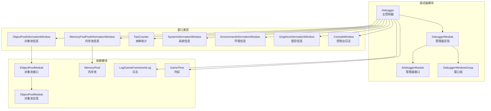
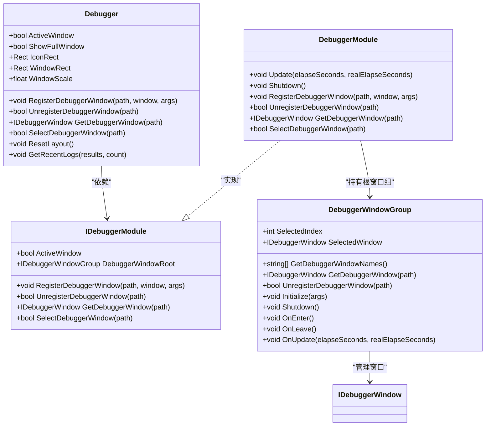
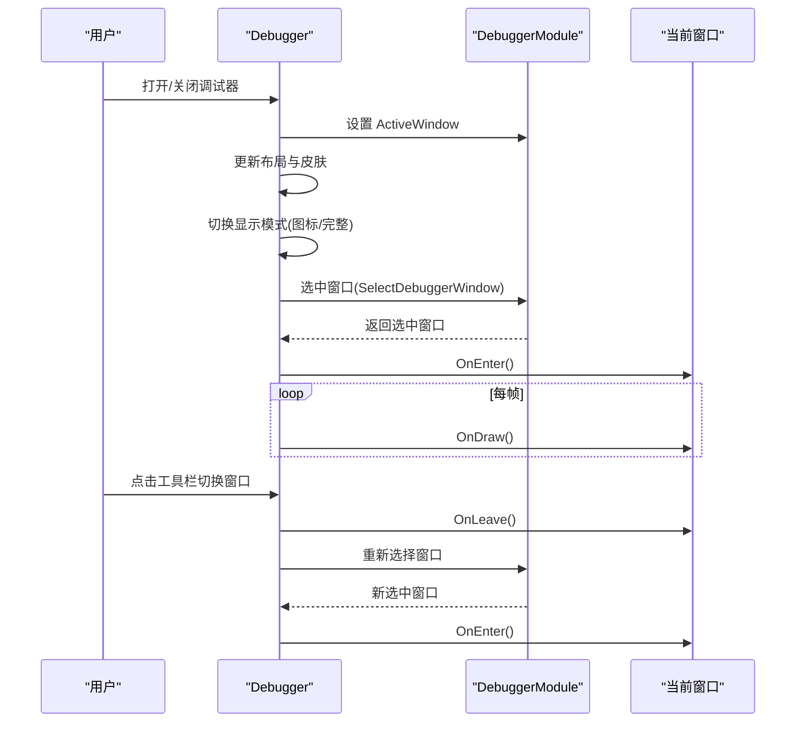
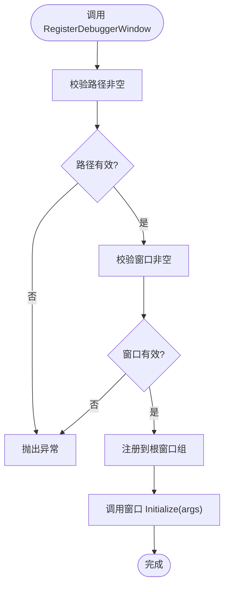
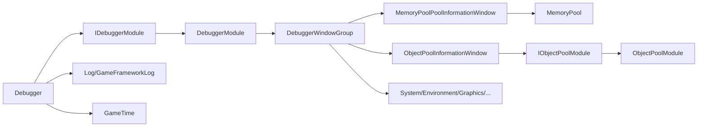

# 调试器工具

<cite>
**本文引用的文件**
- [Debugger.cs](file://Assets/TEngine/Runtime/Module/DebugerModule/Debugger.cs)
- [IDebuggerModule.cs](file://Assets/TEngine/Runtime/Module/DebugerModule/IDebuggerModule.cs)
- [DebuggerModule.cs](file://Assets/TEngine/Runtime/Module/DebugerModule/DebuggerModule.cs)
- [DebuggerManager.DebuggerWindowGroup.cs](file://Assets/TEngine/Runtime/Module/DebugerModule/DebuggerManager.DebuggerWindowGroup.cs)
- [DebuggerModule.MemoryPoolInformationWindow.cs](file://Assets/TEngine/Runtime/Module/DebugerModule/Component/DebuggerModule.MemoryPoolInformationWindow.cs)
- [DebuggerModule.ObjectPoolInformationWindow.cs](file://Assets/TEngine/Runtime/Module/DebugerModule/Component/DebuggerModule.ObjectPoolInformationWindow.cs)
- [IObjectPoolModule.cs](file://Assets/TEngine/Runtime/Module/ObjectPoolModule/IObjectPoolModule.cs)
- [ObjectPoolModule.cs](file://Assets/TEngine/Runtime/Module/ObjectPoolModule/ObjectPoolModule.cs)
- [ObjectPoolBase.cs](file://Assets/TEngine/Runtime/Module/ObjectPoolModule/ObjectPoolBase.cs)
- [ObjectInfo.cs](file://Assets/TEngine/Runtime/Module/ObjectPoolModule/ObjectInfo.cs)
- [MemoryPool.cs](file://Assets/TEngine/Runtime/Core/MemoryPool/MemoryPool.cs)
- [MemoryPoolInfo.cs](file://Assets/TEngine/Runtime/Core/MemoryPool/MemoryPoolInfo.cs)
- [MemoryPoolSetting.cs](file://Assets/TEngine/Runtime/Core/MemoryPool/MemoryPoolSetting.cs)
- [GameTime.cs](file://Assets/TEngine/Runtime/Core/GameTime/GameTime.cs)
- [Log.cs](file://Assets/TEngine/Runtime/Core/Log/Log.cs)
- [GameFrameworkLog.cs](file://Assets/TEngine/Runtime/Core/Log/GameFrameworkLog.cs)
</cite>

## 目录
1. [简介](#简介)
2. [项目结构](#项目结构)
3. [核心组件](#核心组件)
4. [架构总览](#架构总览)
5. [详细组件分析](#详细组件分析)
6. [依赖关系分析](#依赖关系分析)
7. [性能考虑](#性能考虑)
8. [故障排查指南](#故障排查指南)
9. [结论](#结论)
10. [附录](#附录)

## 简介
本文件面向TEngine调试器工具，系统性梳理其整体架构与设计理念，涵盖调试窗口的组织结构、窗口管理机制、调试信息可视化展示、交互设计（窗口布局、操作方式、快捷键支持、调试信息过滤）、配置与定制化能力（显示/隐藏、刷新频率、数据导出），以及在开发流程中的最佳实践与常见场景解决方案。调试器以模块化窗口为核心，通过统一的调试器管理器进行注册、选择与更新，并以GUI窗口形式呈现。

## 项目结构
调试器位于TEngine运行时模块的DebugerModule目录下，采用“主控制器 + 多个调试窗口”的分层组织方式：
- 主控制器：Debugger（MonoBehaviour）负责窗口绘制、布局、激活状态与事件处理
- 管理接口与实现：IDebuggerModule、DebuggerModule负责窗口树的注册、选择、更新与生命周期管理
- 窗口基类与具体窗口：ScrollableDebuggerWindowBase及各功能窗口（内存池、对象池、FPS、系统信息、输入信息、资源内存等）
- 依赖模块：对象池模块、内存池模块、日志模块、时间模块等

图表来源
- [Debugger.cs:1-429](file://Assets/TEngine/Runtime/Module/DebugerModule/Debugger.cs#L1-L429)
- [IDebuggerModule.cs:1-43](file://Assets/TEngine/Runtime/Module/DebugerModule/IDebuggerModule.cs#L1-L43)
- [DebuggerModule.cs:43-116](file://Assets/TEngine/Runtime/Module/DebugerModule/DebuggerModule.cs#L43-L116)
- [DebuggerManager.DebuggerWindowGroup.cs:44-275](file://Assets/TEngine/Runtime/Module/DebugerModule/DebuggerManager.DebuggerWindowGroup.cs#L44-L275)
- [DebuggerModule.MemoryPoolInformationWindow.cs:1-107](file://Assets/TEngine/Runtime/Module/DebugerModule/Component/DebuggerModule.MemoryPoolInformationWindow.cs#L1-L107)
- [DebuggerModule.ObjectPoolInformationWindow.cs:1-88](file://Assets/TEngine/Runtime/Module/DebugerModule/Component/DebuggerModule.ObjectPoolInformationWindow.cs#L1-L88)
- [IObjectPoolModule.cs](file://Assets/TEngine/Runtime/Module/ObjectPoolModule/IObjectPoolModule.cs)
- [ObjectPoolModule.cs](file://Assets/TEngine/Runtime/Module/ObjectPoolModule/ObjectPoolModule.cs)
- [MemoryPool.cs](file://Assets/TEngine/Runtime/Core/MemoryPool/MemoryPool.cs)
- [Log.cs](file://Assets/TEngine/Runtime/Core/Log/Log.cs)
- [GameFrameworkLog.cs](file://Assets/TEngine/Runtime/Core/Log/GameFrameworkLog.cs)

章节来源
- [Debugger.cs:148-235](file://Assets/TEngine/Runtime/Module/DebugerModule/Debugger.cs#L148-L235)
- [DebuggerModule.cs:64-115](file://Assets/TEngine/Runtime/Module/DebugerModule/DebuggerModule.cs#L64-L115)
- [DebuggerManager.DebuggerWindowGroup.cs:125-157](file://Assets/TEngine/Runtime/Module/DebugerModule/DebuggerManager.DebuggerWindowGroup.cs#L125-L157)

## 核心组件
- 调试器主控制器（Debugger）
  - 负责窗口绘制、布局、激活状态、事件系统联动、持久化布局、FPS统计与日志聚合
  - 提供注册/注销/获取/选择调试器窗口的桥接方法
- 调试器管理器接口与实现（IDebuggerModule、DebuggerModule）
  - 统一管理窗口树、窗口组、选中窗口、更新循环与生命周期
- 窗口基类与具体窗口
  - 以ScrollableDebuggerWindowBase为基类，派生出内存池、对象池、系统/环境/图形信息、输入信息、资源内存、控制台等窗口
- 依赖模块
  - 对象池模块（IObjectPoolModule/ObjectPoolModule）、内存池（MemoryPool）、日志（Log/GameFrameworkLog）、时间（GameTime）

章节来源
- [Debugger.cs:86-141](file://Assets/TEngine/Runtime/Module/DebugerModule/Debugger.cs#L86-L141)
- [IDebuggerModule.cs:6-43](file://Assets/TEngine/Runtime/Module/DebugerModule/IDebuggerModule.cs#L6-L43)
- [DebuggerModule.cs:43-116](file://Assets/TEngine/Runtime/Module/DebugerModule/DebuggerModule.cs#L43-L116)

## 架构总览
调试器采用“主控制器 + 管理器 + 窗口组 + 具体窗口”的分层架构：
- 主控制器（Debugger）持有管理器实例，负责激活状态、布局、绘制与事件
- 管理器（DebuggerModule）维护窗口树与窗口组，提供注册/注销/选择/更新等能力
- 窗口组（DebuggerWindowGroup）以树形结构组织窗口，支持多级导航与选中切换
- 具体窗口负责采集与展示对应领域的调试信息

图表来源
- [Debugger.cs:86-317](file://Assets/TEngine/Runtime/Module/DebugerModule/Debugger.cs#L86-L317)
- [IDebuggerModule.cs:6-43](file://Assets/TEngine/Runtime/Module/DebugerModule/IDebuggerModule.cs#L6-L43)
- [DebuggerModule.cs:43-116](file://Assets/TEngine/Runtime/Module/DebugerModule/DebuggerModule.cs#L43-L116)
- [DebuggerManager.DebuggerWindowGroup.cs:44-275](file://Assets/TEngine/Runtime/Module/DebugerModule/DebuggerManager.DebuggerWindowGroup.cs#L44-L275)

## 详细组件分析

### 调试器主控制器（Debugger）
- 激活与布局
  - 支持AlwaysOpen、仅开发构建、仅编辑器三种激活策略
  - 保存/恢复图标位置、窗口位置、尺寸与缩放比例
- 窗口绘制
  - 双态显示：悬浮图标（显示FPS与日志状态）与完整窗口（带工具栏）
  - 工具栏切换当前选中窗口，支持子窗口组递归绘制
- 日志与FPS
  - 聚合控制台日志，统计致命/错误/警告/普通数量
  - 内置FpsCounter按固定周期更新
- 事件系统联动
  - 显示完整窗口时可禁用UI事件系统，避免遮挡

图表来源
- [Debugger.cs:237-266](file://Assets/TEngine/Runtime/Module/DebugerModule/Debugger.cs#L237-L266)
- [Debugger.cs:338-389](file://Assets/TEngine/Runtime/Module/DebugerModule/Debugger.cs#L338-L389)
- [DebuggerModule.cs:106-115](file://Assets/TEngine/Runtime/Module/DebugerModule/DebuggerModule.cs#L106-L115)

章节来源
- [Debugger.cs:161-181](file://Assets/TEngine/Runtime/Module/DebugerModule/Debugger.cs#L161-L181)
- [Debugger.cs:217-235](file://Assets/TEngine/Runtime/Module/DebugerModule/Debugger.cs#L217-L235)
- [Debugger.cs:242-266](file://Assets/TEngine/Runtime/Module/DebugerModule/Debugger.cs#L242-L266)
- [Debugger.cs:338-389](file://Assets/TEngine/Runtime/Module/DebugerModule/Debugger.cs#L338-L389)

### 管理器接口与实现（IDebuggerModule、DebuggerModule）
- 接口职责
  - 暴露ActiveWindow、窗口根节点、注册/注销/获取/选择窗口等能力
- 实现要点
  - Update中委托给窗口根节点进行统一更新
  - Shutdown中关闭所有已注册窗口并清空列表
  - RegisterDebuggerWindow对传入路径与窗口进行校验后注册并初始化

图表来源
- [IDebuggerModule.cs:6-43](file://Assets/TEngine/Runtime/Module/DebugerModule/IDebuggerModule.cs#L6-L43)
- [DebuggerModule.cs:64-84](file://Assets/TEngine/Runtime/Module/DebugerModule/DebuggerModule.cs#L64-L84)

章节来源
- [IDebuggerModule.cs:6-43](file://Assets/TEngine/Runtime/Module/DebugerModule/IDebuggerModule.cs#L6-L43)
- [DebuggerModule.cs:43-116](file://Assets/TEngine/Runtime/Module/DebugerModule/DebuggerModule.cs#L43-L116)

### 窗口组（DebuggerWindowGroup）
- 功能
  - 维护窗口字典与名称数组，支持按路径解析与递归查找
  - 提供SelectedIndex与SelectedWindow，支持进入/离开回调
  - 支持UnregisterDebuggerWindow按路径删除并刷新名称列表
- 路径解析
  - 使用'/'分隔路径，先定位组名，再在子组中递归查找

章节来源
- [DebuggerManager.DebuggerWindowGroup.cs:125-157](file://Assets/TEngine/Runtime/Module/DebugerModule/DebuggerManager.DebuggerWindowGroup.cs#L125-L157)
- [DebuggerManager.DebuggerWindowGroup.cs:244-263](file://Assets/TEngine/Runtime/Module/DebugerModule/DebuggerManager.DebuggerWindowGroup.cs#L244-L263)
- [DebuggerManager.DebuggerWindowGroup.cs:265-275](file://Assets/TEngine/Runtime/Module/DebugerModule/DebuggerManager.DebuggerWindowGroup.cs#L265-L275)

### 内存池信息窗口（MemoryPoolPoolInformationWindow）
- 展示内容
  - 内存池开关与总数
  - 按程序集分组的内存池统计，支持显示完整类名或短类名
  - 各指标：未使用、使用中、获取次数、释放次数、新增次数、移除次数
- 交互
  - 切换“显示完整类名”开关
  - 自动排序（按类名或完整类名）

章节来源
- [DebuggerModule.MemoryPoolInformationWindow.cs:16-78](file://Assets/TEngine/Runtime/Module/DebugerModule/Component/DebuggerModule.MemoryPoolInformationWindow.cs#L16-L78)
- [MemoryPool.cs](file://Assets/TEngine/Runtime/Core/MemoryPool/MemoryPool.cs)
- [MemoryPoolInfo.cs](file://Assets/TEngine/Runtime/Core/MemoryPool/MemoryPoolInfo.cs)

### 对象池信息窗口（ObjectPoolInformationWindow）
- 展示内容
  - 对象池总数
  - 遍历所有对象池，展示名称、类型、自动释放间隔、容量、使用数量、可释放数量、过期时间、优先级
  - 对象池内对象详情：名称、锁定、计数/在用、标志、优先级、最后使用时间
- 依赖
  - 通过IObjectPoolModule获取对象池模块实例

章节来源
- [DebuggerModule.ObjectPoolInformationWindow.cs:12-84](file://Assets/TEngine/Runtime/Module/DebugerModule/Component/DebuggerModule.ObjectPoolInformationWindow.cs#L12-L84)
- [IObjectPoolModule.cs](file://Assets/TEngine/Runtime/Module/ObjectPoolModule/IObjectPoolModule.cs)
- [ObjectPoolModule.cs](file://Assets/TEngine/Runtime/Module/ObjectPoolModule/ObjectPoolModule.cs)
- [ObjectPoolBase.cs](file://Assets/TEngine/Runtime/Module/ObjectPoolModule/ObjectPoolBase.cs)
- [ObjectInfo.cs](file://Assets/TEngine/Runtime/Module/ObjectPoolModule/ObjectInfo.cs)

### FPS计数器（FpsCounter）
- 设计
  - 周期性采样，计算当前帧率
  - 在调试器图标中以颜色区分日志级别，并显示当前FPS
- 与主控制器集成
  - 每帧更新，参与GUI绘制

章节来源
- [Debugger.cs:170](file://Assets/TEngine/Runtime/Module/DebugerModule/Debugger.cs#L170)
- [Debugger.cs:396-414](file://Assets/TEngine/Runtime/Module/DebugerModule/Debugger.cs#L396-L414)
- [GameTime.cs](file://Assets/TEngine/Runtime/Core/GameTime/GameTime.cs)

### 控制台日志（ConsoleWindow）
- 职责
  - 聚合日志，统计各类别数量，提供最近日志获取接口
- 与主控制器协作
  - 图标根据日志级别动态改变颜色；主控制器提供GetRecentLogs接口

章节来源
- [Debugger.cs:52](file://Assets/TEngine/Runtime/Module/DebugerModule/Debugger.cs#L52)
- [Debugger.cs:323-336](file://Assets/TEngine/Runtime/Module/DebugerModule/Debugger.cs#L323-L336)
- [Log.cs](file://Assets/TEngine/Runtime/Core/Log/Log.cs)
- [GameFrameworkLog.cs](file://Assets/TEngine/Runtime/Core/Log/GameFrameworkLog.cs)

## 依赖关系分析
- 调试器主控制器依赖管理器接口与多个窗口实现
- 管理器实现依赖窗口组与模块系统
- 窗口实现依赖对应模块（对象池、内存池、日志、时间等）
- 窗口组内部通过路径解析实现树形导航

图表来源
- [Debugger.cs:338-389](file://Assets/TEngine/Runtime/Module/DebugerModule/Debugger.cs#L338-L389)
- [DebuggerModule.cs:64-115](file://Assets/TEngine/Runtime/Module/DebugerModule/DebuggerModule.cs#L64-L115)
- [DebuggerManager.DebuggerWindowGroup.cs:125-157](file://Assets/TEngine/Runtime/Module/DebugerModule/DebuggerManager.DebuggerWindowGroup.cs#L125-L157)
- [DebuggerModule.MemoryPoolInformationWindow.cs:12-18](file://Assets/TEngine/Runtime/Module/DebugerModule/Component/DebuggerModule.MemoryPoolInformationWindow.cs#L12-L18)
- [DebuggerModule.ObjectPoolInformationWindow.cs:12-20](file://Assets/TEngine/Runtime/Module/DebugerModule/Component/DebuggerModule.ObjectPoolInformationWindow.cs#L12-L20)

章节来源
- [Debugger.cs:163-168](file://Assets/TEngine/Runtime/Module/DebugerModule/Debugger.cs#L163-L168)
- [DebuggerModule.cs:64-84](file://Assets/TEngine/Runtime/Module/DebugerModule/DebuggerModule.cs#L64-L84)

## 性能考虑
- 绘制开销
  - 完整窗口模式下每帧绘制工具栏与当前窗口内容，建议在发布版本关闭调试器以减少开销
  - 浮动图标仅绘制最小UI，适合持续监控
- 更新频率
  - FPS计数器与日志统计按固定周期更新，避免频繁昂贵操作
- 数据采集
  - 内存池/对象池信息遍历全量数据，建议在需要时临时打开窗口，避免长期高频刷新
- 布局持久化
  - 位置与缩放通过PlayerPrefs存储，避免每次启动重排

[本节为通用指导，无需列出章节来源]

## 故障排查指南
- 调试器不显示
  - 检查激活策略：是否满足AlwaysOpen、开发构建或编辑器条件
  - 检查主控制器是否被正确挂载与命名
- 窗口无法切换
  - 确认窗口已注册且路径正确
  - 检查窗口组的SelectedIndex与SelectedWindow是否一致
- 日志无输出
  - 确认日志模块正常工作，控制台窗口是否正确聚合
- 内存池/对象池信息为空
  - 确认对应模块已初始化且有数据产生
- 布局异常
  - 使用ResetLayout还原默认布局，或检查PlayerPrefs键值

章节来源
- [Debugger.cs:217-235](file://Assets/TEngine/Runtime/Module/DebugerModule/Debugger.cs#L217-L235)
- [Debugger.cs:312-317](file://Assets/TEngine/Runtime/Module/DebugerModule/Debugger.cs#L312-L317)
- [DebuggerModule.cs:64-84](file://Assets/TEngine/Runtime/Module/DebugerModule/DebuggerModule.cs#L64-L84)

## 结论
TEngine调试器以模块化窗口为核心，通过统一管理器实现窗口树的注册、选择与更新，结合主控制器的布局与绘制逻辑，形成轻量、可扩展、易定制的调试体系。针对内存池、对象池、系统/环境/图形信息、输入信息、资源内存与控制台日志等关键领域提供了直观可视化的调试能力，配合激活策略、布局持久化与性能优化，能够在开发与测试阶段高效定位问题并提升开发效率。

[本节为总结性内容，无需列出章节来源]

## 附录

### 调试器窗口一览与用途
- 控制台日志（ConsoleWindow）
  - 用途：聚合并展示各类日志，支持获取最近日志
  - 交互：图标根据日志级别变色，点击展开完整窗口
- 内存池信息（MemoryPoolPoolInformationWindow）
  - 用途：查看内存池总数、启用严格检查、按程序集分组统计
  - 交互：切换“显示完整类名”，按类名排序
- 对象池信息（ObjectPoolInformationWindow）
  - 用途：查看对象池总数与每个对象池的详细信息
  - 交互：查看对象列表（名称、锁定、计数/在用、标志、优先级、最后使用时间）
- FPS计数器（FpsCounter）
  - 用途：实时显示当前帧率，辅助性能分析
- 系统/环境/图形信息（SystemInformationWindow/EnvironmentInformationWindow/GraphicsInformationWindow）
  - 用途：查看系统版本、设备信息、环境变量、图形驱动与性能参数
- 输入信息（InputSummaryInformationWindow/Touch/Location/Acceleration/Gyroscope/Compass）
  - 用途：查看输入设备状态与传感器数据
- 资源内存（RuntimeMemory*）
  - 用途：按资源类型分类统计内存占用
- 设置（SettingsWindow）
  - 用途：调试器相关设置项（如刷新频率、过滤规则等）

章节来源
- [Debugger.cs:186-215](file://Assets/TEngine/Runtime/Module/DebugerModule/Debugger.cs#L186-L215)
- [DebuggerModule.MemoryPoolInformationWindow.cs:20-78](file://Assets/TEngine/Runtime/Module/DebugerModule/Component/DebuggerModule.MemoryPoolInformationWindow.cs#L20-L78)
- [DebuggerModule.ObjectPoolInformationWindow.cs:22-84](file://Assets/TEngine/Runtime/Module/DebugerModule/Component/DebuggerModule.ObjectPoolInformationWindow.cs#L22-L84)

### 交互设计与快捷键
- 窗口布局
  - 浮动图标：仅显示FPS与日志状态，拖拽移动
  - 完整窗口：带工具栏，支持多级窗口导航
- 操作方式
  - 工具栏切换当前窗口
  - 点击浮动图标展开完整窗口
  - 拖拽标题栏移动窗口
- 快捷键支持
  - 当前实现未显式声明快捷键，可通过外部工具或编辑器热键触发激活/关闭
- 调试信息过滤
  - 控制台窗口支持按类别筛选与复制日志

章节来源
- [Debugger.cs:338-389](file://Assets/TEngine/Runtime/Module/DebugerModule/Debugger.cs#L338-L389)
- [Debugger.cs:391-419](file://Assets/TEngine/Runtime/Module/DebugerModule/Debugger.cs#L391-L419)

### 配置选项与定制化
- 显示/隐藏
  - ActiveWindowType：AlwaysOpen、仅开发构建、仅编辑器
  - ShowFullWindow：控制显示模式
- 布局与外观
  - IconRect/WindowRect/WindowScale：窗口位置、尺寸与缩放
  - ResetLayout：一键还原默认布局
- 刷新频率
  - FPS计数器按固定周期更新；日志与窗口内容按需刷新
- 数据导出
  - 可通过复制日志文本的方式导出；窗口内提供复制入口（基于TextEditor）
- 自定义窗口
  - 通过RegisterDebuggerWindow(path, window, args)注册新窗口，路径遵循“分组/子分组/窗口名”

章节来源
- [Debugger.cs:46](file://Assets/TEngine/Runtime/Module/DebugerModule/Debugger.cs#L46)
- [Debugger.cs:102-114](file://Assets/TEngine/Runtime/Module/DebugerModule/Debugger.cs#L102-L114)
- [Debugger.cs:119-141](file://Assets/TEngine/Runtime/Module/DebugerModule/Debugger.cs#L119-L141)
- [Debugger.cs:312-317](file://Assets/TEngine/Runtime/Module/DebugerModule/Debugger.cs#L312-L317)
- [Debugger.cs:421-427](file://Assets/TEngine/Runtime/Module/DebugerModule/Debugger.cs#L421-L427)
- [DebuggerModule.cs:64-84](file://Assets/TEngine/Runtime/Module/DebugerModule/DebuggerModule.cs#L64-L84)

### 最佳实践与常见场景
- 开发阶段
  - 开启调试器，使用对象池/内存池窗口监控资源回收与泄漏
  - 使用控制台窗口快速定位错误与异常
- 性能分析
  - 打开FPS计数器与图形信息窗口，观察帧率与GPU/CPU负载变化
- 输入调试
  - 使用输入信息窗口查看触摸、加速度、陀螺仪、指南针等传感器数据
- 发布前
  - 关闭调试器以减少运行时开销；保留必要的日志输出以便问题追踪

[本节为通用指导，无需列出章节来源]