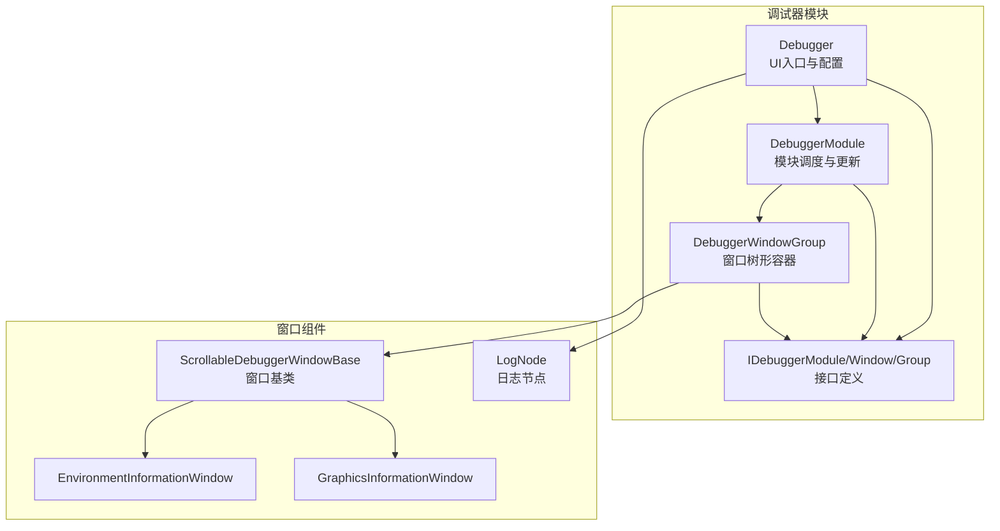
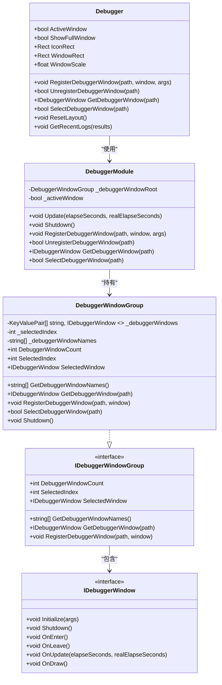
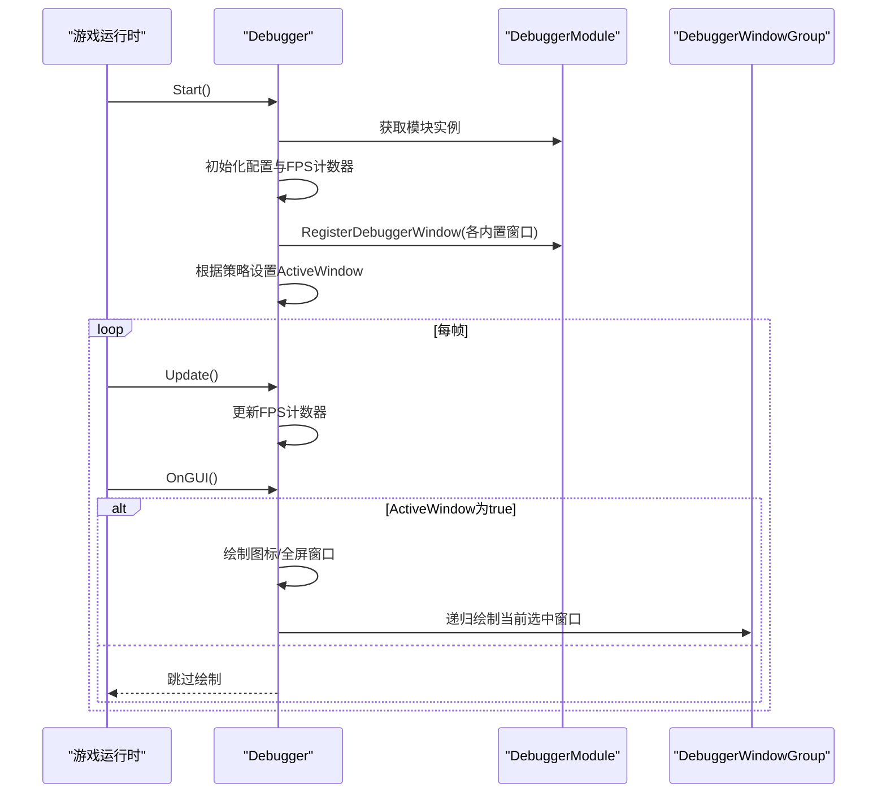
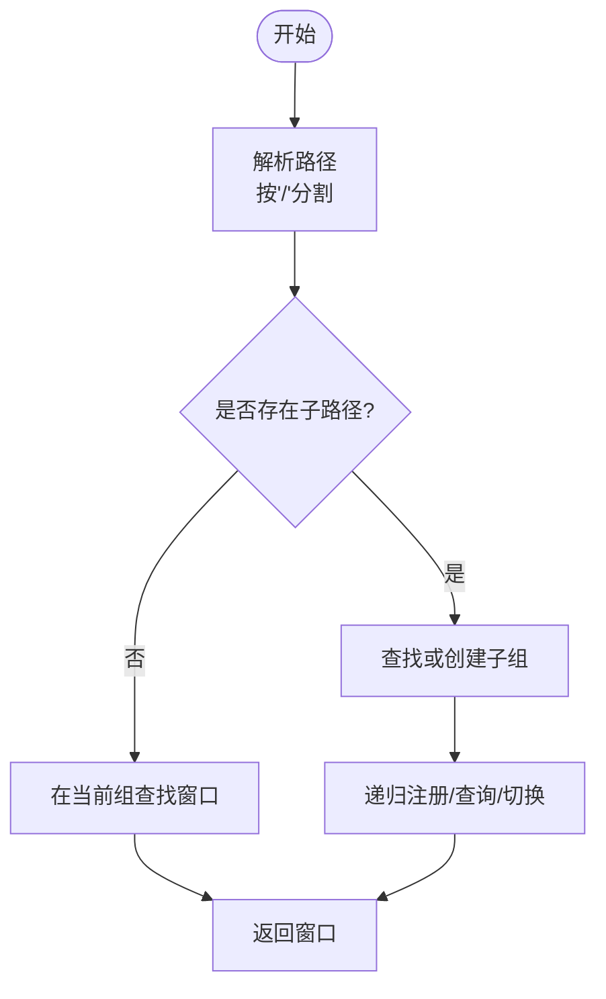
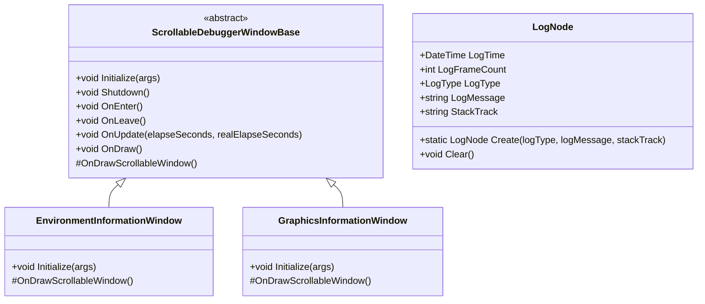
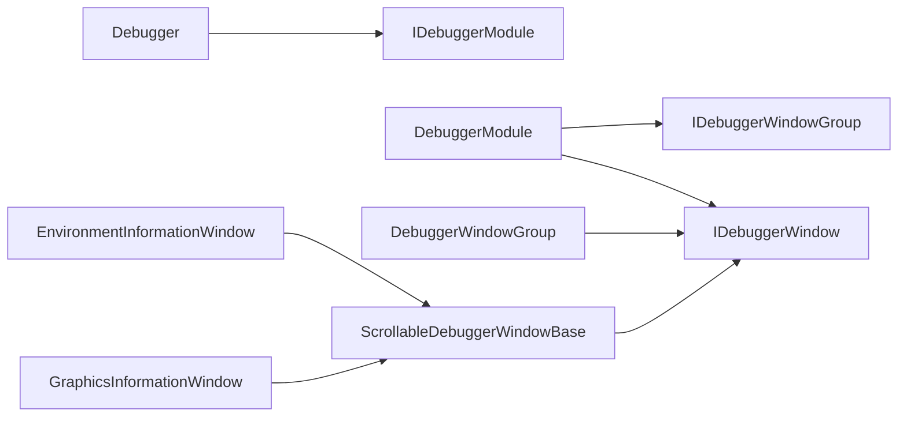

# 调试器架构设计

<cite>
**本文引用的文件**
- [Debugger.cs](file://Assets/TEngine/Runtime/Module/DebugerModule/Debugger.cs)
- [DebuggerModule.cs](file://Assets/TEngine/Runtime/Module/DebugerModule/DebuggerModule.cs)
- [DebuggerManager.DebuggerWindowGroup.cs](file://Assets/TEngine/Runtime/Module/DebugerModule/DebuggerManager.DebuggerWindowGroup.cs)
- [IDebuggerModule.cs](file://Assets/TEngine/Runtime/Module/DebugerModule/IDebuggerModule.cs)
- [IDebuggerWindow.cs](file://Assets/TEngine/Runtime/Module/DebugerModule/IDebuggerWindow.cs)
- [IDebuggerWindowGroup.cs](file://Assets/TEngine/Runtime/Module/DebugerModule/IDebuggerWindowGroup.cs)
- [DebuggerModule.ScrollableDebuggerWindowBase.cs](file://Assets/TEngine/Runtime/Module/DebugerModule/Component/DebuggerModule.ScrollableDebuggerWindowBase.cs)
- [DebuggerModule.EnvironmentInformationWindow.cs](file://Assets/TEngine/Runtime/Module/DebugerModule/Component/DebuggerModule.EnvironmentInformationWindow.cs)
- [DebuggerModule.GraphicsInformationWindow.cs](file://Assets/TEngine/Runtime/Module/DebugerModule/Component/DebuggerModule.GraphicsInformationWindow.cs)
- [DebuggerModule.LogNode.cs](file://Assets/TEngine/Runtime/Module/DebugerModule/Component/DebuggerModule.LogNode.cs)
</cite>

## 目录
1. [简介](#简介)
2. [项目结构](#项目结构)
3. [核心组件](#核心组件)
4. [架构总览](#架构总览)
5. [详细组件分析](#详细组件分析)
6. [依赖关系分析](#依赖关系分析)
7. [性能考量](#性能考量)
8. [故障排查指南](#故障排查指南)
9. [结论](#结论)
10. [附录：最佳实践与扩展指南](#附录最佳实践与扩展指南)

## 简介
本文件面向TEngine调试器模块，系统化阐述其整体架构设计与实现细节，重点覆盖以下方面：
- Debugger主控制器的设计理念与职责边界
- 调试器模块的接口体系（IDebuggerModule、IDebuggerWindow、IDebuggerWindowGroup）
- 调试窗口的组织结构与管理机制（树形分组、选择与切换、绘制流程）
- 生命周期管理（初始化、窗口注册、状态控制、销毁）
- 窗口树形结构设计（层级关系、路径解析、子组递归）
- 配置系统（窗口位置、尺寸、缩放、显示模式）
- 最佳实践与扩展指南

## 项目结构
调试器模块位于TEngine运行时模块的DebugerModule目录下，采用“接口 + 分层实现 + 组件化窗口”的结构组织：
- 接口层：IDebuggerModule、IDebuggerWindow、IDebuggerWindowGroup
- 核心控制器：Debugger（UI交互入口）、DebuggerModule（模块调度与更新）
- 窗口分组：DebuggerWindowGroup（树形窗口容器）
- 窗口基类：ScrollableDebuggerWindowBase（统一滚动窗口行为）
- 具体窗口：环境信息、图形信息、输入信息、内存统计、对象池、设置等

**图表来源**
- [Debugger.cs:11-429](file://Assets/TEngine/Runtime/Module/DebugerModule/Debugger.cs#L11-L429)
- [DebuggerModule.cs:8-116](file://Assets/TEngine/Runtime/Module/DebugerModule/DebuggerModule.cs#L8-L116)
- [DebuggerManager.DebuggerWindowGroup.cs:10-294](file://Assets/TEngine/Runtime/Module/DebugerModule/DebuggerManager.DebuggerWindowGroup.cs#L10-L294)
- [IDebuggerModule.cs:6-43](file://Assets/TEngine/Runtime/Module/DebugerModule/IDebuggerModule.cs#L6-L43)
- [IDebuggerWindow.cs:6-42](file://Assets/TEngine/Runtime/Module/DebugerModule/IDebuggerWindow.cs#L6-L42)
- [IDebuggerWindowGroup.cs:6-53](file://Assets/TEngine/Runtime/Module/DebugerModule/IDebuggerWindowGroup.cs#L6-L53)
- [DebuggerModule.ScrollableDebuggerWindowBase.cs](file://Assets/TEngine/Runtime/Module/DebugerModule/Component/DebuggerModule.ScrollableDebuggerWindowBase.cs)
- [DebuggerModule.EnvironmentInformationWindow.cs:10-72](file://Assets/TEngine/Runtime/Module/DebugerModule/Component/DebuggerModule.EnvironmentInformationWindow.cs#L10-L72)
- [DebuggerModule.GraphicsInformationWindow.cs:7-163](file://Assets/TEngine/Runtime/Module/DebugerModule/Component/DebuggerModule.GraphicsInformationWindow.cs#L7-L163)
- [DebuggerModule.LogNode.cs:11-118](file://Assets/TEngine/Runtime/Module/DebugerModule/Component/DebuggerModule.LogNode.cs#L11-L118)

**章节来源**
- [Debugger.cs:11-429](file://Assets/TEngine/Runtime/Module/DebugerModule/Debugger.cs#L11-L429)
- [DebuggerModule.cs:8-116](file://Assets/TEngine/Runtime/Module/DebugerModule/DebuggerModule.cs#L8-L116)
- [DebuggerManager.DebuggerWindowGroup.cs:10-294](file://Assets/TEngine/Runtime/Module/DebugerModule/DebuggerManager.DebuggerWindowGroup.cs#L10-L294)
- [IDebuggerModule.cs:6-43](file://Assets/TEngine/Runtime/Module/DebugerModule/IDebuggerModule.cs#L6-L43)
- [IDebuggerWindow.cs:6-42](file://Assets/TEngine/Runtime/Module/DebugerModule/IDebuggerWindow.cs#L6-L42)
- [IDebuggerWindowGroup.cs:6-53](file://Assets/TEngine/Runtime/Module/DebugerModule/IDebuggerWindowGroup.cs#L6-L53)
- [DebuggerModule.ScrollableDebuggerWindowBase.cs](file://Assets/TEngine/Runtime/Module/DebugerModule/Component/DebuggerModule.ScrollableDebuggerWindowBase.cs)
- [DebuggerModule.EnvironmentInformationWindow.cs:10-72](file://Assets/TEngine/Runtime/Module/DebugerModule/Component/DebuggerModule.EnvironmentInformationWindow.cs#L10-L72)
- [DebuggerModule.GraphicsInformationWindow.cs:7-163](file://Assets/TEngine/Runtime/Module/DebugerModule/Component/DebuggerModule.GraphicsInformationWindow.cs#L7-L163)
- [DebuggerModule.LogNode.cs:11-118](file://Assets/TEngine/Runtime/Module/DebugerModule/Component/DebuggerModule.LogNode.cs#L11-L118)

## 核心组件
- Debugger（主控制器）
  - 负责UI呈现（图标/全屏窗口）、配置持久化（位置、尺寸、缩放）、事件系统集成、FPS统计与日志聚合
  - 通过模块系统获取IDebuggerModule，委托窗口注册、选择、绘制等
- DebuggerModule（模块调度）
  - 实现IDebuggerModule，持有窗口根组DebuggerWindowGroup
  - 提供注册/注销/获取/选择窗口的统一入口，并在Update中转发到当前选中窗口
- DebuggerWindowGroup（窗口树）
  - 实现IDebuggerWindowGroup，维护窗口列表与当前选中索引
  - 支持嵌套分组（路径分隔符'/'），递归注册/查询/切换
- IDebuggerWindow/IDebuggerWindowGroup（接口）
  - 规范窗口生命周期（Initialize/Shutdown/OnEnter/OnLeave/OnUpdate/OnDraw）
  - 规范窗口组能力（数量、选中索引、名称集合、注册/查询/切换）

**章节来源**
- [Debugger.cs:86-142](file://Assets/TEngine/Runtime/Module/DebugerModule/Debugger.cs#L86-L142)
- [DebuggerModule.cs:31-40](file://Assets/TEngine/Runtime/Module/DebugerModule/DebuggerModule.cs#L31-L40)
- [DebuggerManager.DebuggerWindowGroup.cs:19-56](file://Assets/TEngine/Runtime/Module/DebugerModule/DebuggerManager.DebuggerWindowGroup.cs#L19-L56)
- [IDebuggerWindow.cs:6-42](file://Assets/TEngine/Runtime/Module/DebugerModule/IDebuggerWindow.cs#L6-L42)
- [IDebuggerWindowGroup.cs:6-53](file://Assets/TEngine/Runtime/Module/DebugerModule/IDebuggerWindowGroup.cs#L6-L53)

## 架构总览
调试器采用“控制器-模块-窗口组-窗口”的分层架构：
- Debugger作为UI入口，负责配置与绘制
- DebuggerModule作为业务调度者，负责模块生命周期与更新循环
- DebuggerWindowGroup作为树形容器，负责窗口注册、查询、选择与递归绘制
- 具体窗口继承ScrollableDebuggerWindowBase，统一滚动绘制行为

**图表来源**
- [Debugger.cs:86-142](file://Assets/TEngine/Runtime/Module/DebugerModule/Debugger.cs#L86-L142)
- [DebuggerModule.cs:8-116](file://Assets/TEngine/Runtime/Module/DebugerModule/DebuggerModule.cs#L8-L116)
- [DebuggerManager.DebuggerWindowGroup.cs:10-294](file://Assets/TEngine/Runtime/Module/DebugerModule/DebuggerManager.DebuggerWindowGroup.cs#L10-L294)
- [IDebuggerWindow.cs:6-42](file://Assets/TEngine/Runtime/Module/DebugerModule/IDebuggerWindow.cs#L6-L42)
- [IDebuggerWindowGroup.cs:6-53](file://Assets/TEngine/Runtime/Module/DebugerModule/IDebuggerWindowGroup.cs#L6-L53)

## 详细组件分析

### Debugger主控制器
- 职责
  - UI入口：图标模式与全屏模式切换；拖拽标题栏；绘制工具条与子窗口
  - 配置持久化：位置、尺寸、缩放比例；支持重置布局
  - 模块集成：通过模块系统获取IDebuggerModule，委托窗口管理
  - FPS统计与事件系统：集成UI事件系统开关，实时显示FPS
- 生命周期
  - Awake：单例初始化、文本编辑器初始化、查找事件系统
  - Start：初始化模块、注册内置窗口、根据策略自动打开
  - Update：更新FPS计数器
  - OnGUI：根据ActiveWindow与ShowFullWindow决定绘制图标或全屏窗口
  - OnDestroy：保存配置到PlayerPrefs

**图表来源**
- [Debugger.cs:148-266](file://Assets/TEngine/Runtime/Module/DebugerModule/Debugger.cs#L148-L266)
- [DebuggerModule.cs:45-53](file://Assets/TEngine/Runtime/Module/DebugerModule/DebuggerModule.cs#L45-L53)
- [DebuggerManager.DebuggerWindowGroup.cs:100-110](file://Assets/TEngine/Runtime/Module/DebugerModule/DebuggerManager.DebuggerWindowGroup.cs#L100-L110)

**章节来源**
- [Debugger.cs:86-142](file://Assets/TEngine/Runtime/Module/DebugerModule/Debugger.cs#L86-L142)
- [Debugger.cs:148-266](file://Assets/TEngine/Runtime/Module/DebugerModule/Debugger.cs#L148-L266)
- [Debugger.cs:338-419](file://Assets/TEngine/Runtime/Module/DebugerModule/Debugger.cs#L338-L419)

### DebuggerModule模块调度
- 职责
  - 暴露IDebuggerModule接口，持有窗口根组
  - 在Update中将更新事件转发给当前选中窗口
  - Shutdown时关闭所有窗口并清空列表
- 生命周期
  - OnInit：初始化根组与激活标志
  - Update：当ActiveWindow为true时调用根组OnUpdate
  - Shutdown：关闭并清理

**章节来源**
- [DebuggerModule.cs:16-62](file://Assets/TEngine/Runtime/Module/DebugerModule/DebuggerModule.cs#L16-L62)
- [DebuggerModule.cs:45-53](file://Assets/TEngine/Runtime/Module/DebugerModule/DebuggerModule.cs#L45-L53)

### DebuggerWindowGroup窗口树
- 设计要点
  - 使用键值对列表存储窗口，键为窗口名，值为IDebuggerWindow
  - 维护SelectedIndex与SelectedWindow，支持选中切换
  - 路径解析：以'/'分隔，支持多级嵌套分组
  - 递归注册/查询/注销：若目标为分组名则创建新组再递归
- 选择与切换
  - 通过工具条索引更新SelectedIndex
  - 切换时触发OnLeave/OnEnter，确保窗口生命周期正确
- 绘制
  - 递归绘制子组与当前选中窗口
  - 根组额外提供“关闭”按钮

**图表来源**
- [DebuggerManager.DebuggerWindowGroup.cs:135-186](file://Assets/TEngine/Runtime/Module/DebugerModule/DebuggerManager.DebuggerWindowGroup.cs#L135-L186)
- [DebuggerManager.DebuggerWindowGroup.cs:193-230](file://Assets/TEngine/Runtime/Module/DebugerModule/DebuggerManager.DebuggerWindowGroup.cs#L193-L230)

**章节来源**
- [DebuggerManager.DebuggerWindowGroup.cs:19-56](file://Assets/TEngine/Runtime/Module/DebugerModule/DebuggerManager.DebuggerWindowGroup.cs#L19-L56)
- [DebuggerManager.DebuggerWindowGroup.cs:135-186](file://Assets/TEngine/Runtime/Module/DebugerModule/DebuggerManager.DebuggerWindowGroup.cs#L135-L186)
- [DebuggerManager.DebuggerWindowGroup.cs:193-230](file://Assets/TEngine/Runtime/Module/DebugerModule/DebuggerManager.DebuggerWindowGroup.cs#L193-L230)

### 窗口基类与具体窗口
- ScrollableDebuggerWindowBase
  - 统一滚动窗口绘制流程，派生窗口只需实现具体面板内容
- 具体窗口示例
  - 环境信息窗口：展示产品、平台、版本、帧率等信息
  - 图形信息窗口：展示显卡、着色器等级、特性支持等
  - 日志节点：封装日志时间、帧号、类型、消息与堆栈，支持内存池复用

**图表来源**
- [DebuggerModule.ScrollableDebuggerWindowBase.cs](file://Assets/TEngine/Runtime/Module/DebugerModule/Component/DebuggerModule.ScrollableDebuggerWindowBase.cs)
- [DebuggerModule.EnvironmentInformationWindow.cs:10-72](file://Assets/TEngine/Runtime/Module/DebugerModule/Component/DebuggerModule.EnvironmentInformationWindow.cs#L10-L72)
- [DebuggerModule.GraphicsInformationWindow.cs:7-163](file://Assets/TEngine/Runtime/Module/DebugerModule/Component/DebuggerModule.GraphicsInformationWindow.cs#L7-L163)
- [DebuggerModule.LogNode.cs:11-118](file://Assets/TEngine/Runtime/Module/DebugerModule/Component/DebuggerModule.LogNode.cs#L11-L118)

**章节来源**
- [DebuggerModule.ScrollableDebuggerWindowBase.cs](file://Assets/TEngine/Runtime/Module/DebugerModule/Component/DebuggerModule.ScrollableDebuggerWindowBase.cs)
- [DebuggerModule.EnvironmentInformationWindow.cs:10-72](file://Assets/TEngine/Runtime/Module/DebugerModule/Component/DebuggerModule.EnvironmentInformationWindow.cs#L10-L72)
- [DebuggerModule.GraphicsInformationWindow.cs:7-163](file://Assets/TEngine/Runtime/Module/DebugerModule/Component/DebuggerModule.GraphicsInformationWindow.cs#L7-L163)
- [DebuggerModule.LogNode.cs:11-118](file://Assets/TEngine/Runtime/Module/DebugerModule/Component/DebuggerModule.LogNode.cs#L11-L118)

## 依赖关系分析
- Debugger依赖
  - 模块系统：获取IDebuggerModule
  - PlayerPref：读取/保存窗口位置、尺寸、缩放
  - UI事件系统：根据显示模式启用/禁用
- DebuggerModule依赖
  - DebuggerWindowGroup：窗口容器
  - IDebuggerWindow：窗口接口
- 窗口依赖
  - ScrollableDebuggerWindowBase：统一绘制基类
  - 各窗口依赖Unity API（如SystemInfo、Application）输出信息

**图表来源**
- [Debugger.cs:161-181](file://Assets/TEngine/Runtime/Module/DebugerModule/Debugger.cs#L161-L181)
- [DebuggerModule.cs:10-20](file://Assets/TEngine/Runtime/Module/DebugerModule/DebuggerModule.cs#L10-L20)
- [DebuggerManager.DebuggerWindowGroup.cs:10-25](file://Assets/TEngine/Runtime/Module/DebugerModule/DebuggerManager.DebuggerWindowGroup.cs#L10-L25)
- [IDebuggerWindow.cs:6-42](file://Assets/TEngine/Runtime/Module/DebugerModule/IDebuggerWindow.cs#L6-L42)
- [IDebuggerWindowGroup.cs:6-53](file://Assets/TEngine/Runtime/Module/DebugerModule/IDebuggerWindowGroup.cs#L6-L53)
- [DebuggerModule.ScrollableDebuggerWindowBase.cs](file://Assets/TEngine/Runtime/Module/DebugerModule/Component/DebuggerModule.ScrollableDebuggerWindowBase.cs)
- [DebuggerModule.EnvironmentInformationWindow.cs:10-72](file://Assets/TEngine/Runtime/Module/DebugerModule/Component/DebuggerModule.EnvironmentInformationWindow.cs#L10-L72)
- [DebuggerModule.GraphicsInformationWindow.cs:7-163](file://Assets/TEngine/Runtime/Module/DebugerModule/Component/DebuggerModule.GraphicsInformationWindow.cs#L7-L163)

**章节来源**
- [Debugger.cs:161-181](file://Assets/TEngine/Runtime/Module/DebugerModule/Debugger.cs#L161-L181)
- [DebuggerModule.cs:10-20](file://Assets/TEngine/Runtime/Module/DebugerModule/DebuggerModule.cs#L10-L20)
- [DebuggerManager.DebuggerWindowGroup.cs:10-25](file://Assets/TEngine/Runtime/Module/DebugerModule/DebuggerManager.DebuggerWindowGroup.cs#L10-L25)

## 性能考量
- 更新频率
  - DebuggerModule仅在ActiveWindow为true时转发Update，避免无意义调用
- 绘制优化
  - 使用缩放矩阵统一缩放，减少重复计算
  - 工具条切换时仅触发当前窗口OnLeave/OnEnter，降低频繁刷新成本
- 内存管理
  - 日志节点通过内存池复用，减少GC压力
- I/O与持久化
  - PlayerPref读写集中在Awake/OnDestroy，避免每帧IO

[本节为通用指导，不直接分析具体文件]

## 故障排查指南
- 调试器不显示
  - 检查ActiveWindowType策略与当前构建环境是否匹配
  - 确认模块系统已正确注册IDebuggerModule
- 窗口无法切换
  - 检查路径是否正确（包含'/'的嵌套路径需逐级存在）
  - 确认窗口已注册且未被注销
- 窗口布局异常
  - 使用ResetLayout恢复默认位置与缩放
  - 检查PlayerPrefs中相关键值是否被意外修改
- FPS统计不更新
  - 确认Update中FPS计数器正常更新
  - 检查事件系统是否被意外禁用

**章节来源**
- [Debugger.cs:217-235](file://Assets/TEngine/Runtime/Module/DebugerModule/Debugger.cs#L217-L235)
- [Debugger.cs:312-317](file://Assets/TEngine/Runtime/Module/DebugerModule/Debugger.cs#L312-L317)
- [DebuggerModule.cs:45-53](file://Assets/TEngine/Runtime/Module/DebugerModule/DebuggerModule.cs#L45-L53)

## 结论
TEngine调试器模块通过清晰的接口分层与树形窗口组织，实现了可扩展、易维护的调试可视化系统。主控制器负责UI与配置，模块调度负责生命周期与更新，窗口组负责树形管理与递归绘制。该架构便于新增窗口类型、扩展显示模式与优化性能。

[本节为总结性内容，不直接分析具体文件]

## 附录：最佳实践与扩展指南
- 新增调试窗口
  - 继承ScrollableDebuggerWindowBase，实现OnDrawScrollableWindow
  - 在Start中通过RegisterDebuggerWindow注册，路径建议采用“分组/窗口名”
- 窗口生命周期
  - 在Initialize中完成一次性初始化，在Shutdown中释放资源
  - 在OnEnter/OnLeave中处理焦点与订阅事件
- 状态与配置
  - 使用PlayerPrefs保存窗口位置、尺寸、缩放，提供ResetLayout
  - 通过ActiveWindowType策略控制显示时机
- 扩展建议
  - 将常用信息抽象为可配置项，支持动态刷新
  - 引入过滤与搜索功能，提升大面板可读性
  - 对高频刷新面板增加采样间隔，平衡信息密度与性能

[本节为通用指导，不直接分析具体文件]