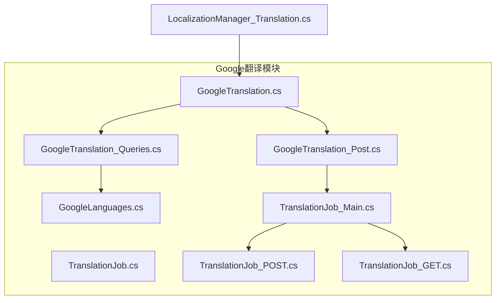
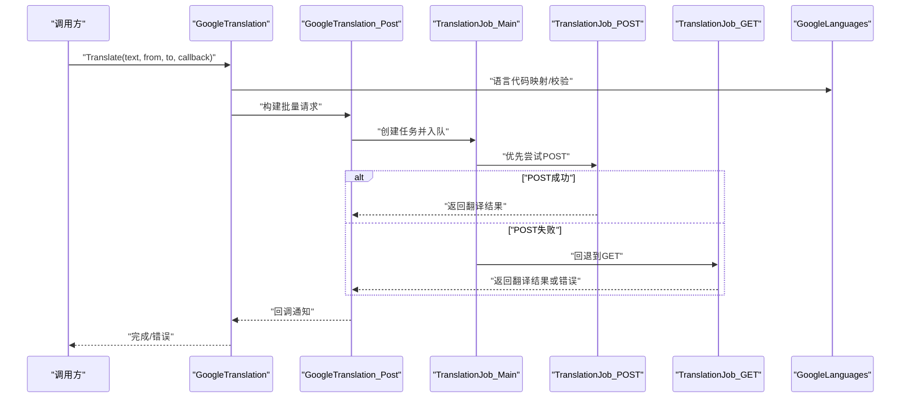
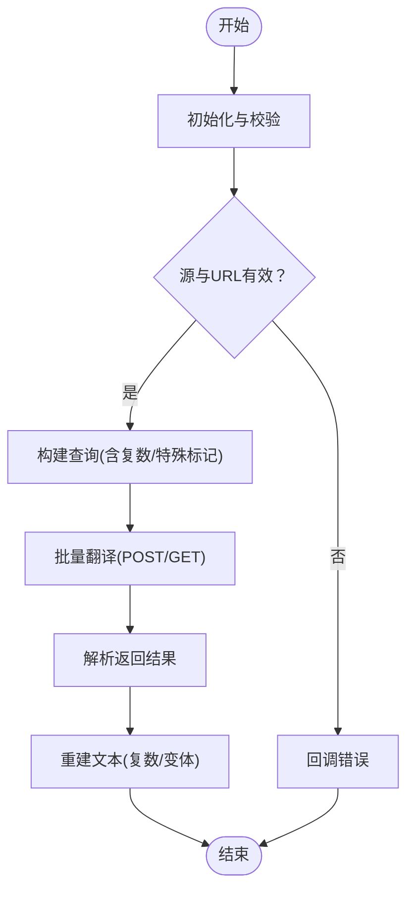
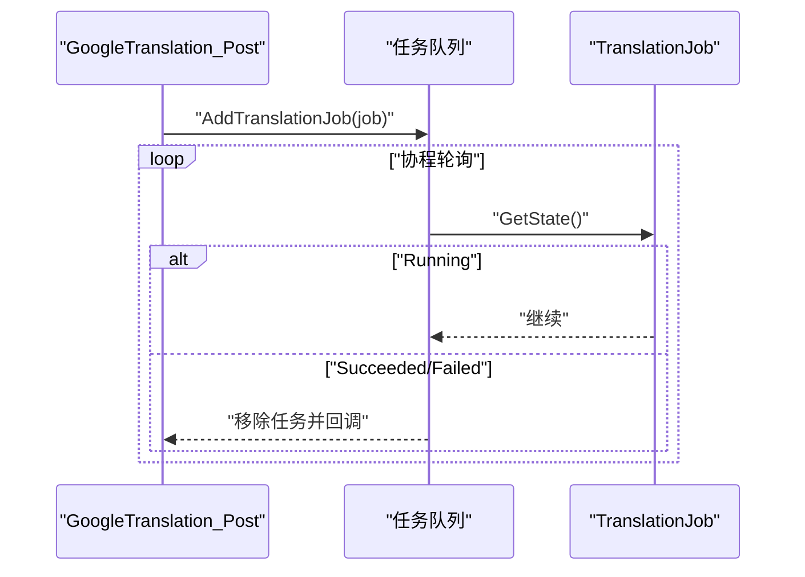
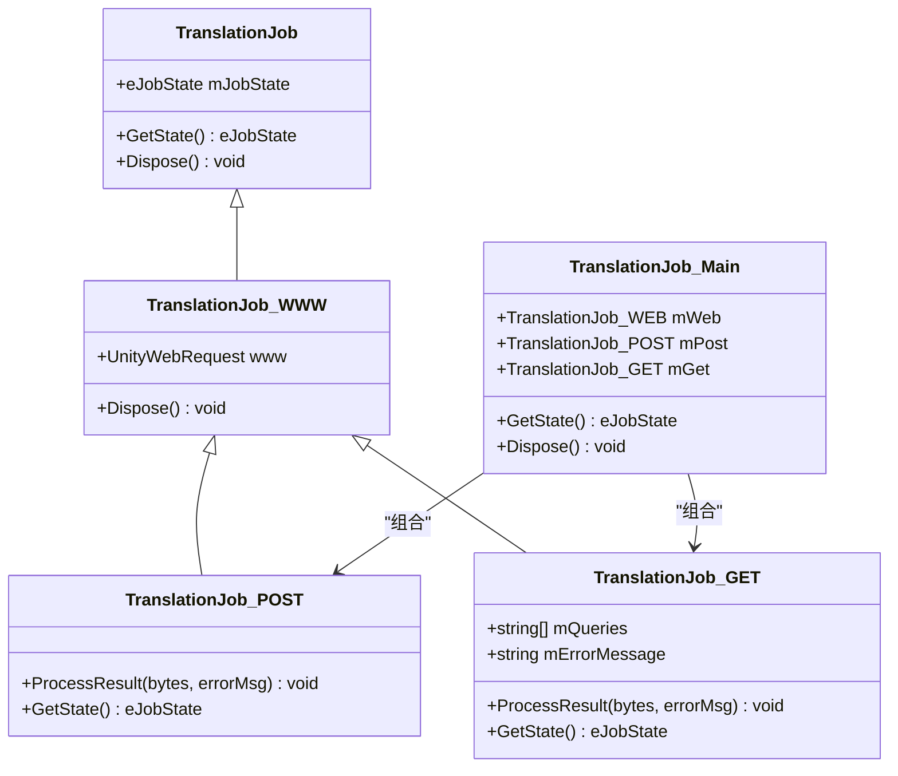
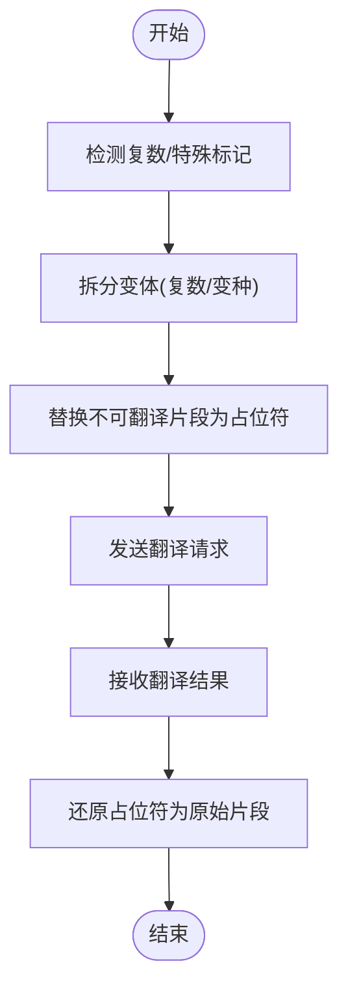
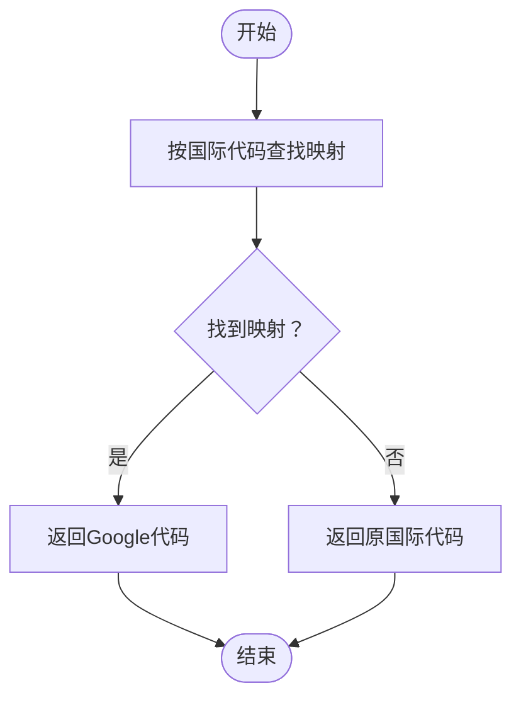
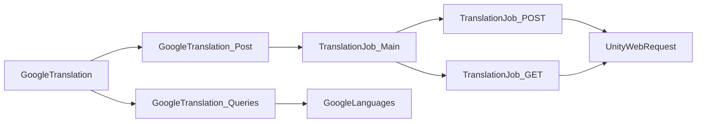

# Google翻译集成

<cite>
**本文档引用的文件**
- [GoogleTranslation.cs](file://Assets/TEngine/Runtime/Module/LocalizationModule/Core/Google/GoogleTranslation.cs)
- [GoogleTranslation_Post.cs](file://Assets/TEngine/Runtime/Module/LocalizationModule/Core/Google/GoogleTranslation_Post.cs)
- [GoogleTranslation_Queries.cs](file://Assets/TEngine/Runtime/Module/LocalizationModule/Core/Google/GoogleTranslation_Queries.cs)
- [GoogleLanguages.cs](file://Assets/TEngine/Runtime/Module/LocalizationModule/Core/Google/GoogleLanguages.cs)
- [TranslationJob.cs](file://Assets/TEngine/Runtime/Module/LocalizationModule/Core/Google/TranslationJob.cs)
- [TranslationJob_Main.cs](file://Assets/TEngine/Runtime/Module/LocalizationModule/Core/Google/TranslationJob_Main.cs)
- [TranslationJob_POST.cs](file://Assets/TEngine/Runtime/Module/LocalizationModule/Core/Google/TranslationJob_POST.cs)
- [TranslationJob_GET.cs](file://Assets/TEngine/Runtime/Module/LocalizationModule/Core/Google/TranslationJob_GET.cs)
- [LocalizationManager_Translation.cs](file://Assets/TEngine/Runtime/Module/LocalizationModule/Core/Manager/LocalizationManager_Translation.cs)
</cite>

## 目录
1. [简介](#简介)
2. [项目结构](#项目结构)
3. [核心组件](#核心组件)
4. [架构总览](#架构总览)
5. [详细组件分析](#详细组件分析)
6. [依赖关系分析](#依赖关系分析)
7. [性能考虑](#性能考虑)
8. [故障排除指南](#故障排除指南)
9. [结论](#结论)
10. [附录](#附录)

## 简介
本文件面向希望在Unity项目中集成Google翻译服务的开发者，系统性地解析TEngine中的Google翻译模块实现，涵盖API调用封装、请求队列管理、错误处理机制、翻译任务工作流（创建、批量处理、进度跟踪、结果回调）、语言支持与检测（语言列表、代码映射、自动检测）、以及实际使用示例与最佳实践（网络异常处理、重试机制、配额管理）。文档以循序渐进的方式呈现，既适合初学者快速上手，也为高级用户提供深入的技术细节。

## 项目结构
Google翻译相关代码位于TEngine本地化模块的Google子目录下，围绕翻译查询构建、任务调度、网络传输与结果解析展开，并通过LocalizationManager进行统一的本地化管理。

**图表来源**
- [GoogleTranslation.cs:1-87](file://Assets/TEngine/Runtime/Module/LocalizationModule/Core/Google/GoogleTranslation.cs#L1-L87)
- [GoogleTranslation_Post.cs:1-176](file://Assets/TEngine/Runtime/Module/LocalizationModule/Core/Google/GoogleTranslation_Post.cs#L1-L176)
- [GoogleTranslation_Queries.cs:1-376](file://Assets/TEngine/Runtime/Module/LocalizationModule/Core/Google/GoogleTranslation_Queries.cs#L1-L376)
- [GoogleLanguages.cs:1-648](file://Assets/TEngine/Runtime/Module/LocalizationModule/Core/Google/GoogleLanguages.cs#L1-L648)
- [TranslationJob.cs:1-34](file://Assets/TEngine/Runtime/Module/LocalizationModule/Core/Google/TranslationJob.cs#L1-L34)
- [TranslationJob_Main.cs:1-102](file://Assets/TEngine/Runtime/Module/LocalizationModule/Core/Google/TranslationJob_Main.cs#L1-L102)
- [TranslationJob_POST.cs:1-60](file://Assets/TEngine/Runtime/Module/LocalizationModule/Core/Google/TranslationJob_POST.cs#L1-L60)
- [TranslationJob_GET.cs:1-79](file://Assets/TEngine/Runtime/Module/LocalizationModule/Core/Google/TranslationJob_GET.cs#L1-L79)
- [LocalizationManager_Translation.cs:1-226](file://Assets/TEngine/Runtime/Module/LocalizationModule/Core/Manager/LocalizationManager_Translation.cs#L1-L226)

**章节来源**
- [GoogleTranslation.cs:1-87](file://Assets/TEngine/Runtime/Module/LocalizationModule/Core/Google/GoogleTranslation.cs#L1-L87)
- [GoogleTranslation_Post.cs:1-176](file://Assets/TEngine/Runtime/Module/LocalizationModule/Core/Google/GoogleTranslation_Post.cs#L1-L176)
- [GoogleTranslation_Queries.cs:1-376](file://Assets/TEngine/Runtime/Module/LocalizationModule/Core/Google/GoogleTranslation_Queries.cs#L1-L376)
- [GoogleLanguages.cs:1-648](file://Assets/TEngine/Runtime/Module/LocalizationModule/Core/Google/GoogleLanguages.cs#L1-L648)
- [TranslationJob.cs:1-34](file://Assets/TEngine/Runtime/Module/LocalizationModule/Core/Google/TranslationJob.cs#L1-L34)
- [TranslationJob_Main.cs:1-102](file://Assets/TEngine/Runtime/Module/LocalizationModule/Core/Google/TranslationJob_Main.cs#L1-L102)
- [TranslationJob_POST.cs:1-60](file://Assets/TEngine/Runtime/Module/LocalizationModule/Core/Google/TranslationJob_POST.cs#L1-L60)
- [TranslationJob_GET.cs:1-79](file://Assets/TEngine/Runtime/Module/LocalizationModule/Core/Google/TranslationJob_GET.cs#L1-L79)
- [LocalizationManager_Translation.cs:1-226](file://Assets/TEngine/Runtime/Module/LocalizationModule/Core/Manager/LocalizationManager_Translation.cs#L1-L226)

## 核心组件
- GoogleTranslation：对外API入口，负责参数校验、查询构建、异步/同步翻译调用、结果重建与回调。
- GoogleTranslation_Post：批量翻译与队列管理，封装HTTP请求（POST/GET），处理返回结果解析与错误恢复。
- GoogleTranslation_Queries：翻译查询构建与解析，支持复数规则、特殊标记（不可翻译片段）、参数占位符等。
- GoogleLanguages：语言支持与映射，提供语言代码转换、名称格式化、复数规则判定等。
- TranslationJob家族：任务抽象与具体实现，支持POST/GET两种传输方式，具备状态机与失败回退逻辑。
- LocalizationManager：本地化管理器，提供Web服务URL、语言源访问等基础能力。

**章节来源**
- [GoogleTranslation.cs:11-87](file://Assets/TEngine/Runtime/Module/LocalizationModule/Core/Google/GoogleTranslation.cs#L11-L87)
- [GoogleTranslation_Post.cs:20-176](file://Assets/TEngine/Runtime/Module/LocalizationModule/Core/Google/GoogleTranslation_Post.cs#L20-L176)
- [GoogleTranslation_Queries.cs:22-376](file://Assets/TEngine/Runtime/Module/LocalizationModule/Core/Google/GoogleTranslation_Queries.cs#L22-L376)
- [GoogleLanguages.cs:9-648](file://Assets/TEngine/Runtime/Module/LocalizationModule/Core/Google/GoogleLanguages.cs#L9-L648)
- [TranslationJob.cs:10-34](file://Assets/TEngine/Runtime/Module/LocalizationModule/Core/Google/TranslationJob.cs#L10-L34)
- [TranslationJob_Main.cs:7-102](file://Assets/TEngine/Runtime/Module/LocalizationModule/Core/Google/TranslationJob_Main.cs#L7-L102)
- [TranslationJob_POST.cs:10-60](file://Assets/TEngine/Runtime/Module/LocalizationModule/Core/Google/TranslationJob_POST.cs#L10-L60)
- [TranslationJob_GET.cs:9-79](file://Assets/TEngine/Runtime/Module/LocalizationModule/Core/Google/TranslationJob_GET.cs#L9-L79)
- [LocalizationManager_Translation.cs:9-226](file://Assets/TEngine/Runtime/Module/LocalizationModule/Core/Manager/LocalizationManager_Translation.cs#L9-L226)

## 架构总览
Google翻译模块采用“查询构建-任务调度-网络传输-结果解析”的分层设计。GoogleTranslation作为门面，将用户输入文本与目标语言映射为内部查询对象；GoogleTranslation_Post负责批量请求与队列管理；TranslationJob_Main协调POST/GET两种传输策略并实现失败回退；GoogleTranslation_Post解析返回内容并重建最终文本；GoogleLanguages提供语言代码映射与复数规则支持；LocalizationManager提供Web服务地址与本地化上下文。

**图表来源**
- [GoogleTranslation.cs:21-59](file://Assets/TEngine/Runtime/Module/LocalizationModule/Core/Google/GoogleTranslation.cs#L21-L59)
- [GoogleTranslation_Post.cs:22-44](file://Assets/TEngine/Runtime/Module/LocalizationModule/Core/Google/GoogleTranslation_Post.cs#L22-L44)
- [TranslationJob_Main.cs:17-92](file://Assets/TEngine/Runtime/Module/LocalizationModule/Core/Google/TranslationJob_Main.cs#L17-L92)
- [TranslationJob_POST.cs:15-58](file://Assets/TEngine/Runtime/Module/LocalizationModule/Core/Google/TranslationJob_POST.cs#L15-L58)
- [TranslationJob_GET.cs:16-77](file://Assets/TEngine/Runtime/Module/LocalizationModule/Core/Google/TranslationJob_GET.cs#L16-L77)
- [GoogleLanguages.cs:127-138](file://Assets/TEngine/Runtime/Module/LocalizationModule/Core/Google/GoogleLanguages.cs#L127-L138)

## 详细组件分析

### GoogleTranslation：翻译门面与工作流
- 功能要点
  - 参数校验与环境初始化：检查本地化源与Web服务URL可用性。
  - 同步/异步切换：对简单场景提供阻塞式ForceTranslate，推荐使用异步Translate。
  - 查询构建：将输入文本拆分为多个TranslationQuery，支持复数变体与特殊标记。
  - 结果重建：根据原始文本结构与复数规则重建最终翻译。
- 关键路径
  - 异步翻译：Translate → CreateQueries → Translate(批量) → ParseTranslationResult → RebuildTranslation → 回调。
  - 同步翻译：ForceTranslate → TranslationJob_Main轮询状态 → GetQueryResult。

**图表来源**
- [GoogleTranslation.cs:21-81](file://Assets/TEngine/Runtime/Module/LocalizationModule/Core/Google/GoogleTranslation.cs#L21-L81)
- [GoogleTranslation_Queries.cs:24-68](file://Assets/TEngine/Runtime/Module/LocalizationModule/Core/Google/GoogleTranslation_Queries.cs#L24-L68)
- [GoogleTranslation_Post.cs:111-154](file://Assets/TEngine/Runtime/Module/LocalizationModule/Core/Google/GoogleTranslation_Post.cs#L111-L154)

**章节来源**
- [GoogleTranslation.cs:11-87](file://Assets/TEngine/Runtime/Module/LocalizationModule/Core/Google/GoogleTranslation.cs#L11-L87)
- [GoogleTranslation_Queries.cs:22-376](file://Assets/TEngine/Runtime/Module/LocalizationModule/Core/Google/GoogleTranslation_Queries.cs#L22-L376)

### GoogleTranslation_Post：批量请求与队列管理
- 功能要点
  - 批量请求构建：将多个查询序列化为多段请求，支持GET长度限制与分片。
  - 队列管理：维护当前翻译任务列表，协程轮询任务状态直至完成。
  - 错误处理：识别Google服务返回的脚本限制、超频提示等，区分可重试与不可重试错误。
  - 结果解析：按分隔符拆分结果，还原不可翻译片段与标题大小写。
- 关键路径
  - AddTranslationJob → WaitForTranslations → 逐个检查任务状态 → 回调通知。

**图表来源**
- [GoogleTranslation_Post.cs:86-107](file://Assets/TEngine/Runtime/Module/LocalizationModule/Core/Google/GoogleTranslation_Post.cs#L86-L107)
- [GoogleTranslation_Post.cs:157-170](file://Assets/TEngine/Runtime/Module/LocalizationModule/Core/Google/GoogleTranslation_Post.cs#L157-L170)

**章节来源**
- [GoogleTranslation_Post.cs:20-176](file://Assets/TEngine/Runtime/Module/LocalizationModule/Core/Google/GoogleTranslation_Post.cs#L20-L176)

### TranslationJob家族：任务状态与回退策略
- TranslationJob：抽象任务基类，定义状态枚举与生命周期方法。
- TranslationJob_WWW：继承自TranslationJob，持有UnityWebRequest实例。
- TranslationJob_Main：组合POST/GET任务，实现失败回退与最终回调。
- TranslationJob_POST：使用UnityWebRequest.Post发送批量请求。
- TranslationJob_GET：使用UnityWebRequest.Get分段发送请求，支持错误累积。

**图表来源**
- [TranslationJob.cs:10-34](file://Assets/TEngine/Runtime/Module/LocalizationModule/Core/Google/TranslationJob.cs#L10-L34)
- [TranslationJob_Main.cs:7-102](file://Assets/TEngine/Runtime/Module/LocalizationModule/Core/Google/TranslationJob_Main.cs#L7-L102)
- [TranslationJob_POST.cs:10-60](file://Assets/TEngine/Runtime/Module/LocalizationModule/Core/Google/TranslationJob_POST.cs#L10-L60)
- [TranslationJob_GET.cs:9-79](file://Assets/TEngine/Runtime/Module/LocalizationModule/Core/Google/TranslationJob_GET.cs#L9-L79)

**章节来源**
- [TranslationJob.cs:10-34](file://Assets/TEngine/Runtime/Module/LocalizationModule/Core/Google/TranslationJob.cs#L10-L34)
- [TranslationJob_Main.cs:17-92](file://Assets/TEngine/Runtime/Module/LocalizationModule/Core/Google/TranslationJob_Main.cs#L17-L92)
- [TranslationJob_POST.cs:15-58](file://Assets/TEngine/Runtime/Module/LocalizationModule/Core/Google/TranslationJob_POST.cs#L15-L58)
- [TranslationJob_GET.cs:16-77](file://Assets/TEngine/Runtime/Module/LocalizationModule/Core/Google/TranslationJob_GET.cs#L16-L77)

### GoogleTranslation_Queries：查询构建与复数/特殊标记
- 功能要点
  - 复数规则：根据目标语言的复数规则生成多个变体查询，确保翻译覆盖不同数量级。
  - 特殊标记：识别不可翻译片段（如参数占位符、特定标签）并用占位符替换，避免被翻译。
  - 文本重建：在结果返回后，将占位符还原为原始片段，保持原文结构。
- 关键路径
  - CreateQueries → CreateQueries_Plurals → AddQuery → ParseNonTranslatableElements → RebuildTranslation。

**图表来源**
- [GoogleTranslation_Queries.cs:24-68](file://Assets/TEngine/Runtime/Module/LocalizationModule/Core/Google/GoogleTranslation_Queries.cs#L24-L68)
- [GoogleTranslation_Queries.cs:201-252](file://Assets/TEngine/Runtime/Module/LocalizationModule/Core/Google/GoogleTranslation_Queries.cs#L201-L252)
- [GoogleTranslation_Queries.cs:273-337](file://Assets/TEngine/Runtime/Module/LocalizationModule/Core/Google/GoogleTranslation_Queries.cs#L273-L337)

**章节来源**
- [GoogleTranslation_Queries.cs:12-376](file://Assets/TEngine/Runtime/Module/LocalizationModule/Core/Google/GoogleTranslation_Queries.cs#L12-L376)

### GoogleLanguages：语言支持与检测
- 功能要点
  - 语言代码映射：提供国际标准代码与Google支持代码之间的映射，部分语言返回null表示不支持。
  - 名称格式化：将带区域码的语言名格式化为更易读的形式。
  - 复数规则：根据语言代码返回复数规则编号，用于生成正确的复数变体。
  - 下拉列表：支持过滤与排序，便于UI选择语言。
- 关键路径
  - GetGoogleLanguageCode → mLanguageDef查找 → 返回映射代码或原代码。

**图表来源**
- [GoogleLanguages.cs:127-138](file://Assets/TEngine/Runtime/Module/LocalizationModule/Core/Google/GoogleLanguages.cs#L127-L138)
- [GoogleLanguages.cs:191-465](file://Assets/TEngine/Runtime/Module/LocalizationModule/Core/Google/GoogleLanguages.cs#L191-L465)

**章节来源**
- [GoogleLanguages.cs:9-648](file://Assets/TEngine/Runtime/Module/LocalizationModule/Core/Google/GoogleLanguages.cs#L9-L648)

### LocalizationManager：本地化上下文与Web服务
- 功能要点
  - 提供GetWebServiceURL用于获取Google翻译Web服务地址。
  - 支持本地化资源加载、术语查询、应用名获取等。
- 关键路径
  - GoogleTranslation调用LocalizationManager.GetWebServiceURL获取服务端点。

**章节来源**
- [LocalizationManager_Translation.cs:9-226](file://Assets/TEngine/Runtime/Module/LocalizationModule/Core/Manager/LocalizationManager_Translation.cs#L9-L226)
- [GoogleTranslation.cs:23-28](file://Assets/TEngine/Runtime/Module/LocalizationModule/Core/Google/GoogleTranslation.cs#L23-L28)

## 依赖关系分析
- 模块内依赖
  - GoogleTranslation依赖GoogleTranslation_Post与GoogleTranslation_Queries进行批量处理与查询构建。
  - GoogleTranslation_Post依赖TranslationJob_Main/POST/GET执行网络请求与状态管理。
  - GoogleTranslation_Queries依赖GoogleLanguages进行语言代码映射与复数规则判断。
  - TranslationJob_Main依赖UnityWebRequest进行HTTP通信。
- 外部依赖
  - UnityWebRequest：用于POST/GET请求。
  - 正则表达式：用于解析特殊标记与参数。
  - 字符串编码：UTF-8解码响应数据。

**图表来源**
- [GoogleTranslation.cs:1-87](file://Assets/TEngine/Runtime/Module/LocalizationModule/Core/Google/GoogleTranslation.cs#L1-L87)
- [GoogleTranslation_Post.cs:1-176](file://Assets/TEngine/Runtime/Module/LocalizationModule/Core/Google/GoogleTranslation_Post.cs#L1-L176)
- [GoogleTranslation_Queries.cs:1-376](file://Assets/TEngine/Runtime/Module/LocalizationModule/Core/Google/GoogleTranslation_Queries.cs#L1-L376)
- [GoogleLanguages.cs:1-648](file://Assets/TEngine/Runtime/Module/LocalizationModule/Core/Google/GoogleLanguages.cs#L1-L648)
- [TranslationJob_POST.cs:1-60](file://Assets/TEngine/Runtime/Module/LocalizationModule/Core/Google/TranslationJob_POST.cs#L1-L60)
- [TranslationJob_GET.cs:1-79](file://Assets/TEngine/Runtime/Module/LocalizationModule/Core/Google/TranslationJob_GET.cs#L1-L79)

**章节来源**
- [GoogleTranslation.cs:1-87](file://Assets/TEngine/Runtime/Module/LocalizationModule/Core/Google/GoogleTranslation.cs#L1-L87)
- [GoogleTranslation_Post.cs:1-176](file://Assets/TEngine/Runtime/Module/LocalizationModule/Core/Google/GoogleTranslation_Post.cs#L1-L176)
- [GoogleTranslation_Queries.cs:1-376](file://Assets/TEngine/Runtime/Module/LocalizationModule/Core/Google/GoogleTranslation_Queries.cs#L1-L376)
- [GoogleLanguages.cs:1-648](file://Assets/TEngine/Runtime/Module/LocalizationModule/Core/Google/GoogleLanguages.cs#L1-L648)
- [TranslationJob_POST.cs:1-60](file://Assets/TEngine/Runtime/Module/LocalizationModule/Core/Google/TranslationJob_POST.cs#L1-L60)
- [TranslationJob_GET.cs:1-79](file://Assets/TEngine/Runtime/Module/LocalizationModule/Core/Google/TranslationJob_GET.cs#L1-L79)

## 性能考虑
- 请求批量化：通过ConvertTranslationRequest将多个查询合并为单次请求，减少网络往返。
- GET分片：当GET请求过长时自动分片，避免URL超限。
- 失败回退：POST失败自动回退至GET，提升成功率。
- 协程轮询：使用协程管理任务队列，避免主线程阻塞。
- 缓存策略：建议在业务层对常用短句进行本地缓存，减少重复请求。
- 并发控制：合理设置并发度，避免触发Google服务限流。

[本节为通用性能建议，无需特定文件引用]

## 故障排除指南
- Web服务未配置
  - 现象：翻译直接回调错误。
  - 排查：确认LocalizationManager.GetWebServiceURL返回有效URL。
  - 参考路径：[GoogleTranslation.cs:23-28](file://Assets/TEngine/Runtime/Module/LocalizationModule/Core/Google/GoogleTranslation.cs#L23-L28)
- Google服务限制
  - 现象：返回HTML页面或包含“脚本完成但无返回”、“短时间内调用过多”等提示。
  - 处理：等待一段时间后重试，或降低请求频率。
  - 参考路径：[GoogleTranslation_Post.cs:115-122](file://Assets/TEngine/Runtime/Module/LocalizationModule/Core/Google/GoogleTranslation_Post.cs#L115-L122)
- 语言不支持
  - 现象：GetGoogleLanguageCode返回null。
  - 处理：使用备选语言或跳过该条目。
  - 参考路径：[GoogleLanguages.cs:132-134](file://Assets/TEngine/Runtime/Module/LocalizationModule/Core/Google/GoogleLanguages.cs#L132-L134)
- 结果为空
  - 现象：ParseTranslationResult返回空字符串或忽略错误。
  - 处理：检查输入文本是否包含不可翻译片段导致解析异常。
  - 参考路径：[GoogleTranslation_Post.cs:119-121](file://Assets/TEngine/Runtime/Module/LocalizationModule/Core/Google/GoogleTranslation_Post.cs#L119-L121)
- 取消翻译
  - 现象：需要中断当前翻译队列。
  - 处理：调用CancelCurrentGoogleTranslations清理任务与请求。
  - 参考路径：[GoogleTranslation_Post.cs:162-170](file://Assets/TEngine/Runtime/Module/LocalizationModule/Core/Google/GoogleTranslation_Post.cs#L162-L170)

**章节来源**
- [GoogleTranslation.cs:23-28](file://Assets/TEngine/Runtime/Module/LocalizationModule/Core/Google/GoogleTranslation.cs#L23-L28)
- [GoogleTranslation_Post.cs:115-122](file://Assets/TEngine/Runtime/Module/LocalizationModule/Core/Google/GoogleTranslation_Post.cs#L115-L122)
- [GoogleLanguages.cs:132-134](file://Assets/TEngine/Runtime/Module/LocalizationModule/Core/Google/GoogleLanguages.cs#L132-L134)
- [GoogleTranslation_Post.cs:162-170](file://Assets/TEngine/Runtime/Module/LocalizationModule/Core/Google/GoogleTranslation_Post.cs#L162-L170)

## 结论
TEngine的Google翻译模块通过清晰的职责分离与稳健的错误处理，实现了从查询构建到结果重建的完整链路。其POST/GET双通道与失败回退策略提升了鲁棒性，而语言映射与复数规则支持确保了多语言场景下的准确性。结合合理的缓存与并发控制，可在Unity项目中稳定地提供在线翻译与批量翻译能力。

[本节为总结性内容，无需特定文件引用]

## 附录

### 实际使用示例（基于现有实现）
- 在线翻译
  - 调用GoogleTranslation.Translate，传入文本、源语言、目标语言与回调函数，即可异步获取翻译结果。
  - 参考路径：[GoogleTranslation.cs:21-59](file://Assets/TEngine/Runtime/Module/LocalizationModule/Core/Google/GoogleTranslation.cs#L21-L59)
- 批量翻译
  - 使用GoogleTranslation_Post.Translate(TranslationDictionary, callback, usePOST=true)，内部会将多个查询合并为一次请求。
  - 参考路径：[GoogleTranslation_Post.cs:22-27](file://Assets/TEngine/Runtime/Module/LocalizationModule/Core/Google/GoogleTranslation_Post.cs#L22-L27)
- 翻译缓存
  - 建议在业务层对常用短句建立字典缓存，命中则直接返回，未命中再发起网络请求。
  - 参考路径：[GoogleTranslation_Queries.cs:254-271](file://Assets/TEngine/Runtime/Module/LocalizationModule/Core/Google/GoogleTranslation_Queries.cs#L254-L271)

**章节来源**
- [GoogleTranslation.cs:21-59](file://Assets/TEngine/Runtime/Module/LocalizationModule/Core/Google/GoogleTranslation.cs#L21-L59)
- [GoogleTranslation_Post.cs:22-27](file://Assets/TEngine/Runtime/Module/LocalizationModule/Core/Google/GoogleTranslation_Post.cs#L22-L27)
- [GoogleTranslation_Queries.cs:254-271](file://Assets/TEngine/Runtime/Module/LocalizationModule/Core/Google/GoogleTranslation_Queries.cs#L254-L271)