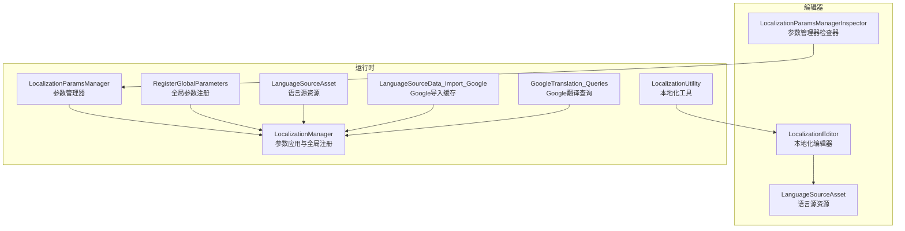
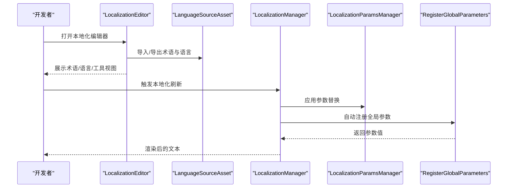
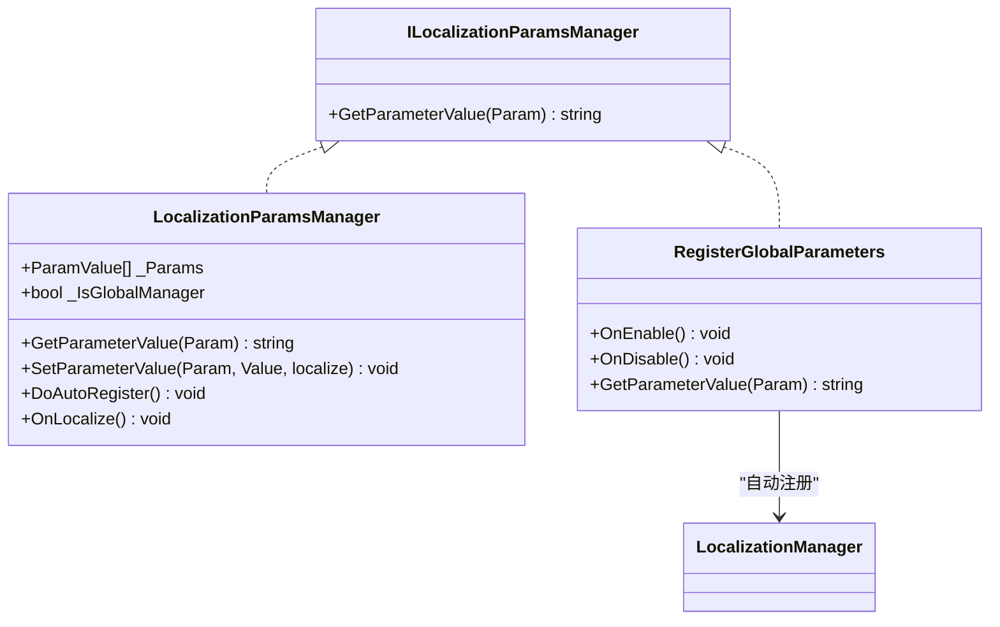
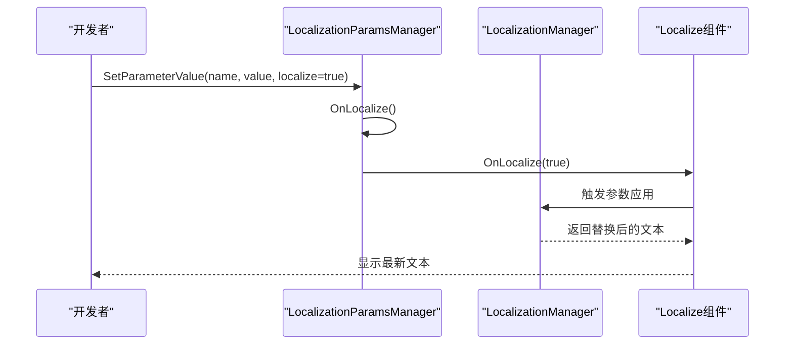
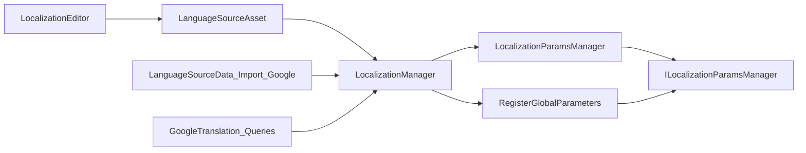

# 本地化开发实践

<cite>
**本文引用的文件**
- [I2Languages.asset](file://Assets/Editor/I2Localization/I2Languages.asset)
- [LocalizationParamsManager.cs](file://Assets/TEngine/Runtime/Module/LocalizationModule/Core/Utils/LocalizationParamsManager.cs)
- [LocalizationManager_Parameters.cs](file://Assets/TEngine/Runtime/Module/LocalizationModule/Core/Manager/LocalizationManager_Parameters.cs)
- [RegisterGlobalParameters.cs](file://Assets/TEngine/Runtime/Module/LocalizationModule/Core/Utils/RegisterGlobalParameters.cs)
- [LocalizationParamsManagerInspector.cs](file://Assets/TEngine/Editor/Localization/Inspectors/LocalizationParamsManagerInspector.cs)
- [LocalizationEditor.cs](file://Assets/TEngine/Editor/Localization/Localization/LocalizationEditor.cs)
- [LanguageSourceAsset.cs](file://Assets/TEngine/Runtime/Module/LocalizationModule/Core/LanguageSource/LanguageSourceAsset.cs)
- [LocalizationUtility.cs](file://Assets/TEngine/Runtime/Module/LocalizationModule/LocalizationUtility.cs)
- [LanguageSourceData_Import_Google.cs](file://Assets/TEngine/Runtime/Module/LocalizationModule/Core/LanguageSource/LanguageSourceData_Import_Google.cs)
- [GoogleTranslation_Queries.cs](file://Assets/TEngine/Runtime/Module/LocalizationModule/Core/Google/GoogleTranslation_Queries.cs)
</cite>

## 目录
1. [引言](#引言)
2. [项目结构](#项目结构)
3. [核心组件](#核心组件)
4. [架构总览](#架构总览)
5. [详细组件分析](#详细组件分析)
6. [依赖关系分析](#依赖关系分析)
7. [性能考量](#性能考量)
8. [故障排查指南](#故障排查指南)
9. [结论](#结论)
10. [附录](#附录)

## 引言
本指南面向需要在Unity项目中实施系统化本地化的开发者与策划。内容覆盖术语管理、语言文件组织、翻译质量保证、I2Languages.asset配置与使用、LocalizationParamsManager参数化文本管理、实时翻译与预览、以及本地化项目的维护策略与团队协作实践。目标是帮助团队建立可复用、可扩展、可追溯的本地化工作流。

## 项目结构
本地化相关代码与资源主要分布在以下位置：
- 编辑器侧：TEngine/Editor/Localization 下包含本地化编辑器工具与检查器，用于术语与语言源的导入导出、语言管理、工具集等。
- 运行时侧：TEngine/Runtime/Module/LocalizationModule 下包含语言源数据、参数化管理、Google翻译查询等核心逻辑。
- 资源侧：Assets/Editor/I2Localization/I2Languages.asset 为语言源资源，供编辑器与运行时使用。

图表来源
- [LocalizationEditor.cs:1-308](file://Assets/TEngine/Editor/Localization/Localization/LocalizationEditor.cs#L1-L308)
- [LocalizationParamsManagerInspector.cs:1-107](file://Assets/TEngine/Editor/Localization/Inspectors/LocalizationParamsManagerInspector.cs#L1-L107)
- [LocalizationParamsManager.cs:1-90](file://Assets/TEngine/Runtime/Module/LocalizationModule/Core/Utils/LocalizationParamsManager.cs#L1-L90)
- [LocalizationManager_Parameters.cs:1-198](file://Assets/TEngine/Runtime/Module/LocalizationModule/Core/Manager/LocalizationManager_Parameters.cs#L1-L198)
- [RegisterGlobalParameters.cs:1-28](file://Assets/TEngine/Runtime/Module/LocalizationModule/Core/Utils/RegisterGlobalParameters.cs#L1-L28)
- [LanguageSourceAsset.cs:1-16](file://Assets/TEngine/Runtime/Module/LocalizationModule/Core/LanguageSource/LanguageSourceAsset.cs#L1-L16)
- [LanguageSourceData_Import_Google.cs:1-46](file://Assets/TEngine/Runtime/Module/LocalizationModule/Core/LanguageSource/LanguageSourceData_Import_Google.cs#L1-L46)
- [GoogleTranslation_Queries.cs:308-346](file://Assets/TEngine/Runtime/Module/LocalizationModule/Core/Google/GoogleTranslation_Queries.cs#L308-L346)
- [LocalizationUtility.cs:1-33](file://Assets/TEngine/Runtime/Module/LocalizationModule/LocalizationUtility.cs#L1-L33)

章节来源
- [I2Languages.asset:1-41](file://Assets/Editor/I2Localization/I2Languages.asset#L1-L41)
- [LocalizationEditor.cs:1-308](file://Assets/TEngine/Editor/Localization/Localization/LocalizationEditor.cs#L1-L308)

## 核心组件
- 语言源资源（LanguageSourceAsset）：以ScriptableObject形式承载语言数据，支持创建与序列化，作为本地化数据的根。
- 参数化管理器（LocalizationParamsManager）：挂载于GameObject上，提供键值参数存储与按需检索；支持“本地”与“全局”两种管理模式。
- 参数应用与全局注册（LocalizationManager）：集中处理参数替换、复数规则、自定义回调、全局参数注册等。
- 注册全局参数（RegisterGlobalParameters）：实现接口并在启用时自动注册到全局参数列表，触发全量刷新。
- 本地化编辑器（LocalizationEditor）：提供术语、语言、工具、资产引用等视图与操作入口。
- I2语言源资源（I2Languages.asset）：编辑器侧语言源配置，包含Google同步、本地CSV、特殊化行/列等设置。
- 本地化工具（LocalizationUtility）：提供系统语言映射、资源命名前缀等辅助能力。
- Google导入与翻译（LanguageSourceData_Import_Google、GoogleTranslation_Queries）：支持从缓存导入、按复数类型拼接翻译等。

章节来源
- [LanguageSourceAsset.cs:1-16](file://Assets/TEngine/Runtime/Module/LocalizationModule/Core/LanguageSource/LanguageSourceAsset.cs#L1-L16)
- [LocalizationParamsManager.cs:1-90](file://Assets/TEngine/Runtime/Module/LocalizationModule/Core/Utils/LocalizationParamsManager.cs#L1-L90)
- [LocalizationManager_Parameters.cs:1-198](file://Assets/TEngine/Runtime/Module/LocalizationModule/Core/Manager/LocalizationManager_Parameters.cs#L1-L198)
- [RegisterGlobalParameters.cs:1-28](file://Assets/TEngine/Runtime/Module/LocalizationModule/Core/Utils/RegisterGlobalParameters.cs#L1-L28)
- [LocalizationEditor.cs:1-308](file://Assets/TEngine/Editor/Localization/Localization/LocalizationEditor.cs#L1-L308)
- [I2Languages.asset:1-41](file://Assets/Editor/I2Localization/I2Languages.asset#L1-L41)
- [LocalizationUtility.cs:1-33](file://Assets/TEngine/Runtime/Module/LocalizationModule/LocalizationUtility.cs#L1-L33)
- [LanguageSourceData_Import_Google.cs:1-46](file://Assets/TEngine/Runtime/Module/LocalizationModule/Core/LanguageSource/LanguageSourceData_Import_Google.cs#L1-L46)
- [GoogleTranslation_Queries.cs:308-346](file://Assets/TEngine/Runtime/Module/LocalizationModule/Core/Google/GoogleTranslation_Queries.cs#L308-L346)

## 架构总览
本地化系统由“编辑器侧语言源管理 + 运行时参数化渲染 + Google/本地数据导入”三部分组成。编辑器负责术语与语言源的维护，运行时负责根据当前语言与参数进行文本替换与渲染，同时支持从Google或本地CSV导入数据。

图表来源
- [LocalizationEditor.cs:1-308](file://Assets/TEngine/Editor/Localization/Localization/LocalizationEditor.cs#L1-L308)
- [LanguageSourceAsset.cs:1-16](file://Assets/TEngine/Runtime/Module/LocalizationModule/Core/LanguageSource/LanguageSourceAsset.cs#L1-L16)
- [LocalizationManager_Parameters.cs:1-198](file://Assets/TEngine/Runtime/Module/LocalizationModule/Core/Manager/LocalizationManager_Parameters.cs#L1-L198)
- [LocalizationParamsManager.cs:1-90](file://Assets/TEngine/Runtime/Module/LocalizationModule/Core/Utils/LocalizationParamsManager.cs#L1-L90)
- [RegisterGlobalParameters.cs:1-28](file://Assets/TEngine/Runtime/Module/LocalizationModule/Core/Utils/RegisterGlobalParameters.cs#L1-L28)

## 详细组件分析

### I2Languages.asset 配置与使用
- 作用：作为编辑器侧的语言源资源，保存术语、语言列表、Google同步参数、本地CSV分隔符与编码等。
- 关键字段说明：
  - mSource.mLanguages：语言列表
  - mSource.mTerms：术语集合
  - mSource.OnMissingTranslation：缺失翻译时的行为
  - mSource.IgnoreDeviceLanguage：是否忽略设备语言
  - mSource.Google_*：Google服务端连接参数与更新频率
  - mSource.Spreadsheet_*：本地CSV导入/导出设置
- 使用建议：
  - 在编辑器中通过“Spreadsheets/Terms/Languages/Tools”视图管理术语与语言。
  - 导入/导出时选择“Local”或“Google”，确保路径与权限正确。
  - 对于多语言项目，建议开启“CaseInsensitiveTerms”以减少大小写差异导致的匹配失败。

章节来源
- [I2Languages.asset:1-41](file://Assets/Editor/I2Localization/I2Languages.asset#L1-L41)
- [LocalizationEditor.cs:88-124](file://Assets/TEngine/Editor/Localization/Localization/LocalizationEditor.cs#L88-L124)

### 术语管理与语言文件组织
- 术语组织：在“Terms”视图中新增、删除、分类术语，支持批量选择与筛选。
- 语言文件组织：在“Languages”视图中添加语言、设置语言权重、切换当前语言。
- 工具集：提供字符集检测、合并术语、解析术语、场景扫描等工具，提升术语覆盖率与一致性。
- 资产引用：在“Assets”视图中管理被术语引用但不在Resources中的资源，避免运行时报错。

章节来源
- [LocalizationEditor.cs:78-124](file://Assets/TEngine/Editor/Localization/Localization/LocalizationEditor.cs#L78-L124)

### 翻译质量保证
- 缺失翻译提示：通过“OnMissingTranslation”策略控制缺失翻译时的回退行为。
- 字符集与语言规则：使用“Tools/CharSet”与“Tools/Categorize”确保术语符合目标语言的字符集与分类规范。
- 场景扫描：使用“Tools/Scenes”扫描场景中的术语使用情况，识别未本地化文本。
- Google同步：通过“Tools/ParseTerms/TranslateAll/Languages/TranslateAll”等工具批量翻译与校对。

章节来源
- [I2Languages.asset:21-21](file://Assets/Editor/I2Localization/I2Languages.asset#L21-L21)
- [LocalizationEditor.cs:88-124](file://Assets/TEngine/Editor/Localization/Localization/LocalizationEditor.cs#L88-L124)

### LocalizationParamsManager 参数化文本管理
- 功能概述：支持在运行时对文本中的占位符进行参数替换，支持复数规则与嵌套参数。
- 管理模式：
  - 本地管理器：仅对挂载在同一GameObject上的Localize组件生效。
  - 全局管理器：对所有Localize组件生效，并在启用时自动注册。
- 参数注入与验证：
  - 通过SetParameterValue动态设置参数值，支持触发本地化刷新。
  - GetParameterValue按优先级从当前GameObject的ILocalizationParamsManager链表中取值，再回退到全局列表。
- 复数规则：根据当前语言与数值参数，自动选择合适的复数变体片段。

图表来源
- [LocalizationParamsManager.cs:1-90](file://Assets/TEngine/Runtime/Module/LocalizationModule/Core/Utils/LocalizationParamsManager.cs#L1-L90)
- [RegisterGlobalParameters.cs:1-28](file://Assets/TEngine/Runtime/Module/LocalizationModule/Core/Utils/RegisterGlobalParameters.cs#L1-L28)
- [LocalizationManager_Parameters.cs:1-198](file://Assets/TEngine/Runtime/Module/LocalizationModule/Core/Manager/LocalizationManager_Parameters.cs#L1-L198)

章节来源
- [LocalizationParamsManager.cs:1-90](file://Assets/TEngine/Runtime/Module/LocalizationModule/Core/Utils/LocalizationParamsManager.cs#L1-L90)
- [LocalizationManager_Parameters.cs:1-198](file://Assets/TEngine/Runtime/Module/LocalizationModule/Core/Manager/LocalizationManager_Parameters.cs#L1-L198)
- [RegisterGlobalParameters.cs:1-28](file://Assets/TEngine/Runtime/Module/LocalizationModule/Core/Utils/RegisterGlobalParameters.cs#L1-L28)

### 实时翻译与预览
- 实时预览：在编辑器中切换语言或修改术语后，可通过调用局部或全局刷新函数即时看到效果。
- 同步机制：编辑器侧的Google同步与本地CSV导入会更新语言源资源，运行时读取最新数据。
- 刷新流程：参数管理器在设置参数后可触发OnLocalize，进而调用Localize组件的刷新逻辑。

图表来源
- [LocalizationParamsManager.cs:56-61](file://Assets/TEngine/Runtime/Module/LocalizationModule/Core/Utils/LocalizationParamsManager.cs#L56-L61)
- [LocalizationManager_Parameters.cs:62-141](file://Assets/TEngine/Runtime/Module/LocalizationModule/Core/Manager/LocalizationManager_Parameters.cs#L62-L141)

章节来源
- [LocalizationParamsManager.cs:37-61](file://Assets/TEngine/Runtime/Module/LocalizationModule/Core/Utils/LocalizationParamsManager.cs#L37-L61)
- [LocalizationManager_Parameters.cs:40-141](file://Assets/TEngine/Runtime/Module/LocalizationModule/Core/Manager/LocalizationManager_Parameters.cs#L40-L141)

### Google翻译与本地导入
- Google导入：支持从缓存加载、按语言索引清理未使用语言、延迟应用以避免性能抖动。
- 翻译查询：按复数类型生成多段翻译，并在最终输出中拼接对应片段。
- CSV导入：通过本地CSV文件导入术语与翻译，支持分隔符与编码设置。

章节来源
- [LanguageSourceData_Import_Google.cs:1-46](file://Assets/TEngine/Runtime/Module/LocalizationModule/Core/LanguageSource/LanguageSourceData_Import_Google.cs#L1-L46)
- [GoogleTranslation_Queries.cs:308-346](file://Assets/TEngine/Runtime/Module/LocalizationModule/Core/Google/GoogleTranslation_Queries.cs#L308-L346)
- [I2Languages.asset:36-41](file://Assets/Editor/I2Localization/I2Languages.asset#L36-L41)

## 依赖关系分析
- 组件耦合：
  - LocalizationParamsManager 依赖 ILocalizationParamsManager 接口，支持本地与全局两种模式。
  - RegisterGlobalParameters 实现接口并在启用时注册到 LocalizationManager 的全局参数列表。
  - LanguageSourceAsset 提供语言源数据，LocalizationManager 读取并应用。
- 外部依赖：
  - 编辑器侧依赖UnityEditor与UnityEditor.SceneManagement。
  - 运行时依赖UnityEngine与系统语言映射。

图表来源
- [LocalizationParamsManager.cs:1-90](file://Assets/TEngine/Runtime/Module/LocalizationModule/Core/Utils/LocalizationParamsManager.cs#L1-L90)
- [RegisterGlobalParameters.cs:1-28](file://Assets/TEngine/Runtime/Module/LocalizationModule/Core/Utils/RegisterGlobalParameters.cs#L1-L28)
- [LocalizationManager_Parameters.cs:1-198](file://Assets/TEngine/Runtime/Module/LocalizationModule/Core/Manager/LocalizationManager_Parameters.cs#L1-L198)
- [LanguageSourceAsset.cs:1-16](file://Assets/TEngine/Runtime/Module/LocalizationModule/Core/LanguageSource/LanguageSourceAsset.cs#L1-L16)
- [LocalizationEditor.cs:1-308](file://Assets/TEngine/Editor/Localization/Localization/LocalizationEditor.cs#L1-L308)
- [LanguageSourceData_Import_Google.cs:1-46](file://Assets/TEngine/Runtime/Module/LocalizationModule/Core/LanguageSource/LanguageSourceData_Import_Google.cs#L1-L46)
- [GoogleTranslation_Queries.cs:308-346](file://Assets/TEngine/Runtime/Module/LocalizationModule/Core/Google/GoogleTranslation_Queries.cs#L308-L346)

章节来源
- [LocalizationParamsManager.cs:1-90](file://Assets/TEngine/Runtime/Module/LocalizationModule/Core/Utils/LocalizationParamsManager.cs#L1-L90)
- [LocalizationManager_Parameters.cs:1-198](file://Assets/TEngine/Runtime/Module/LocalizationModule/Core/Manager/LocalizationManager_Parameters.cs#L1-L198)
- [LanguageSourceAsset.cs:1-16](file://Assets/TEngine/Runtime/Module/LocalizationModule/Core/LanguageSource/LanguageSourceAsset.cs#L1-L16)
- [LocalizationEditor.cs:1-308](file://Assets/TEngine/Editor/Localization/Localization/LocalizationEditor.cs#L1-L308)

## 性能考量
- 语言源缓存与延迟应用：导入Google数据时采用延迟应用策略，避免场景切换时的卡顿。
- 语言数据清理：按当前语言索引清理其他语言的翻译，减少内存占用。
- 参数替换复杂度：参数替换采用线性扫描与字符串替换，建议控制参数数量与层级深度，避免深层嵌套导致的重复扫描。
- 全局参数注册：全局参数管理器启用时自动注册并触发全量刷新，应避免频繁启停以减少刷新成本。

章节来源
- [LanguageSourceData_Import_Google.cs:17-31](file://Assets/TEngine/Runtime/Module/LocalizationModule/Core/LanguageSource/LanguageSourceData_Import_Google.cs#L17-L31)
- [LocalizationManager_Parameters.cs:62-141](file://Assets/TEngine/Runtime/Module/LocalizationModule/Core/Manager/LocalizationManager_Parameters.cs#L62-L141)

## 故障排查指南
- 术语未显示：检查术语是否存在于当前语言的翻译中，确认“OnMissingTranslation”策略与语言列表。
- 参数未生效：确认参数管理器是否为全局模式，或Localize组件是否在同一GameObject上；检查参数名大小写与嵌套参数格式。
- Google同步失败：核对Google服务端URL、Spreadsheet Key、密码与更新频率；确认网络与权限。
- 本地CSV导入异常：检查CSV分隔符与编码设置，确保术语唯一且无多余空格。

章节来源
- [I2Languages.asset:26-41](file://Assets/Editor/I2Localization/I2Languages.asset#L26-L41)
- [LocalizationParamsManagerInspector.cs:77-105](file://Assets/TEngine/Editor/Localization/Inspectors/LocalizationParamsManagerInspector.cs#L77-L105)
- [LocalizationEditor.cs:207-257](file://Assets/TEngine/Editor/Localization/Localization/LocalizationEditor.cs#L207-L257)

## 结论
通过I2语言源资源与编辑器工具，结合运行时参数化管理与Google/本地导入能力，可以构建一套完整的本地化工作流。建议在团队内统一术语命名规范、语言源结构与参数格式，配合自动化工具与CI流程，持续提升翻译质量与交付效率。

## 附录
- 最佳实践清单
  - 术语命名：使用清晰、稳定的标识符，避免嵌套与歧义。
  - 语言源：定期清理未使用语言，保持资源体积最小化。
  - 参数化：限制参数层级深度，统一参数格式，避免循环引用。
  - 团队协作：制定术语评审流程，使用Google表格协作，保留变更历史。
  - 版本管理：将语言源资源纳入版本控制，记录每次变更与责任人。