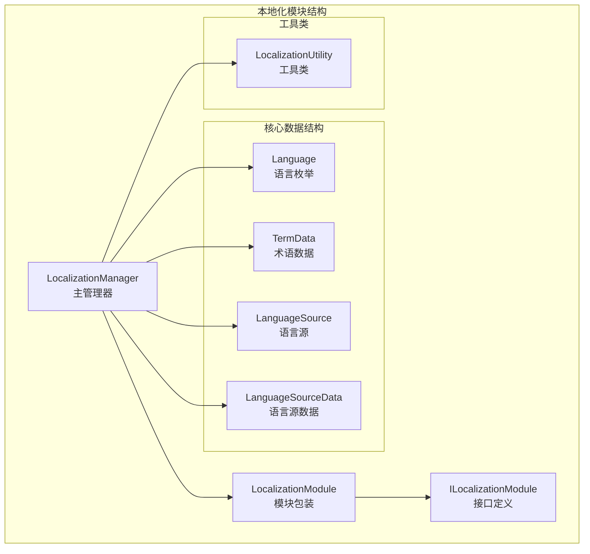
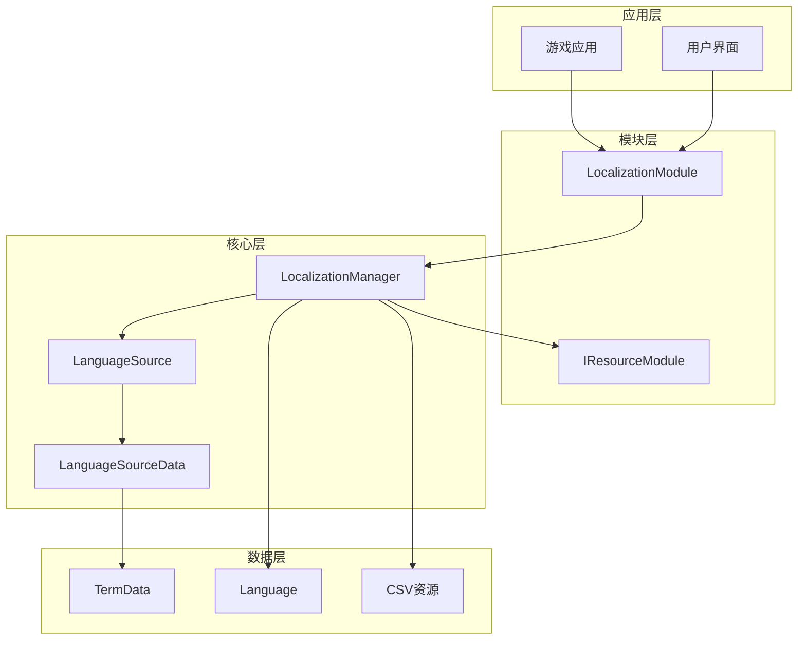
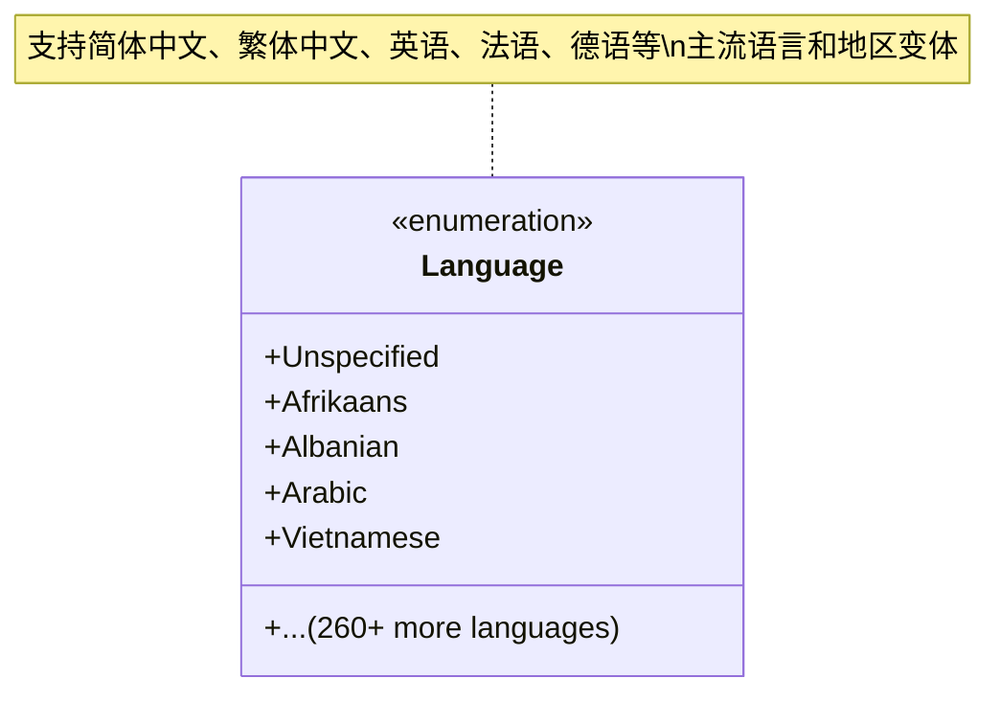
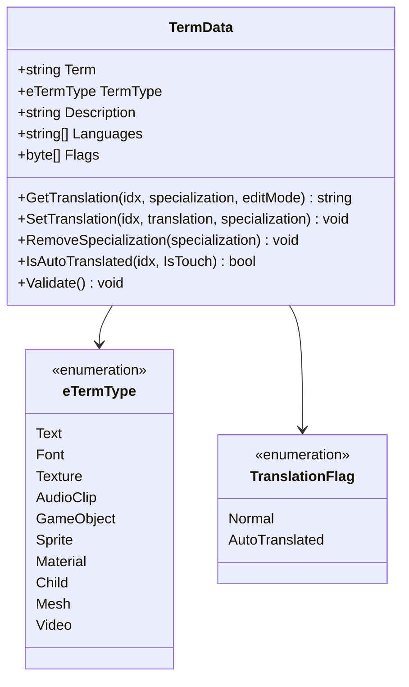
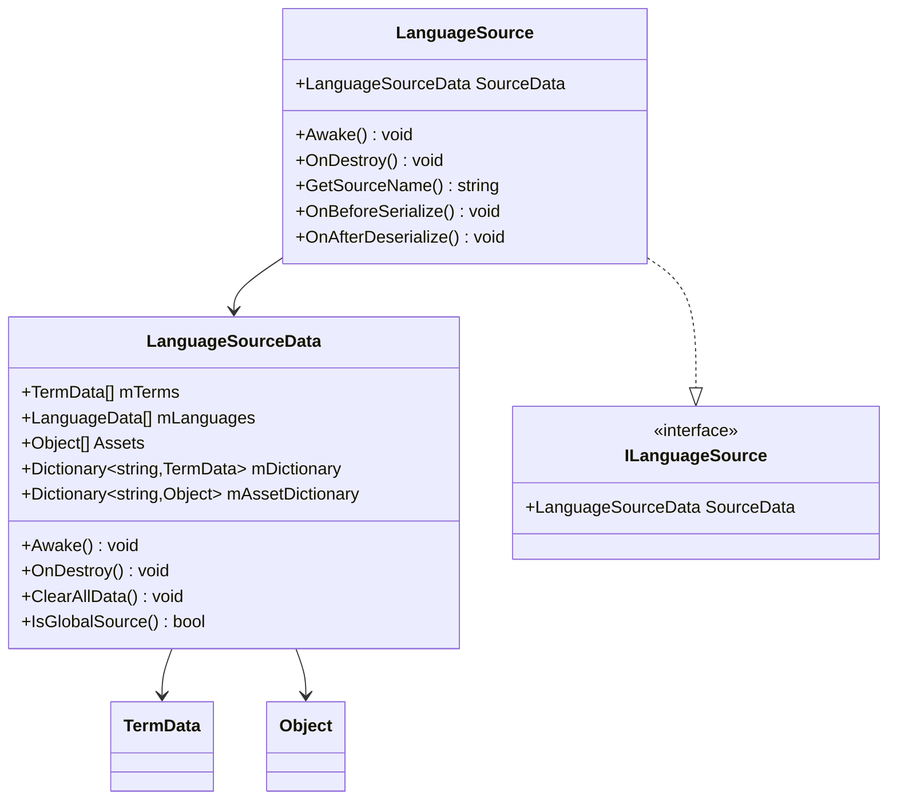
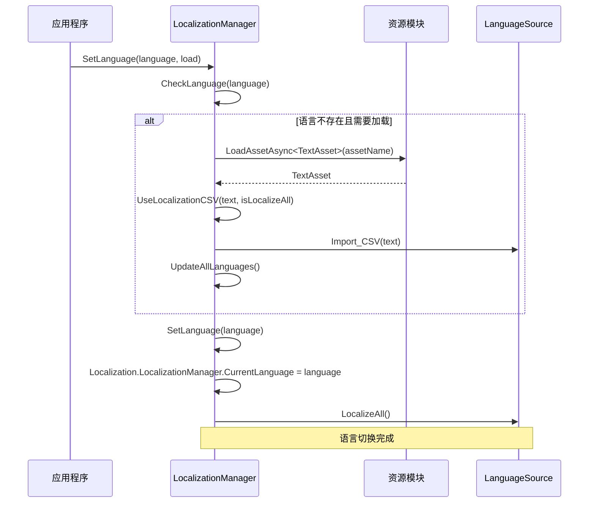
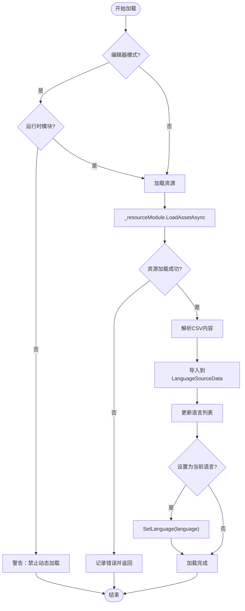
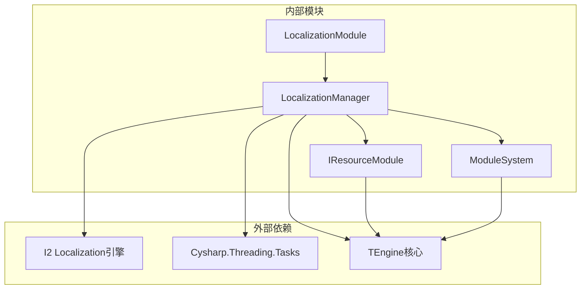

# 本地化核心机制

<cite>
**本文档引用的文件**
- [ILocalizationModule.cs](file://Assets/TEngine/Runtime/Module/LocalizationModule/ILocalizationModule.cs)
- [LocalizationModule.cs](file://Assets/TEngine/Runtime/Module/LocalizationModule/LocalizationModule.cs)
- [LocalizationManager.cs](file://Assets/TEngine/Runtime/Module/LocalizationModule/LocalizationManager.cs)
- [Language.cs](file://Assets/TEngine/Runtime/Module/LocalizationModule/Language.cs)
- [TermData.cs](file://Assets/TEngine/Runtime/Module/LocalizationModule/Core/TermData.cs)
- [LanguageSource.cs](file://Assets/TEngine/Runtime/Module/LocalizationModule/Core/LanguageSource/LanguageSource.cs)
- [LanguageSourceData.cs](file://Assets/TEngine/Runtime/Module/LocalizationModule/Core/LanguageSource/LanguageSourceData.cs)
- [LocalizationUtility.cs](file://Assets/TEngine/Runtime/Module/LocalizationModule/LocalizationUtility.cs)
- [GameModule.cs](file://Assets/GameScripts/HotFix/GameLogic/GameModule.cs)
- [ProcedureLaunch.cs](file://Assets/GameScripts/Procedure/ProcedureLaunch.cs)
</cite>

## 目录
1. [简介](#简介)
2. [项目结构](#项目结构)
3. [核心组件](#核心组件)
4. [架构概览](#架构概览)
5. [详细组件分析](#详细组件分析)
6. [依赖关系分析](#依赖关系分析)
7. [性能考虑](#性能考虑)
8. [故障排除指南](#故障排除指南)
9. [结论](#结论)
10. [附录](#附录)

## 简介

TEngine本地化系统是一个基于I2 Localization引擎的完整本地化解决方案，提供了多语言支持、动态资源加载、术语管理等功能。该系统采用模块化设计，通过LocalizationModule提供统一的接口，通过LocalizationManager实现具体的本地化逻辑。

本地化系统的核心特点包括：
- 支持200+种语言和地区
- 动态语言资源加载和切换
- 术语缓存和翻译存储
- 多种资源格式支持（CSV、Google Sheets等）
- 完整的编辑器工具链

## 项目结构

本地化模块位于TEngine项目的Module目录下，采用清晰的分层架构：



**图表来源**
- [LocalizationModule.cs:1-114](file://Assets/TEngine/Runtime/Module/LocalizationModule/LocalizationModule.cs#L1-L114)
- [LocalizationManager.cs:1-312](file://Assets/TEngine/Runtime/Module/LocalizationModule/LocalizationManager.cs#L1-L312)

**章节来源**
- [ILocalizationModule.cs:1-60](file://Assets/TEngine/Runtime/Module/LocalizationModule/ILocalizationModule.cs#L1-L60)
- [LocalizationModule.cs:1-114](file://Assets/TEngine/Runtime/Module/LocalizationModule/LocalizationModule.cs#L1-L114)

## 核心组件

### ILocalizationModule 接口

ILocalizationModule定义了本地化模块的核心接口，提供了以下主要功能：

- **语言管理**：获取/设置当前语言、获取系统语言
- **资源加载**：加载完整语言资源包、加载指定语言资源
- **语言切换**：通过枚举、字符串、ID设置语言
- **状态查询**：检查语言可用性

### LocalizationModule 模块

LocalizationModule作为模块包装器，实现了ILocalizationModule接口，并提供：

- **模块生命周期管理**：初始化、关闭
- **委托模式**：将具体实现委托给LocalizationManager
- **资源模块集成**：与TEngine资源系统无缝集成

### LocalizationManager 主管理器

LocalizationManager是本地化系统的核心，负责：

- **模块初始化**：自动注册到模块系统
- **语言资源管理**：加载、缓存、切换语言
- **术语处理**：导入、更新、查询术语
- **资源加载**：从Bundle加载本地化资源

**章节来源**
- [ILocalizationModule.cs:1-60](file://Assets/TEngine/Runtime/Module/LocalizationModule/ILocalizationModule.cs#L1-L60)
- [LocalizationModule.cs:1-114](file://Assets/TEngine/Runtime/Module/LocalizationModule/LocalizationModule.cs#L1-L114)
- [LocalizationManager.cs:1-312](file://Assets/TEngine/Runtime/Module/LocalizationModule/LocalizationManager.cs#L1-L312)

## 架构概览

本地化系统采用分层架构设计，确保了良好的可扩展性和维护性：



**图表来源**
- [LocalizationModule.cs:8-35](file://Assets/TEngine/Runtime/Module/LocalizationModule/LocalizationModule.cs#L8-L35)
- [LocalizationManager.cs:14-78](file://Assets/TEngine/Runtime/Module/LocalizationModule/LocalizationManager.cs#L14-L78)

## 详细组件分析

### Language 枚举设计

Language枚举提供了完整的语言支持，包含200+种语言和地区：



**图表来源**
- [Language.cs:6-262](file://Assets/TEngine/Runtime/Module/LocalizationModule/Language.cs#L6-L262)

Language枚举的设计特点：
- 使用byte类型优化内存占用
- 按ISO标准组织语言分类
- 支持地区变体（如简体中文、繁体中文）

**章节来源**
- [Language.cs:1-264](file://Assets/TEngine/Runtime/Module/LocalizationModule/Language.cs#L1-L264)

### TermData 数据结构

TermData是本地化系统的核心数据结构，用于存储术语信息：



**图表来源**
- [TermData.cs:34-139](file://Assets/TEngine/Runtime/Module/LocalizationModule/Core/TermData.cs#L34-L139)

TermData的关键特性：
- 支持多种资源类型（文本、字体、纹理、音频等）
- 多语言翻译存储
- 术语标志管理
- 规范化处理

**章节来源**
- [TermData.cs:1-150](file://Assets/TEngine/Runtime/Module/LocalizationModule/Core/TermData.cs#L1-L150)

### LanguageSource 和 LanguageSourceData

LanguageSource和LanguageSourceData提供了完整的语言源管理：



**图表来源**
- [LanguageSource.cs:9-178](file://Assets/TEngine/Runtime/Module/LocalizationModule/Core/LanguageSource/LanguageSource.cs#L9-L178)
- [LanguageSourceData.cs:16-176](file://Assets/TEngine/Runtime/Module/LocalizationModule/Core/LanguageSource/LanguageSourceData.cs#L16-L176)

**章节来源**
- [LanguageSource.cs:1-179](file://Assets/TEngine/Runtime/Module/LocalizationModule/Core/LanguageSource/LanguageSource.cs#L1-L179)
- [LanguageSourceData.cs:1-177](file://Assets/TEngine/Runtime/Module/LocalizationModule/Core/LanguageSource/LanguageSourceData.cs#L1-L177)

### 语言切换机制

语言切换是本地化系统的核心功能，通过以下流程实现：



**图表来源**
- [LocalizationManager.cs:241-281](file://Assets/TEngine/Runtime/Module/LocalizationModule/LocalizationManager.cs#L241-L281)

**章节来源**
- [LocalizationManager.cs:152-193](file://Assets/TEngine/Runtime/Module/LocalizationModule/LocalizationManager.cs#L152-L193)
- [LocalizationManager.cs:241-281](file://Assets/TEngine/Runtime/Module/LocalizationModule/LocalizationManager.cs#L241-L281)

### 资源加载流程

本地化资源的加载采用异步方式，确保游戏性能：



**图表来源**
- [LocalizationManager.cs:124-193](file://Assets/TEngine/Runtime/Module/LocalizationModule/LocalizationManager.cs#L124-L193)

**章节来源**
- [LocalizationManager.cs:124-193](file://Assets/TEngine/Runtime/Module/LocalizationModule/LocalizationManager.cs#L124-L193)

## 依赖关系分析

本地化系统与其他模块的依赖关系：



**图表来源**
- [LocalizationManager.cs:1-6](file://Assets/TEngine/Runtime/Module/LocalizationModule/LocalizationManager.cs#L1-L6)
- [LocalizationModule.cs:1-2](file://Assets/TEngine/Runtime/Module/LocalizationModule/LocalizationModule.cs#L1-L2)

**章节来源**
- [LocalizationManager.cs:1-6](file://Assets/TEngine/Runtime/Module/LocalizationModule/LocalizationManager.cs#L1-L6)
- [LocalizationModule.cs:1-2](file://Assets/TEngine/Runtime/Module/LocalizationModule/LocalizationModule.cs#L1-L2)

## 性能考虑

### 内存管理策略

本地化系统采用了多项内存优化策略：

1. **延迟加载**：语言资源按需加载，避免启动时大量内存占用
2. **字典缓存**：使用Dictionary缓存术语和资源，提高查询效率
3. **资源池**：利用TEngine的资源池减少GC压力
4. **条件编译**：在编辑器模式下禁用某些功能以提升性能

### 性能优化建议

- **批量加载**：将多个语言资源打包，减少网络请求
- **预加载策略**：根据玩家行为预测可能的语言切换
- **内存监控**：定期清理不再使用的语言资源
- **异步处理**：所有资源加载都使用异步方式，避免阻塞主线程

## 故障排除指南

### 常见问题及解决方案

**问题1：语言资源加载失败**
- 检查资源路径是否正确
- 确认资源已添加到Addressable或Bundle中
- 查看控制台错误日志

**问题2：语言切换无效**
- 验证目标语言是否已加载
- 检查语言名称拼写
- 确认Language枚举值正确

**问题3：术语显示异常**
- 检查CSV文件格式
- 验证术语键名唯一性
- 确认特殊字符处理

**章节来源**
- [LocalizationManager.cs:133-184](file://Assets/TEngine/Runtime/Module/LocalizationModule/LocalizationManager.cs#L133-L184)
- [LocalizationManager.cs:243-253](file://Assets/TEngine/Runtime/Module/LocalizationModule/LocalizationManager.cs#L243-L253)

## 结论

TEngine本地化系统通过模块化设计实现了功能完整、性能优异的多语言支持。系统的主要优势包括：

1. **完整的语言支持**：支持200+种语言和地区
2. **灵活的资源管理**：支持多种资源格式和加载方式
3. **高效的性能表现**：异步加载、缓存优化、内存管理
4. **易用的开发体验**：简洁的API、完善的编辑器工具

该系统为游戏国际化提供了坚实的技术基础，能够满足不同规模项目的本地化需求。

## 附录

### 使用示例

#### 基本语言设置
```csharp
// 获取本地化模块实例
ILocalizationModule localization = ModuleSystem.GetModule<ILocalizationModule>();

// 设置当前语言
localization.SetLanguage(Language.ChineseSimplified);

// 通过字符串设置语言
localization.SetLanguage("English");
```

#### 动态语言切换
```csharp
// 异步加载并切换语言
await localization.LoadLanguage("French", true);

// 检查语言可用性
bool isAvailable = localization.CheckLanguage("Japanese");
```

#### 资源加载
```csharp
// 加载完整语言资源包
await localization.LoadLanguageTotalAsset("Localization_Chinese");

// 加载指定语言资源
await localization.LoadLanguage("German", true);
```

**章节来源**
- [GameModule.cs:83-85](file://Assets/GameScripts/HotFix/GameLogic/GameModule.cs#L83-L85)
- [ProcedureLaunch.cs:52](file://Assets/GameScripts/Procedure/ProcedureLaunch.cs#L52)