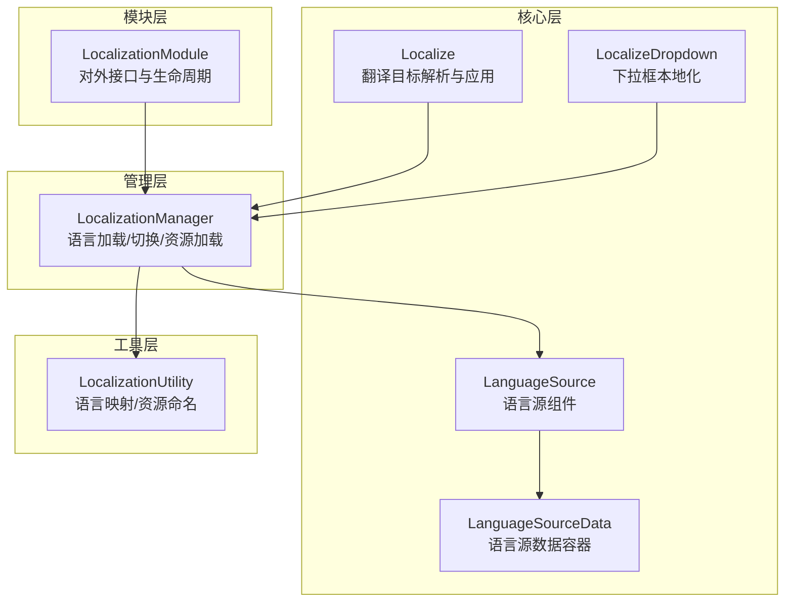
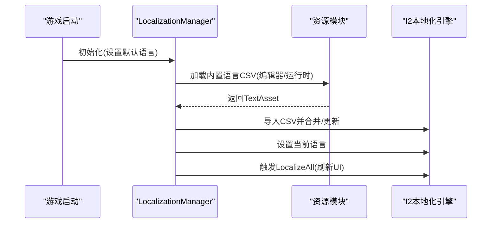
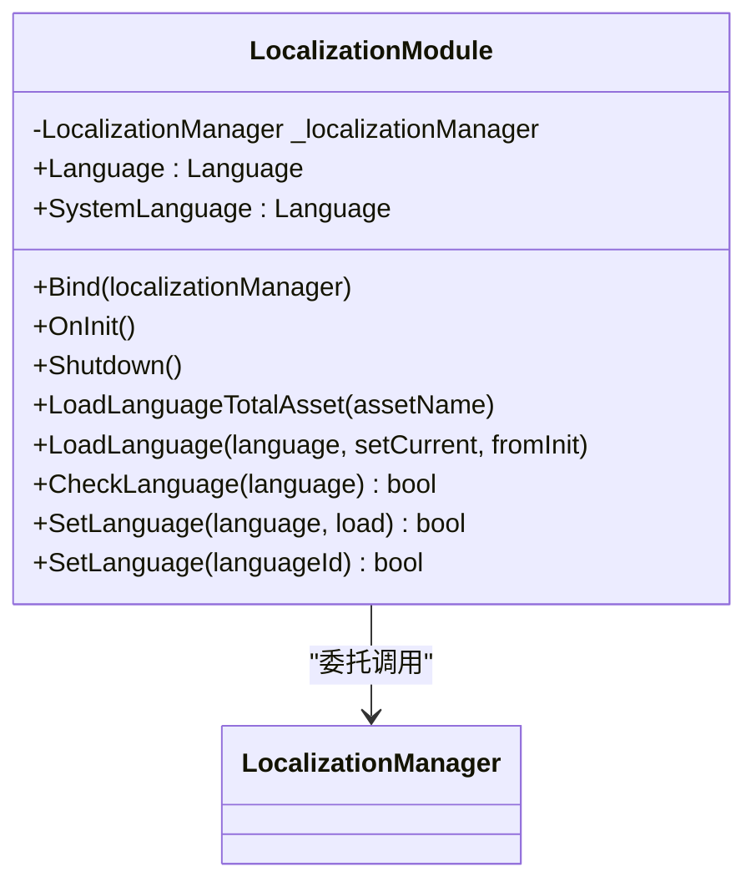
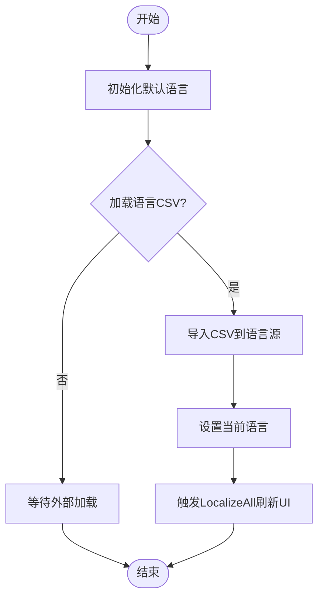
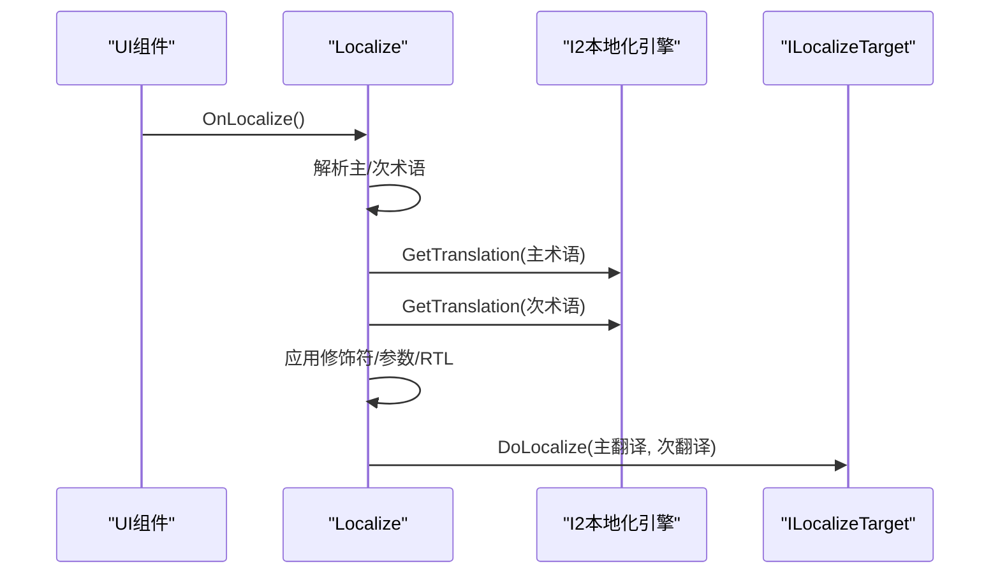
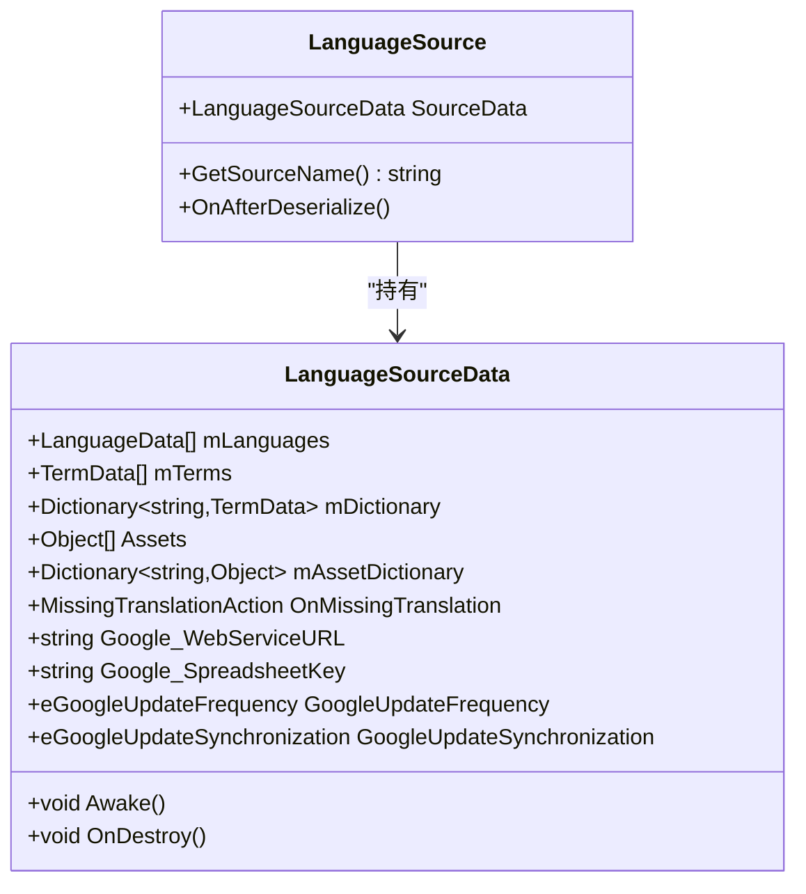
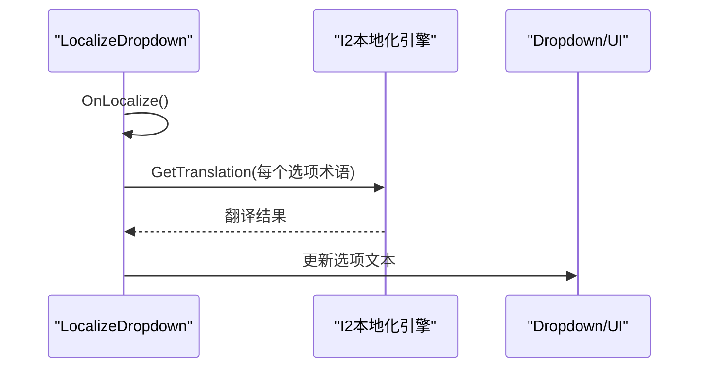
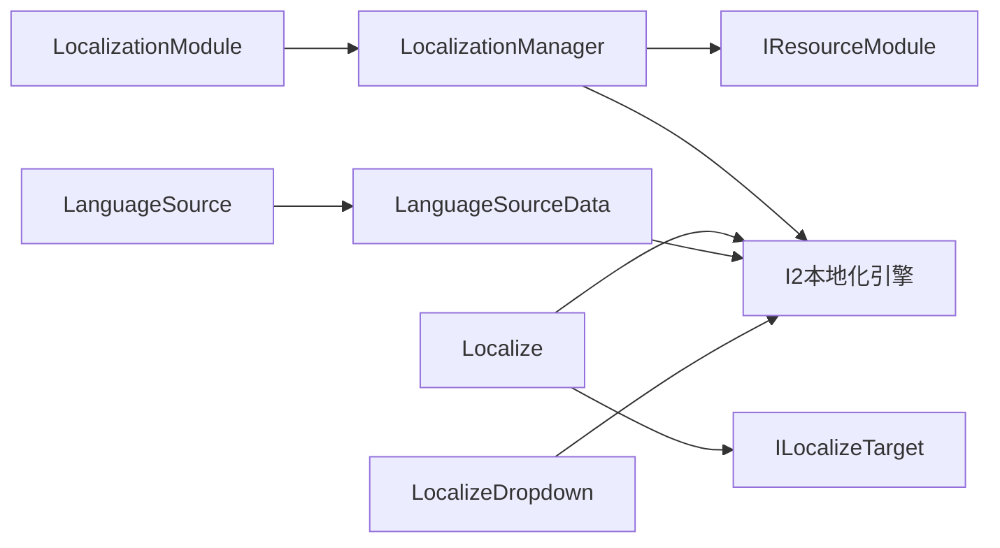

# 本地化系统

<cite>
**本文引用的文件**
- [LocalizationModule.cs](file://Assets/TEngine/Runtime/Module/LocalizationModule/LocalizationModule.cs)
- [LocalizationManager.cs](file://Assets/TEngine/Runtime/Module/LocalizationModule/LocalizationManager.cs)
- [Localize.cs](file://Assets/TEngine/Runtime/Module/LocalizationModule/Core/Localize.cs)
- [LanguageSource.cs](file://Assets/TEngine/Runtime/Module/LocalizationModule/Core/LanguageSource/LanguageSource.cs)
- [LanguageSourceData.cs](file://Assets/TEngine/Runtime/Module/LocalizationModule/Core/LanguageSource/LanguageSourceData.cs)
- [LocalizationUtility.cs](file://Assets/TEngine/Runtime/Module/LocalizationModule/LocalizationUtility.cs)
- [LocalizeDropdown.cs](file://Assets/TEngine/Runtime/Module/LocalizationModule/Core/LocalizeDropdown.cs)
</cite>

## 目录
1. [引言](#引言)
2. [项目结构](#项目结构)
3. [核心组件](#核心组件)
4. [架构总览](#架构总览)
5. [详细组件分析](#详细组件分析)
6. [依赖关系分析](#依赖关系分析)
7. [性能考虑](#性能考虑)
8. [故障排查指南](#故障排查指南)
9. [结论](#结论)
10. [附录：使用示例与最佳实践](#附录使用示例与最佳实践)

## 引言
本文件面向TEngine本地化系统，围绕多语言设计原理与实现机制展开，重点覆盖以下主题：
- 语言切换与文本翻译流程
- 参数化文本与动态翻译
- LocalizationModule 的职责边界与实现要点
- 语言源管理、翻译存储与实时翻译
- 与Google翻译的集成方式（含翻译API调用、批量翻译、翻译缓存）
- 本地化开发最佳实践（术语管理、语言文件组织、动态翻译）
- 性能优化与多语言资源管理策略
- 具体使用示例与多语言开发指南

## 项目结构
TEngine本地化系统位于运行时模块目录中，采用“模块 + 核心组件”的分层组织方式：
- 模块层：LocalizationModule 作为对外接口，委托给 LocalizationManager 执行具体逻辑
- 管理层：LocalizationManager 负责语言加载、切换、资源加载与统一入口
- 核心层：Localize、LanguageSource、LanguageSourceData 提供翻译目标解析、语言源数据管理与Google相关能力
- 工具层：LocalizationUtility 提供语言枚举与字符串互转、资源命名规范等

图表来源
- [LocalizationModule.cs:1-114](file://Assets/TEngine/Runtime/Module/LocalizationModule/LocalizationModule.cs#L1-L114)
- [LocalizationManager.cs:1-312](file://Assets/TEngine/Runtime/Module/LocalizationModule/LocalizationManager.cs#L1-L312)
- [Localize.cs:1-518](file://Assets/TEngine/Runtime/Module/LocalizationModule/Core/Localize.cs#L1-L518)
- [LanguageSource.cs:1-179](file://Assets/TEngine/Runtime/Module/LocalizationModule/Core/LanguageSource/LanguageSource.cs#L1-L179)
- [LanguageSourceData.cs:1-177](file://Assets/TEngine/Runtime/Module/LocalizationModule/Core/LanguageSource/LanguageSourceData.cs#L1-L177)
- [LocalizationUtility.cs:1-134](file://Assets/TEngine/Runtime/Module/LocalizationModule/LocalizationUtility.cs#L1-L134)
- [LocalizeDropdown.cs:1-111](file://Assets/TEngine/Runtime/Module/LocalizationModule/Core/LocalizeDropdown.cs#L1-L111)

章节来源
- [LocalizationModule.cs:1-114](file://Assets/TEngine/Runtime/Module/LocalizationModule/LocalizationModule.cs#L1-L114)
- [LocalizationManager.cs:1-312](file://Assets/TEngine/Runtime/Module/LocalizationModule/LocalizationManager.cs#L1-L312)
- [Localize.cs:1-518](file://Assets/TEngine/Runtime/Module/LocalizationModule/Core/Localize.cs#L1-L518)
- [LanguageSource.cs:1-179](file://Assets/TEngine/Runtime/Module/LocalizationModule/Core/LanguageSource/LanguageSource.cs#L1-L179)
- [LanguageSourceData.cs:1-177](file://Assets/TEngine/Runtime/Module/LocalizationModule/Core/LanguageSource/LanguageSourceData.cs#L1-L177)
- [LocalizationUtility.cs:1-134](file://Assets/TEngine/Runtime/Module/LocalizationModule/LocalizationUtility.cs#L1-L134)
- [LocalizeDropdown.cs:1-111](file://Assets/TEngine/Runtime/Module/LocalizationModule/Core/LocalizeDropdown.cs#L1-L111)

## 核心组件
- LocalizationModule：模块门面，封装语言切换、语言加载、语言检查等接口，并在销毁时释放内部管理器
- LocalizationManager：核心管理器，负责语言初始化、从资源加载语言CSV、设置当前语言、调用I2本地化引擎进行翻译
- Localize：翻译目标组件，挂载于UI对象上，负责根据主次术语获取翻译、应用修饰符、处理参数与RTL
- LanguageSource / LanguageSourceData：语言源组件与数据容器，承载语言列表、术语表、资产引用、Google同步配置等
- LocalizationUtility：语言枚举与字符串互转、系统语言映射、资源命名前缀等
- LocalizeDropdown：下拉框本地化组件，监听语言事件并刷新选项文本

章节来源
- [LocalizationModule.cs:8-112](file://Assets/TEngine/Runtime/Module/LocalizationModule/LocalizationModule.cs#L8-L112)
- [LocalizationManager.cs:14-311](file://Assets/TEngine/Runtime/Module/LocalizationModule/LocalizationManager.cs#L14-L311)
- [Localize.cs:16-518](file://Assets/TEngine/Runtime/Module/LocalizationModule/Core/Localize.cs#L16-L518)
- [LanguageSource.cs:9-179](file://Assets/TEngine/Runtime/Module/LocalizationModule/Core/LanguageSource/LanguageSource.cs#L9-L179)
- [LanguageSourceData.cs:16-177](file://Assets/TEngine/Runtime/Module/LocalizationModule/Core/LanguageSource/LanguageSourceData.cs#L16-L177)
- [LocalizationUtility.cs:9-134](file://Assets/TEngine/Runtime/Module/LocalizationModule/LocalizationUtility.cs#L9-L134)
- [LocalizeDropdown.cs:10-111](file://Assets/TEngine/Runtime/Module/LocalizationModule/Core/LocalizeDropdown.cs#L10-L111)

## 架构总览
本地化系统以模块化方式组织，遵循“接口门面 + 管理器 + 核心组件”的分层设计：
- 外部通过 LocalizationModule 访问语言切换与加载能力
- LocalizationManager 在启动阶段完成默认语言初始化，并在需要时从资源加载语言CSV
- Localize 与 LocalizeDropdown 在运行时根据当前语言对UI进行实时翻译
- LanguageSource/ LanguageSourceData 作为语言源，承载术语与语言元数据；LocalizationManager 通过I2引擎接口进行翻译查询与刷新

图表来源
- [LocalizationManager.cs:95-119](file://Assets/TEngine/Runtime/Module/LocalizationModule/LocalizationManager.cs#L95-L119)
- [LocalizationManager.cs:124-193](file://Assets/TEngine/Runtime/Module/LocalizationModule/LocalizationManager.cs#L124-L193)
- [LocalizationManager.cs:283-292](file://Assets/TEngine/Runtime/Module/LocalizationModule/LocalizationManager.cs#L283-L292)

## 详细组件分析

### LocalizationModule 分析
- 职责：作为模块门面，提供语言切换、语言加载、语言检查等接口；在销毁时释放内部管理器
- 关键点：
  - 通过 Bind 绑定具体 LocalizationManager 实例
  - 将自身注册为 ILocalizationModule，便于其他模块访问
  - 对外暴露 Language、SystemLanguage、LoadLanguageTotalAsset、LoadLanguage、CheckLanguage、SetLanguage 等方法

图表来源
- [LocalizationModule.cs:8-112](file://Assets/TEngine/Runtime/Module/LocalizationModule/LocalizationModule.cs#L8-L112)

章节来源
- [LocalizationModule.cs:8-112](file://Assets/TEngine/Runtime/Module/LocalizationModule/LocalizationModule.cs#L8-L112)

### LocalizationManager 分析
- 职责：语言初始化、语言加载与切换、资源加载、与I2引擎交互
- 关键点：
  - 启动阶段根据根模块与系统语言确定默认语言，并异步初始化
  - 支持从资源加载“语言总表”与“语言分表”，并导入到语言源
  - 提供 SetLanguage 的多种重载（枚举、字符串、ID），并在必要时触发加载
  - 实现 IResourceManager_Bundles 接口，用于从资源模块加载本地化资产

图表来源
- [LocalizationManager.cs:95-119](file://Assets/TEngine/Runtime/Module/LocalizationModule/LocalizationManager.cs#L95-L119)
- [LocalizationManager.cs:124-193](file://Assets/TEngine/Runtime/Module/LocalizationModule/LocalizationManager.cs#L124-L193)
- [LocalizationManager.cs:283-292](file://Assets/TEngine/Runtime/Module/LocalizationModule/LocalizationManager.cs#L283-L292)

章节来源
- [LocalizationManager.cs:14-311](file://Assets/TEngine/Runtime/Module/LocalizationModule/LocalizationManager.cs#L14-L311)

### Localize 组件分析
- 职责：将术语翻译应用到具体UI目标（如文本、图集、音频等）
- 关键点：
  - 支持主次术语、术语修饰符（大小写转换、前后缀）、参数替换、RTL处理、空格插入
  - 通过 ILocalizeTarget 发现与应用翻译，支持回调事件 LocalizeEvent
  - 提供 SetTerm 与 SetFinalTerms 等接口，允许动态更新术语

图表来源
- [Localize.cs:160-254](file://Assets/TEngine/Runtime/Module/LocalizationModule/Core/Localize.cs#L160-L254)

章节来源
- [Localize.cs:16-518](file://Assets/TEngine/Runtime/Module/LocalizationModule/Core/Localize.cs#L16-L518)

### LanguageSource 与 LanguageSourceData 分析
- 职责：语言源组件与数据容器，承载语言列表、术语表、资产引用、缺失翻译策略、Google同步配置等
- 关键点：
  - LanguageSourceData 维护 mLanguages、mTerms、mAssetDictionary 等核心集合
  - 支持忽略设备语言、大小写不敏感术语、缺失翻译行为策略
  - 支持Google工作流配置（Web服务URL、电子表格Key、更新频率、同步策略等）

图表来源
- [LanguageSource.cs:9-179](file://Assets/TEngine/Runtime/Module/LocalizationModule/Core/LanguageSource/LanguageSource.cs#L9-L179)
- [LanguageSourceData.cs:16-177](file://Assets/TEngine/Runtime/Module/LocalizationModule/Core/LanguageSource/LanguageSourceData.cs#L16-L177)

章节来源
- [LanguageSource.cs:9-179](file://Assets/TEngine/Runtime/Module/LocalizationModule/Core/LanguageSource/LanguageSource.cs#L9-L179)
- [LanguageSourceData.cs:16-177](file://Assets/TEngine/Runtime/Module/LocalizationModule/Core/LanguageSource/LanguageSourceData.cs#L16-L177)

### LocalizeDropdown 分析
- 职责：对Dropdown/TextMeshPro Dropdown的选项文本进行本地化
- 关键点：
  - 监听语言事件，在启用或语言变化时刷新选项
  - 从当前语言源获取翻译并更新显示

图表来源
- [LocalizeDropdown.cs:32-78](file://Assets/TEngine/Runtime/Module/LocalizationModule/Core/LocalizeDropdown.cs#L32-L78)

章节来源
- [LocalizeDropdown.cs:10-111](file://Assets/TEngine/Runtime/Module/LocalizationModule/Core/LocalizeDropdown.cs#L10-L111)

### LocalizationUtility 分析
- 职责：语言枚举与字符串互转、系统语言映射、资源命名前缀
- 关键点：
  - 提供 SystemLanguage 映射，将Unity系统语言映射到自定义 Language 枚举
  - 提供 GetLanguage / GetLanguageStr，维护双向映射字典
  - 定义 I2资源命名前缀常量，用于语言资源的自动识别

章节来源
- [LocalizationUtility.cs:9-134](file://Assets/TEngine/Runtime/Module/LocalizationModule/LocalizationUtility.cs#L9-L134)

## 依赖关系分析
- LocalizationModule 依赖 LocalizationManager
- LocalizationManager 依赖资源模块（IResourceModule）与 I2本地化引擎
- Localize 依赖 I2本地化引擎与 ILocalizeTarget
- LanguageSource/ LanguageSourceData 作为语言源，被 I2引擎管理
- LocalizeDropdown 依赖 I2本地化引擎与UI组件

图表来源
- [LocalizationModule.cs:17-20](file://Assets/TEngine/Runtime/Module/LocalizationModule/LocalizationModule.cs#L17-L20)
- [LocalizationManager.cs:61-78](file://Assets/TEngine/Runtime/Module/LocalizationModule/LocalizationManager.cs#L61-L78)
- [Localize.cs:102-104](file://Assets/TEngine/Runtime/Module/LocalizationModule/Core/Localize.cs#L102-L104)
- [LanguageSource.cs:11-16](file://Assets/TEngine/Runtime/Module/LocalizationModule/Core/LanguageSource/LanguageSource.cs#L11-L16)
- [LanguageSourceData.cs:106-117](file://Assets/TEngine/Runtime/Module/LocalizationModule/Core/LanguageSource/LanguageSourceData.cs#L106-L117)
- [LocalizeDropdown.cs:16-17](file://Assets/TEngine/Runtime/Module/LocalizationModule/Core/LocalizeDropdown.cs#L16-L17)

章节来源
- [LocalizationModule.cs:17-20](file://Assets/TEngine/Runtime/Module/LocalizationModule/LocalizationModule.cs#L17-L20)
- [LocalizationManager.cs:61-78](file://Assets/TEngine/Runtime/Module/LocalizationModule/LocalizationManager.cs#L61-L78)
- [Localize.cs:102-104](file://Assets/TEngine/Runtime/Module/LocalizationModule/Core/Localize.cs#L102-L104)
- [LanguageSource.cs:11-16](file://Assets/TEngine/Runtime/Module/LocalizationModule/Core/LanguageSource/LanguageSource.cs#L11-L16)
- [LanguageSourceData.cs:106-117](file://Assets/TEngine/Runtime/Module/LocalizationModule/Core/LanguageSource/LanguageSourceData.cs#L106-L117)
- [LocalizeDropdown.cs:16-17](file://Assets/TEngine/Runtime/Module/LocalizationModule/Core/LocalizeDropdown.cs#L16-L17)

## 性能考虑
- 语言切换与刷新
  - 使用 LocalizeAll 在语言切换后统一刷新UI，避免逐个组件手动刷新带来的重复开销
  - 通过 OnLocalize 与 LastLocalizedLanguage 判重，减少重复翻译
- 资源加载
  - 语言资源按需加载（分表），避免一次性加载全部语言导致内存峰值
  - 内置语言CSV在编辑器/运行时模式下的差异化加载策略，降低启动延迟
- 翻译缓存
  - I2引擎内部具备术语缓存与字典索引，LanguageSourceData 维护 mDictionary 与 mAssetDictionary，提升查找效率
- UI渲染优化
  - Localize 对修饰符与RTL处理进行条件判断，避免不必要的字符串操作
  - LocalizeDropdown 仅在语言变化时刷新选项，减少UI重建

[本节为通用性能建议，无需特定文件引用]

## 故障排查指南
- 无法切换语言
  - 检查语言是否已加载：使用 CheckLanguage 验证语言存在性
  - 若不存在且需要自动加载，SetLanguage 支持 load=true 自动触发加载
- 未显示翻译
  - 确认 Localize 的术语是否正确设置，以及目标组件是否正确发现
  - 检查 I2 当前语言是否已设置
- 下拉框未刷新
  - 确认 LocalizeDropdown 是否监听到语言事件，以及选项术语是否存在于语言源
- 资源加载失败
  - 检查资源路径与命名前缀是否符合 I2ResAssetNamePrefix 规范
  - 确认资源模块可用且资源存在

章节来源
- [LocalizationManager.cs:219-281](file://Assets/TEngine/Runtime/Module/LocalizationModule/LocalizationManager.cs#L219-L281)
- [Localize.cs:160-254](file://Assets/TEngine/Runtime/Module/LocalizationModule/Core/Localize.cs#L160-L254)
- [LocalizeDropdown.cs:32-78](file://Assets/TEngine/Runtime/Module/LocalizationModule/Core/LocalizeDropdown.cs#L32-L78)

## 结论
TEngine本地化系统通过模块化设计实现了清晰的职责分离：模块门面负责对外接口，管理器负责语言加载与切换，核心组件负责术语解析与UI应用，语言源承载术语与语言元数据。系统与I2本地化引擎深度集成，支持参数化文本、RTL处理、动态刷新与多语言资源管理。结合Google翻译相关配置，系统具备良好的扩展性与可维护性。

[本节为总结性内容，无需特定文件引用]

## 附录：使用示例与最佳实践

### 使用示例
- 语言切换
  - 通过 LocalizationModule.SetLanguage 设置语言，支持枚举、字符串与ID三种方式
  - 若目标语言尚未加载，可传入 load=true 触发自动加载
- 动态翻译
  - 在UI上挂载 Localize 组件，设置主术语与修饰符，即可实现实时翻译
  - 对Dropdown使用 LocalizeDropdown，自动刷新选项文本
- 语言资源加载
  - 使用 LoadLanguageTotalAsset 加载语言总表，或使用 LoadLanguage 加载指定语言分表
  - 资源命名需遵循 I2ResAssetNamePrefix 前缀规则

章节来源
- [LocalizationModule.cs:87-111](file://Assets/TEngine/Runtime/Module/LocalizationModule/LocalizationModule.cs#L87-L111)
- [LocalizationManager.cs:124-193](file://Assets/TEngine/Runtime/Module/LocalizationModule/LocalizationManager.cs#L124-L193)
- [Localize.cs:160-254](file://Assets/TEngine/Runtime/Module/LocalizationModule/Core/Localize.cs#L160-L254)
- [LocalizeDropdown.cs:32-78](file://Assets/TEngine/Runtime/Module/LocalizationModule/Core/LocalizeDropdown.cs#L32-L78)

### 最佳实践
- 术语管理
  - 统一术语命名规范，避免大小写与特殊字符差异导致的匹配问题
  - 使用大小写不敏感策略时，确保术语唯一性
- 语言文件组织
  - 将不同语言拆分为独立资源，按需加载，减少内存占用
  - 使用“语言总表”集中管理常用术语，再按场景/模块拆分“语言分表”
- 动态翻译
  - 在UI组件上使用 Localize 进行声明式翻译，避免硬编码文本
  - 对需要参数化的文本，使用参数占位符并在运行时注入
- 性能优化
  - 合理使用 LocalizeAll 的触发时机，避免频繁刷新
  - 对高频UI组件，尽量减少术语数量与复杂修饰符
- Google翻译集成
  - 正确配置 Google_WebServiceURL、Google_SpreadsheetKey 等参数
  - 合理设置更新频率与同步策略，避免影响启动性能
  - 使用 mAssetDictionary 缓存常用资源，减少查找开销

[本节为通用指导，无需特定文件引用]