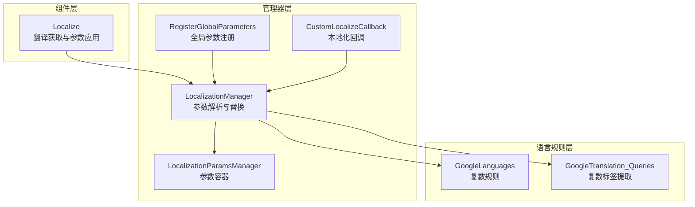
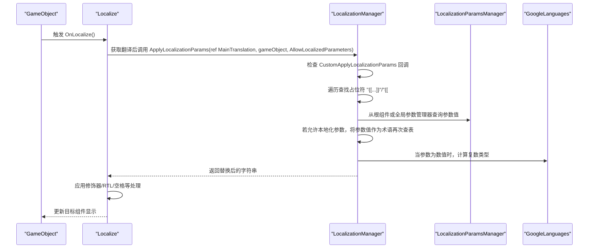
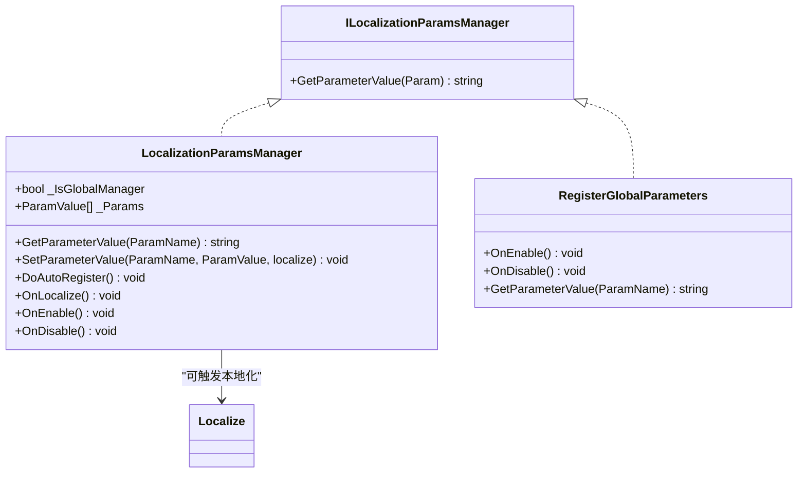
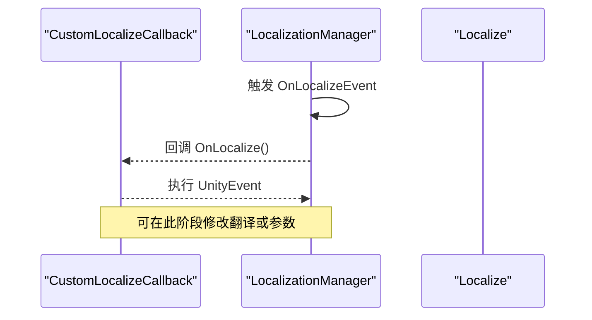
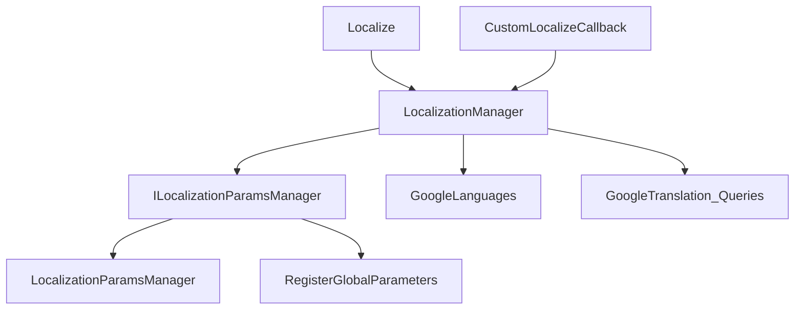

# 参数化文本处理

<cite>
**本文档引用的文件**
- [LocalizationManager_Parameters.cs](file://Assets/TEngine/Runtime/Module/LocalizationModule/Core/Manager/LocalizationManager_Parameters.cs)
- [LocalizationParamsManager.cs](file://Assets/TEngine/Runtime/Module/LocalizationModule/Core/Utils/LocalizationParamsManager.cs)
- [RegisterGlobalParameters.cs](file://Assets/TEngine/Runtime/Module/LocalizationModule/Core/Utils/RegisterGlobalParameters.cs)
- [CustomLocalizeCallback.cs](file://Assets/TEngine/Runtime/Module/LocalizationModule/Core/Utils/CustomLocalizeCallback.cs)
- [Localize.cs](file://Assets/TEngine/Runtime/Module/LocalizationModule/Core/Localize.cs)
- [GoogleLanguages.cs](file://Assets/TEngine/Runtime/Module/LocalizationModule/Core/Google/GoogleLanguages.cs)
- [LocalizationManager.cs](file://Assets/TEngine/Runtime/Module/LocalizationModule/Core/Manager/LocalizationManager.cs)
- [LocalizationManager.cs](file://Assets/TEngine/Runtime/Module/LocalizationModule/LocalizationManager.cs)
- [GoogleTranslation_Queries.cs](file://Assets/TEngine/Runtime/Module/LocalizationModule/Core/Google/GoogleTranslation_Queries.cs)
</cite>

## 目录
1. [简介](#简介)
2. [项目结构](#项目结构)
3. [核心组件](#核心组件)
4. [架构总览](#架构总览)
5. [详细组件分析](#详细组件分析)
6. [依赖关系分析](#依赖关系分析)
7. [性能考虑](#性能考虑)
8. [故障排查指南](#故障排查指南)
9. [结论](#结论)
10. [附录](#附录)

## 简介
本文件面向参数化文本处理的技术文档，聚焦于以下关键能力：
- LocalizedString 的参数化文本实现机制：占位符语法、参数类型识别、动态替换算法与复数规则裁剪。
- LocalizationParamsManager 的参数管理策略：全局参数注册、局部参数覆盖、参数作用域管理。
- CustomLocalizeCallback 的回调机制：自定义处理逻辑、参数传递、结果返回。
- 实际使用示例：复杂格式化、条件判断、动态内容生成。
- 性能优化与错误处理策略。

## 项目结构
围绕参数化文本处理的核心代码位于本地化模块的“Core”目录下，按职责分为：
- 管理器层：负责参数解析、替换、复数规则选择与全局/局部参数作用域管理。
- 工具层：提供参数容器（LocalizationParamsManager）、全局注册工具、回调组件。
- 组件层：Localize 组件在翻译获取后触发参数替换与回调。
- 语言规则层：GoogleLanguages 提供复数规则判定与语言代码映射。



**图表来源**
- [LocalizationManager_Parameters.cs:1-198](file://Assets/TEngine/Runtime/Module/LocalizationModule/Core/Manager/LocalizationManager_Parameters.cs#L1-L198)
- [LocalizationParamsManager.cs:1-90](file://Assets/TEngine/Runtime/Module/LocalizationModule/Core/Utils/LocalizationParamsManager.cs#L1-L90)
- [RegisterGlobalParameters.cs:1-28](file://Assets/TEngine/Runtime/Module/LocalizationModule/Core/Utils/RegisterGlobalParameters.cs#L1-L28)
- [CustomLocalizeCallback.cs:1-27](file://Assets/TEngine/Runtime/Module/LocalizationModule/Core/Utils/CustomLocalizeCallback.cs#L1-L27)
- [Localize.cs:160-254](file://Assets/TEngine/Runtime/Module/LocalizationModule/Core/Localize.cs#L160-L254)
- [GoogleLanguages.cs:1-648](file://Assets/TEngine/Runtime/Module/LocalizationModule/Core/Google/GoogleLanguages.cs#L1-L648)
- [GoogleTranslation_Queries.cs:130-164](file://Assets/TEngine/Runtime/Module/LocalizationModule/Core/Google/GoogleTranslation_Queries.cs#L130-L164)

**章节来源**
- [LocalizationManager_Parameters.cs:1-198](file://Assets/TEngine/Runtime/Module/LocalizationModule/Core/Manager/LocalizationManager_Parameters.cs#L1-L198)
- [LocalizationParamsManager.cs:1-90](file://Assets/TEngine/Runtime/Module/LocalizationModule/Core/Utils/LocalizationParamsManager.cs#L1-L90)
- [RegisterGlobalParameters.cs:1-28](file://Assets/TEngine/Runtime/Module/LocalizationModule/Core/Utils/RegisterGlobalParameters.cs#L1-L28)
- [CustomLocalizeCallback.cs:1-27](file://Assets/TEngine/Runtime/Module/LocalizationModule/Core/Utils/CustomLocalizeCallback.cs#L1-L27)
- [Localize.cs:160-254](file://Assets/TEngine/Runtime/Module/LocalizationModule/Core/Localize.cs#L160-L254)
- [GoogleLanguages.cs:1-648](file://Assets/TEngine/Runtime/Module/LocalizationModule/Core/Google/GoogleLanguages.cs#L1-L648)
- [GoogleTranslation_Queries.cs:130-164](file://Assets/TEngine/Runtime/Module/LocalizationModule/Core/Google/GoogleTranslation_Queries.cs#L130-L164)

## 核心组件
- 参数解析与替换（LocalizationManager）
  - 支持三种调用入口：全局、以 GameObject 为根的作用域、显式字典参数。
  - 自定义回调支持：允许外部接管替换流程，返回 true 表示跳过默认替换。
  - 占位符语法：{[param]} 与 {[#param]}（带 # 表示数值参数，用于复数规则）。
  - 参数来源优先级：GameObject 根组件（启用且实现 ILocalizationParamsManager）> 全局参数管理器列表 > 字典参数。
  - 可选本地化参数：若允许，参数值本身可作为术语再次查表本地化。
  - 复数规则裁剪：根据当前语言与数值参数选择对应复数段落。
- 参数容器（LocalizationParamsManager）
  - 实现 ILocalizationParamsManager 接口，提供按名称查询参数值。
  - 支持全局/本地两种模式：全局模式自动注册并触发全量本地化。
  - 提供设置参数值的便捷方法，并可选择是否触发本地化。
- 回调组件（CustomLocalizeCallback）
  - 订阅 LocalizationManager.OnLocalizeEvent，在每次本地化事件触发时执行 UnityEvent。
- 组件集成（Localize）
  - 在翻译获取后，若允许参数，则调用 LocalizationManager.ApplyLocalizationParams 应用参数。
  - 支持主次术语修改器、RTL 处理、空格插入等扩展处理。
- 语言规则（GoogleLanguages）
  - 提供 GetPluralType 判定与语言代码映射，支撑复数规则裁剪。

**章节来源**
- [LocalizationManager_Parameters.cs:40-141](file://Assets/TEngine/Runtime/Module/LocalizationModule/Core/Manager/LocalizationManager_Parameters.cs#L40-L141)
- [LocalizationParamsManager.cs:12-90](file://Assets/TEngine/Runtime/Module/LocalizationModule/Core/Utils/LocalizationParamsManager.cs#L12-L90)
- [CustomLocalizeCallback.cs:7-26](file://Assets/TEngine/Runtime/Module/LocalizationModule/Core/Utils/CustomLocalizeCallback.cs#L7-L26)
- [Localize.cs:191-196](file://Assets/TEngine/Runtime/Module/LocalizationModule/Core/Localize.cs#L191-L196)
- [GoogleLanguages.cs:524-613](file://Assets/TEngine/Runtime/Module/LocalizationModule/Core/Google/GoogleLanguages.cs#L524-L613)

## 架构总览
参数化文本处理的关键流程如下：



**图表来源**
- [Localize.cs:191-196](file://Assets/TEngine/Runtime/Module/LocalizationModule/Core/Localize.cs#L191-L196)
- [LocalizationManager_Parameters.cs:62-141](file://Assets/TEngine/Runtime/Module/LocalizationModule/Core/Manager/LocalizationManager_Parameters.cs#L62-L141)
- [LocalizationParamsManager.cs:26-35](file://Assets/TEngine/Runtime/Module/LocalizationModule/Core/Utils/LocalizationParamsManager.cs#L26-L35)
- [GoogleLanguages.cs:524-613](file://Assets/TEngine/Runtime/Module/LocalizationModule/Core/Google/GoogleLanguages.cs#L524-L613)

## 详细组件分析

### 参数解析与替换算法（LocalizationManager）
- 占位符语法
  - 标准参数：{[param]}，其中 param 为参数名。
  - 数值参数：{[#param]}，用于触发复数规则裁剪。
- 参数来源与优先级
  - 根组件（MonoBehaviour）：遍历当前 GameObject 上启用的组件，寻找实现 ILocalizationParamsManager 的实例，按顺序查询。
  - 全局参数管理器：遍历静态列表 ParamManagers，按添加顺序查询。
  - 字典参数：传入 Dictionary<string, object> 时，按名称匹配。
- 替换策略
  - 子参数嵌套：若发现内部还有占位符，先跳过外层，优先处理内层。
  - 本地化参数：当允许时，若参数值本身是术语，会再次查表得到当前语言的翻译。
  - 数值参数：尝试解析为整数，若成功则记录复数类型。
- 复数规则裁剪
  - 使用 GoogleLanguages.GetPluralType 判定当前语言的复数类型。
  - 在翻译中查找形如 [i2p_type] 的段落标记，裁剪出对应类型的文本片段。
  - 若未找到指定类型标记，回退到第一个 [i2p_] 片段。

```mermaid
flowchart TD
Start(["进入 ApplyLocalizationParams"]) --> CheckCB["检查 CustomApplyLocalizationParams 回调"]
CheckCB --> Skip{"回调返回 true？"}
Skip --> |是| End(["结束"])
Skip --> |否| Loop["循环扫描占位符"]
Loop --> Found{"找到 "{[...]} 或 "{[#...]}""？"}
Found --> |否| End
Found --> Parse["解析参数名与偏移"]
Parse --> GetVal["从根组件/全局/字典获取参数值"]
GetVal --> ValNull{"值为空？"}
ValNull --> |是| Next["跳过并继续扫描"]
ValNull --> |否| Localized{"允许本地化参数？"}
Localized --> |是| TermCheck["若值为术语则查表本地化"]
Localized --> |否| Replace["替换占位符为参数值"]
TermCheck --> Replace
Replace --> NumCheck{"参数值为数值？"}
NumCheck --> |是| Record["记录复数类型"]
NumCheck --> |否| Continue["继续替换"]
Record --> Continue
Continue --> Loop
End --> Plural["若存在复数类型，裁剪 [i2p_type] 片段"]
Plural --> End
```

**图表来源**
- [LocalizationManager_Parameters.cs:62-141](file://Assets/TEngine/Runtime/Module/LocalizationModule/Core/Manager/LocalizationManager_Parameters.cs#L62-L141)
- [GoogleLanguages.cs:524-613](file://Assets/TEngine/Runtime/Module/LocalizationModule/Core/Google/GoogleLanguages.cs#L524-L613)
- [GoogleTranslation_Queries.cs:146-164](file://Assets/TEngine/Runtime/Module/LocalizationModule/Core/Google/GoogleTranslation_Queries.cs#L146-L164)

**章节来源**
- [LocalizationManager_Parameters.cs:62-141](file://Assets/TEngine/Runtime/Module/LocalizationModule/Core/Manager/LocalizationManager_Parameters.cs#L62-L141)
- [GoogleLanguages.cs:524-613](file://Assets/TEngine/Runtime/Module/LocalizationModule/Core/Google/GoogleLanguages.cs#L524-L613)
- [GoogleTranslation_Queries.cs:130-164](file://Assets/TEngine/Runtime/Module/LocalizationModule/Core/Google/GoogleTranslation_Queries.cs#L130-L164)

### 参数容器与作用域（LocalizationParamsManager 与 RegisterGlobalParameters）
- ILocalizationParamsManager 接口
  - GetParameterValue(string)：按名称返回参数值。
- LocalizationParamsManager
  - 内部存储 List<ParamValue>，支持设置参数值并可选择触发本地化。
  - _IsGlobalManager：全局模式下自动注册至静态列表并触发全量本地化。
  - OnEnable/OnDisable：生命周期内自动加入/移除参数管理器列表。
- RegisterGlobalParameters
  - 空实现，便于快速注册为全局参数源。



**图表来源**
- [LocalizationParamsManager.cs:7-90](file://Assets/TEngine/Runtime/Module/LocalizationModule/Core/Utils/LocalizationParamsManager.cs#L7-L90)
- [RegisterGlobalParameters.cs:6-27](file://Assets/TEngine/Runtime/Module/LocalizationModule/Core/Utils/RegisterGlobalParameters.cs#L6-L27)

**章节来源**
- [LocalizationParamsManager.cs:12-90](file://Assets/TEngine/Runtime/Module/LocalizationModule/Core/Utils/LocalizationParamsManager.cs#L12-L90)
- [RegisterGlobalParameters.cs:6-27](file://Assets/TEngine/Runtime/Module/LocalizationModule/Core/Utils/RegisterGlobalParameters.cs#L6-L27)

### 回调机制（CustomLocalizeCallback）
- 订阅 LocalizationManager.OnLocalizeEvent，当本地化事件发生时触发 UnityEvent。
- 适合在参数替换前进行二次加工或注入动态数据。



**图表来源**
- [CustomLocalizeCallback.cs:11-25](file://Assets/TEngine/Runtime/Module/LocalizationModule/Core/Utils/CustomLocalizeCallback.cs#L11-L25)

**章节来源**
- [CustomLocalizeCallback.cs:7-26](file://Assets/TEngine/Runtime/Module/LocalizationModule/Core/Utils/CustomLocalizeCallback.cs#L7-L26)

### 组件集成（Localize）
- 在翻译获取后，若 AllowParameters 为真，调用 LocalizationManager.ApplyLocalizationParams 对主翻译进行参数替换。
- 支持术语修改器（大小写/标题化）、前缀/后缀、RTL 处理、空格插入等。

**章节来源**
- [Localize.cs:191-196](file://Assets/TEngine/Runtime/Module/LocalizationModule/Core/Localize.cs#L191-L196)

## 依赖关系分析
- Localize 依赖 LocalizationManager 进行翻译获取与参数替换。
- LocalizationManager 依赖：
  - ILocalizationParamsManager（参数来源）
  - GoogleLanguages（复数规则）
  - GoogleTranslation_Queries（复数标签提取）
- LocalizationParamsManager 与 RegisterGlobalParameters 实现参数容器与注册逻辑。
- CustomLocalizeCallback 通过事件订阅参与参数替换前的处理。



**图表来源**
- [Localize.cs:191-196](file://Assets/TEngine/Runtime/Module/LocalizationModule/Core/Localize.cs#L191-L196)
- [LocalizationManager_Parameters.cs:13-19](file://Assets/TEngine/Runtime/Module/LocalizationModule/Core/Manager/LocalizationManager_Parameters.cs#L13-L19)
- [LocalizationParamsManager.cs:7-10](file://Assets/TEngine/Runtime/Module/LocalizationModule/Core/Utils/LocalizationParamsManager.cs#L7-L10)
- [RegisterGlobalParameters.cs:6-10](file://Assets/TEngine/Runtime/Module/LocalizationModule/Core/Utils/RegisterGlobalParameters.cs#L6-L10)
- [CustomLocalizeCallback.cs:11-14](file://Assets/TEngine/Runtime/Module/LocalizationModule/Core/Utils/CustomLocalizeCallback.cs#L11-L14)
- [GoogleLanguages.cs:524-613](file://Assets/TEngine/Runtime/Module/LocalizationModule/Core/Google/GoogleLanguages.cs#L524-L613)
- [GoogleTranslation_Queries.cs:146-164](file://Assets/TEngine/Runtime/Module/LocalizationModule/Core/Google/GoogleTranslation_Queries.cs#L146-L164)

**章节来源**
- [Localize.cs:191-196](file://Assets/TEngine/Runtime/Module/LocalizationModule/Core/Localize.cs#L191-L196)
- [LocalizationManager_Parameters.cs:13-19](file://Assets/TEngine/Runtime/Module/LocalizationModule/Core/Manager/LocalizationManager_Parameters.cs#L13-L19)
- [LocalizationParamsManager.cs:7-10](file://Assets/TEngine/Runtime/Module/LocalizationModule/Core/Utils/LocalizationParamsManager.cs#L7-L10)
- [RegisterGlobalParameters.cs:6-10](file://Assets/TEngine/Runtime/Module/LocalizationModule/Core/Utils/RegisterGlobalParameters.cs#L6-L10)
- [CustomLocalizeCallback.cs:11-14](file://Assets/TEngine/Runtime/Module/LocalizationModule/Core/Utils/CustomLocalizeCallback.cs#L11-L14)
- [GoogleLanguages.cs:524-613](file://Assets/TEngine/Runtime/Module/LocalizationModule/Core/Google/GoogleLanguages.cs#L524-L613)
- [GoogleTranslation_Queries.cs:146-164](file://Assets/TEngine/Runtime/Module/LocalizationModule/Core/Google/GoogleTranslation_Queries.cs#L146-L164)

## 性能考虑
- 时间复杂度
  - 占位符扫描：O(n)（n 为翻译长度），每次替换为 O(n) 字符串操作。
  - 参数查询：根组件遍历 O(k)，全局列表遍历 O(m)，k 与 m 通常较小。
  - 复数规则：O(1)，查表与常数分支。
- 空间复杂度
  - 主要为字符串替换产生的中间副本，空间开销与替换次数和参数长度相关。
- 优化建议
  - 尽量减少深层嵌套的参数占位符，避免重复扫描。
  - 合理使用全局参数管理器，避免过多全局实例导致查询链路变长。
  - 对频繁使用的参数值进行缓存（可在业务层实现）。
  - 在编辑器预览时谨慎使用大量参数替换，避免卡顿。
  - 复数规则仅在参数为数值时触发，避免对非数值参数做无谓计算。

[本节为通用性能指导，无需特定文件引用]

## 故障排查指南
- 占位符未生效
  - 检查 Localize 的 AllowParameters 与 AllowLocalizedParameters 是否开启。
  - 确认参数名与参数容器中的名称一致（区分大小写）。
  - 若参数值本身是术语，请确认术语存在且当前语言有翻译。
- 嵌套参数异常
  - 确保内部参数占位符正确闭合，避免遗漏 "]"。
- 复数规则未裁剪
  - 确认使用了 "{[#param]}" 语法且参数值可解析为整数。
  - 确认翻译中包含正确的 [i2p_type] 标记。
- 回调未触发
  - 确认 CustomLocalizeCallback 已挂载且未被禁用。
  - 确认 LocalizationManager.OnLocalizeEvent 事件未被其他逻辑清理。

**章节来源**
- [Localize.cs:62-63](file://Assets/TEngine/Runtime/Module/LocalizationModule/Core/Localize.cs#L62-L63)
- [LocalizationManager_Parameters.cs:97-119](file://Assets/TEngine/Runtime/Module/LocalizationModule/Core/Manager/LocalizationManager_Parameters.cs#L97-L119)
- [GoogleTranslation_Queries.cs:146-164](file://Assets/TEngine/Runtime/Module/LocalizationModule/Core/Google/GoogleTranslation_Queries.cs#L146-L164)
- [CustomLocalizeCallback.cs:11-25](file://Assets/TEngine/Runtime/Module/LocalizationModule/Core/Utils/CustomLocalizeCallback.cs#L11-L25)

## 结论
本方案通过清晰的占位符语法、灵活的参数来源与作用域管理、以及可插拔的回调机制，实现了高效、可扩展的参数化文本处理。结合复数规则裁剪与语言规则支持，能够满足多语言环境下的复杂文本格式化需求。建议在实际工程中：
- 明确参数来源与作用域边界，避免全局参数污染局部上下文。
- 在回调中尽量保持轻量逻辑，避免阻塞主线程。
- 对高频替换场景进行缓存与批量化处理，提升性能。

[本节为总结性内容，无需特定文件引用]

## 附录

### 实际使用示例（步骤说明）
- 基础参数替换
  - 在 Localize 组件上设置术语，翻译中使用 "{[name]}"。
  - 在 GameObject 上挂载 LocalizationParamsManager，添加名为 "name" 的参数项。
  - 运行时将自动替换为参数值。
- 数值参数与复数规则
  - 翻译中使用 "{[#count]}"，并在翻译中提供多个 [i2p_...] 片段。
  - 设置参数 "count" 为整数，系统根据当前语言规则裁剪对应片段。
- 局部覆盖与全局参数
  - 在 Localize 所在 GameObject 上挂载 LocalizationParamsManager，实现局部参数覆盖。
  - 在场景全局挂载 RegisterGlobalParameters 或设置 _IsGlobalManager，实现全局参数共享。
- 回调二次加工
  - 在 CustomLocalizeCallback 中订阅 OnLocalize 事件，进行额外的字符串加工或注入动态数据。

**章节来源**
- [Localize.cs:191-196](file://Assets/TEngine/Runtime/Module/LocalizationModule/Core/Localize.cs#L191-L196)
- [LocalizationParamsManager.cs:26-54](file://Assets/TEngine/Runtime/Module/LocalizationModule/Core/Utils/LocalizationParamsManager.cs#L26-L54)
- [RegisterGlobalParameters.cs:10-13](file://Assets/TEngine/Runtime/Module/LocalizationModule/Core/Utils/RegisterGlobalParameters.cs#L10-L13)
- [CustomLocalizeCallback.cs:11-25](file://Assets/TEngine/Runtime/Module/LocalizationModule/Core/Utils/CustomLocalizeCallback.cs#L11-L25)
- [GoogleLanguages.cs:524-613](file://Assets/TEngine/Runtime/Module/LocalizationModule/Core/Google/GoogleLanguages.cs#L524-L613)