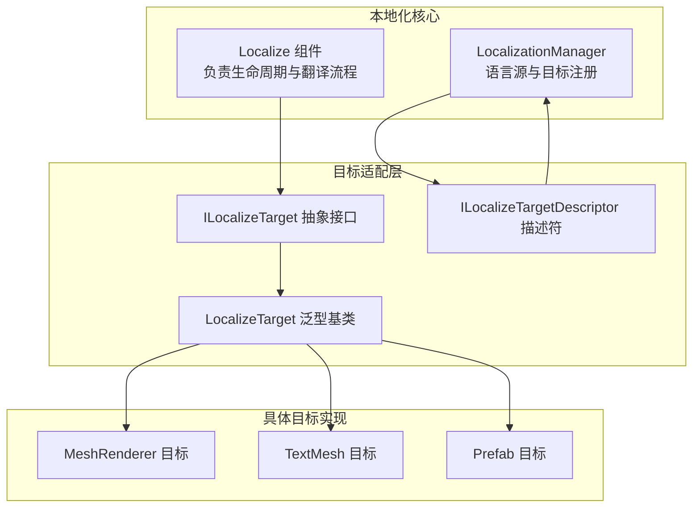
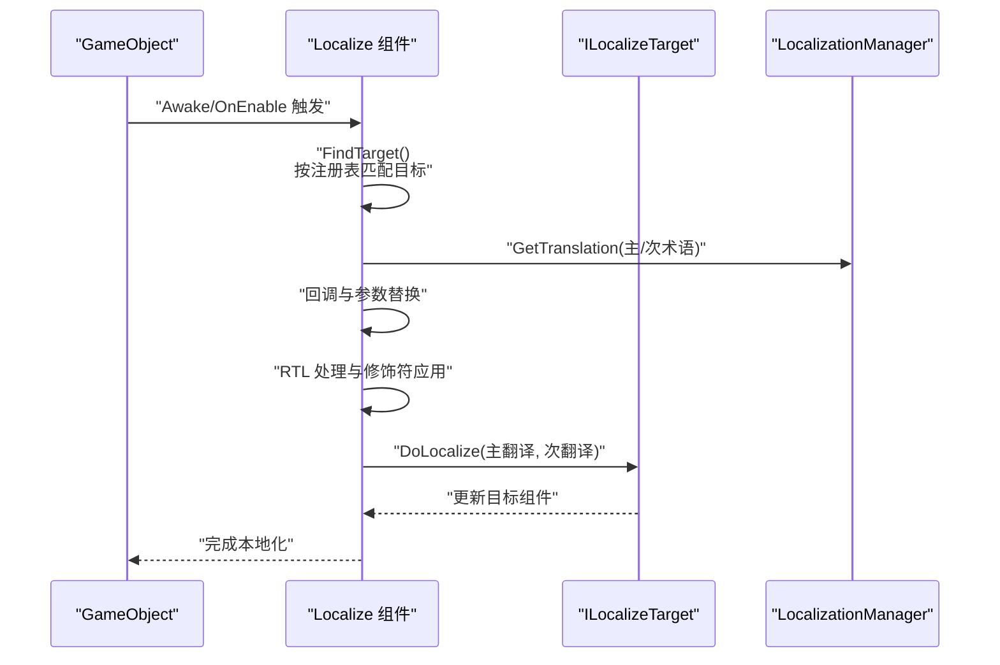
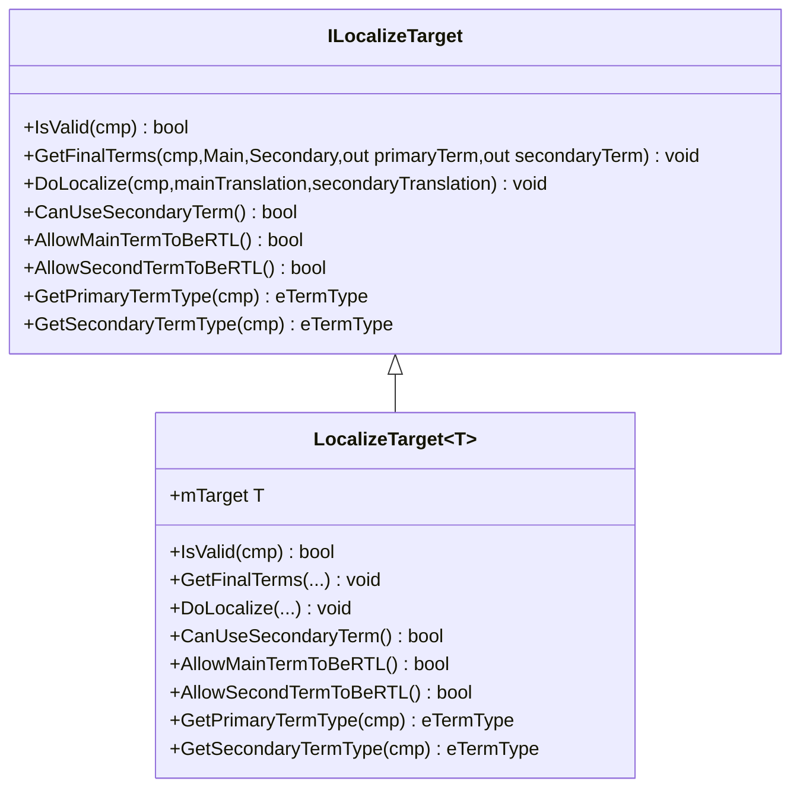
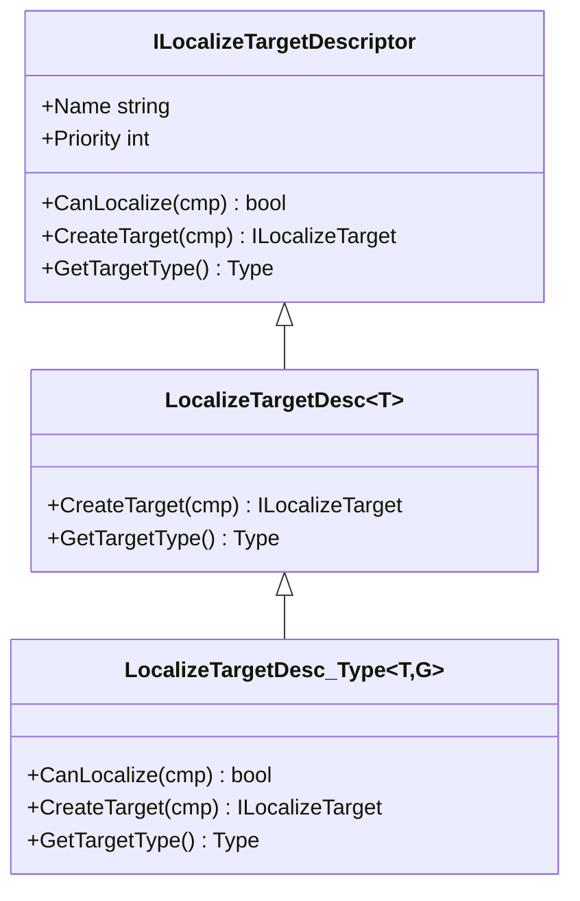
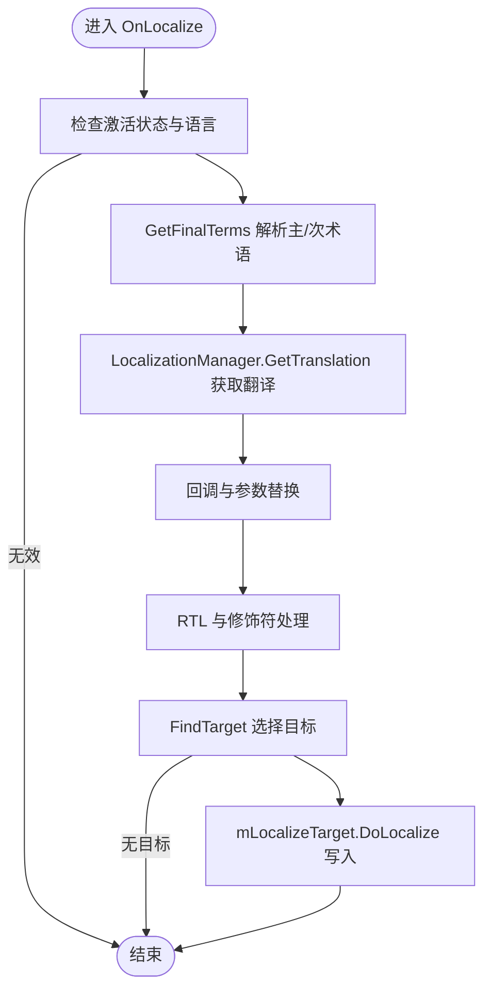
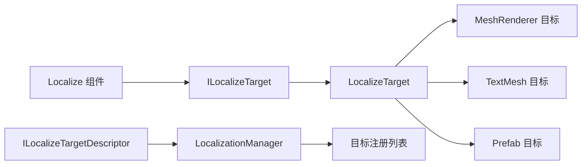

# 本地化目标适配器

<cite>
**本文引用的文件**
- [ILocalizeTarget.cs](file://Assets/TEngine/Runtime/Module/LocalizationModule/Core/Targets/ILocalizeTarget.cs)
- [ILocalizeTargetDesc.cs](file://Assets/TEngine/Runtime/Module/LocalizationModule/Core/Targets/ILocalizeTargetDesc.cs)
- [Localize.cs](file://Assets/TEngine/Runtime/Module/LocalizationModule/Core/Localize.cs)
- [LocalizationManager_Targets.cs](file://Assets/TEngine/Runtime/Module/LocalizationModule/Core/Manager/LocalizationManager_Targets.cs)
- [LocalizeTarget_UnityStandard_MeshRenderer.cs](file://Assets/TEngine/Runtime/Module/LocalizationModule/Core/Targets/LocalizeTarget_UnityStandard_MeshRenderer.cs)
- [LocalizeTarget_UnityStandard_TextMesh.cs](file://Assets/TEngine/Runtime/Module/LocalizationModule/Core/Targets/LocalizeTarget_UnityStandard_TextMesh.cs)
- [LocalizeTarget_UnityStandard_Prefab.cs](file://Assets/TEngine/Runtime/Module/LocalizationModule/Core/Targets/LocalizeTarget_UnityStandard_Prefab.cs)
- [LocalizationManager.cs](file://Assets/TEngine/Runtime/Module/LocalizationModule/Core/Manager/LocalizationManager.cs)
</cite>

## 目录
1. [简介](#简介)
2. [项目结构](#项目结构)
3. [核心组件](#核心组件)
4. [架构总览](#架构总览)
5. [详细组件分析](#详细组件分析)
6. [依赖关系分析](#依赖关系分析)
7. [性能考量](#性能考量)
8. [故障排查指南](#故障排查指南)
9. [结论](#结论)
10. [附录：自定义本地化目标类型开发指南](#附录自定义本地化目标类型开发指南)

## 简介
本文件系统性解析本地化目标适配器的技术设计与实现，围绕 ILocalizeTarget 抽象接口及其 LocalizeTarget 泛型基类展开，详细说明 IsValid 验证、GetFinalTerms 术语提取、DoLocalize 本地化执行三大核心方法的工作机制；并结合 Localize 组件的生命周期与 LocalizationManager 的目标注册体系，完整呈现术语解析、翻译应用、RTL 处理、对象资源定位等流程。同时给出 UnityUI 文本/图像、TextMeshPro、Unity 标准组件（TextMesh/MeshRenderer/Prefab）等目标类型的适配方案，并提供自定义目标类型的开发指南与最佳实践。

## 项目结构
本地化目标适配器位于模块目录下，采用“接口 + 描述符 + 具体目标 + 注册管理”的分层组织方式：
- 接口层：ILocalizeTarget 定义统一的目标适配协议
- 描述符层：ILocalizeTargetDescriptor 及其泛型派生，负责目标识别与实例化
- 实现层：各具体目标类型（如 UnityStandard 文本/图像/网格渲染器等）
- 管理层：LocalizationManager 提供目标注册、语言源管理、翻译获取等能力

图表来源
- [Localize.cs:107-297](file://Assets/TEngine/Runtime/Module/LocalizationModule/Core/Localize.cs#L107-L297)
- [ILocalizeTarget.cs:5-35](file://Assets/TEngine/Runtime/Module/LocalizationModule/Core/Targets/ILocalizeTarget.cs#L5-L35)
- [ILocalizeTargetDesc.cs:7-41](file://Assets/TEngine/Runtime/Module/LocalizationModule/Core/Targets/ILocalizeTargetDesc.cs#L7-L41)
- [LocalizationManager_Targets.cs:14-28](file://Assets/TEngine/Runtime/Module/LocalizationModule/Core/Manager/LocalizationManager_Targets.cs#L14-L28)

章节来源
- [Localize.cs:107-297](file://Assets/TEngine/Runtime/Module/LocalizationModule/Core/Localize.cs#L107-L297)
- [ILocalizeTarget.cs:5-35](file://Assets/TEngine/Runtime/Module/LocalizationModule/Core/Targets/ILocalizeTarget.cs#L5-L35)
- [ILocalizeTargetDesc.cs:7-41](file://Assets/TEngine/Runtime/Module/LocalizationModule/Core/Targets/ILocalizeTargetDesc.cs#L7-L41)
- [LocalizationManager_Targets.cs:14-28](file://Assets/TEngine/Runtime/Module/LocalizationModule/Core/Manager/LocalizationManager_Targets.cs#L14-L28)

## 核心组件
- ILocalizeTarget 抽象接口：定义 IsValid、GetFinalTerms、DoLocalize、CanUseSecondaryTerm、AllowMainTermToBeRTL、AllowSecondTermToBeRTL、GetPrimaryTermType、GetSecondaryTermType 等方法，作为所有目标适配器的契约。
- LocalizeTarget<T> 泛型基类：封装目标组件的自动查找与有效性校验逻辑，确保目标组件仍属于当前 Localize 所在 GameObject。
- ILocalizeTargetDescriptor 描述符：声明 CanLocalize、CreateTarget、GetTargetType 等方法，用于描述目标类型的能力与实例化策略。
- LocalizeTargetDesc_Type<T,G>：基于组件类型 T 自动绑定到具体目标 G，实现“按组件存在性”进行目标选择。
- Localize 组件：负责术语解析、翻译获取、回调与参数替换、RTL 处理、最终调用目标 DoLocalize。
- LocalizationManager：维护目标注册列表、语言源、翻译查询与编辑器生命周期事件。

章节来源
- [ILocalizeTarget.cs:5-35](file://Assets/TEngine/Runtime/Module/LocalizationModule/Core/Targets/ILocalizeTarget.cs#L5-L35)
- [ILocalizeTargetDesc.cs:7-41](file://Assets/TEngine/Runtime/Module/LocalizationModule/Core/Targets/ILocalizeTargetDesc.cs#L7-L41)
- [Localize.cs:107-297](file://Assets/TEngine/Runtime/Module/LocalizationModule/Core/Localize.cs#L107-L297)
- [LocalizationManager_Targets.cs:14-28](file://Assets/TEngine/Runtime/Module/LocalizationModule/Core/Manager/LocalizationManager_Targets.cs#L14-L28)

## 架构总览
本地化流程从 Localize 组件开始，经过术语提取、翻译获取、回调与参数替换、RTL 处理，最终委派给 ILocalizeTarget.DoLocalize 完成对具体目标的更新。目标选择通过描述符与注册表完成，支持优先级排序与按组件类型自动匹配。

图表来源
- [Localize.cs:160-254](file://Assets/TEngine/Runtime/Module/LocalizationModule/Core/Localize.cs#L160-L254)
- [Localize.cs:258-297](file://Assets/TEngine/Runtime/Module/LocalizationModule/Core/Localize.cs#L258-L297)
- [ILocalizeTarget.cs:7-16](file://Assets/TEngine/Runtime/Module/LocalizationModule/Core/Targets/ILocalizeTarget.cs#L7-L16)

## 详细组件分析

### ILocalizeTarget 抽象接口与 LocalizeTarget<T> 泛型基类
- 设计理念
  - 将“目标组件类型”与“适配逻辑”解耦：通过泛型参数约束目标组件类型，基类统一处理组件查找与有效性校验。
  - 明确职责边界：Localize 负责翻译流程与上下文，ILocalizeTarget 仅负责将翻译结果写入目标组件。
- 核心方法
  - IsValid：校验目标组件是否仍属于当前 Localize 所在 GameObject，必要时重新查找。
  - GetFinalTerms：根据主/次术语与目标特性，输出最终使用的术语（主术语通常为文本，次术语可为字体/材质等）。
  - DoLocalize：执行实际的本地化写入，可能涉及资源加载、对象替换、对齐调整等。
  - 修饰与特性：CanUseSecondaryTerm、AllowMainTermToBeRTL、AllowSecondTermToBeRTL、GetPrimaryTermType、GetSecondaryTermType 等，用于控制翻译行为与术语类型。

图表来源
- [ILocalizeTarget.cs:5-35](file://Assets/TEngine/Runtime/Module/LocalizationModule/Core/Targets/ILocalizeTarget.cs#L5-L35)

章节来源
- [ILocalizeTarget.cs:5-35](file://Assets/TEngine/Runtime/Module/LocalizationModule/Core/Targets/ILocalizeTarget.cs#L5-L35)

### ILocalizeTargetDescriptor 描述符与注册机制
- 描述符职责
  - Name：目标名称（用于调试与匹配）
  - Priority：优先级，影响目标选择顺序
  - CanLocalize：判断当前 Localize 是否具备该目标所需的组件
  - CreateTarget：创建具体目标实例，并注入已找到的目标组件
  - GetTargetType：返回目标类型，便于按类型精确匹配
- LocalizeTargetDesc_Type<T,G>：以组件类型 T 为依据，若 Localize 上存在该组件则创建目标 G 的实例，并将组件赋值给 mTarget
- 注册入口
  - LocalizationManager.RegisterTarget：去重插入，按优先级排序，保证高优先级目标优先被选择

图表来源
- [ILocalizeTargetDesc.cs:7-41](file://Assets/TEngine/Runtime/Module/LocalizationModule/Core/Targets/ILocalizeTargetDesc.cs#L7-L41)
- [LocalizationManager_Targets.cs:14-28](file://Assets/TEngine/Runtime/Module/LocalizationModule/Core/Manager/LocalizationManager_Targets.cs#L14-L28)

章节来源
- [ILocalizeTargetDesc.cs:7-41](file://Assets/TEngine/Runtime/Module/LocalizationModule/Core/Targets/ILocalizeTargetDesc.cs#L7-L41)
- [LocalizationManager_Targets.cs:14-28](file://Assets/TEngine/Runtime/Module/LocalizationModule/Core/Manager/LocalizationManager_Targets.cs#L14-L28)

### Localize 组件的本地化执行流程
- 生命周期与触发
  - Awake/OnEnable：初始化资产字典、查找目标、按需本地化
  - OnLocalize：核心流程入口，包含术语解析、翻译获取、回调与参数替换、RTL 处理、最终调用目标 DoLocalize
- 术语解析与翻译
  - GetFinalTerms：若目标可用，则由目标适配器决定主/次术语；否则回退到 Localize 自身字段
  - 翻译获取：通过 LocalizationManager.GetTranslation 获取主/次翻译
  - 回调与参数：支持 UnityEvent 与旧版回调，允许脚本修改翻译或注入参数
  - RTL 与修饰：根据语言方向与目标允许性应用 RTL 修复与大小写/前后缀修饰
- 目标选择
  - FindTarget：优先复用已有目标（若 IsValid 成立），否则按名称精确匹配，最后遍历注册表按优先级尝试

图表来源
- [Localize.cs:160-254](file://Assets/TEngine/Runtime/Module/LocalizationModule/Core/Localize.cs#L160-L254)
- [Localize.cs:258-297](file://Assets/TEngine/Runtime/Module/LocalizationModule/Core/Localize.cs#L258-L297)

章节来源
- [Localize.cs:160-254](file://Assets/TEngine/Runtime/Module/LocalizationModule/Core/Localize.cs#L160-L254)
- [Localize.cs:258-297](file://Assets/TEngine/Runtime/Module/LocalizationModule/Core/Localize.cs#L258-L297)

### 具体目标类型实现与适配方案

#### Unity 标准网格渲染器（MeshRenderer）
- 术语类型：主术语为网格（Mesh），次术语为材质（Material）
- 行为特性：允许主术语 RTL，不允许次术语 RTL
- 术语提取：从 MeshFilter.sharedMesh 与 MeshRenderer.sharedMaterial 获取路径或名称
- 本地化执行：优先尝试从翻译中解析出次术语（材质），否则使用主术语（网格）；通过资源管理器查找并替换

章节来源
- [LocalizeTarget_UnityStandard_MeshRenderer.cs:12-79](file://Assets/TEngine/Runtime/Module/LocalizationModule/Core/Targets/LocalizeTarget_UnityStandard_MeshRenderer.cs#L12-L79)

#### Unity 标准 TextMesh
- 术语类型：主术语为文本（Text），次术语为字体（Font）
- 行为特性：允许主术语 RTL，不允许次术语 RTL
- 术语提取：直接使用 TextMesh.text 与 font.name
- 本地化执行：先替换字体（含材质同步），再设置文本；RTL 时根据对齐策略切换左右对齐

章节来源
- [LocalizeTarget_UnityStandard_TextMesh.cs:12-67](file://Assets/TEngine/Runtime/Module/LocalizationModule/Core/Targets/LocalizeTarget_UnityStandard_TextMesh.cs#L12-L67)

#### Unity 标准 Prefab
- 术语类型：主术语为 GameObject 名称，不使用次术语
- 行为特性：始终有效（IsValid 总是返回真），允许主术语 RTL，不允许次术语 RTL
- 术语提取：使用 Localize 组件所在 GameObject 的名称
- 本地化执行：根据主术语实例化新 Prefab，替换当前子节点，保持位置/旋转一致

章节来源
- [LocalizeTarget_UnityStandard_Prefab.cs:17-96](file://Assets/TEngine/Runtime/Module/LocalizationModule/Core/Targets/LocalizeTarget_UnityStandard_Prefab.cs#L17-L96)

## 依赖关系分析
- Localize 依赖 ILocalizeTarget 与 LocalizationManager
- ILocalizeTarget 由具体目标实现类扩展
- 描述符通过 LocalizationManager.RegisterTarget 注册，形成目标选择链
- 具体目标在静态构造函数中完成自动注册，确保运行时优先级有序

图表来源
- [Localize.cs:102-105](file://Assets/TEngine/Runtime/Module/LocalizationModule/Core/Localize.cs#L102-L105)
- [ILocalizeTarget.cs:5-35](file://Assets/TEngine/Runtime/Module/LocalizationModule/Core/Targets/ILocalizeTarget.cs#L5-L35)
- [ILocalizeTargetDesc.cs:7-41](file://Assets/TEngine/Runtime/Module/LocalizationModule/Core/Targets/ILocalizeTargetDesc.cs#L7-L41)
- [LocalizationManager_Targets.cs:14-28](file://Assets/TEngine/Runtime/Module/LocalizationModule/Core/Manager/LocalizationManager_Targets.cs#L14-L28)

章节来源
- [Localize.cs:102-105](file://Assets/TEngine/Runtime/Module/LocalizationModule/Core/Localize.cs#L102-L105)
- [ILocalizeTarget.cs:5-35](file://Assets/TEngine/Runtime/Module/LocalizationModule/Core/Targets/ILocalizeTarget.cs#L5-L35)
- [ILocalizeTargetDesc.cs:7-41](file://Assets/TEngine/Runtime/Module/LocalizationModule/Core/Targets/ILocalizeTargetDesc.cs#L7-L41)
- [LocalizationManager_Targets.cs:14-28](file://Assets/TEngine/Runtime/Module/LocalizationModule/Core/Manager/LocalizationManager_Targets.cs#L14-L28)

## 性能考量
- 目标查找与缓存
  - LocalizeTarget<T>.IsValid 在每次使用前校验目标组件归属，避免跨对象误用；若为空则通过 GetComponent<T>() 重新查找，减少重复查找成本
- 术语解析与翻译
  - GetFinalTerms 仅在首次缺失时计算，后续复用 FinalTerm/FinalSecondaryTerm
  - 翻译获取与参数替换在回调阶段进行，避免不必要的二次处理
- 资源定位
  - 通过 TranslatedObjects 与 mAssetDictionary 建立名称到对象的映射，降低重复查找开销
- RTL 处理
  - 仅在语言为 RTL 且目标允许时才进行 RTL 修复与对齐调整，避免无谓计算

[本节为通用性能建议，无需特定文件引用]

## 故障排查指南
- 目标未生效
  - 检查 Localize 是否正确挂载于包含目标组件的 GameObject
  - 确认目标描述符是否已注册且优先级合理
  - 使用 HighlightLocalizedTargets 模式在 UI 上标记已本地化的项以便定位
- 术语为空或无效
  - 若 GetFinalTerms 返回空，确认目标组件是否存在以及术语提取逻辑是否正确
  - 检查 Localize 的 Term/SecondaryTerm 字段是否覆盖了目标默认提取
- 翻译未替换
  - 确认当前语言已设置且 LocalizationManager 已初始化
  - 检查回调/参数替换是否意外清空了翻译内容
- 资源未替换
  - 确认资源名称与术语一致，且资源存在于 TranslatedObjects 或资源系统中
  - 对于 MeshRenderer/Prefab 等，确认次术语（材质/预制体）解析逻辑是否被主术语覆盖

章节来源
- [Localize.cs:160-254](file://Assets/TEngine/Runtime/Module/LocalizationModule/Core/Localize.cs#L160-L254)
- [Localize.cs:396-506](file://Assets/TEngine/Runtime/Module/LocalizationModule/Core/Localize.cs#L396-L506)
- [LocalizationManager.cs:16-34](file://Assets/TEngine/Runtime/Module/LocalizationModule/Core/Manager/LocalizationManager.cs#L16-L34)

## 结论
本地化目标适配器通过清晰的接口与描述符机制，实现了对多种 Unity 组件的统一本地化支持。Localize 组件聚焦翻译流程与上下文处理，ILocalizeTarget 则专注于目标写入细节。借助注册表与优先级机制，系统可在复杂场景中稳定选择最合适的适配器，满足多平台、多组件类型的本地化需求。

[本节为总结性内容，无需特定文件引用]

## 附录：自定义本地化目标类型开发指南
- 步骤一：定义目标类型与描述符
  - 新建类继承 LocalizeTarget<T>，实现 IsValid、GetFinalTerms、DoLocalize 与特性方法
  - 在静态构造函数中调用 AutoRegister，并通过 LocalizeTargetDesc_Type<T,G> 注册目标，设置 Name 与 Priority
- 步骤二：实现术语提取与写入
  - GetFinalTerms：根据目标组件状态与 Localize 的主/次术语，输出最终使用的术语
  - DoLocalize：执行资源查找与替换、文本写入、对齐/RTL 处理等
- 步骤三：控制翻译行为
  - 通过 AllowMainTermToBeRTL/AllowSecondTermToBeRTL 控制 RTL 应用范围
  - 通过 CanUseSecondaryTerm 控制是否启用次术语
  - 通过 GetPrimaryTermType/GetSecondaryTermType 指定术语类型，便于语言源与工具链识别
- 步骤四：集成与测试
  - 确保 AutoRegister 在场景加载前执行，避免遗漏注册
  - 在编辑器与运行时分别验证术语提取、翻译写入、RTL 对齐等行为
  - 使用 HighlightLocalizedTargets 快速定位问题目标

章节来源
- [ILocalizeTargetDesc.cs:24-38](file://Assets/TEngine/Runtime/Module/LocalizationModule/Core/Targets/ILocalizeTargetDesc.cs#L24-L38)
- [ILocalizeTarget.cs:18-34](file://Assets/TEngine/Runtime/Module/LocalizationModule/Core/Targets/ILocalizeTarget.cs#L18-L34)
- [LocalizeTarget_UnityStandard_MeshRenderer.cs:12-15](file://Assets/TEngine/Runtime/Module/LocalizationModule/Core/Targets/LocalizeTarget_UnityStandard_MeshRenderer.cs#L12-L15)
- [LocalizeTarget_UnityStandard_TextMesh.cs:12-15](file://Assets/TEngine/Runtime/Module/LocalizationModule/Core/Targets/LocalizeTarget_UnityStandard_TextMesh.cs#L12-L15)
- [LocalizeTarget_UnityStandard_Prefab.cs:17-20](file://Assets/TEngine/Runtime/Module/LocalizationModule/Core/Targets/LocalizeTarget_UnityStandard_Prefab.cs#L17-L20)