# 翻译管理系统

<cite>
**本文引用的文件**
- [ILocalizeTarget.cs](file://Assets/TEngine/Runtime/Module/LocalizationModule/Core/Targets/ILocalizeTarget.cs)
- [ILocalizeTargetDesc.cs](file://Assets/TEngine/Runtime/Module/LocalizationModule/Core/Targets/ILocalizeTargetDesc.cs)
- [LocalizeTarget_UnityStandard_TextMesh.cs](file://Assets/TEngine/Runtime/Module/LocalizationModule/Core/Targets/LocalizeTarget_UnityStandard_TextMesh.cs)
- [LocalizeTarget_UnityStandard_MeshRenderer.cs](file://Assets/TEngine/Runtime/Module/LocalizationModule/Core/Targets/LocalizeTarget_UnityStandard_MeshRenderer.cs)
- [LocalizeTarget_UnityStandard_AudioSource.cs](file://Assets/TEngine/Runtime/Module/LocalizationModule/Core/Targets/LocalizeTarget_UnityStandard_AudioSource.cs)
- [LocalizeTarget_UnityStandard_Prefab.cs](file://Assets/TEngine/Runtime/Module/LocalizationModule/Core/Targets/LocalizeTarget_UnityStandard_Prefab.cs)
- [LocalizeTarget_UnityStandard_Child.cs](file://Assets/TEngine/Runtime/Module/LocalizationModule/Core/Targets/LocalizeTarget_UnityStandard_Child.cs)
- [Localize.cs](file://Assets/TEngine/Runtime/Module/LocalizationModule/Core/Localize.cs)
- [LocalizedString.cs](file://Assets/TEngine/Runtime/Module/LocalizationModule/Core/Utils/LocalizedString.cs)
- [ResourceManager.cs](file://Assets/TEngine/Runtime/Module/LocalizationModule/Core/Utils/ResourceManager.cs)
- [LocalizationManager_Targets.cs](file://Assets/TEngine/Runtime/Module/LocalizationModule/Core/Manager/LocalizationManager_Targets.cs)
- [LocalizationManager_Sources.cs](file://Assets/TEngine/Runtime/Module/LocalizationModule/Core/Manager/LocalizationManager_Sources.cs)
- [LocalizationManager.cs](file://Assets/TEngine/Runtime/Module/LocalizationModule/Core/Manager/LocalizationManager.cs)
</cite>

## 目录
1. [引言](#引言)
2. [项目结构](#项目结构)
3. [核心组件](#核心组件)
4. [架构总览](#架构总览)
5. [详细组件分析](#详细组件分析)
6. [依赖关系分析](#依赖关系分析)
7. [性能考量](#性能考量)
8. [故障排查指南](#故障排查指南)
9. [结论](#结论)
10. [附录：使用示例与扩展指南](#附录使用示例与扩展指南)

## 引言
本文件面向翻译管理系统的开发者与集成者，系统性阐述以下内容：
- ILocalizeTarget 接口设计与目标适配机制
- 多种本地化目标类型（文本、图像、音频、网格/材质、子对象、预制体等）的适配策略
- ResourceManager 的资源管理策略（查找、缓存、自动清理）
- LocalizedString 的参数化文本处理流程（占位符、格式化、动态参数注入）
- 实际使用示例（多语言 UI 组件、动态文本更新、资源绑定）
- 扩展性设计与自定义目标类型的开发指南

## 项目结构
翻译管理模块位于运行时模块 LocalizationModule 下，采用“目标适配 + 资源管理 + 翻译管理”的分层组织方式：
- Core/Targets：目标适配器与描述器，负责对接不同 Unity 组件（如 TextMesh、MeshRenderer、AudioSource 等）
- Core/Utils：工具类，包括 ResourceManager（资源管理）与 LocalizedString（参数化文本）
- Core/Manager：翻译管理器，负责语言源加载、目标注册、全局状态维护等

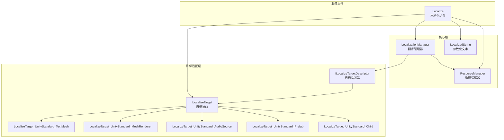

图表来源
- [LocalizationManager_Targets.cs:1-30](file://Assets/TEngine/Runtime/Module/LocalizationModule/Core/Manager/LocalizationManager_Targets.cs#L1-L30)
- [ILocalizeTarget.cs:1-36](file://Assets/TEngine/Runtime/Module/LocalizationModule/Core/Targets/ILocalizeTarget.cs#L1-L36)
- [ILocalizeTargetDesc.cs:1-41](file://Assets/TEngine/Runtime/Module/LocalizationModule/Core/Targets/ILocalizeTargetDesc.cs#L1-L41)
- [LocalizeTarget_UnityStandard_TextMesh.cs:1-68](file://Assets/TEngine/Runtime/Module/LocalizationModule/Core/Targets/LocalizeTarget_UnityStandard_TextMesh.cs#L1-L68)
- [LocalizeTarget_UnityStandard_MeshRenderer.cs:1-80](file://Assets/TEngine/Runtime/Module/LocalizationModule/Core/Targets/LocalizeTarget_UnityStandard_MeshRenderer.cs#L1-L80)
- [LocalizeTarget_UnityStandard_AudioSource.cs:1-46](file://Assets/TEngine/Runtime/Module/LocalizationModule/Core/Targets/LocalizeTarget_UnityStandard_AudioSource.cs#L1-L46)
- [LocalizeTarget_UnityStandard_Prefab.cs:1-97](file://Assets/TEngine/Runtime/Module/LocalizationModule/Core/Targets/LocalizeTarget_UnityStandard_Prefab.cs#L1-L97)
- [LocalizeTarget_UnityStandard_Child.cs:1-51](file://Assets/TEngine/Runtime/Module/LocalizationModule/Core/Targets/LocalizeTarget_UnityStandard_Child.cs#L1-L51)
- [Localize.cs:243-518](file://Assets/TEngine/Runtime/Module/LocalizationModule/Core/Localize.cs#L243-L518)
- [LocalizedString.cs:1-42](file://Assets/TEngine/Runtime/Module/LocalizationModule/Core/Utils/LocalizedString.cs#L1-L42)
- [ResourceManager.cs:1-186](file://Assets/TEngine/Runtime/Module/LocalizationModule/Core/Utils/ResourceManager.cs#L1-L186)

章节来源
- [LocalizationManager_Targets.cs:1-30](file://Assets/TEngine/Runtime/Module/LocalizationModule/Core/Manager/LocalizationManager_Targets.cs#L1-L30)
- [ResourceManager.cs:1-186](file://Assets/TEngine/Runtime/Module/LocalizationModule/Core/Utils/ResourceManager.cs#L1-L186)

## 核心组件
- ILocalizeTarget 与 LocalizeTarget<T>：定义目标有效性校验、主次术语提取、本地化执行等抽象方法，并提供通用的组件绑定逻辑
- ILocalizeTargetDescriptor 与 LocalizeTargetDesc<T>：声明目标类型、优先级与可本地化判定，支持按组件类型自动创建目标实例
- Localize：本地化组件，负责在语言切换或初始化时，选择目标适配器、获取翻译、应用到目标组件
- ResourceManager：统一资源加载入口，提供缓存、Bundle 回退、场景切换清理等能力
- LocalizedString：参数化文本结构，封装术语名与 RTL 控制标志，提供隐式转换与参数应用
- LocalizationManager：翻译管理器，负责语言源注册、目标注册、版本与服务端信息查询、编辑器生命周期处理

章节来源
- [ILocalizeTarget.cs:1-36](file://Assets/TEngine/Runtime/Module/LocalizationModule/Core/Targets/ILocalizeTarget.cs#L1-L36)
- [ILocalizeTargetDesc.cs:1-41](file://Assets/TEngine/Runtime/Module/LocalizationModule/Core/Targets/ILocalizeTargetDesc.cs#L1-L41)
- [Localize.cs:243-518](file://Assets/TEngine/Runtime/Module/LocalizationModule/Core/Localize.cs#L243-L518)
- [ResourceManager.cs:1-186](file://Assets/TEngine/Runtime/Module/LocalizationModule/Core/Utils/ResourceManager.cs#L1-L186)
- [LocalizedString.cs:1-42](file://Assets/TEngine/Runtime/Module/LocalizationModule/Core/Utils/LocalizedString.cs#L1-L42)
- [LocalizationManager_Targets.cs:1-30](file://Assets/TEngine/Runtime/Module/LocalizationModule/Core/Manager/LocalizationManager_Targets.cs#L1-L30)
- [LocalizationManager_Sources.cs:1-207](file://Assets/TEngine/Runtime/Module/LocalizationModule/Core/Manager/LocalizationManager_Sources.cs#L1-L207)
- [LocalizationManager.cs:1-93](file://Assets/TEngine/Runtime/Module/LocalizationModule/Core/Manager/LocalizationManager.cs#L1-L93)

## 架构总览
翻译系统以 Localize 为核心驱动，通过 LocalizationManager 注册的目标描述器选择合适的 ILocalizeTarget 实现，再由 ResourceManager 提供资源解析与缓存，最终将翻译结果写入目标组件。

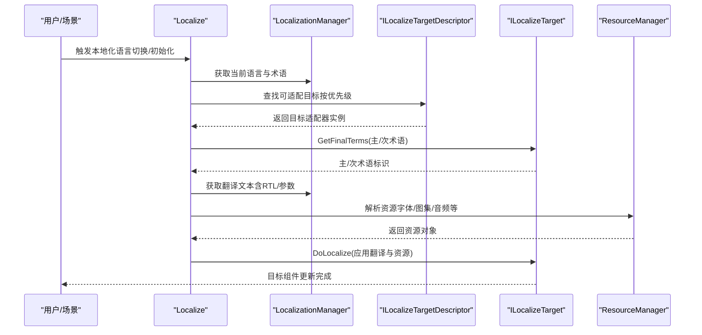

图表来源
- [Localize.cs:243-518](file://Assets/TEngine/Runtime/Module/LocalizationModule/Core/Localize.cs#L243-L518)
- [LocalizationManager_Targets.cs:1-30](file://Assets/TEngine/Runtime/Module/LocalizationModule/Core/Manager/LocalizationManager_Targets.cs#L1-L30)
- [ILocalizeTarget.cs:1-36](file://Assets/TEngine/Runtime/Module/LocalizationModule/Core/Targets/ILocalizeTarget.cs#L1-L36)
- [ResourceManager.cs:1-186](file://Assets/TEngine/Runtime/Module/LocalizationModule/Core/Utils/ResourceManager.cs#L1-L186)

## 详细组件分析

### ILocalizeTarget 与 ILocalizeTargetDescriptor 设计
- ILocalizeTarget：定义目标有效性校验、主/次术语提取、本地化执行、是否允许 RTL、术语类型等接口
- LocalizeTarget<T>：提供通用组件绑定逻辑，自动在组件销毁或场景切换时失效
- ILocalizeTargetDescriptor：声明目标名称、优先级、CanLocalize 判定、CreateTarget 创建实例
- LocalizeTargetDesc_Type<T,G>：基于组件类型自动创建目标实例，便于在运行时注册

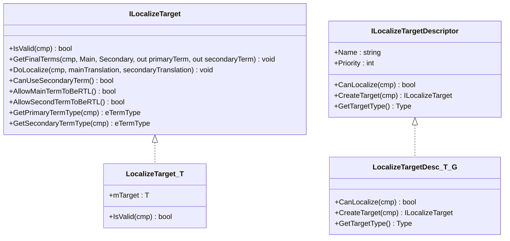

图表来源
- [ILocalizeTarget.cs:1-36](file://Assets/TEngine/Runtime/Module/LocalizationModule/Core/Targets/ILocalizeTarget.cs#L1-L36)
- [ILocalizeTargetDesc.cs:1-41](file://Assets/TEngine/Runtime/Module/LocalizationModule/Core/Targets/ILocalizeTargetDesc.cs#L1-L41)

章节来源
- [ILocalizeTarget.cs:1-36](file://Assets/TEngine/Runtime/Module/LocalizationModule/Core/Targets/ILocalizeTarget.cs#L1-L36)
- [ILocalizeTargetDesc.cs:1-41](file://Assets/TEngine/Runtime/Module/LocalizationModule/Core/Targets/ILocalizeTargetDesc.cs#L1-L41)

### 文本目标适配：TextMesh
- 术语类型：主术语为文本，次术语为字体
- 支持 RTL 对齐修正与字符纹理请求
- 在 DoLocalize 中根据翻译文本更新 TextMesh 的 text 与 font，并同步 MeshRenderer 材质

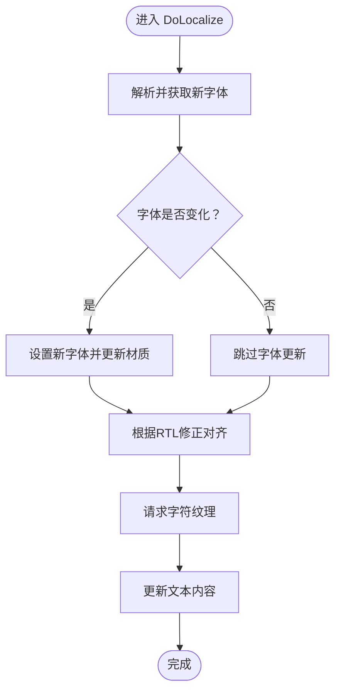

图表来源
- [LocalizeTarget_UnityStandard_TextMesh.cs:1-68](file://Assets/TEngine/Runtime/Module/LocalizationModule/Core/Targets/LocalizeTarget_UnityStandard_TextMesh.cs#L1-L68)

章节来源
- [LocalizeTarget_UnityStandard_TextMesh.cs:1-68](file://Assets/TEngine/Runtime/Module/LocalizationModule/Core/Targets/LocalizeTarget_UnityStandard_TextMesh.cs#L1-L68)

### 图像/网格/材质目标适配：MeshRenderer
- 术语类型：主术语为网格，次术语为材质
- 在 DoLocalize 中先更新材质，再更新网格，确保渲染一致性

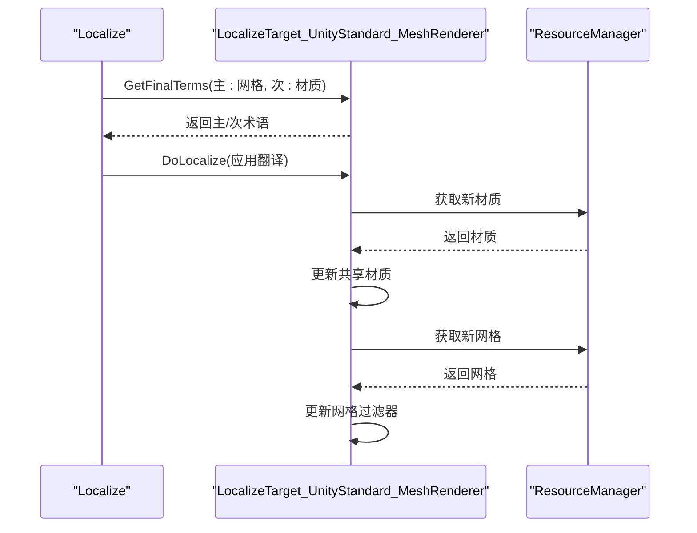

图表来源
- [LocalizeTarget_UnityStandard_MeshRenderer.cs:1-80](file://Assets/TEngine/Runtime/Module/LocalizationModule/Core/Targets/LocalizeTarget_UnityStandard_MeshRenderer.cs#L1-L80)
- [ResourceManager.cs:1-186](file://Assets/TEngine/Runtime/Module/LocalizationModule/Core/Utils/ResourceManager.cs#L1-L186)

章节来源
- [LocalizeTarget_UnityStandard_MeshRenderer.cs:1-80](file://Assets/TEngine/Runtime/Module/LocalizationModule/Core/Targets/LocalizeTarget_UnityStandard_MeshRenderer.cs#L1-L80)
- [ResourceManager.cs:1-186](file://Assets/TEngine/Runtime/Module/LocalizationModule/Core/Utils/ResourceManager.cs#L1-L186)

### 音频目标适配：AudioSource
- 术语类型：主术语为音频剪辑，次术语为文本（用于字体等，但该目标不使用）
- 在 DoLocalize 中根据翻译路径加载 AudioClip 并替换，必要时重播

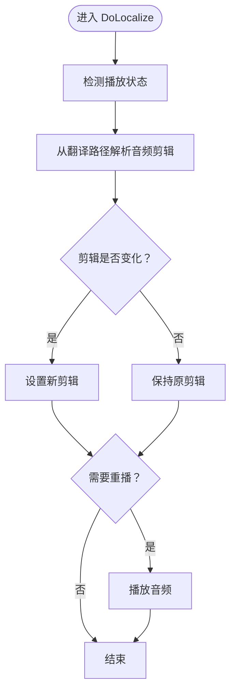

图表来源
- [LocalizeTarget_UnityStandard_AudioSource.cs:1-46](file://Assets/TEngine/Runtime/Module/LocalizationModule/Core/Targets/LocalizeTarget_UnityStandard_AudioSource.cs#L1-L46)

章节来源
- [LocalizeTarget_UnityStandard_AudioSource.cs:1-46](file://Assets/TEngine/Runtime/Module/LocalizationModule/Core/Targets/LocalizeTarget_UnityStandard_AudioSource.cs#L1-L46)

### 子对象/预制体目标适配
- Child：根据主术语激活对应子对象，适用于多子对象切换场景
- Prefab：根据主术语实例化新预制体，替换当前子树，保留位置/旋转

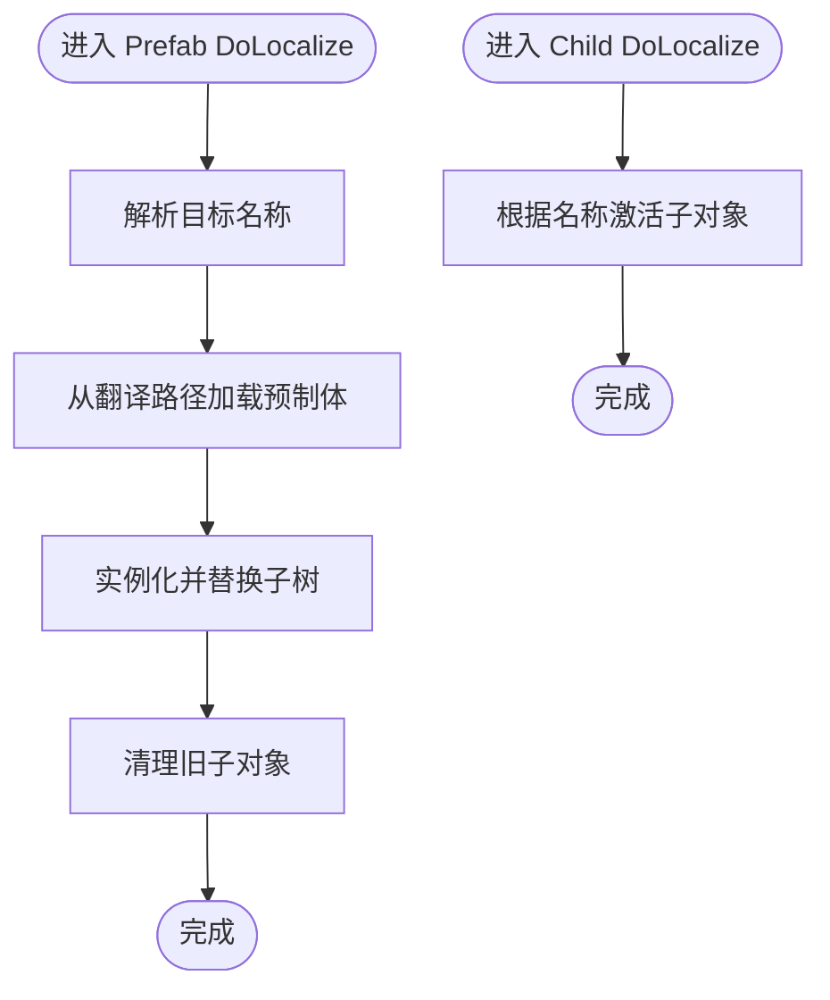

图表来源
- [LocalizeTarget_UnityStandard_Prefab.cs:1-97](file://Assets/TEngine/Runtime/Module/LocalizationModule/Core/Targets/LocalizeTarget_UnityStandard_Prefab.cs#L1-L97)
- [LocalizeTarget_UnityStandard_Child.cs:1-51](file://Assets/TEngine/Runtime/Module/LocalizationModule/Core/Targets/LocalizeTarget_UnityStandard_Child.cs#L1-L51)

章节来源
- [LocalizeTarget_UnityStandard_Prefab.cs:1-97](file://Assets/TEngine/Runtime/Module/LocalizationModule/Core/Targets/LocalizeTarget_UnityStandard_Prefab.cs#L1-L97)
- [LocalizeTarget_UnityStandard_Child.cs:1-51](file://Assets/TEngine/Runtime/Module/LocalizationModule/Core/Targets/LocalizeTarget_UnityStandard_Child.cs#L1-L51)

### 参数化文本：LocalizedString
- 支持隐式转换为字符串，内部通过 LocalizationManager 获取翻译并应用参数
- 提供 RTL 控制与参数本地化开关

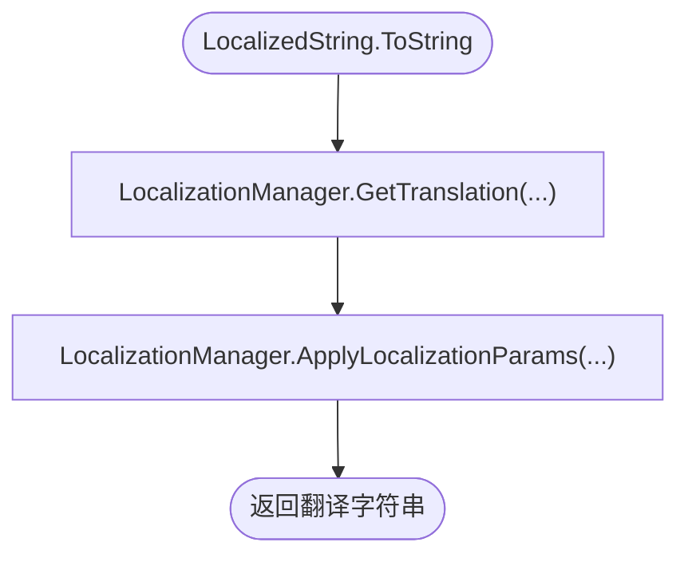

图表来源
- [LocalizedString.cs:1-42](file://Assets/TEngine/Runtime/Module/LocalizationModule/Core/Utils/LocalizedString.cs#L1-L42)

章节来源
- [LocalizedString.cs:1-42](file://Assets/TEngine/Runtime/Module/LocalizationModule/Core/Utils/LocalizedString.cs#L1-L42)

### 资源管理：ResourceManager
- 单例模式，自动挂载于场景，避免重复创建
- 提供 GetAsset/LoadFromResources/LoadFromBundle 三段式加载策略
- 内置帧内资源缓存，减少重复加载开销；场景切换时清理缓存并可选卸载未使用资源
- 支持 Bundle 管理器链回退加载

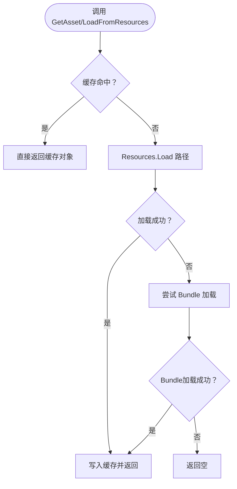

图表来源
- [ResourceManager.cs:1-186](file://Assets/TEngine/Runtime/Module/LocalizationModule/Core/Utils/ResourceManager.cs#L1-L186)

章节来源
- [ResourceManager.cs:1-186](file://Assets/TEngine/Runtime/Module/LocalizationModule/Core/Utils/ResourceManager.cs#L1-L186)

### 翻译管理：LocalizationManager
- 初始化与编辑器生命周期：监听播放模式切换，清理临时缓存
- 语言源管理：注册全局/场景/资源中的语言源，支持延迟导入与 Google 同步
- 目标注册：维护目标描述器列表，按优先级排序，避免重复注册

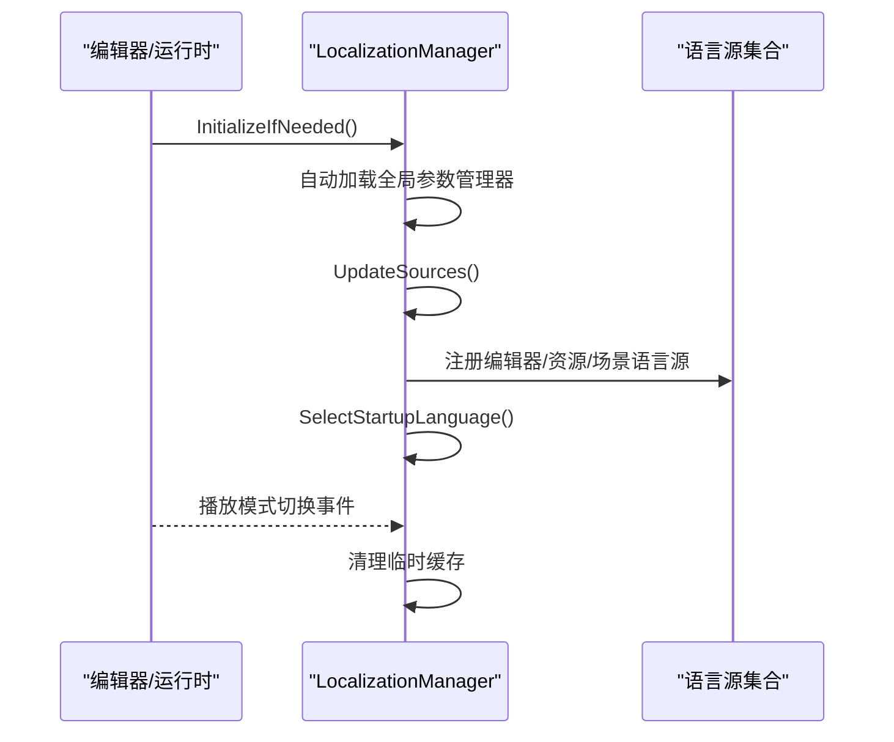

图表来源
- [LocalizationManager.cs:1-93](file://Assets/TEngine/Runtime/Module/LocalizationModule/Core/Manager/LocalizationManager.cs#L1-L93)
- [LocalizationManager_Sources.cs:1-207](file://Assets/TEngine/Runtime/Module/LocalizationModule/Core/Manager/LocalizationManager_Sources.cs#L1-L207)
- [LocalizationManager_Targets.cs:1-30](file://Assets/TEngine/Runtime/Module/LocalizationModule/Core/Manager/LocalizationManager_Targets.cs#L1-L30)

章节来源
- [LocalizationManager.cs:1-93](file://Assets/TEngine/Runtime/Module/LocalizationModule/Core/Manager/LocalizationManager.cs#L1-L93)
- [LocalizationManager_Sources.cs:1-207](file://Assets/TEngine/Runtime/Module/LocalizationModule/Core/Manager/LocalizationManager_Sources.cs#L1-L207)
- [LocalizationManager_Targets.cs:1-30](file://Assets/TEngine/Runtime/Module/LocalizationModule/Core/Manager/LocalizationManager_Targets.cs#L1-L30)

## 依赖关系分析
- Localize 依赖 LocalizationManager（获取翻译）、ResourceManager（解析资源）、ILocalizeTarget（具体适配）
- ILocalizeTargetDescriptor 与 ILocalizeTarget 形成一对多关系，描述器负责创建适配器实例
- ResourceManager 作为资源层，被 Localize 与各目标适配器共同依赖
- LocalizationManager 维护目标注册表与语言源集合，贯穿初始化与运行期

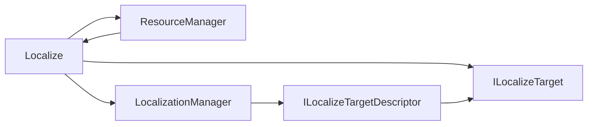

图表来源
- [Localize.cs:243-518](file://Assets/TEngine/Runtime/Module/LocalizationModule/Core/Localize.cs#L243-L518)
- [ILocalizeTarget.cs:1-36](file://Assets/TEngine/Runtime/Module/LocalizationModule/Core/Targets/ILocalizeTarget.cs#L1-L36)
- [ILocalizeTargetDesc.cs:1-41](file://Assets/TEngine/Runtime/Module/LocalizationModule/Core/Targets/ILocalizeTargetDesc.cs#L1-L41)
- [LocalizationManager_Targets.cs:1-30](file://Assets/TEngine/Runtime/Module/LocalizationModule/Core/Manager/LocalizationManager_Targets.cs#L1-L30)
- [ResourceManager.cs:1-186](file://Assets/TEngine/Runtime/Module/LocalizationModule/Core/Utils/ResourceManager.cs#L1-L186)

章节来源
- [Localize.cs:243-518](file://Assets/TEngine/Runtime/Module/LocalizationModule/Core/Localize.cs#L243-L518)
- [ILocalizeTarget.cs:1-36](file://Assets/TEngine/Runtime/Module/LocalizationModule/Core/Targets/ILocalizeTarget.cs#L1-L36)
- [ILocalizeTargetDesc.cs:1-41](file://Assets/TEngine/Runtime/Module/LocalizationModule/Core/Targets/ILocalizeTargetDesc.cs#L1-L41)
- [LocalizationManager_Targets.cs:1-30](file://Assets/TEngine/Runtime/Module/LocalizationModule/Core/Manager/LocalizationManager_Targets.cs#L1-L30)
- [ResourceManager.cs:1-186](file://Assets/TEngine/Runtime/Module/LocalizationModule/Core/Utils/ResourceManager.cs#L1-L186)

## 性能考量
- 资源缓存：ResourceManager 使用字典缓存帧内重复资源请求，显著降低多次加载开销
- 场景切换清理：在场景加载回调中清空缓存，避免内存泄漏；可选卸载未使用资源
- 目标注册优先级：通过优先级排序，优先匹配更精确的目标适配器，减少无效尝试
- 字符纹理预请求：TextMesh 目标在更新文本前请求字符纹理，避免首帧闪烁
- Bundle 回退：当 Resources 未命中时尝试 Bundle，提升大资源包加载灵活性

章节来源
- [ResourceManager.cs:95-186](file://Assets/TEngine/Runtime/Module/LocalizationModule/Core/Utils/ResourceManager.cs#L95-L186)
- [LocalizeTarget_UnityStandard_TextMesh.cs:45-66](file://Assets/TEngine/Runtime/Module/LocalizationModule/Core/Targets/LocalizeTarget_UnityStandard_TextMesh.cs#L45-L66)
- [LocalizationManager_Targets.cs:1-30](file://Assets/TEngine/Runtime/Module/LocalizationModule/Core/Manager/LocalizationManager_Targets.cs#L1-L30)

## 故障排查指南
- 翻译未生效
  - 检查 Localize 的术语名是否正确，以及目标组件是否存在
  - 确认 LocalizationManager 是否已加载语言源并选择启动语言
- 资源加载失败
  - 查看 ResourceManager 的日志输出，确认路径大小写与资源命名一致
  - 若使用 Bundle，请确认 Bundle 管理器链路可用
- 预制体/子对象未切换
  - 确认主术语与子对象名称一致（支持分类分隔符后缀）
  - 检查 Child/Prefab 目标是否被正确注册且优先级合适
- 音频未替换或无法播放
  - 确认翻译路径指向有效 AudioClip
  - 若原剪辑处于播放状态，检查是否需要重播

章节来源
- [Localize.cs:243-518](file://Assets/TEngine/Runtime/Module/LocalizationModule/Core/Localize.cs#L243-L518)
- [ResourceManager.cs:103-160](file://Assets/TEngine/Runtime/Module/LocalizationModule/Core/Utils/ResourceManager.cs#L103-L160)
- [LocalizeTarget_UnityStandard_Prefab.cs:35-97](file://Assets/TEngine/Runtime/Module/LocalizationModule/Core/Targets/LocalizeTarget_UnityStandard_Prefab.cs#L35-L97)
- [LocalizeTarget_UnityStandard_Child.cs:33-51](file://Assets/TEngine/Runtime/Module/LocalizationModule/Core/Targets/LocalizeTarget_UnityStandard_Child.cs#L33-L51)
- [LocalizeTarget_UnityStandard_AudioSource.cs:29-44](file://Assets/TEngine/Runtime/Module/LocalizationModule/Core/Targets/LocalizeTarget_UnityStandard_AudioSource.cs#L29-L44)

## 结论
该翻译管理系统通过清晰的接口分层与目标适配器模式，实现了对多种 Unity 组件的统一本地化能力；配合 ResourceManager 的资源缓存与自动清理策略，保证了性能与稳定性；LocalizedString 则提供了参数化文本的便捷处理。整体架构具备良好的扩展性，便于新增目标类型与资源加载策略。

## 附录：使用示例与扩展指南

### 实际使用示例
- 多语言 UI 文本
  - 在 UI 文本组件上挂载 Localize，设置术语名为对应词条，系统将自动获取翻译并更新文本
  - 参考路径：[LocalizeTarget_UnityStandard_TextMesh.cs:1-68](file://Assets/TEngine/Runtime/Module/LocalizationModule/Core/Targets/LocalizeTarget_UnityStandard_TextMesh.cs#L1-L68)
- 动态文本更新
  - 通过按钮或事件触发语言切换，调用 LocalizationManager 设置当前语言，随后 Localize 将重新解析并应用翻译
  - 参考路径：[Localize.cs:510-515](file://Assets/TEngine/Runtime/Module/LocalizationModule/Core/Localize.cs#L510-L515)
- 资源绑定（字体/材质/网格）
  - 在 MeshRenderer 上挂载 Localize，术语主/次分别指向网格与材质，系统将自动替换资源
  - 参考路径：[LocalizeTarget_UnityStandard_MeshRenderer.cs:1-80](file://Assets/TEngine/Runtime/Module/LocalizationModule/Core/Targets/LocalizeTarget_UnityStandard_MeshRenderer.cs#L1-L80)
- 音频替换
  - 在 AudioSource 上挂载 Localize，术语指向音频剪辑，系统将加载并替换音频
  - 参考路径：[LocalizeTarget_UnityStandard_AudioSource.cs:1-46](file://Assets/TEngine/Runtime/Module/LocalizationModule/Core/Targets/LocalizeTarget_UnityStandard_AudioSource.cs#L1-L46)
- 子对象/预制体切换
  - Child 目标：根据术语激活对应子对象
  - Prefab 目标：根据术语实例化新预制体并替换当前子树
  - 参考路径：[LocalizeTarget_UnityStandard_Child.cs:1-51](file://Assets/TEngine/Runtime/Module/LocalizationModule/Core/Targets/LocalizeTarget_UnityStandard_Child.cs#L1-L51)，[LocalizeTarget_UnityStandard_Prefab.cs:1-97](file://Assets/TEngine/Runtime/Module/LocalizationModule/Core/Targets/LocalizeTarget_UnityStandard_Prefab.cs#L1-L97)

### 扩展性设计与自定义目标类型开发指南
- 新增目标类型步骤
  1) 定义目标适配器类，继承 LocalizeTarget<T>，实现 IsValid、GetFinalTerms、DoLocalize 等方法
     - 参考路径：[ILocalizeTarget.cs:1-36](file://Assets/TEngine/Runtime/Module/LocalizationModule/Core/Targets/ILocalizeTarget.cs#L1-L36)
  2) 定义目标描述器类，继承 LocalizeTargetDesc<T> 或 LocalizeTargetDesc_Type<T,G>，实现 CanLocalize 与 CreateTarget
     - 参考路径：[ILocalizeTargetDesc.cs:1-41](file://Assets/TEngine/Runtime/Module/LocalizationModule/Core/Targets/ILocalizeTargetDesc.cs#L1-L41)
  3) 在静态构造函数中注册目标描述器，设置名称与优先级
     - 参考路径：[LocalizeTarget_UnityStandard_TextMesh.cs:12-15](file://Assets/TEngine/Runtime/Module/LocalizationModule/Core/Targets/LocalizeTarget_UnityStandard_TextMesh.cs#L12-L15)
  4) 在 DoLocalize 中使用 Localize.FindTranslatedObject<T> 或 ResourceManager.GetAsset<T> 获取资源
     - 参考路径：[Localize.cs:460-489](file://Assets/TEngine/Runtime/Module/LocalizationModule/Core/Localize.cs#L460-L489)，[ResourceManager.cs:66-91](file://Assets/TEngine/Runtime/Module/LocalizationModule/Core/Utils/ResourceManager.cs#L66-L91)
- 注意事项
  - 优先级：数值越小优先级越高，确保更精确的适配器优先匹配
  - 资源路径：遵循 Resources/Bundle 命名规范，避免大小写与分隔符差异导致加载失败
  - 缓存与清理：利用 ResourceManager 的缓存机制减少重复加载；场景切换时注意清理

章节来源
- [ILocalizeTarget.cs:1-36](file://Assets/TEngine/Runtime/Module/LocalizationModule/Core/Targets/ILocalizeTarget.cs#L1-L36)
- [ILocalizeTargetDesc.cs:1-41](file://Assets/TEngine/Runtime/Module/LocalizationModule/Core/Targets/ILocalizeTargetDesc.cs#L1-L41)
- [LocalizeTarget_UnityStandard_TextMesh.cs:12-15](file://Assets/TEngine/Runtime/Module/LocalizationModule/Core/Targets/LocalizeTarget_UnityStandard_TextMesh.cs#L12-L15)
- [Localize.cs:460-489](file://Assets/TEngine/Runtime/Module/LocalizationModule/Core/Localize.cs#L460-L489)
- [ResourceManager.cs:66-91](file://Assets/TEngine/Runtime/Module/LocalizationModule/Core/Utils/ResourceManager.cs#L66-L91)