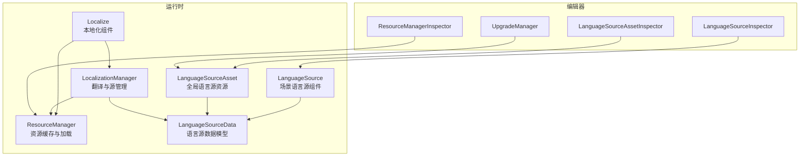
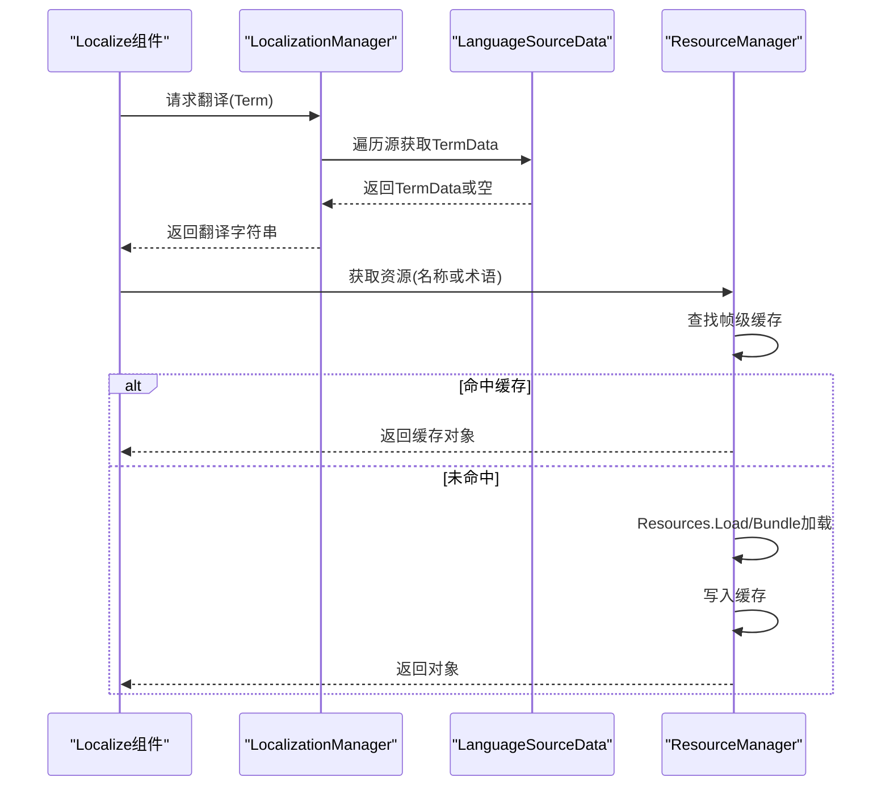
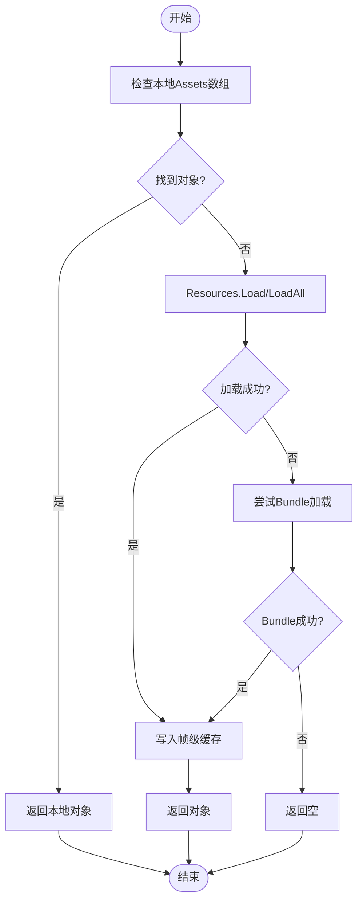
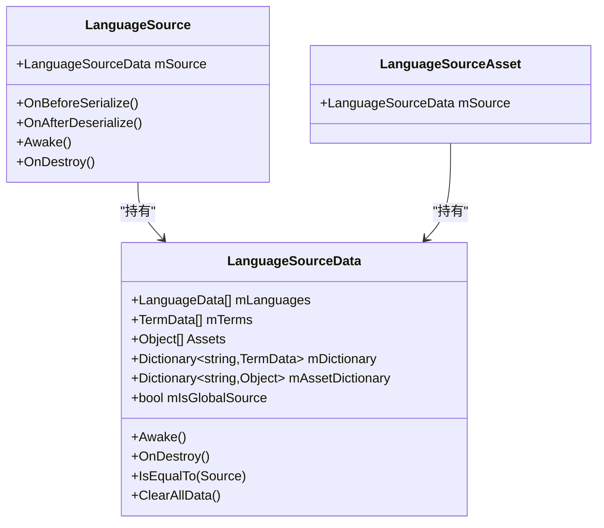
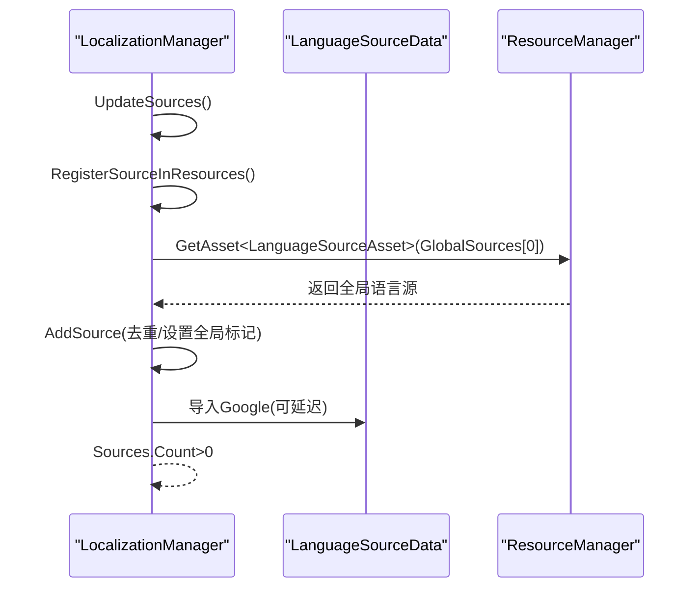
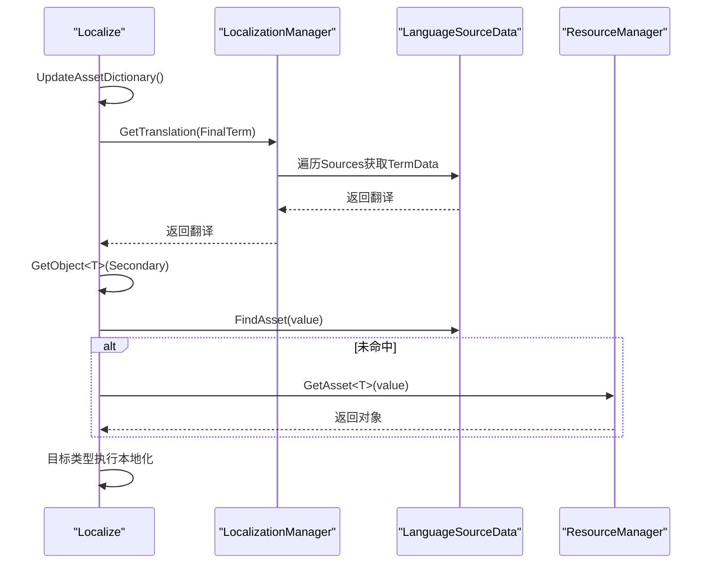
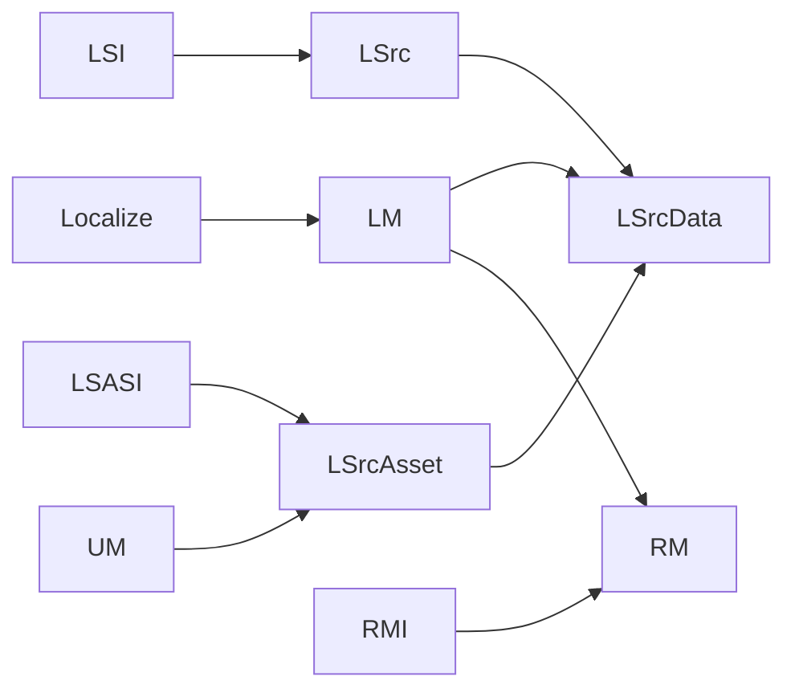

# 资源管理策略

<cite>
**本文引用的文件**
- [ResourceManager.cs](file://Assets/TEngine/Runtime/Module/LocalizationModule/Core/Utils/ResourceManager.cs)
- [LocalizationManager_Sources.cs](file://Assets/TEngine/Runtime/Module/LocalizationModule/Core/Manager/LocalizationManager_Sources.cs)
- [LanguageSourceData.cs](file://Assets/TEngine/Runtime/Module/LocalizationModule/Core/LanguageSource/LanguageSourceData.cs)
- [LanguageSource.cs](file://Assets/TEngine/Runtime/Module/LocalizationModule/Core/LanguageSource/LanguageSource.cs)
- [LanguageSourceAsset.cs](file://Assets/TEngine/Runtime/Module/LocalizationModule/Core/LanguageSource/LanguageSourceAsset.cs)
- [LocalizationManager_Translation.cs](file://Assets/TEngine/Runtime/Module/LocalizationModule/Core/Manager/LocalizationManager_Translation.cs)
- [Localize.cs](file://Assets/TEngine/Runtime/Module/LocalizationModule/Core/Localize.cs)
- [LocalizationManager.cs](file://Assets/TEngine/Runtime/Module/LocalizationModule/Core/Manager/LocalizationManager.cs)
- [LanguageSourceInspector.cs](file://Assets/TEngine/Editor/Localization/Inspectors/LanguageSourceInspector.cs)
- [LanguageSourceAssetInspector.cs](file://Assets/TEngine/Editor/Localization/Inspectors/LanguageSourceAssetInspector.cs)
- [ResourceManagerInspector.cs](file://Assets/TEngine/Editor/Localization/Inspectors/ResourceManagerInspector.cs)
- [UpgradeManager.cs](file://Assets/TEngine/Editor/Localization/UpgradeManager.cs)
</cite>

## 目录
1. [引言](#引言)
2. [项目结构](#项目结构)
3. [核心组件](#核心组件)
4. [架构总览](#架构总览)
5. [组件详解](#组件详解)
6. [依赖关系分析](#依赖关系分析)
7. [性能与内存优化](#性能与内存优化)
8. [故障排查指南](#故障排查指南)
9. [结论](#结论)
10. [附录：最佳实践与配置示例](#附录最佳实践与配置示例)

## 引言
本文件聚焦于翻译资源管理策略，系统性阐述 ResourceManager 的资源管理架构（资源查找算法、缓存机制、内存优化），LanguageSource 的组织结构（语言数据存储、术语管理、资源加载），以及 LocalizationManager_Sources 的多语言源管理策略（源文件解析、数据合并、冲突处理）。同时给出性能优化、内存控制与资源清理的最佳实践，并提供可落地的应用场景与配置示例。

## 项目结构
该模块位于 TEngine 的运行时模块中，核心文件分布如下：
- 运行时核心：ResourceManager、LocalizationManager（分部类）、LanguageSourceData、LanguageSource、LanguageSourceAsset、Localize
- 编辑器支持：Inspector 扩展、升级与工具脚本（用于创建与维护全局语言源）

**图表来源**
- [ResourceManager.cs:14-186](file://Assets/TEngine/Runtime/Module/LocalizationModule/Core/Utils/ResourceManager.cs#L14-L186)
- [LocalizationManager_Sources.cs:10-207](file://Assets/TEngine/Runtime/Module/LocalizationModule/Core/Manager/LocalizationManager_Sources.cs#L10-L207)
- [LanguageSource.cs:9-179](file://Assets/TEngine/Runtime/Module/LocalizationModule/Core/LanguageSource/LanguageSource.cs#L9-L179)
- [LanguageSourceData.cs:16-177](file://Assets/TEngine/Runtime/Module/LocalizationModule/Core/LanguageSource/LanguageSourceData.cs#L16-L177)
- [LanguageSourceAsset.cs:5-16](file://Assets/TEngine/Runtime/Module/LocalizationModule/Core/LanguageSource/LanguageSourceAsset.cs#L5-L16)
- [Localize.cs:17-518](file://Assets/TEngine/Runtime/Module/LocalizationModule/Core/Localize.cs#L17-L518)
- [LocalizationManager_Translation.cs:9-226](file://Assets/TEngine/Runtime/Module/LocalizationModule/Core/Manager/LocalizationManager_Translation.cs#L9-L226)
- [LocalizationManager.cs:9-93](file://Assets/TEngine/Runtime/Module/LocalizationModule/Core/Manager/LocalizationManager.cs#L9-L93)

**章节来源**
- [ResourceManager.cs:14-186](file://Assets/TEngine/Runtime/Module/LocalizationModule/Core/Utils/ResourceManager.cs#L14-L186)
- [LocalizationManager_Sources.cs:10-207](file://Assets/TEngine/Runtime/Module/LocalizationModule/Core/Manager/LocalizationManager_Sources.cs#L10-L207)
- [LanguageSource.cs:9-179](file://Assets/TEngine/Runtime/Module/LocalizationModule/Core/LanguageSource/LanguageSource.cs#L9-L179)
- [LanguageSourceData.cs:16-177](file://Assets/TEngine/Runtime/Module/LocalizationModule/Core/LanguageSource/LanguageSourceData.cs#L16-L177)
- [LanguageSourceAsset.cs:5-16](file://Assets/TEngine/Runtime/Module/LocalizationModule/Core/LanguageSource/LanguageSourceAsset.cs#L5-L16)
- [Localize.cs:17-518](file://Assets/TEngine/Runtime/Module/LocalizationModule/Core/Localize.cs#L17-L518)
- [LocalizationManager_Translation.cs:9-226](file://Assets/TEngine/Runtime/Module/LocalizationModule/Core/Manager/LocalizationManager_Translation.cs#L9-L226)
- [LocalizationManager.cs:9-93](file://Assets/TEngine/Runtime/Module/LocalizationModule/Core/Manager/LocalizationManager.cs#L9-L93)

## 核心组件
- ResourceManager：单例资源管理器，负责从 Resources 或 Bundle 加载对象，维护帧级资源缓存，支持场景切换后的缓存清理与卸载。
- LocalizationManager：翻译与语言源管理的核心静态类，负责源注册、语言选择、翻译查询、全量本地化刷新等。
- LanguageSource / LanguageSourceData：语言源实体与数据模型，承载语言列表、术语表、资源引用、Google 同步配置等。
- LanguageSourceAsset：全局语言源资源（ScriptableObject），作为编辑器与运行时共享的语言数据容器。
- Localize：挂载在 UI/游戏对象上的本地化组件，负责根据术语与目标类型执行翻译与资源绑定。

**章节来源**
- [ResourceManager.cs:14-186](file://Assets/TEngine/Runtime/Module/LocalizationModule/Core/Utils/ResourceManager.cs#L14-L186)
- [LocalizationManager_Sources.cs:10-207](file://Assets/TEngine/Runtime/Module/LocalizationModule/Core/Manager/LocalizationManager_Sources.cs#L10-L207)
- [LanguageSourceData.cs:16-177](file://Assets/TEngine/Runtime/Module/LocalizationModule/Core/LanguageSource/LanguageSourceData.cs#L16-L177)
- [LanguageSource.cs:9-179](file://Assets/TEngine/Runtime/Module/LocalizationModule/Core/LanguageSource/LanguageSource.cs#L9-L179)
- [LanguageSourceAsset.cs:5-16](file://Assets/TEngine/Runtime/Module/LocalizationModule/Core/LanguageSource/LanguageSourceAsset.cs#L5-L16)
- [Localize.cs:17-518](file://Assets/TEngine/Runtime/Module/LocalizationModule/Core/Localize.cs#L17-L518)

## 架构总览
翻译资源管理采用“多语言源 + 单例资源管理器”的架构：
- 多语言源：通过 LanguageSource（场景）与 LanguageSourceAsset（全局）两种形态存在，统一由 LocalizationManager 管理。
- 翻译查询：LocalizationManager 遍历已注册源，按顺序获取术语数据与翻译文本。
- 资源加载：Localize 组件与 ResourceManager 协作，优先使用已知资源字典，其次从 Resources 加载，最后尝试 Bundle。
- 缓存与清理：ResourceManager 维护帧级缓存，场景切换时清理并可选卸载未使用资源。

**图表来源**
- [LocalizationManager_Translation.cs:25-60](file://Assets/TEngine/Runtime/Module/LocalizationModule/Core/Manager/LocalizationManager_Translation.cs#L25-L60)
- [ResourceManager.cs:103-160](file://Assets/TEngine/Runtime/Module/LocalizationModule/Core/Utils/ResourceManager.cs#L103-L160)
- [Localize.cs:423-489](file://Assets/TEngine/Runtime/Module/LocalizationModule/Core/Localize.cs#L423-L489)

## 组件详解

### ResourceManager：资源管理与缓存
- 单例模式：自动创建与生命周期管理，场景切换时触发清理与源更新。
- 资源查找链路：
  - 本地 Assets 数组匹配
  - Resources.Load（含多图集子项解析）
  - Bundle 加载（通过接口扩展）
- 帧级缓存：避免同一帧重复加载相同资源；支持清理与可选卸载未使用资源。
- 场景事件：监听场景加载完成，清理缓存并更新语言源。

**图表来源**
- [ResourceManager.cs:66-182](file://Assets/TEngine/Runtime/Module/LocalizationModule/Core/Utils/ResourceManager.cs#L66-L182)

**章节来源**
- [ResourceManager.cs:14-186](file://Assets/TEngine/Runtime/Module/LocalizationModule/Core/Utils/ResourceManager.cs#L14-L186)

### LanguageSource 与 LanguageSourceData：语言源组织
- LanguageSource：场景组件，持有 LanguageSourceData，负责序列化兼容与生命周期回调。
- LanguageSourceData：核心数据模型，包含：
  - 语言列表与加载状态
  - 术语表与字典索引
  - 资源引用与资产字典
  - Google 同步配置与延迟导入
  - 全局源标记与去重逻辑
- 资产字典：将已知资源按名称去重映射，加速 Localize 的资源查找。

**图表来源**
- [LanguageSource.cs:9-179](file://Assets/TEngine/Runtime/Module/LocalizationModule/Core/LanguageSource/LanguageSource.cs#L9-L179)
- [LanguageSourceData.cs:16-177](file://Assets/TEngine/Runtime/Module/LocalizationModule/Core/LanguageSource/LanguageSourceData.cs#L16-L177)
- [LanguageSourceAsset.cs:5-16](file://Assets/TEngine/Runtime/Module/LocalizationModule/Core/LanguageSource/LanguageSourceAsset.cs#L5-L16)

**章节来源**
- [LanguageSource.cs:9-179](file://Assets/TEngine/Runtime/Module/LocalizationModule/Core/LanguageSource/LanguageSource.cs#L9-L179)
- [LanguageSourceData.cs:16-177](file://Assets/TEngine/Runtime/Module/LocalizationModule/Core/LanguageSource/LanguageSourceData.cs#L16-L177)
- [LanguageSourceAsset.cs:5-16](file://Assets/TEngine/Runtime/Module/LocalizationModule/Core/LanguageSource/LanguageSourceAsset.cs#L5-L16)

### LocalizationManager_Sources：多语言源管理
- 源注册：编辑器与运行时分别注册全局与场景语言源，确保唯一性与去重。
- 源遍历：提供按术语定位源、资源查找、Google 数据应用等能力。
- 同步与延迟：支持 Google 源的延迟导入与同步策略，避免启动卡顿。

**图表来源**
- [LocalizationManager_Sources.cs:22-148](file://Assets/TEngine/Runtime/Module/LocalizationModule/Core/Manager/LocalizationManager_Sources.cs#L22-L148)
- [LocalizationManager_Sources.cs:94-109](file://Assets/TEngine/Runtime/Module/LocalizationModule/Core/Manager/LocalizationManager_Sources.cs#L94-L109)

**章节来源**
- [LocalizationManager_Sources.cs:10-207](file://Assets/TEngine/Runtime/Module/LocalizationModule/Core/Manager/LocalizationManager_Sources.cs#L10-L207)

### Localize：术语到目标的本地化流程
- 术语解析：优先使用组件上显式术语，否则从目标控件推导（如标签文本、字体名）。
- 翻译获取：调用 LocalizationManager 获取翻译文本，支持参数替换与 RTL 处理。
- 资源绑定：先查本地资产字典，再查语言源资源，最后通过 ResourceManager 从 Resources/Bundle 加载。
- 字典更新：当 TranslatedObjects 变更时重建资产字典，保证查找效率。

**图表来源**
- [Localize.cs:160-254](file://Assets/TEngine/Runtime/Module/LocalizationModule/Core/Localize.cs#L160-L254)
- [Localize.cs:423-489](file://Assets/TEngine/Runtime/Module/LocalizationModule/Core/Localize.cs#L423-L489)
- [LocalizationManager_Translation.cs:25-60](file://Assets/TEngine/Runtime/Module/LocalizationModule/Core/Manager/LocalizationManager_Translation.cs#L25-L60)

**章节来源**
- [Localize.cs:17-518](file://Assets/TEngine/Runtime/Module/LocalizationModule/Core/Localize.cs#L17-L518)
- [LocalizationManager_Translation.cs:9-226](file://Assets/TEngine/Runtime/Module/LocalizationModule/Core/Manager/LocalizationManager_Translation.cs#L9-L226)

## 依赖关系分析
- Localize 依赖 LocalizationManager（翻译）与 ResourceManager（资源）。
- LocalizationManager 依赖 LanguageSourceData（术语与语言数据）与 ResourceManager（全局资源）。
- LanguageSource 与 LanguageSourceAsset 为 LanguageSourceData 的载体，前者在场景中，后者在资源中。
- 编辑器侧 Inspector 与 UpgradeManager 辅助语言源的创建与维护。

**图表来源**
- [Localize.cs:17-518](file://Assets/TEngine/Runtime/Module/LocalizationModule/Core/Localize.cs#L17-L518)
- [LocalizationManager_Sources.cs:10-207](file://Assets/TEngine/Runtime/Module/LocalizationModule/Core/Manager/LocalizationManager_Sources.cs#L10-L207)
- [ResourceManager.cs:14-186](file://Assets/TEngine/Runtime/Module/LocalizationModule/Core/Utils/ResourceManager.cs#L14-L186)
- [LanguageSource.cs:9-179](file://Assets/TEngine/Runtime/Module/LocalizationModule/Core/LanguageSource/LanguageSource.cs#L9-L179)
- [LanguageSourceAsset.cs:5-16](file://Assets/TEngine/Runtime/Module/LocalizationModule/Core/LanguageSource/LanguageSourceAsset.cs#L5-L16)
- [LanguageSourceInspector.cs:5-22](file://Assets/TEngine/Editor/Localization/Inspectors/LanguageSourceInspector.cs#L5-L22)
- [LanguageSourceAssetInspector.cs:5-20](file://Assets/TEngine/Editor/Localization/Inspectors/LanguageSourceAssetInspector.cs#L5-L20)
- [ResourceManagerInspector.cs](file://Assets/TEngine/Editor/Localization/Inspectors/ResourceManagerInspector.cs)
- [UpgradeManager.cs:182-252](file://Assets/TEngine/Editor/Localization/UpgradeManager.cs#L182-L252)

**章节来源**
- [LanguageSourceInspector.cs:5-22](file://Assets/TEngine/Editor/Localization/Inspectors/LanguageSourceInspector.cs#L5-L22)
- [LanguageSourceAssetInspector.cs:5-20](file://Assets/TEngine/Editor/Localization/Inspectors/LanguageSourceAssetInspector.cs#L5-L20)
- [ResourceManagerInspector.cs](file://Assets/TEngine/Editor/Localization/Inspectors/ResourceManagerInspector.cs)
- [UpgradeManager.cs:182-252](file://Assets/TEngine/Editor/Localization/UpgradeManager.cs#L182-L252)

## 性能与内存优化
- 帧级资源缓存
  - 作用：避免同一帧内重复调用 Resources.Load，显著降低 I/O 开销。
  - 触发时机：每次通过 ResourceManager 加载资源时写入缓存；场景切换时清理。
  - 清理策略：提供清理接口，支持可选卸载未使用资源以回收内存。
- 术语与资产字典
  - 术语字典：按序号区分语言列，减少字符串匹配成本。
  - 资产字典：基于名称去重，加速 Localize 的资源查找。
- 场景切换与语言源更新
  - 场景加载完成后自动清理缓存并更新语言源，避免脏数据。
- Google 同步与延迟
  - 支持延迟导入与同步策略，避免启动阶段阻塞主线程。
- 最佳实践
  - 将常用资源放入 LanguageSourceData.Assets，减少 Resources 查询。
  - 使用术语名而非路径作为翻译值，便于统一管理。
  - 定期清理未使用的资源，避免内存泄漏。
  - 在编辑器中使用 Inspector 预览与校验术语与资源引用。

**章节来源**
- [ResourceManager.cs:95-182](file://Assets/TEngine/Runtime/Module/LocalizationModule/Core/Utils/ResourceManager.cs#L95-L182)
- [LanguageSourceData.cs:38-88](file://Assets/TEngine/Runtime/Module/LocalizationModule/Core/LanguageSource/LanguageSourceData.cs#L38-L88)
- [Localize.cs:396-402](file://Assets/TEngine/Runtime/Module/LocalizationModule/Core/Localize.cs#L396-L402)
- [LocalizationManager_Sources.cs:44-80](file://Assets/TEngine/Runtime/Module/LocalizationModule/Core/Manager/LocalizationManager_Sources.cs#L44-L80)

## 故障排查指南
- 术语未找到
  - 确认术语是否存在于任一已注册语言源。
  - 使用 LocalizationManager 的术语查询接口定位具体源。
- 资源加载失败
  - 检查 LanguageSourceData.Assets 是否包含所需资源。
  - 使用 ResourceManager 的资源加载链路进行排查。
  - 确认 Resources 路径正确，多图集子项需使用“路径[名称]”格式。
- Google 同步异常
  - 检查 Google 配置与网络权限。
  - 使用延迟导入与手动同步接口在合适时机应用下载数据。
- 编辑器预览问题
  - 使用 Inspector 预览术语与资源引用。
  - 通过 UpgradeManager 创建或修复全局语言源资源。

**章节来源**
- [LocalizationManager_Translation.cs:191-222](file://Assets/TEngine/Runtime/Module/LocalizationModule/Core/Manager/LocalizationManager_Translation.cs#L191-L222)
- [ResourceManager.cs:103-160](file://Assets/TEngine/Runtime/Module/LocalizationModule/Core/Utils/ResourceManager.cs#L103-L160)
- [LanguageSourceInspector.cs:5-22](file://Assets/TEngine/Editor/Localization/Inspectors/LanguageSourceInspector.cs#L5-L22)
- [LanguageSourceAssetInspector.cs:5-20](file://Assets/TEngine/Editor/Localization/Inspectors/LanguageSourceAssetInspector.cs#L5-L20)
- [UpgradeManager.cs:182-252](file://Assets/TEngine/Editor/Localization/UpgradeManager.cs#L182-L252)

## 结论
该翻译资源管理策略通过“多语言源 + 单例资源管理器”的架构实现了术语与资源的统一管理。ResourceManager 的帧级缓存与场景联动清理有效平衡了性能与内存；LanguageSourceData 的术语与资产字典提升了查找效率；LocalizationManager 提供了完善的源注册、语言选择与全量刷新能力。结合编辑器工具链，可实现从术语维护到资源加载的全流程自动化与可视化。

## 附录：最佳实践与配置示例
- 术语命名规范
  - 使用清晰、稳定的术语名，避免路径与特殊字符。
  - 分类组织术语，便于检索与合并。
- 资源组织建议
  - 将常用字体、图集等放入 LanguageSourceData.Assets，提升加载速度。
  - 对于动态资源，使用术语名作为翻译值，避免硬编码路径。
- Google 同步策略
  - 在编辑器中定期检查更新，发布前手动应用下载数据。
  - 启动阶段使用延迟导入，避免首帧卡顿。
- 编辑器工作流
  - 使用 Inspector 快速预览与校验术语与资源。
  - 通过 UpgradeManager 创建全局语言源资源，确保跨版本兼容。

[本节为通用指导，不直接分析具体文件，故无“章节来源”]