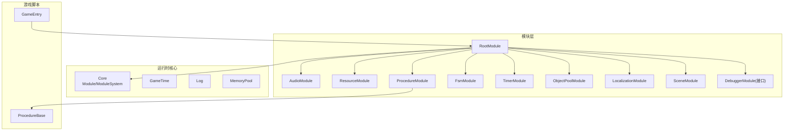
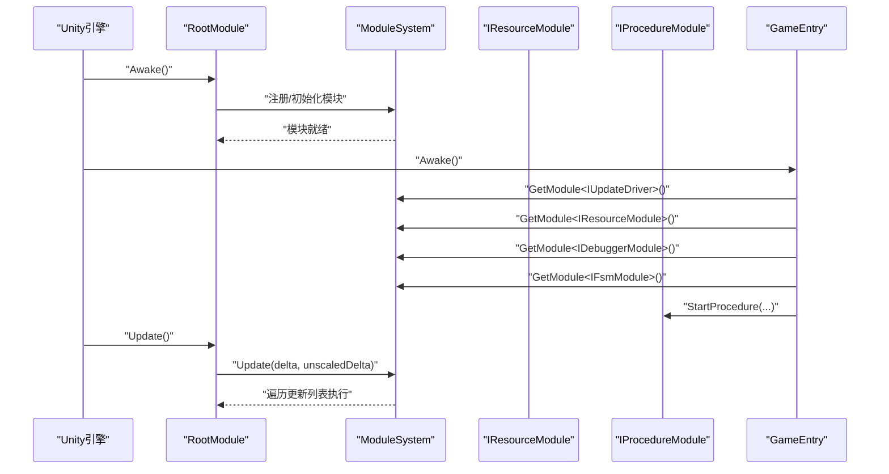
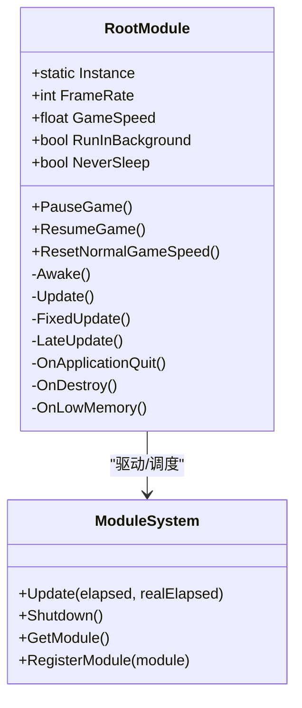
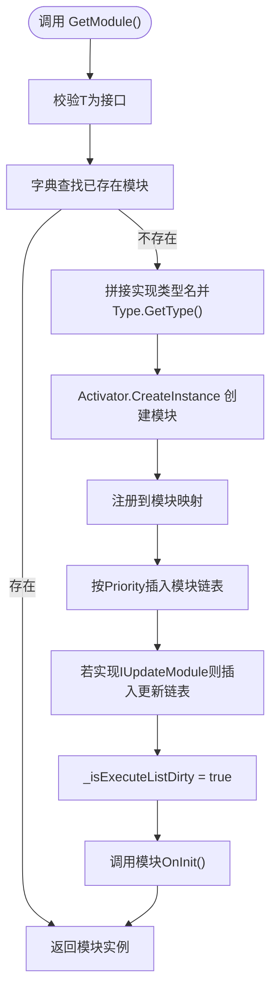
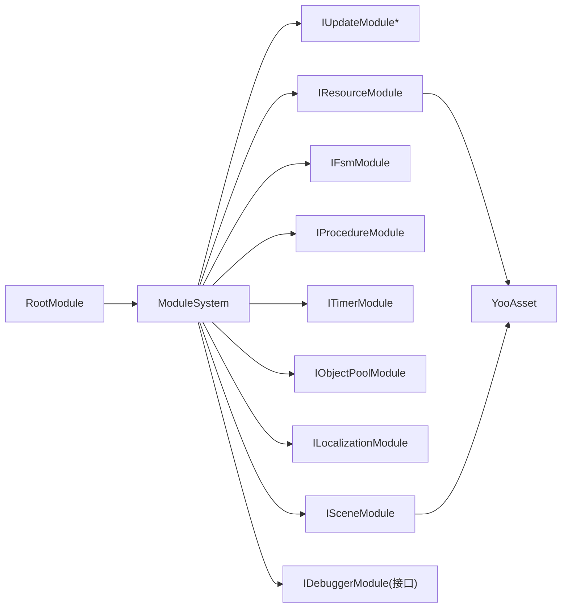

# 核心架构

<cite>
**本文档引用的文件**
- [GameEntry.cs](file://Assets/GameScripts/GameEntry.cs)
- [Module.cs](file://Assets/TEngine/Runtime/Core/Module.cs)
- [ModuleSystem.cs](file://Assets/TEngine/Runtime/Core/ModuleSystem.cs)
- [RootModule.cs](file://Assets/TEngine/Runtime/Module/RootModule.cs)
- [AudioModule.cs](file://Assets/TEngine/Runtime/Module/AudioModule/AudioModule.cs)
- [ResourceModule.cs](file://Assets/TEngine/Runtime/Module/ResourceModule/ResourceModule.cs)
- [ProcedureModule.cs](file://Assets/TEngine/Runtime/Module/ProcedureModule/ProcedureModule.cs)
- [FsmModule.cs](file://Assets/TEngine/Runtime/Module/FsmModule/FsmModule.cs)
- [TimerModule.cs](file://Assets/TEngine/Runtime/Module/TimerModule/TimerModule.cs)
- [ObjectPoolModule.cs](file://Assets/TEngine/Runtime/Module/ObjectPoolModule/ObjectPoolModule.cs)
- [LocalizationModule.cs](file://Assets/TEngine/Runtime/Module/LocalizationModule/LocalizationModule.cs)
- [SceneModule.cs](file://Assets/TEngine/Runtime/Module/SceneModule/SceneModule.cs)
- [IDebuggerModule.cs](file://Assets/TEngine/Runtime/Module/DebugerModule/IDebuggerModule.cs)
- [ProcedureBase.cs](file://Assets/GameScripts/Procedure/ProcedureBase.cs)
</cite>

## 目录
1. [引言](#引言)
2. [项目结构](#项目结构)
3. [核心组件](#核心组件)
4. [架构总览](#架构总览)
5. [详细组件分析](#详细组件分析)
6. [依赖分析](#依赖分析)
7. [性能考量](#性能考量)
8. [故障排查指南](#故障排查指南)
9. [结论](#结论)
10. [附录](#附录)

## 引言
本文件面向TEngine框架的核心架构，系统性阐述模块化设计原理与实现细节，重点覆盖以下主题：
- RootModule根模块的作用与职责边界
- ModuleSystem模块系统的管理机制、注册与生命周期
- 模块间依赖关系与通信机制
- 游戏入口GameEntry的初始化流程
- 设计模式的应用（单例、工厂、观察者等）
- 架构图与组件关系图
- 模块扩展最佳实践与自定义模块开发指南

## 项目结构
TEngine采用“分层+模块化”的组织方式：
- Runtime/Core：框架内核（模块基类、模块系统、时间与日志等基础设施）
- Runtime/Module：各功能模块（音频、资源、场景、流程、FSM、计时器、本地化、对象池、调试器等）
- GameScripts：游戏业务层（GameEntry入口、流程基类等）

图表来源
- [RootModule.cs:10-138](file://Assets/TEngine/Runtime/Module/RootModule.cs#L10-L138)
- [ModuleSystem.cs:9-208](file://Assets/TEngine/Runtime/Core/ModuleSystem.cs#L9-L208)
- [Module.cs:22-39](file://Assets/TEngine/Runtime/Core/Module.cs#L22-L39)
- [GameEntry.cs:4-14](file://Assets/GameScripts/GameEntry.cs#L4-L14)
- [ProcedureBase.cs:5-14](file://Assets/GameScripts/Procedure/ProcedureBase.cs#L5-L14)

章节来源
- [RootModule.cs:10-138](file://Assets/TEngine/Runtime/Module/RootModule.cs#L10-L138)
- [ModuleSystem.cs:9-208](file://Assets/TEngine/Runtime/Core/ModuleSystem.cs#L9-L208)
- [Module.cs:22-39](file://Assets/TEngine/Runtime/Core/Module.cs#L22-L39)
- [GameEntry.cs:4-14](file://Assets/GameScripts/GameEntry.cs#L4-L14)
- [ProcedureBase.cs:5-14](file://Assets/GameScripts/Procedure/ProcedureBase.cs#L5-L14)

## 核心组件
- 模块基类与接口
  - Module：抽象模块基类，定义优先级、OnInit、Shutdown等生命周期钩子
  - IUpdateModule：具备每帧更新能力的模块接口
- 模块系统
  - ModuleSystem：集中式模块注册、创建、调度与关闭；维护模块链表与更新列表
- 根模块
  - RootModule：Unity生命周期入口，负责模块初始化、帧驱动、全局设置与低内存处理
- 游戏入口
  - GameEntry：Awake阶段触发必要模块的获取与流程启动

章节来源
- [Module.cs:8-39](file://Assets/TEngine/Runtime/Core/Module.cs#L8-L39)
- [ModuleSystem.cs:9-208](file://Assets/TEngine/Runtime/Core/ModuleSystem.cs#L9-L208)
- [RootModule.cs:10-138](file://Assets/TEngine/Runtime/Module/RootModule.cs#L10-L138)
- [GameEntry.cs:4-14](file://Assets/GameScripts/GameEntry.cs#L4-L14)

## 架构总览
TEngine采用“根模块驱动 + 模块系统管理 + 接口化模块”的架构：
- RootModule作为Unity生命周期入口，统一初始化与调度
- ModuleSystem负责模块的注册、优先级排序、更新列表构建与执行
- 各功能模块通过接口暴露能力，模块间通过ModuleSystem进行松耦合交互
- GameEntry通过ModuleSystem获取模块并启动流程

图表来源
- [RootModule.cs:116-154](file://Assets/TEngine/Runtime/Module/RootModule.cs#L116-L154)
- [ModuleSystem.cs:29-60](file://Assets/TEngine/Runtime/Core/ModuleSystem.cs#L29-L60)
- [GameEntry.cs:6-12](file://Assets/GameScripts/GameEntry.cs#L6-L12)
- [ProcedureModule.cs:86-109](file://Assets/TEngine/Runtime/Module/ProcedureModule/ProcedureModule.cs#L86-L109)

## 详细组件分析

### RootModule（根模块）
- 职责
  - Unity生命周期入口：Awake中初始化文本/日志/JSON辅助器、屏幕DPI、帧率、时间缩放、后台运行与休眠策略
  - 帧驱动：Update中推进GameTime并调用ModuleSystem.Update
  - 低内存处理：OnLowMemory回调中联动对象池与资源模块回收
  - 生命周期：OnDestroy中触发ModuleSystem.Shutdown
- 设计要点
  - 单例式静态Instance访问
  - 通过Unity生命周期与ModuleSystem协同，确保模块有序初始化与关闭

图表来源
- [RootModule.cs:10-138](file://Assets/TEngine/Runtime/Module/RootModule.cs#L10-L138)
- [ModuleSystem.cs:9-60](file://Assets/TEngine/Runtime/Core/ModuleSystem.cs#L9-L60)

章节来源
- [RootModule.cs:10-138](file://Assets/TEngine/Runtime/Module/RootModule.cs#L10-L138)

### ModuleSystem（模块系统）
- 职责
  - 模块注册与创建：按接口名推导实现类型并反射创建
  - 优先级管理：按Priority插入模块链表，保证初始化顺序与关闭顺序
  - 更新调度：维护IUpdateModule列表，按需重建执行列表
  - 关闭清理：逆序关闭模块并清空容器
- 关键数据结构
  - 字典映射：Type -> Module
  - 双向链表：模块顺序、更新顺序
  - 动态列表：IUpdateModule执行队列

图表来源
- [ModuleSystem.cs:68-141](file://Assets/TEngine/Runtime/Core/ModuleSystem.cs#L68-L141)

章节来源
- [ModuleSystem.cs:9-208](file://Assets/TEngine/Runtime/Core/ModuleSystem.cs#L9-L208)

### GameEntry（游戏入口）
- 职责
  - 在Awake中预热关键模块（更新驱动、资源、调试器、FSM），随后启动流程
  - 使用DontDestroyOnLoad保持实例
- 作用
  - 作为业务侧与框架的衔接点，确保模块在流程启动前就绪

章节来源
- [GameEntry.cs:4-14](file://Assets/GameScripts/GameEntry.cs#L4-L14)

### 模块间依赖与通信
- 依赖关系
  - RootModule依赖ModuleSystem进行模块管理
  - 各功能模块通过ModuleSystem获取其他模块（如AudioModule依赖IResourceModule）
  - ProcedureModule依赖FsmModule进行流程状态管理
- 通信机制
  - 接口化：模块通过接口暴露能力，彼此只依赖接口
  - 事件/回调：资源模块提供异步回调与进度回调
  - 共享状态：通过公共设置与工具（如GameTime、Log、MemoryPool）

章节来源
- [AudioModule.cs:322-326](file://Assets/TEngine/Runtime/Module/AudioModule/AudioModule.cs#L322-L326)
- [ProcedureModule.cs:86-95](file://Assets/TEngine/Runtime/Module/ProcedureModule/ProcedureModule.cs#L86-L95)
- [FsmModule.cs:226-250](file://Assets/TEngine/Runtime/Module/FsmModule/FsmModule.cs#L226-L250)

### 设计模式应用
- 单例模式
  - RootModule提供静态Instance，便于全局访问
- 工厂模式
  - ModuleSystem通过Type.GetType与Activator.CreateInstance按约定命名创建模块实例
- 观察者/事件模式
  - 资源模块提供异步完成回调（Completed）与进度回调
  - 场景模块提供加载/卸载完成回调
- 状态机模式
  - ProcedureModule基于FsmModule实现流程状态转换

章节来源
- [RootModule.cs:12-24](file://Assets/TEngine/Runtime/Module/RootModule.cs#L12-L24)
- [ModuleSystem.cs:107-120](file://Assets/TEngine/Runtime/Core/ModuleSystem.cs#L107-L120)
- [ResourceModule.cs:769-798](file://Assets/TEngine/Runtime/Module/ResourceModule/ResourceModule.cs#L769-L798)
- [SceneModule.cs:140-200](file://Assets/TEngine/Runtime/Module/SceneModule/SceneModule.cs#L140-L200)
- [ProcedureModule.cs:86-109](file://Assets/TEngine/Runtime/Module/ProcedureModule/ProcedureModule.cs#L86-L109)
- [FsmModule.cs:226-250](file://Assets/TEngine/Runtime/Module/FsmModule/FsmModule.cs#L226-L250)

## 依赖分析
- 内聚与耦合
  - 模块内聚于自身职责，通过接口与ModuleSystem解耦
  - RootModule承担协调职责，但不直接持有业务逻辑
- 外部依赖
  - 资源模块依赖YooAsset进行包管理与资源加载
  - 场景模块依赖YooAsset进行场景加载与卸载
- 循环依赖
  - 通过接口与延迟初始化避免循环依赖

图表来源
- [ModuleSystem.cs:17-194](file://Assets/TEngine/Runtime/Core/ModuleSystem.cs#L17-L194)
- [ResourceModule.cs:119-138](file://Assets/TEngine/Runtime/Module/ResourceModule/ResourceModule.cs#L119-L138)
- [SceneModule.cs:58-128](file://Assets/TEngine/Runtime/Module/SceneModule/SceneModule.cs#L58-L128)
- [IDebuggerModule.cs:6-53](file://Assets/TEngine/Runtime/Module/DebugerModule/IDebuggerModule.cs#L6-L53)

章节来源
- [ModuleSystem.cs:17-194](file://Assets/TEngine/Runtime/Core/ModuleSystem.cs#L17-L194)
- [ResourceModule.cs:119-138](file://Assets/TEngine/Runtime/Module/ResourceModule/ResourceModule.cs#L119-L138)
- [SceneModule.cs:58-128](file://Assets/TEngine/Runtime/Module/SceneModule/SceneModule.cs#L58-L128)
- [IDebuggerModule.cs:6-53](file://Assets/TEngine/Runtime/Module/DebugerModule/IDebuggerModule.cs#L6-L53)

## 性能考量
- 模块更新列表缓存
  - ModuleSystem在更新列表变更时才重建，避免每帧重复构建
- 优先级链表插入
  - 通过链表按优先级插入，保证初始化/关闭顺序稳定
- 资源与对象池回收
  - RootModule.OnLowMemory联动对象池与资源模块释放未使用资源
- 异步加载与进度回调
  - 资源与场景模块提供异步加载与进度回调，避免主线程阻塞

章节来源
- [ModuleSystem.cs:199-206](file://Assets/TEngine/Runtime/Core/ModuleSystem.cs#L199-L206)
- [RootModule.cs:287-302](file://Assets/TEngine/Runtime/Module/RootModule.cs#L287-L302)
- [ResourceModule.cs:769-800](file://Assets/TEngine/Runtime/Module/ResourceModule/ResourceModule.cs#L769-L800)
- [SceneModule.cs:202-215](file://Assets/TEngine/Runtime/Module/SceneModule/SceneModule.cs#L202-L215)

## 故障排查指南
- 模块未找到
  - 现象：按接口获取模块时报“无法找到模块类型”
  - 排查：确认实现类型命名符合“命名空间.接口名去掉I,程序集名”约定
- 模块创建失败
  - 现象：反射创建模块失败
  - 排查：确认模块构造函数无参且可访问
- 低内存导致卡顿
  - 现象：设备内存告警
  - 处理：RootModule.OnLowMemory会触发对象池与资源模块回收，必要时降低资源包大小或优化资源池配置
- 流程未启动
  - 现象：GameEntry已Awake但流程未执行
  - 排查：确认ProcedureModule已初始化并正确调用StartProcedure

章节来源
- [ModuleSystem.cs:81-88](file://Assets/TEngine/Runtime/Core/ModuleSystem.cs#L81-L88)
- [ModuleSystem.cs:107-114](file://Assets/TEngine/Runtime/Core/ModuleSystem.cs#L107-L114)
- [RootModule.cs:287-302](file://Assets/TEngine/Runtime/Module/RootModule.cs#L287-L302)
- [ProcedureModule.cs:86-109](file://Assets/TEngine/Runtime/Module/ProcedureModule/ProcedureModule.cs#L86-L109)

## 结论
TEngine通过RootModule统一入口、ModuleSystem集中管理与接口化模块设计，实现了高内聚、低耦合的模块化架构。该架构在保证扩展性的同时兼顾性能与稳定性，适合大型项目的长期演进。

## 附录

### 模块扩展最佳实践
- 命名约定
  - 实现类型命名遵循“命名空间.接口名去掉I,程序集名”，确保ModuleSystem可自动解析
- 优先级设置
  - 通过重写Priority控制初始化/关闭顺序，避免依赖顺序问题
- 更新策略
  - 若模块需要每帧更新，实现IUpdateModule并在OnInit中完成必要的依赖获取
- 资源与生命周期
  - 在Shutdown中释放外部资源与订阅，避免泄漏
- 异步与进度
  - 提供异步加载与进度回调，提升用户体验

章节来源
- [ModuleSystem.cs:81-88](file://Assets/TEngine/Runtime/Core/ModuleSystem.cs#L81-L88)
- [Module.cs:22-39](file://Assets/TEngine/Runtime/Core/Module.cs#L22-L39)
- [AudioModule.cs:322-326](file://Assets/TEngine/Runtime/Module/AudioModule/AudioModule.cs#L322-L326)
- [ResourceModule.cs:769-800](file://Assets/TEngine/Runtime/Module/ResourceModule/ResourceModule.cs#L769-L800)