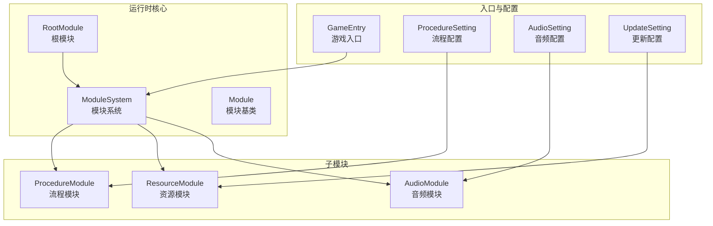
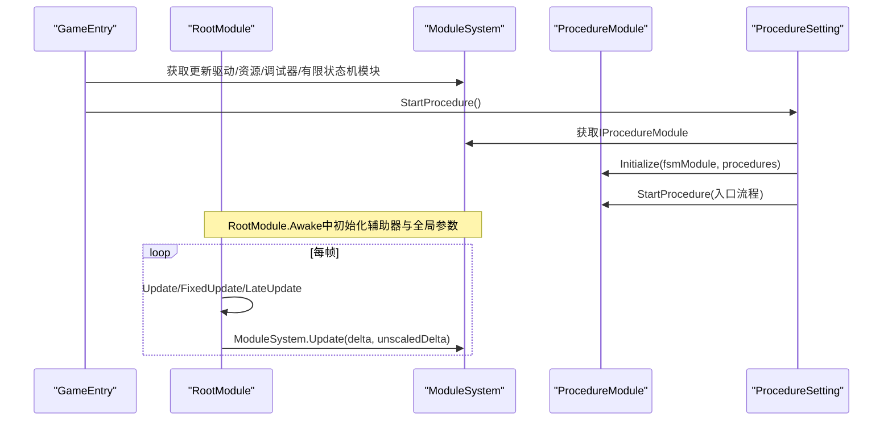
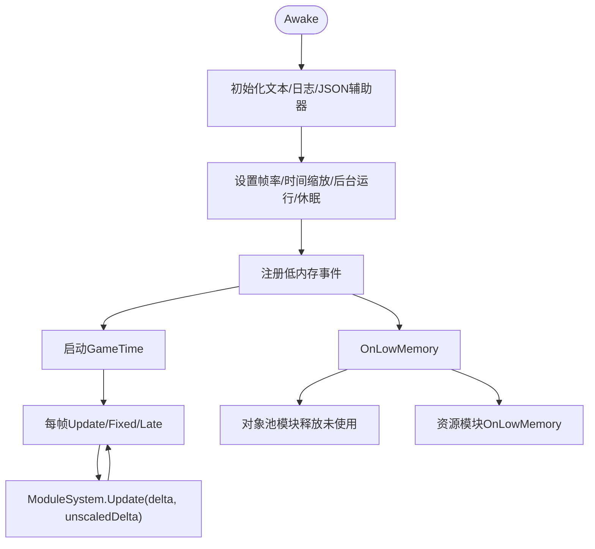
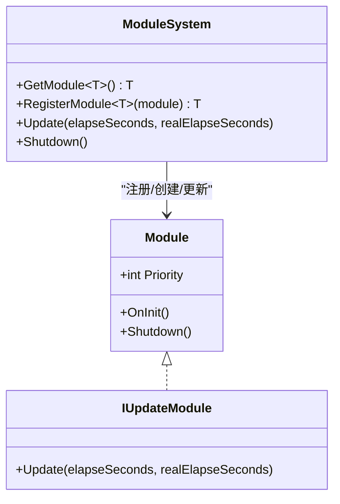
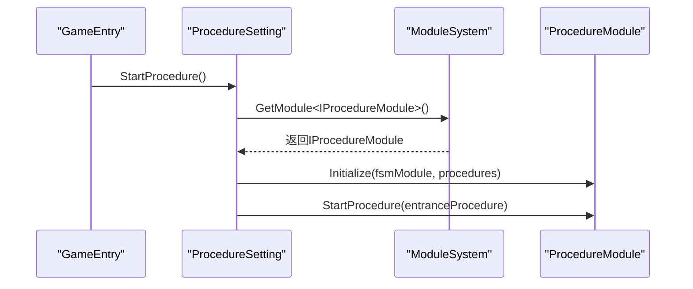
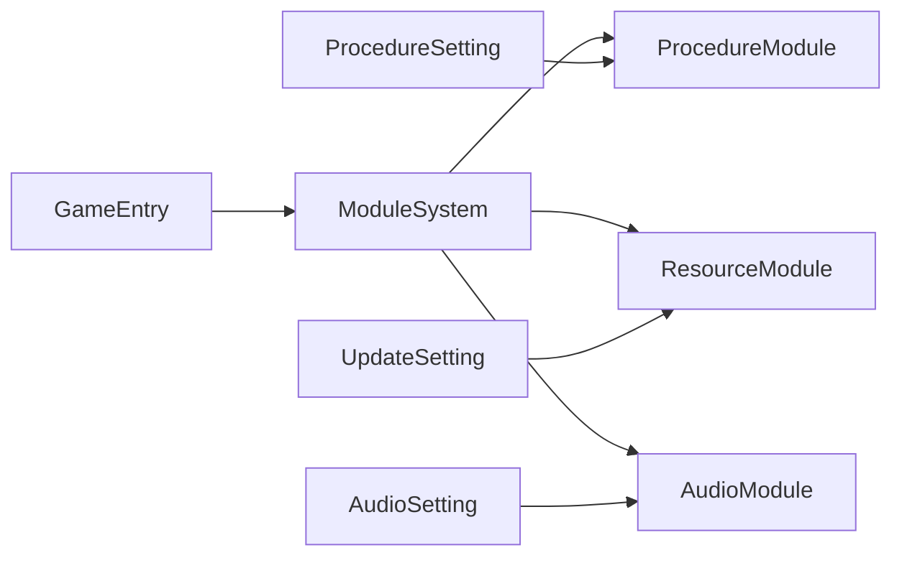
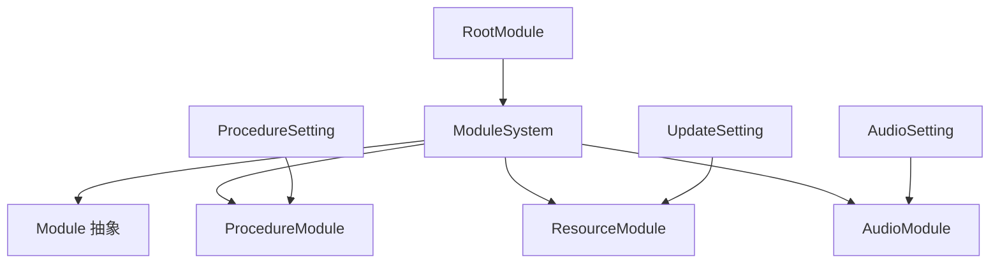

# 根模块设计

<cite>
**本文档引用的文件**
- [RootModule.cs](file://Assets/TEngine/Runtime/Module/RootModule.cs)
- [ModuleSystem.cs](file://Assets/TEngine/Runtime/Core/ModuleSystem.cs)
- [Module.cs](file://Assets/TEngine/Runtime/Core/Module.cs)
- [GameEntry.cs](file://Assets/GameScripts/GameEntry.cs)
- [ProcedureSetting.asset](file://Assets/TEngine/Settings/ProcedureSetting.asset)
- [AudioSetting.asset](file://Assets/TEngine/Settings/AudioSetting.asset)
- [UpdateSetting.asset](file://Assets/TEngine/Settings/UpdateSetting.asset)
- [UpdateSetting.cs](file://Assets/TEngine/Runtime/Core/UpdateSetting.cs)
- [ProcedureSetting.cs](file://Assets/TEngine/Runtime/Module/ProcedureModule/ProcedureSetting.cs)
- [AudioSetting.cs](file://Assets/TEngine/Runtime/Module/AudioModule/AudioSetting.cs)
- [ProcedureModule.cs](file://Assets/TEngine/Runtime/Module/ProcedureModule/ProcedureModule.cs)
- [ResourceModule.cs](file://Assets/TEngine/Runtime/Module/ResourceModule/ResourceModule.cs)
- [AudioModule.cs](file://Assets/TEngine/Runtime/Module/AudioModule/AudioModule.cs)
</cite>

## 目录
1. [引言](#引言)
2. [项目结构](#项目结构)
3. [核心组件](#核心组件)
4. [架构总览](#架构总览)
5. [详细组件分析](#详细组件分析)
6. [依赖分析](#依赖分析)
7. [性能考虑](#性能考虑)
8. [故障排查指南](#故障排查指南)
9. [结论](#结论)
10. [附录](#附录)

## 引言
本文件面向TEngine框架的根模块（RootModule），系统性阐述其作为框架核心配置中心的设计与实现。RootModule承担以下职责：
- 全局配置项管理：帧率、游戏速度、后台运行、休眠策略等。
- 全局辅助器注册：文本、日志、JSON序列化等。
- 生命周期与调度：Awake初始化、Update/FixedUpdate/LateUpdate驱动模块系统、内存告警处理。
- 与子模块协作：通过ModuleSystem统一管理模块的创建、注册、更新与关闭；通过配置资源（如ProcedureSetting、AudioSetting）驱动流程与功能模块。

同时，本文将详细说明配置文件的结构与加载机制，给出根模块初始化流程图与配置继承关系图，并提供自定义配置项的添加方法与最佳实践。

## 项目结构
围绕根模块的关键文件与配置如下：
- 根模块：Assets/TEngine/Runtime/Module/RootModule.cs
- 模块系统：Assets/TEngine/Runtime/Core/ModuleSystem.cs、Assets/TEngine/Runtime/Core/Module.cs
- 入口脚本：Assets/GameScripts/GameEntry.cs
- 配置资源：
  - 流程配置：Assets/TEngine/Settings/ProcedureSetting.asset 及其实现 Assets/TEngine/Runtime/Module/ProcedureModule/ProcedureSetting.cs
  - 音频配置：Assets/TEngine/Settings/AudioSetting.asset 及其实现 Assets/TEngine/Runtime/Module/AudioModule/AudioSetting.cs
  - 更新配置：Assets/TEngine/Settings/UpdateSetting.asset 及其实现 Assets/TEngine/Runtime/Core/UpdateSetting.cs
- 子模块示例：
  - 流程模块：Assets/TEngine/Runtime/Module/ProcedureModule/ProcedureModule.cs
  - 资源模块：Assets/TEngine/Runtime/Module/ResourceModule/ResourceModule.cs
  - 音频模块：Assets/TEngine/Runtime/Module/AudioModule/AudioModule.cs

**图表来源**
- [RootModule.cs:1-304](file://Assets/TEngine/Runtime/Module/RootModule.cs#L1-L304)
- [ModuleSystem.cs:1-208](file://Assets/TEngine/Runtime/Core/ModuleSystem.cs#L1-L208)
- [Module.cs:1-40](file://Assets/TEngine/Runtime/Core/Module.cs#L1-L40)
- [GameEntry.cs:1-15](file://Assets/GameScripts/GameEntry.cs#L1-L15)
- [ProcedureSetting.cs:1-104](file://Assets/TEngine/Runtime/Module/ProcedureModule/ProcedureSetting.cs#L1-L104)
- [AudioSetting.cs:1-10](file://Assets/TEngine/Runtime/Module/AudioModule/AudioSetting.cs#L1-L10)
- [UpdateSetting.cs:1-220](file://Assets/TEngine/Runtime/Core/UpdateSetting.cs#L1-L220)
- [ProcedureModule.cs:1-209](file://Assets/TEngine/Runtime/Module/ProcedureModule/ProcedureModule.cs#L1-L209)
- [ResourceModule.cs:1-800](file://Assets/TEngine/Runtime/Module/ResourceModule/ResourceModule.cs#L1-L800)
- [AudioModule.cs:1-571](file://Assets/TEngine/Runtime/Module/AudioModule/AudioModule.cs#L1-L571)

**章节来源**
- [RootModule.cs:1-304](file://Assets/TEngine/Runtime/Module/RootModule.cs#L1-L304)
- [ModuleSystem.cs:1-208](file://Assets/TEngine/Runtime/Core/ModuleSystem.cs#L1-L208)
- [Module.cs:1-40](file://Assets/TEngine/Runtime/Core/Module.cs#L1-L40)
- [GameEntry.cs:1-15](file://Assets/GameScripts/GameEntry.cs#L1-L15)

## 核心组件
- RootModule（根模块）
  - 作用：全局配置中心、辅助器注册、生命周期与调度、内存告警处理。
  - 关键点：Awake中初始化文本/日志/JSON辅助器、设置帧率/时间缩放/后台运行/休眠策略；Update中驱动GameTime与ModuleSystem；OnLowMemory触发对象池与资源模块回收。
- ModuleSystem（模块系统）
  - 作用：模块注册、优先级排序、更新队列构建与执行、模块关闭清理。
  - 关键点：按Priority插入有序链表；IUpdateModule自动加入更新执行列表；Shutdown时反向关闭并清空缓存。
- Module（模块基类）
  - 作用：定义模块抽象接口（OnInit/Shutdown）、优先级（Priority）与更新接口（IUpdateModule）。
- 配置资源与实现
  - ProcedureSetting：声明可用流程类型与入口流程，启动流程引擎。
  - AudioSetting：声明音频分组配置（音量、静音、代理数量、滚动衰减等）。
  - UpdateSetting：声明热更新、AOT元数据、资源下载路径、WebGL加载策略等。

**章节来源**
- [RootModule.cs:116-167](file://Assets/TEngine/Runtime/Module/RootModule.cs#L116-L167)
- [ModuleSystem.cs:29-60](file://Assets/TEngine/Runtime/Core/ModuleSystem.cs#L29-L60)
- [Module.cs:8-39](file://Assets/TEngine/Runtime/Core/Module.cs#L8-L39)
- [ProcedureSetting.cs:14-102](file://Assets/TEngine/Runtime/Module/ProcedureModule/ProcedureSetting.cs#L14-L102)
- [AudioSetting.cs:5-9](file://Assets/TEngine/Runtime/Module/AudioModule/AudioSetting.cs#L5-L9)
- [UpdateSetting.cs:50-220](file://Assets/TEngine/Runtime/Core/UpdateSetting.cs#L50-L220)

## 架构总览
RootModule作为全局单例，负责：
- 初始化辅助器（文本、日志、JSON）。
- 设置全局运行参数（帧率、时间缩放、后台运行、休眠）。
- 驱动模块系统更新。
- 在内存告警时触发对象池与资源模块回收。
- 通过配置资源驱动子模块初始化与行为。

**图表来源**
- [GameEntry.cs:6-14](file://Assets/GameScripts/GameEntry.cs#L6-L14)
- [RootModule.cs:140-144](file://Assets/TEngine/Runtime/Module/RootModule.cs#L140-L144)
- [ModuleSystem.cs:29-42](file://Assets/TEngine/Runtime/Core/ModuleSystem.cs#L29-L42)
- [ProcedureSetting.cs:55-102](file://Assets/TEngine/Runtime/Module/ProcedureModule/ProcedureSetting.cs#L55-L102)
- [ProcedureModule.cs:86-123](file://Assets/TEngine/Runtime/Module/ProcedureModule/ProcedureModule.cs#L86-L123)

## 详细组件分析

### RootModule（根模块）
- 全局配置项
  - 帧率：设置Application.targetFrameRate。
  - 游戏速度：设置Time.timeScale，支持暂停/恢复/归一。
  - 后台运行：Application.runInBackground。
  - 休眠策略：Screen.sleepTimeout。
  - DPI：根据屏幕DPI设置转换工具。
- 辅助器注册
  - 文本辅助器：通过类型名反射创建并设置。
  - 日志辅助器：通过类型名反射创建并设置。
  - JSON辅助器：通过类型名反射创建并设置。
- 生命周期与调度
  - Awake：初始化辅助器、设置全局参数、注册低内存事件、启动GameTime。
  - Update/FixedUpdate/LateUpdate：推进GameTime并调用ModuleSystem.Update。
  - OnDestroy：在非编辑器环境调用ModuleSystem.Shutdown。
  - OnApplicationQuit：注销低内存事件并停止协程。
- 内存告警处理
  - 触发对象池模块释放未使用对象。
  - 触发资源模块OnLowMemory回收策略。

**图表来源**
- [RootModule.cs:116-167](file://Assets/TEngine/Runtime/Module/RootModule.cs#L116-L167)
- [RootModule.cs:287-302](file://Assets/TEngine/Runtime/Module/RootModule.cs#L287-L302)

**章节来源**
- [RootModule.cs:30-111](file://Assets/TEngine/Runtime/Module/RootModule.cs#L30-L111)
- [RootModule.cs:116-167](file://Assets/TEngine/Runtime/Module/RootModule.cs#L116-L167)
- [RootModule.cs:214-285](file://Assets/TEngine/Runtime/Module/RootModule.cs#L214-L285)
- [RootModule.cs:287-302](file://Assets/TEngine/Runtime/Module/RootModule.cs#L287-L302)

### ModuleSystem（模块系统）
- 模块注册与创建
  - 通过接口类型推导实现类型并创建实例。
  - 注册到模块映射表，并按Priority插入模块链表。
- 更新队列
  - 实现IUpdateModule的模块按Priority插入更新链表。
  - 每帧遍历执行更新。
- 关闭与清理
  - 反向遍历模块链表关闭模块。
  - 清空映射与缓存，释放内存池与托管缓冲区。

**图表来源**
- [Module.cs:8-39](file://Assets/TEngine/Runtime/Core/Module.cs#L8-L39)
- [ModuleSystem.cs:68-141](file://Assets/TEngine/Runtime/Core/ModuleSystem.cs#L68-L141)
- [ModuleSystem.cs:199-206](file://Assets/TEngine/Runtime/Core/ModuleSystem.cs#L199-L206)

**章节来源**
- [ModuleSystem.cs:17-194](file://Assets/TEngine/Runtime/Core/ModuleSystem.cs#L17-L194)

### 配置文件与加载机制
- ProcedureSetting（流程配置）
  - 结构：availableProcedureTypeNames声明可用流程类型；entranceProcedureTypeName声明入口流程。
  - 加载与启动：GameEntry中调用Settings.ProcedureSetting.StartProcedure()，通过ModuleSystem获取IProcedureModule并初始化流程引擎，随后启动入口流程。
- AudioSetting（音频配置）
  - 结构：audioGroupConfigs数组，包含分组名称、静音、音量、代理数量、音频类型、衰减模式、最小/最大距离等。
  - 加载与应用：AudioModule在OnInit中读取Settings.AudioSetting.audioGroupConfigs并初始化各音频轨道。
- UpdateSetting（更新配置）
  - 结构：项目名、热更新程序集、AOT元数据、主业务DLL名、程序集文本资产扩展与路径、更新样式与提示、资源下载路径与备用地址、WebGL加载策略、构建资源地址等。
  - 加载与应用：RootModule在Awake中读取屏幕DPI并设置全局参数；资源模块在初始化时依据该配置选择运行模式与下载策略。

**图表来源**
- [GameEntry.cs:12](file://Assets/GameScripts/GameEntry.cs#L12)
- [ProcedureSetting.cs:55-102](file://Assets/TEngine/Runtime/Module/ProcedureModule/ProcedureSetting.cs#L55-L102)
- [ProcedureModule.cs:86-123](file://Assets/TEngine/Runtime/Module/ProcedureModule/ProcedureModule.cs#L86-L123)

**章节来源**
- [ProcedureSetting.asset:15-27](file://Assets/TEngine/Settings/ProcedureSetting.asset#L15-L27)
- [ProcedureSetting.cs:14-102](file://Assets/TEngine/Runtime/Module/ProcedureModule/ProcedureSetting.cs#L14-L102)
- [AudioSetting.asset:15-47](file://Assets/TEngine/Settings/AudioSetting.asset#L15-L47)
- [AudioSetting.cs:5-9](file://Assets/TEngine/Runtime/Module/AudioModule/AudioSetting.cs#L5-L9)
- [UpdateSetting.asset:15-36](file://Assets/TEngine/Settings/UpdateSetting.asset#L15-L36)
- [UpdateSetting.cs:50-220](file://Assets/TEngine/Runtime/Core/UpdateSetting.cs#L50-L220)

### 子模块初始化顺序与依赖关系
- 依赖关系
  - RootModule依赖ModuleSystem进行模块调度。
  - GameEntry在Awake阶段主动获取更新驱动、资源、调试器、有限状态机模块，确保这些基础模块先于流程模块可用。
  - ProcedureSetting依赖IProcedureModule与IFsmModule，通过StartProcedure启动流程引擎。
  - AudioModule依赖IResourceModule与AudioSetting。
  - ResourceModule依赖YooAsset，依据UpdateSetting选择运行模式与下载策略。
- 初始化顺序建议
  - 基础模块（更新驱动、资源、调试器、FSM）→ 流程模块 → 功能模块（音频、场景、本地化等）。
  - 通过ModuleSystem的Priority与注册顺序保证更新与关闭的先后一致性。

**图表来源**
- [GameEntry.cs:8-12](file://Assets/GameScripts/GameEntry.cs#L8-L12)
- [ProcedureModule.cs:86-123](file://Assets/TEngine/Runtime/Module/ProcedureModule/ProcedureModule.cs#L86-L123)
- [AudioModule.cs:322-326](file://Assets/TEngine/Runtime/Module/AudioModule/AudioModule.cs#L322-L326)
- [ResourceModule.cs:119-138](file://Assets/TEngine/Runtime/Module/ResourceModule/ResourceModule.cs#L119-L138)

**章节来源**
- [GameEntry.cs:6-14](file://Assets/GameScripts/GameEntry.cs#L6-L14)
- [ProcedureModule.cs:26](file://Assets/TEngine/Runtime/Module/ProcedureModule/ProcedureModule.cs#L26)
- [AudioModule.cs:322-326](file://Assets/TEngine/Runtime/Module/AudioModule/AudioModule.cs#L322-L326)
- [ResourceModule.cs:45](file://Assets/TEngine/Runtime/Module/ResourceModule/ResourceModule.cs#L45)

## 依赖分析
- RootModule对ModuleSystem的依赖是核心：所有模块的创建、注册、更新与关闭均由ModuleSystem统一管理。
- 配置资源与实现分离：ScriptableObject配置文件提供静态数据，对应实现类在运行时解析并应用。
- 子模块间依赖清晰：流程模块依赖FSM模块；音频模块依赖资源模块；资源模块依赖外部库（YooAsset）与配置（UpdateSetting）。

**图表来源**
- [RootModule.cs:116-167](file://Assets/TEngine/Runtime/Module/RootModule.cs#L116-L167)
- [ModuleSystem.cs:68-141](file://Assets/TEngine/Runtime/Core/ModuleSystem.cs#L68-L141)
- [ProcedureModule.cs:86-123](file://Assets/TEngine/Runtime/Module/ProcedureModule/ProcedureModule.cs#L86-L123)
- [AudioModule.cs:322-326](file://Assets/TEngine/Runtime/Module/AudioModule/AudioModule.cs#L322-L326)
- [ResourceModule.cs:119-138](file://Assets/TEngine/Runtime/Module/ResourceModule/ResourceModule.cs#L119-L138)

**章节来源**
- [ModuleSystem.cs:17-194](file://Assets/TEngine/Runtime/Core/ModuleSystem.cs#L17-L194)

## 性能考虑
- 模块更新队列优化：ModuleSystem按Priority维护更新链表，避免每帧重复排序，降低开销。
- 低内存处理：RootModule在内存告警时触发对象池与资源模块回收，有助于缓解内存压力。
- 资源加载策略：ResourceModule依据UpdateSetting选择不同运行模式（单机/联机/WebGL），合理配置可减少不必要的网络请求与磁盘IO。
- 帧率与时间缩放：RootModule提供帧率与时间缩放控制，便于在开发与发布阶段平衡性能与体验。

## 故障排查指南
- 根模块未生效
  - 检查场景中是否存在RootModule实例，确保Awake被调用。
  - 确认GameEntry已调用ModuleSystem.GetModule系列方法以激活基础模块。
- 辅助器初始化失败
  - 检查RootModule中的文本/日志/JSON辅助器类型名是否正确，类型是否存在。
- 流程模块异常
  - 检查ProcedureSetting中可用流程类型与入口流程是否正确，类型是否可被反射创建。
- 音频模块异常
  - 检查AudioSetting中分组配置是否完整，音频混响器资源是否存在。
- 资源模块异常
  - 检查UpdateSetting中运行模式与下载路径配置，确认YooAsset初始化参数正确。

**章节来源**
- [RootModule.cs:214-285](file://Assets/TEngine/Runtime/Module/RootModule.cs#L214-L285)
- [ProcedureSetting.cs:71-89](file://Assets/TEngine/Runtime/Module/ProcedureModule/ProcedureSetting.cs#L71-L89)
- [AudioModule.cs:341-396](file://Assets/TEngine/Runtime/Module/AudioModule/AudioModule.cs#L341-L396)
- [ResourceModule.cs:119-138](file://Assets/TEngine/Runtime/Module/ResourceModule/ResourceModule.cs#L119-L138)

## 结论
RootModule作为TEngine框架的核心配置中心，通过统一的模块系统与配置资源，实现了全局参数管理、辅助器注册、生命周期调度与内存告警处理。配合ProcedureSetting、AudioSetting、UpdateSetting等配置，RootModule能够协调各子模块的初始化顺序与依赖关系，形成稳定、可扩展的运行时架构。遵循本文提供的初始化流程与最佳实践，可有效提升项目的可维护性与性能表现。

## 附录

### 自定义配置项添加方法与最佳实践
- 新增ScriptableObject配置
  - 在Runtime/Settings下创建新的ScriptableObject类，标注CreateAssetMenu以便在Project窗口创建。
  - 在Settings目录下创建对应的.asset资源文件，填写字段。
- 在根模块中应用配置
  - 在RootModule的Awake或相应初始化阶段读取配置并设置全局参数。
  - 若涉及子模块，可在子模块OnInit中读取配置并应用。
- 最佳实践
  - 配置项命名清晰、注释完整，避免魔法数字与字符串硬编码。
  - 对外暴露只读属性或受控setter，确保全局一致性。
  - 在编辑器与运行时分别处理默认值与回退逻辑。
  - 对于影响全局性能的配置（如帧率、时间缩放、下载策略），提供运行时动态调整能力与安全边界。

**章节来源**
- [UpdateSetting.cs:50-220](file://Assets/TEngine/Runtime/Core/UpdateSetting.cs#L50-L220)
- [RootModule.cs:116-167](file://Assets/TEngine/Runtime/Module/RootModule.cs#L116-L167)