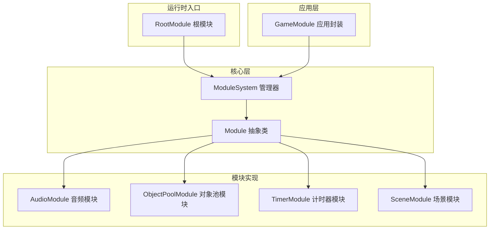
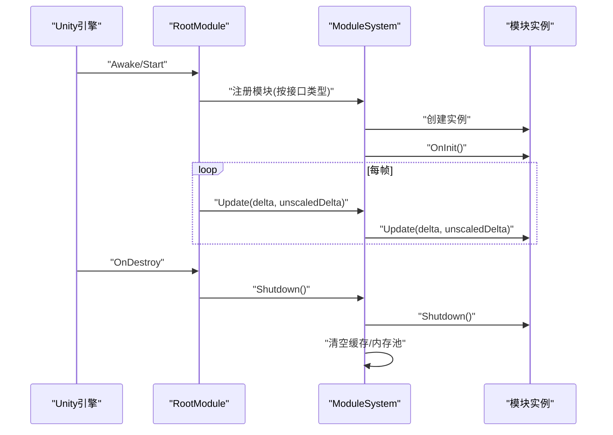
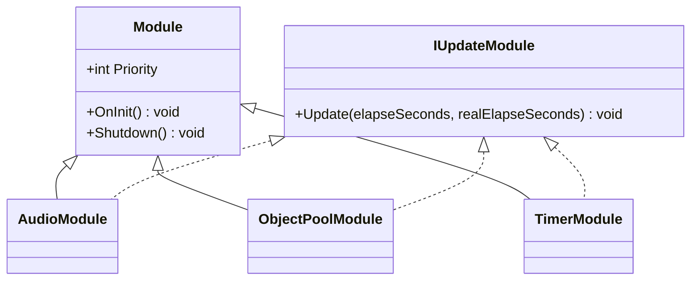
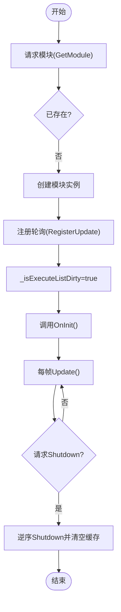
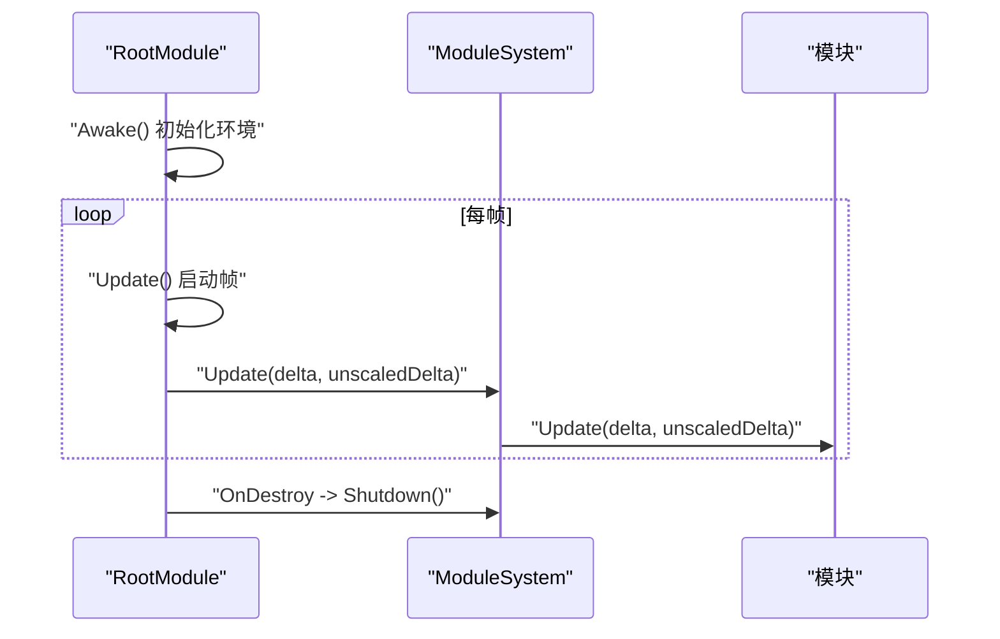
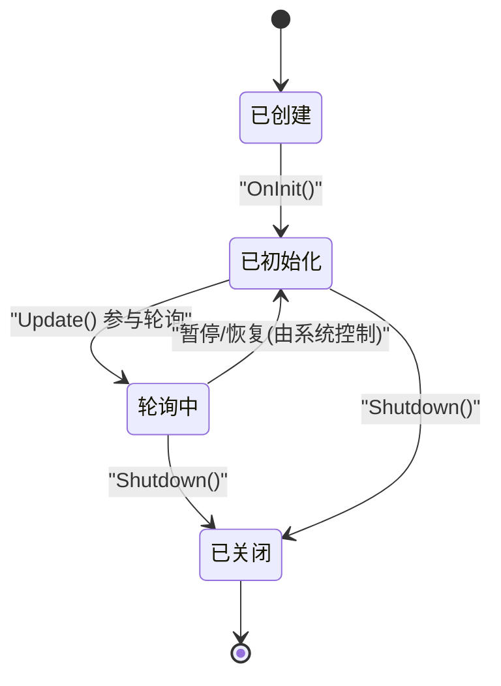
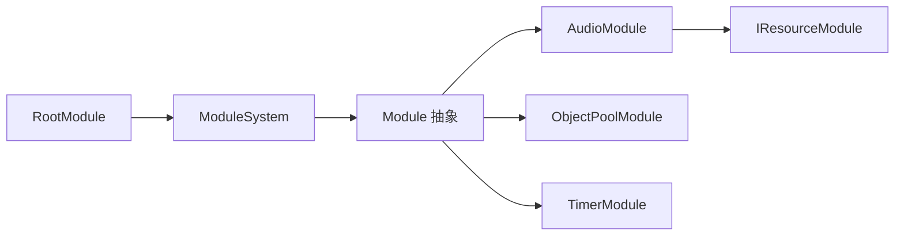
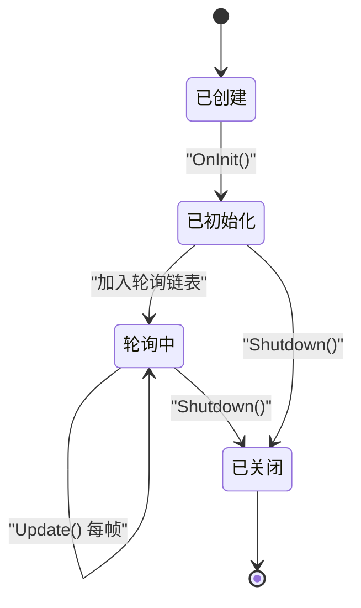

# 模块生命周期管理

<cite>
**本文档引用的文件**
- [Module.cs](file://Assets/TEngine/Runtime/Core/Module.cs)
- [ModuleSystem.cs](file://Assets/TEngine/Runtime/Core/ModuleSystem.cs)
- [RootModule.cs](file://Assets/TEngine/Runtime/Module/RootModule.cs)
- [GameModule.cs](file://Assets/GameScripts/HotFix/GameLogic/GameModule.cs)
- [AudioModule.cs](file://Assets/TEngine/Runtime/Module/AudioModule/AudioModule.cs)
- [ObjectPoolModule.cs](file://Assets/TEngine/Runtime/Module/ObjectPoolModule/ObjectPoolModule.cs)
- [TimerModule.cs](file://Assets/TEngine/Runtime/Module/TimerModule/TimerModule.cs)
- [SceneModule.cs](file://Assets/TEngine/Runtime/Module/SceneModule/SceneModule.cs)
- [IResourceModule.cs](file://Assets/TEngine/Runtime/Module/ResourceModule/IResourceModule.cs)
</cite>

## 目录
1. [引言](#引言)
2. [项目结构](#项目结构)
3. [核心组件](#核心组件)
4. [架构总览](#架构总览)
5. [详细组件分析](#详细组件分析)
6. [依赖关系分析](#依赖关系分析)
7. [性能考量](#性能考量)
8. [故障排查指南](#故障排查指南)
9. [结论](#结论)
10. [附录](#附录)

## 引言
本文件系统性阐述 TEngine 框架的模块生命周期管理机制，覆盖从模块创建、注册、初始化、轮询、暂停/恢复、到卸载与资源清理的完整流程；解释模块间的优先级调度、状态同步与事件通知；给出生命周期钩子函数的使用方法与回调时机；并通过状态图与时序图直观展示典型模块的生命周期轨迹；最后总结异常处理与资源清理的最佳实践。

## 项目结构
TEngine 的模块体系由以下关键层次构成：
- 核心层：模块抽象与系统管理（Module、ModuleSystem）
- 运行时入口：根模块 RootModule，负责帧驱动与全局生命周期触发
- 模块实现：各功能模块（如音频、对象池、计时器等），继承 Module 并可实现 IUpdateModule
- 应用层封装：GameModule 提供统一访问入口，按需惰性获取模块实例

图表来源
- [Module.cs:22-39](file://Assets/TEngine/Runtime/Core/Module.cs#L22-L39)
- [ModuleSystem.cs:9-208](file://Assets/TEngine/Runtime/Core/ModuleSystem.cs#L9-L208)
- [RootModule.cs:10-304](file://Assets/TEngine/Runtime/Module/RootModule.cs#L10-L304)
- [GameModule.cs:5-118](file://Assets/GameScripts/HotFix/GameLogic/GameModule.cs#L5-L118)

章节来源
- [Module.cs:1-40](file://Assets/TEngine/Runtime/Core/Module.cs#L1-L40)
- [ModuleSystem.cs:1-208](file://Assets/TEngine/Runtime/Core/ModuleSystem.cs#L1-L208)
- [RootModule.cs:1-304](file://Assets/TEngine/Runtime/Module/RootModule.cs#L1-L304)
- [GameModule.cs:1-118](file://Assets/GameScripts/HotFix/GameLogic/GameModule.cs#L1-L118)

## 核心组件
- 模块抽象与钩子
  - Module 定义了 OnInit 与 Shutdown 两个生命周期钩子，以及可选的优先级 Priority
  - IUpdateModule 定义 Update 钩子，用于参与系统轮询
- 模块系统管理
  - ModuleSystem 负责模块注册、创建、优先级排序、轮询列表构建与全局 Shutdown
  - 支持通过接口类型获取模块实例，内部基于命名空间+接口名映射到具体实现类型
- 根模块与帧驱动
  - RootModule 在 Unity 生命周期中启动模块系统轮询，并在退出时触发全局 Shutdown
  - 提供暂停/恢复游戏速度等全局状态控制

章节来源
- [Module.cs:8-39](file://Assets/TEngine/Runtime/Core/Module.cs#L8-L39)
- [ModuleSystem.cs:9-208](file://Assets/TEngine/Runtime/Core/ModuleSystem.cs#L9-L208)
- [RootModule.cs:10-304](file://Assets/TEngine/Runtime/Module/RootModule.cs#L10-L304)

## 架构总览
模块生命周期的关键流转如下：
- 注册阶段：通过接口类型请求模块，若不存在则动态创建并注册；同时根据实现 IUpdateModule 决定是否加入轮询链表
- 初始化阶段：模块注册完成后立即调用其 OnInit
- 轮询阶段：RootModule 每帧调用 ModuleSystem.Update，后者按优先级顺序遍历轮询列表
- 卸载阶段：RootModule OnDestroy 触发 ModuleSystem.Shutdown，逆序调用模块 Shutdown，并清理内部缓存

图表来源
- [RootModule.cs:116-167](file://Assets/TEngine/Runtime/Module/RootModule.cs#L116-L167)
- [ModuleSystem.cs:29-60](file://Assets/TEngine/Runtime/Core/ModuleSystem.cs#L29-L60)
- [ModuleSystem.cs:127-194](file://Assets/TEngine/Runtime/Core/ModuleSystem.cs#L127-L194)

## 详细组件分析

### 模块抽象与生命周期钩子
- Module 抽象类
  - Priority：模块优先级，决定注册顺序与关闭顺序
  - OnInit：模块初始化钩子
  - Shutdown：模块关闭与资源清理钩子
- IUpdateModule 接口
  - Update：参与系统轮询，接收逻辑时间与真实时间参数

图表来源
- [Module.cs:22-39](file://Assets/TEngine/Runtime/Core/Module.cs#L22-L39)
- [AudioModule.cs:11](file://Assets/TEngine/Runtime/Module/AudioModule/AudioModule.cs#L11)
- [ObjectPoolModule.cs:9](file://Assets/TEngine/Runtime/Module/ObjectPoolModule/ObjectPoolModule.cs#L9)
- [TimerModule.cs:8](file://Assets/TEngine/Runtime/Module/TimerModule/TimerModule.cs#L8)

章节来源
- [Module.cs:8-39](file://Assets/TEngine/Runtime/Core/Module.cs#L8-L39)

### 模块系统管理（注册、轮询、关闭）
- 注册与创建
  - GetModule<T>()：通过接口类型解析实现类型并创建实例，加入模块映射与更新链表
  - RegisterModule<T>()：允许外部注入已有的模块实例
- 轮询构建
  - RegisterUpdate：按 Priority 插入模块到双链表，实现稳定排序
  - BuildExecuteList：在执行列表标记脏时一次性重建，避免每帧重复构建
- 关闭与清理
  - Shutdown：逆序遍历模块链表调用 Shutdown，并清空字典、链表与内存池

图表来源
- [ModuleSystem.cs:68-120](file://Assets/TEngine/Runtime/Core/ModuleSystem.cs#L68-L120)
- [ModuleSystem.cs:143-194](file://Assets/TEngine/Runtime/Core/ModuleSystem.cs#L143-L194)
- [ModuleSystem.cs:47-60](file://Assets/TEngine/Runtime/Core/ModuleSystem.cs#L47-L60)

章节来源
- [ModuleSystem.cs:9-208](file://Assets/TEngine/Runtime/Core/ModuleSystem.cs#L9-L208)

### 根模块与帧驱动
- RootModule 在 Awake 中初始化辅助组件（文本、日志、JSON），设置帧率、时间缩放、后台运行与休眠策略
- RootModule 在 Update 中推动 GameTime 并调用 ModuleSystem.Update
- RootModule 在 OnDestroy 中触发 ModuleSystem.Shutdown，确保模块有序释放

图表来源
- [RootModule.cs:116-167](file://Assets/TEngine/Runtime/Module/RootModule.cs#L116-L167)
- [ModuleSystem.cs:29-60](file://Assets/TEngine/Runtime/Core/ModuleSystem.cs#L29-L60)

章节来源
- [RootModule.cs:10-304](file://Assets/TEngine/Runtime/Module/RootModule.cs#L10-L304)

### 应用层模块访问封装
- GameModule 提供静态属性访问各类模块接口，内部通过 ModuleSystem.GetModule<T>() 获取
- Shutdown 时对静态缓存进行清理，便于彻底释放

章节来源
- [GameModule.cs:5-118](file://Assets/GameScripts/HotFix/GameLogic/GameModule.cs#L5-L118)

### 典型模块实现示例

#### 音频模块（AudioModule）
- 继承 Module 并实现 IUpdateModule
- OnInit：获取资源模块并初始化音频轨道组
- Shutdown：停止所有音频并清理对象池
- Update：逐类更新音频代理

图表来源
- [AudioModule.cs:322-332](file://Assets/TEngine/Runtime/Module/AudioModule/AudioModule.cs#L322-L332)
- [AudioModule.cs:560-569](file://Assets/TEngine/Runtime/Module/AudioModule/AudioModule.cs#L560-L569)

章节来源
- [AudioModule.cs:11-571](file://Assets/TEngine/Runtime/Module/AudioModule/AudioModule.cs#L11-L571)

#### 对象池模块（ObjectPoolModule）
- 继承 Module 并实现 IUpdateModule
- Priority 较高，确保对象池在其他模块之前完成轮询清理
- Shutdown：逐个关闭对象池并清空容器

章节来源
- [ObjectPoolModule.cs:9-800](file://Assets/TEngine/Runtime/Module/ObjectPoolModule/ObjectPoolModule.cs#L9-L800)

#### 计时器模块（TimerModule）
- 继承 Module 并实现 IUpdateModule
- 提供定时器管理与暂停/恢复/重置/删除等能力
- Shutdown：清理所有定时器与系统计时器

章节来源
- [TimerModule.cs:8-478](file://Assets/TEngine/Runtime/Module/TimerModule/TimerModule.cs#L8-L478)

#### 场景模块（SceneModule）
- 提供场景激活/挂起/解除挂起等操作
- 通过 IResourceModule 驱动资源加载与卸载

章节来源
- [SceneModule.cs:235-278](file://Assets/TEngine/Runtime/Module/SceneModule/SceneModule.cs#L235-L278)
- [IResourceModule.cs:48-88](file://Assets/TEngine/Runtime/Module/ResourceModule/IResourceModule.cs#L48-L88)

## 依赖关系分析
- 模块与系统
  - 模块依赖 ModuleSystem 进行注册与轮询调度
  - 模块可通过 ModuleSystem 获取其他模块接口（如资源模块）
- 根模块与系统
  - RootModule 作为帧驱动入口，连接 Unity 生命周期与 ModuleSystem
- 模块间耦合
  - 模块间通过接口解耦，典型依赖（如音频模块依赖资源模块）通过接口注入，降低紧耦合

图表来源
- [RootModule.cs:116-167](file://Assets/TEngine/Runtime/Module/RootModule.cs#L116-L167)
- [ModuleSystem.cs:68-120](file://Assets/TEngine/Runtime/Core/ModuleSystem.cs#L68-L120)
- [AudioModule.cs:324-325](file://Assets/TEngine/Runtime/Module/AudioModule/AudioModule.cs#L324-L325)
- [IResourceModule.cs:48-88](file://Assets/TEngine/Runtime/Module/ResourceModule/IResourceModule.cs#L48-L88)

章节来源
- [ModuleSystem.cs:9-208](file://Assets/TEngine/Runtime/Core/ModuleSystem.cs#L9-L208)
- [RootModule.cs:10-304](file://Assets/TEngine/Runtime/Module/RootModule.cs#L10-L304)

## 性能考量
- 轮询列表构建优化
  - 使用脏标记 _isExecuteListDirty，在模块注册/注销时才重建执行列表，避免每帧昂贵的排序
- 优先级调度
  - 通过双链表维护模块插入顺序，保证高优先级模块先初始化、后关闭
- 内存与GC
  - ModuleSystem 预设初始容量，减少扩容与GC
  - Shutdown 时清空字典、链表与内存池，降低泄漏风险

章节来源
- [ModuleSystem.cs:15-208](file://Assets/TEngine/Runtime/Core/ModuleSystem.cs#L15-L208)

## 故障排查指南
- 模块未创建或类型解析失败
  - 症状：按接口获取模块时报“找不到模块类型”或“必须通过接口获取”
  - 排查：确认接口命名空间与实现类型匹配，实现类构造函数无异常
- 模块未进入轮询
  - 症状：Update 不被调用
  - 排查：确认模块实现 IUpdateModule；检查 RegisterUpdate 是否正确插入轮询链表
- 模块关闭顺序问题
  - 症状：资源释放时依赖其他模块尚未关闭
  - 排查：调整 Priority；确认 Shutdown 逆序关闭逻辑生效
- 低内存事件处理
  - RootModule.OnLowMemory 会触发对象池与资源模块的紧急回收，必要时扩展模块的资源释放策略

章节来源
- [ModuleSystem.cs:68-120](file://Assets/TEngine/Runtime/Core/ModuleSystem.cs#L68-L120)
- [RootModule.cs:287-302](file://Assets/TEngine/Runtime/Module/RootModule.cs#L287-L302)

## 结论
TEngine 的模块生命周期管理以 Module 为核心抽象，结合 ModuleSystem 的注册/轮询/关闭机制与 RootModule 的帧驱动，形成清晰、可控、可扩展的模块体系。通过接口解耦与优先级调度，模块可在正确时机完成初始化与资源清理；通过脏标记与链表排序优化，兼顾易用性与性能。建议在新增模块时遵循统一的生命周期钩子与资源清理模式，确保系统稳定性与可维护性。

## 附录

### 模块生命周期状态转换图（通用）

图表来源
- [Module.cs:33-38](file://Assets/TEngine/Runtime/Core/Module.cs#L33-L38)
- [ModuleSystem.cs:143-194](file://Assets/TEngine/Runtime/Core/ModuleSystem.cs#L143-L194)
- [ModuleSystem.cs:47-60](file://Assets/TEngine/Runtime/Core/ModuleSystem.cs#L47-L60)