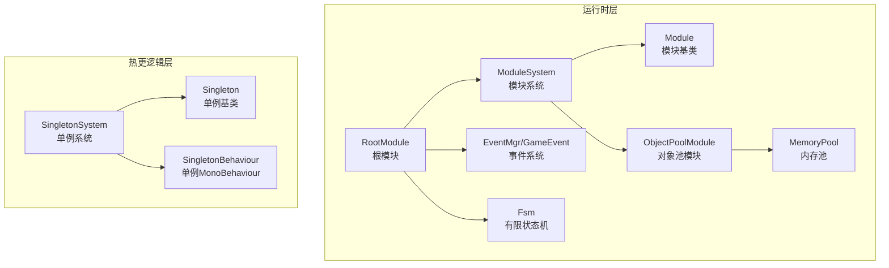
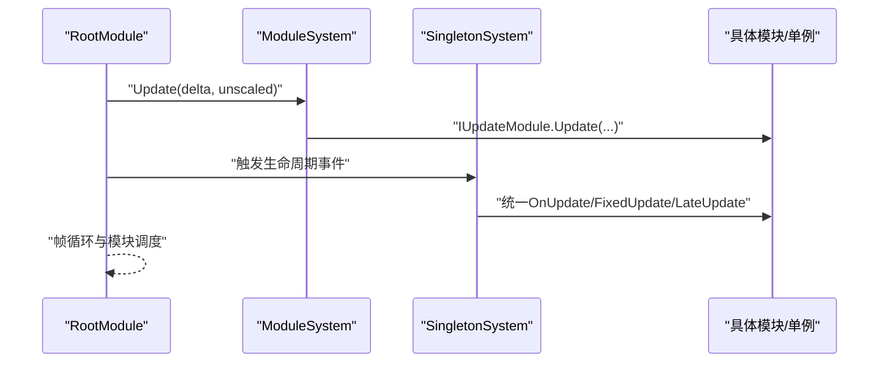
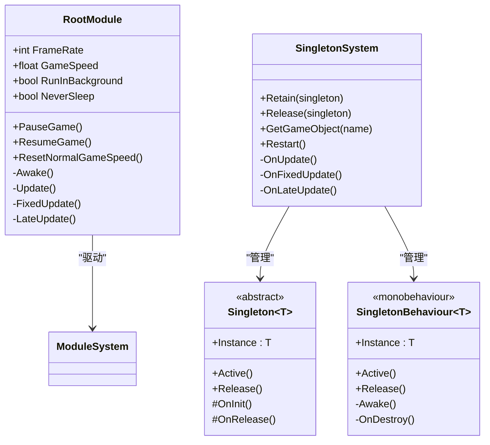
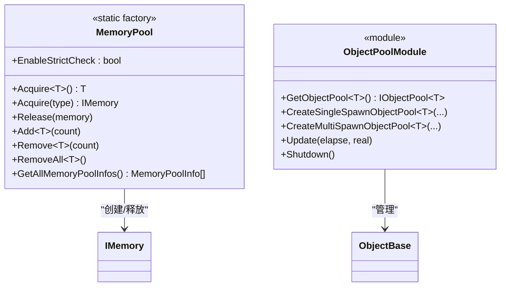
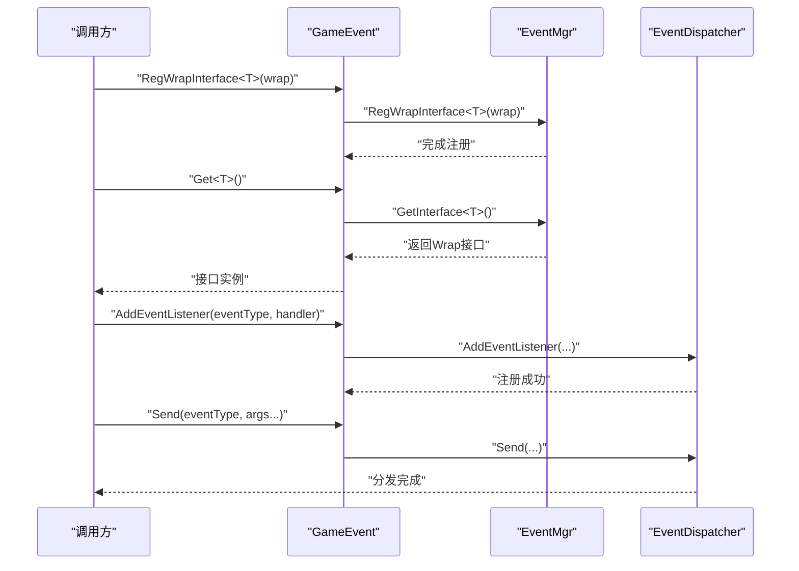
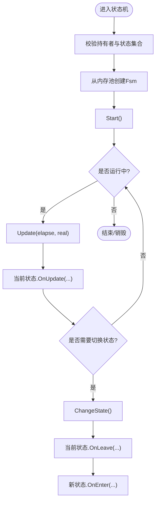
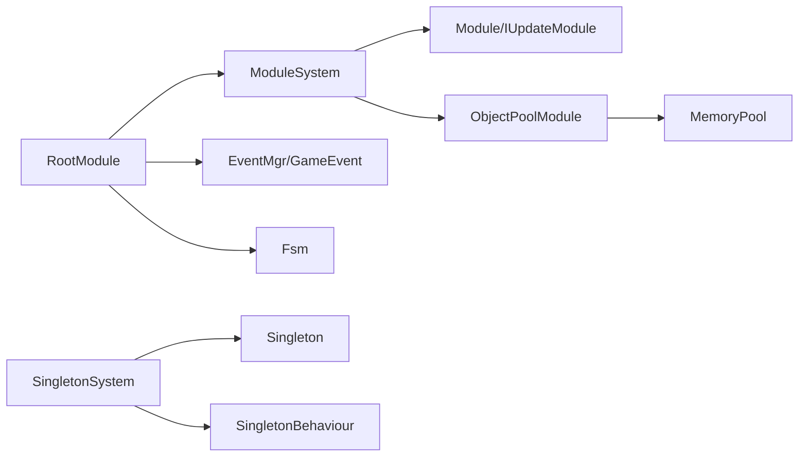

# 设计模式应用

<cite>
**本文引用的文件**
- [Singleton.cs](file://Assets/GameScripts/HotFix/GameLogic/SingletonSystem/Singleton.cs)
- [SingletonSystem.cs](file://Assets/GameScripts/HotFix/GameLogic/SingletonSystem/SingletonSystem.cs)
- [SingletonBehaviour.cs](file://Assets/GameScripts/HotFix/GameLogic/SingletonSystem/SingletonBehaviour.cs)
- [RootModule.cs](file://Assets/TEngine/Runtime/Module/RootModule.cs)
- [ModuleSystem.cs](file://Assets/TEngine/Runtime/Core/ModuleSystem.cs)
- [Module.cs](file://Assets/TEngine/Runtime/Core/Module.cs)
- [MemoryPool.cs](file://Assets/TEngine/Runtime/Core/MemoryPool/MemoryPool.cs)
- [ObjectPoolModule.cs](file://Assets/TEngine/Runtime/Module/ObjectPoolModule/ObjectPoolModule.cs)
- [EventMgr.cs](file://Assets/TEngine/Runtime/Core/GameEvent/EventMgr.cs)
- [GameEvent.cs](file://Assets/TEngine/Runtime/Core/GameEvent/GameEvent.cs)
- [Fsm.cs](file://Assets/TEngine/Runtime/Module/FsmModule/Fsm.cs)
</cite>

## 目录
1. [引言](#引言)
2. [项目结构](#项目结构)
3. [核心组件](#核心组件)
4. [架构总览](#架构总览)
5. [详细组件分析](#详细组件分析)
6. [依赖关系分析](#依赖关系分析)
7. [性能考量](#性能考量)
8. [故障排查指南](#故障排查指南)
9. [结论](#结论)
10. [附录](#附录)

## 引言
本文件聚焦于TEngine框架中的四大设计模式：单例模式、工厂模式、观察者模式与状态机模式。通过对根模块、模块系统、单例系统、内存池、对象池、事件系统与有限状态机等核心组件的深入剖析，阐明各模式在框架中的实现方式、应用场景、交互流程与性能权衡，并辅以UML类图与序列图帮助读者快速建立整体认知。

## 项目结构
TEngine将“运行时”与“热更逻辑”分层组织：
- 运行时层（Runtime）：提供基础框架能力，如模块系统、内存池、事件系统、状态机等。
- 热更逻辑层（HotFix）：提供单例系统与业务逻辑桥接，统一生命周期与资源管理。

图表来源
- [RootModule.cs:1-304](file://Assets/TEngine/Runtime/Module/RootModule.cs#L1-L304)
- [ModuleSystem.cs:1-208](file://Assets/TEngine/Runtime/Core/ModuleSystem.cs#L1-L208)
- [Module.cs:1-40](file://Assets/TEngine/Runtime/Core/Module.cs#L1-L40)
- [MemoryPool.cs:1-208](file://Assets/TEngine/Runtime/Core/MemoryPool/MemoryPool.cs#L1-L208)
- [ObjectPoolModule.cs:1-800](file://Assets/TEngine/Runtime/Module/ObjectPoolModule/ObjectPoolModule.cs#L1-L800)
- [EventMgr.cs:1-89](file://Assets/TEngine/Runtime/Core/GameEvent/EventMgr.cs#L1-L89)
- [GameEvent.cs:1-601](file://Assets/TEngine/Runtime/Core/GameEvent/GameEvent.cs#L1-L601)
- [Fsm.cs:1-506](file://Assets/TEngine/Runtime/Module/FsmModule/Fsm.cs#L1-L506)
- [SingletonSystem.cs:1-369](file://Assets/GameScripts/HotFix/GameLogic/SingletonSystem/SingletonSystem.cs#L1-L369)
- [Singleton.cs:1-64](file://Assets/GameScripts/HotFix/GameLogic/SingletonSystem/Singleton.cs#L1-L64)
- [SingletonBehaviour.cs:1-110](file://Assets/GameScripts/HotFix/GameLogic/SingletonSystem/SingletonBehaviour.cs#L1-L110)

章节来源
- [RootModule.cs:1-304](file://Assets/TEngine/Runtime/Module/RootModule.cs#L1-L304)
- [ModuleSystem.cs:1-208](file://Assets/TEngine/Runtime/Core/ModuleSystem.cs#L1-L208)

## 核心组件
- 单例系统（SingletonSystem + Singleton<T> + SingletonBehaviour<T>）
  - 提供全局对象与DontDestroyOnLoad生命周期统一管理，支持按需激活、统一更新与释放。
- 模块系统（ModuleSystem + Module）
  - 以接口驱动的模块注册与调度，支持优先级排序、统一更新循环与模块关闭。
- 内存池（MemoryPool）
  - 面向IMemory的工厂式对象池，按类型分组管理，支持严格校验与统计信息。
- 对象池模块（ObjectPoolModule）
  - 面向ObjectBase的多态对象池管理器，提供单次/多次获取策略与过期回收。
- 事件系统（EventMgr + GameEvent）
  - 事件注册、分发与清理，支持整型与字符串事件类型，Wrap接口注册。
- 状态机（Fsm<T>）
  - 以状态字典与内存池为载体的状态机实现，支持状态切换与数据存储。

章节来源
- [SingletonSystem.cs:1-369](file://Assets/GameScripts/HotFix/GameLogic/SingletonSystem/SingletonSystem.cs#L1-L369)
- [Singleton.cs:1-64](file://Assets/GameScripts/HotFix/GameLogic/SingletonSystem/Singleton.cs#L1-L64)
- [SingletonBehaviour.cs:1-110](file://Assets/GameScripts/HotFix/GameLogic/SingletonSystem/SingletonBehaviour.cs#L1-L110)
- [ModuleSystem.cs:1-208](file://Assets/TEngine/Runtime/Core/ModuleSystem.cs#L1-L208)
- [Module.cs:1-40](file://Assets/TEngine/Runtime/Core/Module.cs#L1-L40)
- [MemoryPool.cs:1-208](file://Assets/TEngine/Runtime/Core/MemoryPool/MemoryPool.cs#L1-L208)
- [ObjectPoolModule.cs:1-800](file://Assets/TEngine/Runtime/Module/ObjectPoolModule/ObjectPoolModule.cs#L1-L800)
- [EventMgr.cs:1-89](file://Assets/TEngine/Runtime/Core/GameEvent/EventMgr.cs#L1-L89)
- [GameEvent.cs:1-601](file://Assets/TEngine/Runtime/Core/GameEvent/GameEvent.cs#L1-L601)
- [Fsm.cs:1-506](file://Assets/TEngine/Runtime/Module/FsmModule/Fsm.cs#L1-L506)

## 架构总览
下图展示根模块如何驱动模块系统与单例系统的协作，以及事件系统与状态机在运行时的交互位置。

图表来源
- [RootModule.cs:140-154](file://Assets/TEngine/Runtime/Module/RootModule.cs#L140-L154)
- [ModuleSystem.cs:29-42](file://Assets/TEngine/Runtime/Core/ModuleSystem.cs#L29-L42)
- [SingletonSystem.cs:324-346](file://Assets/GameScripts/HotFix/GameLogic/SingletonSystem/SingletonSystem.cs#L324-L346)

## 详细组件分析

### 单例模式：RootModule 与 SingletonSystem 的实现与应用
- RootModule（单例）
  - 作为Unity入口根节点，负责初始化文本/日志/JSON辅助器、帧率与时间缩放、低内存回调等。
  - 通过Awake/Update/FixedUpdate/LateUpdate与ModuleSystem对接，形成全局更新循环。
- Singleton<T>（泛型单例基类）
  - 惰性创建、线程安全（由框架保证）、统一OnInit/Release生命周期。
  - 通过SingletonSystem统一保留与释放，确保DontDestroyOnLoad与生命周期一致。
- SingletonBehaviour<T>（单例MonoBehaviour）
  - 自动查找/创建唯一实例，避免重复实例；与SingletonSystem配合管理GameObject与生命周期。

图表来源
- [RootModule.cs:10-304](file://Assets/TEngine/Runtime/Module/RootModule.cs#L10-L304)
- [Singleton.cs:9-64](file://Assets/GameScripts/HotFix/GameLogic/SingletonSystem/Singleton.cs#L9-L64)
- [SingletonBehaviour.cs:10-110](file://Assets/GameScripts/HotFix/GameLogic/SingletonSystem/SingletonBehaviour.cs#L10-L110)
- [SingletonSystem.cs:60-369](file://Assets/GameScripts/HotFix/GameLogic/SingletonSystem/SingletonSystem.cs#L60-L369)

应用要点
- RootModule作为全局入口，统一管理帧循环与模块生命周期。
- Singleton<T>/SingletonBehaviour<T>通过SingletonSystem集中管理，避免重复实例与资源泄漏。
- 支持Restart与Release全量清理，便于热重载与调试。

章节来源
- [RootModule.cs:116-167](file://Assets/TEngine/Runtime/Module/RootModule.cs#L116-L167)
- [SingletonSystem.cs:74-235](file://Assets/GameScripts/HotFix/GameLogic/SingletonSystem/SingletonSystem.cs#L74-L235)
- [Singleton.cs:13-62](file://Assets/GameScripts/HotFix/GameLogic/SingletonSystem/Singleton.cs#L13-L62)
- [SingletonBehaviour.cs:70-108](file://Assets/GameScripts/HotFix/GameLogic/SingletonSystem/SingletonBehaviour.cs#L70-L108)

### 工厂模式：内存池与对象池的使用
- 内存池（MemoryPool）
  - 以类型为键的工厂，按需创建MemoryCollection，提供Acquire/Release/Add/Remove等工厂方法。
  - 支持严格校验与统计信息导出，便于性能监控与问题定位。
- 对象池模块（ObjectPoolModule）
  - 以TypeNamePair为键的工厂，支持单次/多次获取策略、容量与过期控制、优先级排序与自动释放。
  - 通过模块系统注册与更新，统一生命周期管理。

图表来源
- [MemoryPool.cs:9-208](file://Assets/TEngine/Runtime/Core/MemoryPool/MemoryPool.cs#L9-L208)
- [ObjectPoolModule.cs:9-800](file://Assets/TEngine/Runtime/Module/ObjectPoolModule/ObjectPoolModule.cs#L9-L800)

应用要点
- 工厂方法屏蔽对象创建细节，降低GC与内存抖动。
- 对象池模块提供策略化配置（单次/多次、容量、过期、优先级），满足不同业务场景。

章节来源
- [MemoryPool.cs:71-162](file://Assets/TEngine/Runtime/Core/MemoryPool/MemoryPool.cs#L71-L162)
- [ObjectPoolModule.cs:162-240](file://Assets/TEngine/Runtime/Module/ObjectPoolModule/ObjectPoolModule.cs#L162-L240)

### 观察者模式：事件系统的注册、分发与取消
- 事件管理器（EventMgr）
  - Wrap接口注册表，事件分发表（EventDispatcher）持有者，提供GetInterface与Init清理。
- 全局事件门面（GameEvent）
  - 提供整型与字符串事件类型的注册、分发与移除接口，内部委托给EventMgr与EventDispatcher。
- 使用流程
  - 通过GameEvent.RegisterWrap注册Wrap接口，随后在任意模块中通过GameEvent.Get<T>()获取接口。
  - 使用GameEvent.AddEventListener/RemoveEventListener进行订阅与退订。
  - 使用GameEvent.Send分发事件。

图表来源
- [GameEvent.cs:13-18](file://Assets/TEngine/Runtime/Core/GameEvent/GameEvent.cs#L13-L18)
- [EventMgr.cs:47-78](file://Assets/TEngine/Runtime/Core/GameEvent/EventMgr.cs#L47-L78)
- [GameEvent.cs:28-120](file://Assets/TEngine/Runtime/Core/GameEvent/GameEvent.cs#L28-L120)
- [GameEvent.cs:385-473](file://Assets/TEngine/Runtime/Core/GameEvent/GameEvent.cs#L385-L473)

应用要点
- 通过Wrap接口与Get<T>()解耦事件消费者与生产者。
- 支持整型与字符串事件类型，便于跨模块通信与动态事件命名。

章节来源
- [EventMgr.cs:9-89](file://Assets/TEngine/Runtime/Core/GameEvent/EventMgr.cs#L9-L89)
- [GameEvent.cs:8-601](file://Assets/TEngine/Runtime/Core/GameEvent/GameEvent.cs#L8-L601)

### 状态机模式：流程管理中的状态转换与状态管理
- 有限状态机（Fsm<T>）
  - 以状态字典管理状态，支持Start/HasState/GetState/ChangeState/Update/Shutdown。
  - 通过MemoryPool进行对象池化，降低频繁创建销毁开销。
- 状态机数据
  - 支持字符串键值数据存储与查询，便于在状态间传递上下文。

图表来源
- [Fsm.cs:79-113](file://Assets/TEngine/Runtime/Module/FsmModule/Fsm.cs#L79-L113)
- [Fsm.cs:186-202](file://Assets/TEngine/Runtime/Module/FsmModule/Fsm.cs#L186-L202)
- [Fsm.cs:477-503](file://Assets/TEngine/Runtime/Module/FsmModule/Fsm.cs#L477-L503)
- [Fsm.cs:454-463](file://Assets/TEngine/Runtime/Module/FsmModule/Fsm.cs#L454-L463)

应用要点
- 状态机以字典索引状态，切换时触发OnLeave/OnEnter，保证状态变更一致性。
- 数据存储采用字符串键，便于跨状态共享上下文。

章节来源
- [Fsm.cs:10-506](file://Assets/TEngine/Runtime/Module/FsmModule/Fsm.cs#L10-L506)

## 依赖关系分析
- RootModule依赖ModuleSystem进行模块更新循环；同时与SingletonSystem协作管理全局对象生命周期。
- ModuleSystem通过接口类型映射创建模块实例，维护更新列表与执行队列。
- MemoryPool与ObjectPoolModule共同构成对象工厂体系，前者面向通用IMemory，后者面向ObjectBase。
- EventMgr与GameEvent构成事件门面，Wrap接口注册与事件分发解耦。
- Fsm<T>依赖MemoryPool进行对象池化，依赖状态字典与数据字典进行状态与上下文管理。

图表来源
- [RootModule.cs:140-154](file://Assets/TEngine/Runtime/Module/RootModule.cs#L140-L154)
- [ModuleSystem.cs:68-141](file://Assets/TEngine/Runtime/Core/ModuleSystem.cs#L68-L141)
- [ObjectPoolModule.cs:9-20](file://Assets/TEngine/Runtime/Module/ObjectPoolModule/ObjectPoolModule.cs#L9-L20)
- [MemoryPool.cs:9-11](file://Assets/TEngine/Runtime/Core/MemoryPool/MemoryPool.cs#L9-L11)
- [EventMgr.cs:73-78](file://Assets/TEngine/Runtime/Core/GameEvent/EventMgr.cs#L73-L78)
- [GameEvent.cs:13-18](file://Assets/TEngine/Runtime/Core/GameEvent/GameEvent.cs#L13-L18)
- [Fsm.cs:91-91](file://Assets/TEngine/Runtime/Module/FsmModule/Fsm.cs#L91-L91)
- [SingletonSystem.cs:74-81](file://Assets/GameScripts/HotFix/GameLogic/SingletonSystem/SingletonSystem.cs#L74-L81)

章节来源
- [ModuleSystem.cs:17-207](file://Assets/TEngine/Runtime/Core/ModuleSystem.cs#L17-L207)
- [ObjectPoolModule.cs:46-70](file://Assets/TEngine/Runtime/Module/ObjectPoolModule/ObjectPoolModule.cs#L46-L70)
- [MemoryPool.cs:187-205](file://Assets/TEngine/Runtime/Core/MemoryPool/MemoryPool.cs#L187-L205)
- [EventMgr.cs:23-78](file://Assets/TEngine/Runtime/Core/GameEvent/EventMgr.cs#L23-L78)
- [Fsm.cs:91-91](file://Assets/TEngine/Runtime/Module/FsmModule/Fsm.cs#L91-L91)
- [SingletonSystem.cs:74-81](file://Assets/GameScripts/HotFix/GameLogic/SingletonSystem/SingletonSystem.cs#L74-L81)

## 性能考量
- 单例与模块更新
  - 通过SingletonSystem与ModuleSystem的统一更新列表，避免逐模块遍历带来的不必要开销。
  - 优先级排序确保高优先级模块先更新，降低阻塞风险。
- 内存池与对象池
  - MemoryPool与ObjectPoolModule通过对象池化显著降低GC压力，建议在高频创建/销毁场景启用。
  - EnableStrictCheck可用于开发阶段发现类型与生命周期问题。
- 事件系统
  - Wrap接口注册避免反射热点，事件分发表按事件类型索引，减少匹配成本。
- 状态机
  - 状态机对象池化与状态字典索引，减少频繁创建与查找成本。

[本节为通用指导，无需列出章节来源]

## 故障排查指南
- 单例未正确创建
  - 检查Singleton<T>构造函数中的编辑器提示逻辑，确认是否通过Instance属性访问。
  - 确认SingletonSystem.Retain已调用，且未被提前Release。
- 模块未更新
  - 检查ModuleSystem.GetModule是否返回正确类型，确认模块实现了IUpdateModule。
  - 确认模块优先级影响了执行顺序。
- 内存池异常
  - 启用EnableStrictCheck定位类型不合法或非抽象类问题。
  - 使用GetAllMemoryPoolInfos核对Acquire/Release/Remove统计。
- 事件无效
  - 确认通过GameEvent.RegWrapInterface注册Wrap接口，并通过GameEvent.Get<T>()获取。
  - 检查事件类型（整型/字符串）与分发/订阅是否一致。
- 状态机异常
  - 确认状态已通过Fsm<T>::Create注册，且Start前未运行。
  - 检查ChangeState目标状态是否存在。

章节来源
- [Singleton.cs:30-40](file://Assets/GameScripts/HotFix/GameLogic/SingletonSystem/Singleton.cs#L30-L40)
- [SingletonSystem.cs:74-81](file://Assets/GameScripts/HotFix/GameLogic/SingletonSystem/SingletonSystem.cs#L74-L81)
- [ModuleSystem.cs:68-89](file://Assets/TEngine/Runtime/Core/ModuleSystem.cs#L68-L89)
- [MemoryPool.cs:164-185](file://Assets/TEngine/Runtime/Core/MemoryPool/MemoryPool.cs#L164-L185)
- [GameEvent.cs:376-379](file://Assets/TEngine/Runtime/Core/GameEvent/GameEvent.cs#L376-L379)
- [Fsm.cs:79-113](file://Assets/TEngine/Runtime/Module/FsmModule/Fsm.cs#L79-L113)

## 结论
TEngine通过单例系统与模块系统构建了稳定的运行时骨架，借助内存池与对象池降低运行时GC压力，利用事件系统实现模块间松耦合通信，并以状态机模式管理复杂流程。上述设计模式在框架中相互协作，既保证了扩展性与可维护性，也兼顾了性能与稳定性。

[本节为总结性内容，无需列出章节来源]

## 附录
- 设计模式选择原则
  - 单例：全局唯一性与生命周期统一管理。
  - 工厂：屏蔽创建细节，降低GC与提升复用率。
  - 观察者：解耦发布与订阅，支持动态扩展。
  - 状态机：清晰表达流程与状态转换，便于测试与维护。
- 性能优化建议
  - 优先使用对象池与内存池，避免频繁分配。
  - 控制事件类型数量与订阅者规模，避免广播风暴。
  - 合理设置状态机状态数量与数据规模，避免上下文膨胀。

[本节为通用指导，无需列出章节来源]