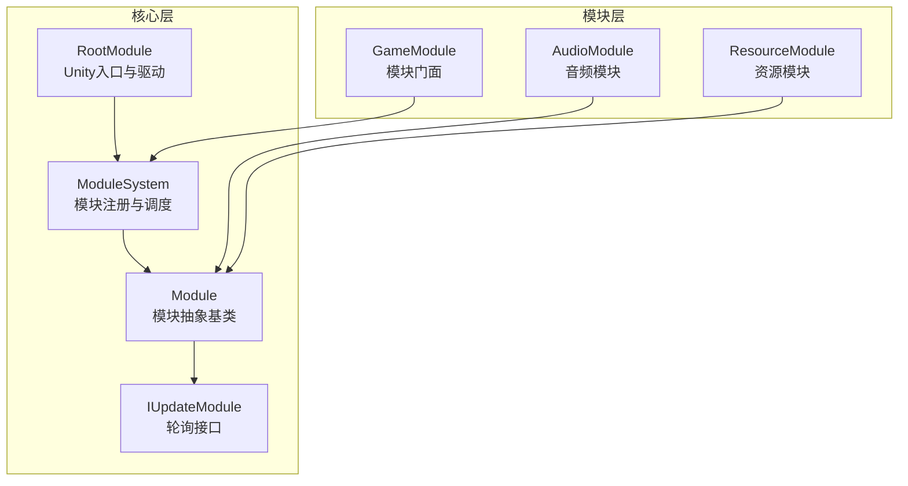
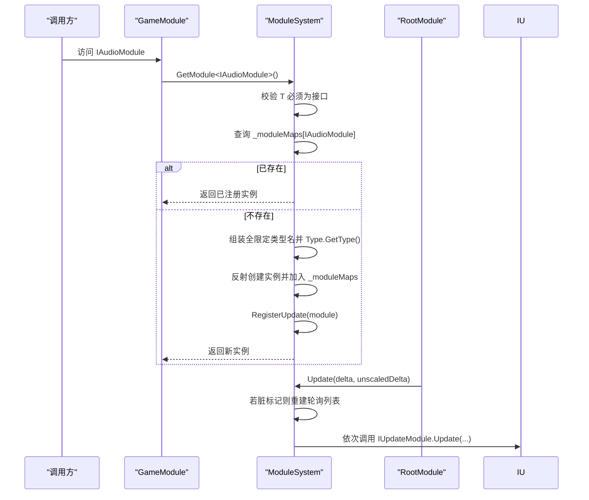
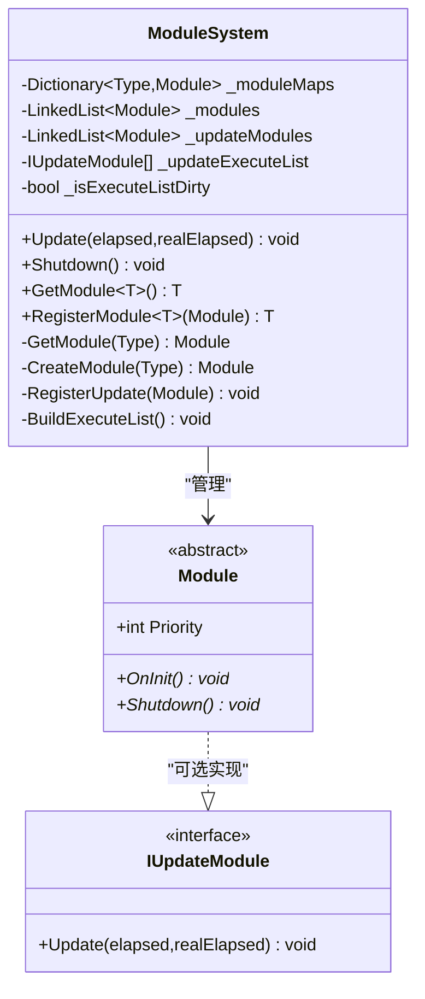
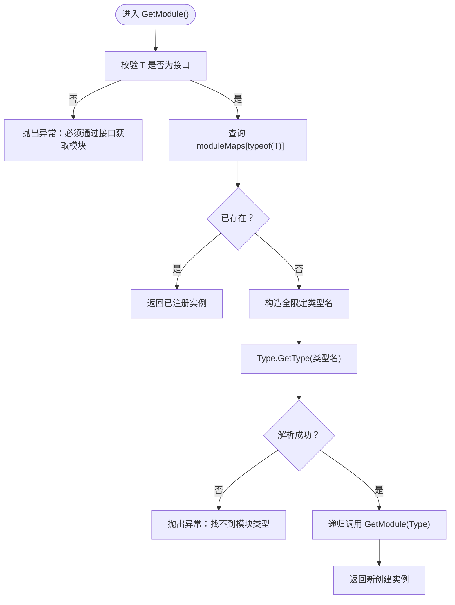
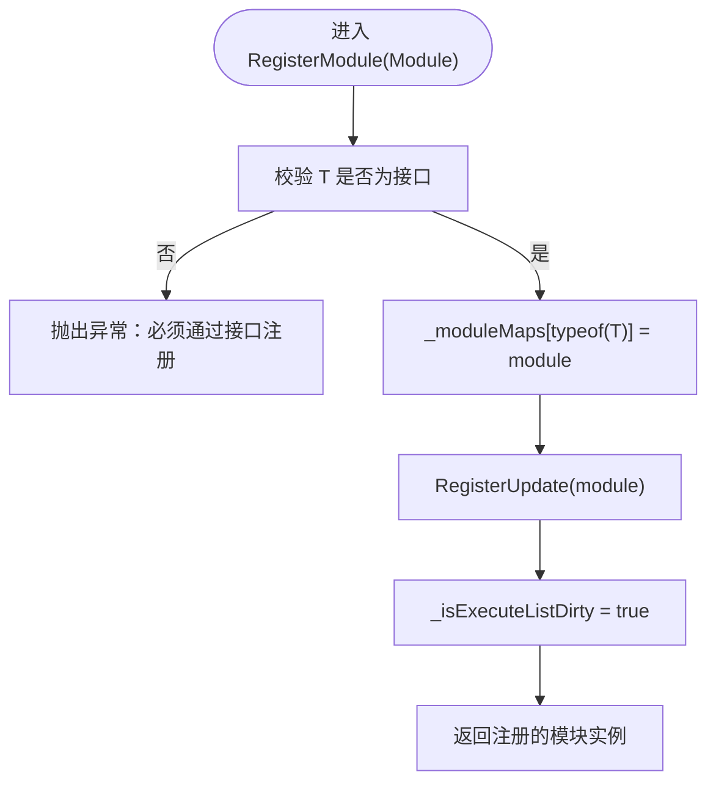
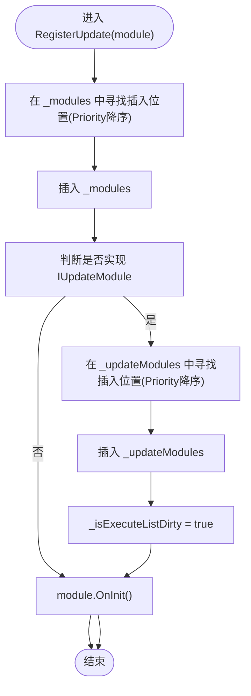
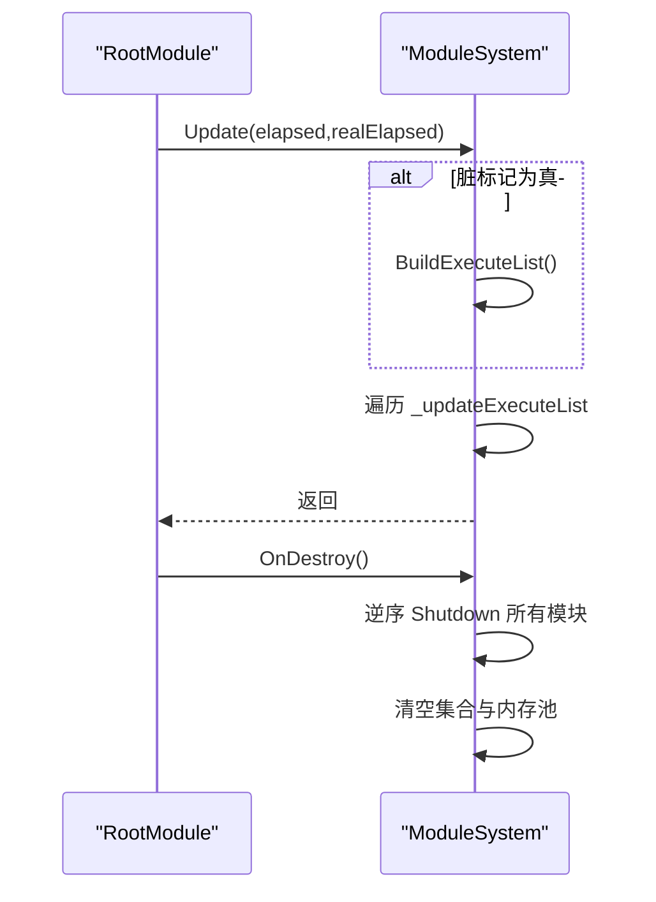
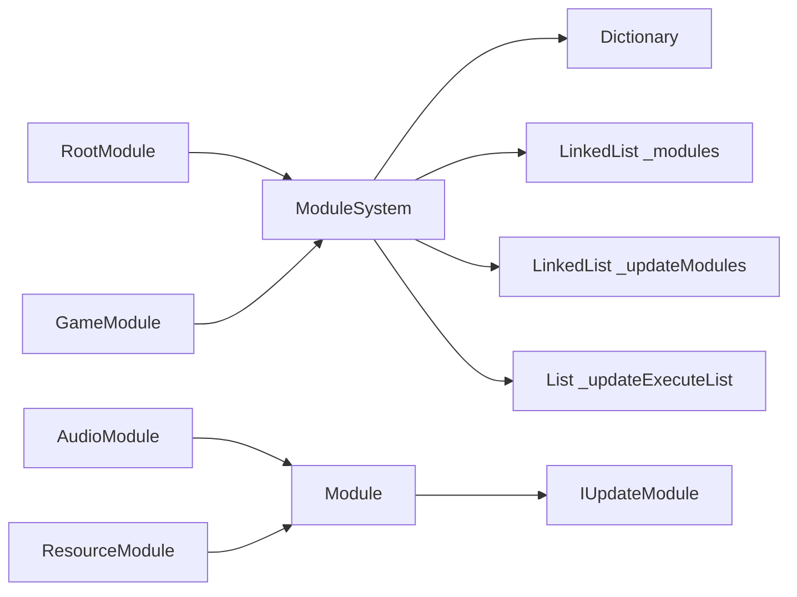

# 模块注册机制

<cite>
**本文档引用的文件**
- [ModuleSystem.cs](file://Assets/TEngine/Runtime/Core/ModuleSystem.cs)
- [Module.cs](file://Assets/TEngine/Runtime/Core/Module.cs)
- [RootModule.cs](file://Assets/TEngine/Runtime/Module/RootModule.cs)
- [GameModule.cs](file://Assets/GameScripts/HotFix/GameLogic/GameModule.cs)
- [AudioModule.cs](file://Assets/TEngine/Runtime/Module/AudioModule/AudioModule.cs)
- [ResourceModule.cs](file://Assets/TEngine/Runtime/Module/ResourceModule/ResourceModule.cs)
</cite>

## 目录
1. [简介](#简介)
2. [项目结构](#项目结构)
3. [核心组件](#核心组件)
4. [架构总览](#架构总览)
5. [详细组件分析](#详细组件分析)
6. [依赖关系分析](#依赖关系分析)
7. [性能考量](#性能考量)
8. [故障排查指南](#故障排查指南)
9. [结论](#结论)
10. [附录](#附录)

## 简介
本文件系统性阐述 TEngine 的模块注册机制，重点围绕 ModuleSystem 的模块注册流程、字典映射管理、模块类型查找、接口验证、泛型约束与类型检查、反射调用、以及模块注册表（_moduleMaps）的数据结构与管理策略。同时给出 GetModule 与 RegisterModule 方法的实现原理剖析，提供最佳实践、性能优化建议、常见异常处理与排错方法，并通过具体代码片段路径指引读者快速定位实现。

## 项目结构
TEngine 的模块体系由“核心层”和“模块层”组成：
- 核心层：ModuleSystem 提供全局模块注册、获取、生命周期调度；Module 定义模块抽象与轮询接口；RootModule 作为 Unity 生命周期入口，驱动模块更新。
- 模块层：各功能模块（如音频、资源、UI 等）继承 Module 并可选实现 IUpdateModule，通过 ModuleSystem 进行统一管理。

图表来源
- [ModuleSystem.cs:1-208](file://Assets/TEngine/Runtime/Core/ModuleSystem.cs#L1-L208)
- [Module.cs:1-40](file://Assets/TEngine/Runtime/Core/Module.cs#L1-L40)
- [RootModule.cs:1-304](file://Assets/TEngine/Runtime/Module/RootModule.cs#L1-L304)
- [AudioModule.cs:1-571](file://Assets/TEngine/Runtime/Module/AudioModule/AudioModule.cs#L1-L571)
- [ResourceModule.cs:1-800](file://Assets/TEngine/Runtime/Module/ResourceModule/ResourceModule.cs#L1-L800)
- [GameModule.cs:1-118](file://Assets/GameScripts/HotFix/GameLogic/GameModule.cs#L1-L118)

章节来源
- [ModuleSystem.cs:1-208](file://Assets/TEngine/Runtime/Core/ModuleSystem.cs#L1-L208)
- [Module.cs:1-40](file://Assets/TEngine/Runtime/Core/Module.cs#L1-L40)
- [RootModule.cs:1-304](file://Assets/TEngine/Runtime/Module/RootModule.cs#L1-L304)
- [GameModule.cs:1-118](file://Assets/GameScripts/HotFix/GameLogic/GameModule.cs#L1-L118)

## 核心组件
- ModuleSystem：静态单例，负责模块注册、获取、更新列表构建与清理。
- Module/IUpdateModule：模块抽象与轮询接口，模块通过 Priority 控制插入顺序与关闭顺序。
- RootModule：Unity 生命周期入口，每帧调用 ModuleSystem.Update 驱动模块轮询。
- GameModule：业务侧模块门面，封装常用模块访问。

章节来源
- [ModuleSystem.cs:1-208](file://Assets/TEngine/Runtime/Core/ModuleSystem.cs#L1-L208)
- [Module.cs:1-40](file://Assets/TEngine/Runtime/Core/Module.cs#L1-L40)
- [RootModule.cs:1-304](file://Assets/TEngine/Runtime/Module/RootModule.cs#L1-L304)
- [GameModule.cs:1-118](file://Assets/GameScripts/HotFix/GameLogic/GameModule.cs#L1-L118)

## 架构总览
ModuleSystem 以“接口类型 → 模块实例”的字典映射为核心，结合双向链表维护模块与轮询模块的有序集合。模块通过接口类型进行获取，若未注册则按约定命名规则反射解析真实类型并创建实例，随后完成注册与轮询链表插入。

图表来源
- [ModuleSystem.cs:68-120](file://Assets/TEngine/Runtime/Core/ModuleSystem.cs#L68-L120)
- [Module.cs:8-16](file://Assets/TEngine/Runtime/Core/Module.cs#L8-L16)
- [RootModule.cs:140-144](file://Assets/TEngine/Runtime/Module/RootModule.cs#L140-L144)
- [GameModule.cs:94-101](file://Assets/GameScripts/HotFix/GameLogic/GameModule.cs#L94-L101)

## 详细组件分析

### 模块注册表与数据结构
- _moduleMaps：Dictionary<Type, Module>，键为接口类型（或模块类型），值为模块实例。用于 O(1) 查找与去重。
- _modules：LinkedList<Module>，按 Priority 降序维护模块插入顺序，用于关闭时逆序销毁。
- _updateModules：LinkedList<Module>，仅维护实现 IUpdateModule 的模块，同样按 Priority 降序。
- _updateExecuteList：List<IUpdateModule>，按需重建，避免每次遍历链表带来的额外开销。
- _isExecuteListDirty：布尔标记，指示轮询列表是否需要重建。

图表来源
- [ModuleSystem.cs:17-208](file://Assets/TEngine/Runtime/Core/ModuleSystem.cs#L17-L208)
- [Module.cs:8-39](file://Assets/TEngine/Runtime/Core/Module.cs#L8-L39)

章节来源
- [ModuleSystem.cs:17-208](file://Assets/TEngine/Runtime/Core/ModuleSystem.cs#L17-L208)
- [Module.cs:8-39](file://Assets/TEngine/Runtime/Core/Module.cs#L8-L39)

### GetModule<T> 实现原理
- 泛型约束与类型检查：要求 T 为接口类型，否则抛出异常。
- 字典查找：若 _moduleMaps 中已存在接口类型键，直接返回对应模块。
- 类型推导与反射：若不存在，按约定格式拼接“命名空间.接口名(去掉首字符I),程序集名”，调用 Type.GetType 解析真实类型，再递归调用内部 GetModule(Type) 完成创建与注册。
- 创建与注册：CreateModule 使用 Activator.CreateInstance 创建实例，加入 _moduleMaps，并调用 RegisterUpdate 完成链表插入与轮询列表标记。

图表来源
- [ModuleSystem.cs:68-89](file://Assets/TEngine/Runtime/Core/ModuleSystem.cs#L68-L89)

章节来源
- [ModuleSystem.cs:68-120](file://Assets/TEngine/Runtime/Core/ModuleSystem.cs#L68-L120)

### RegisterModule<T> 实现原理
- 接口类型校验：与 GetModule<T> 相同，T 必须为接口。
- 直接注册：将模块实例以接口类型为键写入 _moduleMaps。
- 轮询注册：调用 RegisterUpdate 完成模块链表插入与轮询模块链表插入，并标记轮询列表脏。

图表来源
- [ModuleSystem.cs:128-141](file://Assets/TEngine/Runtime/Core/ModuleSystem.cs#L128-L141)

章节来源
- [ModuleSystem.cs:128-141](file://Assets/TEngine/Runtime/Core/ModuleSystem.cs#L128-L141)

### RegisterUpdate 与轮询列表管理
- 模块链表插入：按 Priority 降序插入 _modules，Priority 越高越靠前。
- 轮询模块链表插入：若模块实现 IUpdateModule，则按 Priority 插入 _updateModules。
- 脏标记：插入轮询模块时设置 _isExecuteListDirty，避免每次 Update 都重建列表。
- 列表重建：Update 内部检测脏标记，必要时调用 BuildExecuteList 将 _updateModules 转换为 _updateExecuteList，后续直接遍历该数组。

图表来源
- [ModuleSystem.cs:143-194](file://Assets/TEngine/Runtime/Core/ModuleSystem.cs#L143-L194)

章节来源
- [ModuleSystem.cs:143-194](file://Assets/TEngine/Runtime/Core/ModuleSystem.cs#L143-L194)

### Update 与 Shutdown 流程
- Update：若 _isExecuteListDirty，先重建轮询列表；然后遍历 _updateExecuteList 调用每个模块的 Update。
- Shutdown：逆序遍历 _modules 调用 Shutdown，清空所有集合与内存池。

图表来源
- [ModuleSystem.cs:29-60](file://Assets/TEngine/Runtime/Core/ModuleSystem.cs#L29-L60)
- [RootModule.cs:162-167](file://Assets/TEngine/Runtime/Module/RootModule.cs#L162-L167)

章节来源
- [ModuleSystem.cs:29-60](file://Assets/TEngine/Runtime/Core/ModuleSystem.cs#L29-L60)
- [RootModule.cs:162-167](file://Assets/TEngine/Runtime/Module/RootModule.cs#L162-L167)

### 模块类型查找与反射调用
- 类型命名约定：根据接口类型拼接“命名空间.接口名(去掉首字符I),程序集名”，确保与模块实现类命名一致。
- 反射创建：使用 Activator.CreateInstance 创建模块实例，失败时抛出异常。
- 接口验证：通过 Type.GetType 解析类型，若为空则抛出异常，提示找不到模块类型。

章节来源
- [ModuleSystem.cs:81-86](file://Assets/TEngine/Runtime/Core/ModuleSystem.cs#L81-L86)
- [ModuleSystem.cs:109-113](file://Assets/TEngine/Runtime/Core/ModuleSystem.cs#L109-L113)

### 模块注册表（_moduleMaps）的数据结构与管理策略
- 键：接口类型（或模块类型）。GetModule<T> 通常以接口类型为键；RegisterModule<T> 显式以接口类型为键。
- 值：模块实例。同一接口只保留一个实例，保证全局唯一。
- 策略：首次访问时创建并注册；后续访问直接返回；关闭时统一清理。

章节来源
- [ModuleSystem.cs:17-208](file://Assets/TEngine/Runtime/Core/ModuleSystem.cs#L17-L208)

### 具体使用示例（代码片段路径）
- 通过接口获取模块实例
  - [GameModule.cs:94-101](file://Assets/GameScripts/HotFix/GameLogic/GameModule.cs#L94-L101)
  - [ModuleSystem.cs:68-89](file://Assets/TEngine/Runtime/Core/ModuleSystem.cs#L68-L89)
- 注册自定义模块实例
  - [ModuleSystem.cs:128-141](file://Assets/TEngine/Runtime/Core/ModuleSystem.cs#L128-L141)
- 模块实现示例（音频模块）
  - [AudioModule.cs:11-571](file://Assets/TEngine/Runtime/Module/AudioModule/AudioModule.cs#L11-L571)
- 模块实现示例（资源模块）
  - [ResourceModule.cs:17-53](file://Assets/TEngine/Runtime/Module/ResourceModule/ResourceModule.cs#L17-L53)

## 依赖关系分析
- ModuleSystem 依赖：
  - System.Collections.Generic：用于字典、链表、列表。
  - Utility.*：文本格式化、类型解析等工具（在异常消息与类型解析中使用）。
- 模块实现依赖：
  - 各模块继承 Module，可选实现 IUpdateModule。
  - RootModule 依赖 ModuleSystem 进行更新与关闭。
  - GameModule 依赖 ModuleSystem 通过接口获取模块。

图表来源
- [ModuleSystem.cs:17-208](file://Assets/TEngine/Runtime/Core/ModuleSystem.cs#L17-L208)
- [RootModule.cs:140-144](file://Assets/TEngine/Runtime/Module/RootModule.cs#L140-L144)
- [GameModule.cs:94-101](file://Assets/GameScripts/HotFix/GameLogic/GameModule.cs#L94-L101)
- [Module.cs:8-39](file://Assets/TEngine/Runtime/Core/Module.cs#L8-L39)

章节来源
- [ModuleSystem.cs:17-208](file://Assets/TEngine/Runtime/Core/ModuleSystem.cs#L17-L208)
- [RootModule.cs:140-144](file://Assets/TEngine/Runtime/Module/RootModule.cs#L140-L144)
- [GameModule.cs:94-101](file://Assets/GameScripts/HotFix/GameLogic/GameModule.cs#L94-L101)
- [Module.cs:8-39](file://Assets/TEngine/Runtime/Core/Module.cs#L8-L39)

## 性能考量
- 字典查找：_moduleMaps 为 O(1) 查找，建议在热路径中复用已获取的模块实例。
- 链表插入：RegisterUpdate 按 Priority 二分插入，平均 O(n)；n 通常较小（模块数量有限）。
- 轮询列表重建：_isExecuteListDirty 标记避免每次 Update 都重建，降低 GCAlloc。
- 数组遍历：_updateExecuteList 为数组，遍历时无装箱与边界检查开销。
- 反射成本：GetModule<T> 在首次访问时进行一次 Type.GetType 与 Activator.CreateInstance，后续命中字典可忽略反射成本。
- 建议：
  - 将常用模块缓存到静态字段，避免重复接口查找。
  - 合理设置模块 Priority，减少插入排序次数。
  - 避免在 Update 中频繁创建临时对象，尽量复用。

[本节为通用性能建议，无需特定文件引用]

## 故障排查指南
- 异常：通过接口获取模块但类型不是接口
  - 现象：抛出异常，提示必须通过接口获取模块。
  - 排查：确认调用处的泛型参数是否为接口类型。
  - 参考
    - [ModuleSystem.cs:71-74](file://Assets/TEngine/Runtime/Core/ModuleSystem.cs#L71-L74)
- 异常：找不到模块类型
  - 现象：Type.GetType 返回 null，抛出异常，提示找不到模块类型。
  - 排查：检查接口命名与模块实现类命名是否符合“命名空间.接口名(去掉首字符I),程序集名”的约定。
  - 参考
    - [ModuleSystem.cs:81-86](file://Assets/TEngine/Runtime/Core/ModuleSystem.cs#L81-L86)
- 异常：无法创建模块实例
  - 现象：Activator.CreateInstance 返回 null，抛出异常，提示无法创建模块。
  - 排查：确认模块实现类存在公共构造函数，且无异常。
  - 参考
    - [ModuleSystem.cs:109-113](file://Assets/TEngine/Runtime/Core/ModuleSystem.cs#L109-L113)
- 异常：注册模块时类型不是接口
  - 现象：RegisterModule 抛出异常，提示必须通过接口注册。
  - 排查：确认 RegisterModule<T> 的 T 是否为接口。
  - 参考
    - [ModuleSystem.cs:130-134](file://Assets/TEngine/Runtime/Core/ModuleSystem.cs#L130-L134)
- 模块未轮询
  - 现象：模块实现了 IUpdateModule 但 Update 未被调用。
  - 排查：确认模块 Priority 设置合理；确认 RegisterUpdate 已被调用；确认 _isExecuteListDirty 已被正确标记并在 Update 中重建。
  - 参考
    - [ModuleSystem.cs:165-191](file://Assets/TEngine/Runtime/Core/ModuleSystem.cs#L165-L191)
- 模块关闭顺序异常
  - 现象：模块关闭顺序与预期不符。
  - 排查：检查模块 Priority 设置；RootModule Shutdown 时按逆序关闭。
  - 参考
    - [ModuleSystem.cs:49-52](file://Assets/TEngine/Runtime/Core/ModuleSystem.cs#L49-L52)
    - [RootModule.cs:162-167](file://Assets/TEngine/Runtime/Module/RootModule.cs#L162-L167)

章节来源
- [ModuleSystem.cs:71-113](file://Assets/TEngine/Runtime/Core/ModuleSystem.cs#L71-L113)
- [ModuleSystem.cs:130-134](file://Assets/TEngine/Runtime/Core/ModuleSystem.cs#L130-L134)
- [ModuleSystem.cs:165-191](file://Assets/TEngine/Runtime/Core/ModuleSystem.cs#L165-L191)
- [RootModule.cs:162-167](file://Assets/TEngine/Runtime/Module/RootModule.cs#L162-L167)

## 结论
ModuleSystem 通过“接口类型 → 模块实例”的字典映射与链表管理，提供了简洁高效的模块注册与获取机制。GetModule<T> 与 RegisterModule<T> 在泛型约束、接口验证、类型检查与反射调用之间取得平衡，配合轮询列表重建策略，既保证了易用性又兼顾性能。遵循本文的最佳实践与排错建议，可在实际工程中稳定地扩展与维护模块体系。

[本节为总结，无需特定文件引用]

## 附录

### 最佳实践
- 使用接口类型作为键：GetModule<T> 与 RegisterModule<T> 均要求 T 为接口，确保模块访问的一致性与可替换性。
- 首次访问即缓存：将常用模块缓存到静态字段，避免重复接口查找。
- 合理设置 Priority：根据模块依赖与生命周期需求设置 Priority，确保正确的初始化与关闭顺序。
- 避免在 Update 中做昂贵操作：将耗时逻辑拆分到非 Update 路径或使用协程/异步。
- 模块命名一致性：严格遵守“命名空间.接口名(去掉首字符I),程序集名”的约定，确保 Type.GetType 能正确解析。

### 代码示例（路径）
- 通过接口获取模块
  - [GameModule.cs:94-101](file://Assets/GameScripts/HotFix/GameLogic/GameModule.cs#L94-L101)
- 注册自定义模块
  - [ModuleSystem.cs:128-141](file://Assets/TEngine/Runtime/Core/ModuleSystem.cs#L128-L141)
- 模块实现（音频）
  - [AudioModule.cs:11-571](file://Assets/TEngine/Runtime/Module/AudioModule/AudioModule.cs#L11-L571)
- 模块实现（资源）
  - [ResourceModule.cs:17-53](file://Assets/TEngine/Runtime/Module/ResourceModule/ResourceModule.cs#L17-L53)