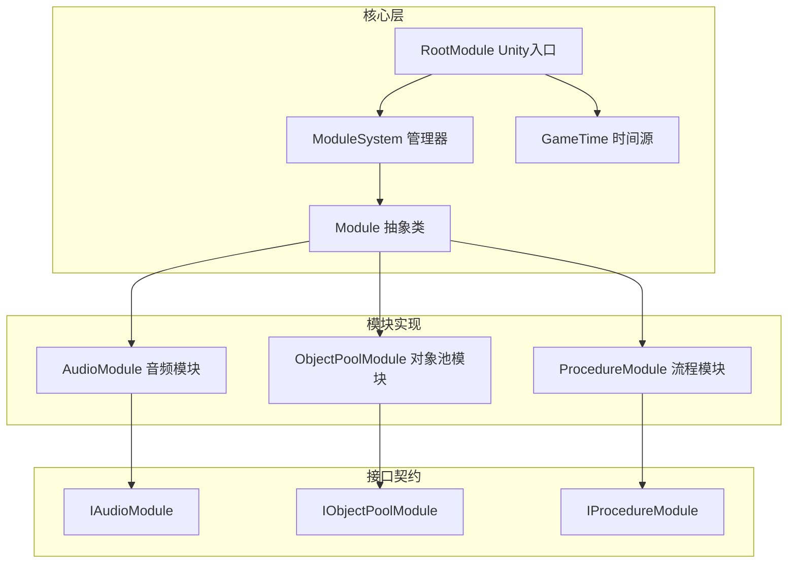
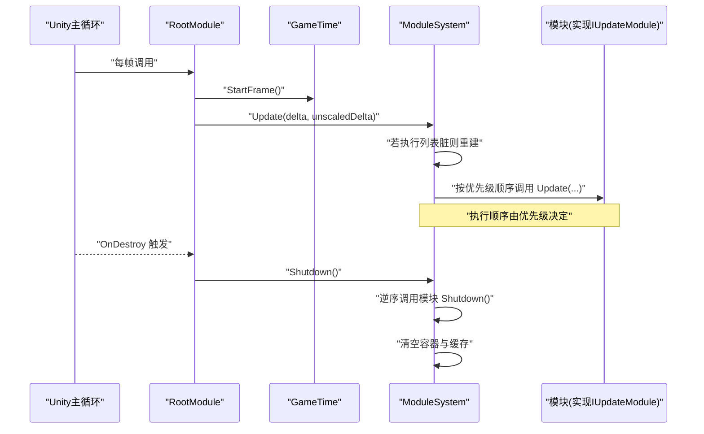
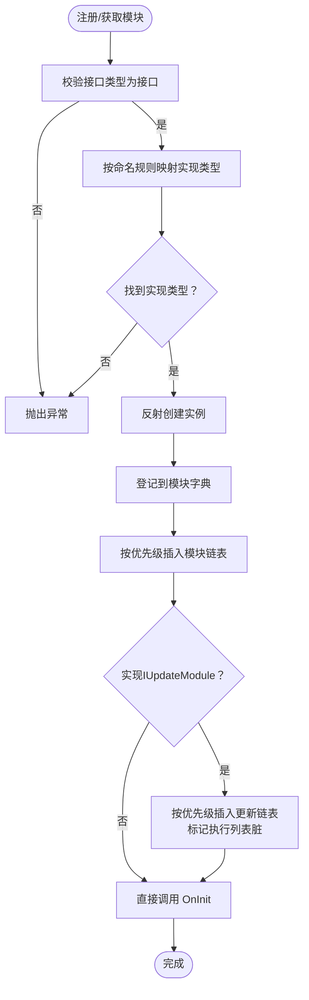
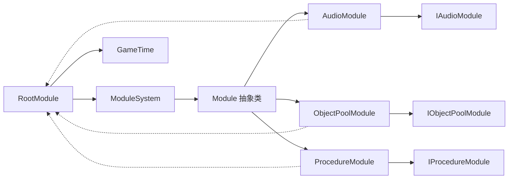

# 模块生命周期管理

<cite>
**本文档引用的文件**
- [Module.cs](file://Assets/TEngine/Runtime/Core/Module.cs)
- [ModuleSystem.cs](file://Assets/TEngine/Runtime/Core/ModuleSystem.cs)
- [RootModule.cs](file://Assets/TEngine/Runtime/Module/RootModule.cs)
- [AudioModule.cs](file://Assets/TEngine/Runtime/Module/AudioModule/AudioModule.cs)
- [ObjectPoolModule.cs](file://Assets/TEngine/Runtime/Module/ObjectPoolModule/ObjectPoolModule.cs)
- [ProcedureModule.cs](file://Assets/TEngine/Runtime/Module/ProcedureModule/ProcedureModule.cs)
- [IAudioModule.cs](file://Assets/TEngine/Runtime/Module/AudioModule/IAudioModule.cs)
- [IObjectPoolModule.cs](file://Assets/TEngine/Runtime/Module/ObjectPoolModule/IObjectPoolModule.cs)
- [IProcedureModule.cs](file://Assets/TEngine/Runtime/Module/ProcedureModule/IProcedureModule.cs)
- [GameTime.cs](file://Assets/TEngine/Runtime/Core/GameTime/GameTime.cs)
</cite>

## 目录
1. [引言](#引言)
2. [项目结构](#项目结构)
3. [核心组件](#核心组件)
4. [架构总览](#架构总览)
5. [详细组件分析](#详细组件分析)
6. [依赖关系分析](#依赖关系分析)
7. [性能考量](#性能考量)
8. [故障排查指南](#故障排查指南)
9. [结论](#结论)
10. [附录](#附录)

## 引言
本文件系统性阐述 TEngine 的模块生命周期管理机制，覆盖从模块创建、初始化（OnInit）、更新循环（Update）、到关闭清理（Shutdown）的完整流程；详解模块优先级系统与执行顺序控制；说明模块注册过程中的类型检查、反射与实例化流程；并提供生命周期钩子的最佳实践与常见问题排查建议。内容基于仓库中实际源码进行分析，确保可操作性与准确性。

## 项目结构
TEngine 的模块系统由三大部分构成：
- 核心抽象与调度：Module 抽象类、ModuleSystem 管理器、RootModule Unity 入口
- 具体模块实现：音频模块、对象池模块、流程模块等
- 接口契约：各模块对外暴露的能力接口

图表来源
- [Module.cs:1-40](file://Assets/TEngine/Runtime/Core/Module.cs#L1-L40)
- [ModuleSystem.cs:1-208](file://Assets/TEngine/Runtime/Core/ModuleSystem.cs#L1-L208)
- [RootModule.cs:1-304](file://Assets/TEngine/Runtime/Module/RootModule.cs#L1-L304)
- [AudioModule.cs:1-571](file://Assets/TEngine/Runtime/Module/AudioModule/AudioModule.cs#L1-L571)
- [ObjectPoolModule.cs:1-800](file://Assets/TEngine/Runtime/Module/ObjectPoolModule/ObjectPoolModule.cs#L1-L800)
- [ProcedureModule.cs:1-209](file://Assets/TEngine/Runtime/Module/ProcedureModule/ProcedureModule.cs#L1-L209)

章节来源
- [Module.cs:1-40](file://Assets/TEngine/Runtime/Core/Module.cs#L1-L40)
- [ModuleSystem.cs:1-208](file://Assets/TEngine/Runtime/Core/ModuleSystem.cs#L1-L208)
- [RootModule.cs:1-304](file://Assets/TEngine/Runtime/Module/RootModule.cs#L1-L304)

## 核心组件
- Module 抽象类：定义模块生命周期钩子（OnInit、Shutdown），以及优先级（Priority）与更新接口（IUpdateModule）。
- ModuleSystem 管理器：负责模块注册、实例化、优先级排序、更新列表构建与全局更新、关闭清理。
- RootModule：Unity 生命周期入口，驱动 ModuleSystem 的 Update 与 Shutdown。
- 具体模块：如 AudioModule、ObjectPoolModule、ProcedureModule 等，实现具体业务逻辑与 OnInit/Shutdown。

章节来源
- [Module.cs:18-39](file://Assets/TEngine/Runtime/Core/Module.cs#L18-L39)
- [ModuleSystem.cs:9-208](file://Assets/TEngine/Runtime/Core/ModuleSystem.cs#L9-L208)
- [RootModule.cs:10-304](file://Assets/TEngine/Runtime/Module/RootModule.cs#L10-L304)

## 架构总览
模块生命周期在 Unity 主循环中被 RootModule 驱动，通过 ModuleSystem 统一调度。模块注册时按优先级插入有序链表，更新时按优先级顺序遍历执行；关闭时逆序执行，确保依赖关系安全释放。

图表来源
- [RootModule.cs:140-167](file://Assets/TEngine/Runtime/Module/RootModule.cs#L140-L167)
- [ModuleSystem.cs:29-60](file://Assets/TEngine/Runtime/Core/ModuleSystem.cs#L29-L60)
- [GameTime.cs:45-53](file://Assets/TEngine/Runtime/Core/GameTime/GameTime.cs#L45-L53)

## 详细组件分析

### 模块抽象与生命周期钩子
- 抽象接口
  - IUpdateModule：提供 Update(float, float) 更新接口，用于参与每帧轮询。
  - Module：定义 OnInit 与 Shutdown 两个生命周期钩子，Priority 提供优先级控制。
- 生命周期要点
  - OnInit：模块完成自身初始化，通常在此获取其他模块或资源。
  - Shutdown：模块释放自身资源，保证幂等与无副作用。
  - 优先级：数值越大优先级越高，影响注册顺序与关闭顺序。

章节来源
- [Module.cs:8-16](file://Assets/TEngine/Runtime/Core/Module.cs#L8-L16)
- [Module.cs:22-39](file://Assets/TEngine/Runtime/Core/Module.cs#L22-L39)

### 模块系统管理器（ModuleSystem）
- 模块注册与实例化
  - 通过接口类型名映射到具体实现类型，利用反射创建实例。
  - 支持显式 RegisterModule<T>(Module) 注入自定义实例。
- 优先级与执行顺序
  - 使用双向链表维护模块顺序，按 Priority 降序插入。
  - IUpdateModule 模块同时加入更新链表，更新前按需重建执行列表。
- 全局更新与关闭
  - Update：遍历执行列表调用 Update。
  - Shutdown：逆序遍历模块调用 Shutdown 并清空容器。

图表来源
- [ModuleSystem.cs:68-89](file://Assets/TEngine/Runtime/Core/ModuleSystem.cs#L68-L89)
- [ModuleSystem.cs:97-120](file://Assets/TEngine/Runtime/Core/ModuleSystem.cs#L97-L120)
- [ModuleSystem.cs:128-141](file://Assets/TEngine/Runtime/Core/ModuleSystem.cs#L128-L141)
- [ModuleSystem.cs:143-194](file://Assets/TEngine/Runtime/Core/ModuleSystem.cs#L143-L194)

章节来源
- [ModuleSystem.cs:62-69](file://Assets/TEngine/Runtime/Core/ModuleSystem.cs#L62-L69)
- [ModuleSystem.cs:91-120](file://Assets/TEngine/Runtime/Core/ModuleSystem.cs#L91-L120)
- [ModuleSystem.cs:143-194](file://Assets/TEngine/Runtime/Core/ModuleSystem.cs#L143-L194)

### Unity 入口与驱动（RootModule）
- 在 Awake 中初始化辅助组件与日志系统，设置帧率、时间缩放、后台运行与休眠策略。
- 每帧 Update 调用 GameTime.StartFrame 并驱动 ModuleSystem.Update。
- OnDestroy 触发时调用 ModuleSystem.Shutdown，确保模块有序释放。
- 提供游戏速度控制与低内存事件处理，联动对象池与资源模块。

章节来源
- [RootModule.cs:116-167](file://Assets/TEngine/Runtime/Module/RootModule.cs#L116-L167)
- [RootModule.cs:209-302](file://Assets/TEngine/Runtime/Module/RootModule.cs#L209-L302)

### 具体模块示例

#### 音频模块（AudioModule）
- 实现 Module 与 IAudioModule、IUpdateModule。
- OnInit：获取资源模块并初始化音频配置。
- Shutdown：停止播放并清理音效池。
- Update：逐类目推进音频代理状态。
- 优先级：未显式覆盖，使用基类默认值。

章节来源
- [AudioModule.cs:11-20](file://Assets/TEngine/Runtime/Module/AudioModule/AudioModule.cs#L11-L20)
- [AudioModule.cs:322-332](file://Assets/TEngine/Runtime/Module/AudioModule/AudioModule.cs#L322-L332)
- [AudioModule.cs:560-569](file://Assets/TEngine/Runtime/Module/AudioModule/AudioModule.cs#L560-L569)

#### 对象池模块（ObjectPoolModule）
- 实现 Module 与 IObjectPoolModule、IUpdateModule。
- 优先级：override int Priority => 6，确保较高优先级执行与关闭。
- Update：遍历所有对象池并推进其内部状态。
- Shutdown：依次关闭并清空对象池集合。

章节来源
- [ObjectPoolModule.cs:9-23](file://Assets/TEngine/Runtime/Module/ObjectPoolModule/ObjectPoolModule.cs#L9-L23)
- [ObjectPoolModule.cs:35-41](file://Assets/TEngine/Runtime/Module/ObjectPoolModule/ObjectPoolModule.cs#L35-L41)
- [ObjectPoolModule.cs:61-70](file://Assets/TEngine/Runtime/Module/ObjectPoolModule/ObjectPoolModule.cs#L61-L70)

#### 流程模块（ProcedureModule）
- 实现 Module 与 IProcedureModule。
- 优先级：override int Priority => -2，较低优先级，适合最后关闭。
- 提供流程 FSM 初始化、启动、查询与重启能力。

章节来源
- [ProcedureModule.cs:8-26](file://Assets/TEngine/Runtime/Module/ProcedureModule/ProcedureModule.cs#L8-L26)
- [ProcedureModule.cs:60-79](file://Assets/TEngine/Runtime/Module/ProcedureModule/ProcedureModule.cs#L60-L79)

### 接口契约与类型约束
- IAudioModule：音频模块能力接口，定义音量、开关、播放与停止等 API。
- IObjectPoolModule：对象池模块能力接口，定义对象池创建、查询、销毁与释放等 API。
- IProcedureModule：流程模块能力接口，定义流程初始化、启动、查询与重启等 API。

章节来源
- [IAudioModule.cs:8-127](file://Assets/TEngine/Runtime/Module/AudioModule/IAudioModule.cs#L8-L127)
- [IObjectPoolModule.cs:9-744](file://Assets/TEngine/Runtime/Module/ObjectPoolModule/IObjectPoolModule.cs#L9-L744)
- [IProcedureModule.cs:8-82](file://Assets/TEngine/Runtime/Module/ProcedureModule/IProcedureModule.cs#L8-L82)

## 依赖关系分析
- 模块间依赖
  - AudioModule 在 OnInit 中依赖 IResourceModule（通过 ModuleSystem.GetModule 获取）。
  - RootModule 在低内存事件中联动 IObjectPoolModule 与 IResourceModule。
- 内部依赖
  - ModuleSystem 依赖 GameTime 提供时间参数。
  - RootModule 依赖 ModuleSystem 完成模块驱动与清理。

图表来源
- [RootModule.cs:291-301](file://Assets/TEngine/Runtime/Module/RootModule.cs#L291-L301)
- [AudioModule.cs:324-325](file://Assets/TEngine/Runtime/Module/AudioModule/AudioModule.cs#L324-L325)
- [ModuleSystem.cs:29-42](file://Assets/TEngine/Runtime/Core/ModuleSystem.cs#L29-L42)

章节来源
- [RootModule.cs:291-301](file://Assets/TEngine/Runtime/Module/RootModule.cs#L291-L301)
- [AudioModule.cs:324-325](file://Assets/TEngine/Runtime/Module/AudioModule/AudioModule.cs#L324-L325)

## 性能考量
- 执行列表重建
  - 当模块注册/注销或优先级变化时，ModuleSystem 仅在 Update 前标记“执行列表脏”，并在下一次 Update 前一次性重建，避免频繁分配。
- 优先级插入
  - 插入模块与更新模块均使用线性扫描定位插入点，结合链表操作，整体开销与模块数量线性相关。
- 反射与类型映射
  - 通过接口全名映射实现类型，减少硬编码耦合；建议在热路径外使用，避免频繁反射。
- 关闭顺序
  - 逆序关闭确保高层模块先释放对底层模块的依赖，降低资源竞争风险。

章节来源
- [ModuleSystem.cs:31-35](file://Assets/TEngine/Runtime/Core/ModuleSystem.cs#L31-L35)
- [ModuleSystem.cs:143-194](file://Assets/TEngine/Runtime/Core/ModuleSystem.cs#L143-L194)

## 故障排查指南
- 获取模块时报“必须通过接口获取”
  - 症状：调用 GetModule<T>() 传入非接口类型。
  - 处理：确保 T 为接口类型；或使用 RegisterModule<T>(Module) 注入自定义实例。
  - 参考：[ModuleSystem.cs:68-89](file://Assets/TEngine/Runtime/Core/ModuleSystem.cs#L68-L89)
- 找不到模块类型
  - 症状：接口全名映射不到实现类型。
  - 处理：确认实现类型命名空间与接口一致，程序集名称匹配；或显式 RegisterModule。
  - 参考：[ModuleSystem.cs:81-86](file://Assets/TEngine/Runtime/Core/ModuleSystem.cs#L81-L86)
- 模块未进入更新列表
  - 症状：模块实现了 IUpdateModule 但未被 Update。
  - 处理：确认模块已通过 ModuleSystem 注册；检查优先级是否导致插入位置异常。
  - 参考：[ModuleSystem.cs:165-191](file://Assets/TEngine/Runtime/Core/ModuleSystem.cs#L165-L191)
- 关闭顺序导致资源泄漏
  - 症状：模块 A 依赖模块 B，关闭时 B 已释放。
  - 处理：提高模块 A 的 Priority，使其在模块 B 之后关闭。
  - 参考：[ModuleSystem.cs:47-60](file://Assets/TEngine/Runtime/Core/ModuleSystem.cs#L47-L60)
- 低内存事件未触发对象池回收
  - 症状：设备内存告警，对象池未释放。
  - 处理：确认 RootModule.OnLowMemory 中已获取 IObjectPoolModule 并调用 ReleaseAllUnused。
  - 参考：[RootModule.cs:291-295](file://Assets/TEngine/Runtime/Module/RootModule.cs#L291-L295)

## 结论
TEngine 的模块生命周期管理以 Module 抽象为核心，通过 ModuleSystem 实现统一注册、优先级排序、更新与关闭；RootModule 将其接入 Unity 主循环。该设计具备良好的扩展性与可控的执行顺序，适合复杂游戏框架的模块化组织。遵循本文最佳实践与排障建议，可有效提升模块系统的稳定性与性能。

## 附录

### 生命周期钩子使用清单
- OnInit：完成模块初始化，获取依赖模块与资源。
- Shutdown：释放资源，保证幂等与无副作用。
- Update（可选）：实现每帧轮询逻辑，注意时间参数来源（GameTime）。

章节来源
- [Module.cs:33-38](file://Assets/TEngine/Runtime/Core/Module.cs#L33-L38)
- [GameTime.cs:45-53](file://Assets/TEngine/Runtime/Core/GameTime/GameTime.cs#L45-L53)

### 优先级与执行顺序最佳实践
- 明确模块依赖：高优先级模块依赖低优先级模块时，应提高其 Priority。
- 更新模块与非更新模块分离：仅实现 IUpdateModule 的模块才会进入更新链表。
- 关闭顺序：依赖关系决定关闭顺序，避免在 Shutdown 中访问已释放资源。

章节来源
- [ModuleSystem.cs:143-194](file://Assets/TEngine/Runtime/Core/ModuleSystem.cs#L143-L194)
- [ModuleSystem.cs:47-60](file://Assets/TEngine/Runtime/Core/ModuleSystem.cs#L47-L60)