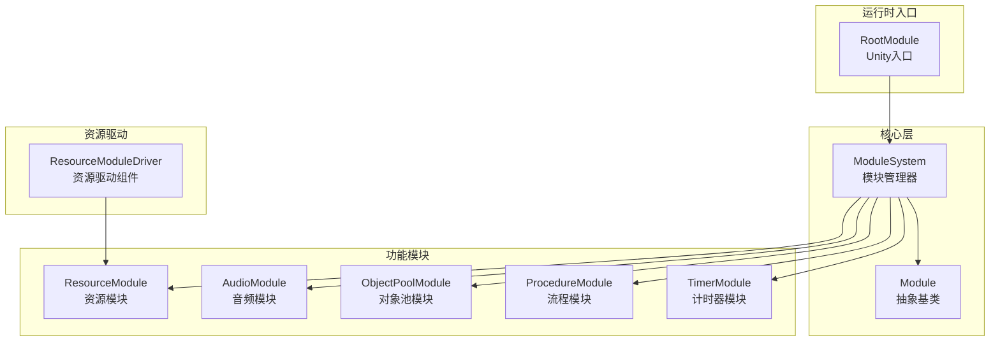
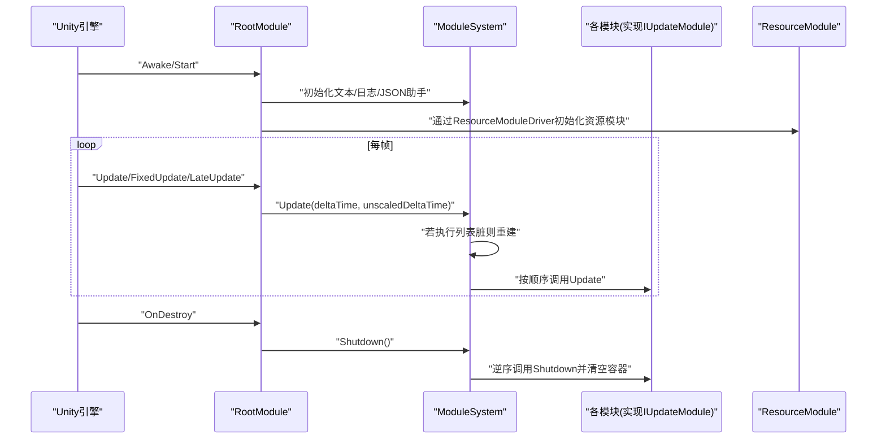
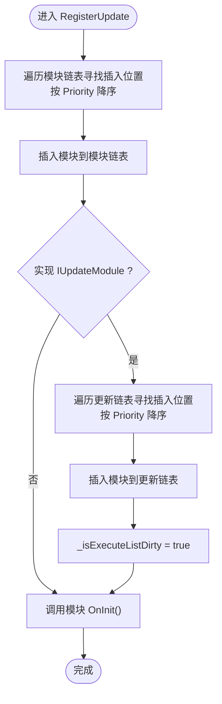
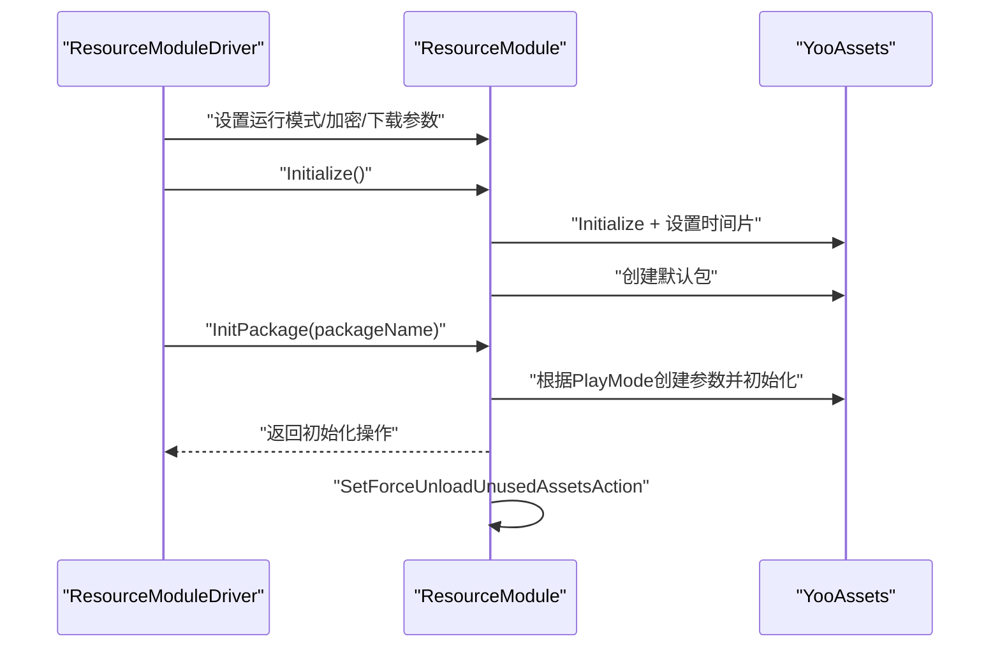
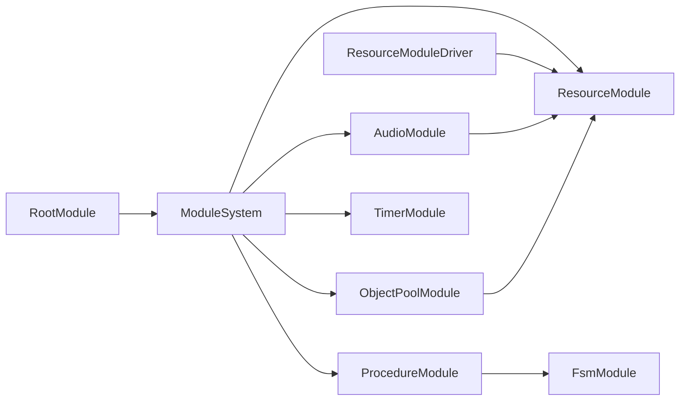

# 模块系统

<cite>
**本文档引用的文件**
- [ModuleSystem.cs](file://Assets/TEngine/Runtime/Core/ModuleSystem.cs)
- [Module.cs](file://Assets/TEngine/Runtime/Core/Module.cs)
- [RootModule.cs](file://Assets/TEngine/Runtime/Module/RootModule.cs)
- [AudioModule.cs](file://Assets/TEngine/Runtime/Module/AudioModule/AudioModule.cs)
- [ResourceModule.cs](file://Assets/TEngine/Runtime/Module/ResourceModule/ResourceModule.cs)
- [ResourceModuleDriver.cs](file://Assets/TEngine/Runtime/Module/ResourceModule/ResourceModuleDriver.cs)
- [ObjectPoolModule.cs](file://Assets/TEngine/Runtime/Module/ObjectPoolModule/ObjectPoolModule.cs)
- [ProcedureModule.cs](file://Assets/TEngine/Runtime/Module/ProcedureModule/ProcedureModule.cs)
- [TimerModule.cs](file://Assets/TEngine/Runtime/Module/TimerModule/TimerModule.cs)
</cite>

## 目录
1. [简介](#简介)
2. [项目结构](#项目结构)
3. [核心组件](#核心组件)
4. [架构总览](#架构总览)
5. [详细组件分析](#详细组件分析)
6. [依赖分析](#依赖分析)
7. [性能考虑](#性能考虑)
8. [故障排查指南](#故障排查指南)
9. [结论](#结论)
10. [附录](#附录)

## 简介
本文件系统性梳理 TEngine 的模块系统，围绕模块注册、初始化、更新、销毁的完整生命周期展开，重点解析 ModuleSystem 的注册表管理、更新列表维护与依赖关系处理；并结合 ResourceModule、AudioModule、UI 模块等实现，给出自定义模块开发指南、性能优化策略与最佳实践，辅以可视化图示帮助理解。

## 项目结构
TEngine 的模块系统位于 Runtime/Core 与 Runtime/Module 下，核心由以下层次构成：
- 核心层：Module 抽象类与 ModuleSystem 管理器，负责模块生命周期与调度
- 运行时入口：RootModule 作为 Unity 生命周期入口，驱动 ModuleSystem 更新
- 功能模块：ResourceModule、AudioModule、ObjectPoolModule、ProcedureModule、TimerModule 等
- 资源驱动：ResourceModuleDriver 作为资源模块的 Unity 组件入口

**图表来源**
- [ModuleSystem.cs](file://Assets/TEngine/Runtime/Core/ModuleSystem.cs)
- [Module.cs](file://Assets/TEngine/Runtime/Core/Module.cs)
- [RootModule.cs](file://Assets/TEngine/Runtime/Module/RootModule.cs)
- [ResourceModule.cs](file://Assets/TEngine/Runtime/Module/ResourceModule/ResourceModule.cs)
- [ResourceModuleDriver.cs](file://Assets/TEngine/Runtime/Module/ResourceModule/ResourceModuleDriver.cs)
- [AudioModule.cs](file://Assets/TEngine/Runtime/Module/AudioModule/AudioModule.cs)
- [ObjectPoolModule.cs](file://Assets/TEngine/Runtime/Module/ObjectPoolModule/ObjectPoolModule.cs)
- [ProcedureModule.cs](file://Assets/TEngine/Runtime/Module/ProcedureModule/ProcedureModule.cs)
- [TimerModule.cs](file://Assets/TEngine/Runtime/Module/TimerModule/TimerModule.cs)

**章节来源**
- [ModuleSystem.cs](file://Assets/TEngine/Runtime/Core/ModuleSystem.cs)
- [Module.cs](file://Assets/TEngine/Runtime/Core/Module.cs)
- [RootModule.cs](file://Assets/TEngine/Runtime/Module/RootModule.cs)
- [ResourceModule.cs](file://Assets/TEngine/Runtime/Module/ResourceModule/ResourceModule.cs)
- [ResourceModuleDriver.cs](file://Assets/TEngine/Runtime/Module/ResourceModule/ResourceModuleDriver.cs)
- [AudioModule.cs](file://Assets/TEngine/Runtime/Module/AudioModule/AudioModule.cs)
- [ObjectPoolModule.cs](file://Assets/TEngine/Runtime/Module/ObjectPoolModule/ObjectPoolModule.cs)
- [ProcedureModule.cs](file://Assets/TEngine/Runtime/Module/ProcedureModule/ProcedureModule.cs)
- [TimerModule.cs](file://Assets/TEngine/Runtime/Module/TimerModule/TimerModule.cs)

## 核心组件
- Module 抽象类
  - 定义模块优先级 Priority 与生命周期方法 OnInit、Shutdown
  - 作为所有模块的基类，统一接口契约
- IUpdateModule 接口
  - 提供 Update(elapseSeconds, realElapseSeconds) 方法，用于参与 ModuleSystem 的统一更新调度
- ModuleSystem 管理器
  - 维护模块映射表、模块链表与更新列表
  - 提供 GetModule、RegisterModule、Update、Shutdown 等能力
  - 通过 RegisterUpdate 将实现 IUpdateModule 的模块加入更新链表，并按优先级排序
  - 通过 BuildExecuteList 构建更新执行列表，降低每次更新的遍历成本

关键点
- 设计模块数量常量与初始容量，减少扩容与 GCAlloc
- 通过双向链表维护模块顺序，按优先级插入
- 仅当标记脏时重建执行列表，避免重复构建

**章节来源**
- [Module.cs](file://Assets/TEngine/Runtime/Core/Module.cs)
- [ModuleSystem.cs](file://Assets/TEngine/Runtime/Core/ModuleSystem.cs)

## 架构总览
ModuleSystem 作为中枢，RootModule 在 Unity 生命周期中触发 ModuleSystem.Update，各模块按优先级顺序执行 Update。资源模块通过 ResourceModuleDriver 注入配置并初始化 ResourceModule，其他模块通过 ModuleSystem.GetModule 接口获取。

**图表来源**
- [RootModule.cs](file://Assets/TEngine/Runtime/Module/RootModule.cs)
- [ModuleSystem.cs](file://Assets/TEngine/Runtime/Core/ModuleSystem.cs)
- [ResourceModuleDriver.cs](file://Assets/TEngine/Runtime/Module/ResourceModule/ResourceModuleDriver.cs)
- [ResourceModule.cs](file://Assets/TEngine/Runtime/Module/ResourceModule/ResourceModule.cs)

## 详细组件分析

### ModuleSystem 分析
职责
- 模块注册与获取：支持基于接口类型反射创建或外部注册自定义模块实例
- 更新调度：维护模块与更新模块的链表，按优先级排序，构建执行列表
- 生命周期：在创建模块时注册更新，在 Shutdown 时逆序关闭并清空容器

实现要点
- 通过 Dictionary<Type, Module> 维护模块映射，键为模块类型
- LinkedList<Module> 维护模块顺序，LinkedList<Module> 维护更新模块顺序
- 仅当 _isExecuteListDirty 为真时重建 _updateExecuteList，避免每帧重建
- RegisterUpdate 中判断模块是否实现 IUpdateModule 并决定是否加入更新链表

**图表来源**
- [ModuleSystem.cs](file://Assets/TEngine/Runtime/Core/ModuleSystem.cs)

**章节来源**
- [ModuleSystem.cs](file://Assets/TEngine/Runtime/Core/ModuleSystem.cs)

### RootModule 分析
职责
- Unity 生命周期入口：Awake 初始化助手、设置帧率、时间缩放、后台运行与休眠策略
- 驱动模块更新：在 Update 中调用 ModuleSystem.Update
- 低内存处理：监听低内存事件，调用对象池与资源模块的回收接口
- 销毁时调用 ModuleSystem.Shutdown

注意
- 在编辑器下优先使用 EditorPlayMode，运行时回退为离线模式
- 通过 GameTime 提供帧时间数据

**章节来源**
- [RootModule.cs](file://Assets/TEngine/Runtime/Module/RootModule.cs)

### ResourceModule 分析
职责
- 资源系统初始化与包管理：根据 PlayMode 初始化 YooAsset，创建默认包
- 资源加载：同步/异步加载资源，缓存与对象池集成
- 资源回收：低内存回调、卸载未使用资源、强制卸载全部资源
- 配置注入：通过 ResourceModuleDriver 设置运行模式、加密类型、下载参数等

关键流程
- Initialize：初始化 YooAssets，设置时间片切片，创建默认包
- InitPackage：根据 PlayMode 选择初始化参数，支持编辑器模拟、离线、主机、WebGL 等模式
- 加载流程：先查缓存，再通过 YooAssets 加载，最后注册到对象池
- 回收流程：OnLowMemory -> 调用 _forceUnloadUnusedAssetsAction -> 卸载未使用资源

**图表来源**
- [ResourceModuleDriver.cs](file://Assets/TEngine/Runtime/Module/ResourceModule/ResourceModuleDriver.cs)
- [ResourceModule.cs](file://Assets/TEngine/Runtime/Module/ResourceModule/ResourceModule.cs)

**章节来源**
- [ResourceModule.cs](file://Assets/TEngine/Runtime/Module/ResourceModule/ResourceModule.cs)
- [ResourceModuleDriver.cs](file://Assets/TEngine/Runtime/Module/ResourceModule/ResourceModuleDriver.cs)

### AudioModule 分析
职责
- 音频混响与分类：按音乐、音效、UI音效、语音分类管理
- 音频代理池：按类别管理 AudioSource 池，支持最大发声数与复用策略
- 资源池集成：与 ResourceModule 协作，预加载 AudioClip 到字典池
- 更新驱动：实现 IUpdateModule，逐帧推进各类别代理

关键点
- 通过 AudioMixer 控制总音量与分类音量
- 支持渐消停止与一键停止所有
- Editor 下检测 Unity 音频禁用状态

**章节来源**
- [AudioModule.cs](file://Assets/TEngine/Runtime/Module/AudioModule/AudioModule.cs)

### ObjectPoolModule 分析
职责
- 对象池管理：按类型名对组合键管理多个对象池
- 更新驱动：实现 IUpdateModule，逐帧推进各对象池的过期与释放
- 生命周期：OnInit/Shutdown 输出日志并清理

注意
- 优先级较高，确保在资源回收等流程之后再释放对象池

**章节来源**
- [ObjectPoolModule.cs](file://Assets/TEngine/Runtime/Module/ObjectPoolModule/ObjectPoolModule.cs)

### ProcedureModule 分析
职责
- 流程管理：基于 FSM 的流程编排，提供 Start/Has/Get 等流程操作
- 依赖注入：依赖 IFsmModule 创建与管理流程 FSM

注意
- 优先级较低，保证在流程切换时其他模块已就绪

**章节来源**
- [ProcedureModule.cs](file://Assets/TEngine/Runtime/Module/ProcedureModule/ProcedureModule.cs)

### TimerModule 分析
职责
- 计时器系统：支持缩放/非缩放两种计时器，支持循环与一次性
- 内部结构：两套列表分别维护缩放与非缩放计时器，按剩余时间排序
- 生命周期：实现 IUpdateModule，在 Update 中推进并回调到期计时器

注意
- 通过延迟标记与缓存列表减少删除开销
- 提供系统级计时器封装

**章节来源**
- [TimerModule.cs](file://Assets/TEngine/Runtime/Module/TimerModule/TimerModule.cs)

## 依赖分析
模块间的耦合关系
- RootModule 依赖 ModuleSystem，驱动模块更新
- ResourceModule 依赖 YooAssets，受 ResourceModuleDriver 配置
- AudioModule 依赖 ResourceModule 与 YooAssets
- ObjectPoolModule 依赖 ResourceModule 的对象池接口
- ProcedureModule 依赖 FsmModule
- TimerModule 独立，但可被其他模块使用

**图表来源**
- [RootModule.cs](file://Assets/TEngine/Runtime/Module/RootModule.cs)
- [ModuleSystem.cs](file://Assets/TEngine/Runtime/Core/ModuleSystem.cs)
- [ResourceModule.cs](file://Assets/TEngine/Runtime/Module/ResourceModule/ResourceModule.cs)
- [ResourceModuleDriver.cs](file://Assets/TEngine/Runtime/Module/ResourceModule/ResourceModuleDriver.cs)
- [AudioModule.cs](file://Assets/TEngine/Runtime/Module/AudioModule/AudioModule.cs)
- [ObjectPoolModule.cs](file://Assets/TEngine/Runtime/Module/ObjectPoolModule/ObjectPoolModule.cs)
- [ProcedureModule.cs](file://Assets/TEngine/Runtime/Module/ProcedureModule/ProcedureModule.cs)

**章节来源**
- [ModuleSystem.cs](file://Assets/TEngine/Runtime/Core/ModuleSystem.cs)
- [RootModule.cs](file://Assets/TEngine/Runtime/Module/RootModule.cs)
- [ResourceModule.cs](file://Assets/TEngine/Runtime/Module/ResourceModule/ResourceModule.cs)
- [ResourceModuleDriver.cs](file://Assets/TEngine/Runtime/Module/ResourceModule/ResourceModuleDriver.cs)
- [AudioModule.cs](file://Assets/TEngine/Runtime/Module/AudioModule/AudioModule.cs)
- [ObjectPoolModule.cs](file://Assets/TEngine/Runtime/Module/ObjectPoolModule/ObjectPoolModule.cs)
- [ProcedureModule.cs](file://Assets/TEngine/Runtime/Module/ProcedureModule/ProcedureModule.cs)

## 性能考虑
- 更新列表缓存
  - 仅在 RegisterUpdate 标记脏时重建执行列表，避免每帧遍历
  - 通过 _isExecuteListDirty 与 BuildExecuteList 控制
- 优先级插入
  - 插入模块与更新模块均按优先级降序插入，保持链表有序，减少查找成本
- 容量预估
  - 设计模块数量常量与初始容量，减少扩容与 GCAlloc
- 资源回收
  - ResourceModule 提供低内存回调与定时卸载策略，配合 ResourceModuleDriver 触发
- 计时器优化
  - TimerModule 使用两套列表与延迟删除，减少频繁插入/删除带来的性能损耗

[本节为通用指导，无需列出具体文件来源]

## 故障排查指南
- 模块未初始化
  - 症状：调用 ModuleSystem.GetModule 抛出“模块类型无效”或“找不到模块类型”
  - 排查：确认模块类型命名与程序集匹配，或通过 RegisterModule 显式注册
- 更新未生效
  - 症状：实现 IUpdateModule 的模块未被调用
  - 排查：确认模块已注册到 ModuleSystem，且 RegisterUpdate 已将模块加入更新链表
- 资源加载失败
  - 症状：资源定位地址无效或包不存在
  - 排查：检查 Location 有效性与包名，确认 InitPackage 已完成初始化
- 低内存未触发
  - 症状：设备低内存时未触发资源回收
  - 排查：确认 RootModule.OnLowMemory 已调用，且 ResourceModule.SetForceUnloadUnusedAssetsAction 已设置

**章节来源**
- [ModuleSystem.cs](file://Assets/TEngine/Runtime/Core/ModuleSystem.cs)
- [RootModule.cs](file://Assets/TEngine/Runtime/Module/RootModule.cs)
- [ResourceModule.cs](file://Assets/TEngine/Runtime/Module/ResourceModule/ResourceModule.cs)

## 结论
TEngine 的模块系统以 ModuleSystem 为核心，通过统一的注册、优先级排序与更新调度，实现了模块化的运行时架构。ResourceModule、AudioModule、ObjectPoolModule、ProcedureModule、TimerModule 等模块各司其职，RootModule 作为入口驱动整体更新。通过合理的性能优化与清晰的生命周期管理，模块系统具备良好的扩展性与稳定性。

[本节为总结性内容，无需列出具体文件来源]

## 附录

### 自定义模块开发指南
- 接口与继承
  - 继承 Module，实现 OnInit、Shutdown
  - 若需参与更新，实现 IUpdateModule 并在 Update 中处理逻辑
- 优先级
  - 通过重写 Priority 控制模块的初始化顺序与关闭顺序
- 注册方式
  - 方式一：通过 ModuleSystem.GetModule<T>() 自动创建（要求接口类型与实现类型命名规范）
  - 方式二：通过 ModuleSystem.RegisterModule<T>(module) 注册自定义实例
- 资源管理
  - 如需访问资源，通过 ModuleSystem.GetModule<IResourceModule>() 获取
  - 使用对象池时，遵循对象池模块的生命周期与释放策略
- 生命周期钩子
  - OnInit：模块初始化逻辑
  - Update：每帧更新逻辑（仅实现 IUpdateModule）
  - Shutdown：清理逻辑，逆序关闭

[本节为通用开发指南，无需列出具体文件来源]