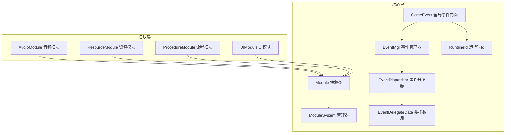
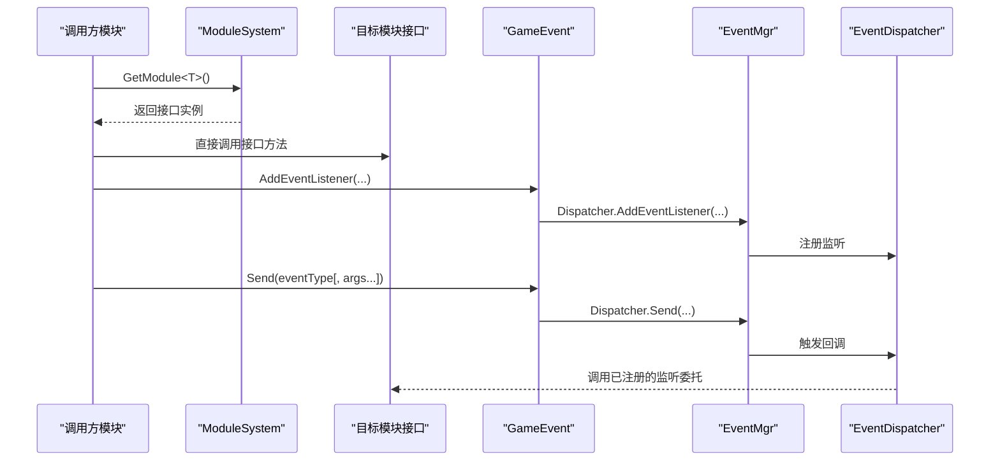
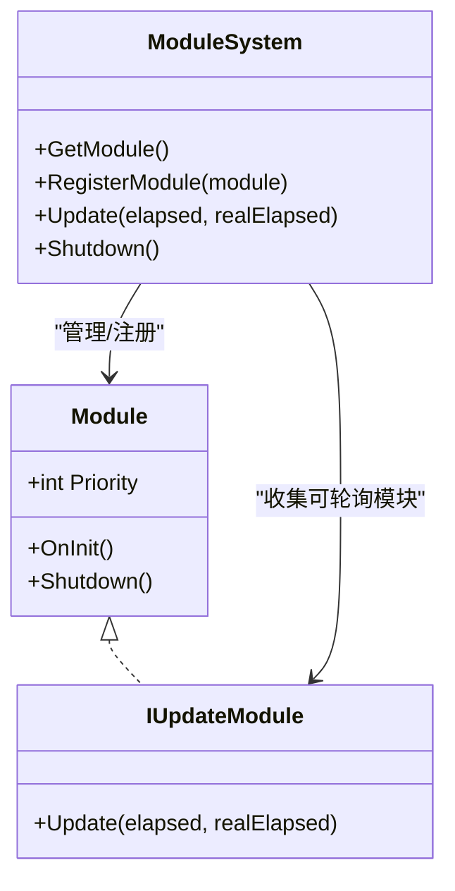
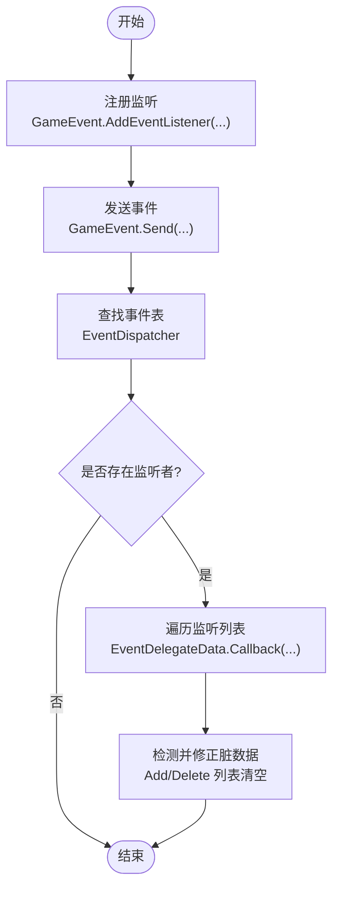
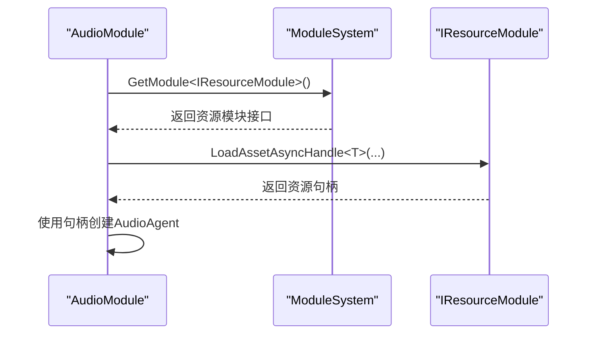
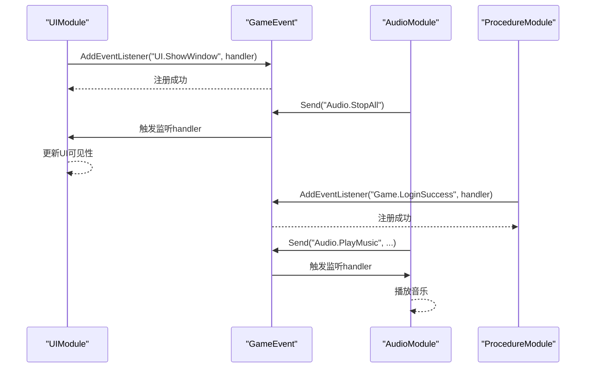
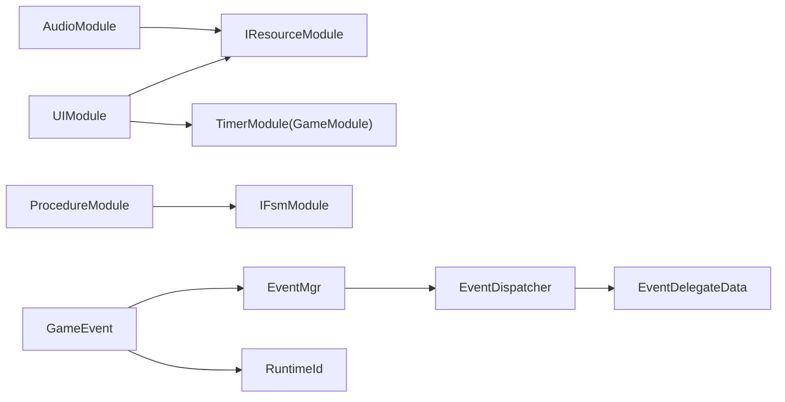

# 模块间通信

<cite>
**本文引用的文件**
- [Module.cs](file://Assets/TEngine/Runtime/Core/Module.cs)
- [ModuleSystem.cs](file://Assets/TEngine/Runtime/Core/ModuleSystem.cs)
- [GameEvent.cs](file://Assets/TEngine/Runtime/Core/GameEvent/GameEvent.cs)
- [EventDispatcher.cs](file://Assets/TEngine/Runtime/Core/GameEvent/EventDispatcher.cs)
- [EventMgr.cs](file://Assets/TEngine/Runtime/Core/GameEvent/EventMgr.cs)
- [EventDelegateData.cs](file://Assets/TEngine/Runtime/Core/GameEvent/EventDelegateData.cs)
- [RuntimeId.cs](file://Assets/TEngine/Runtime/Core/GameEvent/RuntimeId.cs)
- [AudioModule.cs](file://Assets/TEngine/Runtime/Module/AudioModule/AudioModule.cs)
- [ResourceModule.cs](file://Assets/TEngine/Runtime/Module/ResourceModule/ResourceModule.cs)
- [ProcedureModule.cs](file://Assets/TEngine/Runtime/Module/ProcedureModule/ProcedureModule.cs)
- [UIModule.cs](file://Assets/GameScripts/HotFix/GameLogic/Module/UIModule/UIModule.cs)
- [IProcedureModule.cs](file://Assets/TEngine/Runtime/Module/ProcedureModule/IProcedureModule.cs)
- [ProcedureBase.cs](file://Assets/GameScripts/Procedure/ProcedureBase.cs)
</cite>

## 目录
1. [引言](#引言)
2. [项目结构](#项目结构)
3. [核心组件](#核心组件)
4. [架构总览](#架构总览)
5. [详细组件分析](#详细组件分析)
6. [依赖关系分析](#依赖关系分析)
7. [性能考量](#性能考量)
8. [故障排查指南](#故障排查指南)
9. [结论](#结论)
10. [附录](#附录)

## 引言
本文件聚焦于模块间通信机制，系统性梳理事件驱动通信、直接接口调用、消息传递等策略；详解事件系统的注册、触发、监听与运行时Id映射；阐述模块解耦的设计原则与实现方法；给出性能优化建议与常见问题排查步骤，并通过仓库中的实际模块与事件代码片段路径，演示跨模块数据共享、状态同步与功能调用等典型场景。

## 项目结构
TEngine 提供了统一的模块基座与事件系统，模块通过 ModuleSystem 管理生命周期与轮询，模块间通过接口与事件系统进行松耦合通信。UI、资源、音频、流程等模块均继承自 Module 或实现特定接口，通过 ModuleSystem 注册与调度。

图示来源
- [Module.cs:22-39](file://Assets/TEngine/Runtime/Core/Module.cs#L22-L39)
- [ModuleSystem.cs:9-208](file://Assets/TEngine/Runtime/Core/ModuleSystem.cs#L9-L208)
- [GameEvent.cs:8-601](file://Assets/TEngine/Runtime/Core/GameEvent/GameEvent.cs#L8-L601)
- [EventMgr.cs:9-89](file://Assets/TEngine/Runtime/Core/GameEvent/EventMgr.cs#L9-L89)
- [EventDispatcher.cs:9-188](file://Assets/TEngine/Runtime/Core/GameEvent/EventDispatcher.cs#L9-L188)
- [EventDelegateData.cs:9-266](file://Assets/TEngine/Runtime/Core/GameEvent/EventDelegateData.cs#L9-L266)
- [RuntimeId.cs:10-56](file://Assets/TEngine/Runtime/Core/GameEvent/RuntimeId.cs#L10-L56)
- [AudioModule.cs:11-571](file://Assets/TEngine/Runtime/Module/AudioModule/AudioModule.cs#L11-L571)
- [ResourceModule.cs:17-1252](file://Assets/TEngine/Runtime/Module/ResourceModule/ResourceModule.cs#L17-L1252)
- [ProcedureModule.cs:8-209](file://Assets/TEngine/Runtime/Module/ProcedureModule/ProcedureModule.cs#L8-L209)
- [UIModule.cs:15-732](file://Assets/GameScripts/HotFix/GameLogic/Module/UIModule/UIModule.cs#L15-L732)

章节来源
- [Module.cs:1-40](file://Assets/TEngine/Runtime/Core/Module.cs#L1-L40)
- [ModuleSystem.cs:1-208](file://Assets/TEngine/Runtime/Core/ModuleSystem.cs#L1-L208)

## 核心组件
- 模块抽象与系统
  - Module 抽象类定义模块生命周期与优先级；ModuleSystem 负责模块注册、轮询、关闭与更新队列构建。
- 事件系统
  - GameEvent 提供全局事件门面，封装 AddEventListener、RemoveEventListener、Send 等接口；
  - EventMgr 管理事件分发器与接口包装注册；
  - EventDispatcher 维护事件表与多重重载的 Send；
  - EventDelegateData 支持监听者列表的并发安全增删与回调；
  - RuntimeId 提供字符串到运行时整型Id的映射，降低事件Id维护成本。
- 典型模块
  - AudioModule、ResourceModule、ProcedureModule、UIModule 展示了模块如何通过接口与事件系统协作。

章节来源
- [Module.cs:22-39](file://Assets/TEngine/Runtime/Core/Module.cs#L22-L39)
- [ModuleSystem.cs:9-208](file://Assets/TEngine/Runtime/Core/ModuleSystem.cs#L9-L208)
- [GameEvent.cs:8-601](file://Assets/TEngine/Runtime/Core/GameEvent/GameEvent.cs#L8-L601)
- [EventMgr.cs:9-89](file://Assets/TEngine/Runtime/Core/GameEvent/EventMgr.cs#L9-L89)
- [EventDispatcher.cs:9-188](file://Assets/TEngine/Runtime/Core/GameEvent/EventDispatcher.cs#L9-L188)
- [EventDelegateData.cs:9-266](file://Assets/TEngine/Runtime/Core/GameEvent/EventDelegateData.cs#L9-L266)
- [RuntimeId.cs:10-56](file://Assets/TEngine/Runtime/Core/GameEvent/RuntimeId.cs#L10-L56)

## 架构总览
模块间通信遵循“接口契约 + 事件门面”的双通道策略：
- 接口契约：模块通过 ModuleSystem.GetModule<T>() 获取其他模块接口，实现强类型直接调用；
- 事件门面：模块通过 GameEvent 的 AddEventListener/RemoveEventListener/ Send 完成跨模块解耦通知。

图示来源
- [ModuleSystem.cs:68-141](file://Assets/TEngine/Runtime/Core/ModuleSystem.cs#L68-L141)
- [GameEvent.cs:28-591](file://Assets/TEngine/Runtime/Core/GameEvent/GameEvent.cs#L28-L591)
- [EventDispatcher.cs:32-185](file://Assets/TEngine/Runtime/Core/GameEvent/EventDispatcher.cs#L32-L185)

## 详细组件分析

### 模块系统与解耦设计
- 模块注册与轮询
  - ModuleSystem 以链表维护模块顺序，按优先级插入；对实现 IUpdateModule 的模块构建更新列表，按帧遍历调用 Update。
  - 通过 RegisterModule<T> 可注入自定义模块实例，便于测试与替换。
- 解耦原则
  - 模块间仅依赖接口，不依赖具体实现；通过接口名获取模块，避免硬编码依赖。
  - 优先使用事件进行跨模块广播，减少直接耦合。

图示来源
- [Module.cs:22-39](file://Assets/TEngine/Runtime/Core/Module.cs#L22-L39)
- [ModuleSystem.cs:9-208](file://Assets/TEngine/Runtime/Core/ModuleSystem.cs#L9-L208)

章节来源
- [ModuleSystem.cs:29-60](file://Assets/TEngine/Runtime/Core/ModuleSystem.cs#L29-L60)
- [ModuleSystem.cs:128-194](file://Assets/TEngine/Runtime/Core/ModuleSystem.cs#L128-L194)

### 事件系统：注册、触发与监听
- 事件注册
  - GameEvent 提供多重重载的 AddEventListener/RemoveEventListener，支持 Action 与带参数 Action<T...>；
  - EventMgr 通过 Dispatcher 维护事件表；同时支持字符串事件名与运行时Id两种注册方式。
- 事件触发
  - GameEvent.Send 提供多重重载，EventDispatcher 根据事件类型回调所有监听者；
  - EventDelegateData 在回调过程中支持动态增删监听，保证遍历过程的安全性。
- 运行时Id映射
  - RuntimeId 将字符串事件名映射为递增整型Id，避免字符串比较开销，提升事件分发效率。

图示来源
- [GameEvent.cs:28-591](file://Assets/TEngine/Runtime/Core/GameEvent/GameEvent.cs#L28-L591)
- [EventDispatcher.cs:32-185](file://Assets/TEngine/Runtime/Core/GameEvent/EventDispatcher.cs#L32-L185)
- [EventDelegateData.cs:32-264](file://Assets/TEngine/Runtime/Core/GameEvent/EventDelegateData.cs#L32-L264)
- [RuntimeId.cs:32-54](file://Assets/TEngine/Runtime/Core/GameEvent/RuntimeId.cs#L32-L54)

章节来源
- [GameEvent.cs:28-118](file://Assets/TEngine/Runtime/Core/GameEvent/GameEvent.cs#L28-L118)
- [GameEvent.cs:385-591](file://Assets/TEngine/Runtime/Core/GameEvent/GameEvent.cs#L385-L591)
- [EventMgr.cs:30-87](file://Assets/TEngine/Runtime/Core/GameEvent/EventMgr.cs#L30-L87)
- [EventDelegateData.cs:32-114](file://Assets/TEngine/Runtime/Core/GameEvent/EventDelegateData.cs#L32-L114)

### 模块间直接接口调用示例
- 资源模块与音频模块
  - AudioModule 在 OnInit 中通过 ModuleSystem.GetModule<IResourceModule>() 获取资源模块接口，用于异步加载音频资源与对象池管理。
- 流程模块与UI模块
  - UI模块在初始化时可直接调用模块接口（如资源接口），并通过事件系统与其他模块交互。

图示来源
- [AudioModule.cs:322-326](file://Assets/TEngine/Runtime/Module/AudioModule/AudioModule.cs#L322-L326)
- [AudioModule.cs:510-513](file://Assets/TEngine/Runtime/Module/AudioModule/AudioModule.cs#L510-L513)
- [ModuleSystem.cs:68-89](file://Assets/TEngine/Runtime/Core/ModuleSystem.cs#L68-L89)

章节来源
- [AudioModule.cs:322-326](file://Assets/TEngine/Runtime/Module/AudioModule/AudioModule.cs#L322-L326)
- [AudioModule.cs:510-513](file://Assets/TEngine/Runtime/Module/AudioModule/AudioModule.cs#L510-L513)

### 模块间事件通信示例
- 跨模块状态同步
  - UI模块可通过 GameEvent 发布/订阅窗口显示/隐藏事件，音频模块根据事件调整音量或停止播放，流程模块根据事件切换状态。
- 功能调用
  - 模块通过事件广播“资源加载完成”、“用户登录成功”等信号，其他模块监听并执行相应动作，避免直接耦合。

图示来源
- [GameEvent.cs:28-118](file://Assets/TEngine/Runtime/Core/GameEvent/GameEvent.cs#L28-L118)
- [GameEvent.cs:385-591](file://Assets/TEngine/Runtime/Core/GameEvent/GameEvent.cs#L385-L591)
- [UIModule.cs:472-478](file://Assets/GameScripts/HotFix/GameLogic/Module/UIModule/UIModule.cs#L472-L478)

章节来源
- [UIModule.cs:472-478](file://Assets/GameScripts/HotFix/GameLogic/Module/UIModule/UIModule.cs#L472-L478)

### 模块间解耦的设计原则与实现
- 契约优先：模块间通过接口契约通信，避免直接依赖具体实现。
- 松耦合广播：使用事件系统进行跨模块广播，降低调用链复杂度。
- 生命周期管理：通过 ModuleSystem 统一管理模块初始化、轮询与关闭，确保资源有序释放。
- 事件Id策略：使用 RuntimeId 将字符串事件名映射为整型Id，兼顾易读性与性能。

章节来源
- [ModuleSystem.cs:68-141](file://Assets/TEngine/Runtime/Core/ModuleSystem.cs#L68-L141)
- [RuntimeId.cs:32-54](file://Assets/TEngine/Runtime/Core/GameEvent/RuntimeId.cs#L32-L54)

## 依赖关系分析
- 模块依赖
  - AudioModule 依赖 IResourceModule 接口；
  - UI模块依赖资源接口与定时器模块（通过 GameModule 访问）；
  - 流程模块依赖 FSM 模块接口。
- 事件依赖
  - GameEvent 依赖 EventMgr，EventMgr 再依赖 EventDispatcher；
  - EventDispatcher 依赖 EventDelegateData 与 RuntimeId。

图示来源
- [AudioModule.cs:322-326](file://Assets/TEngine/Runtime/Module/AudioModule/AudioModule.cs#L322-L326)
- [UIModule.cs:411-414](file://Assets/GameScripts/HotFix/GameLogic/Module/UIModule/UIModule.cs#L411-L414)
- [ProcedureModule.cs:86-95](file://Assets/TEngine/Runtime/Module/ProcedureModule/ProcedureModule.cs#L86-L95)
- [GameEvent.cs:13-18](file://Assets/TEngine/Runtime/Core/GameEvent/GameEvent.cs#L13-L18)
- [EventMgr.cs:73-78](file://Assets/TEngine/Runtime/Core/GameEvent/EventMgr.cs#L73-L78)

章节来源
- [IProcedureModule.cs:8-48](file://Assets/TEngine/Runtime/Module/ProcedureModule/IProcedureModule.cs#L8-L48)
- [ProcedureBase.cs:13-14](file://Assets/GameScripts/Procedure/ProcedureBase.cs#L13-L14)

## 性能考量
- 事件回调遍历
  - EventDelegateData 在回调时标记执行状态，避免遍历期间增删导致冲突；动态增删通过延迟列表合并，降低锁竞争与GC。
- 更新队列优化
  - ModuleSystem 对 IUpdateModule 模块按优先级排序，构建一次性执行列表，减少重复查找与分支判断。
- 事件Id映射
  - RuntimeId 使用字典缓存字符串到整型Id映射，避免频繁字符串哈希与比较。
- 资源加载与对象池
  - ResourceModule 通过对象池与句柄管理减少重复加载与GC；UI模块按层级深度与可见性批量更新，降低渲染压力。

章节来源
- [EventDelegateData.cs:76-96](file://Assets/TEngine/Runtime/Core/GameEvent/EventDelegateData.cs#L76-L96)
- [ModuleSystem.cs:199-206](file://Assets/TEngine/Runtime/Core/ModuleSystem.cs#L199-L206)
- [RuntimeId.cs:32-44](file://Assets/TEngine/Runtime/Core/GameEvent/RuntimeId.cs#L32-L44)
- [ResourceModule.cs:692-760](file://Assets/TEngine/Runtime/Module/ResourceModule/ResourceModule.cs#L692-L760)
- [UIModule.cs:480-516](file://Assets/GameScripts/HotFix/GameLogic/Module/UIModule/UIModule.cs#L480-L516)

## 故障排查指南
- 事件监听未生效
  - 检查事件类型是否正确注册（字符串事件需转换为运行时Id）；确认监听者未重复注册或遗漏移除。
- 回调异常或崩溃
  - EventDelegateData 在回调过程中若发现重复注册或删除不存在的监听，会输出致命日志；检查监听注册与移除时机。
- 模块获取失败
  - ModuleSystem.GetModule<T>() 要求 T 为接口类型；若传入非接口类型会抛出异常；确认接口命名与程序集一致。
- 资源加载阻塞
  - ResourceModule 的异步加载需等待句柄完成；检查资源定位地址与包名是否正确，以及包初始化状态。
- UI窗口显示异常
  - UIModule 通过层级与可见性控制窗口栈；检查窗口层级、全屏覆盖与隐藏定时器设置。

章节来源
- [EventDelegateData.cs:36-70](file://Assets/TEngine/Runtime/Core/GameEvent/EventDelegateData.cs#L36-L70)
- [ModuleSystem.cs:71-89](file://Assets/TEngine/Runtime/Core/ModuleSystem.cs#L71-L89)
- [ResourceModule.cs:692-760](file://Assets/TEngine/Runtime/Module/ResourceModule/ResourceModule.cs#L692-L760)
- [UIModule.cs:480-516](file://Assets/GameScripts/HotFix/GameLogic/Module/UIModule/UIModule.cs#L480-L516)

## 结论
TEngine 的模块间通信以“接口契约 + 事件门面”为核心，结合 ModuleSystem 的统一调度与事件系统的高效分发，实现了高内聚、低耦合的模块协作。通过运行时Id映射、延迟修正的监听列表与优先级更新队列，系统在保证易用性的同时兼顾性能与稳定性。实践中应优先采用事件进行跨模块广播，必要时通过接口进行直接调用，严格遵循模块生命周期与异常排查流程，确保系统长期稳定运行。

## 附录
- 代码片段路径参考
  - 模块注册与轮询：[ModuleSystem.cs:68-141](file://Assets/TEngine/Runtime/Core/ModuleSystem.cs#L68-L141)
  - 事件注册与触发：[GameEvent.cs:28-118](file://Assets/TEngine/Runtime/Core/GameEvent/GameEvent.cs#L28-L118), [GameEvent.cs:385-591](file://Assets/TEngine/Runtime/Core/GameEvent/GameEvent.cs#L385-L591)
  - 事件回调与并发安全：[EventDelegateData.cs:32-114](file://Assets/TEngine/Runtime/Core/GameEvent/EventDelegateData.cs#L32-L114)
  - 模块接口调用示例：[AudioModule.cs:322-326](file://Assets/TEngine/Runtime/Module/AudioModule/AudioModule.cs#L322-L326), [UIModule.cs:472-478](file://Assets/GameScripts/HotFix/GameLogic/Module/UIModule/UIModule.cs#L472-L478)
  - 流程模块初始化：[ProcedureModule.cs:86-95](file://Assets/TEngine/Runtime/Module/ProcedureModule/ProcedureModule.cs#L86-L95)