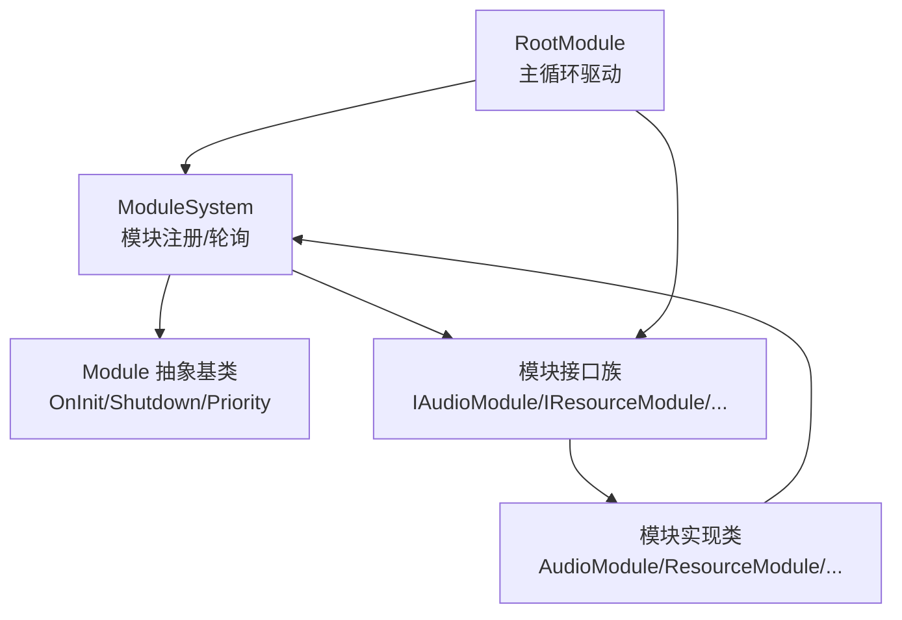
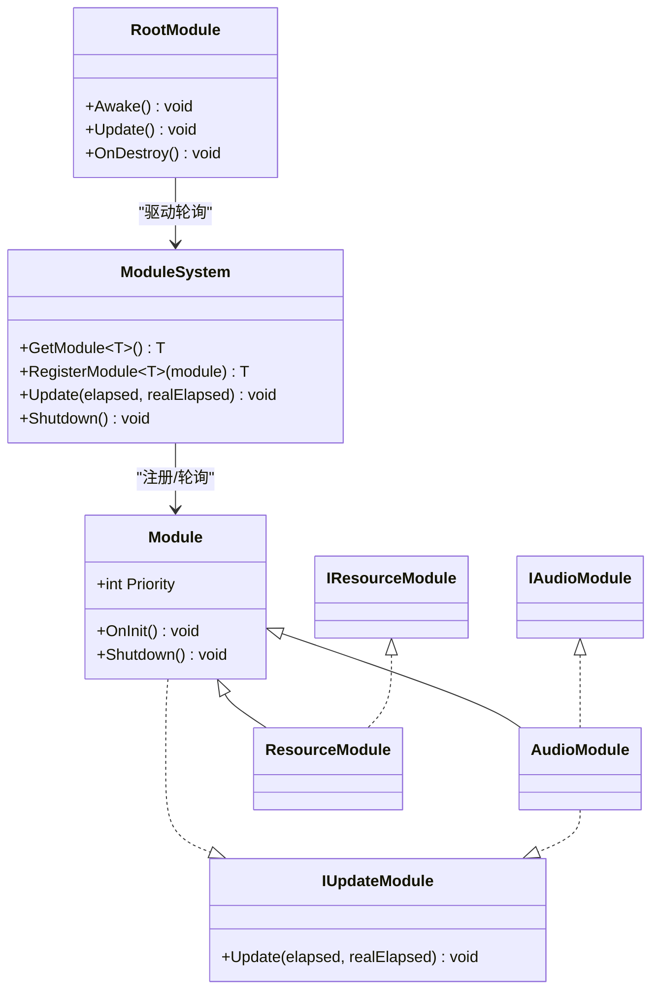
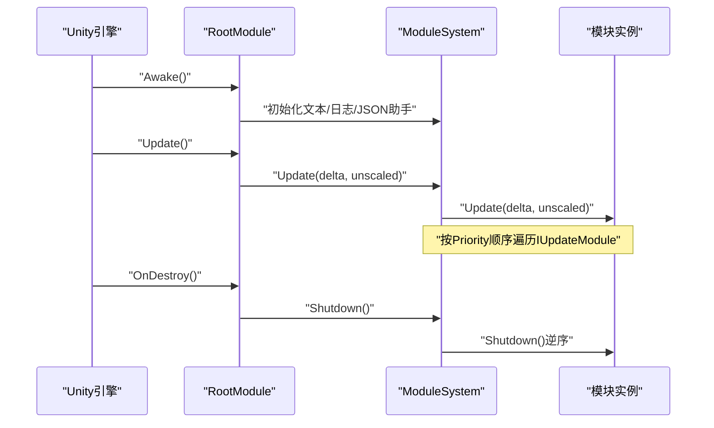
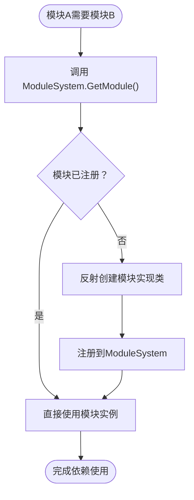
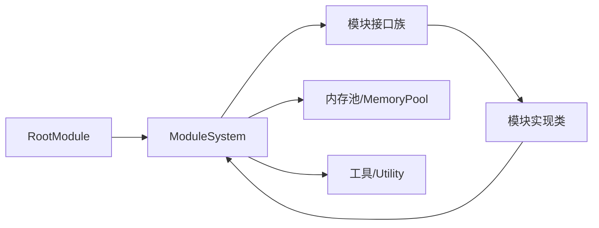

# 自定义模块开发

<cite>
**本文档引用的文件**
- [Module.cs](file://Assets/TEngine/Runtime/Core/Module.cs)
- [ModuleSystem.cs](file://Assets/TEngine/Runtime/Core/ModuleSystem.cs)
- [RootModule.cs](file://Assets/TEngine/Runtime/Module/RootModule.cs)
- [IAudioModule.cs](file://Assets/TEngine/Runtime/Module/AudioModule/IAudioModule.cs)
- [AudioModule.cs](file://Assets/TEngine/Runtime/Module/AudioModule/AudioModule.cs)
- [IResourceModule.cs](file://Assets/TEngine/Runtime/Module/ResourceModule/IResourceModule.cs)
- [ResourceModule.cs](file://Assets/TEngine/Runtime/Module/ResourceModule/ResourceModule.cs)
- [IProcedureModule.cs](file://Assets/TEngine/Runtime/Module/ProcedureModule/IProcedureModule.cs)
- [IObjectPoolModule.cs](file://Assets/TEngine/Runtime/Module/ObjectPoolModule/IObjectPoolModule.cs)
- [ITimerModule.cs](file://Assets/TEngine/Runtime/Module/TimerModule/ITimerModule.cs)
- [ISceneModule.cs](file://Assets/TEngine/Runtime/Module/SceneModule/ISceneModule.cs)
- [ILocalizationModule.cs](file://Assets/TEngine/Runtime/Module/LocalizationModule/ILocalizationModule.cs)
- [GameModule.cs](file://Assets/GameScripts/HotFix/GameLogic/GameModule.cs)
- [systemPatterns.md](file://memory-bank/systemPatterns.md)
- [techContext.md](file://memory-bank/techContext.md)
</cite>

## 目录
1. [简介](#简介)
2. [项目结构](#项目结构)
3. [核心组件](#核心组件)
4. [架构总览](#架构总览)
5. [详细组件分析](#详细组件分析)
6. [依赖关系分析](#依赖关系分析)
7. [性能考虑](#性能考虑)
8. [故障排查指南](#故障排查指南)
9. [结论](#结论)
10. [附录](#附录)

## 简介
本指南面向希望在 TEngine 框架上开发自定义模块的工程师，提供从接口选择、类继承、生命周期实现到模块间通信与依赖设计的完整流程。文档覆盖常见模块接口（如 IUpdateModule、IResourceModule、IAudioModule 等）的特性与使用场景，并给出最佳实践（性能优化、内存管理、异常处理）、测试调试与部署技巧，以及从简单到复杂的模块开发示例路径。

## 项目结构
TEngine 的模块系统围绕统一的模块基类与模块管理系统构建，RootModule 作为游戏主循环的驱动者，通过 ModuleSystem 维护模块的注册、优先级与轮询顺序。各功能模块以接口+实现的形式提供能力，模块间通过 ModuleSystem 进行解耦协作。

图示来源
- [RootModule.cs:116-144](file://Assets/TEngine/Runtime/Module/RootModule.cs#L116-L144)
- [ModuleSystem.cs:68-89](file://Assets/TEngine/Runtime/Core/ModuleSystem.cs#L68-L89)
- [Module.cs:22-39](file://Assets/TEngine/Runtime/Core/Module.cs#L22-L39)

章节来源
- [RootModule.cs:116-144](file://Assets/TEngine/Runtime/Module/RootModule.cs#L116-L144)
- [ModuleSystem.cs:68-89](file://Assets/TEngine/Runtime/Core/ModuleSystem.cs#L68-L89)
- [Module.cs:22-39](file://Assets/TEngine/Runtime/Core/Module.cs#L22-L39)

## 核心组件
- 模块接口 IUpdateModule：声明 Update(elapsed, realElapsed) 方法，用于参与主循环轮询。
- 模块基类 Module：定义 OnInit、Shutdown、Priority 等生命周期与优先级。
- 模块系统 ModuleSystem：负责模块的创建、注册、轮询列表构建与全局 Shutdown。
- RootModule：Unity 生命周期钩子中调用 ModuleSystem.Update，驱动所有 IUpdateModule。

章节来源
- [Module.cs:8-16](file://Assets/TEngine/Runtime/Core/Module.cs#L8-L16)
- [Module.cs:22-39](file://Assets/TEngine/Runtime/Core/Module.cs#L22-L39)
- [ModuleSystem.cs:29-42](file://Assets/TEngine/Runtime/Core/ModuleSystem.cs#L29-L42)
- [RootModule.cs:140-144](file://Assets/TEngine/Runtime/Module/RootModule.cs#L140-L144)

## 架构总览
模块系统采用“接口隔离 + 抽象基类 + 管理器”的分层设计。模块通过接口暴露能力，通过继承 Module 实现生命周期；ModuleSystem 负责模块的发现、创建、优先级排序与轮询执行；RootModule 将模块轮询接入 Unity 主循环。

图示来源
- [Module.cs:22-39](file://Assets/TEngine/Runtime/Core/Module.cs#L22-L39)
- [Module.cs:8-16](file://Assets/TEngine/Runtime/Core/Module.cs#L8-L16)
- [ModuleSystem.cs:68-89](file://Assets/TEngine/Runtime/Core/ModuleSystem.cs#L68-L89)
- [RootModule.cs:140-144](file://Assets/TEngine/Runtime/Module/RootModule.cs#L140-L144)
- [IAudioModule.cs:8-128](file://Assets/TEngine/Runtime/Module/AudioModule/IAudioModule.cs#L8-L128)
- [AudioModule.cs:11](file://Assets/TEngine/Runtime/Module/AudioModule/AudioModule.cs#L11)
- [IResourceModule.cs:12-356](file://Assets/TEngine/Runtime/Module/ResourceModule/IResourceModule.cs#L12-L356)
- [ResourceModule.cs:17](file://Assets/TEngine/Runtime/Module/ResourceModule/ResourceModule.cs#L17)

## 详细组件分析

### 模块接口族与典型实现
- IAudioModule：提供音量/开关控制、分类音量、播放/停止/预加载等音频能力，实现类 AudioModule 支持 IUpdateModule 以便逐帧更新音频类别。
- IResourceModule：封装 YooAsset 资源系统，提供初始化、包管理、异步/同步加载、卸载、低内存回收等能力，实现类 ResourceModule 作为高优先级模块参与轮询。
- IProcedureModule：流程管理接口，配合 IFsmModule 管理游戏流程。
- IObjectPoolModule：对象池管理接口，支持单次/多次获取、容量/过期/优先级等策略。
- ITimerModule：计时器接口，提供添加/暂停/恢复/重置/移除等能力。
- ISceneModule：场景加载/激活/卸载接口，支持异步与进度回调。
- ILocalizationModule：本地化语言切换与加载接口。

章节来源
- [IAudioModule.cs:8-128](file://Assets/TEngine/Runtime/Module/AudioModule/IAudioModule.cs#L8-L128)
- [AudioModule.cs:11](file://Assets/TEngine/Runtime/Module/AudioModule/AudioModule.cs#L11)
- [IResourceModule.cs:12-356](file://Assets/TEngine/Runtime/Module/ResourceModule/IResourceModule.cs#L12-L356)
- [ResourceModule.cs:17](file://Assets/TEngine/Runtime/Module/ResourceModule/ResourceModule.cs#L17)
- [IProcedureModule.cs:8-83](file://Assets/TEngine/Runtime/Module/ProcedureModule/IProcedureModule.cs#L8-L83)
- [IObjectPoolModule.cs:9-745](file://Assets/TEngine/Runtime/Module/ObjectPoolModule/IObjectPoolModule.cs#L9-L745)
- [ITimerModule.cs:3-66](file://Assets/TEngine/Runtime/Module/TimerModule/ITimerModule.cs#L3-L66)
- [ISceneModule.cs:7-87](file://Assets/TEngine/Runtime/Module/SceneModule/ISceneModule.cs#L7-L87)
- [ILocalizationModule.cs:5-60](file://Assets/TEngine/Runtime/Module/LocalizationModule/ILocalizationModule.cs#L5-L60)

### 模块生命周期与轮询序列
模块的生命周期由 ModuleSystem 管理：首次获取时创建并注册，随后按 Priority 插入有序链表；若实现 IUpdateModule，则加入更新列表并在每帧轮询。RootModule 在 Unity Update 中触发 ModuleSystem.Update。

图示来源
- [RootModule.cs:116-167](file://Assets/TEngine/Runtime/Module/RootModule.cs#L116-L167)
- [ModuleSystem.cs:29-60](file://Assets/TEngine/Runtime/Core/ModuleSystem.cs#L29-L60)
- [ModuleSystem.cs:143-194](file://Assets/TEngine/Runtime/Core/ModuleSystem.cs#L143-L194)

章节来源
- [RootModule.cs:116-167](file://Assets/TEngine/Runtime/Module/RootModule.cs#L116-L167)
- [ModuleSystem.cs:29-60](file://Assets/TEngine/Runtime/Core/ModuleSystem.cs#L29-L60)
- [ModuleSystem.cs:143-194](file://Assets/TEngine/Runtime/Core/ModuleSystem.cs#L143-L194)

### 模块间依赖与通信
- 依赖注入：通过 ModuleSystem.GetModule<T>() 获取其他模块实例，避免硬编码耦合。
- 事件驱动：通过事件系统实现松耦合通信（参考技术上下文与系统模式）。
- 资源依赖：模块可通过 IResourceModule 提供的加载/卸载能力管理资源生命周期。

图示来源
- [ModuleSystem.cs:68-89](file://Assets/TEngine/Runtime/Core/ModuleSystem.cs#L68-L89)
- [ModuleSystem.cs:97-120](file://Assets/TEngine/Runtime/Core/ModuleSystem.cs#L97-L120)

章节来源
- [ModuleSystem.cs:68-89](file://Assets/TEngine/Runtime/Core/ModuleSystem.cs#L68-L89)
- [ModuleSystem.cs:97-120](file://Assets/TEngine/Runtime/Core/ModuleSystem.cs#L97-L120)
- [systemPatterns.md:230-257](file://memory-bank/systemPatterns.md#L230-L257)

### 自定义模块开发流程
- 设计接口：定义模块接口（如 IMyModule），遵循命名约定（IModuleName）。
- 实现类：创建实现类（MyModule : Module, IMyModule），实现 OnInit/Shutdown/Priority。
- 注册与获取：通过 ModuleSystem.RegisterModule<T>(module) 或首次 GetModule<T>() 自动创建。
- 轮询集成：若需每帧更新，实现 IUpdateModule 并在 OnInit 中完成必要初始化。
- 依赖声明：在 OnInit 中通过 ModuleSystem.GetModule<T>() 获取所需模块。
- 生命周期：在 Shutdown 中释放资源、取消订阅、停止计时器等。

章节来源
- [Module.cs:22-39](file://Assets/TEngine/Runtime/Core/Module.cs#L22-L39)
- [ModuleSystem.cs:128-141](file://Assets/TEngine/Runtime/Core/ModuleSystem.cs#L128-L141)
- [ModuleSystem.cs:68-89](file://Assets/TEngine/Runtime/Core/ModuleSystem.cs#L68-L89)

### 示例路径（从简单到复杂）
- HelloWorld 模块：实现最小接口与生命周期，验证 ModuleSystem 注册与轮询。
- 资源加载模块：基于 IResourceModule 实现异步加载、缓存与释放策略。
- 音频播放模块：基于 IAudioModule 实现分类音量、淡入淡出与对象池复用。
- 流程控制模块：基于 IProcedureModule 与 IFsmModule 管理游戏状态流转。
- 业务模块：组合多模块能力（资源、音频、定时器、本地化），通过事件系统解耦。

章节来源
- [IAudioModule.cs:8-128](file://Assets/TEngine/Runtime/Module/AudioModule/IAudioModule.cs#L8-L128)
- [AudioModule.cs:322-332](file://Assets/TEngine/Runtime/Module/AudioModule/AudioModule.cs#L322-L332)
- [IResourceModule.cs:12-356](file://Assets/TEngine/Runtime/Module/ResourceModule/IResourceModule.cs#L12-L356)
- [ResourceModule.cs:119-138](file://Assets/TEngine/Runtime/Module/ResourceModule/ResourceModule.cs#L119-L138)
- [IProcedureModule.cs:8-83](file://Assets/TEngine/Runtime/Module/ProcedureModule/IProcedureModule.cs#L8-L83)
- [ILocalizationModule.cs:5-60](file://Assets/TEngine/Runtime/Module/LocalizationModule/ILocalizationModule.cs#L5-L60)
- [ITimerModule.cs:3-66](file://Assets/TEngine/Runtime/Module/TimerModule/ITimerModule.cs#L3-L66)

## 依赖关系分析
模块系统通过接口与抽象类解耦，模块实现类之间无直接依赖，全部通过 ModuleSystem 间接交互。RootModule 作为唯一主循环驱动点，确保所有 IUpdateModule 按优先级顺序执行。

图示来源
- [RootModule.cs:140-144](file://Assets/TEngine/Runtime/Module/RootModule.cs#L140-L144)
- [ModuleSystem.cs:47-60](file://Assets/TEngine/Runtime/Core/ModuleSystem.cs#L47-L60)

章节来源
- [RootModule.cs:140-144](file://Assets/TEngine/Runtime/Module/RootModule.cs#L140-L144)
- [ModuleSystem.cs:47-60](file://Assets/TEngine/Runtime/Core/ModuleSystem.cs#L47-L60)

## 性能考虑
- 轮询顺序与优先级：通过 Priority 控制模块轮询顺序，避免高频模块阻塞低频模块。
- 异步加载与时间片：资源模块使用时间切片参数限制每帧异步操作耗时，降低卡顿风险。
- 对象池与内存池：优先使用对象池与内存池减少 GC 压力，避免频繁分配。
- 事件与订阅：合理订阅/取消订阅，避免长生命周期持有导致内存泄漏。
- 资源释放策略：结合 LRU/ARC 等策略，按需释放未使用资源。

章节来源
- [ResourceModule.cs:34](file://Assets/TEngine/Runtime/Module/ResourceModule/ResourceModule.cs#L34)
- [techContext.md:240-306](file://memory-bank/techContext.md#L240-L306)
- [systemPatterns.md:191-207](file://memory-bank/systemPatterns.md#L191-L207)

## 故障排查指南
- 模块未找到：确认接口名与实现类命名匹配，ModuleSystem 通过接口全名反射查找实现类。
- 无法轮询：确认模块实现 IUpdateModule 且 Priority 设置合理，确保注册到更新列表。
- 资源加载失败：检查资源定位地址、包名与标签配置，确认资源包已初始化。
- 内存告警：触发低内存回调时，调用对象池与资源模块的回收接口，必要时强制卸载未使用资源。
- 异常处理：在模块 OnInit/Update/Shutdown 中捕获并记录异常，避免中断主循环。

章节来源
- [ModuleSystem.cs:81-86](file://Assets/TEngine/Runtime/Core/ModuleSystem.cs#L81-L86)
- [ModuleSystem.cs:165-191](file://Assets/TEngine/Runtime/Core/ModuleSystem.cs#L165-L191)
- [RootModule.cs:287-302](file://Assets/TEngine/Runtime/Module/RootModule.cs#L287-L302)
- [IResourceModule.cs:347-353](file://Assets/TEngine/Runtime/Module/ResourceModule/IResourceModule.cs#L347-L353)

## 结论
TEngine 的模块系统通过清晰的接口与抽象基类、严格的生命周期管理与主循环集成，提供了高内聚、低耦合的扩展能力。开发者应遵循接口命名规范、合理设置优先级、善用对象池与异步加载策略，并通过事件系统实现模块间松耦合通信，从而构建高性能、易维护的自定义模块。

## 附录

### 模块接口与使用场景速览
- IUpdateModule：需要每帧轮询的模块（如音频、定时器、调试器）。
- IResourceModule：资源加载/卸载、包管理、低内存回收。
- IAudioModule：音量/开关、分类音量、播放/停止/预加载。
- IProcedureModule：流程管理，配合有限状态机。
- IObjectPoolModule：对象池管理，支持多种策略。
- ITimerModule：计时器管理，支持循环/非循环、不受时间缩放影响。
- ISceneModule：场景加载/激活/卸载，支持异步与进度回调。
- ILocalizationModule：语言切换与加载。

章节来源
- [Module.cs:8-16](file://Assets/TEngine/Runtime/Core/Module.cs#L8-L16)
- [IResourceModule.cs:12-356](file://Assets/TEngine/Runtime/Module/ResourceModule/IResourceModule.cs#L12-L356)
- [IAudioModule.cs:8-128](file://Assets/TEngine/Runtime/Module/AudioModule/IAudioModule.cs#L8-L128)
- [IProcedureModule.cs:8-83](file://Assets/TEngine/Runtime/Module/ProcedureModule/IProcedureModule.cs#L8-L83)
- [IObjectPoolModule.cs:9-745](file://Assets/TEngine/Runtime/Module/ObjectPoolModule/IObjectPoolModule.cs#L9-L745)
- [ITimerModule.cs:3-66](file://Assets/TEngine/Runtime/Module/TimerModule/ITimerModule.cs#L3-L66)
- [ISceneModule.cs:7-87](file://Assets/TEngine/Runtime/Module/SceneModule/ISceneModule.cs#L7-L87)
- [ILocalizationModule.cs:5-60](file://Assets/TEngine/Runtime/Module/LocalizationModule/ILocalizationModule.cs#L5-L60)

### 模块开发最佳实践清单
- 接口命名：IModuleName，实现类 ModuleNameModule。
- 生命周期：在 OnInit 中完成初始化，在 Shutdown 中释放资源。
- 优先级：根据轮询频率与依赖关系设置 Priority。
- 异步：使用 UniTask/UniTaskVoid，注意取消与异常处理。
- 内存：使用对象池与内存池，避免静态引用。
- 事件：通过事件系统解耦模块通信。
- 资源：统一通过 IResourceModule 管理加载/卸载。

章节来源
- [techContext.md:240-306](file://memory-bank/techContext.md#L240-L306)
- [systemPatterns.md:230-257](file://memory-bank/systemPatterns.md#L230-L257)