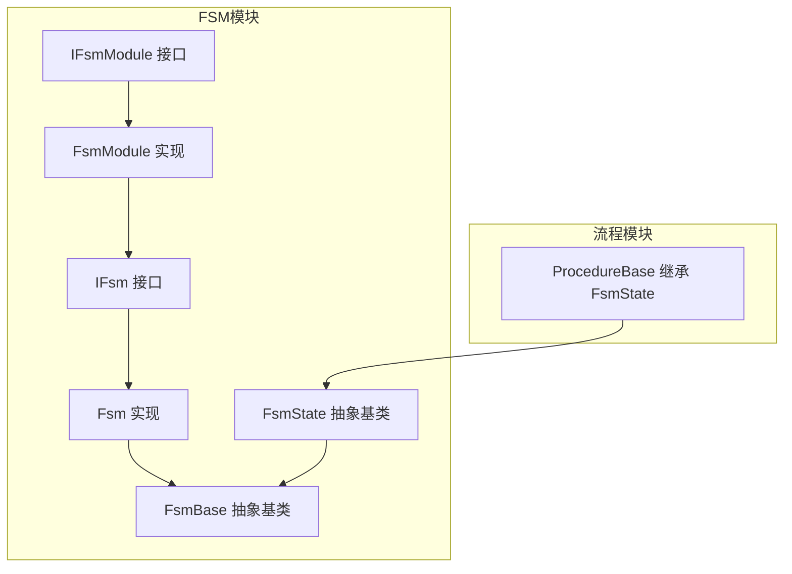
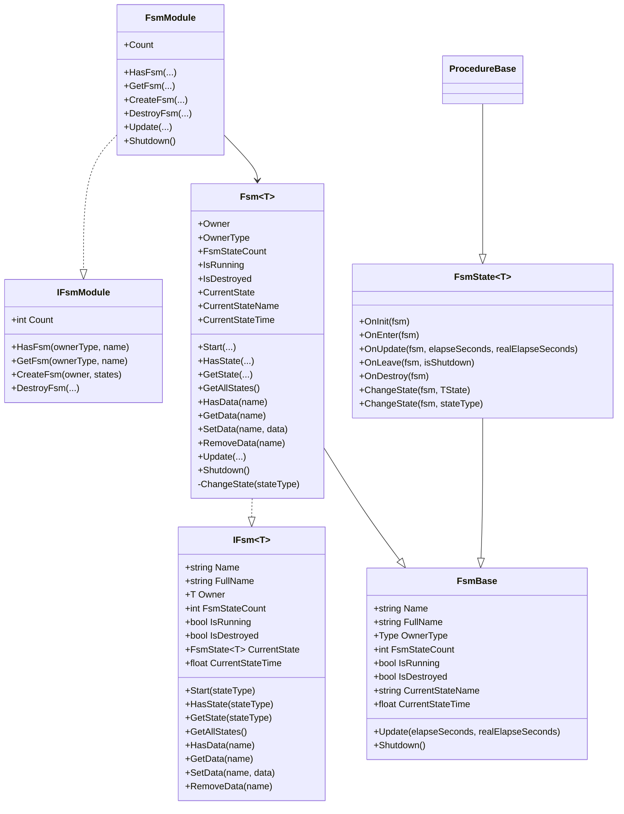
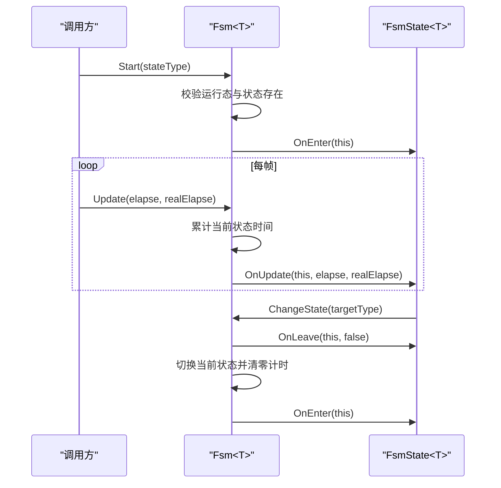
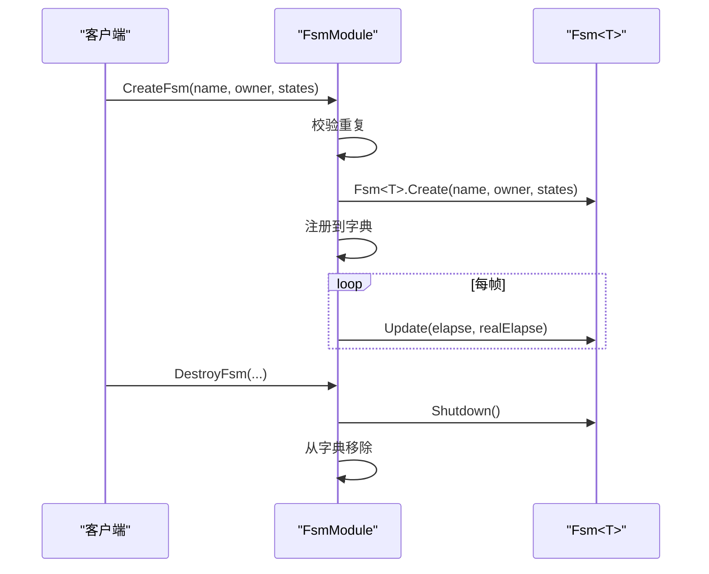
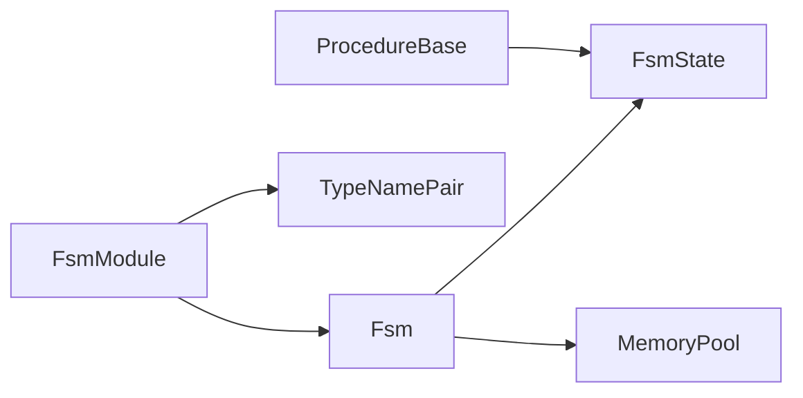

# FSM原理与实现

<cite>
**本文引用的文件**
- [FsmBase.cs](file://Assets/TEngine/Runtime/Module/FsmModule/FsmBase.cs)
- [FsmState.cs](file://Assets/TEngine/Runtime/Module/FsmModule/FsmState.cs)
- [IFsm.cs](file://Assets/TEngine/Runtime/Module/FsmModule/IFsm.cs)
- [Fsm.cs](file://Assets/TEngine/Runtime/Module/FsmModule/Fsm.cs)
- [IFsmModule.cs](file://Assets/TEngine/Runtime/Module/FsmModule/IFsmModule.cs)
- [FsmModule.cs](file://Assets/TEngine/Runtime/Module/FsmModule/FsmModule.cs)
- [ProcedureBase.cs](file://Assets/TEngine/Runtime/Module/ProcedureModule/ProcedureBase.cs)
- [ProcedureLaunch.cs](file://Assets/GameScripts/Procedure/ProcedureLaunch.cs)
</cite>

## 目录
1. [引言](#引言)
2. [项目结构](#项目结构)
3. [核心组件](#核心组件)
4. [架构总览](#架构总览)
5. [详细组件分析](#详细组件分析)
6. [依赖关系分析](#依赖关系分析)
7. [性能考量](#性能考量)
8. [故障排查指南](#故障排查指南)
9. [结论](#结论)
10. [附录](#附录)

## 引言
本文件面向TEngine的FSM（有限状态机）系统，系统性阐述FSM的核心概念、设计原则与实现细节，覆盖以下主题：
- 核心概念：状态、状态转换、事件驱动、生命周期管理
- 基类与接口：FsmBase、FsmState、IFsm、IFsmModule
- 实现机制：状态注册、启动、轮询、切换、销毁
- 扩展方式：如何自定义状态与状态机
- 应用场景：流程管理（Procedure）、角色行为、UI状态、网络状态等
- 调试技巧与性能优化建议

## 项目结构
TEngine的FSM位于“模块层”的FsmModule中，配合模块系统统一调度；同时，流程模块ProcedureModule基于FSM状态体系构建具体业务流程。

**图表来源**
- [IFsmModule.cs:9-175](file://Assets/TEngine/Runtime/Module/FsmModule/IFsmModule.cs#L9-L175)
- [FsmModule.cs:9-396](file://Assets/TEngine/Runtime/Module/FsmModule/FsmModule.cs#L9-L396)
- [IFsm.cs:10-159](file://Assets/TEngine/Runtime/Module/FsmModule/IFsm.cs#L10-L159)
- [Fsm.cs:10-506](file://Assets/TEngine/Runtime/Module/FsmModule/Fsm.cs#L10-L506)
- [FsmBase.cs:8-95](file://Assets/TEngine/Runtime/Module/FsmModule/FsmBase.cs#L8-L95)
- [FsmState.cs:9-104](file://Assets/TEngine/Runtime/Module/FsmModule/FsmState.cs#L9-L104)
- [ProcedureBase.cs:8-59](file://Assets/TEngine/Runtime/Module/ProcedureModule/ProcedureBase.cs#L8-L59)

**章节来源**
- [FsmBase.cs:1-95](file://Assets/TEngine/Runtime/Module/FsmModule/FsmBase.cs#L1-L95)
- [FsmState.cs:1-104](file://Assets/TEngine/Runtime/Module/FsmModule/FsmState.cs#L1-L104)
- [IFsm.cs:1-159](file://Assets/TEngine/Runtime/Module/FsmModule/IFsm.cs#L1-L159)
- [Fsm.cs:1-506](file://Assets/TEngine/Runtime/Module/FsmModule/Fsm.cs#L1-L506)
- [IFsmModule.cs:1-175](file://Assets/TEngine/Runtime/Module/FsmModule/IFsmModule.cs#L1-L175)
- [FsmModule.cs:1-396](file://Assets/TEngine/Runtime/Module/FsmModule/FsmModule.cs#L1-L396)
- [ProcedureBase.cs:1-59](file://Assets/TEngine/Runtime/Module/ProcedureModule/ProcedureBase.cs#L1-L59)

## 核心组件
- FsmBase：FSM的抽象基类，定义名称、持有者类型、状态数、运行态、销毁态、当前状态名与持续时间等通用属性，以及Update与Shutdown两个关键虚方法。
- FsmState<T>：状态抽象基类，提供OnInit、OnEnter、OnUpdate、OnLeave、OnDestroy等生命周期钩子，并提供ChangeState便捷方法用于内部状态切换。
- IFsm<T>：FSM对外接口，定义启动、状态查询、数据存取、状态切换等契约。
- Fsm<T>：IFsm<T>的具体实现，负责状态注册、启动、轮询、切换、销毁与数据存储。
- IFsmModule：FSM管理器接口，提供创建、获取、销毁FSM及遍历管理的能力。
- FsmModule：IFsmModule的具体实现，维护FSM字典映射，统一Update与Shutdown。
- ProcedureBase：流程模块的状态基类，继承自FsmState<IProcedureModule>，用于构建游戏主流程。

**章节来源**
- [FsmBase.cs:8-95](file://Assets/TEngine/Runtime/Module/FsmModule/FsmBase.cs#L8-L95)
- [FsmState.cs:9-104](file://Assets/TEngine/Runtime/Module/FsmModule/FsmState.cs#L9-L104)
- [IFsm.cs:10-159](file://Assets/TEngine/Runtime/Module/FsmModule/IFsm.cs#L10-L159)
- [Fsm.cs:10-506](file://Assets/TEngine/Runtime/Module/FsmModule/Fsm.cs#L10-L506)
- [IFsmModule.cs:9-175](file://Assets/TEngine/Runtime/Module/FsmModule/IFsmModule.cs#L9-L175)
- [FsmModule.cs:9-396](file://Assets/TEngine/Runtime/Module/FsmModule/FsmModule.cs#L9-L396)
- [ProcedureBase.cs:8-59](file://Assets/TEngine/Runtime/Module/ProcedureModule/ProcedureBase.cs#L8-L59)

## 架构总览
FSM采用“接口+抽象基类+具体实现”的分层设计，通过模块化管理器统一调度多个FSM实例，每个FSM内部维护状态集合与当前状态，按帧驱动状态生命周期。

**图表来源**
- [FsmBase.cs:8-95](file://Assets/TEngine/Runtime/Module/FsmModule/FsmBase.cs#L8-L95)
- [FsmState.cs:9-104](file://Assets/TEngine/Runtime/Module/FsmModule/FsmState.cs#L9-L104)
- [IFsm.cs:10-159](file://Assets/TEngine/Runtime/Module/FsmModule/IFsm.cs#L10-L159)
- [Fsm.cs:10-506](file://Assets/TEngine/Runtime/Module/FsmModule/Fsm.cs#L10-L506)
- [IFsmModule.cs:9-175](file://Assets/TEngine/Runtime/Module/FsmModule/IFsmModule.cs#L9-L175)
- [FsmModule.cs:9-396](file://Assets/TEngine/Runtime/Module/FsmModule/FsmModule.cs#L9-L396)
- [ProcedureBase.cs:8-59](file://Assets/TEngine/Runtime/Module/ProcedureModule/ProcedureBase.cs#L8-L59)

## 详细组件分析

### FsmBase：FSM抽象基类
- 职责：定义FSM的公共属性与生命周期入口（Update、Shutdown），屏蔽具体实现差异。
- 关键点：
  - 名称与完整名称（含持有者类型与名称）
  - 抽象属性：OwnerType、FsmStateCount、IsRunning、IsDestroyed、CurrentStateName、CurrentStateTime
  - Update与Shutdown为internal abstract，供上层模块统一调度

**章节来源**
- [FsmBase.cs:8-95](file://Assets/TEngine/Runtime/Module/FsmModule/FsmBase.cs#L8-L95)

### FsmState<T>：状态抽象基类
- 职责：定义状态生命周期钩子，提供状态切换能力。
- 生命周期：
  - OnInit：状态被注册到FSM时调用
  - OnEnter：状态进入时调用
  - OnUpdate：状态轮询时调用
  - OnLeave：状态离开时调用
  - OnDestroy：状态销毁时调用
- 切换机制：通过受保护方法ChangeState在状态内发起切换，内部委托给Fsm<T>执行

**章节来源**
- [FsmState.cs:9-104](file://Assets/TEngine/Runtime/Module/FsmModule/FsmState.cs#L9-L104)

### IFsm<T>：FSM接口契约
- 职责：定义FSM对外能力边界，包括：
  - 基本信息：Name、FullName、Owner、FsmStateCount、IsRunning、IsDestroyed、CurrentState、CurrentStateTime
  - 启动：Start<TState>()与Start(stateType)
  - 状态查询：HasState、GetState、GetAllStates
  - 数据存取：HasData、GetData、SetData、RemoveData

**章节来源**
- [IFsm.cs:10-159](file://Assets/TEngine/Runtime/Module/FsmModule/IFsm.cs#L10-L159)

### Fsm<T>：FSM具体实现
- 状态管理：
  - 内部以字典保存状态类型到状态实例的映射
  - 创建时校验持有者与状态集合合法性，逐一OnInit
- 启动与轮询：
  - Start：校验运行态，查找目标状态并进入
  - Update：累计当前状态时间并调用当前状态OnUpdate
- 状态切换：
  - ChangeState：先OnLeave，再重置计时并切换，最后OnEnter
- 数据存储：
  - 提供HasData/GetData/SetData/RemoveData，按名称存取任意对象
- 生命周期：
  - Clear：主动清理，触发OnLeave与OnDestroy
  - Shutdown：释放回内存池

**图表来源**
- [Fsm.cs:185-234](file://Assets/TEngine/Runtime/Module/FsmModule/Fsm.cs#L185-L234)
- [Fsm.cs:454-463](file://Assets/TEngine/Runtime/Module/FsmModule/Fsm.cs#L454-L463)
- [Fsm.cs:486-503](file://Assets/TEngine/Runtime/Module/FsmModule/Fsm.cs#L486-L503)
- [FsmState.cs:66-101](file://Assets/TEngine/Runtime/Module/FsmModule/FsmState.cs#L66-L101)

**章节来源**
- [Fsm.cs:10-506](file://Assets/TEngine/Runtime/Module/FsmModule/Fsm.cs#L10-L506)

### IFsmModule：FSM管理器接口
- 职责：对多FSM进行集中管理，提供创建、获取、销毁、遍历等能力
- 关键点：
  - 支持按持有者类型或持有者类型+名称定位FSM
  - 支持创建带名称或无名称的FSM
  - 提供遍历与统计能力

**章节来源**
- [IFsmModule.cs:9-175](file://Assets/TEngine/Runtime/Module/FsmModule/IFsmModule.cs#L9-L175)

### FsmModule：FSM管理器实现
- 管理策略：
  - 使用TypeNamePair作为键，统一管理不同持有者类型的FSM
  - Update阶段遍历并调用每个FSM的Update
  - Shutdown阶段统一调用FSM的Shutdown并释放
- 创建流程：
  - 校验重复命名，调用Fsm<T>.Create完成初始化与注册

**图表来源**
- [FsmModule.cs:239-283](file://Assets/TEngine/Runtime/Module/FsmModule/FsmModule.cs#L239-L283)
- [FsmModule.cs:39-61](file://Assets/TEngine/Runtime/Module/FsmModule/FsmModule.cs#L39-L61)
- [FsmModule.cs:384-394](file://Assets/TEngine/Runtime/Module/FsmModule/FsmModule.cs#L384-L394)
- [Fsm.cs:79-113](file://Assets/TEngine/Runtime/Module/FsmModule/Fsm.cs#L79-L113)

**章节来源**
- [FsmModule.cs:9-396](file://Assets/TEngine/Runtime/Module/FsmModule/FsmModule.cs#L9-L396)

### 扩展方式：自定义状态与状态机
- 自定义状态：
  - 继承FsmState<T>，重写OnInit/OnEnter/OnUpdate/OnLeave/OnDestroy
  - 在OnUpdate中根据条件调用ChangeState切换到其他状态
- 自定义FSM：
  - 通过Fsm<T>.Create(name, owner, states)创建
  - 通过FsmModule.CreateFsm(...)注册到全局管理器
- 流程示例：
  - ProcedureBase继承FsmState<IProcedureModule>，在流程切换中使用ChangeState切换下一阶段

**章节来源**
- [FsmState.cs:9-104](file://Assets/TEngine/Runtime/Module/FsmModule/FsmState.cs#L9-L104)
- [Fsm.cs:79-113](file://Assets/TEngine/Runtime/Module/FsmModule/Fsm.cs#L79-L113)
- [ProcedureBase.cs:8-59](file://Assets/TEngine/Runtime/Module/ProcedureModule/ProcedureBase.cs#L8-L59)
- [ProcedureLaunch.cs:11-95](file://Assets/GameScripts/Procedure/ProcedureLaunch.cs#L11-L95)

## 依赖关系分析
- 模块耦合：
  - FsmModule依赖Fsm<T>与TypeNamePair进行统一管理
  - Fsm<T>依赖FsmState<T>与MemoryPool进行状态管理与内存回收
- 生命周期耦合：
  - FsmModule.Update -> FsmBase.Update -> FsmState<T>.OnUpdate
  - FsmModule.Shutdown -> FsmBase.Shutdown -> Fsm<T>.Shutdown
- 扩展耦合：
  - 自定义状态仅依赖FsmState<T>生命周期钩子，通过ChangeState与FSM交互

**图表来源**
- [FsmModule.cs:9-396](file://Assets/TEngine/Runtime/Module/FsmModule/FsmModule.cs#L9-L396)
- [Fsm.cs:10-506](file://Assets/TEngine/Runtime/Module/FsmModule/Fsm.cs#L10-L506)
- [FsmState.cs:9-104](file://Assets/TEngine/Runtime/Module/FsmModule/FsmState.cs#L9-L104)

**章节来源**
- [FsmModule.cs:9-396](file://Assets/TEngine/Runtime/Module/FsmModule/FsmModule.cs#L9-L396)
- [Fsm.cs:10-506](file://Assets/TEngine/Runtime/Module/FsmModule/Fsm.cs#L10-L506)
- [FsmState.cs:9-104](file://Assets/TEngine/Runtime/Module/FsmModule/FsmState.cs#L9-L104)

## 性能考量
- 对象池与内存回收
  - Fsm<T>通过MemoryPool.Acquire/Release实现对象池化，避免频繁GC
  - Shutdown时释放回池，适合高频创建销毁的场景
- 遍历与调度
  - FsmModule每帧复制一份FSM列表，避免迭代期间修改导致的异常
  - 仅对未销毁的FSM调用Update，减少无效调用
- 状态切换成本
  - 切换时先OnLeave再OnEnter，注意避免在OnLeave中再次触发切换造成栈深
- 数据访问
  - 数据字典按字符串键存取，建议统一命名规范，避免频繁分配

**章节来源**
- [FsmModule.cs:39-61](file://Assets/TEngine/Runtime/Module/FsmModule/FsmModule.cs#L39-L61)
- [Fsm.cs:468-471](file://Assets/TEngine/Runtime/Module/FsmModule/Fsm.cs#L468-L471)
- [Fsm.cs:486-503](file://Assets/TEngine/Runtime/Module/FsmModule/Fsm.cs#L486-L503)

## 故障排查指南
- 常见错误与定位
  - “FSM owner is invalid”：创建FSM时持有者为空
  - “FSM states is invalid”：状态数组为空或包含空项
  - “FSM 'X' state 'Y' is already exist”：状态类型重复注册
  - “FSM is running, can not start again”：已在运行中再次Start
  - “State type 'X' is invalid”：传入非FsmState<T>类型
  - “FSM 'X' can not start/change state ... which is not exist”：目标状态不存在
  - “Current state is invalid”：尚未Start或已销毁时尝试切换
- 调试建议
  - 记录FSM名称与持有者类型，便于定位
  - 在OnEnter/OnLeave中打印状态切换日志
  - 使用HasState/GetState验证状态注册情况
  - 使用GetAllFsms遍历确认FSM数量与存活状态

**章节来源**
- [Fsm.cs:81-113](file://Assets/TEngine/Runtime/Module/FsmModule/Fsm.cs#L81-L113)
- [Fsm.cs:188-202](file://Assets/TEngine/Runtime/Module/FsmModule/Fsm.cs#L188-L202)
- [Fsm.cs:215-233](file://Assets/TEngine/Runtime/Module/FsmModule/Fsm.cs#L215-L233)
- [Fsm.cs:488-503](file://Assets/TEngine/Runtime/Module/FsmModule/Fsm.cs#L488-L503)

## 结论
TEngine的FSM系统以清晰的分层与契约设计实现了可扩展、可管理、可复用的状态机框架。通过模块化的管理器与生命周期钩子，开发者可以快速构建复杂的状态流转逻辑；通过对象池与统一调度，兼顾了易用性与性能。结合流程模块的实践，FSM在游戏开发中可用于流程编排、行为树、UI状态、网络状态等广泛场景。

## 附录

### 应用场景与最佳实践
- 流程管理（Procedure）
  - 使用ProcedureBase继承FsmState<IProcedureModule>，在OnUpdate中按帧推进流程
  - 通过ChangeState在流程间切换，如启动、预加载、登录、战斗等
- 角色行为
  - 将待机、移动、攻击、受伤等抽象为状态，按条件切换
- UI状态
  - 登录、主菜单、战斗HUD等UI状态机，统一由FSM管理显示/隐藏与动画
- 网络状态
  - 连接、鉴权、心跳、断线重连等状态机，保证网络交互的健壮性

**章节来源**
- [ProcedureBase.cs:8-59](file://Assets/TEngine/Runtime/Module/ProcedureModule/ProcedureBase.cs#L8-L59)
- [ProcedureLaunch.cs:11-95](file://Assets/GameScripts/Procedure/ProcedureLaunch.cs#L11-L95)