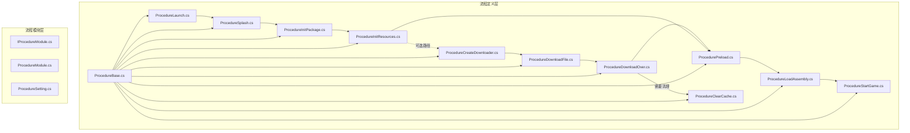
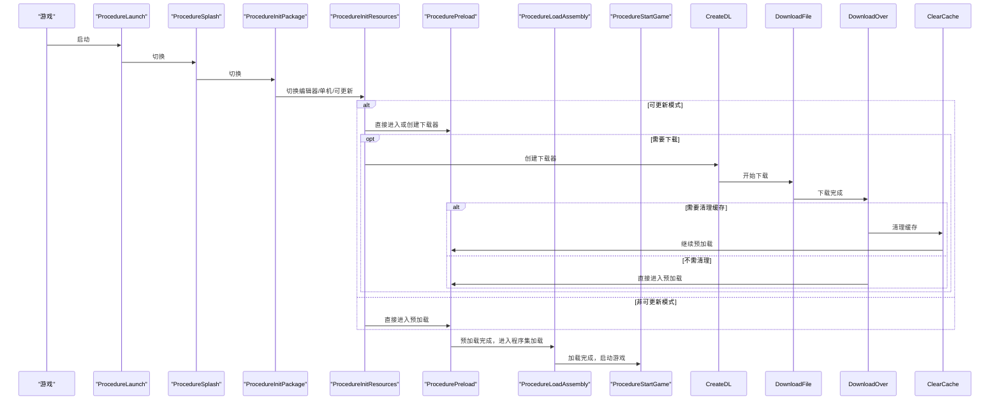
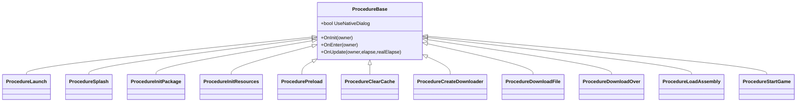

# 内置流程介绍

<cite>
**本文引用的文件**
- [ProcedureBase.cs](file://Assets/GameScripts/Procedure/ProcedureBase.cs)
- [ProcedureLaunch.cs](file://Assets/GameScripts/Procedure/ProcedureLaunch.cs)
- [ProcedureSplash.cs](file://Assets/GameScripts/Procedure/ProcedureSplash.cs)
- [ProcedureInitPackage.cs](file://Assets/GameScripts/Procedure/ProcedureInitPackage.cs)
- [ProcedureInitResources.cs](file://Assets/GameScripts/Procedure/ProcedureInitResources.cs)
- [ProcedurePreload.cs](file://Assets/GameScripts/Procedure/ProcedurePreload.cs)
- [ProcedureClearCache.cs](file://Assets/GameScripts/Procedure/ProcedureClearCache.cs)
- [ProcedureCreateDownloader.cs](file://Assets/GameScripts/Procedure/ProcedureCreateDownloader.cs)
- [ProcedureDownloadFile.cs](file://Assets/GameScripts/Procedure/ProcedureDownloadFile.cs)
- [ProcedureDownloadOver.cs](file://Assets/GameScripts/Procedure/ProcedureDownloadOver.cs)
- [ProcedureLoadAssembly.cs](file://Assets/GameScripts/Procedure/ProcedureLoadAssembly.cs)
- [ProcedureStartGame.cs](file://Assets/GameScripts/Procedure/ProcedureStartGame.cs)
- [IProcedureModule.cs](file://Assets/TEngine/Runtime/Core/ModuleSystem/ModuleInterfaces/IProcedureModule.cs)
- [ProcedureModule.cs](file://Assets/TEngine/Runtime/Core/ModuleSystem/Modules/ProcedureModule/ProcedureModule.cs)
- [ProcedureSetting.cs](file://Assets/TEngine/Runtime/Core/ModuleSystem/Modules/ProcedureModule/ProcedureSetting.cs)
</cite>

## 目录
1. [简介](#简介)
2. [项目结构](#项目结构)
3. [核心组件](#核心组件)
4. [架构总览](#架构总览)
5. [详细组件分析](#详细组件分析)
6. [依赖关系分析](#依赖关系分析)
7. [性能考量](#性能考量)
8. [故障排查指南](#故障排查指南)
9. [结论](#结论)
10. [附录](#附录)

## 简介
本文件为 TEngine 内置流程系统的权威参考文档，覆盖从启动到游戏运行的完整生命周期流程。内容包括：
- 流程职责与典型使用场景
- 参数配置要点与状态转换条件
- 异常处理机制与容错策略
- 流程间依赖关系与执行顺序
- 定制化与最佳实践建议

## 项目结构
TEngine 的流程系统位于 GameScripts/Procedure 目录，每个流程均继承自 ProcedureBase，并通过 FSM（有限状态机）在流程模块中编排执行。流程模块接口与实现位于 TEngine/Runtime/Core/ModuleSystem/Modules/ProcedureModule。

**图表来源**
- [ProcedureBase.cs:1-15](file://Assets/GameScripts/Procedure/ProcedureBase.cs#L1-L15)
- [ProcedureLaunch.cs:1-95](file://Assets/GameScripts/Procedure/ProcedureLaunch.cs#L1-L95)
- [ProcedureSplash.cs:1-23](file://Assets/GameScripts/Procedure/ProcedureSplash.cs#L1-L23)
- [ProcedureInitPackage.cs:1-120](file://Assets/GameScripts/Procedure/ProcedureInitPackage.cs#L1-L120)
- [ProcedureInitResources.cs:1-172](file://Assets/GameScripts/Procedure/ProcedureInitResources.cs#L1-L172)
- [ProcedurePreload.cs:1-175](file://Assets/GameScripts/Procedure/ProcedurePreload.cs#L1-L175)
- [ProcedureClearCache.cs:1-35](file://Assets/GameScripts/Procedure/ProcedureClearCache.cs#L1-L35)
- [ProcedureCreateDownloader.cs:1-76](file://Assets/GameScripts/Procedure/ProcedureCreateDownloader.cs#L1-L76)
- [ProcedureDownloadFile.cs:1-104](file://Assets/GameScripts/Procedure/ProcedureDownloadFile.cs#L1-L104)
- [ProcedureDownloadOver.cs:1-36](file://Assets/GameScripts/Procedure/ProcedureDownloadOver.cs#L1-L36)
- [ProcedureLoadAssembly.cs:1-294](file://Assets/GameScripts/Procedure/ProcedureLoadAssembly.cs#L1-L294)
- [ProcedureStartGame.cs:1-24](file://Assets/GameScripts/Procedure/ProcedureStartGame.cs#L1-L24)
- [IProcedureModule.cs](file://Assets/TEngine/Runtime/Core/ModuleSystem/ModuleInterfaces/IProcedureModule.cs)
- [ProcedureModule.cs](file://Assets/TEngine/Runtime/Core/ModuleSystem/Modules/ProcedureModule/ProcedureModule.cs)
- [ProcedureSetting.cs](file://Assets/TEngine/Runtime/Core/ModuleSystem/Modules/ProcedureModule/ProcedureSetting.cs)

**章节来源**
- [ProcedureBase.cs:1-15](file://Assets/GameScripts/Procedure/ProcedureBase.cs#L1-L15)
- [IProcedureModule.cs](file://Assets/TEngine/Runtime/Core/ModuleSystem/ModuleInterfaces/IProcedureModule.cs)
- [ProcedureModule.cs](file://Assets/TEngine/Runtime/Core/ModuleSystem/Modules/ProcedureModule/ProcedureModule.cs)
- [ProcedureSetting.cs](file://Assets/TEngine/Runtime/Core/ModuleSystem/Modules/ProcedureModule/ProcedureSetting.cs)

## 核心组件
- 流程基类：ProcedureBase 提供统一的抽象接口与通用能力（如 UseNativeDialog、资源模块访问），所有具体流程均继承该基类。
- 流程模块：IProcedureModule 定义流程接口契约；ProcedureModule 实现流程调度与状态机管理；ProcedureSetting 提供流程相关配置项。

关键点
- UseNativeDialog：用于控制流程是否使用原生对话框进行提示（如语言/声音初始化、错误弹窗等）。
- 资源模块：通过 ModuleSystem 获取 IResourceModule，贯穿资源初始化、下载、预加载等流程。
- UI 更新：通过 LauncherMgr 与 LoadUpdateUI/LoadTipsUI 等 UI 组件展示进度与提示信息。

**章节来源**
- [ProcedureBase.cs:1-15](file://Assets/GameScripts/Procedure/ProcedureBase.cs#L1-L15)
- [IProcedureModule.cs](file://Assets/TEngine/Runtime/Core/ModuleSystem/ModuleInterfaces/IProcedureModule.cs)
- [ProcedureModule.cs](file://Assets/TEngine/Runtime/Core/ModuleSystem/Modules/ProcedureModule/ProcedureModule.cs)
- [ProcedureSetting.cs](file://Assets/TEngine/Runtime/Core/ModuleSystem/Modules/ProcedureModule/ProcedureSetting.cs)

## 架构总览
下图展示了从启动到进入游戏的主干流程与关键分支（如在线资源更新、边玩边下载、可选更新等）：

**图表来源**
- [ProcedureLaunch.cs:1-95](file://Assets/GameScripts/Procedure/ProcedureLaunch.cs#L1-L95)
- [ProcedureSplash.cs:1-23](file://Assets/GameScripts/Procedure/ProcedureSplash.cs#L1-L23)
- [ProcedureInitPackage.cs:1-120](file://Assets/GameScripts/Procedure/ProcedureInitPackage.cs#L1-L120)
- [ProcedureInitResources.cs:1-172](file://Assets/GameScripts/Procedure/ProcedureInitResources.cs#L1-L172)
- [ProcedurePreload.cs:1-175](file://Assets/GameScripts/Procedure/ProcedurePreload.cs#L1-L175)
- [ProcedureClearCache.cs:1-35](file://Assets/GameScripts/Procedure/ProcedureClearCache.cs#L1-L35)
- [ProcedureCreateDownloader.cs:1-76](file://Assets/GameScripts/Procedure/ProcedureCreateDownloader.cs#L1-L76)
- [ProcedureDownloadFile.cs:1-104](file://Assets/GameScripts/Procedure/ProcedureDownloadFile.cs#L1-L104)
- [ProcedureDownloadOver.cs:1-36](file://Assets/GameScripts/Procedure/ProcedureDownloadOver.cs#L1-L36)
- [ProcedureLoadAssembly.cs:1-294](file://Assets/GameScripts/Procedure/ProcedureLoadAssembly.cs#L1-L294)
- [ProcedureStartGame.cs:1-24](file://Assets/GameScripts/Procedure/ProcedureStartGame.cs#L1-L24)

## 详细组件分析

### 启动流程（ProcedureLaunch）
- 职责：初始化热更新 UI、语言与声音设置，随后立即切换到闪屏流程。
- 关键行为：
  - 语言设置：读取持久化设置，若无效则回退至英语；写回持久化。
  - 声音设置：根据持久化配置设置音乐、音效、UI 音效的开关与音量。
  - UI 初始化：调用 LauncherMgr.Initialize()。
- 状态转换：OnUpdate 中直接切换到 ProcedureSplash。
- 异常处理：语言解析失败时记录错误日志，不影响流程推进。

**章节来源**
- [ProcedureLaunch.cs:1-95](file://Assets/GameScripts/Procedure/ProcedureLaunch.cs#L1-L95)

### 闪屏流程（ProcedureSplash）
- 职责：短暂展示后切换到包初始化流程。
- 状态转换：OnUpdate 中直接切换到 ProcedureInitPackage。

**章节来源**
- [ProcedureSplash.cs:1-23](file://Assets/GameScripts/Procedure/ProcedureSplash.cs#L1-L23)

### 包初始化流程（ProcedureInitPackage）
- 职责：初始化默认包，依据播放模式（编辑器模拟、单机、可更新）决定后续路径。
- 关键行为：
  - 初始化包操作完成后，根据 PlayMode 分支：
    - 编辑器模拟/单机：直接进入资源初始化。
    - 可更新：显示更新 UI，进入资源初始化。
  - 失败时弹出消息框并允许重试。
- 状态转换：成功后切换到 ProcedureInitResources；失败时弹窗重试。

**章节来源**
- [ProcedureInitPackage.cs:1-120](file://Assets/GameScripts/Procedure/ProcedureInitPackage.cs#L1-L120)

### 资源初始化流程（ProcedureInitResources）
- 职责：更新资源清单、保存包版本、判断是否需要下载或直接预加载。
- 关键行为：
  - 请求包版本、更新清单，完成后标记完成。
  - 根据 PlayMode 与 UpdatableWhilePlaying 决策：
    - Web/Host 且可边玩边下：进入预加载。
    - Host/Web：创建下载器。
    - 其他：进入预加载。
  - 错误处理：网络不可用时按更新策略（强制/可选）决定是否允许进入游戏或提示重试。
- 状态转换：根据条件切换到 ProcedureCreateDownloader 或 ProcedurePreload；失败时弹窗重试。

**章节来源**
- [ProcedureInitResources.cs:1-172](file://Assets/GameScripts/Procedure/ProcedureInitResources.cs#L1-L172)

### 预加载流程（ProcedurePreload）
- 职责：对预设资源集合进行异步预加载，展示进度，完成后进入程序集加载。
- 关键行为：
  - 支持编辑器模式跳过；支持 PRELOAD 与 WEBGL_PRELOAD 标签资源。
  - 使用回调统计加载完成数量，动态刷新 UI 百分比。
  - 当所有资源加载完成时，切换到 ProcedureLoadAssembly。
- 状态转换：全部资源加载完成后切换到 ProcedureLoadAssembly。

**章节来源**
- [ProcedurePreload.cs:1-175](file://Assets/GameScripts/Procedure/ProcedurePreload.cs#L1-L175)

### 缓存清理流程（ProcedureClearCache）
- 职责：清理未使用的缓存文件，完成后回到预加载。
- 关键行为：
  - 调用资源模块的清理接口，完成后显示“完成”提示并切换到 ProcedurePreload。
- 状态转换：清理完成后切换到 ProcedurePreload。

**章节来源**
- [ProcedureClearCache.cs:1-35](file://Assets/GameScripts/Procedure/ProcedureClearCache.cs#L1-L35)

### 下载器创建流程（ProcedureCreateDownloader）
- 职责：创建资源下载器，统计待下载文件数量与总大小，询问用户是否开始下载。
- 关键行为：
  - 创建下载器后若无文件则直接进入下载完成流程。
  - 否则弹窗提示，用户确认后进入下载文件流程。
- 状态转换：无文件则进入 ProcedureDownloadOver；有文件则进入 ProcedureDownloadFile。

**章节来源**
- [ProcedureCreateDownloader.cs:1-76](file://Assets/GameScripts/Procedure/ProcedureCreateDownloader.cs#L1-L76)

### 文件下载流程（ProcedureDownloadFile）
- 职责：执行下载任务，实时计算速度与剩余时间，更新 UI。
- 关键行为：
  - 注册下载进度与错误回调，动态刷新 UI。
  - 计算当前速度（滑动窗口平均）、剩余时间。
  - 下载完成后切换到 ProcedureDownloadOver。
- 状态转换：下载成功后切换到 ProcedureDownloadOver；失败弹窗重试。

**章节来源**
- [ProcedureDownloadFile.cs:1-104](file://Assets/GameScripts/Procedure/ProcedureDownloadFile.cs#L1-L104)

### 下载完成流程（ProcedureDownloadOver）
- 职责：保存本地版本号，根据是否需要清理缓存决定后续流程。
- 关键行为：
  - 保存 GAME_VERSION。
  - 若需要清理缓存则进入 ProcedureClearCache，否则直接进入 ProcedurePreload。
- 状态转换：根据标志位切换到 ProcedureClearCache 或 ProcedurePreload。

**章节来源**
- [ProcedureDownloadOver.cs:1-36](file://Assets/GameScripts/Procedure/ProcedureDownloadOver.cs#L1-L36)

### 程序集加载流程（ProcedureLoadAssembly）
- 职责：加载主逻辑与热更新程序集，必要时加载 AOT 元数据，最后启动游戏入口。
- 关键行为：
  - 支持 HybridCLR：按配置加载热更新 DLL 与 AOT 元数据。
  - 编辑器模拟模式下直接使用当前域程序集。
  - 校验主逻辑程序集与入口类型/方法存在性，失败时记录致命错误。
  - 加载完成后反射调用入口方法，切换到 ProcedureStartGame。
- 状态转换：加载完成后切换到 ProcedureStartGame。

**章节来源**
- [ProcedureLoadAssembly.cs:1-294](file://Assets/GameScripts/Procedure/ProcedureLoadAssembly.cs#L1-L294)

### 游戏启动流程（ProcedureStartGame）
- 职责：在下一帧隐藏所有 UI，准备进入游戏主循环。
- 关键行为：
  - 使用 UniTask.Yield 确保在下一帧执行 UI 隐藏。
- 状态转换：进入下一流程（由上层模块接管）。

**章节来源**
- [ProcedureStartGame.cs:1-24](file://Assets/GameScripts/Procedure/ProcedureStartGame.cs#L1-L24)

## 依赖关系分析
- 继承关系：各流程均继承 ProcedureBase，统一使用资源模块与 UI 管理器。
- 依赖链路：
  - 启动 → 闪屏 → 包初始化 → 资源初始化 → 预加载 → 程序集加载 → 游戏启动。
  - 资源初始化可能插入“创建下载器 → 下载文件 → 下载完成 → 预加载/缓存清理”的分支。
- 外部依赖：
  - YooAsset：包初始化、资源版本、清单更新、下载器创建与下载。
  - Launcher/LauncherMgr：UI 展示与消息弹窗。
  - HybridCLR（可选）：AOT 元数据加载与热更新程序集加载。
  - PlayerPrefs：语言、音量、版本号等持久化配置。

**图表来源**
- [ProcedureBase.cs:1-15](file://Assets/GameScripts/Procedure/ProcedureBase.cs#L1-L15)
- [ProcedureLaunch.cs:1-95](file://Assets/GameScripts/Procedure/ProcedureLaunch.cs#L1-L95)
- [ProcedureSplash.cs:1-23](file://Assets/GameScripts/Procedure/ProcedureSplash.cs#L1-L23)
- [ProcedureInitPackage.cs:1-120](file://Assets/GameScripts/Procedure/ProcedureInitPackage.cs#L1-L120)
- [ProcedureInitResources.cs:1-172](file://Assets/GameScripts/Procedure/ProcedureInitResources.cs#L1-L172)
- [ProcedurePreload.cs:1-175](file://Assets/GameScripts/Procedure/ProcedurePreload.cs#L1-L175)
- [ProcedureClearCache.cs:1-35](file://Assets/GameScripts/Procedure/ProcedureClearCache.cs#L1-L35)
- [ProcedureCreateDownloader.cs:1-76](file://Assets/GameScripts/Procedure/ProcedureCreateDownloader.cs#L1-L76)
- [ProcedureDownloadFile.cs:1-104](file://Assets/GameScripts/Procedure/ProcedureDownloadFile.cs#L1-L104)
- [ProcedureDownloadOver.cs:1-36](file://Assets/GameScripts/Procedure/ProcedureDownloadOver.cs#L1-L36)
- [ProcedureLoadAssembly.cs:1-294](file://Assets/GameScripts/Procedure/ProcedureLoadAssembly.cs#L1-L294)
- [ProcedureStartGame.cs:1-24](file://Assets/GameScripts/Procedure/ProcedureStartGame.cs#L1-L24)

**章节来源**
- [ProcedureBase.cs:1-15](file://Assets/GameScripts/Procedure/ProcedureBase.cs#L1-L15)

## 性能考量
- 预加载策略：仅在非编辑器模式下加载 PRELOAD/WEBGL_PRELOAD 资源，避免不必要的 IO。
- 下载速度平滑：采用滑动窗口计算平均速度，减少 UI 抖动。
- UI 刷新：使用渐进式进度与轻量级刷新，降低主线程压力。
- 程序集加载：在非编辑器模式下按需加载热更新 DLL，减少冷启动时间。
- 缓存清理：在下载完成后清理未使用缓存，释放存储空间。

[本节为通用指导，无需特定文件来源]

## 故障排查指南
常见问题与处理
- 包初始化失败（HTTP 404）：检查 StreamingAssets 中 PackageManifest 是否存在；流程会给出明确提示并允许重试。
- 语言设置异常：解析失败时回退为英语并保存；检查持久化键值。
- 下载失败：弹窗提示具体文件名与错误；可选择重试或退出。
- 程序集缺失：主逻辑程序集或入口方法缺失时记录致命错误；检查定义宏与 DLL 存在性。

定位要点
- 日志输出：各流程均有 Info/Error/Warning 日志，便于定位问题阶段。
- 弹窗提示：错误与重试提示通过 LauncherMgr.ShowMessageBox 展示。
- 持久化配置：语言、音量、版本号等通过 PlayerPrefs 保存。

**章节来源**
- [ProcedureInitPackage.cs:92-110](file://Assets/GameScripts/Procedure/ProcedureInitPackage.cs#L92-L110)
- [ProcedureLaunch.cs:55-81](file://Assets/GameScripts/Procedure/ProcedureLaunch.cs#L55-L81)
- [ProcedureDownloadFile.cs:66-70](file://Assets/GameScripts/Procedure/ProcedureDownloadFile.cs#L66-L70)
- [ProcedureLoadAssembly.cs:124-150](file://Assets/GameScripts/Procedure/ProcedureLoadAssembly.cs#L124-L150)

## 结论
TEngine 的内置流程系统以清晰的职责划分与稳定的执行顺序保障了从启动到游戏运行的顺畅过渡。通过可选的在线更新与缓存管理，系统兼顾了性能与用户体验。遵循本文档的配置与定制建议，可在不同发布模式下获得一致可靠的加载体验。

[本节为总结，无需特定文件来源]

## 附录

### 流程配置与定制化最佳实践
- 语言与声音
  - 语言：通过持久化键维护，解析失败回退英语；避免硬编码语言枚举。
  - 声音：基于用户偏好设置开关与音量，确保首次启动体验一致。
- 资源更新策略
  - 可选更新：在网络不可用时允许进入游戏，但需提示更新；可通过设置项调整提示策略。
  - 强制更新：网络不可用时阻断进入，直到成功更新或用户退出。
- 预加载资源
  - 使用标签区分平台资源（如 WEBGL_PRELOAD），避免在非目标平台加载。
  - 控制预加载并发与超时，防止阻塞主线程。
- 下载流程
  - 提前校验磁盘空间，避免下载失败。
  - 显示实时速度与剩余时间，提升用户感知。
- 程序集加载
  - 确保主逻辑程序集与入口方法存在；在编辑器模式下可直接使用当前域程序集。
  - AOT 元数据加载需与构建产物一致，避免运行时错误。

[本节为通用指导，无需特定文件来源]