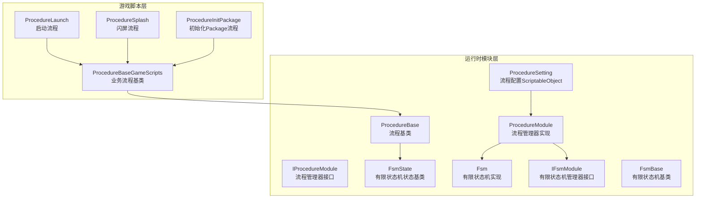
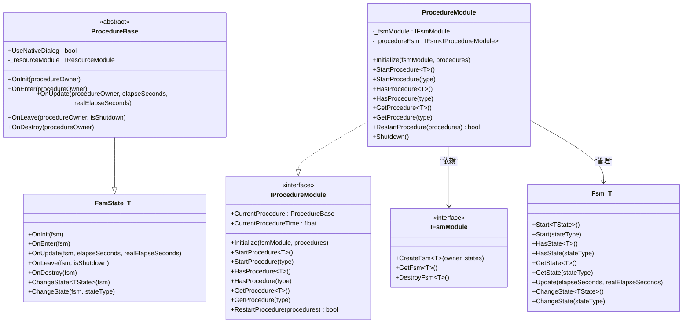
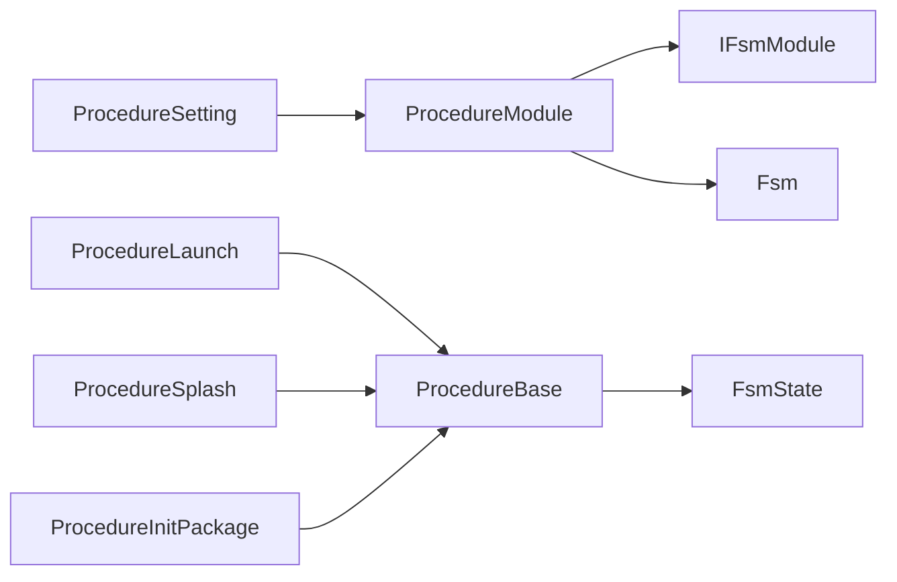
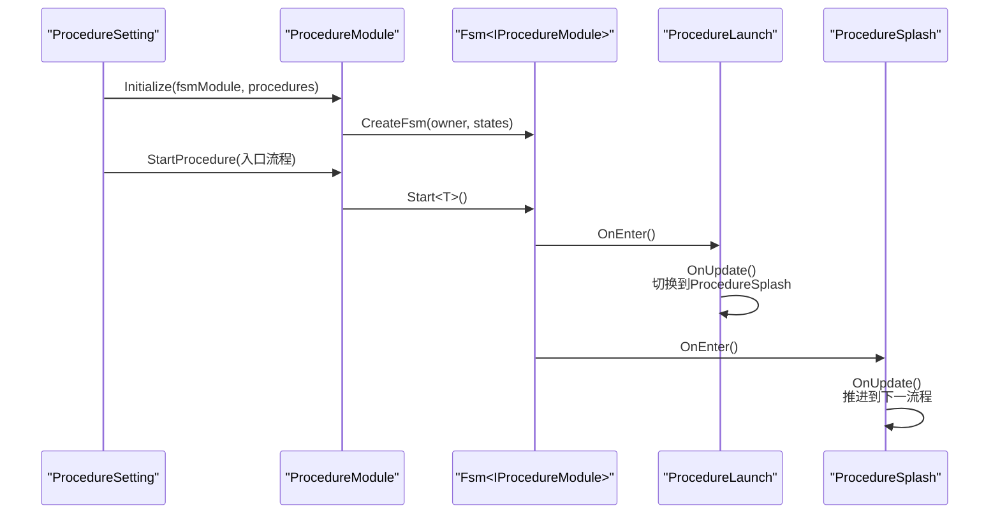

# 流程基类详解

<cite>
**本文档引用的文件**
- [ProcedureBase.cs](file://Assets/TEngine/Runtime/Module/ProcedureModule/ProcedureBase.cs)
- [IProcedureModule.cs](file://Assets/TEngine/Runtime/Module/ProcedureModule/IProcedureModule.cs)
- [ProcedureModule.cs](file://Assets/TEngine/Runtime/Module/ProcedureModule/ProcedureModule.cs)
- [ProcedureSetting.cs](file://Assets/TEngine/Runtime/Module/ProcedureModule/ProcedureSetting.cs)
- [FsmState.cs](file://Assets/TEngine/Runtime/Module/FsmModule/FsmState.cs)
- [Fsm.cs](file://Assets/TEngine/Runtime/Module/FsmModule/Fsm.cs)
- [IFsmModule.cs](file://Assets/TEngine/Runtime/Module/FsmModule/IFsmModule.cs)
- [FsmBase.cs](file://Assets/TEngine/Runtime/Module/FsmModule/FsmBase.cs)
- [ProcedureBase.cs（GameScripts）](file://Assets/GameScripts/Procedure/ProcedureBase.cs)
- [ProcedureLaunch.cs](file://Assets/GameScripts/Procedure/ProcedureLaunch.cs)
- [ProcedureSplash.cs](file://Assets/GameScripts/Procedure/ProcedureSplash.cs)
- [ProcedureInitPackage.cs](file://Assets/GameScripts/Procedure/ProcedureInitPackage.cs)
- [ProcedureSettingInspector.cs](file://Assets/TEngine/Editor/Inspector/ProcedureSettingInspector.cs)
</cite>

## 目录
1. [简介](#简介)
2. [项目结构](#项目结构)
3. [核心组件](#核心组件)
4. [架构总览](#架构总览)
5. [详细组件分析](#详细组件分析)
6. [依赖关系分析](#依赖关系分析)
7. [性能考量](#性能考量)
8. [故障排查指南](#故障排查指南)
9. [结论](#结论)
10. [附录](#附录)

## 简介
本文件面向TEngine流程基类系统，围绕ProcedureBase抽象类与流程管理模块展开，系统性阐述以下主题：
- ProcedureBase抽象类的设计理念与生命周期回调方法（OnInit、OnEnter、OnUpdate、OnLeave、OnDestroy）的职责与调用时机
- 流程持有者（ProcedureOwner）的概念与作用机制
- 流程参数传递与状态管理的实现方式
- 流程基类的继承规范与扩展指南
- 常见问题排查与调试技巧
- 如何正确使用流程基类进行功能开发

## 项目结构
TEngine的流程系统由“运行时模块层”和“游戏脚本层”共同构成：
- 运行时模块层（TEngine.Runtime）：定义流程基类、流程管理器接口与实现、有限状态机基类与实现等
- 游戏脚本层（GameScripts）：基于流程基类实现具体业务流程（如启动、闪屏、资源初始化等）

图表来源
- [ProcedureBase.cs:1-59](file://Assets/TEngine/Runtime/Module/ProcedureModule/ProcedureBase.cs#L1-L59)
- [IProcedureModule.cs:1-83](file://Assets/TEngine/Runtime/Module/ProcedureModule/IProcedureModule.cs#L1-L83)
- [ProcedureModule.cs:1-209](file://Assets/TEngine/Runtime/Module/ProcedureModule/ProcedureModule.cs#L1-L209)
- [FsmState.cs:1-104](file://Assets/TEngine/Runtime/Module/FsmModule/FsmState.cs#L1-L104)
- [Fsm.cs:43-506](file://Assets/TEngine/Runtime/Module/FsmModule/Fsm.cs#L43-L506)
- [IFsmModule.cs:1-159](file://Assets/TEngine/Runtime/Module/FsmModule/IFsmModule.cs#L1-L159)
- [FsmBase.cs:1-58](file://Assets/TEngine/Runtime/Module/FsmModule/FsmBase.cs#L1-L58)
- [ProcedureSetting.cs:1-104](file://Assets/TEngine/Runtime/Module/ProcedureModule/ProcedureSetting.cs#L1-L104)
- [ProcedureBase.cs（GameScripts）:1-15](file://Assets/GameScripts/Procedure/ProcedureBase.cs#L1-L15)
- [ProcedureLaunch.cs:1-95](file://Assets/GameScripts/Procedure/ProcedureLaunch.cs#L1-L95)
- [ProcedureSplash.cs:1-23](file://Assets/GameScripts/Procedure/ProcedureSplash.cs#L1-L23)
- [ProcedureInitPackage.cs:1-120](file://Assets/GameScripts/Procedure/ProcedureInitPackage.cs#L1-L120)

章节来源
- [ProcedureBase.cs:1-59](file://Assets/TEngine/Runtime/Module/ProcedureModule/ProcedureBase.cs#L1-L59)
- [ProcedureModule.cs:1-209](file://Assets/TEngine/Runtime/Module/ProcedureModule/ProcedureModule.cs#L1-L209)
- [ProcedureSetting.cs:1-104](file://Assets/TEngine/Runtime/Module/ProcedureModule/ProcedureSetting.cs#L1-L104)
- [ProcedureBase.cs（GameScripts）:1-15](file://Assets/GameScripts/Procedure/ProcedureBase.cs#L1-L15)

## 核心组件
- 流程基类（ProcedureBase）
  - 继承自FsmState<IProcedureModule>，提供流程生命周期回调方法
  - 提供抽象属性UseNativeDialog用于控制是否使用原生对话框
  - 内置对资源模块的访问（通过ModuleSystem获取）
- 流程管理器接口（IProcedureModule）
  - 定义流程管理器能力：获取当前流程、当前流程持续时间、初始化、启动流程、查询流程、重启流程等
- 流程管理器实现（ProcedureModule）
  - 基于IFsmModule创建并管理IFsm<IProcedureModule>，封装流程切换与状态查询
- 有限状态机相关
  - FsmState<T>：有限状态机状态基类，定义OnInit/OnEnter/OnUpdate/OnLeave/OnDestroy
  - Fsm<T>：有限状态机实现，负责状态切换、轮询、状态计时
  - IFsmModule：有限状态机管理器接口
  - FsmBase：有限状态机基类
- 流程配置（ProcedureSetting）
  - 通过ScriptableObject配置可用流程类型与入口流程，异步初始化并启动流程

章节来源
- [ProcedureBase.cs:1-59](file://Assets/TEngine/Runtime/Module/ProcedureModule/ProcedureBase.cs#L1-L59)
- [IProcedureModule.cs:1-83](file://Assets/TEngine/Runtime/Module/ProcedureModule/IProcedureModule.cs#L1-L83)
- [ProcedureModule.cs:1-209](file://Assets/TEngine/Runtime/Module/ProcedureModule/ProcedureModule.cs#L1-L209)
- [FsmState.cs:1-104](file://Assets/TEngine/Runtime/Module/FsmModule/FsmState.cs#L1-L104)
- [Fsm.cs:43-506](file://Assets/TEngine/Runtime/Module/FsmModule/Fsm.cs#L43-L506)
- [IFsmModule.cs:1-159](file://Assets/TEngine/Runtime/Module/FsmModule/IFsmModule.cs#L1-L159)
- [FsmBase.cs:1-58](file://Assets/TEngine/Runtime/Module/FsmModule/FsmBase.cs#L1-L58)
- [ProcedureSetting.cs:1-104](file://Assets/TEngine/Runtime/Module/ProcedureModule/ProcedureSetting.cs#L1-L104)

## 架构总览
流程系统采用“流程基类 + 有限状态机 + 流程管理器”的分层设计。流程基类复用有限状态机的状态生命周期，流程管理器负责创建、启动、切换流程。

图表来源
- [ProcedureBase.cs:1-59](file://Assets/TEngine/Runtime/Module/ProcedureModule/ProcedureBase.cs#L1-L59)
- [IProcedureModule.cs:1-83](file://Assets/TEngine/Runtime/Module/ProcedureModule/IProcedureModule.cs#L1-L83)
- [ProcedureModule.cs:1-209](file://Assets/TEngine/Runtime/Module/ProcedureModule/ProcedureModule.cs#L1-L209)
- [FsmState.cs:1-104](file://Assets/TEngine/Runtime/Module/FsmModule/FsmState.cs#L1-L104)
- [Fsm.cs:43-506](file://Assets/TEngine/Runtime/Module/FsmModule/Fsm.cs#L43-L506)
- [IFsmModule.cs:1-159](file://Assets/TEngine/Runtime/Module/FsmModule/IFsmModule.cs#L1-L159)

## 详细组件分析

### 生命周期回调方法详解
- OnInit(procedureOwner)
  - 触发时机：流程被注册到有限状态机并初始化时
  - 用途：执行一次性初始化逻辑（如模块获取、事件订阅等）
- OnEnter(procedureOwner)
  - 触发时机：流程进入成为当前状态时
  - 用途：执行进入逻辑（如UI显示、资源加载准备、状态重置等）
- OnUpdate(procedureOwner, elapseSeconds, realElapseSeconds)
  - 触发时机：流程处于当前状态时每帧轮询
  - 用途：处理流程逻辑推进、条件判断、状态切换
- OnLeave(procedureOwner, isShutdown)
  - 触发时机：流程即将离开当前状态（含正常切换与状态机关闭）
  - 用途：执行离开前的清理逻辑
- OnDestroy(procedureOwner)
  - 触发时机：流程被销毁时
  - 用途：释放资源、取消订阅、内存回收

章节来源
- [ProcedureBase.cs:10-56](file://Assets/TEngine/Runtime/Module/ProcedureModule/ProcedureBase.cs#L10-L56)
- [FsmState.cs:18-58](file://Assets/TEngine/Runtime/Module/FsmModule/FsmState.cs#L18-L58)

### 流程持有者（ProcedureOwner）概念与机制
- 流程持有者类型别名为IFsm<IProcedureModule>，即流程的“父容器”
- 持有者在流程生命周期中作为参数传入，便于流程内部通过持有者进行状态切换、查询当前状态等
- 流程内部可通过ChangeState方法切换到下一个流程，或通过持有者提供的能力进行跨流程交互

章节来源
- [ProcedureBase.cs:1-17](file://Assets/TEngine/Runtime/Module/ProcedureModule/ProcedureBase.cs#L1-L17)
- [FsmState.cs:62-101](file://Assets/TEngine/Runtime/Module/FsmModule/FsmState.cs#L62-L101)
- [Fsm.cs:474-503](file://Assets/TEngine/Runtime/Module/FsmModule/Fsm.cs#L474-L503)

### 流程参数传递与状态管理
- 参数传递
  - 流程间参数传递通过有限状态机的数据容器实现（Fsm<T>内部维护数据映射），可在状态切换时携带数据
  - 通过IFsmModule提供的CreateFsm接口可传入初始数据
- 状态管理
  - 当前流程与持续时间：通过IProcedureModule的CurrentProcedure与CurrentProcedureTime暴露
  - 流程切换：通过FsmState.ChangeState或Fsm.ChangeState实现
  - 流程重启：通过ProcedureModule.RestartProcedure重建流程状态机并从入口流程重新启动

章节来源
- [FsmBase.cs:1-58](file://Assets/TEngine/Runtime/Module/FsmModule/FsmBase.cs#L1-L58)
- [Fsm.cs:43-94](file://Assets/TEngine/Runtime/Module/FsmModule/Fsm.cs#L43-L94)
- [IProcedureModule.cs:1-83](file://Assets/TEngine/Runtime/Module/ProcedureModule/IProcedureModule.cs#L1-L83)
- [ProcedureModule.cs:44-82](file://Assets/TEngine/Runtime/Module/ProcedureModule/ProcedureModule.cs#L44-L82)

### 流程配置与启动流程
- 配置文件（ProcedureSetting）
  - 通过ScriptableObject声明可用流程类型数组与入口流程类型名
  - 异步初始化流程管理器，创建流程实例，校验入口流程有效性后启动
- 启动流程
  - 通过IProcedureModule.StartProcedure<T>()或StartProcedure(Type)启动指定流程
  - 流程管理器内部委托给IFsmModule.CreateFsm与Fsm.Start

章节来源
- [ProcedureSetting.cs:1-104](file://Assets/TEngine/Runtime/Module/ProcedureModule/ProcedureSetting.cs#L1-L104)
- [IProcedureModule.cs:33-43](file://Assets/TEngine/Runtime/Module/ProcedureModule/IProcedureModule.cs#L33-L43)
- [ProcedureModule.cs:86-123](file://Assets/TEngine/Runtime/Module/ProcedureModule/ProcedureModule.cs#L86-L123)

### 具体流程示例与最佳实践
- 启动流程（ProcedureLaunch）
  - 在OnEnter中初始化UI与本地化、声音等配置
  - 在OnUpdate中立即切换到闪屏流程，体现“单帧切换”的典型用法
- 闪屏流程（ProcedureSplash）
  - 在OnUpdate中切换到资源初始化流程，演示最小化逻辑推进
- 初始化Package流程（ProcedureInitPackage）
  - 使用异步任务初始化资源包，根据播放模式切换后续流程
  - 失败时弹出启动UI并提供重试机制，展示错误处理与用户交互

章节来源
- [ProcedureLaunch.cs:1-95](file://Assets/GameScripts/Procedure/ProcedureLaunch.cs#L1-L95)
- [ProcedureSplash.cs:1-23](file://Assets/GameScripts/Procedure/ProcedureSplash.cs#L1-L23)
- [ProcedureInitPackage.cs:1-120](file://Assets/GameScripts/Procedure/ProcedureInitPackage.cs#L1-L120)

### 继承规范与扩展指南
- 继承ProcedureBase并实现抽象成员UseNativeDialog
- 在OnEnter中完成一次性初始化；在OnUpdate中推进流程逻辑；在OnLeave中清理；在OnDestroy中释放资源
- 使用ChangeState进行流程切换，避免直接修改内部状态
- 通过ModuleSystem获取所需模块（如资源、音频、本地化等）
- 在ProcedureSetting中注册流程类型与入口流程，确保启动顺序正确

章节来源
- [ProcedureBase.cs（GameScripts）:1-15](file://Assets/GameScripts/Procedure/ProcedureBase.cs#L1-L15)
- [ProcedureBase.cs:1-59](file://Assets/TEngine/Runtime/Module/ProcedureModule/ProcedureBase.cs#L1-L59)
- [ProcedureSetting.cs:68-102](file://Assets/TEngine/Runtime/Module/ProcedureModule/ProcedureSetting.cs#L68-L102)

## 依赖关系分析
流程系统的关键依赖链路如下：
- 流程基类依赖有限状态机状态基类
- 流程管理器依赖有限状态机管理器与有限状态机实现
- 流程配置依赖流程管理器与模块系统
- 具体流程依赖流程基类与模块系统

图表来源
- [ProcedureBase.cs:1-59](file://Assets/TEngine/Runtime/Module/ProcedureModule/ProcedureBase.cs#L1-L59)
- [ProcedureModule.cs:1-209](file://Assets/TEngine/Runtime/Module/ProcedureModule/ProcedureModule.cs#L1-L209)
- [ProcedureSetting.cs:1-104](file://Assets/TEngine/Runtime/Module/ProcedureModule/ProcedureSetting.cs#L1-L104)
- [FsmState.cs:1-104](file://Assets/TEngine/Runtime/Module/FsmModule/FsmState.cs#L1-L104)
- [Fsm.cs:43-506](file://Assets/TEngine/Runtime/Module/FsmModule/Fsm.cs#L43-L506)
- [IFsmModule.cs:1-159](file://Assets/TEngine/Runtime/Module/FsmModule/IFsmModule.cs#L1-L159)
- [ProcedureLaunch.cs:1-95](file://Assets/GameScripts/Procedure/ProcedureLaunch.cs#L1-L95)
- [ProcedureSplash.cs:1-23](file://Assets/GameScripts/Procedure/ProcedureSplash.cs#L1-L23)
- [ProcedureInitPackage.cs:1-120](file://Assets/GameScripts/Procedure/ProcedureInitPackage.cs#L1-L120)

## 性能考量
- 流程切换应尽量轻量化，避免在OnUpdate中执行阻塞逻辑
- 使用异步任务（如UniTask）处理耗时操作，避免卡顿
- 合理利用CurrentProcedureTime统计流程耗时，便于性能监控
- 避免频繁创建/销毁流程对象，必要时通过RestartProcedure统一重建

## 故障排查指南
- 启动失败
  - 现象：流程管理器无效或入口流程无效
  - 排查：检查ProcedureSetting中的入口流程类型名是否正确，确认流程类型存在于可用列表
- 类型解析失败
  - 现象：无法找到流程类型或无法创建实例
  - 排查：确认程序集可见性与类型全名一致，检查流程类型是否正确继承ProcedureBase
- 状态机未初始化
  - 现象：查询当前流程或当前流程持续时间抛出异常
  - 排查：确认先调用Initialize再调用StartProcedure
- 切换异常
  - 现象：切换目标状态不存在或FSM无效
  - 排查：确认目标流程已注册到有限状态机，检查ChangeState调用参数

章节来源
- [ProcedureSetting.cs:55-102](file://Assets/TEngine/Runtime/Module/ProcedureModule/ProcedureSetting.cs#L55-L102)
- [ProcedureModule.cs:86-123](file://Assets/TEngine/Runtime/Module/ProcedureModule/ProcedureModule.cs#L86-L123)
- [Fsm.cs:474-503](file://Assets/TEngine/Runtime/Module/FsmModule/Fsm.cs#L474-L503)

## 结论
TEngine流程基类系统以有限状态机为核心，结合流程管理器与配置文件，提供了清晰、可扩展的流程编排能力。开发者只需遵循生命周期回调规范与继承约定，即可快速构建复杂的游戏流程序列，并通过配置文件灵活管理流程启动与切换。

## 附录

### 流程切换时序图（从启动到闪屏）

图表来源
- [ProcedureSetting.cs:55-102](file://Assets/TEngine/Runtime/Module/ProcedureModule/ProcedureSetting.cs#L55-L102)
- [ProcedureModule.cs:86-123](file://Assets/TEngine/Runtime/Module/ProcedureModule/ProcedureModule.cs#L86-L123)
- [Fsm.cs:182-210](file://Assets/TEngine/Runtime/Module/FsmModule/Fsm.cs#L182-L210)
- [ProcedureLaunch.cs:23-43](file://Assets/GameScripts/Procedure/ProcedureLaunch.cs#L23-L43)
- [ProcedureSplash.cs:13-20](file://Assets/GameScripts/Procedure/ProcedureSplash.cs#L13-L20)