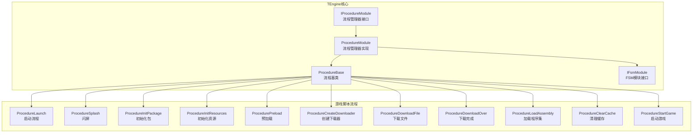
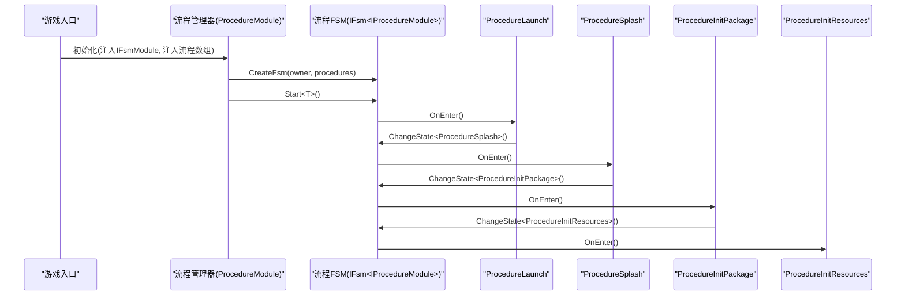
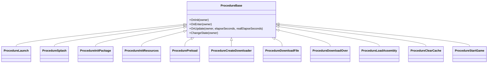
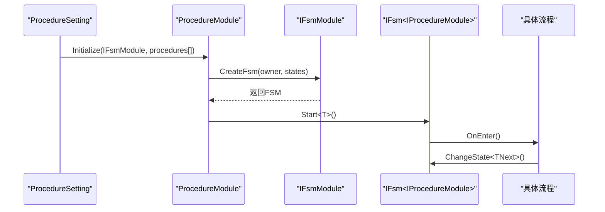
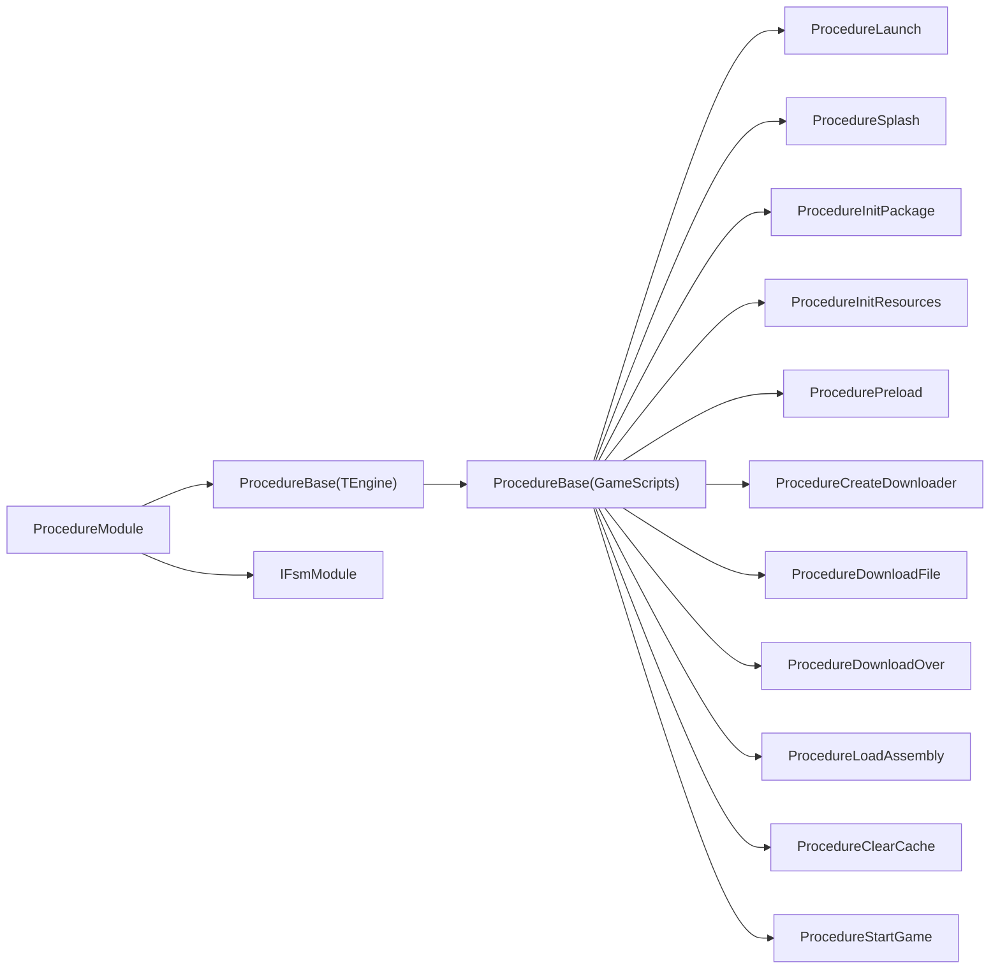

# 流程管理

<cite>
**本文引用的文件**   
- [ProcedureBase.cs](file://Assets/TEngine/Runtime/Module/ProcedureModule/ProcedureBase.cs)
- [IProcedureModule.cs](file://Assets/TEngine/Runtime/Module/ProcedureModule/IProcedureModule.cs)
- [ProcedureModule.cs](file://Assets/TEngine/Runtime/Module/ProcedureModule/ProcedureModule.cs)
- [ProcedureBase.cs](file://Assets/GameScripts/Procedure/ProcedureBase.cs)
- [ProcedureLaunch.cs](file://Assets/GameScripts/Procedure/ProcedureLaunch.cs)
- [ProcedureSplash.cs](file://Assets/GameScripts/Procedure/ProcedureSplash.cs)
- [ProcedureInitPackage.cs](file://Assets/GameScripts/Procedure/ProcedureInitPackage.cs)
- [ProcedureInitResources.cs](file://Assets/GameScripts/Procedure/ProcedureInitResources.cs)
- [ProcedurePreload.cs](file://Assets/GameScripts/Procedure/ProcedurePreload.cs)
- [ProcedureCreateDownloader.cs](file://Assets/GameScripts/Procedure/ProcedureCreateDownloader.cs)
- [ProcedureDownloadFile.cs](file://Assets/GameScripts/Procedure/ProcedureDownloadFile.cs)
- [ProcedureDownloadOver.cs](file://Assets/GameScripts/Procedure/ProcedureDownloadOver.cs)
- [ProcedureLoadAssembly.cs](file://Assets/GameScripts/Procedure/ProcedureLoadAssembly.cs)
- [ProcedureClearCache.cs](file://Assets/GameScripts/Procedure/ProcedureClearCache.cs)
- [ProcedureStartGame.cs](file://Assets/GameScripts/Procedure/ProcedureStartGame.cs)
- [IFsmModule.cs](file://Assets/TEngine/Runtime/Module/FsmModule/IFsmModule.cs)
- [ProcedureSetting.cs](file://Assets/TEngine/Runtime/Module/ProcedureModule/ProcedureSetting.cs)
</cite>

## 目录
1. [简介](#简介)
2. [项目结构](#项目结构)
3. [核心组件](#核心组件)
4. [架构总览](#架构总览)
5. [详细组件分析](#详细组件分析)
6. [依赖关系分析](#依赖关系分析)
7. [性能考量](#性能考量)
8. [故障排查指南](#故障排查指南)
9. [结论](#结论)
10. [附录](#附录)

## 简介
本文件面向TEngine流程管理系统，系统化阐述基于FSM（有限状态机）的流程设计理念与实现原理，详解ProcedureBase基类的接口与生命周期，梳理内置流程链路（启动、资源初始化、预加载、热更新下载、装配加载、游戏启动等），并提供自定义流程开发指南、与模块系统的集成方式、调试技巧与性能优化建议。

## 项目结构
TEngine将“流程”抽象为FSM中的状态，由流程管理器统一调度；业务侧通过继承流程基类实现具体流程步骤，形成完整的启动与运行流程。

图示来源
- [ProcedureBase.cs:1-38](file://Assets/TEngine/Runtime/Module/ProcedureModule/ProcedureBase.cs#L1-L38)
- [IProcedureModule.cs:1-82](file://Assets/TEngine/Runtime/Module/ProcedureModule/IProcedureModule.cs#L1-L82)
- [ProcedureModule.cs:1-209](file://Assets/TEngine/Runtime/Module/ProcedureModule/ProcedureModule.cs#L1-L209)
- [ProcedureBase.cs:1-15](file://Assets/GameScripts/Procedure/ProcedureBase.cs#L1-L15)
- [ProcedureLaunch.cs:1-95](file://Assets/GameScripts/Procedure/ProcedureLaunch.cs#L1-L95)
- [ProcedureSplash.cs:1-23](file://Assets/GameScripts/Procedure/ProcedureSplash.cs#L1-L23)
- [ProcedureInitPackage.cs:1-120](file://Assets/GameScripts/Procedure/ProcedureInitPackage.cs#L1-L120)
- [ProcedureInitResources.cs:1-172](file://Assets/GameScripts/Procedure/ProcedureInitResources.cs#L1-L172)
- [ProcedurePreload.cs:1-175](file://Assets/GameScripts/Procedure/ProcedurePreload.cs#L1-L175)
- [ProcedureCreateDownloader.cs:1-76](file://Assets/GameScripts/Procedure/ProcedureCreateDownloader.cs#L1-L76)
- [ProcedureDownloadFile.cs:1-104](file://Assets/GameScripts/Procedure/ProcedureDownloadFile.cs#L1-L104)
- [ProcedureDownloadOver.cs:1-36](file://Assets/GameScripts/Procedure/ProcedureDownloadOver.cs#L1-L36)
- [ProcedureLoadAssembly.cs:1-294](file://Assets/GameScripts/Procedure/ProcedureLoadAssembly.cs#L1-L294)
- [ProcedureClearCache.cs:1-35](file://Assets/GameScripts/Procedure/ProcedureClearCache.cs#L1-L35)
- [ProcedureStartGame.cs:1-24](file://Assets/GameScripts/Procedure/ProcedureStartGame.cs#L1-L24)
- [IFsmModule.cs:40-159](file://Assets/TEngine/Runtime/Module/FsmModule/IFsmModule.cs#L40-L159)

章节来源
- [ProcedureBase.cs:1-38](file://Assets/TEngine/Runtime/Module/ProcedureModule/ProcedureBase.cs#L1-L38)
- [IProcedureModule.cs:1-82](file://Assets/TEngine/Runtime/Module/ProcedureModule/IProcedureModule.cs#L1-L82)
- [ProcedureModule.cs:1-209](file://Assets/TEngine/Runtime/Module/ProcedureModule/ProcedureModule.cs#L1-L209)

## 核心组件
- 流程基类与生命周期
  - 抽象基类提供OnInit/OnEnter/OnUpdate三阶段钩子，子类按需覆盖。
  - 子类通过ChangeState<...>(owner)在同FSM内进行状态切换。
- 流程管理器
  - IProcedureModule定义查询、启动、重启流程等能力。
  - ProcedureModule内部持有IFsmModule与IFsm<IProcedureModule>，负责创建、启动、查询流程。
- FSMM模块
  - IFsmModule提供创建/销毁FSM、获取FSM等能力，流程管理器依赖其创建流程FSM。

章节来源
- [ProcedureBase.cs:1-38](file://Assets/TEngine/Runtime/Module/ProcedureModule/ProcedureBase.cs#L1-L38)
- [IProcedureModule.cs:1-82](file://Assets/TEngine/Runtime/Module/ProcedureModule/IProcedureModule.cs#L1-L82)
- [ProcedureModule.cs:1-209](file://Assets/TEngine/Runtime/Module/ProcedureModule/ProcedureModule.cs#L1-L209)
- [IFsmModule.cs:40-159](file://Assets/TEngine/Runtime/Module/FsmModule/IFsmModule.cs#L40-L159)

## 架构总览
流程系统以FSM为核心，流程管理器作为持有者，驱动各流程状态的生命周期与切换；资源模块贯穿资源初始化、清单更新、预加载、热更新下载与装配加载。

图示来源
- [ProcedureModule.cs:80-123](file://Assets/TEngine/Runtime/Module/ProcedureModule/ProcedureModule.cs#L80-L123)
- [ProcedureLaunch.cs:23-43](file://Assets/GameScripts/Procedure/ProcedureLaunch.cs#L23-L43)
- [ProcedureSplash.cs:13-20](file://Assets/GameScripts/Procedure/ProcedureSplash.cs#L13-L20)
- [ProcedureInitPackage.cs:31-90](file://Assets/GameScripts/Procedure/ProcedureInitPackage.cs#L31-L90)
- [ProcedureInitResources.cs:18-30](file://Assets/GameScripts/Procedure/ProcedureInitResources.cs#L18-L30)

## 详细组件分析

### 流程基类与接口规范
- 生命周期钩子
  - OnInit：流程首次初始化时调用，适合做一次性准备。
  - OnEnter：进入流程时调用，适合开启异步任务或显示UI。
  - OnUpdate：每帧调用，适合轮询状态、进度刷新、条件满足后切换下一状态。
- 状态切换
  - 通过ChangeState<T>(owner)在同FSM内切换，避免跨模块耦合。
- 接口职责
  - IProcedureModule提供启动、查询、重启流程的能力，便于上层统一调度。

图示来源
- [ProcedureBase.cs:1-38](file://Assets/TEngine/Runtime/Module/ProcedureModule/ProcedureBase.cs#L1-L38)
- [ProcedureBase.cs:1-15](file://Assets/GameScripts/Procedure/ProcedureBase.cs#L1-L15)
- [ProcedureLaunch.cs:1-95](file://Assets/GameScripts/Procedure/ProcedureLaunch.cs#L1-L95)
- [ProcedureSplash.cs:1-23](file://Assets/GameScripts/Procedure/ProcedureSplash.cs#L1-L23)
- [ProcedureInitPackage.cs:1-120](file://Assets/GameScripts/Procedure/ProcedureInitPackage.cs#L1-L120)
- [ProcedureInitResources.cs:1-172](file://Assets/GameScripts/Procedure/ProcedureInitResources.cs#L1-L172)
- [ProcedurePreload.cs:1-175](file://Assets/GameScripts/Procedure/ProcedurePreload.cs#L1-L175)
- [ProcedureCreateDownloader.cs:1-76](file://Assets/GameScripts/Procedure/ProcedureCreateDownloader.cs#L1-L76)
- [ProcedureDownloadFile.cs:1-104](file://Assets/GameScripts/Procedure/ProcedureDownloadFile.cs#L1-L104)
- [ProcedureDownloadOver.cs:1-36](file://Assets/GameScripts/Procedure/ProcedureDownloadOver.cs#L1-L36)
- [ProcedureLoadAssembly.cs:1-294](file://Assets/GameScripts/Procedure/ProcedureLoadAssembly.cs#L1-L294)
- [ProcedureClearCache.cs:1-35](file://Assets/GameScripts/Procedure/ProcedureClearCache.cs#L1-L35)
- [ProcedureStartGame.cs:1-24](file://Assets/GameScripts/Procedure/ProcedureStartGame.cs#L1-L24)

章节来源
- [ProcedureBase.cs:1-38](file://Assets/TEngine/Runtime/Module/ProcedureModule/ProcedureBase.cs#L1-L38)
- [IProcedureModule.cs:1-82](file://Assets/TEngine/Runtime/Module/ProcedureModule/IProcedureModule.cs#L1-L82)

### 内置流程链路详解

#### 启动流程（ProcedureLaunch）
- 职责：初始化音频、语言、声音设置，随后切换到闪屏流程。
- 关键点：使用模块系统获取音频模块；语言设置从本地存储读取并回写；声音开关与音量来自本地设置。

章节来源
- [ProcedureLaunch.cs:1-95](file://Assets/GameScripts/Procedure/ProcedureLaunch.cs#L1-L95)

#### 闪屏流程（ProcedureSplash）
- 职责：播放闪屏动画后，立即切换到初始化包流程。

章节来源
- [ProcedureSplash.cs:1-23](file://Assets/GameScripts/Procedure/ProcedureSplash.cs#L1-L23)

#### 初始化包流程（ProcedureInitPackage）
- 职责：初始化默认包，根据播放模式（编辑器模拟/离线/可更新）决定后续流程。
- 异常处理：初始化失败时弹出消息框并允许重试。

章节来源
- [ProcedureInitPackage.cs:1-120](file://Assets/GameScripts/Procedure/ProcedureInitPackage.cs#L1-L120)

#### 初始化资源流程（ProcedureInitResources）
- 职责：更新包版本、更新清单、根据模式选择进入预加载或下载器流程。
- 错误处理：网络不可用时根据更新策略决定是否允许进入游戏或提示重试。

章节来源
- [ProcedureInitResources.cs:1-172](file://Assets/GameScripts/Procedure/ProcedureInitResources.cs#L1-L172)

#### 预加载流程（ProcedurePreload）
- 职责：加载预设资源（含WebGL特定资源），平滑进度展示，完成后进入装配加载流程。
- 回调：预加载成功/失败均标记完成，确保流程推进。

章节来源
- [ProcedurePreload.cs:1-175](file://Assets/GameScripts/Procedure/ProcedurePreload.cs#L1-L175)

#### 创建下载器流程（ProcedureCreateDownloader）
- 职责：创建资源下载器，若无待更新文件则直接进入下载完成流程；否则弹窗确认后进入下载文件流程。

章节来源
- [ProcedureCreateDownloader.cs:1-76](file://Assets/GameScripts/Procedure/ProcedureCreateDownloader.cs#L1-L76)

#### 下载文件流程（ProcedureDownloadFile）
- 职责：注册下载回调，实时显示进度、速度与剩余时间，完成后进入下载完成流程。
- 速度计算：采用滑动窗口计算平均速度，避免瞬时波动。

章节来源
- [ProcedureDownloadFile.cs:1-104](file://Assets/GameScripts/Procedure/ProcedureDownloadFile.cs#L1-L104)

#### 下载完成流程（ProcedureDownloadOver）
- 职责：保存本地版本号；根据是否需要清理缓存决定进入清理缓存或预加载流程。

章节来源
- [ProcedureDownloadOver.cs:1-36](file://Assets/GameScripts/Procedure/ProcedureDownloadOver.cs#L1-L36)

#### 加载程序集流程（ProcedureLoadAssembly）
- 职责：加载主逻辑与热更新程序集，必要时加载AOT元数据；完成后反射调用入口方法，进入启动游戏流程。
- 条件分支：根据设置与播放模式决定是否加载热更新DLL及AOT元数据。

章节来源
- [ProcedureLoadAssembly.cs:1-294](file://Assets/GameScripts/Procedure/ProcedureLoadAssembly.cs#L1-L294)

#### 清理缓存流程（ProcedureClearCache）
- 职责：清理未使用的缓存文件，完成后回到预加载流程。

章节来源
- [ProcedureClearCache.cs:1-35](file://Assets/GameScripts/Procedure/ProcedureClearCache.cs#L1-L35)

#### 启动游戏流程（ProcedureStartGame）
- 职责：隐藏启动UI，准备进入游戏主循环。

章节来源
- [ProcedureStartGame.cs:1-24](file://Assets/GameScripts/Procedure/ProcedureStartGame.cs#L1-L24)

### 自定义流程开发指南
- 继承与实现
  - 继承ProcedureBase，至少实现一个或多个生命周期钩子。
  - 在需要时重写OnInit/OnEnter/OnUpdate，确保在OnEnter中启动异步任务并在条件满足时调用ChangeState切换。
- 参数与上下文
  - 通过模块系统获取所需模块（如资源模块），在流程间共享状态可通过模块或全局单例。
- 状态转换
  - 使用ChangeState<T>(owner)进行同FSM内的状态切换，避免跨模块直接调用。
- 错误处理
  - 对外展示友好提示，提供重试或退出路径；对关键异常记录日志并引导修复。
- 生命周期管理
  - 在OnEnter中开启任务，在OnUpdate中轮询完成条件；在流程结束时不再重复推进。

章节来源
- [ProcedureBase.cs:1-15](file://Assets/GameScripts/Procedure/ProcedureBase.cs#L1-L15)
- [ProcedureLaunch.cs:17-43](file://Assets/GameScripts/Procedure/ProcedureLaunch.cs#L17-L43)
- [ProcedureInitResources.cs:37-66](file://Assets/GameScripts/Procedure/ProcedureInitResources.cs#L37-L66)
- [ProcedurePreload.cs:54-100](file://Assets/GameScripts/Procedure/ProcedurePreload.cs#L54-L100)
- [ProcedureLoadAssembly.cs:110-122](file://Assets/GameScripts/Procedure/ProcedureLoadAssembly.cs#L110-L122)

### 流程系统与模块系统的集成
- 模块系统
  - 通过ModuleSystem.GetModule<T>()获取模块（如IResourceModule），在流程中统一访问资源、本地化、音频等能力。
- 流程管理器
  - 由ProcedureModule持有IFsmModule与IFsm<IProcedureModule>，负责创建、启动、查询流程。
- 设置与发现
  - 通过ProcedureSetting动态构造流程实例列表，保证流程可配置与可扩展。

图示来源
- [ProcedureSetting.cs:55-84](file://Assets/TEngine/Runtime/Module/ProcedureModule/ProcedureSetting.cs#L55-L84)
- [ProcedureModule.cs:80-123](file://Assets/TEngine/Runtime/Module/ProcedureModule/ProcedureModule.cs#L80-L123)
- [IFsmModule.cs:92-127](file://Assets/TEngine/Runtime/Module/FsmModule/IFsmModule.cs#L92-L127)

章节来源
- [ProcedureSetting.cs:55-84](file://Assets/TEngine/Runtime/Module/ProcedureModule/ProcedureSetting.cs#L55-L84)
- [ProcedureModule.cs:80-123](file://Assets/TEngine/Runtime/Module/ProcedureModule/ProcedureModule.cs#L80-L123)

## 依赖关系分析
- 流程基类依赖FSM状态基类，提供生命周期钩子。
- 流程管理器依赖FSM模块接口，用于创建与销毁流程FSM。
- 游戏脚本流程依赖资源模块与UI启动器（LauncherMgr）进行资源与UI交互。
- 流程之间通过ChangeState在同FSM内解耦切换。

图示来源
- [ProcedureBase.cs:1-38](file://Assets/TEngine/Runtime/Module/ProcedureModule/ProcedureBase.cs#L1-L38)
- [ProcedureBase.cs:1-15](file://Assets/GameScripts/Procedure/ProcedureBase.cs#L1-L15)
- [ProcedureModule.cs:1-209](file://Assets/TEngine/Runtime/Module/ProcedureModule/ProcedureModule.cs#L1-L209)
- [IFsmModule.cs:40-159](file://Assets/TEngine/Runtime/Module/FsmModule/IFsmModule.cs#L40-L159)

章节来源
- [ProcedureBase.cs:1-38](file://Assets/TEngine/Runtime/Module/ProcedureModule/ProcedureBase.cs#L1-L38)
- [ProcedureBase.cs:1-15](file://Assets/GameScripts/Procedure/ProcedureBase.cs#L1-L15)
- [ProcedureModule.cs:1-209](file://Assets/TEngine/Runtime/Module/ProcedureModule/ProcedureModule.cs#L1-L209)

## 性能考量
- 预加载策略
  - 将常用资源提前加载，减少首帧卡顿；对WebGL平台可单独配置预加载集合。
- 下载性能
  - 采用滑动窗口计算平均速度，稳定UI反馈；合理分片与并发控制，避免阻塞主线程。
- 程序集加载
  - 按需加载热更新DLL，避免一次性加载过多导致内存抖动；AOT元数据加载仅在必要时进行。
- UI刷新
  - 使用平滑进度过渡与批量UI更新，降低UI层渲染压力。

## 故障排查指南
- 资源初始化失败
  - 检查包版本文件是否存在；确认播放模式与资源包配置一致；查看错误消息并提供重试。
- 网络不可用
  - 根据更新策略决定是否允许进入游戏；必要时提示用户手动重试。
- 下载中断
  - 记录错误文件名与状态，提供重新下载与退出路径；检查磁盘空间与网络环境。
- 程序集加载异常
  - 校验DLL完整性与目标平台匹配；确认AOT元数据加载成功；定位缺失类型与入口方法。

章节来源
- [ProcedureInitPackage.cs:92-118](file://Assets/GameScripts/Procedure/ProcedureInitPackage.cs#L92-L118)
- [ProcedureInitResources.cs:112-170](file://Assets/GameScripts/Procedure/ProcedureInitResources.cs#L112-L170)
- [ProcedureDownloadFile.cs:66-90](file://Assets/GameScripts/Procedure/ProcedureDownloadFile.cs#L66-L90)
- [ProcedureLoadAssembly.cs:124-150](file://Assets/GameScripts/Procedure/ProcedureLoadAssembly.cs#L124-L150)

## 结论
TEngine流程系统以FSM为核心，通过流程基类与流程管理器实现清晰的生命周期与解耦的状态切换；结合资源模块与UI启动器，形成从启动到游戏运行的完整链路。遵循本文的开发规范与最佳实践，可快速扩展自定义流程并保障稳定性与性能。

## 附录
- 快速参考
  - 流程基类：OnInit/OnEnter/OnUpdate/ChangeState
  - 流程管理器：Initialize/StartProcedure/HasProcedure/GetProcedure/RestartProcedure
  - 常见流程：启动、闪屏、初始化包、初始化资源、预加载、下载器、下载文件、下载完成、清理缓存、加载程序集、启动游戏