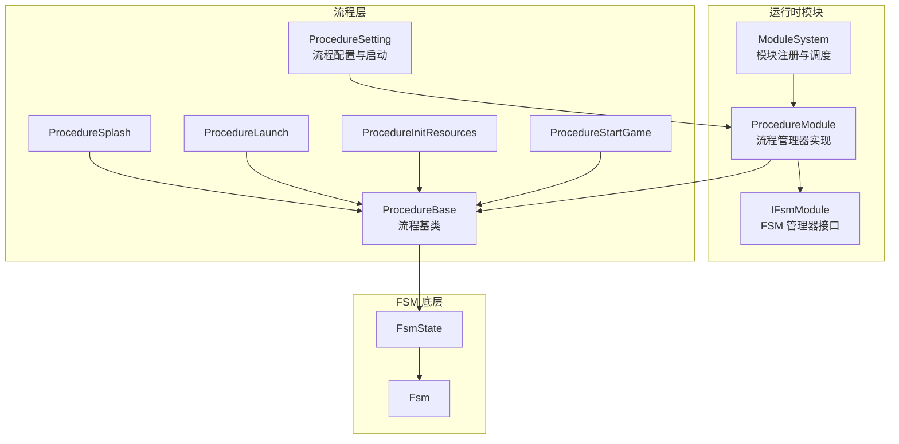
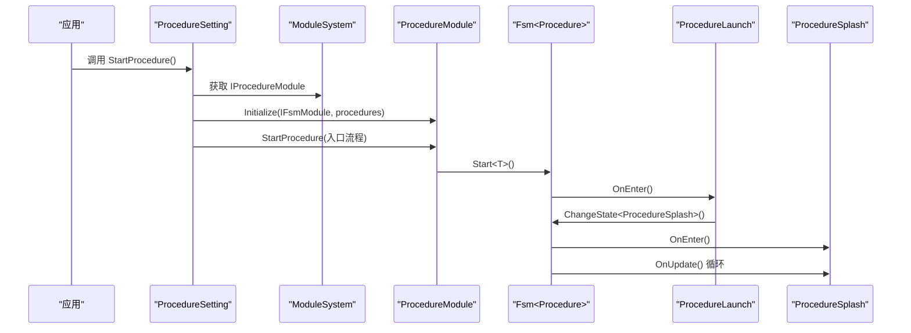
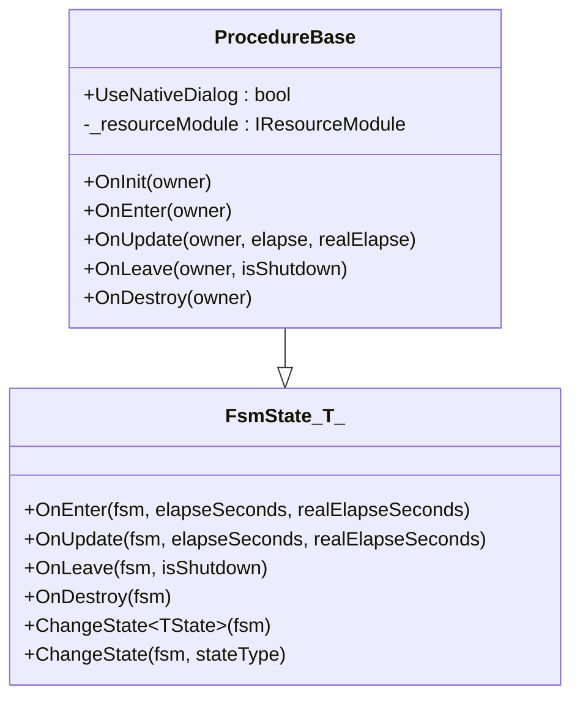
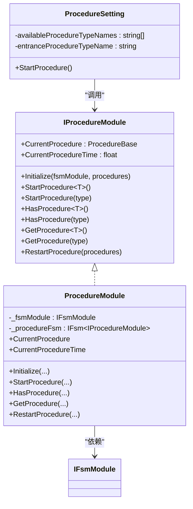
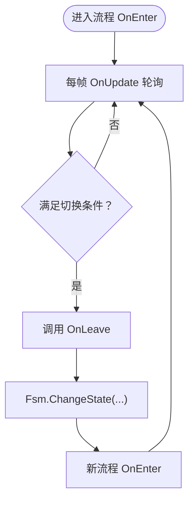
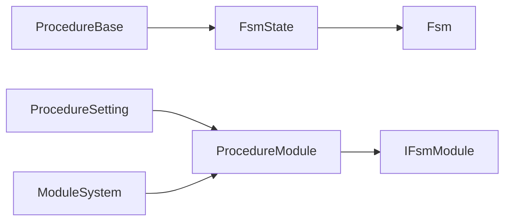

# 自定义流程开发

<cite>
**本文档引用的文件**
- [ProcedureBase.cs](file://Assets/TEngine/Runtime/Module/ProcedureModule/ProcedureBase.cs)
- [IProcedureModule.cs](file://Assets/TEngine/Runtime/Module/ProcedureModule/IProcedureModule.cs)
- [ProcedureModule.cs](file://Assets/TEngine/Runtime/Module/ProcedureModule/ProcedureModule.cs)
- [ProcedureSetting.cs](file://Assets/TEngine/Runtime/Module/ProcedureModule/ProcedureSetting.cs)
- [ModuleSystem.cs](file://Assets/TEngine/Runtime/Core/ModuleSystem.cs)
- [Fsm.cs](file://Assets/TEngine/Runtime/Module/FsmModule/Fsm.cs)
- [FsmState.cs](file://Assets/TEngine/Runtime/Module/FsmModule/FsmState.cs)
- [ProcedureBase.cs（GameScripts）](file://Assets/GameScripts/Procedure/ProcedureBase.cs)
- [ProcedureSplash.cs](file://Assets/GameScripts/Procedure/ProcedureSplash.cs)
- [ProcedureLaunch.cs](file://Assets/GameScripts/Procedure/ProcedureLaunch.cs)
- [ProcedureInitResources.cs](file://Assets/GameScripts/Procedure/ProcedureInitResources.cs)
- [ProcedureStartGame.cs](file://Assets/GameScripts/Procedure/ProcedureStartGame.cs)
- [GameFrameworkException.cs](file://Assets/TEngine/Runtime/Core/Utility/GameFrameworkException.cs)
</cite>

## 目录
1. [简介](#简介)
2. [项目结构](#项目结构)
3. [核心组件](#核心组件)
4. [架构总览](#架构总览)
5. [详细组件分析](#详细组件分析)
6. [依赖关系分析](#依赖关系分析)
7. [性能考量](#性能考量)
8. [故障排查指南](#故障排查指南)
9. [结论](#结论)
10. [附录](#附录)

## 简介
本指南面向希望在 TEngine 中开发自定义流程的开发者，系统讲解如何继承流程基类、设计类结构、重写生命周期方法、传递参数、注册与管理流程、流程切换机制、数据共享与通信、错误处理与异常恢复、性能优化与调试方法，以及将自定义流程集成到现有系统中。文档结合仓库中的实际实现，提供从入门到进阶的完整路径。

## 项目结构
TEngine 的流程体系由“流程基类”“流程管理器接口与实现”“流程设置脚本”“模块系统”“有限状态机（FSM）”等组成。应用层通过 GameScripts/Procedure 下的具体流程实现业务流程编排；运行时通过 ModuleSystem 注册模块，ProcedureModule 作为模块之一负责流程的初始化、启动与切换；底层 FSM 提供状态切换与生命周期回调。

图表来源
- [ProcedureModule.cs:1-209](file://Assets/TEngine/Runtime/Module/ProcedureModule/ProcedureModule.cs#L1-L209)
- [IProcedureModule.cs:1-83](file://Assets/TEngine/Runtime/Module/ProcedureModule/IProcedureModule.cs#L1-L83)
- [ProcedureBase.cs:1-59](file://Assets/TEngine/Runtime/Module/ProcedureModule/ProcedureBase.cs#L1-L59)
- [ProcedureSetting.cs:1-104](file://Assets/TEngine/Runtime/Module/ProcedureModule/ProcedureSetting.cs#L1-L104)
- [FsmState.cs:40-103](file://Assets/TEngine/Runtime/Module/FsmModule/FsmState.cs#L40-L103)
- [Fsm.cs:442-505](file://Assets/TEngine/Runtime/Module/FsmModule/Fsm.cs#L442-L505)

章节来源
- [ProcedureModule.cs:1-209](file://Assets/TEngine/Runtime/Module/ProcedureModule/ProcedureModule.cs#L1-L209)
- [IProcedureModule.cs:1-83](file://Assets/TEngine/Runtime/Module/ProcedureModule/IProcedureModule.cs#L1-L83)
- [ProcedureBase.cs:1-59](file://Assets/TEngine/Runtime/Module/ProcedureModule/ProcedureBase.cs#L1-L59)
- [ProcedureSetting.cs:1-104](file://Assets/TEngine/Runtime/Module/ProcedureModule/ProcedureSetting.cs#L1-L104)
- [FsmState.cs:40-103](file://Assets/TEngine/Runtime/Module/FsmModule/FsmState.cs#L40-L103)
- [Fsm.cs:442-505](file://Assets/TEngine/Runtime/Module/FsmModule/Fsm.cs#L442-L505)

## 核心组件
- 流程基类：提供生命周期回调（初始化、进入、轮询、离开、销毁），并封装了 ChangeState 切换能力。
- 流程管理器接口与实现：提供初始化、启动、查询、重启等能力，内部基于 FSM 实现。
- 流程设置脚本：集中声明可用流程与入口流程，负责实例化并启动流程。
- 模块系统：统一注册与调度模块，流程管理器作为模块之一参与主循环。
- FSM 底层：提供状态切换、轮询与生命周期回调分发。

章节来源
- [ProcedureBase.cs:1-59](file://Assets/TEngine/Runtime/Module/ProcedureModule/ProcedureBase.cs#L1-L59)
- [IProcedureModule.cs:1-83](file://Assets/TEngine/Runtime/Module/ProcedureModule/IProcedureModule.cs#L1-L83)
- [ProcedureModule.cs:1-209](file://Assets/TEngine/Runtime/Module/ProcedureModule/ProcedureModule.cs#L1-L209)
- [ProcedureSetting.cs:1-104](file://Assets/TEngine/Runtime/Module/ProcedureModule/ProcedureSetting.cs#L1-L104)
- [ModuleSystem.cs:1-208](file://Assets/TEngine/Runtime/Core/ModuleSystem.cs#L1-L208)
- [FsmState.cs:40-103](file://Assets/TEngine/Runtime/Module/FsmModule/FsmState.cs#L40-L103)
- [Fsm.cs:442-505](file://Assets/TEngine/Runtime/Module/FsmModule/Fsm.cs#L442-L505)

## 架构总览
下图展示了从配置到启动再到流程切换的整体流程：

图表来源
- [ProcedureSetting.cs:55-102](file://Assets/TEngine/Runtime/Module/ProcedureModule/ProcedureSetting.cs#L55-L102)
- [ProcedureModule.cs:86-123](file://Assets/TEngine/Runtime/Module/ProcedureModule/ProcedureModule.cs#L86-L123)
- [Fsm.cs:474-503](file://Assets/TEngine/Runtime/Module/FsmModule/Fsm.cs#L474-L503)
- [ProcedureLaunch.cs:37-43](file://Assets/GameScripts/Procedure/ProcedureLaunch.cs#L37-L43)
- [ProcedureSplash.cs:13-20](file://Assets/GameScripts/Procedure/ProcedureSplash.cs#L13-L20)

## 详细组件分析

### 流程基类与生命周期
- 生命周期方法
  - OnInit：流程初始化时调用，适合做一次性准备。
  - OnEnter：进入流程时调用，适合启动协程、订阅事件、显示 UI 等。
  - OnUpdate：每帧调用，适合轮询条件、进度推进、状态判断。
  - OnLeave：离开流程时调用，适合清理资源、停止协程、解绑事件。
  - OnDestroy：销毁流程时调用，适合最终清理。
- 参数与返回值
  - 生命周期回调均接收“流程持有者”“逻辑/真实时间”等参数，便于按帧驱动与跨帧协作。
  - ChangeState 支持泛型与类型两种形式，用于在流程内主动切换到下一个流程。

图表来源
- [ProcedureBase.cs:1-59](file://Assets/TEngine/Runtime/Module/ProcedureModule/ProcedureBase.cs#L1-L59)
- [FsmState.cs:40-103](file://Assets/TEngine/Runtime/Module/FsmModule/FsmState.cs#L40-L103)

章节来源
- [ProcedureBase.cs:1-59](file://Assets/TEngine/Runtime/Module/ProcedureModule/ProcedureBase.cs#L1-L59)
- [FsmState.cs:40-103](file://Assets/TEngine/Runtime/Module/FsmModule/FsmState.cs#L40-L103)

### 流程注册与管理
- 接口 IProcedureModule
  - 提供 Initialize、StartProcedure、HasProcedure、GetProcedure、RestartProcedure 等能力。
- 实现 ProcedureModule
  - 内部持有 IFsmModule 与 IFsm<Procedure>，通过 FSM 完成状态切换与生命周期分发。
  - 提供 CurrentProcedure、CurrentProcedureTime 查询当前流程及其持续时间。
- 流程设置 ProcedureSetting
  - 通过 ScriptableObject 配置可用流程类型名数组与入口流程类型名。
  - 启动时动态反射创建流程实例，调用 Initialize 与 StartProcedure。

图表来源
- [IProcedureModule.cs:1-83](file://Assets/TEngine/Runtime/Module/ProcedureModule/IProcedureModule.cs#L1-L83)
- [ProcedureModule.cs:1-209](file://Assets/TEngine/Runtime/Module/ProcedureModule/ProcedureModule.cs#L1-L209)
- [ProcedureSetting.cs:1-104](file://Assets/TEngine/Runtime/Module/ProcedureModule/ProcedureSetting.cs#L1-L104)

章节来源
- [IProcedureModule.cs:1-83](file://Assets/TEngine/Runtime/Module/ProcedureModule/IProcedureModule.cs#L1-L83)
- [ProcedureModule.cs:1-209](file://Assets/TEngine/Runtime/Module/ProcedureModule/ProcedureModule.cs#L1-L209)
- [ProcedureSetting.cs:1-104](file://Assets/TEngine/Runtime/Module/ProcedureModule/ProcedureSetting.cs#L1-L104)

### 流程切换机制
- 在流程内通过 ChangeState 切换到下一个流程，底层由 Fsm.cs 实现状态切换与生命周期回调分发。
- 切换时会触发 OnLeave、重置计时、切换当前状态并触发 OnEnter。

图表来源
- [Fsm.cs:474-503](file://Assets/TEngine/Runtime/Module/FsmModule/Fsm.cs#L474-L503)
- [FsmState.cs:64-101](file://Assets/TEngine/Runtime/Module/FsmModule/FsmState.cs#L64-L101)

章节来源
- [Fsm.cs:474-503](file://Assets/TEngine/Runtime/Module/FsmModule/Fsm.cs#L474-L503)
- [FsmState.cs:64-101](file://Assets/TEngine/Runtime/Module/FsmModule/FsmState.cs#L64-L101)

### 数据共享与通信
- 模块访问：流程基类内置资源模块引用，可通过 ModuleSystem.GetModule 访问音频、本地化、UI 等模块。
- 事件与日志：流程内可使用日志系统输出信息与错误，便于调试与监控。
- 协程与异步：流程内可使用协程或异步任务（如 UniTask）进行耗时操作，完成后切换流程或更新 UI。

章节来源
- [ProcedureBase.cs（GameScripts）:1-15](file://Assets/GameScripts/Procedure/ProcedureBase.cs#L1-L15)
- [ProcedureInitResources.cs:1-172](file://Assets/GameScripts/Procedure/ProcedureInitResources.cs#L1-L172)
- [ModuleSystem.cs:1-208](file://Assets/TEngine/Runtime/Core/ModuleSystem.cs#L1-L208)

### 错误处理与异常恢复
- 异常类型：框架提供 GameFrameworkException，流程管理器在未初始化时抛出异常。
- 常见场景
  - 初始化前调用流程管理器方法：捕获异常并提示先完成初始化。
  - 资源初始化失败：在流程内弹出对话框提示重试或退出，必要时回退到可选流程。
- 建议策略
  - 在流程入口处进行前置校验（网络、存储、配置）。
  - 使用模块化 UI（如 LauncherMgr）统一展示错误与重试。
  - 对关键异步操作添加超时与重试策略。

章节来源
- [ProcedureModule.cs:37-56](file://Assets/TEngine/Runtime/Module/ProcedureModule/ProcedureModule.cs#L37-L56)
- [ProcedureInitResources.cs:112-170](file://Assets/GameScripts/Procedure/ProcedureInitResources.cs#L112-L170)
- [GameFrameworkException.cs:36-49](file://Assets/TEngine/Runtime/Core/Utility/GameFrameworkException.cs#L36-L49)

### 开发示例

#### 示例一：HelloWorld 流程（最小可用）
- 继承 ProcedureBase，至少重写 OnEnter 与 OnUpdate。
- 在 OnEnter 中打印日志或显示 UI。
- 在 OnUpdate 中判断条件后调用 ChangeState 切换到下一流程。
- 将该流程加入 ProcedureSetting 的可用流程列表，并设为入口流程。

章节来源
- [ProcedureBase.cs:1-59](file://Assets/TEngine/Runtime/Module/ProcedureModule/ProcedureBase.cs#L1-L59)
- [ProcedureSetting.cs:55-102](file://Assets/TEngine/Runtime/Module/ProcedureModule/ProcedureSetting.cs#L55-L102)

#### 示例二：资源初始化流程（复杂业务）
- 在 OnEnter 中显示加载 UI，启动资源初始化协程。
- 在 OnUpdate 中轮询初始化结果，根据播放模式选择进入预加载或下载流程。
- 失败时弹出对话框，提供重试或退出选项；可选地回退到可选更新流程。

章节来源
- [ProcedureInitResources.cs:1-172](file://Assets/GameScripts/Procedure/ProcedureInitResources.cs#L1-L172)

#### 示例三：启动与闪屏流程
- 启动流程：初始化语言与声音设置，切换到闪屏流程。
- 闪屏流程：播放动画后切换到资源初始化流程。

章节来源
- [ProcedureLaunch.cs:1-95](file://Assets/GameScripts/Procedure/ProcedureLaunch.cs#L1-L95)
- [ProcedureSplash.cs:1-23](file://Assets/GameScripts/Procedure/ProcedureSplash.cs#L1-L23)

#### 示例四：进入游戏流程
- 进入游戏流程：隐藏加载 UI，准备进入主场景或主流程。

章节来源
- [ProcedureStartGame.cs:1-24](file://Assets/GameScripts/Procedure/ProcedureStartGame.cs#L1-L24)

### 集成到现有系统
- 在工程中创建自定义流程类，继承 ProcedureBase。
- 在 ProcedureSetting 中添加流程类型名与入口流程类型名。
- 通过 ModuleSystem 获取 IProcedureModule，调用 Initialize 与 StartProcedure 启动。
- 如需跨流程共享数据，可在流程内通过模块系统访问公共模块（如资源、音频、UI）。

章节来源
- [ProcedureSetting.cs:55-102](file://Assets/TEngine/Runtime/Module/ProcedureModule/ProcedureSetting.cs#L55-L102)
- [ModuleSystem.cs:68-89](file://Assets/TEngine/Runtime/Core/ModuleSystem.cs#L68-L89)
- [ProcedureModule.cs:86-123](file://Assets/TEngine/Runtime/Module/ProcedureModule/ProcedureModule.cs#L86-L123)

## 依赖关系分析
- 流程基类依赖 FSM 状态基类，提供 ChangeState 能力。
- 流程管理器实现依赖 FSM 管理器接口，负责流程集合的创建与切换。
- 流程设置脚本依赖模块系统与反射创建流程实例。
- 模块系统统一注册与调度模块，流程管理器作为模块之一参与主循环。

图表来源
- [ProcedureBase.cs:1-59](file://Assets/TEngine/Runtime/Module/ProcedureModule/ProcedureBase.cs#L1-L59)
- [FsmState.cs:40-103](file://Assets/TEngine/Runtime/Module/FsmModule/FsmState.cs#L40-L103)
- [Fsm.cs:442-505](file://Assets/TEngine/Runtime/Module/FsmModule/Fsm.cs#L442-L505)
- [ProcedureSetting.cs:1-104](file://Assets/TEngine/Runtime/Module/ProcedureModule/ProcedureSetting.cs#L1-L104)
- [ProcedureModule.cs:1-209](file://Assets/TEngine/Runtime/Module/ProcedureModule/ProcedureModule.cs#L1-L209)
- [ModuleSystem.cs:1-208](file://Assets/TEngine/Runtime/Core/ModuleSystem.cs#L1-L208)

章节来源
- [ProcedureBase.cs:1-59](file://Assets/TEngine/Runtime/Module/ProcedureModule/ProcedureBase.cs#L1-L59)
- [FsmState.cs:40-103](file://Assets/TEngine/Runtime/Module/FsmModule/FsmState.cs#L40-L103)
- [Fsm.cs:442-505](file://Assets/TEngine/Runtime/Module/FsmModule/Fsm.cs#L442-L505)
- [ProcedureSetting.cs:1-104](file://Assets/TEngine/Runtime/Module/ProcedureModule/ProcedureSetting.cs#L1-L104)
- [ProcedureModule.cs:1-209](file://Assets/TEngine/Runtime/Module/ProcedureModule/ProcedureModule.cs#L1-L209)
- [ModuleSystem.cs:1-208](file://Assets/TEngine/Runtime/Core/ModuleSystem.cs#L1-L208)

## 性能考量
- 避免在 OnUpdate 中执行重型同步操作，尽量使用协程或异步任务。
- 合理使用模块缓存，避免频繁通过 ModuleSystem.GetModule 获取模块。
- 控制流程切换频率，避免在每帧都进行昂贵的判断与切换。
- 对资源初始化等长耗时流程，采用分阶段加载与进度反馈，减少卡顿。
- 使用日志分级与条件输出，避免在热路径中产生大量日志。

## 故障排查指南
- “必须先初始化流程”异常
  - 症状：在未调用 Initialize 前调用 StartProcedure/HasProcedure/GetProcedure。
  - 解决：确保先通过 ProcedureSetting 或手动调用 Initialize，再启动流程。
- “状态不存在”异常
  - 症状：尝试切换到未注册的状态。
  - 解决：确认流程类型已加入可用流程列表，且类型名正确。
- 资源初始化失败
  - 症状：网络不可用或清单更新失败。
  - 解决：根据播放模式选择重试、退出或进入可选更新流程；记录错误并提示用户。
- UI 闪烁或卡顿
  - 症状：流程切换或加载过程中 UI 抖动。
  - 解决：将 UI 显示/隐藏与资源加载分离，使用渐变或占位符过渡。

章节来源
- [ProcedureModule.cs:37-56](file://Assets/TEngine/Runtime/Module/ProcedureModule/ProcedureModule.cs#L37-L56)
- [Fsm.cs:486-497](file://Assets/TEngine/Runtime/Module/FsmModule/Fsm.cs#L486-L497)
- [ProcedureInitResources.cs:112-170](file://Assets/GameScripts/Procedure/ProcedureInitResources.cs#L112-L170)

## 结论
通过继承 ProcedureBase 并遵循生命周期回调约定，开发者可以在 TEngine 中快速构建自定义流程。结合 IProcedureModule 与 ProcedureSetting，可以实现流程的集中注册与启动；借助 FSM 的状态切换机制，流程间可以平滑过渡。配合模块系统与日志体系，能够实现良好的数据共享、错误处理与性能控制。建议从简单流程起步，逐步引入异步与模块化能力，最终形成稳定可靠的流程编排体系。

## 附录
- 快速清单
  - 继承 ProcedureBase，至少实现 OnEnter 与 OnUpdate。
  - 在 ProcedureSetting 中注册流程类型名与入口流程。
  - 在流程内通过 ModuleSystem 获取所需模块。
  - 使用 ChangeState 在流程间切换。
  - 对长耗时操作使用协程或异步任务，并提供错误恢复策略。
  - 使用日志与 UI 统一反馈状态与错误。