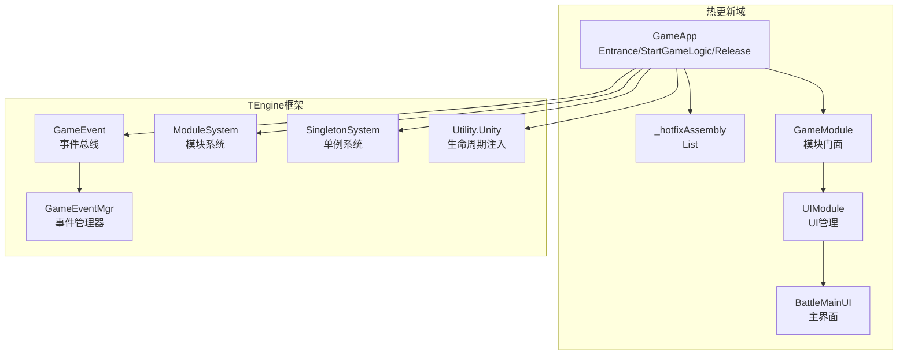
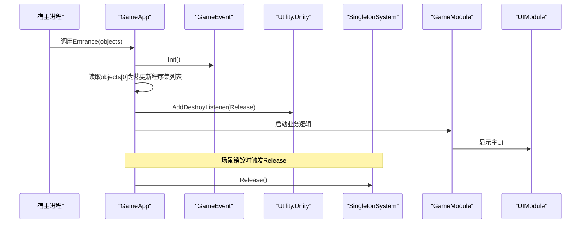
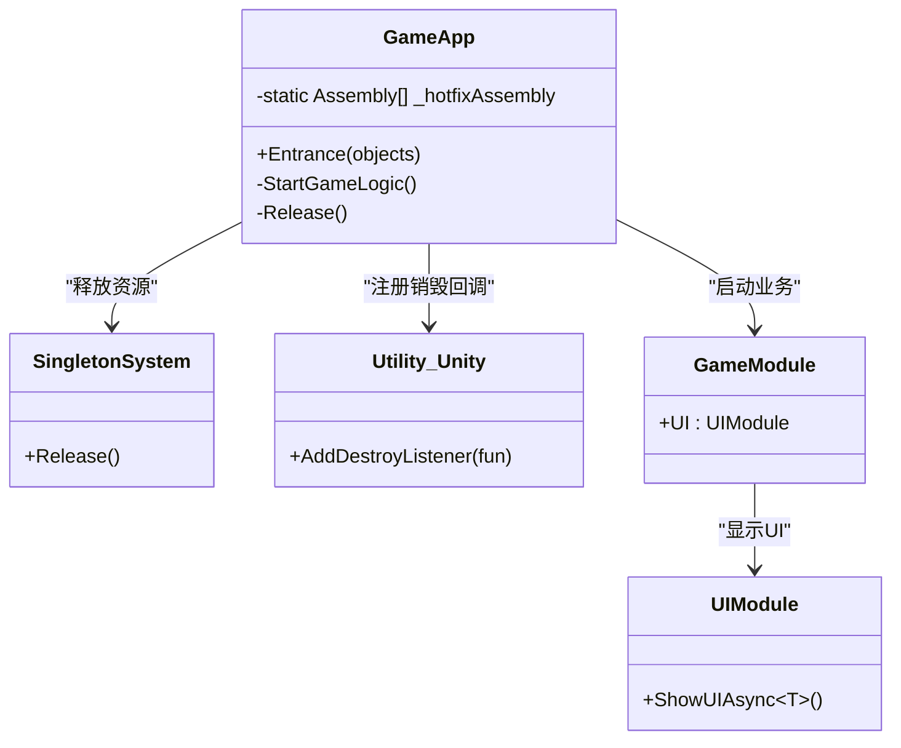
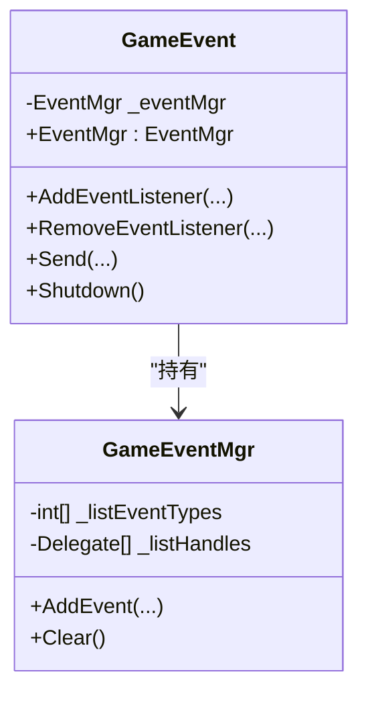
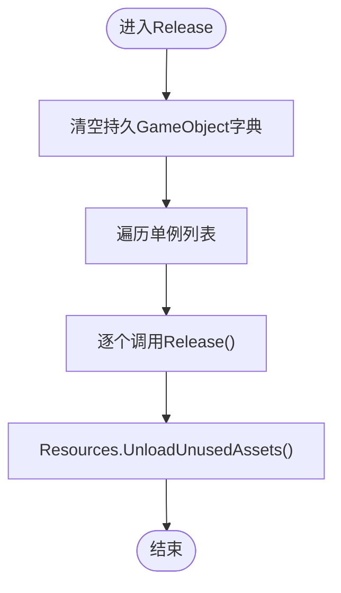
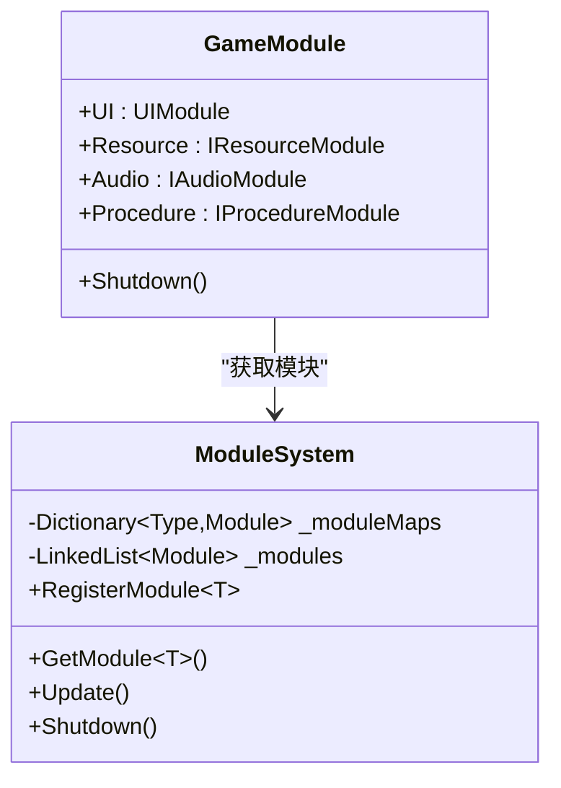
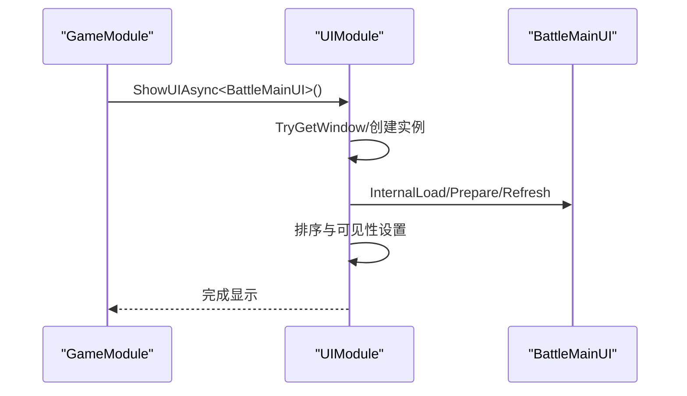
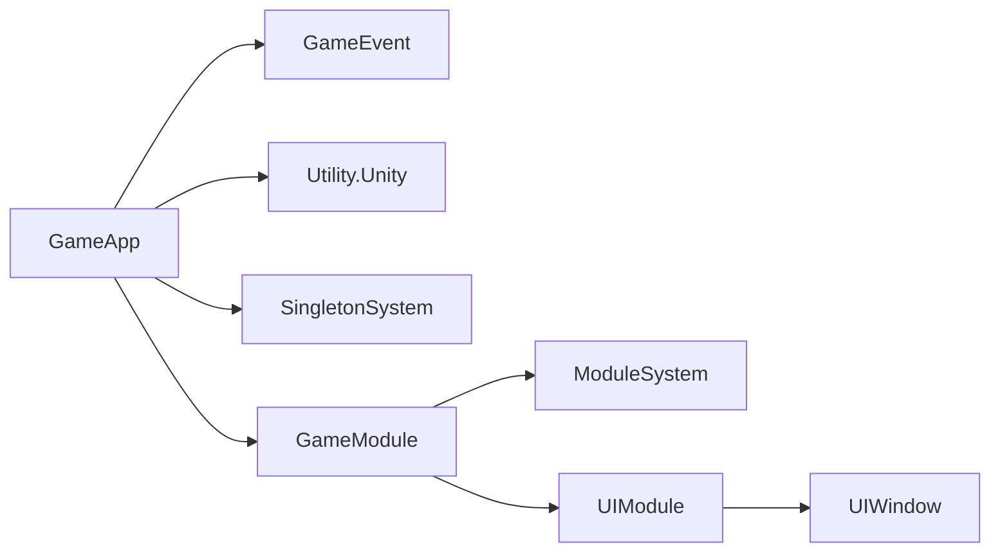

# GameApp入口设计

<cite>
**本文档引用的文件**
- [GameApp.cs](file://Assets/GameScripts/HotFix/GameLogic/GameApp.cs)
- [GameEvent.cs](file://Assets/TEngine/Runtime/Core/GameEvent/GameEvent.cs)
- [GameEventMgr.cs](file://Assets/TEngine/Runtime/Core/GameEvent/GameEventMgr.cs)
- [SingletonSystem.cs](file://Assets/GameScripts/HotFix/GameLogic/SingletonSystem/SingletonSystem.cs)
- [ModuleSystem.cs](file://Assets/TEngine/Runtime/Core/ModuleSystem.cs)
- [GameModule.cs](file://Assets/GameScripts/HotFix/GameLogic/GameModule.cs)
- [UIModule.cs](file://Assets/GameScripts/HotFix/GameLogic/Module/UIModule/UIModule.cs)
- [BattleMainUI.cs](file://Assets/GameScripts/HotFix/GameLogic/UI/BattleMainUI/BattleMainUI.cs)
- [Utility.Unity.cs](file://Assets/TEngine/Runtime/Core/Utility/Utility.Unity.cs)
</cite>

## 目录
1. [简介](#简介)
2. [项目结构](#项目结构)
3. [核心组件](#核心组件)
4. [架构总览](#架构总览)
5. [详细组件分析](#详细组件分析)
6. [依赖关系分析](#依赖关系分析)
7. [性能考虑](#性能考虑)
8. [故障排除指南](#故障排除指南)
9. [结论](#结论)
10. [附录](#附录)

## 简介
本文件围绕GameApp作为热更新域主入口的设计理念与实现进行系统化技术文档整理。重点涵盖：
- Entrance方法的参数传递与初始化流程
- 生命周期管理与释放机制
- 静态成员设计（特别是_hotfixAssembly列表）及其管理方式
- 与TEngine框架组件的集成（GameEventHelper初始化、SingletonSystem集成、模块系统注册）
- 使用示例、最佳实践、错误处理与异常恢复策略
- 调试技巧与性能优化建议

## 项目结构
GameApp位于热更新域GameLogic命名空间下，作为热更新域的主入口，负责：
- 初始化事件系统
- 接收热更新程序集列表
- 注册销毁回调以触发释放流程
- 启动业务逻辑（如显示主UI）

**图表来源**
- [GameApp.cs:25-46](file://Assets/GameScripts/HotFix/GameLogic/GameApp.cs#L25-L46)
- [GameEvent.cs:8-18](file://Assets/TEngine/Runtime/Core/GameEvent/GameEvent.cs#L8-L18)
- [GameEventMgr.cs:9-28](file://Assets/TEngine/Runtime/Core/GameEvent/GameEventMgr.cs#L9-L28)
- [ModuleSystem.cs:9-208](file://Assets/TEngine/Runtime/Core/ModuleSystem.cs#L9-L208)
- [SingletonSystem.cs:60-369](file://Assets/GameScripts/HotFix/GameLogic/SingletonSystem/SingletonSystem.cs#L60-L369)
- [Utility.Unity.cs:258-262](file://Assets/TEngine/Runtime/Core/Utility/Utility.Unity.cs#L258-L262)

**章节来源**
- [GameApp.cs:17-46](file://Assets/GameScripts/HotFix/GameLogic/GameApp.cs#L17-L46)
- [ModuleSystem.cs:9-208](file://Assets/TEngine/Runtime/Core/ModuleSystem.cs#L9-L208)

## 核心组件
- GameApp：热更新域主入口，负责初始化、生命周期绑定与业务启动
- GameEvent/GameEventMgr：事件系统与事件管理器，支撑跨模块通信
- SingletonSystem：全局单例与生命周期管理，负责统一释放
- ModuleSystem：模块注册与调度，提供模块门面
- GameModule：模块门面，集中获取各子模块
- UIModule：UI模块，负责窗口管理与渲染
- Utility.Unity：生命周期注入工具，提供销毁回调注册

**章节来源**
- [GameApp.cs:17-46](file://Assets/GameScripts/HotFix/GameLogic/GameApp.cs#L17-L46)
- [GameEvent.cs:8-18](file://Assets/TEngine/Runtime/Core/GameEvent/GameEvent.cs#L8-L18)
- [GameEventMgr.cs:9-28](file://Assets/TEngine/Runtime/Core/GameEvent/GameEventMgr.cs#L9-L28)
- [SingletonSystem.cs:60-369](file://Assets/GameScripts/HotFix/GameLogic/SingletonSystem/SingletonSystem.cs#L60-L369)
- [ModuleSystem.cs:9-208](file://Assets/TEngine/Runtime/Core/ModuleSystem.cs#L9-L208)
- [GameModule.cs:5-118](file://Assets/GameScripts/HotFix/GameLogic/GameModule.cs#L5-L118)
- [UIModule.cs:15-114](file://Assets/GameScripts/HotFix/GameLogic/Module/UIModule/UIModule.cs#L15-L114)
- [Utility.Unity.cs:258-262](file://Assets/TEngine/Runtime/Core/Utility/Utility.Unity.cs#L258-L262)

## 架构总览
GameApp作为热更新域的唯一入口，遵循“初始化—绑定生命周期—启动业务”的标准流程，并通过TEngine框架完成模块化解耦。

**图表来源**
- [GameApp.cs:25-46](file://Assets/GameScripts/HotFix/GameLogic/GameApp.cs#L25-L46)
- [GameEvent.cs:596-600](file://Assets/TEngine/Runtime/Core/GameEvent/GameEvent.cs#L596-L600)
- [Utility.Unity.cs:258-262](file://Assets/TEngine/Runtime/Core/Utility/Utility.Unity.cs#L258-L262)
- [SingletonSystem.cs:212-235](file://Assets/GameScripts/HotFix/GameLogic/SingletonSystem/SingletonSystem.cs#L212-L235)
- [GameModule.cs:94-101](file://Assets/GameScripts/HotFix/GameLogic/GameModule.cs#L94-L101)
- [UIModule.cs:250-264](file://Assets/GameScripts/HotFix/GameLogic/Module/UIModule/UIModule.cs#L250-L264)

## 详细组件分析

### GameApp组件分析
- 设计理念
  - 作为热更新域主入口，集中处理初始化、生命周期绑定与业务启动
  - 通过静态方法Entrance接收宿主传参，避免实例化开销
- 参数传递
  - objects[0]：热更新程序集列表（List<Assembly>），用于后续逻辑使用
- 初始化流程
  - 初始化事件系统
  - 读取热更新程序集列表
  - 注册销毁回调（AddDestroyListener），确保场景销毁时触发Release
  - 启动业务逻辑（StartGameLogic）
- 生命周期管理
  - Release中调用SingletonSystem.Release，统一释放单例与资源
- 静态成员设计
  - _hotfixAssembly：保存热更新程序集列表，便于后续逻辑按需使用

**图表来源**
- [GameApp.cs:19-46](file://Assets/GameScripts/HotFix/GameLogic/GameApp.cs#L19-L46)
- [SingletonSystem.cs:212-235](file://Assets/GameScripts/HotFix/GameLogic/SingletonSystem/SingletonSystem.cs#L212-L235)
- [Utility.Unity.cs:258-262](file://Assets/TEngine/Runtime/Core/Utility/Utility.Unity.cs#L258-L262)
- [GameModule.cs:63](file://Assets/GameScripts/HotFix/GameLogic/GameModule.cs#L63)
- [UIModule.cs:250-264](file://Assets/GameScripts/HotFix/GameLogic/Module/UIModule/UIModule.cs#L250-L264)

**章节来源**
- [GameApp.cs:17-46](file://Assets/GameScripts/HotFix/GameLogic/GameApp.cs#L17-L46)

### GameEvent与GameEventMgr分析
- GameEvent：全局事件总线，提供事件注册、移除与分发接口
- GameEventMgr：事件管理器，维护事件类型与处理器列表，支持清理与回收

**图表来源**
- [GameEvent.cs:8-18](file://Assets/TEngine/Runtime/Core/GameEvent/GameEvent.cs#L8-L18)
- [GameEvent.cs:28-118](file://Assets/TEngine/Runtime/Core/GameEvent/GameEvent.cs#L28-L118)
- [GameEvent.cs:376-590](file://Assets/TEngine/Runtime/Core/GameEvent/GameEvent.cs#L376-L590)
- [GameEventMgr.cs:9-28](file://Assets/TEngine/Runtime/Core/GameEvent/GameEventMgr.cs#L9-L28)
- [GameEventMgr.cs:51-107](file://Assets/TEngine/Runtime/Core/GameEvent/GameEventMgr.cs#L51-L107)

**章节来源**
- [GameEvent.cs:8-18](file://Assets/TEngine/Runtime/Core/GameEvent/GameEvent.cs#L8-L18)
- [GameEventMgr.cs:9-28](file://Assets/TEngine/Runtime/Core/GameEvent/GameEventMgr.cs#L9-L28)

### SingletonSystem分析
- 单例管理：统一注册/释放单例，构建生命周期（Update/FixedUpdate/LateUpdate）
- 资源清理：释放所有单例、销毁持久对象、卸载未使用资源
- 与模块系统集成：通过IUpdateDriver驱动生命周期

**图表来源**
- [SingletonSystem.cs:212-235](file://Assets/GameScripts/HotFix/GameLogic/SingletonSystem/SingletonSystem.cs#L212-L235)

**章节来源**
- [SingletonSystem.cs:60-369](file://Assets/GameScripts/HotFix/GameLogic/SingletonSystem/SingletonSystem.cs#L60-L369)

### ModuleSystem与GameModule分析
- ModuleSystem：模块注册、优先级排序、更新队列构建与关闭清理
- GameModule：模块门面，提供UI、资源、音频、场景等模块的便捷访问

**图表来源**
- [ModuleSystem.cs:9-208](file://Assets/TEngine/Runtime/Core/ModuleSystem.cs#L9-L208)
- [GameModule.cs:5-118](file://Assets/GameScripts/HotFix/GameLogic/GameModule.cs#L5-L118)

**章节来源**
- [ModuleSystem.cs:9-208](file://Assets/TEngine/Runtime/Core/ModuleSystem.cs#L9-L208)
- [GameModule.cs:5-118](file://Assets/GameScripts/HotFix/GameLogic/GameModule.cs#L5-L118)

### UIModule与BattleMainUI分析
- UIModule：UI根节点查找、资源加载器初始化、窗口栈管理、深度排序与可见性控制
- BattleMainUI：主界面窗口，通过Window特性声明窗口属性

**图表来源**
- [GameModule.cs:63](file://Assets/GameScripts/HotFix/GameLogic/GameModule.cs#L63)
- [UIModule.cs:250-321](file://Assets/GameScripts/HotFix/GameLogic/Module/UIModule/UIModule.cs#L250-L321)
- [BattleMainUI.cs:7-24](file://Assets/GameScripts/HotFix/GameLogic/UI/BattleMainUI/BattleMainUI.cs#L7-L24)

**章节来源**
- [UIModule.cs:15-114](file://Assets/GameScripts/HotFix/GameLogic/Module/UIModule/UIModule.cs#L15-L114)
- [BattleMainUI.cs:7-24](file://Assets/GameScripts/HotFix/GameLogic/UI/BattleMainUI/BattleMainUI.cs#L7-L24)

## 依赖关系分析
- GameApp依赖：
  - GameEvent：初始化事件系统
  - Utility.Unity：注册销毁回调
  - SingletonSystem：释放资源
  - GameModule：启动业务逻辑
- GameModule依赖：
  - ModuleSystem：获取模块实例
  - UIModule：UI窗口管理
- UIModule依赖：
  - UIWindow：窗口基类
  - WindowAttribute：窗口元信息

**图表来源**
- [GameApp.cs:25-46](file://Assets/GameScripts/HotFix/GameLogic/GameApp.cs#L25-L46)
- [GameEvent.cs:8-18](file://Assets/TEngine/Runtime/Core/GameEvent/GameEvent.cs#L8-L18)
- [Utility.Unity.cs:258-262](file://Assets/TEngine/Runtime/Core/Utility/Utility.Unity.cs#L258-L262)
- [SingletonSystem.cs:212-235](file://Assets/GameScripts/HotFix/GameLogic/SingletonSystem/SingletonSystem.cs#L212-L235)
- [GameModule.cs:94-101](file://Assets/GameScripts/HotFix/GameLogic/GameModule.cs#L94-L101)
- [UIModule.cs:518-559](file://Assets/GameScripts/HotFix/GameLogic/Module/UIModule/UIModule.cs#L518-L559)

**章节来源**
- [GameApp.cs:25-46](file://Assets/GameScripts/HotFix/GameLogic/GameApp.cs#L25-L46)
- [GameModule.cs:94-101](file://Assets/GameScripts/HotFix/GameLogic/GameModule.cs#L94-L101)

## 性能考虑
- 事件系统
  - 使用事件管理器记录事件类型与处理器，便于统一清理，降低泄漏风险
- 单例系统
  - 通过统一释放与资源卸载，避免内存碎片与残留引用
- UI模块
  - 窗口栈与深度排序采用线性扫描，注意窗口数量增长带来的复杂度上升；可结合缓存与延迟加载优化
- 模块系统
  - 更新队列按优先级构建，避免频繁重建；合理设置模块优先级可提升执行效率

[本节为通用性能建议，不直接分析具体文件]

## 故障排除指南
- UI根节点缺失
  - 现象：UI初始化失败并抛出致命错误
  - 处理：检查场景中是否存在UIRoot对象，确保Canvas与Camera正确配置
- 窗口重复创建
  - 现象：尝试打开已存在的窗口时报错
  - 处理：先检查窗口是否存在，再决定创建或复用
- 事件未清理
  - 现象：退出场景后仍有事件回调生效
  - 处理：确认Entrance中已调用GameEventHelper.Init并在场景销毁时触发Release
- 资源未释放
  - 现象：切换场景后内存不降
  - 处理：确保Release中调用SingletonSystem.Release并触发资源卸载

**章节来源**
- [UIModule.cs:51-61](file://Assets/GameScripts/HotFix/GameLogic/Module/UIModule/UIModule.cs#L51-L61)
- [UIModule.cs:666-672](file://Assets/GameScripts/HotFix/GameLogic/Module/UIModule/UIModule.cs#L666-L672)
- [GameEvent.cs:596-600](file://Assets/TEngine/Runtime/Core/GameEvent/GameEvent.cs#L596-L600)
- [SingletonSystem.cs:212-235](file://Assets/GameScripts/HotFix/GameLogic/SingletonSystem/SingletonSystem.cs#L212-L235)

## 结论
GameApp以简洁的静态入口设计，将热更新域初始化、生命周期绑定与业务启动整合为一体，配合TEngine框架的事件系统、模块系统与UI系统，实现了高内聚、低耦合的架构。通过统一的释放流程与资源管理，有效降低了热更新域的内存与资源风险。建议在实际工程中遵循本文的最佳实践与调试技巧，确保稳定运行与良好性能。

[本节为总结性内容，不直接分析具体文件]

## 附录

### 使用示例与最佳实践
- 在Entrance中进行业务初始化
  - 初始化事件系统：调用事件系统的初始化接口
  - 读取热更新程序集列表：从objects[0]获取并缓存
  - 注册销毁回调：绑定Release以确保资源清理
  - 启动业务逻辑：通过GameModule门面启动UI或其他模块
- 错误处理与异常恢复
  - UI根节点缺失：在初始化阶段捕获并提示修复
  - 窗口重复创建：先HasWindow再决定创建或复用
  - 事件泄漏：在Release中统一清理事件监听
- 调试技巧
  - 利用日志输出关键节点（如“看到此条日志代表你成功运行了热更新代码”）
  - 在Release前后输出日志，定位资源清理问题
- 性能优化建议
  - 合理设置模块优先级，减少不必要的更新轮询
  - UI窗口按需加载与隐藏，避免一次性加载过多资源
  - 定期调用资源卸载接口，保持内存稳定

**章节来源**
- [GameApp.cs:25-46](file://Assets/GameScripts/HotFix/GameLogic/GameApp.cs#L25-L46)
- [UIModule.cs:250-321](file://Assets/GameScripts/HotFix/GameLogic/Module/UIModule/UIModule.cs#L250-L321)
- [SingletonSystem.cs:212-235](file://Assets/GameScripts/HotFix/GameLogic/SingletonSystem/SingletonSystem.cs#L212-L235)