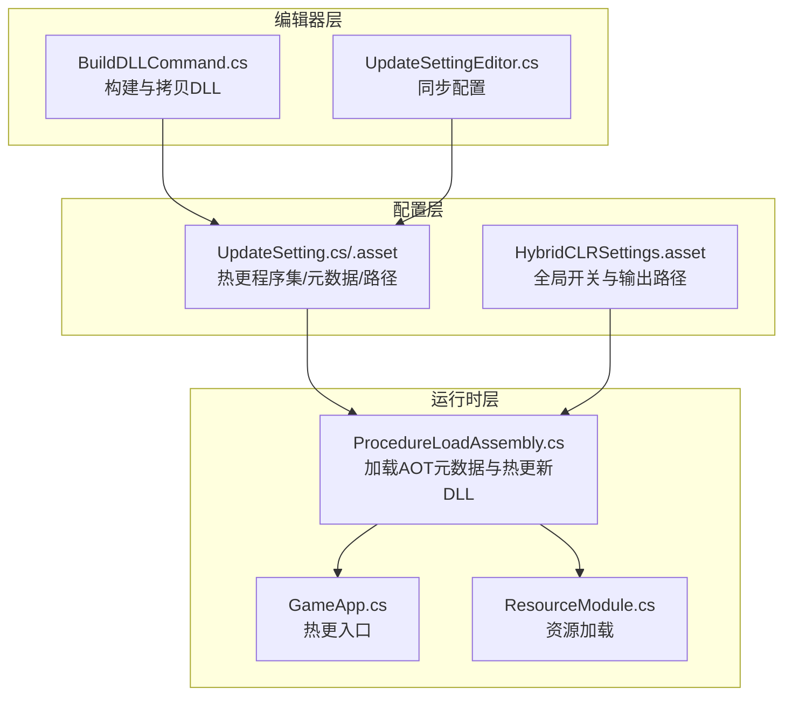
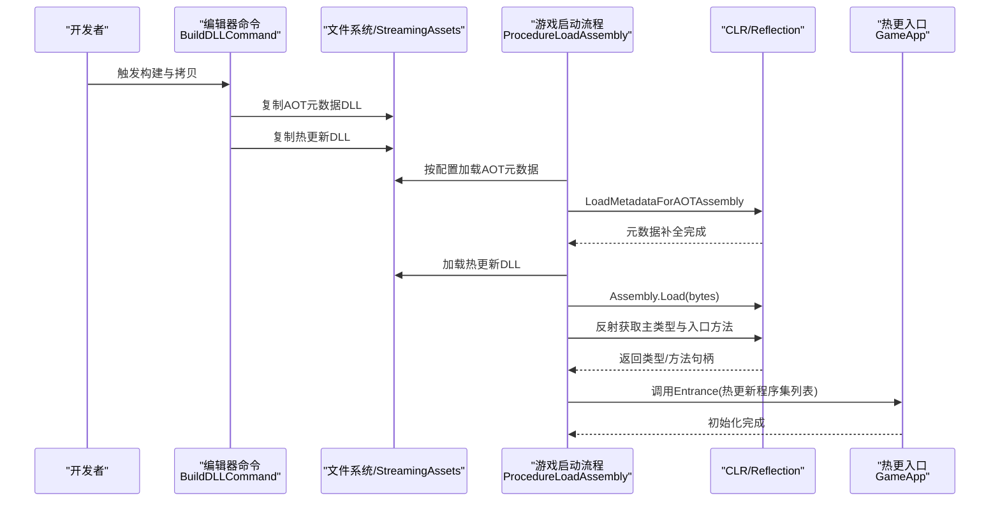
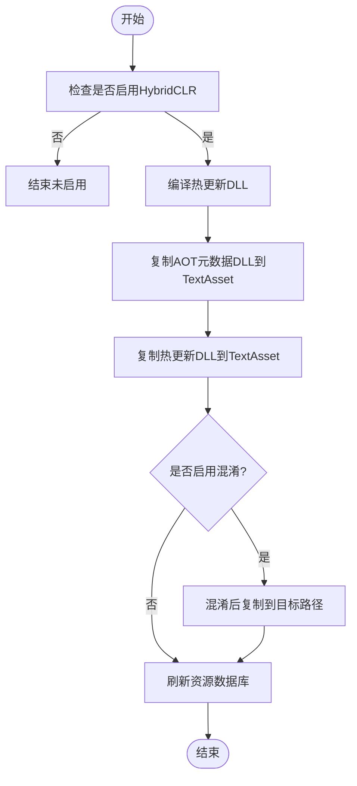
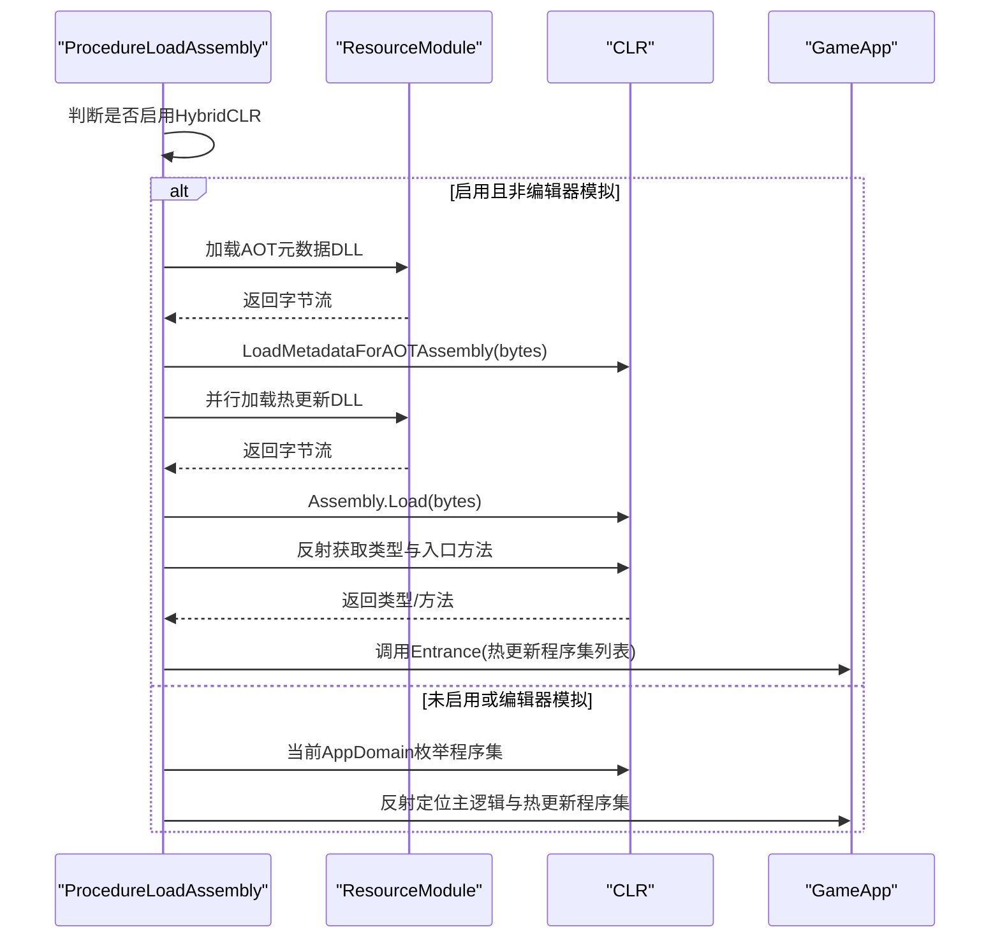
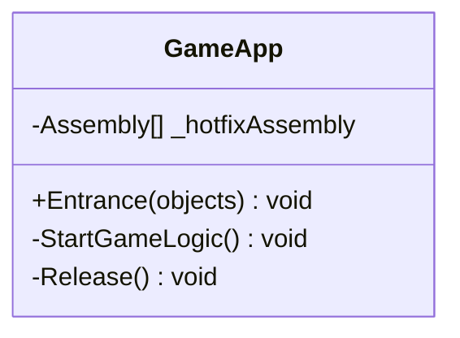
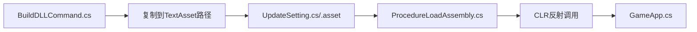

# HybridCLR原理与集成

<cite>
**本文引用的文件**
- [ProjectSettings/HybridCLRSettings.asset](file://ProjectSettings/HybridCLRSettings.asset)
- [Assets/TEngine/Editor/HybridCLR/BuildDLLCommand.cs](file://Assets/TEngine/Editor/HybridCLR/BuildDLLCommand.cs)
- [Assets/GameScripts/Procedure/ProcedureLoadAssembly.cs](file://Assets/GameScripts/Procedure/ProcedureLoadAssembly.cs)
- [Assets/GameScripts/HotFix/GameLogic/GameApp.cs](file://Assets/GameScripts/HotFix/GameLogic/GameApp.cs)
- [Assets/TEngine/Runtime/Core/UpdateSetting.cs](file://Assets/TEngine/Runtime/Core/UpdateSetting.cs)
- [Assets/TEngine/Settings/UpdateSetting.asset](file://Assets/TEngine/Settings/UpdateSetting.asset)
- [Assets/TEngine/Editor/Utility/UpdateSettingEditor.cs](file://Assets/TEngine/Editor/Utility/UpdateSettingEditor.cs)
- [Assets/TEngine/Runtime/Module/ResourceModule/ResourceModule.cs](file://Assets/TEngine/Runtime/Module/ResourceModule/ResourceModule.cs)
- [memory-bank/systemPatterns.md](file://memory-bank/systemPatterns.md)
</cite>

## 目录
1. [引言](#引言)
2. [项目结构](#项目结构)
3. [核心组件](#核心组件)
4. [架构总览](#架构总览)
5. [详细组件分析](#详细组件分析)
6. [依赖关系分析](#依赖关系分析)
7. [性能考虑](#性能考虑)
8. [故障排查指南](#故障排查指南)
9. [结论](#结论)
10. [附录](#附录)

## 引言
本文件面向希望理解并集成HybridCLR（AOT/JIT混合编译）的开发者，系统性阐述以下主题：
- AOT与JIT协同机制：如何通过预编译AOT代码与运行时JIT解释执行互补，实现热更新与高性能兼顾。
- 程序集加载流程：从构建期准备、打包期复制到运行期加载与反射调用的完整链路。
- 类型反射在热更新中的应用：类型查找、方法调用、属性访问等机制。
- 热更新域与主域的隔离与通信：如何在不同域之间安全传递参数与触发逻辑。
- 配置项与优化策略：编译设置、内存管理、性能调优等。
- 常见问题诊断：程序集加载失败、类型不匹配等场景的排查步骤。

## 项目结构
本项目采用“编辑器工具 + 运行时流程 + 配置资源”的分层组织方式：
- 编辑器层：提供HybridCLR开关、DLL编译与拷贝、AOT元数据补全等自动化命令。
- 运行时层：在启动流程中按阶段加载AOT元数据与热更新DLL，完成反射入口调用。
- 配置层：通过ScriptableObject与ProjectSettings中的HybridCLRSettings进行集中配置。

图表来源
- [Assets/TEngine/Editor/HybridCLR/BuildDLLCommand.cs:1-174](file://Assets/TEngine/Editor/HybridCLR/BuildDLLCommand.cs#L1-L174)
- [Assets/TEngine/Editor/Utility/UpdateSettingEditor.cs:40-106](file://Assets/TEngine/Editor/Utility/UpdateSettingEditor.cs#L40-L106)
- [Assets/TEngine/Runtime/Core/UpdateSetting.cs:50-220](file://Assets/TEngine/Runtime/Core/UpdateSetting.cs#L50-L220)
- [ProjectSettings/HybridCLRSettings.asset:1-39](file://ProjectSettings/HybridCLRSettings.asset#L1-L39)
- [Assets/GameScripts/Procedure/ProcedureLoadAssembly.cs:1-294](file://Assets/GameScripts/Procedure/ProcedureLoadAssembly.cs#L1-L294)
- [Assets/GameScripts/HotFix/GameLogic/GameApp.cs:1-47](file://Assets/GameScripts/HotFix/GameLogic/GameApp.cs#L1-L47)
- [Assets/TEngine/Runtime/Module/ResourceModule/ResourceModule.cs:83-125](file://Assets/TEngine/Runtime/Module/ResourceModule/ResourceModule.cs#L83-L125)

章节来源
- [Assets/TEngine/Editor/HybridCLR/BuildDLLCommand.cs:1-174](file://Assets/TEngine/Editor/HybridCLR/BuildDLLCommand.cs#L1-L174)
- [Assets/TEngine/Runtime/Core/UpdateSetting.cs:50-220](file://Assets/TEngine/Runtime/Core/UpdateSetting.cs#L50-L220)
- [ProjectSettings/HybridCLRSettings.asset:1-39](file://ProjectSettings/HybridCLRSettings.asset#L1-L39)

## 核心组件
- 构建与拷贝命令：负责编译DLL、复制AOT与热更新程序集到StreamingAssets/TextAsset路径，供运行时加载。
- 启动流程加载器：在启动阶段异步加载热更新DLL与AOT元数据，完成主逻辑入口反射调用。
- 配置资源：集中管理热更新程序集、AOT元数据、主业务DLL名称、资源路径等。
- 热更入口：静态入口方法接收热更新程序集列表，作为后续逻辑的起点。

章节来源
- [Assets/TEngine/Editor/HybridCLR/BuildDLLCommand.cs:86-174](file://Assets/TEngine/Editor/HybridCLR/BuildDLLCommand.cs#L86-L174)
- [Assets/GameScripts/Procedure/ProcedureLoadAssembly.cs:50-294](file://Assets/GameScripts/Procedure/ProcedureLoadAssembly.cs#L50-L294)
- [Assets/TEngine/Runtime/Core/UpdateSetting.cs:71-90](file://Assets/TEngine/Runtime/Core/UpdateSetting.cs#L71-L90)
- [Assets/GameScripts/HotFix/GameLogic/GameApp.cs:24-34](file://Assets/GameScripts/HotFix/GameLogic/GameApp.cs#L24-L34)

## 架构总览
下图展示了从构建到运行的完整热更新流程，以及AOT元数据补全与JIT解释执行的协作关系。

图表来源
- [Assets/TEngine/Editor/HybridCLR/BuildDLLCommand.cs:104-174](file://Assets/TEngine/Editor/HybridCLR/BuildDLLCommand.cs#L104-L174)
- [Assets/GameScripts/Procedure/ProcedureLoadAssembly.cs:50-294](file://Assets/GameScripts/Procedure/ProcedureLoadAssembly.cs#L50-L294)
- [Assets/GameScripts/HotFix/GameLogic/GameApp.cs:24-34](file://Assets/GameScripts/HotFix/GameLogic/GameApp.cs#L24-L34)

## 详细组件分析

### 组件A：构建与拷贝命令（BuildDLLCommand）
职责与行为：
- 切换脚本宏定义以启用/禁用HybridCLR。
- 编译热更新DLL与AOT元数据DLL。
- 将DLL从输出目录复制到项目内TextAsset路径，供运行时以TextAsset形式加载。
- 支持混淆场景下的差异化处理与最终复制。

关键点：
- AOT元数据DLL需与il2cpp裁剪后的版本一致，否则无法正确补全元数据。
- 热更新DLL无需元数据补全，直接加载即可。

图表来源
- [Assets/TEngine/Editor/HybridCLR/BuildDLLCommand.cs:21-58](file://Assets/TEngine/Editor/HybridCLR/BuildDLLCommand.cs#L21-L58)
- [Assets/TEngine/Editor/HybridCLR/BuildDLLCommand.cs:86-174](file://Assets/TEngine/Editor/HybridCLR/BuildDLLCommand.cs#L86-L174)

章节来源
- [Assets/TEngine/Editor/HybridCLR/BuildDLLCommand.cs:16-174](file://Assets/TEngine/Editor/HybridCLR/BuildDLLCommand.cs#L16-L174)

### 组件B：启动流程加载器（ProcedureLoadAssembly）
职责与行为：
- 在启动流程中异步加载热更新DLL与AOT元数据。
- 加载完成后，通过反射定位主逻辑类型与入口方法，传入热更新程序集列表并执行。
- 提供对编辑器模拟模式的支持，便于开发调试。

加载顺序与条件：
- 若未启用HybridCLR或处于编辑器模拟模式，则直接从当前AppDomain中解析主逻辑与热更新程序集。
- 启用HybridCLR时，先加载AOT元数据，再加载热更新DLL，最后反射调用入口。

图表来源
- [Assets/GameScripts/Procedure/ProcedureLoadAssembly.cs:50-294](file://Assets/GameScripts/Procedure/ProcedureLoadAssembly.cs#L50-L294)
- [Assets/GameScripts/HotFix/GameLogic/GameApp.cs:24-34](file://Assets/GameScripts/HotFix/GameLogic/GameApp.cs#L24-L34)

章节来源
- [Assets/GameScripts/Procedure/ProcedureLoadAssembly.cs:42-150](file://Assets/GameScripts/Procedure/ProcedureLoadAssembly.cs#L42-L150)
- [Assets/GameScripts/Procedure/ProcedureLoadAssembly.cs:152-179](file://Assets/GameScripts/Procedure/ProcedureLoadAssembly.cs#L152-L179)
- [Assets/GameScripts/Procedure/ProcedureLoadAssembly.cs:185-218](file://Assets/GameScripts/Procedure/ProcedureLoadAssembly.cs#L185-L218)
- [Assets/GameScripts/Procedure/ProcedureLoadAssembly.cs:224-292](file://Assets/GameScripts/Procedure/ProcedureLoadAssembly.cs#L224-L292)

### 组件C：热更入口（GameApp）
职责与行为：
- 作为热更新域的主入口，接收由启动流程传入的热更新程序集列表。
- 完成事件系统初始化、模块加载等前置工作，随后进入具体业务逻辑。

图表来源
- [Assets/GameScripts/HotFix/GameLogic/GameApp.cs:17-47](file://Assets/GameScripts/HotFix/GameLogic/GameApp.cs#L17-L47)

章节来源
- [Assets/GameScripts/HotFix/GameLogic/GameApp.cs:17-47](file://Assets/GameScripts/HotFix/GameLogic/GameApp.cs#L17-L47)

### 组件D：配置资源（UpdateSetting）
职责与行为：
- 集中管理热更新程序集列表、AOT元数据程序集列表、主业务DLL名称、资源路径等。
- 与ProjectSettings中的HybridCLRSettings联动，控制构建与运行时行为。

关键字段：
- 热更新程序集：用于运行时加载的DLL集合。
- AOT元数据程序集：用于补全AOT泛型元数据的DLL集合。
- 主业务DLL名称：启动流程反射定位的主逻辑程序集。
- 资源路径：热更新DLL与AOT元数据在运行时的存储位置。

章节来源
- [Assets/TEngine/Runtime/Core/UpdateSetting.cs:71-90](file://Assets/TEngine/Runtime/Core/UpdateSetting.cs#L71-L90)
- [Assets/TEngine/Settings/UpdateSetting.asset:16-29](file://Assets/TEngine/Settings/UpdateSetting.asset#L16-L29)

### 组件E：资源模块（ResourceModule）
职责与行为：
- 提供统一的资源加载接口，支持异步加载TextAsset。
- 在热更新流程中用于加载AOT元数据与热更新DLL字节流。

章节来源
- [Assets/TEngine/Runtime/Module/ResourceModule/ResourceModule.cs:83-125](file://Assets/TEngine/Runtime/Module/ResourceModule/ResourceModule.cs#L83-L125)
- [Assets/GameScripts/Procedure/ProcedureLoadAssembly.cs:92-93](file://Assets/GameScripts/Procedure/ProcedureLoadAssembly.cs#L92-L93)

## 依赖关系分析
- 编辑器命令依赖于HybridCLR编辑器API与项目构建目标，负责将DLL复制到指定路径。
- 运行时加载器依赖配置资源与资源模块，负责按配置加载DLL并进行反射调用。
- 热更入口依赖运行时加载器传入的程序集列表，完成业务初始化。
- 配置资源同时影响编辑器命令与运行时加载器的行为。

图表来源
- [Assets/TEngine/Editor/HybridCLR/BuildDLLCommand.cs:104-174](file://Assets/TEngine/Editor/HybridCLR/BuildDLLCommand.cs#L104-L174)
- [Assets/TEngine/Runtime/Core/UpdateSetting.cs:71-90](file://Assets/TEngine/Runtime/Core/UpdateSetting.cs#L71-L90)
- [Assets/GameScripts/Procedure/ProcedureLoadAssembly.cs:50-294](file://Assets/GameScripts/Procedure/ProcedureLoadAssembly.cs#L50-L294)
- [Assets/GameScripts/HotFix/GameLogic/GameApp.cs:24-34](file://Assets/GameScripts/HotFix/GameLogic/GameApp.cs#L24-L34)

章节来源
- [Assets/TEngine/Editor/HybridCLR/BuildDLLCommand.cs:104-174](file://Assets/TEngine/Editor/HybridCLR/BuildDLLCommand.cs#L104-L174)
- [Assets/GameScripts/Procedure/ProcedureLoadAssembly.cs:50-294](file://Assets/GameScripts/Procedure/ProcedureLoadAssembly.cs#L50-L294)

## 性能考虑
- 程序集加载并发：在启用HybridCLR时，AOT元数据与热更新DLL应尽量并行加载，减少冷启动时间。
- 反射开销：反射调用应在启动阶段完成，避免在热更新运行时频繁进行。
- 资源路径优化：优先使用可寻址资源替代硬编码路径，降低清单内存占用。
- AOT覆盖度：尽可能将热点泛型与常用类型纳入AOT，减少JIT解释执行次数。
- 内存管理：避免在热更新中持有长生命周期的托管/非托管句柄，及时释放资源。

## 故障排查指南
常见问题与排查步骤：
- 程序集加载失败
  - 确认热更新DLL与AOT元数据DLL已正确复制到配置的资源路径。
  - 检查DLL扩展名与资源命名是否与配置一致。
  - 排查运行时是否处于编辑器模拟模式导致未加载热更新DLL。
- 类型不匹配或入口缺失
  - 确认主业务DLL名称与配置一致。
  - 检查热更入口类型与方法是否存在且签名正确。
- AOT元数据补全失败
  - 确认使用的AOT元数据DLL与il2cpp裁剪后的版本一致。
  - 检查补全模式与返回码，确认是否因缺少原生实现而回退为解释执行。
- 配置不同步
  - 使用编辑器命令同步配置，确保运行时配置与编辑器配置一致。

章节来源
- [Assets/GameScripts/Procedure/ProcedureLoadAssembly.cs:130-150](file://Assets/GameScripts/Procedure/ProcedureLoadAssembly.cs#L130-L150)
- [Assets/GameScripts/Procedure/ProcedureLoadAssembly.cs:274-279](file://Assets/GameScripts/Procedure/ProcedureLoadAssembly.cs#L274-L279)
- [Assets/TEngine/Editor/Utility/UpdateSettingEditor.cs:44-70](file://Assets/TEngine/Editor/Utility/UpdateSettingEditor.cs#L44-L70)

## 结论
本项目通过“编辑器命令 + 运行时流程 + 配置资源”的清晰分层，实现了HybridCLR的AOT/JIT混合编译与热更新集成。其核心在于：
- 构建期严格管理AOT元数据与热更新DLL的输出与复制；
- 运行期按阶段加载并利用反射完成入口调用；
- 配置驱动的策略确保构建与运行时行为一致。

建议在实际项目中持续关注AOT覆盖度、反射调用频率与资源加载策略，以获得更佳的启动性能与稳定性。

## 附录
- 概念性热更新架构参考：参见memory-bank中的热更新架构流程图，有助于理解整体思路与边界。

章节来源
- [memory-bank/systemPatterns.md:317-351](file://memory-bank/systemPatterns.md#L317-L351)