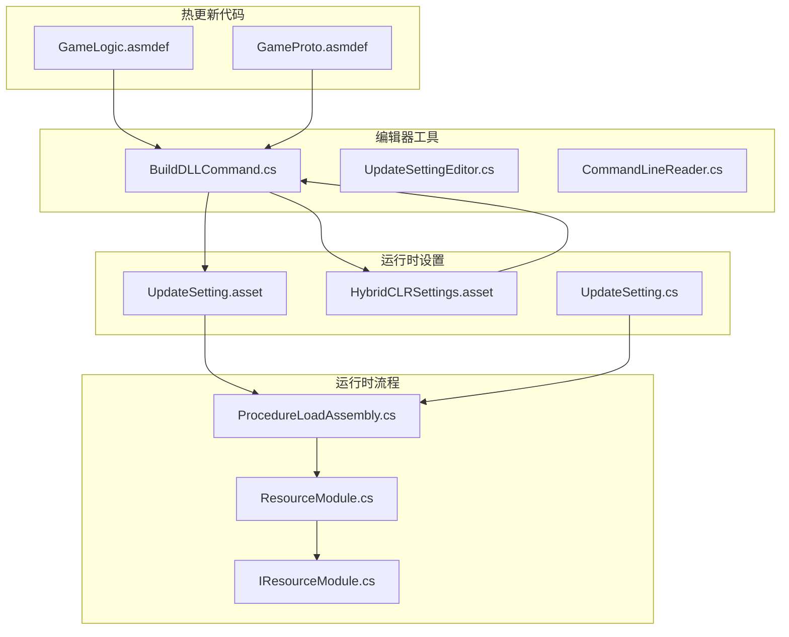
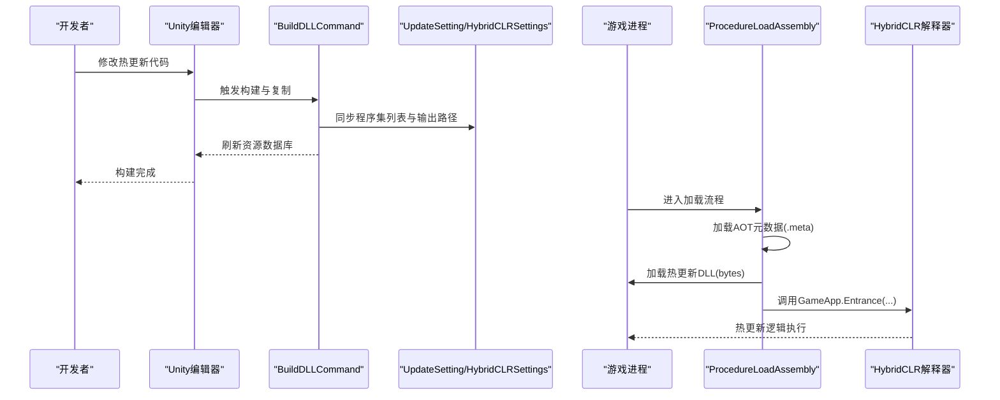
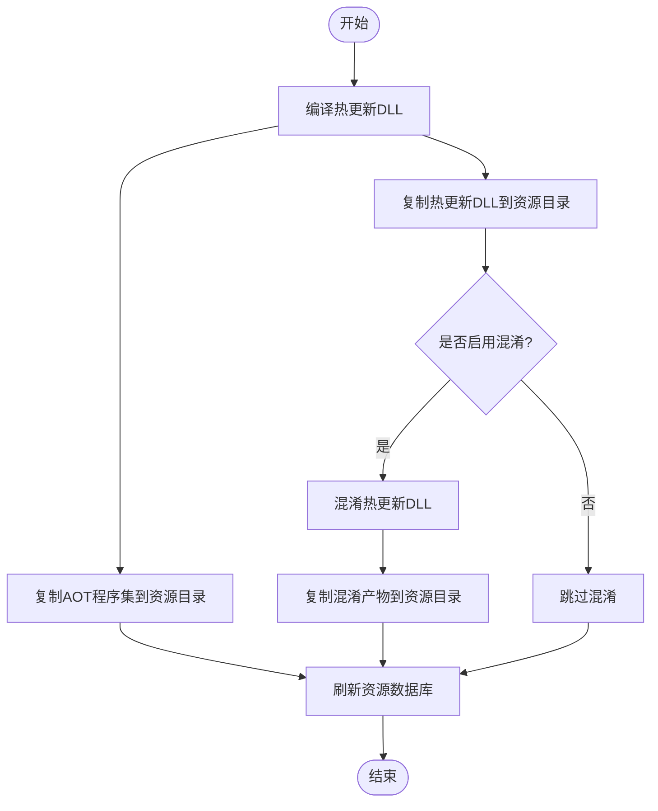
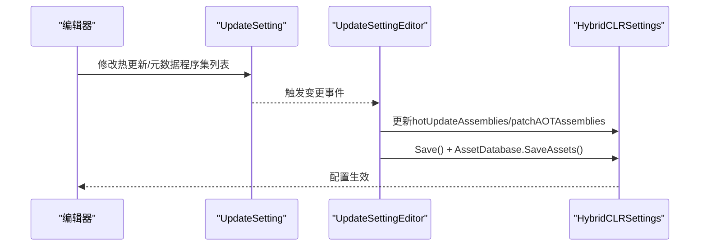
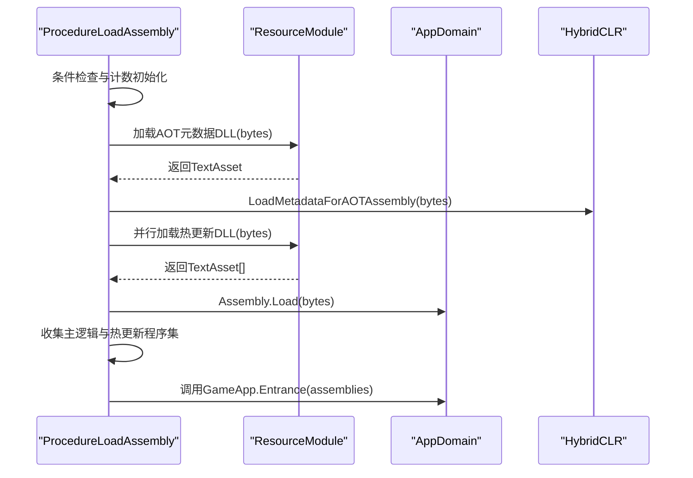
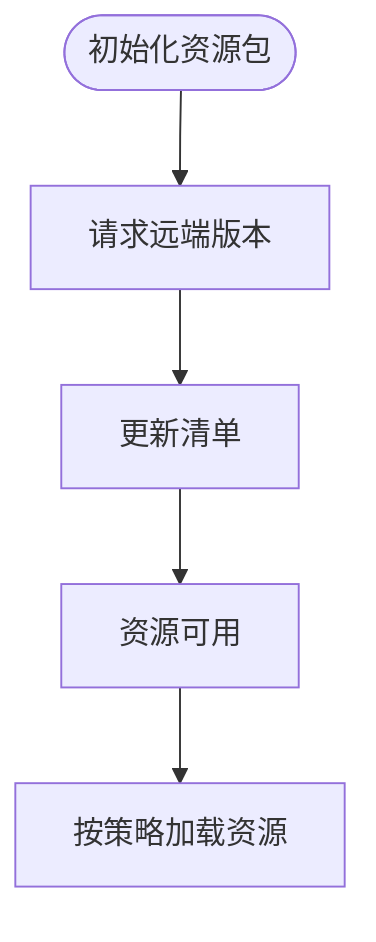
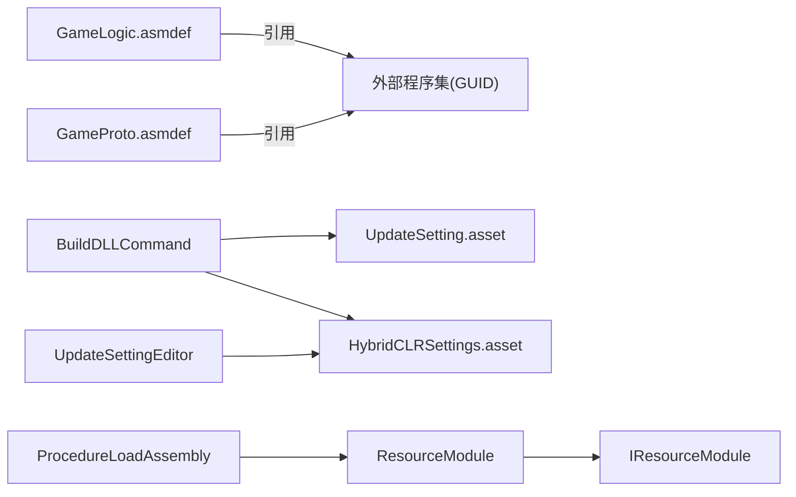

# 热更新开发流程

<cite>
**本文引用的文件**
- [BuildDLLCommand.cs](file://Assets/TEngine/Editor/HybridCLR/BuildDLLCommand.cs)
- [UpdateSettingEditor.cs](file://Assets/TEngine/Editor/Utility/UpdateSettingEditor.cs)
- [ProcedureLoadAssembly.cs](file://Assets/GameScripts/Procedure/ProcedureLoadAssembly.cs)
- [UpdateSetting.asset](file://Assets/TEngine/Settings/UpdateSetting.asset)
- [HybridCLRSettings.asset](file://ProjectSettings/HybridCLRSettings.asset)
- [UpdateSetting.cs](file://Assets/TEngine/Runtime/Core/UpdateSetting.cs)
- [GameLogic.asmdef](file://Assets/GameScripts/HotFix/GameLogic/GameLogic.asmdef)
- [GameProto.asmdef](file://Assets/GameScripts/HotFix/GameProto/GameProto.asmdef)
- [GameApp.cs](file://Assets/GameScripts/HotFix/GameLogic/GameApp.cs)
- [ResourceModule.cs](file://Assets/TEngine/Runtime/Module/ResourceModule/ResourceModule.cs)
- [IResourceModule.cs](file://Assets/TEngine/Runtime/Module/ResourceModule/IResourceModule.cs)
- [CommandLineReader.cs](file://Assets/TEngine/Editor/Utility/CommandLineReader.cs)
- [systemPatterns.md](file://memory-bank/systemPatterns.md)
</cite>

## 目录
1. [引言](#引言)
2. [项目结构](#项目结构)
3. [核心组件](#核心组件)
4. [架构总览](#架构总览)
5. [详细组件分析](#详细组件分析)
6. [依赖关系分析](#依赖关系分析)
7. [性能考量](#性能考量)
8. [故障排查指南](#故障排查指南)
9. [结论](#结论)
10. [附录](#附录)

## 引言
本指南面向使用 HybridCLR 的 Unity 项目，提供从代码修改到热更新包发布的端到端实践流程。内容覆盖代码编写、编译配置、程序集生成、资源打包、AOT 元数据补充、JIT 加载、热更新包发布与分发、版本管理与回滚策略、调试与性能监控、兼容性处理以及最佳实践与常见问题排查。

## 项目结构
本项目采用模块化与分层组织方式：
- 热更新代码位于 GameScripts/HotFix 下，按功能拆分为 GameProto、GameLogic 等程序集，便于独立更新与依赖管理。
- 编辑器工具位于 Assets/TEngine/Editor，包含构建脚本、设置同步与命令行参数解析等。
- 运行时设置位于 Assets/TEngine/Settings，包含热更新程序集列表、AOT 元数据程序集、下载地址、打包路径等。
- 程序集定义文件 .asmdef 决定编译范围与依赖约束，确保热更新域与主工程隔离。

**图表来源**
- [BuildDLLCommand.cs:1-174](file://Assets/TEngine/Editor/HybridCLR/BuildDLLCommand.cs#L1-L174)
- [UpdateSettingEditor.cs:40-106](file://Assets/TEngine/Editor/Utility/UpdateSettingEditor.cs#L40-L106)
- [ProcedureLoadAssembly.cs:1-294](file://Assets/GameScripts/Procedure/ProcedureLoadAssembly.cs#L1-L294)
- [UpdateSetting.asset:1-37](file://Assets/TEngine/Settings/UpdateSetting.asset#L1-L37)
- [HybridCLRSettings.asset:1-39](file://ProjectSettings/HybridCLRSettings.asset#L1-L39)
- [UpdateSetting.cs:50-220](file://Assets/TEngine/Runtime/Core/UpdateSetting.cs#L50-L220)
- [ResourceModule.cs:224-343](file://Assets/TEngine/Runtime/Module/ResourceModule/ResourceModule.cs#L224-L343)
- [IResourceModule.cs:48-344](file://Assets/TEngine/Runtime/Module/ResourceModule/IResourceModule.cs#L48-L344)

**章节来源**
- [GameLogic.asmdef:1-31](file://Assets/GameScripts/HotFix/GameLogic/GameLogic.asmdef#L1-L31)
- [GameProto.asmdef:1-7](file://Assets/GameScripts/HotFix/GameProto/GameProto.asmdef#L1-L7)
- [systemPatterns.md:317-363](file://memory-bank/systemPatterns.md#L317-L363)

## 核心组件
- 程序集定义与依赖
  - GameLogic.asmdef 与 GameProto.asmdef 定义了热更新域的编译边界与引用集合，确保热更新代码与主工程解耦。
- 热更新设置
  - UpdateSetting.asset 与 UpdateSetting.cs 提供热更新开关、程序集列表、AOT 元数据列表、下载地址、打包路径等配置。
- 构建与打包
  - BuildDLLCommand.cs 负责编译 DLL、复制 AOT 与热更新程序集到资源目录、可选混淆与刷新资源数据库。
  - UpdateSettingEditor.cs 同步 UpdateSetting 与 HybridCLRSettings，保证运行时与编辑器配置一致。
- 运行时加载
  - ProcedureLoadAssembly.cs 实现热更新程序集与 AOT 元数据的加载、校验与入口调用。
  - ResourceModule.cs 与 IResourceModule.cs 提供资源包初始化、清单更新与远程下载能力。

**章节来源**
- [GameLogic.asmdef:1-31](file://Assets/GameScripts/HotFix/GameLogic/GameLogic.asmdef#L1-L31)
- [UpdateSetting.asset:15-37](file://Assets/TEngine/Settings/UpdateSetting.asset#L15-L37)
- [UpdateSetting.cs:50-220](file://Assets/TEngine/Runtime/Core/UpdateSetting.cs#L50-L220)
- [BuildDLLCommand.cs:86-174](file://Assets/TEngine/Editor/HybridCLR/BuildDLLCommand.cs#L86-L174)
- [UpdateSettingEditor.cs:40-106](file://Assets/TEngine/Editor/Utility/UpdateSettingEditor.cs#L40-L106)
- [ProcedureLoadAssembly.cs:42-294](file://Assets/GameScripts/Procedure/ProcedureLoadAssembly.cs#L42-L294)
- [ResourceModule.cs:224-343](file://Assets/TEngine/Runtime/Module/ResourceModule/ResourceModule.cs#L224-L343)
- [IResourceModule.cs:48-344](file://Assets/TEngine/Runtime/Module/ResourceModule/IResourceModule.cs#L48-L344)

## 架构总览
热更新整体流程分为“构建期”和“运行时”两个阶段：
- 构建期：通过 BuildDLLCommand 编译热更新 DLL，复制至资源目录，必要时进行混淆；同时同步 HybridCLRSettings。
- 运行时：ProcedureLoadAssembly 加载 AOT 元数据与热更新 DLL，组装入口 GameApp.Entrance 并启动业务逻辑。

**图表来源**
- [BuildDLLCommand.cs:86-174](file://Assets/TEngine/Editor/HybridCLR/BuildDLLCommand.cs#L86-L174)
- [UpdateSettingEditor.cs:40-106](file://Assets/TEngine/Editor/Utility/UpdateSettingEditor.cs#L40-L106)
- [ProcedureLoadAssembly.cs:50-150](file://Assets/GameScripts/Procedure/ProcedureLoadAssembly.cs#L50-L150)
- [GameApp.cs:25-34](file://Assets/GameScripts/HotFix/GameLogic/GameApp.cs#L25-L34)

## 详细组件分析

### 组件一：构建与打包（BuildDLLCommand）
职责与流程要点：
- 编译热更新 DLL，并复制 AOT 与热更新程序集到 UpdateSetting 中指定的资源路径。
- 支持可选混淆流程，按配置选择混淆或未混淆产物。
- 最终刷新资源数据库，确保运行时可加载。

关键行为与路径：
- 编译与复制：[BuildDLLCommand.cs:86-174](file://Assets/TEngine/Editor/HybridCLR/BuildDLLCommand.cs#L86-L174)
- AOT 复制：[BuildDLLCommand.cs:136-156](file://Assets/TEngine/Editor/HybridCLR/BuildDLLCommand.cs#L136-L156)
- 热更新复制：[BuildDLLCommand.cs:158-173](file://Assets/TEngine/Editor/HybridCLR/BuildDLLCommand.cs#L158-L173)
- 混淆与拷贝：[BuildDLLCommand.cs:104-134](file://Assets/TEngine/Editor/HybridCLR/BuildDLLCommand.cs#L104-L134)

**图表来源**
- [BuildDLLCommand.cs:86-174](file://Assets/TEngine/Editor/HybridCLR/BuildDLLCommand.cs#L86-L174)

**章节来源**
- [BuildDLLCommand.cs:86-174](file://Assets/TEngine/Editor/HybridCLR/BuildDLLCommand.cs#L86-L174)

### 组件二：设置同步（UpdateSettingEditor）
职责与流程要点：
- 当 UpdateSetting 中的热更新程序集或 AOT 元数据发生变化时，同步到 HybridCLRSettings，确保运行时配置一致。
- 提供 ForceUpdateAssemblies 方法，强制刷新 HybridCLRSettings。

关键行为与路径：
- 设置变更检测与同步：[UpdateSettingEditor.cs:40-71](file://Assets/TEngine/Editor/Utility/UpdateSettingEditor.cs#L40-L71)
- 强制刷新：[UpdateSettingEditor.cs:74-106](file://Assets/TEngine/Editor/Utility/UpdateSettingEditor.cs#L74-L106)
- HybridCLRSettings 保存与刷新：[UpdateSettingEditor.cs:63-70](file://Assets/TEngine/Editor/Utility/UpdateSettingEditor.cs#L63-L70)

**图表来源**
- [UpdateSettingEditor.cs:40-106](file://Assets/TEngine/Editor/Utility/UpdateSettingEditor.cs#L40-L106)
- [HybridCLRSettings.asset:15-39](file://ProjectSettings/HybridCLRSettings.asset#L15-L39)

**章节来源**
- [UpdateSettingEditor.cs:40-106](file://Assets/TEngine/Editor/Utility/UpdateSettingEditor.cs#L40-L106)
- [HybridCLRSettings.asset:15-39](file://ProjectSettings/HybridCLRSettings.asset#L15-L39)

### 组件三：运行时加载（ProcedureLoadAssembly）
职责与流程要点：
- 在启用热更新且非编辑器模拟模式下，从资源加载 AOT 元数据与热更新 DLL。
- 使用 Assembly.Load 将 bytes 加载为程序集，收集主业务逻辑与热更新程序集列表。
- 调用 GameApp.Entrance 并传入热更新程序集列表，启动业务逻辑。

关键行为与路径：
- 加载流程入口与条件分支：[ProcedureLoadAssembly.cs:42-108](file://Assets/GameScripts/Procedure/ProcedureLoadAssembly.cs#L42-L108)
- 加载热更新 DLL 成功回调：[ProcedureLoadAssembly.cs:185-218](file://Assets/GameScripts/Procedure/ProcedureLoadAssembly.cs#L185-L218)
- 加载 AOT 元数据流程：[ProcedureLoadAssembly.cs:224-292](file://Assets/GameScripts/Procedure/ProcedureLoadAssembly.cs#L224-L292)
- 入口调用与状态切换：[ProcedureLoadAssembly.cs:124-150](file://Assets/GameScripts/Procedure/ProcedureLoadAssembly.cs#L124-L150)

**图表来源**
- [ProcedureLoadAssembly.cs:50-150](file://Assets/GameScripts/Procedure/ProcedureLoadAssembly.cs#L50-L150)
- [ProcedureLoadAssembly.cs:185-218](file://Assets/GameScripts/Procedure/ProcedureLoadAssembly.cs#L185-L218)
- [ProcedureLoadAssembly.cs:224-292](file://Assets/GameScripts/Procedure/ProcedureLoadAssembly.cs#L224-L292)
- [GameApp.cs:25-34](file://Assets/GameScripts/HotFix/GameLogic/GameApp.cs#L25-L34)

**章节来源**
- [ProcedureLoadAssembly.cs:42-294](file://Assets/GameScripts/Procedure/ProcedureLoadAssembly.cs#L42-L294)
- [GameApp.cs:25-34](file://Assets/GameScripts/HotFix/GameLogic/GameApp.cs#L25-L34)

### 组件四：资源包与远程下载（ResourceModule / IResourceModule）
职责与流程要点：
- 初始化资源包、请求并更新清单、设置远程下载地址与备用地址。
- 支持 WebGL 平台的本地与远程加载策略。

关键行为与路径：
- 初始化与清单更新：[ResourceModule.cs:224-261](file://Assets/TEngine/Runtime/Module/ResourceModule/ResourceModule.cs#L224-L261)
- 版本请求与清单更新：[ResourceModule.cs:315-341](file://Assets/TEngine/Runtime/Module/ResourceModule/ResourceModule.cs#L315-L341)
- 接口定义与远程地址设置：[IResourceModule.cs:48-344](file://Assets/TEngine/Runtime/Module/ResourceModule/IResourceModule.cs#L48-L344)

**图表来源**
- [ResourceModule.cs:224-343](file://Assets/TEngine/Runtime/Module/ResourceModule/ResourceModule.cs#L224-L343)
- [IResourceModule.cs:48-344](file://Assets/TEngine/Runtime/Module/ResourceModule/IResourceModule.cs#L48-L344)

**章节来源**
- [ResourceModule.cs:224-343](file://Assets/TEngine/Runtime/Module/ResourceModule/ResourceModule.cs#L224-L343)
- [IResourceModule.cs:48-344](file://Assets/TEngine/Runtime/Module/ResourceModule/IResourceModule.cs#L48-L344)

### 组件五：热更新设置（UpdateSetting）
职责与流程要点：
- 提供热更新开关、程序集列表、AOT 元数据列表、下载地址、打包路径、WebGL 加载策略等配置。
- 配置项与默认值均在 UpdateSetting.asset 与 UpdateSetting.cs 中定义。

关键行为与路径：
- 配置项定义与默认值：[UpdateSetting.asset:15-37](file://Assets/TEngine/Settings/UpdateSetting.asset#L15-L37)
- 运行时配置与平台名称：[UpdateSetting.cs:50-220](file://Assets/TEngine/Runtime/Core/UpdateSetting.cs#L50-L220)

**章节来源**
- [UpdateSetting.asset:15-37](file://Assets/TEngine/Settings/UpdateSetting.asset#L15-L37)
- [UpdateSetting.cs:50-220](file://Assets/TEngine/Runtime/Core/UpdateSetting.cs#L50-L220)

### 组件六：程序集定义（.asmdef）
职责与流程要点：
- GameLogic.asmdef 与 GameProto.asmdef 定义了热更新域的编译边界、引用集合与版本定义，确保热更新代码与主工程隔离。

关键行为与路径：
- GameLogic.asmdef：[GameLogic.asmdef:1-31](file://Assets/GameScripts/HotFix/GameLogic/GameLogic.asmdef#L1-L31)
- GameProto.asmdef：[GameProto.asmdef:1-7](file://Assets/GameScripts/HotFix/GameProto/GameProto.asmdef#L1-L7)

**章节来源**
- [GameLogic.asmdef:1-31](file://Assets/GameScripts/HotFix/GameLogic/GameLogic.asmdef#L1-L31)
- [GameProto.asmdef:1-7](file://Assets/GameScripts/HotFix/GameProto/GameProto.asmdef#L1-L7)

## 依赖关系分析
- 程序集依赖
  - GameLogic.asmdef 通过 GUID 引用多个外部程序集，确保热更新域具备运行时能力。
- 编辑器与运行时耦合
  - UpdateSettingEditor 与 BuildDLLCommand 通过 HybridCLRSettings 与 UpdateSetting 协同，保证构建期与运行时配置一致。
- 资源加载依赖
  - ProcedureLoadAssembly 依赖 ResourceModule 完成资源包初始化与清单更新，再进行热更新 DLL 加载。

**图表来源**
- [GameLogic.asmdef:1-31](file://Assets/GameScripts/HotFix/GameLogic/GameLogic.asmdef#L1-L31)
- [GameProto.asmdef:1-7](file://Assets/GameScripts/HotFix/GameProto/GameProto.asmdef#L1-L7)
- [BuildDLLCommand.cs:86-174](file://Assets/TEngine/Editor/HybridCLR/BuildDLLCommand.cs#L86-L174)
- [UpdateSettingEditor.cs:40-106](file://Assets/TEngine/Editor/Utility/UpdateSettingEditor.cs#L40-L106)
- [ProcedureLoadAssembly.cs:42-294](file://Assets/GameScripts/Procedure/ProcedureLoadAssembly.cs#L42-L294)
- [ResourceModule.cs:224-343](file://Assets/TEngine/Runtime/Module/ResourceModule/ResourceModule.cs#L224-L343)
- [IResourceModule.cs:48-344](file://Assets/TEngine/Runtime/Module/ResourceModule/IResourceModule.cs#L48-L344)

**章节来源**
- [GameLogic.asmdef:1-31](file://Assets/GameScripts/HotFix/GameLogic/GameLogic.asmdef#L1-L31)
- [GameProto.asmdef:1-7](file://Assets/GameScripts/HotFix/GameProto/GameProto.asmdef#L1-L7)
- [BuildDLLCommand.cs:86-174](file://Assets/TEngine/Editor/HybridCLR/BuildDLLCommand.cs#L86-L174)
- [UpdateSettingEditor.cs:40-106](file://Assets/TEngine/Editor/Utility/UpdateSettingEditor.cs#L40-L106)
- [ProcedureLoadAssembly.cs:42-294](file://Assets/GameScripts/Procedure/ProcedureLoadAssembly.cs#L42-L294)
- [ResourceModule.cs:224-343](file://Assets/TEngine/Runtime/Module/ResourceModule/ResourceModule.cs#L224-L343)
- [IResourceModule.cs:48-344](file://Assets/TEngine/Runtime/Module/ResourceModule/IResourceModule.cs#L48-L344)

## 性能考量
- 程序集加载
  - 使用 Assembly.Load 加载 bytes，避免磁盘 IO；建议在空闲时段或离线阶段进行批量加载。
- 资源包初始化
  - 先初始化资源包，再请求并更新清单，减少网络阻塞对首帧的影响。
- WebGL 加载策略
  - 根据 UpdateSetting 的 LoadResWayWebGL 设置选择本地或远程资源，平衡加载速度与稳定性。
- AOT 元数据补充
  - 仅加载必要的 AOT 元数据，避免一次性加载过多导致内存峰值。

[本节为通用指导，无需列出具体文件来源]

## 故障排查指南
- 程序集缺失或加载失败
  - 确认 UpdateSetting 中的 LogicMainDllName 与热更新 DLL 名称一致，且资源目录下存在对应 .bytes 文件。
  - 检查 BuildDLLCommand 是否正确复制 DLL 至 UpdateSetting.AssemblyTextAssetPath。
  - 关注 ProcedureLoadAssembly 的异常日志与 Fatal 输出。
  - 参考：[ProcedureLoadAssembly.cs:130-150](file://Assets/GameScripts/Procedure/ProcedureLoadAssembly.cs#L130-L150)
- AOT 元数据加载错误
  - 确认 AOT 元数据 DLL 与构建后裁剪版本一致，且存在于资源目录。
  - 检查 LoadMetadataForAOTAssembly 的返回码与日志。
  - 参考：[ProcedureLoadAssembly.cs:224-292](file://Assets/GameScripts/Procedure/ProcedureLoadAssembly.cs#L224-L292)
- 资源包初始化失败
  - 检查 ResourceModule 的初始化与清单更新流程，确认远端地址与备用地址配置正确。
  - 参考：[ResourceModule.cs:224-261](file://Assets/TEngine/Runtime/Module/ResourceModule/ResourceModule.cs#L224-L261)
- 构建期配置不同步
  - 使用 UpdateSettingEditor 同步 UpdateSetting 与 HybridCLRSettings，必要时调用 ForceUpdateAssemblies。
  - 参考：[UpdateSettingEditor.cs:40-106](file://Assets/TEngine/Editor/Utility/UpdateSettingEditor.cs#L40-L106)
- 命令行参数与自动化
  - 使用 CommandLineReader 读取自定义参数，配合自动化流水线控制版本号与输出目录。
  - 参考：[CommandLineReader.cs:44-121](file://Assets/TEngine/Editor/Utility/CommandLineReader.cs#L44-L121)

**章节来源**
- [ProcedureLoadAssembly.cs:130-150](file://Assets/GameScripts/Procedure/ProcedureLoadAssembly.cs#L130-L150)
- [ProcedureLoadAssembly.cs:224-292](file://Assets/GameScripts/Procedure/ProcedureLoadAssembly.cs#L224-L292)
- [ResourceModule.cs:224-261](file://Assets/TEngine/Runtime/Module/ResourceModule/ResourceModule.cs#L224-L261)
- [UpdateSettingEditor.cs:40-106](file://Assets/TEngine/Editor/Utility/UpdateSettingEditor.cs#L40-L106)
- [CommandLineReader.cs:44-121](file://Assets/TEngine/Editor/Utility/CommandLineReader.cs#L44-L121)

## 结论
通过明确的构建流程、严格的设置同步与完善的运行时加载机制，本项目实现了可靠的热更新方案。遵循本文档的流程与最佳实践，可在保证稳定性的前提下快速迭代热更新内容，并支持版本管理、增量更新与回滚策略。

[本节为总结性内容，无需列出具体文件来源]

## 附录

### 端到端流程图（代码级映射）

**图表来源**
- [BuildDLLCommand.cs:86-174](file://Assets/TEngine/Editor/HybridCLR/BuildDLLCommand.cs#L86-L174)
- [UpdateSettingEditor.cs:40-106](file://Assets/TEngine/Editor/Utility/UpdateSettingEditor.cs#L40-L106)
- [ProcedureLoadAssembly.cs:50-150](file://Assets/GameScripts/Procedure/ProcedureLoadAssembly.cs#L50-L150)
- [GameApp.cs:25-34](file://Assets/GameScripts/HotFix/GameLogic/GameApp.cs#L25-L34)