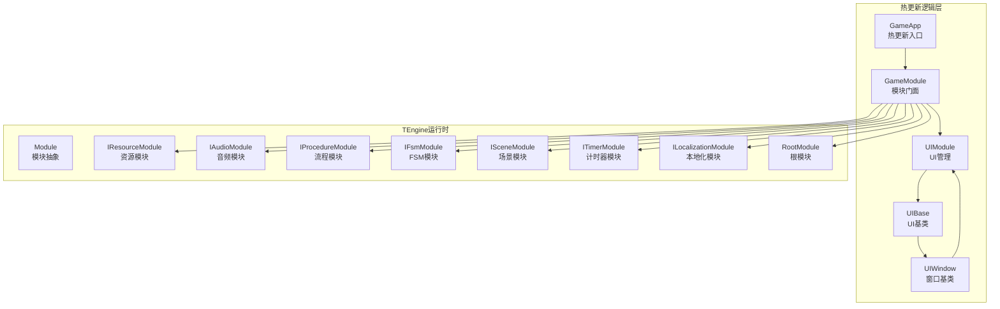
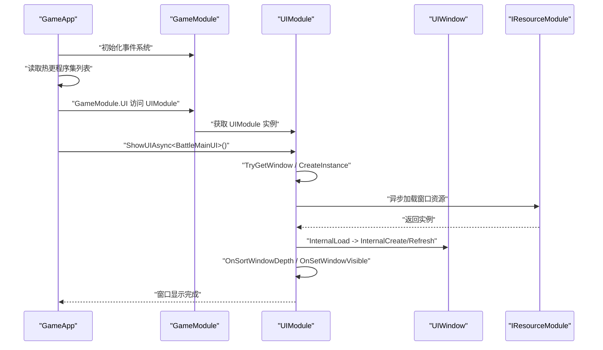
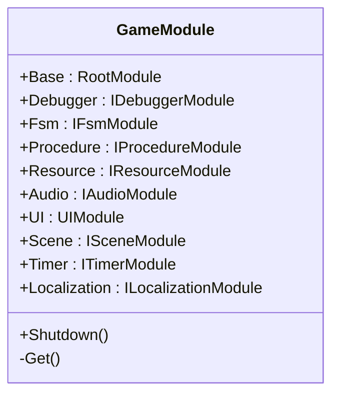
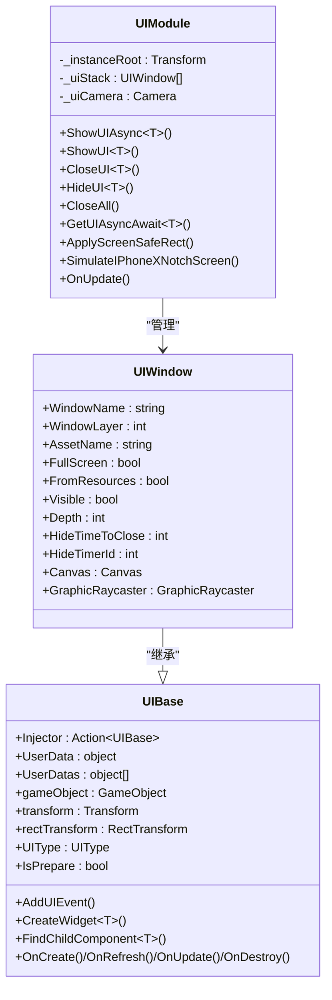
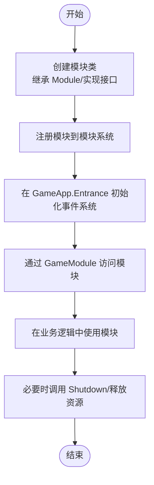
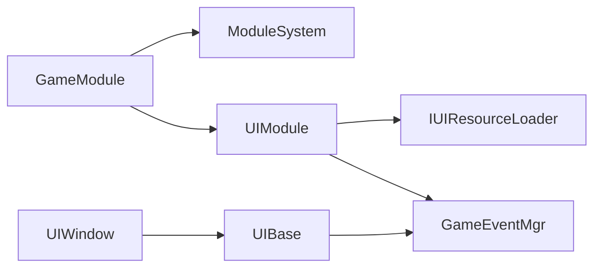

# 热更新模块开发

<cite>
**本文引用的文件**
- [GameModule.cs](file://Assets/GameScripts/HotFix/GameLogic/GameModule.cs)
- [GameApp.cs](file://Assets/GameScripts/HotFix/GameLogic/GameApp.cs)
- [Module.cs](file://Assets/TEngine/Runtime/Core/Module.cs)
- [UIModule.cs](file://Assets/GameScripts/HotFix/GameLogic/Module/UIModule/UIModule.cs)
- [UIBase.cs](file://Assets/GameScripts/HotFix/GameLogic/Module/UIModule/UIBase.cs)
- [UIWindow.cs](file://Assets/GameScripts/HotFix/GameLogic/Module/UIModule/UIWindow.cs)
</cite>

## 目录
1. [简介](#简介)
2. [项目结构](#项目结构)
3. [核心组件](#核心组件)
4. [架构总览](#架构总览)
5. [详细组件分析](#详细组件分析)
6. [依赖关系分析](#依赖关系分析)
7. [性能考虑](#性能考虑)
8. [故障排查指南](#故障排查指南)
9. [结论](#结论)
10. [附录](#附录)

## 简介
本指南面向使用 TEngine 框架进行热更新模块开发的工程师，围绕 GameModule 基类、UIModule 内置模块以及自定义热更新模块的开发流程展开，覆盖模块注册、生命周期管理、依赖注入、UI 窗口管理与组件绑定、事件处理、模块间通信与协作、与 TEngine 其他模块（资源、事件、配置等）的集成方式，并提供调试技巧、性能优化建议与模板/示例路径，帮助开发者快速上手。

## 项目结构
热更新模块位于 GameScripts/HotFix/GameLogic 下，采用“逻辑层 + 模块层”的分层组织：
- GameModule：集中暴露 TEngine 框架模块门面（RootModule、UIModule、资源、音频、流程、FSM、场景、计时器、本地化等），提供统一访问入口与释放逻辑。
- GameApp：热更新域入口，负责初始化事件系统、注册热更程序集、启动游戏逻辑、挂载释放回调。
- UIModule：UI 管理模块，负责窗口栈管理、层级排序、可见性控制、异步加载与销毁、错误日志与安全区域适配等。
- UIBase/UIWindow：UI 基类与窗口基类，提供依赖注入、成员绑定、事件注册、Widget 创建与批量管理、更新循环等能力。

图表来源
- [GameApp.cs:25-40](file://Assets/GameScripts/HotFix/GameLogic/GameApp.cs#L25-L40)
- [GameModule.cs:12-86](file://Assets/GameScripts/HotFix/GameLogic/GameModule.cs#L12-L86)
- [UIModule.cs:49-94](file://Assets/GameScripts/HotFix/GameLogic/Module/UIModule/UIModule.cs#L49-L94)
- [Module.cs:22-39](file://Assets/TEngine/Runtime/Core/Module.cs#L22-L39)

章节来源
- [GameApp.cs:17-47](file://Assets/GameScripts/HotFix/GameLogic/GameApp.cs#L17-L47)
- [GameModule.cs:5-118](file://Assets/GameScripts/HotFix/GameLogic/GameModule.cs#L5-L118)
- [UIModule.cs:15-94](file://Assets/GameScripts/HotFix/GameLogic/Module/UIModule/UIModule.cs#L15-L94)
- [Module.cs:5-40](file://Assets/TEngine/Runtime/Core/Module.cs#L5-L40)

## 核心组件
- GameModule 模块门面
  - 提供静态属性访问 RootModule、UIModule、资源、音频、流程、FSM、场景、计时器、本地化等模块。
  - 通过 ModuleSystem.GetModule<T>() 获取模块实例，并断言非空；Shutdown() 重置缓存引用，便于卸载与重载。
- GameApp 热更新入口
  - 初始化 GameEventHelper，读取热更程序集列表，注册释放回调，启动 StartGameLogic。
  - 示例中直接通过 GameModule.UI 打开 BattleMainUI。
- UIModule UI 管理
  - 单例模式，实现 IUpdate，维护窗口栈、层级排序、可见性、异步加载与销毁、安全区域适配、错误日志开关等。
  - 提供 ShowUIAsync/ShowUI、CloseUI/HideUI、CloseAll、GetUIAsyncAwait 等常用 API。
- UIBase/UIWindow UI 基类
  - UIBase：依赖注入（Injector）、成员绑定、事件注册、Widget 创建与批量管理、查找子节点/组件、可见性与层级排序、更新循环标记等。
  - UIWindow：继承 UIBase，封装 Canvas、GraphicRaycaster、可见性与交互性、深度排序、全屏窗口、隐藏延时关闭等。

章节来源
- [GameModule.cs:94-118](file://Assets/GameScripts/HotFix/GameLogic/GameModule.cs#L94-L118)
- [GameApp.cs:25-40](file://Assets/GameScripts/HotFix/GameLogic/GameApp.cs#L25-L40)
- [UIModule.cs:49-114](file://Assets/GameScripts/HotFix/GameLogic/Module/UIModule/UIModule.cs#L49-L114)
- [UIBase.cs:18-200](file://Assets/GameScripts/HotFix/GameLogic/Module/UIModule/UIBase.cs#L18-L200)
- [UIWindow.cs:11-138](file://Assets/GameScripts/HotFix/GameLogic/Module/UIModule/UIWindow.cs#L11-L138)

## 架构总览
下图展示热更新模块与 TEngine 运行时模块之间的交互关系，以及 UI 管理的关键流程。

图表来源
- [GameApp.cs:25-40](file://Assets/GameScripts/HotFix/GameLogic/GameApp.cs#L25-L40)
- [GameModule.cs:63](file://Assets/GameScripts/HotFix/GameLogic/GameModule.cs#L63)
- [UIModule.cs:249-321](file://Assets/GameScripts/HotFix/GameLogic/Module/UIModule/UIModule.cs#L249-L321)
- [UIModule.cs:518-559](file://Assets/GameScripts/HotFix/GameLogic/Module/UIModule/UIModule.cs#L518-L559)

## 详细组件分析

### GameModule 设计与使用
- 设计要点
  - 通过静态属性延迟获取模块实例，避免重复查询；在 Shutdown() 中清空引用，便于卸载与重载。
  - 通过 ModuleSystem.GetModule<T>() 获取模块，结合断言确保模块可用。
- 使用方法
  - 在热更新入口中先初始化事件系统，再通过 GameModule.UI 等访问各模块。
  - 在需要卸载或切换场景时调用 Shutdown() 重置模块引用。
- 生命周期
  - 模块生命周期由 TEngine 框架管理；GameModule 仅作为门面与释放入口。

图表来源
- [GameModule.cs:12-118](file://Assets/GameScripts/HotFix/GameLogic/GameModule.cs#L12-L118)

章节来源
- [GameModule.cs:5-118](file://Assets/GameScripts/HotFix/GameLogic/GameModule.cs#L5-L118)

### UIModule 实现与扩展
- 窗口管理
  - 维护窗口栈，支持 ShowUIAsync/ShowUI、CloseUI/HideUI、CloseAll、按层级获取顶层窗口等。
  - 通过 WindowAttribute 控制窗口层级、全屏、资源定位、隐藏延时等。
- 组件绑定与事件
  - 支持通过 Injector 进行依赖注入；提供 BindMemberProperty/RegisterEvent 等钩子。
  - 提供 AddUIEvent 系列方法注册 UI 事件，内部使用 GameEventMgr 管理。
- 资源与渲染
  - 通过 IUIResourceLoader 加载资源，支持同步与异步；支持安全区域适配与模拟异形屏。
  - 可视性与交互性通过 Canvas 层级与 GraphicRaycaster 控制。
- 扩展建议
  - 新增窗口时，推荐使用 WindowAttribute 指定资源名与层级；在 OnCreate/OnRefresh 中完成绑定与事件注册。
  - 大量 UI 更新场景，建议利用 UIBase 的更新标记机制减少每帧遍历成本。

图表来源
- [UIModule.cs:15-114](file://Assets/GameScripts/HotFix/GameLogic/Module/UIModule/UIModule.cs#L15-L114)
- [UIWindow.cs:11-138](file://Assets/GameScripts/HotFix/GameLogic/Module/UIModule/UIWindow.cs#L11-L138)
- [UIBase.cs:18-200](file://Assets/GameScripts/HotFix/GameLogic/Module/UIModule/UIBase.cs#L18-L200)

章节来源
- [UIModule.cs:249-478](file://Assets/GameScripts/HotFix/GameLogic/Module/UIModule/UIModule.cs#L249-L478)
- [UIWindow.cs:11-138](file://Assets/GameScripts/HotFix/GameLogic/Module/UIModule/UIWindow.cs#L11-L138)
- [UIBase.cs:282-332](file://Assets/GameScripts/HotFix/GameLogic/Module/UIModule/UIBase.cs#L282-L332)

### 自定义热更新模块开发流程
- 继承与注册
  - 若需新增模块，建议参考 Module 抽象类，实现 OnInit/Shutdown 并按需实现 IUpdateModule 接口。
  - 将模块注册到 TEngine 框架模块系统，以便 GameModule 通过 ModuleSystem.GetModule<T>() 获取。
- 接口实现
  - 模块应明确职责边界，避免与 UI 或业务逻辑耦合过深；必要时通过事件或服务接口解耦。
- 配置与注册
  - 在 GameApp.Entrance 中完成模块初始化与事件系统初始化，随后在业务逻辑中通过 GameModule 门面访问模块。

图表来源
- [Module.cs:22-39](file://Assets/TEngine/Runtime/Core/Module.cs#L22-L39)
- [GameApp.cs:27-34](file://Assets/GameScripts/HotFix/GameLogic/GameApp.cs#L27-L34)
- [GameModule.cs:94-118](file://Assets/GameScripts/HotFix/GameLogic/GameModule.cs#L94-L118)

章节来源
- [Module.cs:5-40](file://Assets/TEngine/Runtime/Core/Module.cs#L5-L40)
- [GameApp.cs:25-40](file://Assets/GameScripts/HotFix/GameLogic/GameApp.cs#L25-L40)
- [GameModule.cs:94-118](file://Assets/GameScripts/HotFix/GameLogic/GameModule.cs#L94-L118)

### 模块间通信与协作最佳实践
- 事件传递
  - 使用 GameEventMgr 或 GameEventHelper 进行事件注册与派发，避免强耦合。
  - UI 事件通过 AddUIEvent 系列方法注册，窗口销毁时及时释放内存池。
- 数据共享
  - 通过服务单例或模块间接口共享数据，避免全局变量污染。
  - 对于 UI 数据，可通过 UserData/UserDatas 传入窗口构造阶段。
- 依赖管理
  - 使用 GameModule 门面统一获取模块，避免在热更域内直接依赖 Unity 组件。
  - 通过 Injector 在 UI 初始化时注入服务，降低硬编码依赖。

章节来源
- [UIBase.cs:284-332](file://Assets/GameScripts/HotFix/GameLogic/Module/UIModule/UIBase.cs#L284-L332)
- [UIModule.cs:49-94](file://Assets/GameScripts/HotFix/GameLogic/Module/UIModule/UIModule.cs#L49-L94)

### 与 TEngine 框架其他模块的集成
- 资源模块（IResourceModule）
  - UIModule 通过 IUIResourceLoader 加载窗口资源，支持同步与异步；在资源未就绪时等待或超时处理。
- 事件模块（GameEvent）
  - UI 事件与全局事件分离管理，UI 事件在窗口生命周期内自动释放。
- 配置模块（ILocalizationModule）
  - 通过 GameModule.Localization 访问本地化服务，用于 UI 文本国际化。
- 其他模块（FSM、流程、场景、计时器）
  - FSM/IProcedure/IScene/ITimer 通过 GameModule 门面访问，用于驱动 UI 行为与生命周期。

章节来源
- [UIModule.cs:31](file://Assets/GameScripts/HotFix/GameLogic/Module/UIModule/UIModule.cs#L31)
- [GameModule.cs:35-86](file://Assets/GameScripts/HotFix/GameLogic/GameModule.cs#L35-L86)

## 依赖关系分析
- GameModule 依赖 ModuleSystem 获取各模块实例，并在 Shutdown() 中重置引用。
- UIModule 依赖 IUIResourceLoader 进行资源加载，依赖 GameEventMgr 管理 UI 事件。
- UIBase/UIWindow 依赖 TEngine 的 Canvas/GraphicRaycaster 等 UGUI 组件，以及 GameModule.Timer 进行定时任务。

图表来源
- [GameModule.cs:94-118](file://Assets/GameScripts/HotFix/GameLogic/GameModule.cs#L94-L118)
- [UIModule.cs:31](file://Assets/GameScripts/HotFix/GameLogic/Module/UIModule/UIModule.cs#L31)
- [UIBase.cs:284-332](file://Assets/GameScripts/HotFix/GameLogic/Module/UIModule/UIBase.cs#L284-L332)

章节来源
- [GameModule.cs:94-118](file://Assets/GameScripts/HotFix/GameLogic/GameModule.cs#L94-L118)
- [UIModule.cs:31](file://Assets/GameScripts/HotFix/GameLogic/Module/UIModule/UIModule.cs#L31)
- [UIBase.cs:284-332](file://Assets/GameScripts/HotFix/GameLogic/Module/UIModule/UIBase.cs#L284-L332)

## 性能考虑
- UI 更新优化
  - 利用 UIBase 的更新标记机制，避免每帧遍历所有 UI 组件。
  - 大批量 UI 创建/销毁时，优先使用 CreateWidgetByPathAsync 与异步调整图标数量接口，分帧处理。
- 资源加载
  - 使用 UIModule.Resource 的异步加载接口，避免阻塞主线程。
  - 合理设置 HideTimeToClose，避免频繁创建/销毁窗口。
- 事件管理
  - UI 事件在窗口销毁时释放，防止内存泄漏与回调链过长。
- 安全区域与可见性
  - ApplyScreenSafeRect 与 OnSetWindowVisible 应避免在每帧重复计算，必要时缓存结果。

## 故障排查指南
- UIRoot 未找到
  - 现象：OnInit 中提示 UIRoot not found。
  - 处理：检查场景中是否存在名为 UIRoot 的 Canvas/相机节点；确认 DontDestroyOnLoad 设置正确。
- 窗口重复创建
  - 现象：Push 时抛出已存在窗口异常。
  - 处理：确保窗口唯一标识（FullName）不冲突；复用窗口时使用 TryGetWindow。
- 资源加载超时
  - 现象：ShowUIAwaitImp 等待超过 60 秒仍未加载完成。
  - 处理：检查资源路径与资源包配置；确认 IUIResourceLoader 实现正确。
- 事件未释放
  - 现象：窗口销毁后仍有事件回调执行。
  - 处理：确保在 OnDestroy 中调用 RemoveAllUIEvent 或释放 GameEventMgr。

章节来源
- [UIModule.cs:51-61](file://Assets/GameScripts/HotFix/GameLogic/Module/UIModule/UIModule.cs#L51-L61)
- [UIModule.cs:666-673](file://Assets/GameScripts/HotFix/GameLogic/Module/UIModule/UIModule.cs#L666-L673)
- [UIModule.cs:338-364](file://Assets/GameScripts/HotFix/GameLogic/Module/UIModule/UIModule.cs#L338-L364)
- [UIBase.cs:324-332](file://Assets/GameScripts/HotFix/GameLogic/Module/UIModule/UIBase.cs#L324-L332)

## 结论
通过 GameModule 门面与 UIModule 的协同，热更新模块可以高效地接入 TEngine 框架的资源、事件、配置等能力。遵循模块化设计、事件驱动与异步加载原则，能够显著提升 UI 交互体验与开发效率。建议在实际项目中结合本文提供的模板与最佳实践，逐步完善模块体系与性能优化策略。

## 附录
- 快速上手模板与示例路径
  - 热更新入口：[GameApp.Entrance:25-34](file://Assets/GameScripts/HotFix/GameLogic/GameApp.cs#L25-L34)
  - UI 打开示例：[GameApp.StartGameLogic:36-40](file://Assets/GameScripts/HotFix/GameLogic/GameApp.cs#L36-L40)
  - UIModule 初始化：[UIModule.OnInit:49-94](file://Assets/GameScripts/HotFix/GameLogic/Module/UIModule/UIModule.cs#L49-L94)
  - 窗口打开流程（异步）：[UIModule.ShowUIAsync:249-264](file://Assets/GameScripts/HotFix/GameLogic/Module/UIModule/UIModule.cs#L249-L264)
  - 窗口打开流程（同步）：[UIModule.ShowUI:272-296](file://Assets/GameScripts/HotFix/GameLogic/Module/UIModule/UIModule.cs#L272-L296)
  - 窗口等待加载完成：[UIModule.ShowUIAwaitImp:338-364](file://Assets/GameScripts/HotFix/GameLogic/Module/UIModule/UIModule.cs#L338-L364)
  - 依赖注入钩子：[UIBase.Injector](file://Assets/GameScripts/HotFix/GameLogic/Module/UIModule/UIBase.cs#L24)
  - UI 事件注册：[UIBase.AddUIEvent:299-322](file://Assets/GameScripts/HotFix/GameLogic/Module/UIModule/UIBase.cs#L299-L322)
  - Widget 创建：[UIBase.CreateWidget:344-394](file://Assets/GameScripts/HotFix/GameLogic/Module/UIModule/UIBase.cs#L344-L394)
  - 模块生命周期抽象：[Module 抽象类:22-39](file://Assets/TEngine/Runtime/Core/Module.cs#L22-L39)