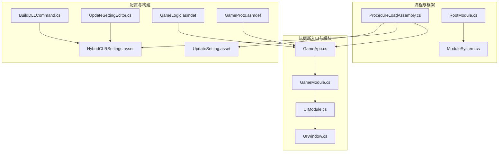
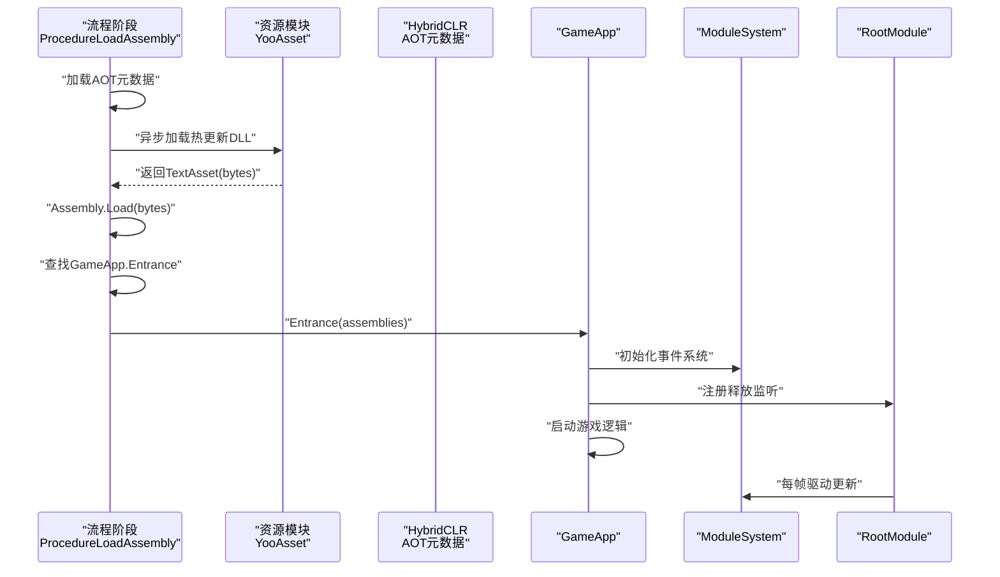
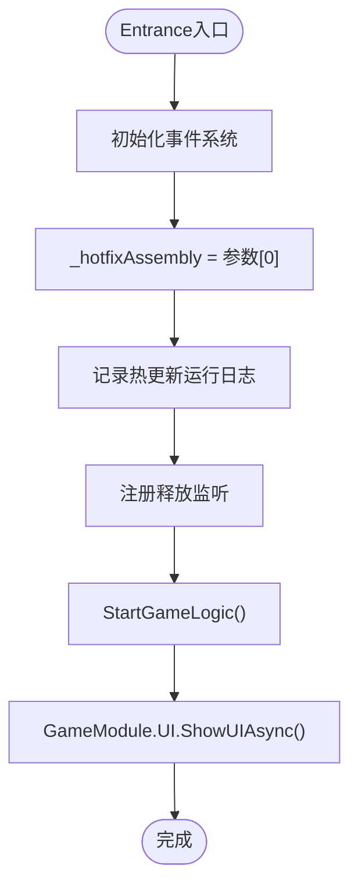
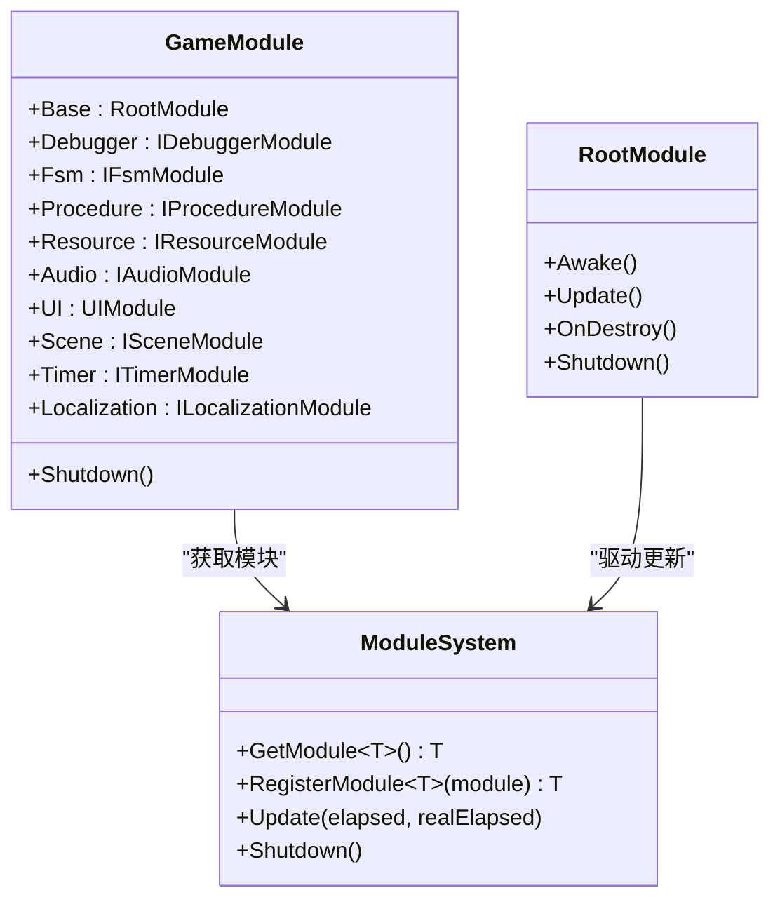
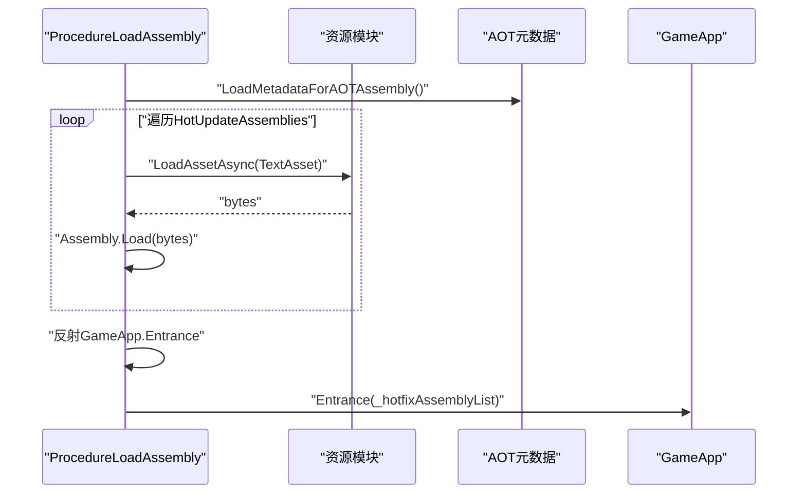
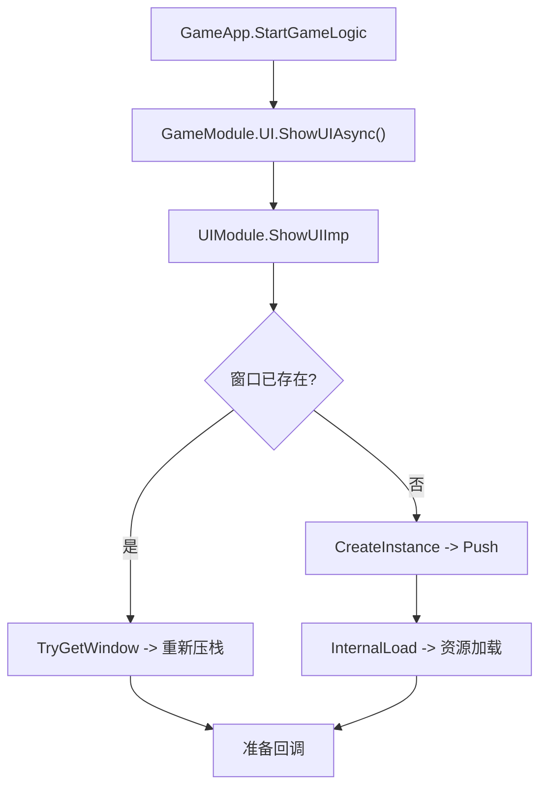
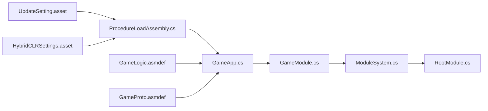

# 热更新系统

<cite>
**本文引用的文件**
- [GameApp.cs](file://Assets/GameScripts/HotFix/GameLogic/GameApp.cs)
- [GameModule.cs](file://Assets/GameScripts/HotFix/GameLogic/GameModule.cs)
- [ModuleSystem.cs](file://Assets/TEngine/Runtime/Core/ModuleSystem.cs)
- [RootModule.cs](file://Assets/TEngine/Runtime/Module/RootModule.cs)
- [ProcedureLoadAssembly.cs](file://Assets/GameScripts/Procedure/ProcedureLoadAssembly.cs)
- [HybridCLRSettings.asset](file://ProjectSettings/HybridCLRSettings.asset)
- [UpdateSetting.asset](file://Assets/TEngine/Settings/UpdateSetting.asset)
- [GameLogic.asmdef](file://Assets/GameScripts/HotFix/GameLogic/GameLogic.asmdef)
- [GameProto.asmdef](file://Assets/GameScripts/HotFix/GameProto/GameProto.asmdef)
- [UIModule.cs](file://Assets/GameScripts/HotFix/GameLogic/Module/UIModule/UIModule.cs)
- [UIWindow.cs](file://Assets/GameScripts/HotFix/GameLogic/Module/UIModule/UIWindow.cs)
- [BuildDLLCommand.cs](file://Assets/TEngine/Editor/HybridCLR/BuildDLLCommand.cs)
- [UpdateSettingEditor.cs](file://Assets/TEngine/Editor/Utility/UpdateSettingEditor.cs)
</cite>

## 目录
1. [简介](#简介)
2. [项目结构](#项目结构)
3. [核心组件](#核心组件)
4. [架构总览](#架构总览)
5. [详细组件分析](#详细组件分析)
6. [依赖关系分析](#依赖关系分析)
7. [性能考量](#性能考量)
8. [故障排查指南](#故障排查指南)
9. [结论](#结论)
10. [附录](#附录)

## 简介
本文件面向TEngine热更新系统，围绕HybridCLR的AOT/JIT混合编译、程序集加载与类型反射、GameApp热更新入口、模块体系与UI交互、以及从代码修改到热更新包发布的完整工作流进行系统性技术说明，并提供调试、性能优化与安全最佳实践。

## 项目结构
TEngine热更新相关代码主要分布在以下区域：
- 热更新入口与模块：GameApp、GameModule、UIModule、UIWindow
- 程序集加载流程：ProcedureLoadAssembly（流程阶段）
- 框架模块系统：ModuleSystem、RootModule
- 编辑器构建与配置：HybridCLRSettings、UpdateSetting、BuildDLLCommand、UpdateSettingEditor
- 程序集定义：GameLogic.asmdef、GameProto.asmdef

图表来源
- [GameApp.cs:1-47](file://Assets/GameScripts/HotFix/GameLogic/GameApp.cs#L1-L47)
- [GameModule.cs:1-118](file://Assets/GameScripts/HotFix/GameLogic/GameModule.cs#L1-L118)
- [UIModule.cs:219-642](file://Assets/GameScripts/HotFix/GameLogic/Module/UIModule/UIModule.cs#L219-L642)
- [UIWindow.cs:296-334](file://Assets/GameScripts/HotFix/GameLogic/Module/UIModule/UIWindow.cs#L296-L334)
- [ProcedureLoadAssembly.cs:1-294](file://Assets/GameScripts/Procedure/ProcedureLoadAssembly.cs#L1-L294)
- [ModuleSystem.cs:1-208](file://Assets/TEngine/Runtime/Core/ModuleSystem.cs#L1-L208)
- [RootModule.cs:1-304](file://Assets/TEngine/Runtime/Module/RootModule.cs#L1-L304)
- [HybridCLRSettings.asset:1-39](file://ProjectSettings/HybridCLRSettings.asset#L1-L39)
- [UpdateSetting.asset:1-37](file://Assets/TEngine/Settings/UpdateSetting.asset#L1-L37)
- [BuildDLLCommand.cs:80-117](file://Assets/TEngine/Editor/HybridCLR/BuildDLLCommand.cs#L80-L117)
- [UpdateSettingEditor.cs:40-95](file://Assets/TEngine/Editor/Utility/UpdateSettingEditor.cs#L40-L95)
- [GameLogic.asmdef:1-31](file://Assets/GameScripts/HotFix/GameLogic/GameLogic.asmdef#L1-L31)
- [GameProto.asmdef:1-20](file://Assets/GameScripts/HotFix/GameProto/GameProto.asmdef#L1-L20)

章节来源
- [GameApp.cs:1-47](file://Assets/GameScripts/HotFix/GameLogic/GameApp.cs#L1-L47)
- [ProcedureLoadAssembly.cs:1-294](file://Assets/GameScripts/Procedure/ProcedureLoadAssembly.cs#L1-L294)
- [HybridCLRSettings.asset:1-39](file://ProjectSettings/HybridCLRSettings.asset#L1-L39)
- [UpdateSetting.asset:1-37](file://Assets/TEngine/Settings/UpdateSetting.asset#L1-L37)

## 核心组件
- 热更新入口 GameApp：负责接收热更新程序集列表、初始化事件系统、注册释放监听、启动游戏逻辑。
- 模块访问门面 GameModule：统一获取各类框架模块（UI、资源、流程、音频、本地化等），内部通过ModuleSystem解析接口类型并动态创建实现。
- 模块系统 ModuleSystem：基于接口类型映射创建模块实例，维护模块链表与更新队列，支持优先级排序与按需刷新。
- 根模块 RootModule：挂载于场景的根节点，负责初始化文本/日志/JSON辅助器、帧率与时间缩放、低内存事件处理，并驱动模块系统更新。
- 程序集加载流程 ProcedureLoadAssembly：在流程阶段中异步加载AOT元数据与热更新DLL，最终反射调用GameApp.Entrance进入热更新逻辑。
- 配置 UpdateSetting 与 HybridCLRSettings：定义热更新程序集、AOT补丁集合、输出路径、扩展名等；编辑器工具同步配置到HybridCLRSettings。
- UI模块 UIModule 与窗口 UIWindow：提供异步/同步打开窗口、资源加载、生命周期回调等能力。

章节来源
- [GameApp.cs:17-47](file://Assets/GameScripts/HotFix/GameLogic/GameApp.cs#L17-L47)
- [GameModule.cs:5-118](file://Assets/GameScripts/HotFix/GameLogic/GameModule.cs#L5-L118)
- [ModuleSystem.cs:9-208](file://Assets/TEngine/Runtime/Core/ModuleSystem.cs#L9-L208)
- [RootModule.cs:10-304](file://Assets/TEngine/Runtime/Module/RootModule.cs#L10-L304)
- [ProcedureLoadAssembly.cs:50-150](file://Assets/GameScripts/Procedure/ProcedureLoadAssembly.cs#L50-L150)
- [UpdateSetting.asset:16-37](file://Assets/TEngine/Settings/UpdateSetting.asset#L16-L37)
- [HybridCLRSettings.asset:20-39](file://ProjectSettings/HybridCLRSettings.asset#L20-L39)
- [UIModule.cs:245-321](file://Assets/GameScripts/HotFix/GameLogic/Module/UIModule/UIModule.cs#L245-L321)
- [UIWindow.cs:314-334](file://Assets/GameScripts/HotFix/GameLogic/Module/UIModule/UIWindow.cs#L314-L334)

## 架构总览
下图展示从流程阶段到热更新入口的调用链路，以及模块系统的初始化与更新机制。

图表来源
- [ProcedureLoadAssembly.cs:50-150](file://Assets/GameScripts/Procedure/ProcedureLoadAssembly.cs#L50-L150)
- [GameApp.cs:25-40](file://Assets/GameScripts/HotFix/GameLogic/GameApp.cs#L25-L40)
- [ModuleSystem.cs:29-60](file://Assets/TEngine/Runtime/Core/ModuleSystem.cs#L29-L60)
- [RootModule.cs:140-144](file://Assets/TEngine/Runtime/Module/RootModule.cs#L140-L144)

## 详细组件分析

### HybridCLR工作原理与集成要点
- AOT/JIT混合编译
  - AOT元数据补丁：通过加载裁剪后的AOT DLL对应的元数据，使泛型方法在缺少原生实现时自动降级为解释执行，保证兼容性。
  - 热更新DLL：在编辑器或运行时加载，参与反射与类型初始化。
- 程序集加载
  - 使用Assembly.Load加载TextAsset字节，结合YooAsset异步加载，避免阻塞主线程。
  - 支持Addressable与非Addressable两种加载路径。
- 类型反射
  - 通过主逻辑DLL反射定位GameApp类型与Entrance方法，传递热更新程序集列表作为参数。
- 配置与构建
  - UpdateSetting定义热更新DLL与AOT补丁集合、输出扩展名与路径。
  - HybridCLRSettings定义热更新DLL输出根目录、AOT补丁集合、链接文件与AOT泛型引用文件。
  - 编辑器命令BuildDLLCommand与UpdateSettingEditor负责编译、拷贝与同步配置。

章节来源
- [ProcedureLoadAssembly.cs:55-108](file://Assets/GameScripts/Procedure/ProcedureLoadAssembly.cs#L55-L108)
- [ProcedureLoadAssembly.cs:184-218](file://Assets/GameScripts/Procedure/ProcedureLoadAssembly.cs#L184-L218)
- [ProcedureLoadAssembly.cs:224-292](file://Assets/GameScripts/Procedure/ProcedureLoadAssembly.cs#L224-L292)
- [UpdateSetting.asset:16-37](file://Assets/TEngine/Settings/UpdateSetting.asset#L16-L37)
- [HybridCLRSettings.asset:20-39](file://ProjectSettings/HybridCLRSettings.asset#L20-L39)
- [BuildDLLCommand.cs:86-117](file://Assets/TEngine/Editor/HybridCLR/BuildDLLCommand.cs#L86-L117)
- [UpdateSettingEditor.cs:40-95](file://Assets/TEngine/Editor/Utility/UpdateSettingEditor.cs#L40-L95)

### GameApp热更新入口设计与实现
- 入口方法Entrance接收热更新程序集列表，初始化事件系统，记录日志，注册释放监听，随后启动游戏逻辑。
- 游戏逻辑示例：通过GameModule.UI打开BattleMainUI。
- 释放流程：在销毁监听中释放单例系统，输出释放日志。

图表来源
- [GameApp.cs:25-40](file://Assets/GameScripts/HotFix/GameLogic/GameApp.cs#L25-L40)
- [UIModule.cs:245-321](file://Assets/GameScripts/HotFix/GameLogic/Module/UIModule/UIModule.cs#L245-L321)

章节来源
- [GameApp.cs:17-47](file://Assets/GameScripts/HotFix/GameLogic/GameApp.cs#L17-L47)

### 模块体系与GameModule门面
- GameModule提供静态属性快速获取各类模块（UI、资源、流程、音频、本地化等），内部通过ModuleSystem.GetModule<T>()解析接口类型并创建实现。
- ModuleSystem维护模块字典、更新链表与执行列表，支持优先级插入与按需重建执行队列。
- RootModule作为场景根模块，负责初始化辅助器、帧率与时间缩放、低内存事件，并在每帧驱动ModuleSystem.Update。

图表来源
- [GameModule.cs:5-118](file://Assets/GameScripts/HotFix/GameLogic/GameModule.cs#L5-L118)
- [ModuleSystem.cs:67-141](file://Assets/TEngine/Runtime/Core/ModuleSystem.cs#L67-L141)
- [RootModule.cs:116-167](file://Assets/TEngine/Runtime/Module/RootModule.cs#L116-L167)

章节来源
- [GameModule.cs:5-118](file://Assets/GameScripts/HotFix/GameLogic/GameModule.cs#L5-L118)
- [ModuleSystem.cs:9-208](file://Assets/TEngine/Runtime/Core/ModuleSystem.cs#L9-L208)
- [RootModule.cs:10-304](file://Assets/TEngine/Runtime/Module/RootModule.cs#L10-L304)

### 程序集加载流程与反射调用
- 加载AOT元数据：针对AOTMetaAssemblies逐个加载对应DLL的元数据，确保泛型方法在缺失原生实现时可解释执行。
- 加载热更新DLL：根据UpdateSetting中的HotUpdateAssemblies异步加载TextAsset并Assembly.Load，收集到_hotfixAssemblyList。
- 反射调用：在主逻辑DLL中查找GameApp类型与Entrance方法，传入热更新程序集列表数组，完成热更新入口初始化。

图表来源
- [ProcedureLoadAssembly.cs:50-150](file://Assets/GameScripts/Procedure/ProcedureLoadAssembly.cs#L50-L150)
- [ProcedureLoadAssembly.cs:224-292](file://Assets/GameScripts/Procedure/ProcedureLoadAssembly.cs#L224-L292)

章节来源
- [ProcedureLoadAssembly.cs:1-294](file://Assets/GameScripts/Procedure/ProcedureLoadAssembly.cs#L1-L294)

### UI模块与窗口加载流程
- UIModule提供异步/同步打开窗口的方法，内部通过资源模块加载GameObject并初始化窗口。
- UIWindow封装窗口生命周期，支持异步加载完成回调与准备回调。
- GameApp通过GameModule.UI触发BattleMainUI打开。

图表来源
- [GameApp.cs:36-40](file://Assets/GameScripts/HotFix/GameLogic/GameApp.cs#L36-L40)
- [UIModule.cs:245-321](file://Assets/GameScripts/HotFix/GameLogic/Module/UIModule/UIModule.cs#L245-L321)
- [UIWindow.cs:314-334](file://Assets/GameScripts/HotFix/GameLogic/Module/UIModule/UIWindow.cs#L314-L334)

章节来源
- [UIModule.cs:219-642](file://Assets/GameScripts/HotFix/GameLogic/Module/UIModule/UIModule.cs#L219-L642)
- [UIWindow.cs:296-334](file://Assets/GameScripts/HotFix/GameLogic/Module/UIModule/UIWindow.cs#L296-L334)

### 程序集定义与引用关系
- GameLogic.asmdef与GameProto.asmdef分别声明对TEngine.Runtime、YooAsset、UniTask等程序集的引用，允许unsafe代码与版本宏定义。
- 热更新DLL需在UpdateSetting中显式声明，以便流程阶段正确加载。

章节来源
- [GameLogic.asmdef:1-31](file://Assets/GameScripts/HotFix/GameLogic/GameLogic.asmdef#L1-L31)
- [GameProto.asmdef:1-20](file://Assets/GameScripts/HotFix/GameProto/GameProto.asmdef#L1-L20)
- [UpdateSetting.asset:16-18](file://Assets/TEngine/Settings/UpdateSetting.asset#L16-L18)

## 依赖关系分析
- 程序集加载依赖：ProcedureLoadAssembly依赖UpdateSetting与HybridCLRSettings，通过YooAsset加载DLL并调用HybridCLR API补丁AOT元数据。
- 入口调用链：ProcedureLoadAssembly反射调用GameApp.Entrance，GameApp依赖GameModule与RootModule提供的模块系统。
- 模块系统：GameModule通过ModuleSystem解析接口类型并创建具体模块实现；RootModule驱动模块系统更新。

图表来源
- [UpdateSetting.asset:16-37](file://Assets/TEngine/Settings/UpdateSetting.asset#L16-L37)
- [HybridCLRSettings.asset:20-39](file://ProjectSettings/HybridCLRSettings.asset#L20-L39)
- [ProcedureLoadAssembly.cs:136-149](file://Assets/GameScripts/Procedure/ProcedureLoadAssembly.cs#L136-L149)
- [GameApp.cs:25-40](file://Assets/GameScripts/HotFix/GameLogic/GameApp.cs#L25-L40)
- [GameModule.cs:94-101](file://Assets/GameScripts/HotFix/GameLogic/GameModule.cs#L94-L101)
- [ModuleSystem.cs:67-89](file://Assets/TEngine/Runtime/Core/ModuleSystem.cs#L67-L89)
- [RootModule.cs:140-144](file://Assets/TEngine/Runtime/Module/RootModule.cs#L140-L144)
- [GameLogic.asmdef:1-31](file://Assets/GameScripts/HotFix/GameLogic/GameLogic.asmdef#L1-L31)
- [GameProto.asmdef:1-20](file://Assets/GameScripts/HotFix/GameProto/GameProto.asmdef#L1-L20)

章节来源
- [ProcedureLoadAssembly.cs:1-294](file://Assets/GameScripts/Procedure/ProcedureLoadAssembly.cs#L1-L294)
- [GameApp.cs:1-47](file://Assets/GameScripts/HotFix/GameLogic/GameApp.cs#L1-L47)
- [GameModule.cs:1-118](file://Assets/GameScripts/HotFix/GameLogic/GameModule.cs#L1-L118)
- [ModuleSystem.cs:1-208](file://Assets/TEngine/Runtime/Core/ModuleSystem.cs#L1-L208)
- [RootModule.cs:1-304](file://Assets/TEngine/Runtime/Module/RootModule.cs#L1-L304)

## 性能考量
- 异步加载：使用UniTask与YooAsset异步加载DLL，避免主线程卡顿。
- 元数据补丁：仅对AOT DLL补丁元数据，避免对热更新DLL重复处理。
- 模块更新：ModuleSystem按优先级维护更新链表，仅在脏标记时重建执行列表，降低开销。
- 资源卸载：加载完成后及时卸载TextAsset，减少内存占用。
- 建议
  - 控制热更新DLL数量与体积，减少反射与加载成本。
  - 将高频模块实现为IUpdateModule并合理设置优先级。
  - 对UI窗口采用延迟加载与池化策略，避免频繁创建销毁。

## 故障排查指南
- 热更新DLL缺失或路径错误
  - 确认UpdateSetting中的HotUpdateAssemblies与AOTMetaAssemblies配置正确。
  - 确认DLL已拷贝至StreamingAssets或Addressable资源路径。
- 反射失败
  - 检查主逻辑DLL中是否存在GameApp类型与Entrance方法。
  - 确保程序集名称与扩展名匹配。
- AOT元数据加载失败
  - 确认裁剪后的AOT DLL与打包时一致。
  - 检查HybridCLRSettings中的patchAOTAssemblies与输出路径。
- 编辑器配置不同步
  - 使用UpdateSettingEditor同步UpdateSetting到HybridCLRSettings。
  - 使用BuildDLLCommand执行编译与拷贝。
- 日志与断言
  - 关注GameApp与ProcedureLoadAssembly的日志输出，定位加载与反射异常。
  - GameModule在获取模块为空时会断言，检查模块注册与接口命名空间。

章节来源
- [UpdateSetting.asset:16-37](file://Assets/TEngine/Settings/UpdateSetting.asset#L16-L37)
- [HybridCLRSettings.asset:20-39](file://ProjectSettings/HybridCLRSettings.asset#L20-L39)
- [ProcedureLoadAssembly.cs:136-150](file://Assets/GameScripts/Procedure/ProcedureLoadAssembly.cs#L136-L150)
- [UpdateSettingEditor.cs:40-95](file://Assets/TEngine/Editor/Utility/UpdateSettingEditor.cs#L40-L95)
- [BuildDLLCommand.cs:86-117](file://Assets/TEngine/Editor/HybridCLR/BuildDLLCommand.cs#L86-L117)
- [GameModule.cs:94-101](file://Assets/GameScripts/HotFix/GameLogic/GameModule.cs#L94-L101)

## 结论
TEngine热更新系统通过HybridCLR实现AOT/JIT混合编译，结合流程阶段的异步程序集加载与反射调用，形成从DLL加载到入口初始化的完整链路。GameApp作为热更新入口，配合GameModule门面与ModuleSystem模块体系，实现了模块化、可扩展的热更新架构。通过合理的配置与构建流程、完善的调试与性能优化策略，可稳定支撑线上热更新需求。

## 附录

### 热更新开发工作流程（从代码修改到发布）
- 修改代码
  - 在GameLogic与GameProto工程中编写/修改逻辑与协议。
- 编译与拷贝
  - 使用BuildDLLCommand执行编译与拷贝，生成热更新DLL与AOT补丁。
- 配置同步
  - 使用UpdateSettingEditor同步UpdateSetting到HybridCLRSettings。
- 资源打包
  - 将DLL打包至StreamingAssets或Addressable资源，确保路径与扩展名正确。
- 运行验证
  - 启动游戏，观察日志与功能是否符合预期。
- 发布更新
  - 将新版本资源部署至服务器，客户端拉取并加载。

章节来源
- [BuildDLLCommand.cs:86-117](file://Assets/TEngine/Editor/HybridCLR/BuildDLLCommand.cs#L86-L117)
- [UpdateSettingEditor.cs:40-95](file://Assets/TEngine/Editor/Utility/UpdateSettingEditor.cs#L40-L95)
- [UpdateSetting.asset:28-37](file://Assets/TEngine/Settings/UpdateSetting.asset#L28-L37)

### 热更新模块开发指南
- 使用GameModule访问模块
  - 通过GameModule.UI、GameModule.Procedure等静态属性获取模块实例。
- 模块注册与依赖
  - 模块通过接口类型在ModuleSystem中注册，实现IUpdateModule可参与每帧更新。
- 依赖管理
  - 在GameLogic.asmdef与GameProto.asmdef中声明对TEngine.Runtime、YooAsset、UniTask等的引用。
- 安全与最佳实践
  - 严格控制热更新DLL数量与体积，避免过度反射。
  - 对UI窗口采用异步加载与池化，减少卡顿。
  - 在编辑器中使用断言与日志定位问题，生产环境关注异常捕获与回滚策略。

章节来源
- [GameModule.cs:5-118](file://Assets/GameScripts/HotFix/GameLogic/GameModule.cs#L5-L118)
- [ModuleSystem.cs:67-141](file://Assets/TEngine/Runtime/Core/ModuleSystem.cs#L67-L141)
- [GameLogic.asmdef:1-31](file://Assets/GameScripts/HotFix/GameLogic/GameLogic.asmdef#L1-L31)
- [GameProto.asmdef:1-20](file://Assets/GameScripts/HotFix/GameProto/GameProto.asmdef#L1-L20)