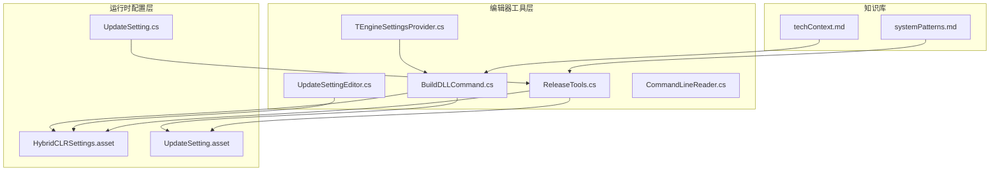
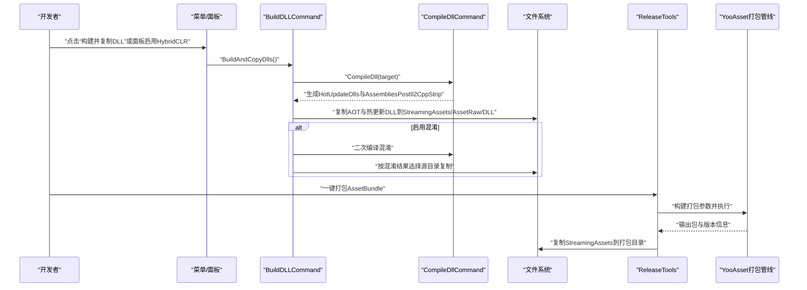
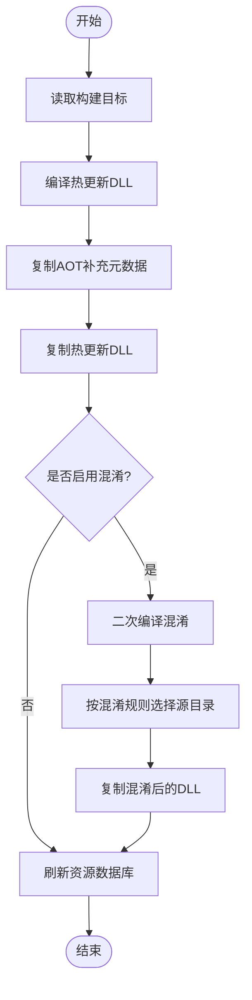
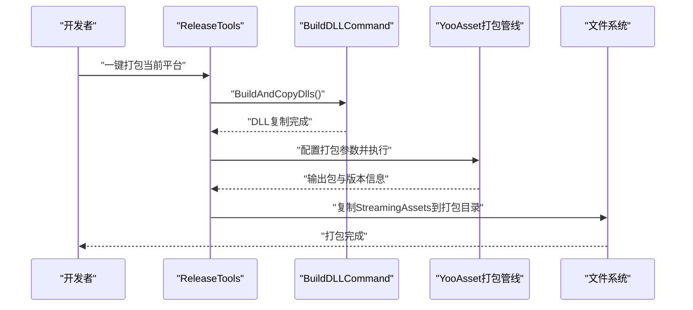
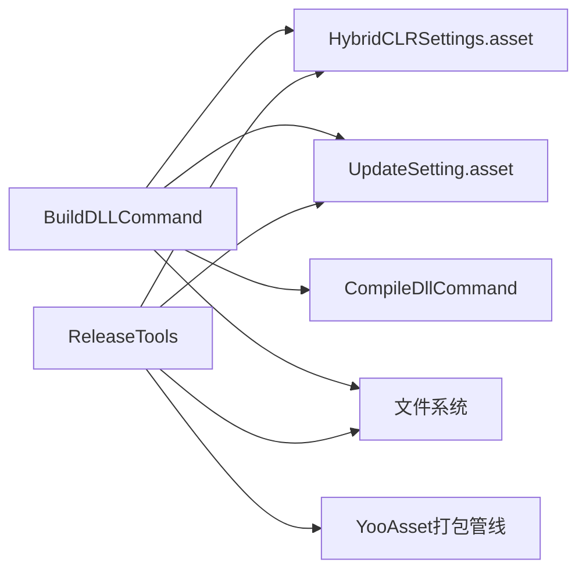

# HybridCLR工具

<cite>
**本文引用的文件**
- [BuildDLLCommand.cs](file://Assets/TEngine/Editor/HybridCLR/BuildDLLCommand.cs)
- [UpdateSettingEditor.cs](file://Assets/TEngine/Editor/Utility/UpdateSettingEditor.cs)
- [UpdateSetting.asset](file://Assets/TEngine/Settings/UpdateSetting.asset)
- [HybridCLRSettings.asset](file://ProjectSettings/HybridCLRSettings.asset)
- [UpdateSetting.cs](file://Assets/TEngine/Runtime/Core/UpdateSetting.cs)
- [ReleaseTools.cs](file://Assets/TEngine/Editor/ReleaseTools/ReleaseTools.cs)
- [CommandLineReader.cs](file://Assets/TEngine/Editor/Utility/CommandLineReader.cs)
- [TEngineSettingsProvider.cs](file://Assets/Editor/TEngineSettingsProvider/TEngineSettingsProvider.cs)
- [systemPatterns.md](file://memory-bank/systemPatterns.md)
- [techContext.md](file://memory-bank/techContext.md)
</cite>

## 目录
1. [简介](#简介)
2. [项目结构](#项目结构)
3. [核心组件](#核心组件)
4. [架构总览](#架构总览)
5. [详细组件分析](#详细组件分析)
6. [依赖分析](#依赖分析)
7. [性能考虑](#性能考虑)
8. [故障排查指南](#故障排查指南)
9. [结论](#结论)
10. [附录](#附录)

## 简介
本文件面向HybridCLR工具集的技术文档，聚焦于DLL编译、热更新打包与版本管理等核心能力。重点解析BuildDLLCommand的编译流程与参数配置（编译选项、输出路径、依赖处理），阐述热更新发布的完整流程（代码编译、资源打包、版本发布），并提供开发最佳实践与调试技巧，辅以具体构建示例与发布流程指南。

## 项目结构
围绕HybridCLR工具的关键文件分布如下：
- 编辑器工具层：BuildDLLCommand、UpdateSettingEditor、ReleaseTools、CommandLineReader、TEngineSettingsProvider
- 运行时配置层：UpdateSetting（ScriptableObject）、HybridCLRSettings（ProjectSettings）
- 文档与知识库：systemPatterns.md、techContext.md

**图示来源**
- [BuildDLLCommand.cs:16-174](file://Assets/TEngine/Editor/HybridCLR/BuildDLLCommand.cs#L16-L174)
- [UpdateSettingEditor.cs:9-106](file://Assets/TEngine/Editor/Utility/UpdateSettingEditor.cs#L9-L106)
- [UpdateSetting.cs:50-220](file://Assets/TEngine/Runtime/Core/UpdateSetting.cs#L50-L220)
- [HybridCLRSettings.asset:1-39](file://ProjectSettings/HybridCLRSettings.asset#L1-L39)
- [UpdateSetting.asset:1-37](file://Assets/TEngine/Settings/UpdateSetting.asset#L1-L37)
- [ReleaseTools.cs:16-376](file://Assets/TEngine/Editor/ReleaseTools/ReleaseTools.cs#L16-L376)
- [systemPatterns.md:317-351](file://memory-bank/systemPatterns.md#L317-L351)
- [techContext.md:308-331](file://memory-bank/techContext.md#L308-L331)

**章节来源**
- [BuildDLLCommand.cs:16-174](file://Assets/TEngine/Editor/HybridCLR/BuildDLLCommand.cs#L16-L174)
- [UpdateSettingEditor.cs:9-106](file://Assets/TEngine/Editor/Utility/UpdateSettingEditor.cs#L9-L106)
- [UpdateSetting.cs:50-220](file://Assets/TEngine/Runtime/Core/UpdateSetting.cs#L50-L220)
- [HybridCLRSettings.asset:1-39](file://ProjectSettings/HybridCLRSettings.asset#L1-L39)
- [UpdateSetting.asset:1-37](file://Assets/TEngine/Settings/UpdateSetting.asset#L1-L37)
- [ReleaseTools.cs:16-376](file://Assets/TEngine/Editor/ReleaseTools/ReleaseTools.cs#L16-L376)
- [systemPatterns.md:317-351](file://memory-bank/systemPatterns.md#L317-L351)
- [techContext.md:308-331](file://memory-bank/techContext.md#L308-L331)

## 核心组件
- BuildDLLCommand：负责DLL编译、AOT与热更新程序集的复制、条件混淆与最终打包路径组织。
- UpdateSettingEditor：监听UpdateSetting变更，同步至HybridCLRSettings，驱动编译与打包配置生效。
- UpdateSetting：运行时配置脚本，定义热更程序集、AOT元数据、打包路径、版本策略等。
- ReleaseTools：统一的打包工具，支持一键打包、版本号生成、资源复制到打包目录等。
- CommandLineReader：命令行参数解析，支撑批处理与自动化流水线。
- TEngineSettingsProvider：编辑器面板入口，提供启用/禁用HybridCLR开关与状态提示。

**章节来源**
- [BuildDLLCommand.cs:16-174](file://Assets/TEngine/Editor/HybridCLR/BuildDLLCommand.cs#L16-L174)
- [UpdateSettingEditor.cs:9-106](file://Assets/TEngine/Editor/Utility/UpdateSettingEditor.cs#L9-L106)
- [UpdateSetting.cs:50-220](file://Assets/TEngine/Runtime/Core/UpdateSetting.cs#L50-L220)
- [ReleaseTools.cs:16-376](file://Assets/TEngine/Editor/ReleaseTools/ReleaseTools.cs#L16-L376)
- [CommandLineReader.cs:38-121](file://Assets/TEngine/Editor/Utility/CommandLineReader.cs#L38-L121)
- [TEngineSettingsProvider.cs:52-92](file://Assets/Editor/TEngineSettingsProvider/TEngineSettingsProvider.cs#L52-L92)

## 架构总览
下图展示从编辑器触发到打包完成的总体流程，涵盖DLL编译、AOT与热更新程序集复制、可选混淆、资源打包与版本发布。

**图示来源**
- [BuildDLLCommand.cs:86-134](file://Assets/TEngine/Editor/HybridCLR/BuildDLLCommand.cs#L86-L134)
- [ReleaseTools.cs:60-142](file://Assets/TEngine/Editor/ReleaseTools/ReleaseTools.cs#L60-L142)
- [systemPatterns.md:317-351](file://memory-bank/systemPatterns.md#L317-L351)

## 详细组件分析

### BuildDLLCommand：DLL编译与复制流程
- 功能职责
  - 编译热更新DLL：调用编译命令生成目标平台的热更新程序集。
  - 复制AOT补充元数据：将裁剪后的AOT DLL复制到指定目录，供运行时加载。
  - 复制热更新程序集：将热更新DLL复制到StreamingAssets/AssetRaw/DLL，扩展名为.bytes。
  - 条件混淆：当同时启用HybridCLR与Obfuz时，对热更新DLL进行混淆并按规则选择源目录复制。
  - 刷新资源：完成复制后刷新Unity资源数据库，确保资源可见。

- 关键流程
  - 编译阶段：根据当前构建目标调用编译命令，生成HotUpdateDlls与AssembliesPostIl2CppStrip目录。
  - 复制阶段：遍历AOT与热更新程序集列表，将对应DLL复制到目标路径，并附加.bytes扩展名。
  - 混淆阶段：若启用混淆，二次编译并依据混淆配置选择混淆输出目录，再复制到目标路径。
  - 路径组织：输出路径由UpdateSetting的AssemblyTextAssetPath与Extension共同决定。

- 参数与配置
  - 目标平台：从Unity编辑器构建设置中读取当前构建目标。
  - 输出根目录：热更新DLL输出根目录与AOT裁剪后输出根目录由HybridCLRSettings定义。
  - 程序集白名单：热更新程序集与AOT元数据程序集由UpdateSetting定义。

**图示来源**
- [BuildDLLCommand.cs:86-134](file://Assets/TEngine/Editor/HybridCLR/BuildDLLCommand.cs#L86-L134)

**章节来源**
- [BuildDLLCommand.cs:86-174](file://Assets/TEngine/Editor/HybridCLR/BuildDLLCommand.cs#L86-L174)
- [UpdateSetting.asset:16-29](file://Assets/TEngine/Settings/UpdateSetting.asset#L16-L29)
- [HybridCLRSettings.asset:20-36](file://ProjectSettings/HybridCLRSettings.asset#L20-L36)

### UpdateSettingEditor：程序集配置同步
- 功能职责
  - 监听UpdateSetting的变更，检测热更新程序集与AOT元数据程序集是否变化。
  - 将变更同步到HybridCLRSettings，确保编译与打包配置即时生效。
  - 提供ForceUpdateAssemblies方法，强制刷新HybridCLRSettings。

- 关键逻辑
  - 对比变更：记录变更前后列表，判断是否需要更新HybridCLRSettings。
  - 清理扩展名：将程序集名中的.dll扩展名去除，写入hotUpdateAssemblies数组。
  - 持久化：标记对象为脏，保存设置并刷新资源数据库。

**章节来源**
- [UpdateSettingEditor.cs:9-106](file://Assets/TEngine/Editor/Utility/UpdateSettingEditor.cs#L9-L106)
- [UpdateSetting.cs:72-75](file://Assets/TEngine/Runtime/Core/UpdateSetting.cs#L72-L75)

### UpdateSetting：运行时配置与打包参数
- 功能职责
  - 定义热更新程序集列表、AOT元数据程序集列表、主业务逻辑DLL名。
  - 指定程序集打包路径与扩展名，控制是否自动复制打包资源到构建地址。
  - 提供资源下载路径、备用地址、WebGL加载策略、版本号生成等。

- 关键字段
  - HotUpdateAssemblies：热更新DLL列表。
  - AOTMetaAssemblies：AOT补充元数据DLL列表。
  - AssemblyTextAssetPath/Extension：DLL打包到StreamingAssets的目录与扩展名。
  - BuildAddress/IsAutoAssetCopeToBuildAddress：打包目录与自动复制策略。
  - ResDownLoadPath/FallbackResDownLoadPath：资源下载地址与备用地址。
  - GetResDownLoadPath/GetFallbackResDownLoadPath：按平台拼接最终下载地址。

**章节来源**
- [UpdateSetting.cs:50-220](file://Assets/TEngine/Runtime/Core/UpdateSetting.cs#L50-L220)
- [UpdateSetting.asset:15-37](file://Assets/TEngine/Settings/UpdateSetting.asset#L15-L37)

### ReleaseTools：打包与版本管理
- 功能职责
  - 一键打包：构建AssetBundle并生成版本号，支持当前平台快速打包。
  - 自动复制：将StreamingAssets内容复制到打包目录，便于离线或本地测试。
  - 版本号策略：基于日期与分钟数生成版本号，保证唯一性。
  - 平台映射：根据字符串参数映射到具体BuildTarget。
  - 加密服务：从资源模块驱动读取加密类型，动态创建加密服务实例。

- 关键流程
  - 构建前：调用BuildDLLCommand.BuildAndCopyDlls确保DLL就绪。
  - 构建中：配置打包参数（压缩方式、共享打包规则、文件名风格等），执行打包。
  - 构建后：复制StreamingAssets到打包目录，清理旧文件并重建目录结构。

**图示来源**
- [ReleaseTools.cs:60-142](file://Assets/TEngine/Editor/ReleaseTools/ReleaseTools.cs#L60-L142)
- [systemPatterns.md:317-351](file://memory-bank/systemPatterns.md#L317-L351)

**章节来源**
- [ReleaseTools.cs:16-376](file://Assets/TEngine/Editor/ReleaseTools/ReleaseTools.cs#L16-L376)

### CommandLineReader：批处理与自动化
- 功能职责
  - 解析命令行自定义参数，支持批处理模式与CI/CD流水线。
  - 提供获取完整命令行、参数字典与单个参数值的方法。

- 使用场景
  - 通过命令行传入outputRoot、packageVersion、platform等参数，驱动ReleaseTools执行自动化打包。

**章节来源**
- [CommandLineReader.cs:38-121](file://Assets/TEngine/Editor/Utility/CommandLineReader.cs#L38-L121)

### TEngineSettingsProvider：编辑器入口
- 功能职责
  - 提供启用/禁用HybridCLR的菜单项与状态提示。
  - 调用BuildDLLCommand.EnableHybridCLR/DisableHybridCLR完成环境切换。

**章节来源**
- [TEngineSettingsProvider.cs:52-92](file://Assets/Editor/TEngineSettingsProvider/TEngineSettingsProvider.cs#L52-L92)

## 依赖分析
- BuildDLLCommand依赖
  - HybridCLRSettings（ProjectSettings）：读取热更新与AOT程序集配置、输出目录。
  - UpdateSetting（ScriptableObject）：读取程序集列表与打包路径。
  - Unity编辑器API：构建目标、资源数据库刷新。
  - 可选：Obfuz混淆工具链（当同时启用HybridCLR与Obfuz时）。

- ReleaseTools依赖
  - YooAsset打包管线：执行AssetBundle构建。
  - UpdateSetting：读取打包地址与复制策略。
  - Unity编辑器API：构建目标切换、资源刷新。

**图示来源**
- [BuildDLLCommand.cs:86-134](file://Assets/TEngine/Editor/HybridCLR/BuildDLLCommand.cs#L86-L134)
- [ReleaseTools.cs:180-239](file://Assets/TEngine/Editor/ReleaseTools/ReleaseTools.cs#L180-L239)
- [HybridCLRSettings.asset:1-39](file://ProjectSettings/HybridCLRSettings.asset#L1-L39)
- [UpdateSetting.asset:1-37](file://Assets/TEngine/Settings/UpdateSetting.asset#L1-L37)

**章节来源**
- [BuildDLLCommand.cs:86-174](file://Assets/TEngine/Editor/HybridCLR/BuildDLLCommand.cs#L86-L174)
- [ReleaseTools.cs:180-239](file://Assets/TEngine/Editor/ReleaseTools/ReleaseTools.cs#L180-L239)

## 性能考虑
- 增量构建：ReleaseTools中已启用使用资源依赖数据库与不清理构建缓存，有助于提升打包速度。
- 共享资源打包：启用共享打包规则，减少重复资源，降低包体大小。
- 压缩策略：采用LZ4压缩，平衡体积与加载性能。
- 混淆优化：仅对需要混淆的程序集进行二次编译与复制，避免不必要的I/O开销。

[本节为通用建议，无需特定文件引用]

## 故障排查指南
- AOT DLL不存在
  - 现象：复制AOT DLL时报错，提示裁剪后的AOT DLL在BuildPlayer时才能生成。
  - 处理：先构建一次游戏App后再进行打包。
  - 参考：[BuildDLLCommand.cs:146-150](file://Assets/TEngine/Editor/HybridCLR/BuildDLLCommand.cs#L146-L150)

- 程序集未生效
  - 现象：修改UpdateSetting后，HybridCLR未识别新增程序集。
  - 处理：在编辑器中保存UpdateSetting，或调用ForceUpdateAssemblies刷新配置。
  - 参考：[UpdateSettingEditor.cs:74-104](file://Assets/TEngine/Editor/Utility/UpdateSettingEditor.cs#L74-L104)

- 打包目录不存在
  - 现象：复制StreamingAssets到打包目录时报错。
  - 处理：检查UpdateSetting中的BuildAddress是否为有效路径。
  - 参考：[ReleaseTools.cs:94-98](file://Assets/TEngine/Editor/ReleaseTools/ReleaseTools.cs#L94-L98)

- 混淆后DLL缺失
  - 现象：复制DLL时找不到混淆产物。
  - 处理：确认已启用混淆且二次编译成功；检查混淆程序集名单。
  - 参考：[BuildDLLCommand.cs:109-131](file://Assets/TEngine/Editor/HybridCLR/BuildDLLCommand.cs#L109-L131)

**章节来源**
- [BuildDLLCommand.cs:136-155](file://Assets/TEngine/Editor/HybridCLR/BuildDLLCommand.cs#L136-L155)
- [UpdateSettingEditor.cs:74-104](file://Assets/TEngine/Editor/Utility/UpdateSettingEditor.cs#L74-L104)
- [ReleaseTools.cs:73-142](file://Assets/TEngine/Editor/ReleaseTools/ReleaseTools.cs#L73-L142)

## 结论
HybridCLR工具集通过BuildDLLCommand、UpdateSettingEditor、ReleaseTools等组件，实现了从DLL编译、AOT与热更新程序集复制、可选混淆到资源打包与版本管理的完整闭环。配合UpdateSetting与HybridCLRSettings的配置，开发者可以灵活控制热更新范围与打包路径；借助ReleaseTools与CommandLineReader，可轻松接入自动化流水线。遵循本文的最佳实践与排障建议，可显著提升热更新开发效率与稳定性。

[本节为总结，无需特定文件引用]

## 附录

### 构建与发布流程指南
- 步骤一：启用HybridCLR
  - 在编辑器面板点击“启用HybridCLR”，或通过菜单项执行。
  - 参考：[TEngineSettingsProvider.cs:52-71](file://Assets/Editor/TEngineSettingsProvider/TEngineSettingsProvider.cs#L52-L71)

- 步骤二：准备程序集
  - 在UpdateSetting中维护热更新与AOT程序集列表。
  - 参考：[UpdateSetting.asset:16-29](file://Assets/TEngine/Settings/UpdateSetting.asset#L16-L29)

- 步骤三：编译并复制DLL
  - 菜单执行“BuildAssets And CopyTo AssemblyTextAssetPath”，或调用BuildDLLCommand.BuildAndCopyDlls。
  - 参考：[BuildDLLCommand.cs:86-102](file://Assets/TEngine/Editor/HybridCLR/BuildDLLCommand.cs#L86-L102)

- 步骤四：一键打包
  - 菜单执行“TEngine/Build/一键打包AssetBundle”，或调用ReleaseTools.BuildCurrentPlatformAB。
  - 参考：[ReleaseTools.cs:60-69](file://Assets/TEngine/Editor/ReleaseTools/ReleaseTools.cs#L60-L69)

- 步骤五：版本发布
  - 使用ReleaseTools生成版本号并执行打包；如需自动化，通过CommandLineReader传参驱动ReleaseTools。
  - 参考：[ReleaseTools.cs:320-326](file://Assets/TEngine/Editor/ReleaseTools/ReleaseTools.cs#L320-L326), [CommandLineReader.cs:106-119](file://Assets/TEngine/Editor/Utility/CommandLineReader.cs#L106-L119)

**章节来源**
- [TEngineSettingsProvider.cs:52-71](file://Assets/Editor/TEngineSettingsProvider/TEngineSettingsProvider.cs#L52-L71)
- [UpdateSetting.asset:16-29](file://Assets/TEngine/Settings/UpdateSetting.asset#L16-L29)
- [BuildDLLCommand.cs:86-102](file://Assets/TEngine/Editor/HybridCLR/BuildDLLCommand.cs#L86-L102)
- [ReleaseTools.cs:60-69](file://Assets/TEngine/Editor/ReleaseTools/ReleaseTools.cs#L60-L69)
- [CommandLineReader.cs:106-119](file://Assets/TEngine/Editor/Utility/CommandLineReader.cs#L106-L119)

### 热更新开发最佳实践
- 程序集管理
  - 将热更新代码置于独立程序集，避免与主工程耦合。
  - 在UpdateSetting中明确声明热更新与AOT程序集列表。
  - 参考：[UpdateSetting.cs:72-75](file://Assets/TEngine/Runtime/Core/UpdateSetting.cs#L72-L75)

- 调试与监控
  - 使用内置调试器模块查看FPS、日志、资源与内存信息。
  - 参考：[techContext.md:327-331](file://memory-bank/techContext.md#L327-L331)

- 架构理解
  - 热更新流程包含主工程、HybridCLR解释器与热更DLL三层协作。
  - 参考：[systemPatterns.md:317-351](file://memory-bank/systemPatterns.md#L317-L351)

**章节来源**
- [UpdateSetting.cs:72-75](file://Assets/TEngine/Runtime/Core/UpdateSetting.cs#L72-L75)
- [techContext.md:327-331](file://memory-bank/techContext.md#L327-L331)
- [systemPatterns.md:317-351](file://memory-bank/systemPatterns.md#L317-L351)