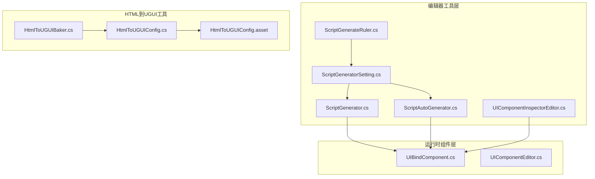
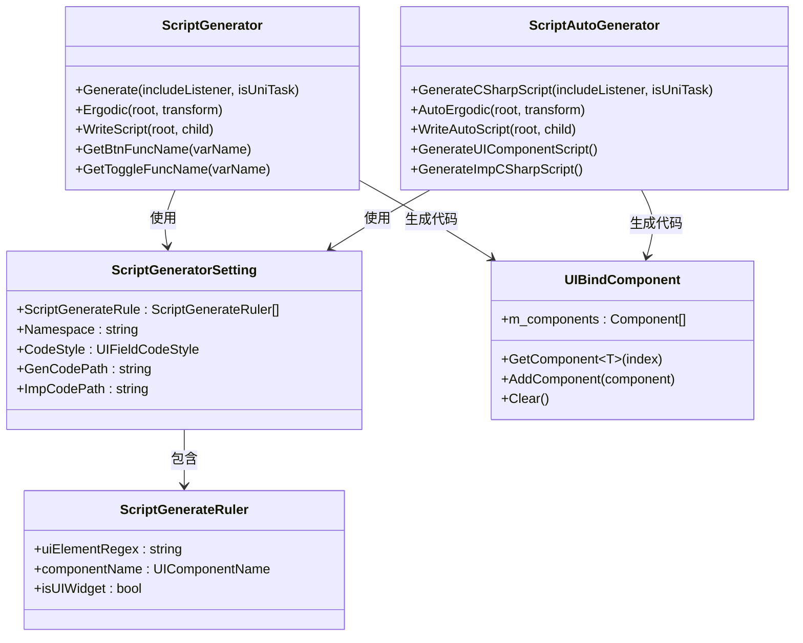
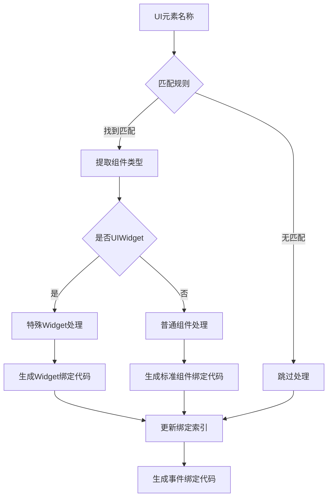
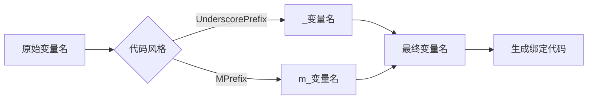
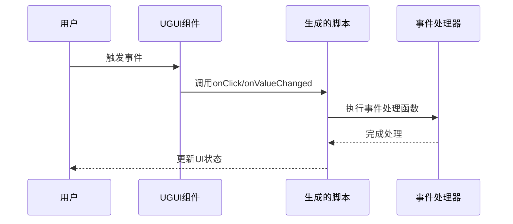
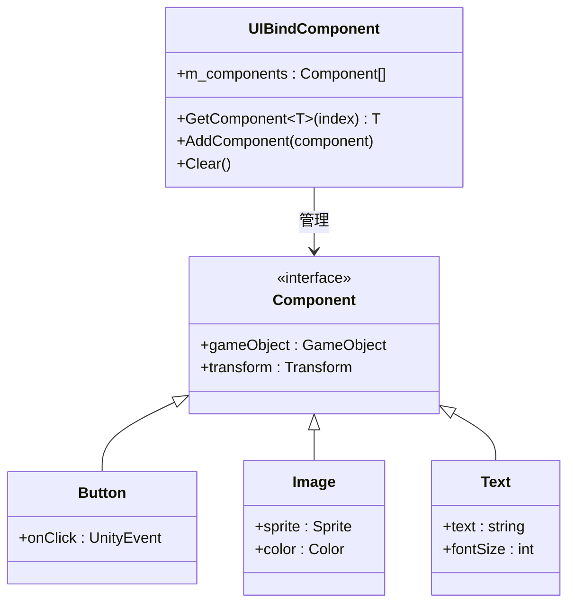
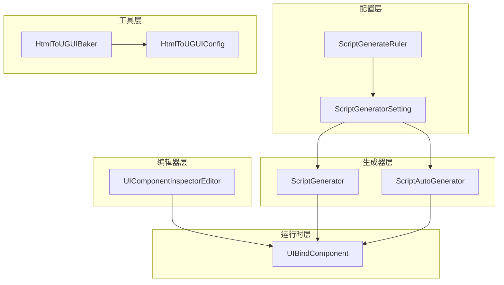
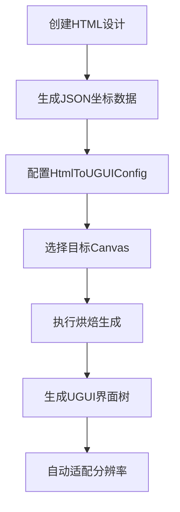
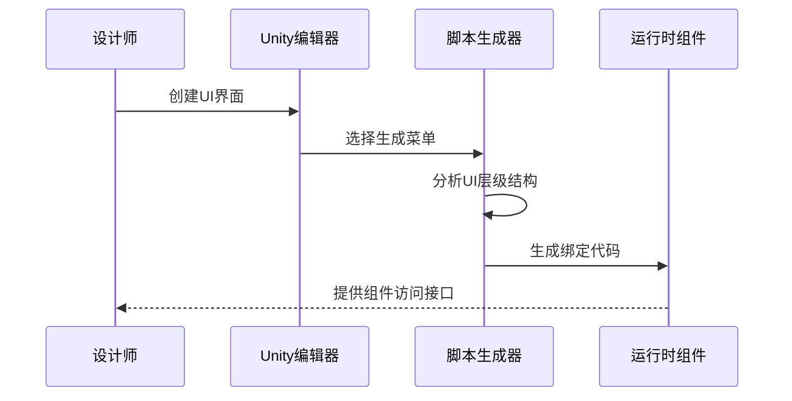

# UI脚本生成器

<cite>
**本文档引用的文件**
- [ScriptGenerator.cs](file://Assets/Editor/UIScriptGenerator/ScriptGenerator.cs)
- [ScriptAutoGenerator.cs](file://Assets/Editor/UIScriptGenerator/ScriptAutoGenerator.cs)
- [ScriptGeneratorSetting.cs](file://Assets/Editor/UIScriptGenerator/ScriptGeneratorSetting.cs)
- [ScriptGenerateRuler.cs](file://Assets/Editor/UIScriptGenerator/ScriptGenerateRuler.cs)
- [UIComponentInspectorEditor.cs](file://Assets/Editor/UIScriptGenerator/UIComponentInspectorEditor.cs)
- [UIBindComponent.cs](file://Assets/GameScripts/HotFix/GameLogic/Module/UIModule/UIBindComponent/UIBindComponent.cs)
- [UIComponentEditor.cs](file://Assets/GameScripts/HotFix/GameLogic/Module/UIModule/UIBindComponent/UIComponentEditor.cs)
- [HtmlToUGUIBaker.cs](file://Assets/HtmlToUGUI/Editor/HtmlToUGUIBaker.cs)
- [HtmlToUGUIConfig.cs](file://Assets/HtmlToUGUI/HtmlToUGUIConfig.cs)
- [HtmlToUGUIConfig.asset](file://Assets/HtmlToUGUI/HtmlToUGUIConfig.asset)
</cite>

## 目录
1. [简介](#简介)
2. [项目结构](#项目结构)
3. [核心组件](#核心组件)
4. [架构概览](#架构概览)
5. [详细组件分析](#详细组件分析)
6. [依赖关系分析](#依赖关系分析)
7. [性能考虑](#性能考虑)
8. [故障排除指南](#故障排除指南)
9. [结论](#结论)
10. [附录](#附录)

## 简介

UI脚本生成器是TEngine框架中的一个重要工具集，旨在自动化生成Unity UGUI界面的C#脚本代码。该系统提供了两种主要的工作模式：传统脚本生成模式和基于UIBindComponent的组件绑定模式。

该工具集的核心价值在于：
- **自动化代码生成**：根据UI层级结构自动生成绑定代码
- **灵活的组件映射**：支持多种UGUI组件的智能识别和绑定
- **统一的命名规范**：提供一致的变量命名和代码风格
- **事件绑定机制**：自动生成按钮点击、滑块变化等事件处理代码
- **多分辨率支持**：通过HTML到UGUI烘焙器支持不同屏幕尺寸

## 项目结构

UI脚本生成器系统由多个相互协作的组件组成，分布在不同的命名空间和目录中：

**图表来源**
- [ScriptGenerator.cs:1-343](file://Assets/Editor/UIScriptGenerator/ScriptGenerator.cs#L1-L343)
- [ScriptAutoGenerator.cs:1-829](file://Assets/Editor/UIScriptGenerator/ScriptAutoGenerator.cs#L1-L829)
- [ScriptGeneratorSetting.cs:1-207](file://Assets/Editor/UIScriptGenerator/ScriptGeneratorSetting.cs#L1-L207)

**章节来源**
- [ScriptGenerator.cs:1-343](file://Assets/Editor/UIScriptGenerator/ScriptGenerator.cs#L1-L343)
- [ScriptAutoGenerator.cs:1-829](file://Assets/Editor/UIScriptGenerator/ScriptAutoGenerator.cs#L1-L829)
- [ScriptGeneratorSetting.cs:1-207](file://Assets/Editor/UIScriptGenerator/ScriptGeneratorSetting.cs#L1-L207)

## 核心组件

### 脚本生成器主控制器

ScriptGenerator.cs是整个系统的入口点，提供了多种菜单命令来触发不同的生成模式：

- **传统模式**：UIProperty、UIPropertyAndListener
- **UniTask模式**：带UniTask后缀的菜单项
- **绑定组件模式**：UIPropertyBindComponent、UIPropertyAndListenerBindComponent

### 自动化生成器

ScriptAutoGenerator.cs实现了基于UIBindComponent的高级生成功能，包括：
- 组件自动绑定
- 事件回调生成
- 实现类分离机制
- 预制体编辑支持

### 配置管理系统

ScriptGeneratorSetting.cs管理所有生成配置：
- 命名空间设置
- 组件映射规则
- 代码风格选择
- 生成路径配置

**章节来源**
- [ScriptGenerator.cs:12-135](file://Assets/Editor/UIScriptGenerator/ScriptGenerator.cs#L12-L135)
- [ScriptAutoGenerator.cs:89-254](file://Assets/Editor/UIScriptGenerator/ScriptAutoGenerator.cs#L89-L254)
- [ScriptGeneratorSetting.cs:10-207](file://Assets/Editor/UIScriptGenerator/ScriptGeneratorSetting.cs#L10-L207)

## 架构概览

UI脚本生成器采用分层架构设计，确保了良好的模块化和可扩展性：

**图表来源**
- [ScriptGenerator.cs:8-343](file://Assets/Editor/UIScriptGenerator/ScriptGenerator.cs#L8-L343)
- [ScriptAutoGenerator.cs:14-829](file://Assets/Editor/UIScriptGenerator/ScriptAutoGenerator.cs#L14-L829)
- [ScriptGeneratorSetting.cs:10-207](file://Assets/Editor/UIScriptGenerator/ScriptGeneratorSetting.cs#L10-L207)
- [UIBindComponent.cs:17-39](file://Assets/GameScripts/HotFix/GameLogic/Module/UIModule/UIBindComponent/UIBindComponent.cs#L17-L39)

## 详细组件分析

### 组件识别规则系统

ScriptGenerateRuler定义了完整的组件识别和映射机制：

**图表来源**
- [ScriptGenerateRuler.cs:26-38](file://Assets/Editor/UIScriptGenerator/ScriptGenerateRuler.cs#L26-L38)
- [ScriptAutoGenerator.cs:275-363](file://Assets/Editor/UIScriptGenerator/ScriptAutoGenerator.cs#L275-L363)

组件识别规则包括：
- **GameObject识别**：以"m_go"开头的元素
- **Transform识别**：以"m_tf"开头的元素
- **UGUI组件识别**：如Button、Image、Text等
- **Widget组件识别**：以特定前缀标识的可复用组件

**章节来源**
- [ScriptGenerateRuler.cs:26-100](file://Assets/Editor/UIScriptGenerator/ScriptGenerateRuler.cs#L26-L100)
- [ScriptGeneratorSetting.cs:68-95](file://Assets/Editor/UIScriptGenerator/ScriptGeneratorSetting.cs#L68-L95)

### 变量命名规范系统

系统支持两种主要的变量命名风格：

**图表来源**
- [ScriptGenerator.cs:240-268](file://Assets/Editor/UIScriptGenerator/ScriptGenerator.cs#L240-L268)
- [ScriptAutoGenerator.cs:810-827](file://Assets/Editor/UIScriptGenerator/ScriptAutoGenerator.cs#L810-L827)

命名规范特点：
- **UnderscorePrefix**：下划线前缀风格（如_btn、_text）
- **MPrefix**：m_前缀风格（如m_btn、m_text）
- **自动转换**：根据配置自动转换现有变量名

**章节来源**
- [ScriptGenerator.cs:74-135](file://Assets/Editor/UIScriptGenerator/ScriptGenerator.cs#L74-L135)
- [ScriptAutoGenerator.cs:800-829](file://Assets/Editor/UIScriptGenerator/ScriptAutoGenerator.cs#L800-L829)

### 事件绑定机制

系统自动生成各种UGUI事件的处理代码：

**图表来源**
- [ScriptGenerator.cs:297-331](file://Assets/Editor/UIScriptGenerator/ScriptGenerator.cs#L297-L331)
- [ScriptAutoGenerator.cs:318-362](file://Assets/Editor/UIScriptGenerator/ScriptAutoGenerator.cs#L318-L362)

支持的事件类型：
- **Button点击事件**：OnClickXXXBtn()
- **Toggle状态变化**：OnToggleXXXChange(bool)
- **Slider数值变化**：OnSliderXXXChange(float)
- **Dropdown选择变化**：OnTMPDropdownXXXChange(int)

**章节来源**
- [ScriptGenerator.cs:167-217](file://Assets/Editor/UIScriptGenerator/ScriptGenerator.cs#L167-L217)
- [ScriptAutoGenerator.cs:318-362](file://Assets/Editor/UIScriptGenerator/ScriptAutoGenerator.cs#L318-L362)

### UIBindComponent组件详解

UIBindComponent是系统的核心运行时组件，负责管理UI组件的绑定关系：

**图表来源**
- [UIBindComponent.cs:17-39](file://Assets/GameScripts/HotFix/GameLogic/Module/UIModule/UIBindComponent/UIBindComponent.cs#L17-L39)

UIBindComponent的主要功能：
- **组件存储**：维护按顺序添加的组件列表
- **类型安全访问**：通过泛型方法安全获取指定类型的组件
- **索引管理**：基于添加顺序的组件索引系统
- **错误处理**：提供详细的错误信息和日志记录

**章节来源**
- [UIBindComponent.cs:1-39](file://Assets/GameScripts/HotFix/GameLogic/Module/UIModule/UIBindComponent/UIBindComponent.cs#L1-L39)
- [UIComponentEditor.cs:1-30](file://Assets/GameScripts/HotFix/GameLogic/Module/UIModule/UIBindComponent/UIComponentEditor.cs#L1-L30)

## 依赖关系分析

UI脚本生成器的依赖关系体现了清晰的分层架构：

**图表来源**
- [ScriptGeneratorSetting.cs:10-207](file://Assets/Editor/UIScriptGenerator/ScriptGeneratorSetting.cs#L10-L207)
- [ScriptGenerator.cs:8-343](file://Assets/Editor/UIScriptGenerator/ScriptGenerator.cs#L8-L343)
- [ScriptAutoGenerator.cs:14-829](file://Assets/Editor/UIScriptGenerator/ScriptAutoGenerator.cs#L14-L829)
- [UIComponentInspectorEditor.cs:12-401](file://Assets/Editor/UIScriptGenerator/UIComponentInspectorEditor.cs#L12-L401)

**章节来源**
- [ScriptGeneratorSetting.cs:1-207](file://Assets/Editor/UIScriptGenerator/ScriptGeneratorSetting.cs#L1-L207)
- [ScriptAutoGenerator.cs:1-829](file://Assets/Editor/UIScriptGenerator/ScriptAutoGenerator.cs#L1-L829)

## 性能考虑

UI脚本生成器在设计时充分考虑了性能优化：

### 代码生成优化
- **StringBuilder复用**：使用StringBuilder减少字符串拼接开销
- **单次遍历**：通过递归遍历实现高效的组件扫描
- **条件编译**：根据配置动态包含必要的命名空间

### 内存管理
- **对象池模式**：避免频繁创建临时对象
- **延迟初始化**：仅在需要时创建和初始化资源
- **缓存机制**：缓存常用的配置和查找结果

### 编辑器集成优化
- **增量更新**：仅在配置变更时重新生成代码
- **异步处理**：长耗时操作使用异步方式执行
- **进度反馈**：提供实时的生成进度和状态信息

## 故障排除指南

### 常见问题及解决方案

#### 1. UIBindComponent组件缺失
**问题症状**：生成的代码提示缺少UIBindComponent组件
**解决方法**：
- 确保UI根对象上存在UIBindComponent组件
- 使用"重新绑定组件"按钮自动添加组件
- 检查预制体编辑模式下的保存状态

#### 2. 组件类型识别失败
**问题症状**：某些UI元素未被正确识别为组件
**解决方法**：
- 检查元素名称是否符合命名约定
- 在ScriptGeneratorSetting中添加自定义规则
- 验证组件前缀是否正确配置

#### 3. 事件绑定代码不完整
**问题症状**：生成的代码缺少事件处理函数
**解决方法**：
- 确保includeListener参数设置为true
- 检查事件组件（如Button、Toggle）是否存在
- 验证事件回调函数的命名规范

#### 4. 代码风格冲突
**问题症状**：生成的变量名不符合团队规范
**解决方法**：
- 在ScriptGeneratorSetting中调整代码风格
- 检查现有变量名的自动转换规则
- 验证命名空间和导入语句的正确性

**章节来源**
- [ScriptAutoGenerator.cs:122-131](file://Assets/Editor/UIScriptGenerator/ScriptAutoGenerator.cs#L122-L131)
- [ScriptGenerator.cs:226-238](file://Assets/Editor/UIScriptGenerator/ScriptGenerator.cs#L226-L238)

## 结论

UI脚本生成器系统通过精心设计的架构和完善的工具链，为Unity UGUI开发提供了高效、可靠的自动化解决方案。系统的主要优势包括：

### 技术优势
- **高度自动化**：从UI设计到代码生成的完整流程
- **灵活配置**：支持多种命名风格和组件映射规则
- **强类型安全**：编译时检查和运行时验证相结合
- **扩展性强**：易于添加新的组件类型和生成规则

### 开发效率提升
- **减少重复劳动**：自动生成样板代码和绑定逻辑
- **统一代码风格**：确保团队代码的一致性和可维护性
- **快速原型开发**：加速UI界面的迭代和测试过程
- **降低维护成本**：清晰的代码结构和完善的错误处理

### 最佳实践建议
1. **合理规划UI层次**：遵循命名约定，便于自动识别
2. **配置个性化规则**：根据项目需求定制组件映射
3. **定期更新生成器**：保持与最新Unity版本的兼容性
4. **建立代码审查流程**：确保生成代码的质量和一致性

该系统为TEngine框架的UI开发提供了坚实的技术基础，显著提升了开发效率和代码质量。

## 附录

### 使用指南

#### 1. HTML到UGUI烘焙流程

**图表来源**
- [HtmlToUGUIBaker.cs:315-370](file://Assets/HtmlToUGUI/Editor/HtmlToUGUIBaker.cs#L315-L370)
- [HtmlToUGUIConfig.cs:20-35](file://Assets/HtmlToUGUI/HtmlToUGUIConfig.cs#L20-L35)

#### 2. 脚本生成完整工作流

#### 3. 配置选项说明

| 配置项 | 类型 | 默认值 | 描述 |
|--------|------|--------|------|
| Namespace | string | "GameLogic" | 生成代码的命名空间 |
| CodeStyle | UIFieldCodeStyle | UnderscorePrefix | 变量命名风格 |
| GenCodePath | string | "Assets/GameScripts/..." | 生成代码的保存路径 |
| ImpCodePath | string | "Assets/GameScripts/..." | 实现类代码的保存路径 |
| WidgetName | string | "item" | Widget组件的前缀标识 |

**章节来源**
- [ScriptGeneratorSetting.cs:31-56](file://Assets/Editor/UIScriptGenerator/ScriptGeneratorSetting.cs#L31-L56)
- [HtmlToUGUIBaker.cs:64-122](file://Assets/HtmlToUGUI/Editor/HtmlToUGUIBaker.cs#L64-L122)