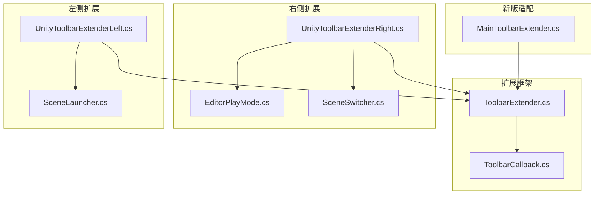
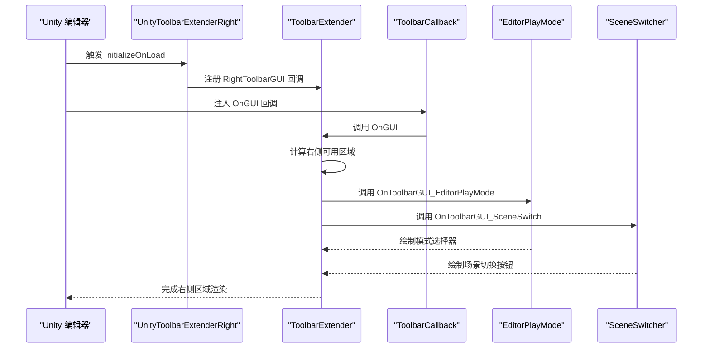
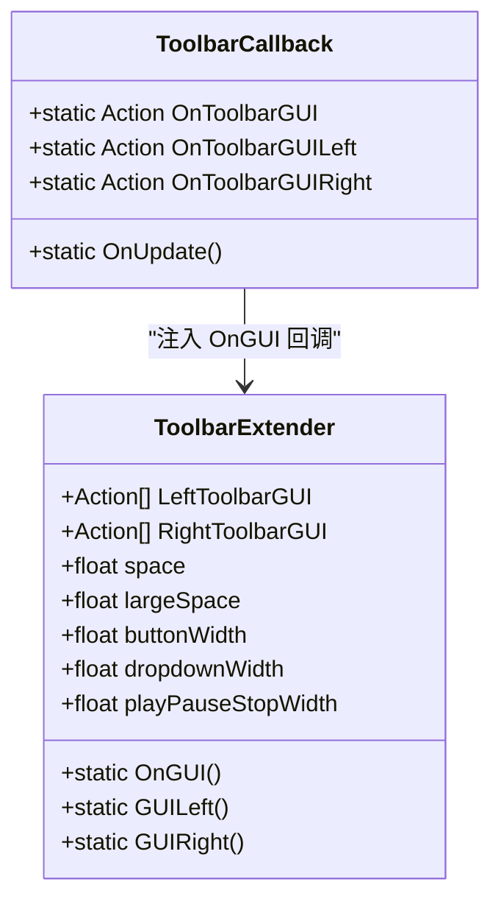
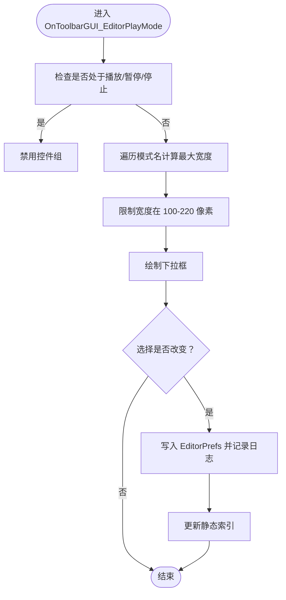
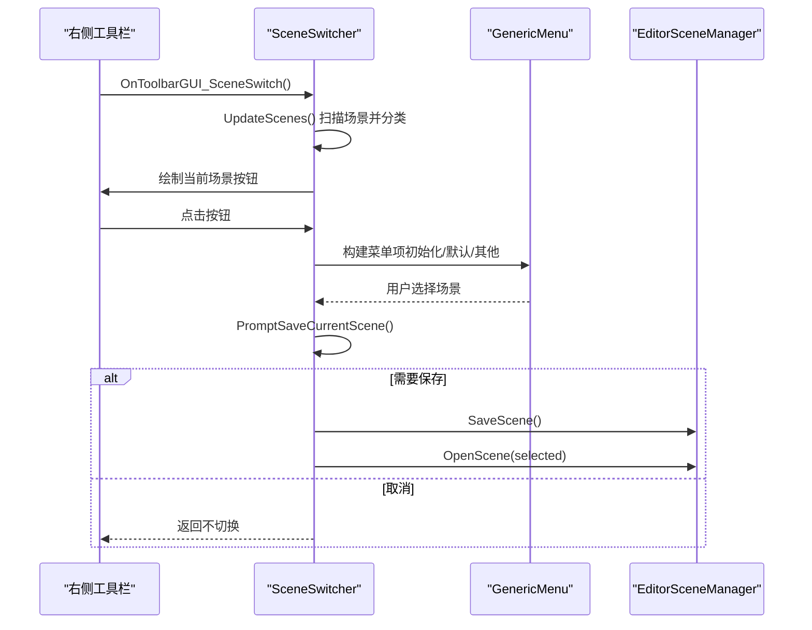
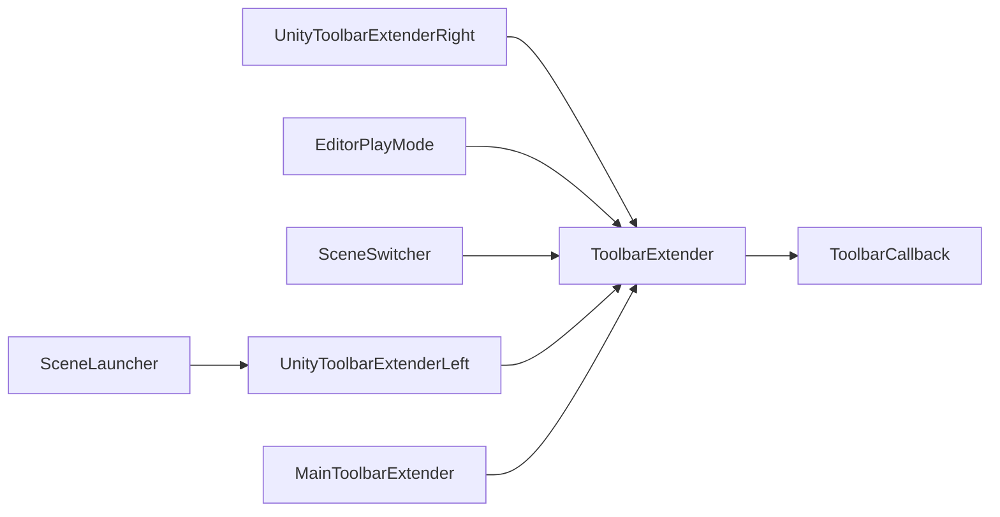

# 右侧工具栏扩展

<cite>
**本文引用的文件列表**
- [ToolbarExtender.cs](file://Assets/Editor/ToolbarExtender/ToolbarExtender.cs)
- [ToolbarCallback.cs](file://Assets/Editor/ToolbarExtender/ToolbarCallback.cs)
- [UnityToolbarExtenderRight.cs](file://Assets/Editor/ToolbarExtender/UnityToolbarExtenderRight/UnityToolbarExtenderRight.cs)
- [EditorPlayMode.cs](file://Assets/Editor/ToolbarExtender/UnityToolbarExtenderRight/EditorPlayMode.cs)
- [SceneSwitcher.cs](file://Assets/Editor/ToolbarExtender/UnityToolbarExtenderRight/SceneSwitcher.cs)
- [MainToolbarExtender.cs](file://Assets/Editor/ToolbarExtender/Unity6000_OR_New/MainToolbarExtender.cs)
- [UnityToolbarExtenderLeft.cs](file://Assets/Editor/ToolbarExtender/UnityToolbarExtenderLeft/UnityToolbarExtenderLeft.cs)
- [SceneLauncher.cs](file://Assets/Editor/ToolbarExtender/UnityToolbarExtenderLeft/SceneLauncher.cs)
</cite>

## 目录
1. [简介](#简介)
2. [项目结构](#项目结构)
3. [核心组件](#核心组件)
4. [架构总览](#架构总览)
5. [详细组件分析](#详细组件分析)
6. [依赖关系分析](#依赖关系分析)
7. [性能考量](#性能考量)
8. [故障排查指南](#故障排查指南)
9. [结论](#结论)
10. [附录](#附录)

## 简介
本技术文档聚焦于 Unity 编辑器右侧工具栏扩展能力，系统性解析其扩展机制与实现原理，重点覆盖以下方面：
- 右侧工具栏的扩展机制与布局计算
- 编辑器播放模式切换器(EditorPlayMode)的状态管理与模式切换逻辑
- 场景快速切换器(SceneSwitcher)的实现与使用
- 事件处理机制与用户交互响应
- 扩展开发指南与最佳实践，包括自定义按钮添加、状态显示、快捷操作等

该扩展体系通过反射注入与 IMGUI 容器回调的方式，在 Unity 工具栏右侧区域动态插入自定义控件，兼容不同 Unity 版本差异，并提供统一的扩展入口。

## 项目结构
右侧工具栏扩展位于编辑器目录下，采用“按功能分层 + 按版本适配”的组织方式：
- 核心扩展框架：ToolbarExtender.cs、ToolbarCallback.cs
- 右侧扩展实现：UnityToolbarExtenderRight.cs、EditorPlayMode.cs、SceneSwitcher.cs
- 左侧扩展实现：UnityToolbarExtenderLeft.cs、SceneLauncher.cs
- 新版 Unity 6.0+ 主工具栏适配：Unity6000_OR_New/MainToolbarExtender.cs

图表来源
- [ToolbarExtender.cs:1-173](file://Assets/Editor/ToolbarExtender/ToolbarExtender.cs#L1-L173)
- [ToolbarCallback.cs:1-115](file://Assets/Editor/ToolbarExtender/ToolbarCallback.cs#L1-L115)
- [UnityToolbarExtenderRight.cs:1-25](file://Assets/Editor/ToolbarExtender/UnityToolbarExtenderRight/UnityToolbarExtenderRight.cs#L1-L25)
- [EditorPlayMode.cs:1-83](file://Assets/Editor/ToolbarExtender/UnityToolbarExtenderRight/EditorPlayMode.cs#L1-L83)
- [SceneSwitcher.cs:1-174](file://Assets/Editor/ToolbarExtender/UnityToolbarExtenderRight/SceneSwitcher.cs#L1-L174)
- [UnityToolbarExtenderLeft.cs:1-21](file://Assets/Editor/ToolbarExtender/UnityToolbarExtenderLeft/UnityToolbarExtenderLeft.cs#L1-L21)
- [SceneLauncher.cs:1-122](file://Assets/Editor/ToolbarExtender/UnityToolbarExtenderLeft/SceneLauncher.cs#L1-L122)
- [MainToolbarExtender.cs:318-382](file://Assets/Editor/ToolbarExtender/Unity6000_OR_New/MainToolbarExtender.cs#L318-L382)

章节来源
- [ToolbarExtender.cs:1-173](file://Assets/Editor/ToolbarExtender/ToolbarExtender.cs#L1-L173)
- [UnityToolbarExtenderRight.cs:1-25](file://Assets/Editor/ToolbarExtender/UnityToolbarExtenderRight/UnityToolbarExtenderRight.cs#L1-L25)
- [EditorPlayMode.cs:1-83](file://Assets/Editor/ToolbarExtender/UnityToolbarExtenderRight/EditorPlayMode.cs#L1-L83)
- [SceneSwitcher.cs:1-174](file://Assets/Editor/ToolbarExtender/UnityToolbarExtenderRight/SceneSwitcher.cs#L1-L174)
- [UnityToolbarExtenderLeft.cs:1-21](file://Assets/Editor/ToolbarExtender/UnityToolbarExtenderLeft/UnityToolbarExtenderLeft.cs#L1-L21)
- [SceneLauncher.cs:1-122](file://Assets/Editor/ToolbarExtender/UnityToolbarExtenderLeft/SceneLauncher.cs#L1-L122)
- [MainToolbarExtender.cs:318-382](file://Assets/Editor/ToolbarExtender/Unity6000_OR_New/MainToolbarExtender.cs#L318-L382)

## 核心组件
- 扩展框架
  - ToolbarExtender：注册左右工具栏回调、计算可用区域、渲染自定义控件容器
  - ToolbarCallback：在 Unity 不同版本中注入 OnGUI 回调，桥接 IMGUI 容器
- 右侧扩展
  - UnityToolbarExtenderRight：在右侧区域注册场景切换与播放模式选择器
  - EditorPlayMode：编辑器资源运行模式选择器，支持多种运行模式切换
  - SceneSwitcher：基于路径扫描的场景快速切换器
- 左侧扩展
  - UnityToolbarExtenderLeft：左侧注册场景启动器等
  - SceneLauncher：一键启动指定场景并自动回到上次场景
- 新版适配
  - MainToolbarExtender：面向 Unity 6.0+ 的主工具栏元素扩展

章节来源
- [ToolbarExtender.cs:11-170](file://Assets/Editor/ToolbarExtender/ToolbarExtender.cs#L11-L170)
- [ToolbarCallback.cs:16-112](file://Assets/Editor/ToolbarExtender/ToolbarCallback.cs#L16-L112)
- [UnityToolbarExtenderRight.cs:8-22](file://Assets/Editor/ToolbarExtender/UnityToolbarExtenderRight/UnityToolbarExtenderRight.cs#L8-L22)
- [EditorPlayMode.cs:12-80](file://Assets/Editor/ToolbarExtender/UnityToolbarExtenderRight/EditorPlayMode.cs#L12-L80)
- [SceneSwitcher.cs:16-104](file://Assets/Editor/ToolbarExtender/UnityToolbarExtenderRight/SceneSwitcher.cs#L16-L104)
- [UnityToolbarExtenderLeft.cs:8-18](file://Assets/Editor/ToolbarExtender/UnityToolbarExtenderLeft/UnityToolbarExtenderLeft.cs#L8-L18)
- [SceneLauncher.cs:21-54](file://Assets/Editor/ToolbarExtender/UnityToolbarExtenderLeft/SceneLauncher.cs#L21-L54)
- [MainToolbarExtender.cs:318-382](file://Assets/Editor/ToolbarExtender/Unity6000_OR_New/MainToolbarExtender.cs#L318-L382)

## 架构总览
右侧工具栏扩展的整体工作流如下：
- 初始化阶段：Unity 启动时执行扩展类构造函数，向 ToolbarExtender 的 RightToolbarGUI 列表注册回调
- 渲染阶段：ToolbarExtender 根据屏幕宽度与现有控件位置，计算右侧可用区域，依次调用已注册的回调绘制控件
- 交互阶段：控件内部通过 GUI 事件处理用户输入，触发场景切换或模式更新，并持久化状态

图表来源
- [UnityToolbarExtenderRight.cs:12-21](file://Assets/Editor/ToolbarExtender/UnityToolbarExtenderRight/UnityToolbarExtenderRight.cs#L12-L21)
- [ToolbarExtender.cs:62-151](file://Assets/Editor/ToolbarExtender/ToolbarExtender.cs#L62-L151)
- [ToolbarCallback.cs:47-111](file://Assets/Editor/ToolbarExtender/ToolbarCallback.cs#L47-L111)
- [EditorPlayMode.cs:42-79](file://Assets/Editor/ToolbarExtender/UnityToolbarExtenderRight/EditorPlayMode.cs#L42-L79)
- [SceneSwitcher.cs:42-82](file://Assets/Editor/ToolbarExtender/UnityToolbarExtenderRight/SceneSwitcher.cs#L42-L82)

## 详细组件分析

### 扩展框架（ToolbarExtender 与 ToolbarCallback）
- ToolbarExtender
  - 负责：
    - 通过反射获取 Unity 工具栏类型字段，确定工具数量与布局常量
    - 注册 OnGUI、OnToolbarGUILeft、OnToolbarGUIRight 回调
    - 计算左右区域矩形范围，使用 GUILayout 区域渲染注册的回调
  - 关键点：
    - 版本兼容：根据 Unity 版本选择不同的工具计数字段与间距常量
    - 右侧区域计算：综合播放/暂停/停止按钮、布局、层级、账户、云、协作等控件宽度与间距，预留空间后得出右侧可用区域
- ToolbarCallback
  - 负责：
    - 在 Unity 2019.1+ 使用 UIElements 注入回调
    - 在旧版本中通过反射修改 IMGUIContainer 的 OnGUI 处理器
  - 关键点：
    - 通过 Resources 查找 Toolbar 实例，绑定回调
    - 在 Unity 2021.1+ 使用 VisualElement 的 Q 查询与 IMGUIContainer 注入

图表来源
- [ToolbarExtender.cs:11-170](file://Assets/Editor/ToolbarExtender/ToolbarExtender.cs#L11-L170)
- [ToolbarCallback.cs:16-112](file://Assets/Editor/ToolbarExtender/ToolbarCallback.cs#L16-L112)

章节来源
- [ToolbarExtender.cs:11-170](file://Assets/Editor/ToolbarExtender/ToolbarExtender.cs#L11-L170)
- [ToolbarCallback.cs:16-112](file://Assets/Editor/ToolbarExtender/ToolbarCallback.cs#L16-L112)

### 右侧工具栏扩展入口（UnityToolbarExtenderRight）
- 职责：
  - 在编辑器启动时注册右侧扩展回调
  - 订阅项目变化事件以刷新场景列表
  - 从 EditorPrefs 读取上次选择的播放模式索引
- 关键点：
  - 使用 InitializeOnLoad 在编辑器生命周期早期注册
  - 通过 ToolbarExtender.RightToolbarGUI.Add 注册自定义绘制方法

章节来源
- [UnityToolbarExtenderRight.cs:8-22](file://Assets/Editor/ToolbarExtender/UnityToolbarExtenderRight/UnityToolbarExtenderRight.cs#L8-L22)

### 编辑器播放模式切换器（EditorPlayMode）
- 功能概述：
  - 提供资源运行模式选择器，支持多种运行模式（编辑器模拟、单机、联机、WebGL）
  - 通过下拉框选择模式，记录到 EditorPrefs 并在 UI 中显示当前模式
- 实现要点：
  - 模式名称数组与索引管理
  - 动态计算下拉框宽度：遍历所有模式名，计算最大宽度并加缓冲，限制在 100-220 像素之间
  - 使用 Popup 控件绘制下拉框，禁用播放/暂停/停止状态下不可用
  - 选择变更时写入 EditorPrefs 并记录日志
- 状态管理：
  - 静态索引变量保存当前模式
  - 构造函数从 EditorPrefs 读取上次选择

图表来源
- [EditorPlayMode.cs:42-79](file://Assets/Editor/ToolbarExtender/UnityToolbarExtenderRight/EditorPlayMode.cs#L42-L79)

章节来源
- [EditorPlayMode.cs:12-80](file://Assets/Editor/ToolbarExtender/UnityToolbarExtenderRight/EditorPlayMode.cs#L12-L80)

### 场景快速切换器（SceneSwitcher）
- 功能概述：
  - 扫描指定路径下的场景，构建分类菜单（初始化场景、默认场景、其他场景）
  - 当前场景名称作为按钮显示，点击弹出菜单进行切换
- 实现要点：
  - 路径扫描：使用 AssetDatabase.FindAssets 搜索场景资源，提取路径与名称
  - 分类逻辑：排除初始化与默认场景后归入“其他场景”
  - 交互流程：按钮点击触发 GenericMenu，选择后调用 EditorSceneManager.OpenScene
  - 安全提示：若当前场景有未保存更改，弹出保存确认对话框
- 布局与样式：
  - 使用 GUI.skin.button 计算按钮宽度，确保文本宽度与左对齐
  - 自定义按钮样式以提升可读性

图表来源
- [SceneSwitcher.cs:25-103](file://Assets/Editor/ToolbarExtender/UnityToolbarExtenderRight/SceneSwitcher.cs#L25-L103)

章节来源
- [SceneSwitcher.cs:16-104](file://Assets/Editor/ToolbarExtender/UnityToolbarExtenderRight/SceneSwitcher.cs#L16-L104)

### 左侧扩展与联动（UnityToolbarExtenderLeft 与 SceneLauncher）
- UnityToolbarExtenderLeft：
  - 注册左侧扩展回调，订阅播放模式变化事件
- SceneLauncher：
  - 提供一键启动场景的按钮，支持自动回到上次场景
  - 在播放模式进入编辑模式时恢复上次场景
  - 使用 EditorPrefs 存储上次场景路径与启动标记

章节来源
- [UnityToolbarExtenderLeft.cs:8-18](file://Assets/Editor/ToolbarExtender/UnityToolbarExtenderLeft/UnityToolbarExtenderLeft.cs#L8-L18)
- [SceneLauncher.cs:21-54](file://Assets/Editor/ToolbarExtender/UnityToolbarExtenderLeft/SceneLauncher.cs#L21-L54)

### 新版 Unity 6.0+ 适配（MainToolbarExtender）
- MainToolbarDropdownPlayMode：
  - 通过 MainToolbarElement 注册下拉菜单元素，显示当前资源运行模式
  - 监听播放模式变化事件，动态刷新 UI
  - 使用 EditorPrefs 持久化模式索引

章节来源
- [MainToolbarExtender.cs:318-382](file://Assets/Editor/ToolbarExtender/Unity6000_OR_New/MainToolbarExtender.cs#L318-L382)

## 依赖关系分析
- 组件耦合
  - UnityToolbarExtenderRight 依赖 ToolbarExtender 的 RightToolbarGUI 列表
  - EditorPlayMode 与 SceneSwitcher 仅依赖 Unity 编辑器 API 与 ToolbarExtender 的回调机制
  - ToolbarCallback 与 ToolbarExtender 通过反射建立连接，存在版本差异适配
- 外部依赖
  - Unity 编辑器 API：Editor、EditorGUI、EditorSceneManager、AssetDatabase、GenericMenu 等
  - EditorPrefs：用于持久化用户选择
- 潜在循环依赖
  - 扩展模块间无直接循环依赖，通过 ToolbarExtender 的回调列表解耦

图表来源
- [UnityToolbarExtenderRight.cs:14-20](file://Assets/Editor/ToolbarExtender/UnityToolbarExtenderRight/UnityToolbarExtenderRight.cs#L14-L20)
- [ToolbarExtender.cs:17-18](file://Assets/Editor/ToolbarExtender/ToolbarExtender.cs#L17-L18)
- [ToolbarCallback.cs:37-39](file://Assets/Editor/ToolbarExtender/ToolbarCallback.cs#L37-L39)
- [UnityToolbarExtenderLeft.cs:13-14](file://Assets/Editor/ToolbarExtender/UnityToolbarExtenderLeft/UnityToolbarExtenderLeft.cs#L13-L14)
- [MainToolbarExtender.cs:347-359](file://Assets/Editor/ToolbarExtender/Unity6000_OR_New/MainToolbarExtender.cs#L347-L359)

章节来源
- [UnityToolbarExtenderRight.cs:14-20](file://Assets/Editor/ToolbarExtender/UnityToolbarExtenderRight/UnityToolbarExtenderRight.cs#L14-L20)
- [ToolbarExtender.cs:17-18](file://Assets/Editor/ToolbarExtender/ToolbarExtender.cs#L17-L18)
- [ToolbarCallback.cs:37-39](file://Assets/Editor/ToolbarExtender/ToolbarCallback.cs#L37-L39)
- [UnityToolbarExtenderLeft.cs:13-14](file://Assets/Editor/ToolbarExtender/UnityToolbarExtenderLeft/UnityToolbarExtenderLeft.cs#L13-L14)
- [MainToolbarExtender.cs:347-359](file://Assets/Editor/ToolbarExtender/Unity6000_OR_New/MainToolbarExtender.cs#L347-L359)

## 性能考量
- 布局计算
  - 右侧区域计算涉及多次宽度测量与常量累加，建议避免在高频帧中重复计算；当前通过一次初始化完成
- 绘制开销
  - IMGUI 绘制在 OnGUI 中执行，应尽量减少不必要的 GUI 调用与重绘
- 资源扫描
  - 场景扫描使用 AssetDatabase.FindAssets，建议在项目变化时触发而非每帧扫描
- 版本适配
  - 反射调用与 UIElements 注入可能带来额外开销，需关注 Unity 版本差异带来的性能影响

## 故障排查指南
- 右侧工具栏不显示控件
  - 检查是否正确注册回调：确认 UnityToolbarExtenderRight 构造函数中的注册语句
  - 检查 ToolbarExtender 是否成功注入回调：查看 ToolbarCallback 的 OnUpdate 逻辑
- 模式选择器无法切换
  - 确认 EditorPlayMode 的禁用条件：播放/暂停/停止状态下控件被禁用
  - 检查 EditorPrefs 键值是否存在：键名为 "EditorPlayMode"
- 场景切换失败
  - 确认场景路径是否有效：检查 SceneSwitcher 的路径扫描与 GUID 解析
  - 检查保存确认对话框：若当前场景未保存，需先保存或取消
- 版本兼容问题
  - 旧版本 Unity：依赖 ToolbarCallback 的 IMGUIContainer 注入
  - Unity 6.0+：使用 MainToolbarExtender 的 MainToolbarElement 方式

章节来源
- [UnityToolbarExtenderRight.cs:14-20](file://Assets/Editor/ToolbarExtender/UnityToolbarExtenderRight/UnityToolbarExtenderRight.cs#L14-L20)
- [ToolbarCallback.cs:47-104](file://Assets/Editor/ToolbarExtender/ToolbarCallback.cs#L47-L104)
- [EditorPlayMode.cs:44-78](file://Assets/Editor/ToolbarExtender/UnityToolbarExtenderRight/EditorPlayMode.cs#L44-L78)
- [SceneSwitcher.cs:95-136](file://Assets/Editor/ToolbarExtender/UnityToolbarExtenderRight/SceneSwitcher.cs#L95-L136)
- [MainToolbarExtender.cs:347-359](file://Assets/Editor/ToolbarExtender/Unity6000_OR_New/MainToolbarExtender.cs#L347-L359)

## 结论
右侧工具栏扩展通过 ToolbarExtender 与 ToolbarCallback 的协作，实现了对 Unity 工具栏右侧区域的灵活扩展。EditorPlayMode 与 SceneSwitcher 提供了实用的运行模式选择与场景切换能力，配合 EditorPrefs 实现状态持久化。整体设计遵循低耦合、高内聚原则，具备良好的可扩展性与版本兼容性。对于新版本 Unity，推荐使用 MainToolbarExtender 的元素扩展方式以获得更稳定的体验。

## 附录

### 开发指南：如何添加自定义按钮
- 步骤
  - 在扩展类中实现绘制方法（如 OnToolbarGUI_Custom），使用 GUILayout 或 EditorGUILayout 绘制控件
  - 在 InitializeOnLoad 构造函数中，向 ToolbarExtender.RightToolbarGUI.Add 注册你的绘制方法
  - 如需响应播放模式变化，订阅 EditorApplication.playModeStateChanged 事件
- 最佳实践
  - 控件尺寸与间距：参考 ToolbarExtender 的常量，避免遮挡原有控件
  - 状态持久化：使用 EditorPrefs 存储用户偏好
  - 事件处理：在播放/暂停/停止状态下禁用相关控件
  - 版本适配：针对不同 Unity 版本调整 UI 与反射逻辑

章节来源
- [UnityToolbarExtenderRight.cs:14-20](file://Assets/Editor/ToolbarExtender/UnityToolbarExtenderRight/UnityToolbarExtenderRight.cs#L14-L20)
- [ToolbarExtender.cs:48-61](file://Assets/Editor/ToolbarExtender/ToolbarExtender.cs#L48-L61)