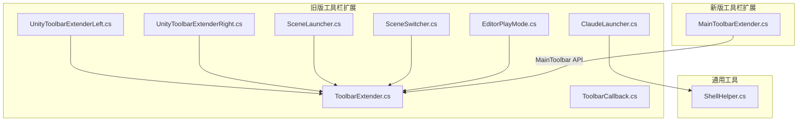
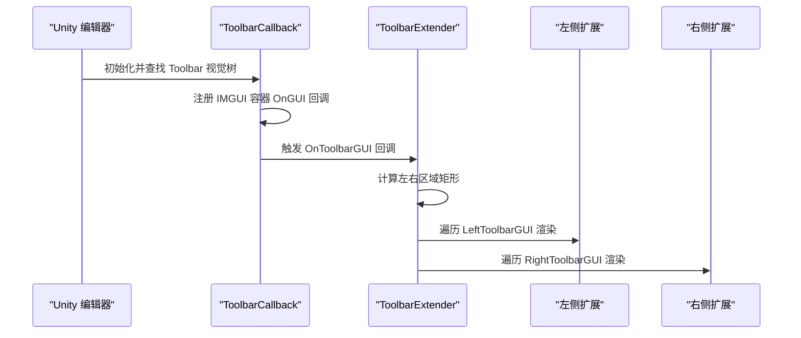
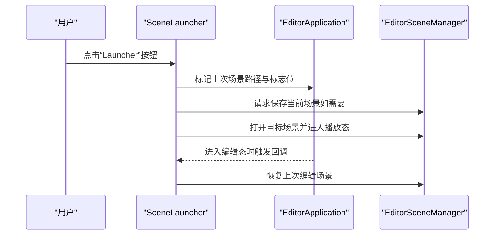
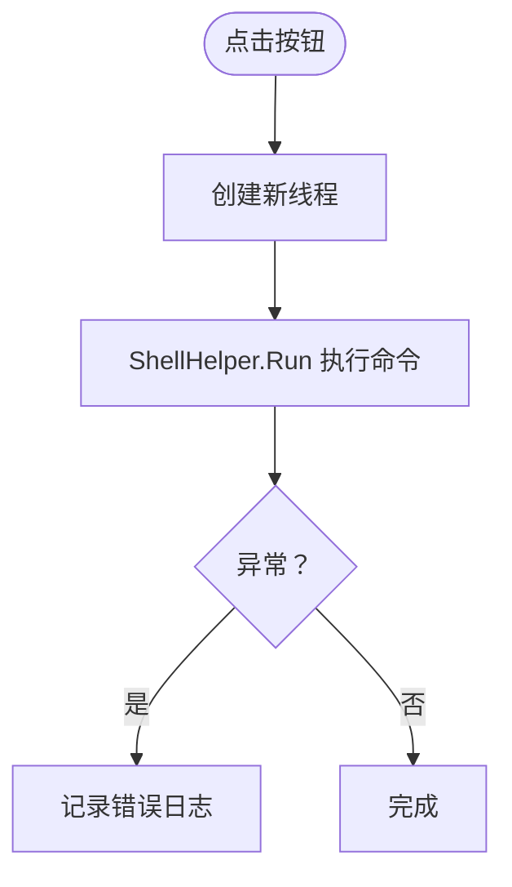
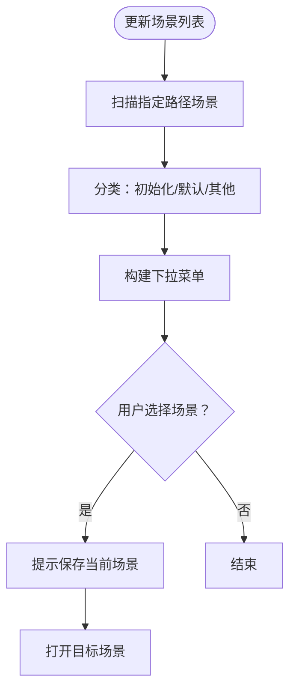
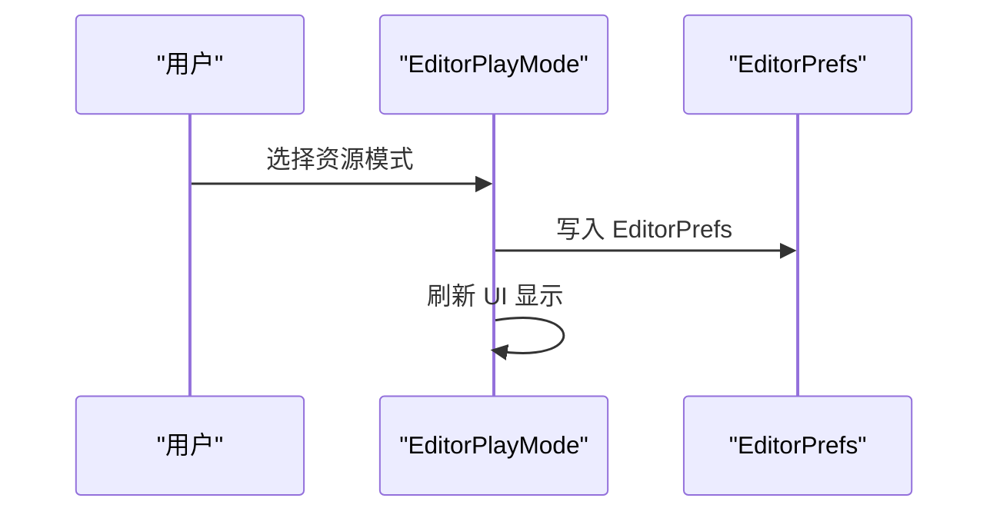
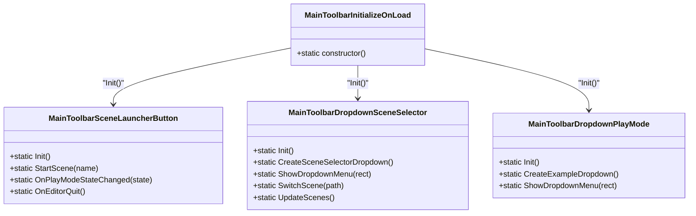
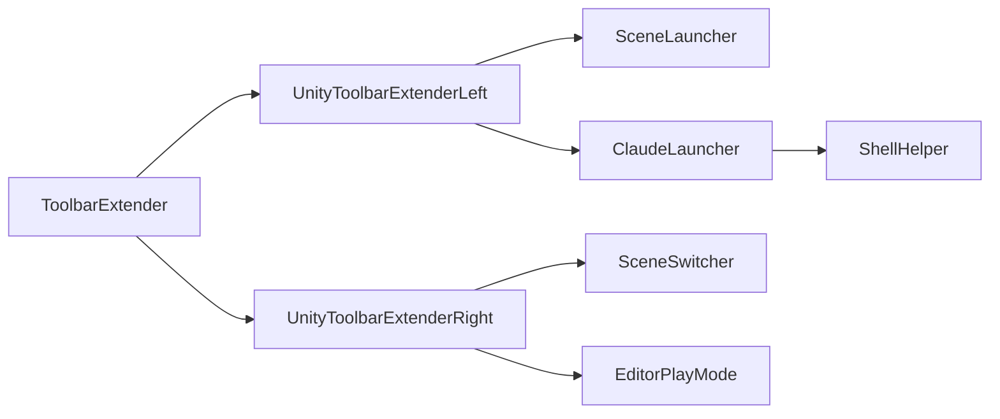

# 工具栏扩展

<cite>
**本文引用的文件列表**
- [ToolbarExtender.cs](file://Assets/Editor/ToolbarExtender/ToolbarExtender.cs)
- [ToolbarCallback.cs](file://Assets/Editor/ToolbarExtender/ToolbarCallback.cs)
- [UnityToolbarExtenderLeft.cs](file://Assets/Editor/ToolbarExtender/UnityToolbarExtenderLeft/UnityToolbarExtenderLeft.cs)
- [UnityToolbarExtenderRight.cs](file://Assets/Editor/ToolbarExtender/UnityToolbarExtenderRight/UnityToolbarExtenderRight.cs)
- [SceneLauncher.cs](file://Assets/Editor/ToolbarExtender/UnityToolbarExtenderLeft/SceneLauncher.cs)
- [ClaudeLauncher.cs](file://Assets/Editor/ToolbarExtender/UnityToolbarExtenderLeft/ClaudeLauncher.cs)
- [SceneSwitcher.cs](file://Assets/Editor/ToolbarExtender/UnityToolbarExtenderRight/SceneSwitcher.cs)
- [EditorPlayMode.cs](file://Assets/Editor/ToolbarExtender/UnityToolbarExtenderRight/EditorPlayMode.cs)
- [MainToolbarExtender.cs](file://Assets/Editor/ToolbarExtender/Unity6000_OR_New/MainToolbarExtender.cs)
- [ShellHelper.cs](file://Assets/TEngine/Editor/Utility/ShellHelper.cs)
</cite>

## 目录
1. [简介](#简介)
2. [项目结构](#项目结构)
3. [核心组件](#核心组件)
4. [架构总览](#架构总览)
5. [详细组件分析](#详细组件分析)
6. [依赖关系分析](#依赖关系分析)
7. [性能考量](#性能考量)
8. [故障排查指南](#故障排查指南)
9. [结论](#结论)
10. [附录：扩展开发指南与最佳实践](#附录扩展开发指南与最佳实践)

## 简介
本文件面向工具栏扩展系统，系统性解析左侧工具栏与右侧工具栏的扩展机制，涵盖场景切换器、编辑器播放模式切换等关键功能的实现原理与扩展方法。文档同时提供工具栏按钮的添加、布局调整、事件处理等技术细节，并给出可复用的扩展示例与最佳实践建议，帮助开发者快速在 Unity 编辑器工具栏中集成自定义功能。

## 项目结构
工具栏扩展位于编辑器脚本目录下，采用“旧版 IMGUI + 新版 MainToolbar API”双通道支持策略：
- 旧版（Unity 2019.1 及以下）：通过反射注入 IMGUI 容器，使用 ToolbarExtender 与 ToolbarCallback 实现左右工具栏扩展。
- Unity 2021.1+（含 6000.3+）：使用 MainToolbar API 提供更稳定的工具栏元素注册与刷新机制。

图表来源
- [ToolbarExtender.cs:1-173](file://Assets/Editor/ToolbarExtender/ToolbarExtender.cs#L1-L173)
- [ToolbarCallback.cs:1-115](file://Assets/Editor/ToolbarExtender/ToolbarCallback.cs#L1-L115)
- [UnityToolbarExtenderLeft.cs:1-21](file://Assets/Editor/ToolbarExtender/UnityToolbarExtenderLeft/UnityToolbarExtenderLeft.cs#L1-L21)
- [UnityToolbarExtenderRight.cs:1-25](file://Assets/Editor/ToolbarExtender/UnityToolbarExtenderRight/UnityToolbarExtenderRight.cs#L1-L25)
- [SceneLauncher.cs:1-122](file://Assets/Editor/ToolbarExtender/UnityToolbarExtenderLeft/SceneLauncher.cs#L1-L122)
- [ClaudeLauncher.cs:1-51](file://Assets/Editor/ToolbarExtender/UnityToolbarExtenderLeft/ClaudeLauncher.cs#L1-L51)
- [SceneSwitcher.cs:1-174](file://Assets/Editor/ToolbarExtender/UnityToolbarExtenderRight/SceneSwitcher.cs#L1-L174)
- [EditorPlayMode.cs:1-83](file://Assets/Editor/ToolbarExtender/UnityToolbarExtenderRight/EditorPlayMode.cs#L1-L83)
- [MainToolbarExtender.cs:1-382](file://Assets/Editor/ToolbarExtender/Unity6000_OR_New/MainToolbarExtender.cs#L1-L382)
- [ShellHelper.cs:1-155](file://Assets/TEngine/Editor/Utility/ShellHelper.cs#L1-L155)

章节来源
- [ToolbarExtender.cs:1-173](file://Assets/Editor/ToolbarExtender/ToolbarExtender.cs#L1-L173)
- [ToolbarCallback.cs:1-115](file://Assets/Editor/ToolbarExtender/ToolbarCallback.cs#L1-L115)
- [UnityToolbarExtenderLeft.cs:1-21](file://Assets/Editor/ToolbarExtender/UnityToolbarExtenderLeft/UnityToolbarExtenderLeft.cs#L1-L21)
- [UnityToolbarExtenderRight.cs:1-25](file://Assets/Editor/ToolbarExtender/UnityToolbarExtenderRight/UnityToolbarExtenderRight.cs#L1-L25)
- [SceneLauncher.cs:1-122](file://Assets/Editor/ToolbarExtender/UnityToolbarExtenderLeft/SceneLauncher.cs#L1-L122)
- [ClaudeLauncher.cs:1-51](file://Assets/Editor/ToolbarExtender/UnityToolbarExtenderLeft/ClaudeLauncher.cs#L1-L51)
- [SceneSwitcher.cs:1-174](file://Assets/Editor/ToolbarExtender/UnityToolbarExtenderRight/SceneSwitcher.cs#L1-L174)
- [EditorPlayMode.cs:1-83](file://Assets/Editor/ToolbarExtender/UnityToolbarExtenderRight/EditorPlayMode.cs#L1-L83)
- [MainToolbarExtender.cs:1-382](file://Assets/Editor/ToolbarExtender/Unity6000_OR_New/MainToolbarExtender.cs#L1-L382)
- [ShellHelper.cs:1-155](file://Assets/TEngine/Editor/Utility/ShellHelper.cs#L1-L155)

## 核心组件
- 工具栏扩展入口与容器管理
  - ToolbarExtender：负责在不同 Unity 版本下计算左右工具栏区域，维护左右 GUI 列表，统一渲染回调。
  - ToolbarCallback：在 Unity 2021.1+ 通过 UIElements 注入 IMGUI 容器；在旧版通过反射挂接 OnGUI 回调。
- 左侧工具栏扩展
  - UnityToolbarExtenderLeft：注册左侧按钮（Claude 启动器、场景启动器），订阅播放状态与退出事件。
  - SceneLauncher：提供“Launcher”按钮，支持记录当前场景并在退出播放态时恢复。
  - ClaudeLauncher：提供“Claude”按钮，异步线程启动外部命令行工具。
- 右侧工具栏扩展
  - UnityToolbarExtenderRight：注册右侧按钮（场景切换器、编辑器播放模式选择器），订阅项目变更与播放状态。
  - SceneSwitcher：扫描场景目录，构建下拉菜单，支持保存提示与切换。
  - EditorPlayMode：提供资源模式选择下拉框，持久化到 EditorPrefs。

章节来源
- [ToolbarExtender.cs:1-173](file://Assets/Editor/ToolbarExtender/ToolbarExtender.cs#L1-L173)
- [ToolbarCallback.cs:1-115](file://Assets/Editor/ToolbarExtender/ToolbarCallback.cs#L1-L115)
- [UnityToolbarExtenderLeft.cs:1-21](file://Assets/Editor/ToolbarExtender/UnityToolbarExtenderLeft/UnityToolbarExtenderLeft.cs#L1-L21)
- [UnityToolbarExtenderRight.cs:1-25](file://Assets/Editor/ToolbarExtender/UnityToolbarExtenderRight/UnityToolbarExtenderRight.cs#L1-L25)
- [SceneLauncher.cs:1-122](file://Assets/Editor/ToolbarExtender/UnityToolbarExtenderLeft/SceneLauncher.cs#L1-L122)
- [ClaudeLauncher.cs:1-51](file://Assets/Editor/ToolbarExtender/UnityToolbarExtenderLeft/ClaudeLauncher.cs#L1-L51)
- [SceneSwitcher.cs:1-174](file://Assets/Editor/ToolbarExtender/UnityToolbarExtenderRight/SceneSwitcher.cs#L1-L174)
- [EditorPlayMode.cs:1-83](file://Assets/Editor/ToolbarExtender/UnityToolbarExtenderRight/EditorPlayMode.cs#L1-L83)

## 架构总览
系统通过“版本适配 + 回调注入”的方式，在 Unity 不同版本中保持一致的工具栏扩展体验。旧版通过 ToolbarCallback 将 OnGUI 回调注入到 Toolbar 的 IMGUI 容器中，再由 ToolbarExtender 分别渲染左右区域；新版则直接使用 MainToolbar API 注册元素。

图表来源
- [ToolbarCallback.cs:47-111](file://Assets/Editor/ToolbarExtender/ToolbarCallback.cs#L47-L111)
- [ToolbarExtender.cs:62-151](file://Assets/Editor/ToolbarExtender/ToolbarExtender.cs#L62-L151)

章节来源
- [ToolbarCallback.cs:1-115](file://Assets/Editor/ToolbarExtender/ToolbarCallback.cs#L1-L115)
- [ToolbarExtender.cs:1-173](file://Assets/Editor/ToolbarExtender/ToolbarExtender.cs#L1-L173)

## 详细组件分析

### 组件一：场景启动器（左侧）
- 功能概述
  - 提供一键启动“main”场景并进入播放态；在播放态退出时自动恢复上次编辑场景。
- 关键实现要点
  - 使用 EditorPrefs 存储上次场景路径与触发标志位。
  - 通过 EditorApplication.update 与延迟回调确保场景切换时机安全。
  - 支持在非播放态下保存当前场景后再切换。
- 扩展建议
  - 可替换场景名常量，或改为下拉选择多场景启动。
  - 可增加快捷键绑定与图标配置。

图表来源
- [SceneLauncher.cs:62-118](file://Assets/Editor/ToolbarExtender/UnityToolbarExtenderLeft/SceneLauncher.cs#L62-L118)
- [UnityToolbarExtenderLeft.cs:11-17](file://Assets/Editor/ToolbarExtender/UnityToolbarExtenderLeft/UnityToolbarExtenderLeft.cs#L11-L17)

章节来源
- [SceneLauncher.cs:1-122](file://Assets/Editor/ToolbarExtender/UnityToolbarExtenderLeft/SceneLauncher.cs#L1-L122)
- [UnityToolbarExtenderLeft.cs:1-21](file://Assets/Editor/ToolbarExtender/UnityToolbarExtenderLeft/UnityToolbarExtenderLeft.cs#L1-L21)

### 组件二：Claude 启动器（左侧）
- 功能概述
  - 在终端中启动外部命令“claude”，跨平台兼容（Windows/Mac/Linux）。
- 关键实现要点
  - 通过 ShellHelper.Run 在项目根目录执行命令。
  - 使用独立线程避免阻塞 UI。
  - 异常捕获与日志输出。
- 扩展建议
  - 可配置命令参数与工作目录。
  - 可增加环境变量注入与输出重定向。

图表来源
- [ClaudeLauncher.cs:32-46](file://Assets/Editor/ToolbarExtender/UnityToolbarExtenderLeft/ClaudeLauncher.cs#L32-L46)
- [ShellHelper.cs:13-105](file://Assets/TEngine/Editor/Utility/ShellHelper.cs#L13-L105)

章节来源
- [ClaudeLauncher.cs:1-51](file://Assets/Editor/ToolbarExtender/UnityToolbarExtenderLeft/ClaudeLauncher.cs#L1-L51)
- [ShellHelper.cs:1-155](file://Assets/TEngine/Editor/Utility/ShellHelper.cs#L1-L155)

### 组件三：场景切换器（右侧）
- 功能概述
  - 扫描指定路径场景，构建“初始化场景/默认场景/其他场景”分组下拉菜单，支持保存提示与切换。
- 关键实现要点
  - 通过 AssetDatabase 查找场景，按路径分类。
  - 使用 GenericMenu 构建上下文菜单，点击项触发切换。
  - PromptSaveCurrentScene 提示保存当前场景。
- 扩展建议
  - 可增加过滤器与排序规则。
  - 可支持多级目录分组。

图表来源
- [SceneSwitcher.cs:25-103](file://Assets/Editor/ToolbarExtender/UnityToolbarExtenderRight/SceneSwitcher.cs#L25-L103)
- [SceneSwitcher.cs:138-170](file://Assets/Editor/ToolbarExtender/UnityToolbarExtenderRight/SceneSwitcher.cs#L138-L170)

章节来源
- [SceneSwitcher.cs:1-174](file://Assets/Editor/ToolbarExtender/UnityToolbarExtenderRight/SceneSwitcher.cs#L1-L174)

### 组件四：编辑器播放模式切换（右侧）
- 功能概述
  - 提供资源模式选择下拉框（编辑器模拟/单机/联机/网页），持久化到 EditorPrefs。
- 关键实现要点
  - 自动计算最长文本宽度，动态调整下拉框宽度。
  - 通过 EditorApplication.playModeStateChanged 控制启用/禁用状态。
- 扩展建议
  - 可增加模式描述与图标。
  - 可与运行时逻辑联动。

图表来源
- [EditorPlayMode.cs:42-79](file://Assets/Editor/ToolbarExtender/UnityToolbarExtenderRight/EditorPlayMode.cs#L42-L79)

章节来源
- [EditorPlayMode.cs:1-83](file://Assets/Editor/ToolbarExtender/UnityToolbarExtenderRight/EditorPlayMode.cs#L1-L83)

### 组件五：新版 MainToolbar 扩展（Unity 6000.3+）
- 功能概述
  - 使用 MainToolbar API 注册按钮与下拉菜单，支持刷新与播放态控制。
- 关键实现要点
  - MainToolbarElement 属性注册工具栏元素。
  - MainToolbar.Refresh 刷新显示。
  - 通过 EditorApplication.projectChanged/activeSceneChanged 等事件更新场景列表与显示。
- 扩展建议
  - 可组合多个自定义元素，合理设置 Dock 位置与索引。

图表来源
- [MainToolbarExtender.cs:11-20](file://Assets/Editor/ToolbarExtender/Unity6000_OR_New/MainToolbarExtender.cs#L11-L20)
- [MainToolbarExtender.cs:22-150](file://Assets/Editor/ToolbarExtender/Unity6000_OR_New/MainToolbarExtender.cs#L22-L150)
- [MainToolbarExtender.cs:152-316](file://Assets/Editor/ToolbarExtender/Unity6000_OR_New/MainToolbarExtender.cs#L152-L316)
- [MainToolbarExtender.cs:318-380](file://Assets/Editor/ToolbarExtender/Unity6000_OR_New/MainToolbarExtender.cs#L318-L380)

章节来源
- [MainToolbarExtender.cs:1-382](file://Assets/Editor/ToolbarExtender/Unity6000_OR_New/MainToolbarExtender.cs#L1-L382)

## 依赖关系分析
- 组件耦合
  - 左右扩展均依赖 ToolbarExtender 的 GUI 列表与渲染逻辑。
  - 场景切换器与播放模式依赖 EditorApplication 事件与 EditorPrefs。
  - Claude 启动器依赖 ShellHelper。
- 版本适配
  - ToolbarCallback 在旧版通过反射注入 OnGUI；在新版通过 UIElements 注入 IMGUI 容器。
- 外部依赖
  - EditorApplication、EditorSceneManager、AssetDatabase、GenericMenu、EditorPrefs 等 Unity 编辑器 API。

图表来源
- [ToolbarExtender.cs:17-46](file://Assets/Editor/ToolbarExtender/ToolbarExtender.cs#L17-L46)
- [UnityToolbarExtenderLeft.cs:11-17](file://Assets/Editor/ToolbarExtender/UnityToolbarExtenderLeft/UnityToolbarExtenderLeft.cs#L11-L17)
- [UnityToolbarExtenderRight.cs:12-21](file://Assets/Editor/ToolbarExtender/UnityToolbarExtenderRight/UnityToolbarExtenderRight.cs#L12-L21)
- [ClaudeLauncher.cs:40](file://Assets/Editor/ToolbarExtender/UnityToolbarExtenderLeft/ClaudeLauncher.cs#L40)
- [ShellHelper.cs:13-105](file://Assets/TEngine/Editor/Utility/ShellHelper.cs#L13-L105)

章节来源
- [ToolbarExtender.cs:1-173](file://Assets/Editor/ToolbarExtender/ToolbarExtender.cs#L1-L173)
- [ToolbarCallback.cs:1-115](file://Assets/Editor/ToolbarExtender/ToolbarCallback.cs#L1-L115)
- [UnityToolbarExtenderLeft.cs:1-21](file://Assets/Editor/ToolbarExtender/UnityToolbarExtenderLeft/UnityToolbarExtenderLeft.cs#L1-L21)
- [UnityToolbarExtenderRight.cs:1-25](file://Assets/Editor/ToolbarExtender/UnityToolbarExtenderRight/UnityToolbarExtenderRight.cs#L1-L25)
- [ClaudeLauncher.cs:1-51](file://Assets/Editor/ToolbarExtender/UnityToolbarExtenderLeft/ClaudeLauncher.cs#L1-L51)
- [ShellHelper.cs:1-155](file://Assets/TEngine/Editor/Utility/ShellHelper.cs#L1-L155)

## 性能考量
- 渲染成本
  - ToolbarExtender 在 OnGUI 中遍历 GUI 列表并绘制，应避免在回调内进行重型操作。
- 事件订阅
  - 注意在退出编辑器时清理事件订阅，防止内存泄漏。
- 场景切换
  - 场景切换前先保存当前场景，避免数据丢失；使用延迟回调确保切换时机。
- 线程与进程
  - 外部命令启动使用独立线程；注意异常捕获与日志输出，避免阻塞主线程。

## 故障排查指南
- 工具栏按钮不显示
  - 检查版本条件编译宏是否匹配当前 Unity 版本。
  - 确认 ToolbarCallback 是否成功注入回调。
- 场景切换失败
  - 检查场景 GUID 是否存在，路径是否正确。
  - 确认保存提示逻辑是否被取消。
- 播放模式切换无效
  - 确认 EditorPrefs 键值是否存在且正确写入。
  - 检查 EditorApplication.playModeStateChanged 事件是否触发。
- 外部命令无法启动
  - 检查 ShellHelper 的命令与工作目录配置。
  - 确认平台兼容性与权限问题。

章节来源
- [ToolbarCallback.cs:47-111](file://Assets/Editor/ToolbarExtender/ToolbarCallback.cs#L47-L111)
- [SceneSwitcher.cs:95-103](file://Assets/Editor/ToolbarExtender/UnityToolbarExtenderRight/SceneSwitcher.cs#L95-L103)
- [EditorPlayMode.cs:70-76](file://Assets/Editor/ToolbarExtender/UnityToolbarExtenderRight/EditorPlayMode.cs#L70-L76)
- [ClaudeLauncher.cs:32-46](file://Assets/Editor/ToolbarExtender/UnityToolbarExtenderLeft/ClaudeLauncher.cs#L32-L46)
- [ShellHelper.cs:13-105](file://Assets/TEngine/Editor/Utility/ShellHelper.cs#L13-L105)

## 结论
该工具栏扩展系统通过“旧版 IMGUI + 新版 MainToolbar API”双通道适配，提供了稳定可靠的扩展能力。左侧与右侧工具栏分别承载了场景启动、外部工具集成、场景切换与资源模式选择等常用功能。通过 EditorPrefs、EditorApplication 事件与 AssetDatabase 等编辑器 API 的组合使用，系统实现了良好的用户体验与可扩展性。建议在后续扩展中遵循事件生命周期管理、异步处理与版本兼容策略，以确保稳定性与性能。

## 附录：扩展开发指南与最佳实践

### 开发步骤
- 新增按钮
  - 在对应扩展类中新增 GUI 方法，向 ToolbarExtender 对应列表添加回调。
  - 旧版：在 InitializeOnLoad 构造函数中将回调加入 LeftToolbarGUI 或 RightToolbarGUI。
  - 新版：使用 MainToolbarElement 属性注册元素。
- 图标与样式
  - 使用 EditorGUIUtility.FindTexture 获取内置图标，或自定义 GUIStyle。
  - 注意不同 Unity 版本的 UI 样式差异。
- 事件处理
  - 订阅 EditorApplication 事件（如 playModeStateChanged、projectChanged、activeSceneChanged）。
  - 在回调中更新 UI 或持久化状态。
- 数据持久化
  - 使用 EditorPrefs 存储用户偏好与状态，注意键名唯一性与默认值设置。
- 跨平台与外部命令
  - 使用 ShellHelper.Run 执行命令，注意平台差异与编码设置。
  - 异常捕获与日志输出，避免阻塞 UI。

### 扩展示例
- 示例一：添加一个“快速保存并播放”按钮
  - 在 UnityToolbarExtenderLeft 中新增 GUI 方法，先调用保存当前场景，再进入播放态。
  - 在构造函数中将回调加入 LeftToolbarGUI。
- 示例二：添加一个“打开资源包目录”的按钮
  - 使用 EditorApplication.RevealInFinder 打开资源包所在目录。
  - 在 GUI 方法中判断当前平台并调用相应 API。
- 示例三：添加一个“切换语言”的下拉框
  - 使用 I2Localization 的语言源 API 获取可用语言列表。
  - 通过 EditorPrefs 记录当前语言，刷新 UI 显示。

### 最佳实践
- 版本兼容
  - 使用条件编译宏区分旧版与新版 API，避免在不支持的版本中编译。
- 性能优化
  - 避免在 OnGUI 中进行昂贵操作；尽量缓存 GUI 样式与尺寸计算结果。
- 用户体验
  - 提供明确的提示与确认对话框（如保存提示）。
  - 保持 UI 响应迅速，必要时使用延迟回调或异步线程。
- 可维护性
  - 将公共逻辑抽取为工具类（如 ShellHelper），减少重复代码。
  - 为扩展功能编写简要注释与使用说明。