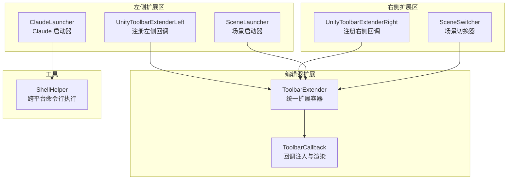
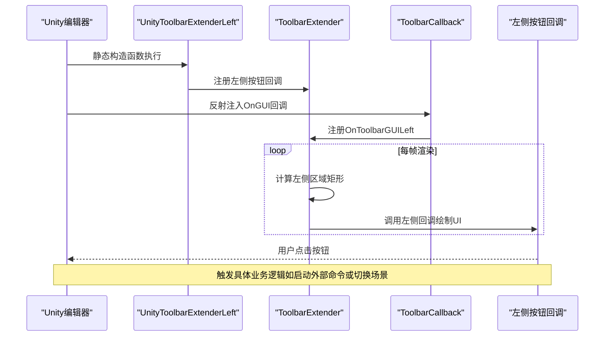
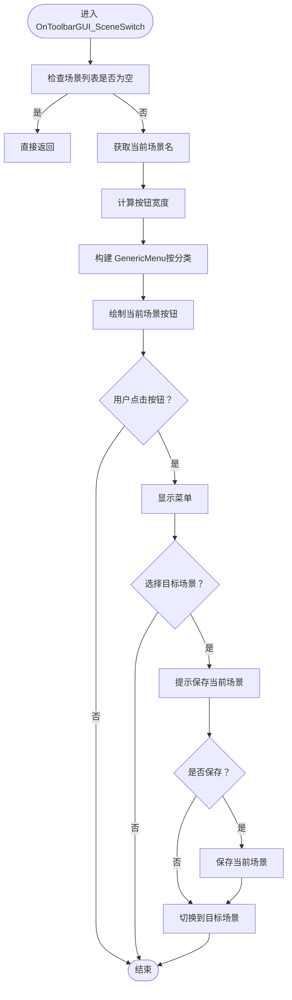
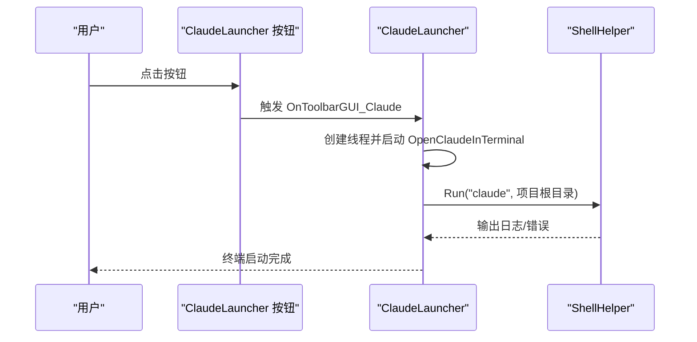
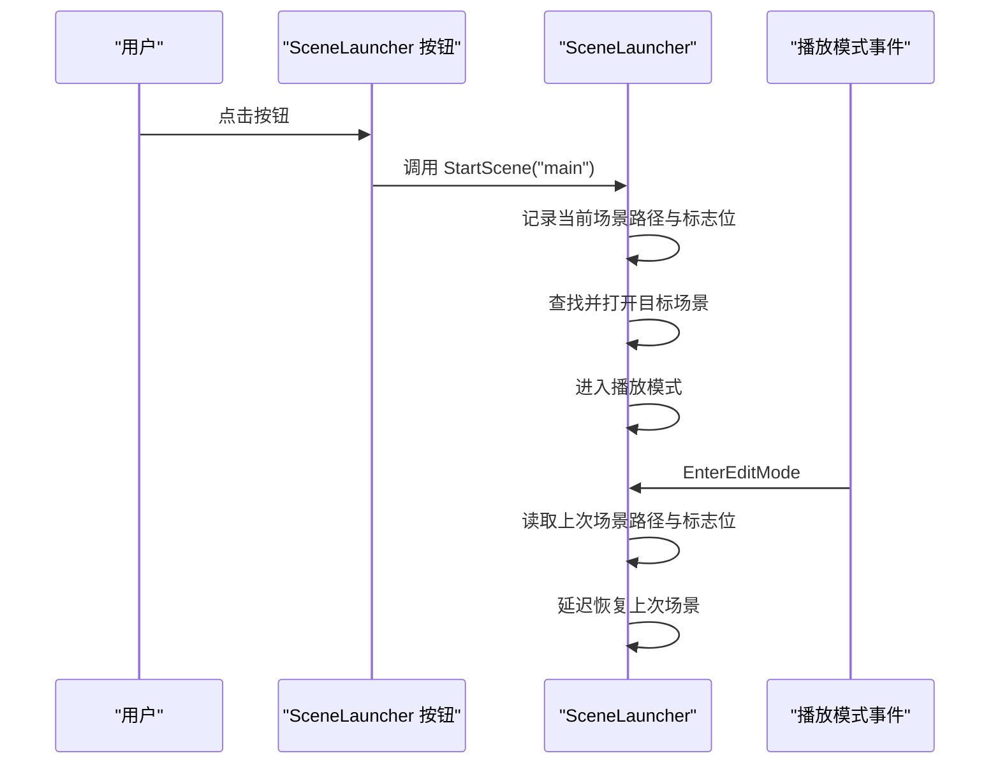
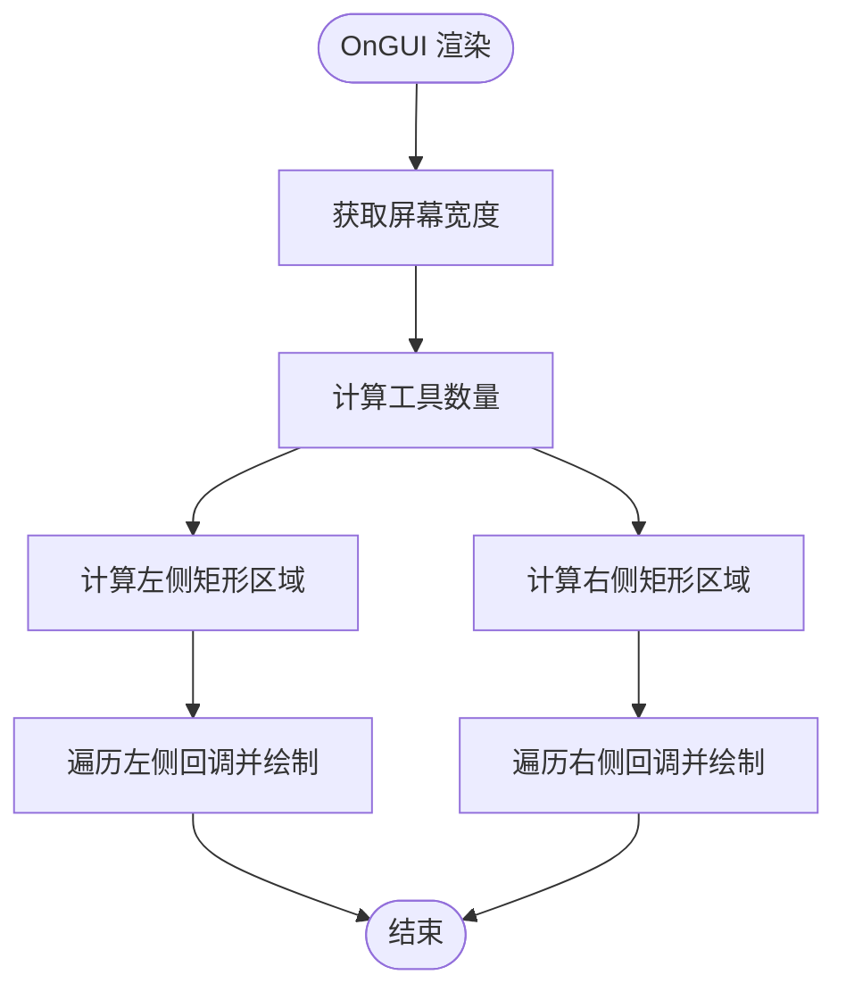
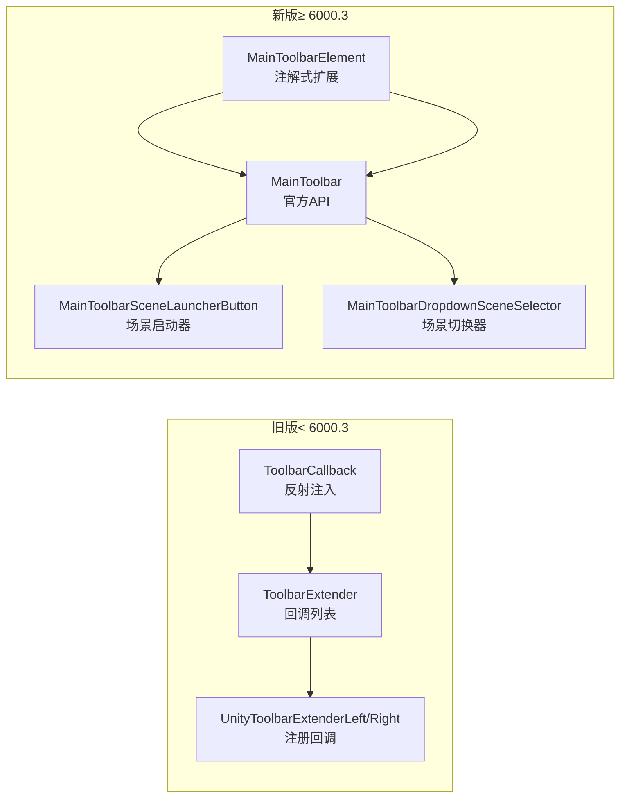
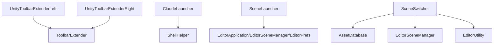

# 左侧工具栏扩展

<cite>
**本文引用的文件**
- [UnityToolbarExtenderLeft.cs](file://Assets/Editor/ToolbarExtender/UnityToolbarExtenderLeft/UnityToolbarExtenderLeft.cs)
- [ClaudeLauncher.cs](file://Assets/Editor/ToolbarExtender/UnityToolbarExtenderLeft/ClaudeLauncher.cs)
- [SceneLauncher.cs](file://Assets/Editor/ToolbarExtender/UnityToolbarExtenderLeft/SceneLauncher.cs)
- [UnityToolbarExtenderRight.cs](file://Assets/Editor/ToolbarExtender/UnityToolbarExtenderRight/UnityToolbarExtenderRight.cs)
- [SceneSwitcher.cs](file://Assets/Editor/ToolbarExtender/UnityToolbarExtenderRight/SceneSwitcher.cs)
- [ToolbarExtender.cs](file://Assets/Editor/ToolbarExtender/ToolbarExtender.cs)
- [ToolbarCallback.cs](file://Assets/Editor/ToolbarExtender/ToolbarCallback.cs)
- [ShellHelper.cs](file://Assets/TEngine/Editor/Utility/ShellHelper.cs)
- [MainToolbarExtender.cs](file://Assets/Editor/ToolbarExtender/Unity6000_OR_New/MainToolbarExtender.cs)
</cite>

## 目录
1. [简介](#简介)
2. [项目结构](#项目结构)
3. [核心组件](#核心组件)
4. [架构总览](#架构总览)
5. [详细组件分析](#详细组件分析)
6. [依赖关系分析](#依赖关系分析)
7. [性能考量](#性能考量)
8. [故障排查指南](#故障排查指南)
9. [结论](#结论)
10. [附录：扩展开发指南](#附录扩展开发指南)

## 简介
本文件面向希望在Unity编辑器左侧工具栏中添加自定义功能的开发者，系统性解析左侧工具栏扩展机制与实现原理，重点覆盖以下主题：
- 场景切换器（SceneSwitcher）的场景列表获取、切换逻辑与UI交互
- ClaudeLauncher 的集成方式与使用方法
- 左侧工具栏的布局计算、按钮添加、事件处理等技术细节
- 左侧工具栏扩展的开发指南（自定义按钮、图标配置、快捷键绑定等）
- 具体扩展示例与最佳实践建议

## 项目结构
左侧工具栏扩展位于编辑器扩展模块中，采用“分层+分区域”的组织方式：
- 工具栏扩展核心：ToolbarExtender 与 ToolbarCallback 提供统一的扩展入口与渲染容器
- 左侧扩展区：UnityToolbarExtenderLeft 注册左侧按钮回调
- 右侧扩展区：UnityToolbarExtenderRight 注册右侧按钮回调（包含 SceneSwitcher）
- 实用工具：ShellHelper 提供跨平台命令行执行能力

**图表来源**
- [ToolbarExtender.cs:11-170](file://Assets/Editor/ToolbarExtender/ToolbarExtender.cs#L11-L170)
- [ToolbarCallback.cs:16-112](file://Assets/Editor/ToolbarExtender/ToolbarCallback.cs#L16-L112)
- [UnityToolbarExtenderLeft.cs:8-18](file://Assets/Editor/ToolbarExtender/UnityToolbarExtenderLeft/UnityToolbarExtenderLeft.cs#L8-L18)
- [UnityToolbarExtenderRight.cs:8-21](file://Assets/Editor/ToolbarExtender/UnityToolbarExtenderRight/UnityToolbarExtenderRight.cs#L8-L21)
- [ClaudeLauncher.cs:10-47](file://Assets/Editor/ToolbarExtender/UnityToolbarExtenderLeft/ClaudeLauncher.cs#L10-L47)
- [SceneLauncher.cs:11-119](file://Assets/Editor/ToolbarExtender/UnityToolbarExtenderLeft/SceneLauncher.cs#L11-L119)
- [SceneSwitcher.cs:16-104](file://Assets/Editor/ToolbarExtender/UnityToolbarExtenderRight/SceneSwitcher.cs#L16-L104)
- [ShellHelper.cs:11-105](file://Assets/TEngine/Editor/Utility/ShellHelper.cs#L11-L105)

**章节来源**
- [ToolbarExtender.cs:11-170](file://Assets/Editor/ToolbarExtender/ToolbarExtender.cs#L11-L170)
- [ToolbarCallback.cs:16-112](file://Assets/Editor/ToolbarExtender/ToolbarCallback.cs#L16-L112)
- [UnityToolbarExtenderLeft.cs:8-18](file://Assets/Editor/ToolbarExtender/UnityToolbarExtenderLeft/UnityToolbarExtenderLeft.cs#L8-L18)
- [UnityToolbarExtenderRight.cs:8-21](file://Assets/Editor/ToolbarExtender/UnityToolbarExtenderRight/UnityToolbarExtenderRight.cs#L8-L21)

## 核心组件
- ToolbarExtender：维护左侧/右侧回调列表，负责计算工具栏左右区域矩形并逐个调用回调绘制UI
- ToolbarCallback：通过反射定位Unity Toolbar 的IMGUI容器，注入OnGUI回调，实现扩展UI的渲染
- UnityToolbarExtenderLeft：在编辑器初始化时向左侧回调列表注册按钮绘制函数
- UnityToolbarExtenderRight：在编辑器初始化时向右侧回调列表注册按钮绘制函数
- ClaudeLauncher：左侧按钮，点击后在终端中启动外部命令（通过ShellHelper）
- SceneLauncher：左侧按钮，一键启动指定场景，并在退出播放模式后恢复上次编辑场景
- SceneSwitcher：右侧下拉菜单，按分类列出项目内所有场景，支持切换

**章节来源**
- [ToolbarExtender.cs:17-170](file://Assets/Editor/ToolbarExtender/ToolbarExtender.cs#L17-L170)
- [ToolbarCallback.cs:37-112](file://Assets/Editor/ToolbarExtender/ToolbarCallback.cs#L37-L112)
- [UnityToolbarExtenderLeft.cs:11-17](file://Assets/Editor/ToolbarExtender/UnityToolbarExtenderLeft/UnityToolbarExtenderLeft.cs#L11-L17)
- [UnityToolbarExtenderRight.cs:12-21](file://Assets/Editor/ToolbarExtender/UnityToolbarExtenderRight/UnityToolbarExtenderRight.cs#L12-L21)
- [ClaudeLauncher.cs:13-46](file://Assets/Editor/ToolbarExtender/UnityToolbarExtenderLeft/ClaudeLauncher.cs#L13-L46)
- [SceneLauncher.cs:21-118](file://Assets/Editor/ToolbarExtender/UnityToolbarExtenderLeft/SceneLauncher.cs#L21-L118)
- [SceneSwitcher.cs:25-104](file://Assets/Editor/ToolbarExtender/UnityToolbarExtenderRight/SceneSwitcher.cs#L25-L104)

## 架构总览
左侧工具栏扩展的整体流程如下：
- 初始化阶段：UnityToolbarExtenderLeft 在静态构造函数中注册左侧按钮回调，并订阅播放模式状态变更与编辑器退出事件
- 渲染阶段：ToolbarExtender 根据屏幕宽度与工具数量计算左侧区域矩形，遍历左侧回调列表逐一绘制
- 事件阶段：按钮回调内部触发具体行为（如启动外部进程或切换场景）

**图表来源**
- [UnityToolbarExtenderLeft.cs:11-17](file://Assets/Editor/ToolbarExtender/UnityToolbarExtenderLeft/UnityToolbarExtenderLeft.cs#L11-L17)
- [ToolbarExtender.cs:62-151](file://Assets/Editor/ToolbarExtender/ToolbarExtender.cs#L62-L151)
- [ToolbarCallback.cs:47-112](file://Assets/Editor/ToolbarExtender/ToolbarCallback.cs#L47-L112)

## 详细组件分析

### 场景切换器（SceneSwitcher）实现
SceneSwitcher 位于右侧扩展区，提供“按分类列出场景并切换”的功能。其关键点包括：
- 场景列表获取
  - 初始化场景与默认场景：通过路径扫描获取场景集合
  - 其他场景：扫描全项目场景后剔除上述两类
- 切换逻辑
  - 显示当前场景名作为按钮
  - 点击弹出菜单，按分类展示场景项
  - 选择目标场景后，先提示保存当前场景，再切换
- UI交互
  - 动态计算按钮宽度以适配当前场景名
  - 分类菜单项以“分类/场景名”形式呈现

**图表来源**
- [SceneSwitcher.cs:42-104](file://Assets/Editor/ToolbarExtender/UnityToolbarExtenderRight/SceneSwitcher.cs#L42-L104)
- [SceneSwitcher.cs:108-136](file://Assets/Editor/ToolbarExtender/UnityToolbarExtenderRight/SceneSwitcher.cs#L108-L136)
- [SceneSwitcher.cs:138-169](file://Assets/Editor/ToolbarExtender/UnityToolbarExtenderRight/SceneSwitcher.cs#L138-L169)

**章节来源**
- [SceneSwitcher.cs:16-104](file://Assets/Editor/ToolbarExtender/UnityToolbarExtenderRight/SceneSwitcher.cs#L16-L104)
- [UnityToolbarExtenderRight.cs:12-21](file://Assets/Editor/ToolbarExtender/UnityToolbarExtenderRight/UnityToolbarExtenderRight.cs#L12-L21)

### ClaudeLauncher 集成与使用
ClaudeLauncher 为左侧工具栏添加一个“Claude”按钮，点击后在终端中启动外部命令。其实现要点：
- 按钮绘制：使用统一的按钮样式风格，设置内边距与字体样式
- 图标与提示：使用PlayButton图标与“在终端中打开Claude”的提示
- 事件处理：点击后在独立线程中执行命令启动
- 命令执行：通过 ShellHelper.Run 调用外部命令，自动识别平台并设置工作目录为项目根目录

**图表来源**
- [ClaudeLauncher.cs:13-46](file://Assets/Editor/ToolbarExtender/UnityToolbarExtenderLeft/ClaudeLauncher.cs#L13-L46)
- [ShellHelper.cs:13-105](file://Assets/TEngine/Editor/Utility/ShellHelper.cs#L13-L105)

**章节来源**
- [ClaudeLauncher.cs:13-46](file://Assets/Editor/ToolbarExtender/UnityToolbarExtenderLeft/ClaudeLauncher.cs#L13-L46)
- [ShellHelper.cs:13-105](file://Assets/TEngine/Editor/Utility/ShellHelper.cs#L13-L105)

### 场景启动器（SceneLauncher）与播放模式恢复
SceneLauncher 提供一键启动指定场景的能力，并在退出播放模式后恢复上次编辑的场景。关键流程：
- 按钮绘制：使用统一按钮样式，图标为PlayButton，提示“启动场景启动器”
- 启动逻辑：点击后记录当前场景路径（若非目标场景），随后查找并打开目标场景，再进入播放模式
- 恢复逻辑：监听播放模式进入编辑模式事件，若此前由启动器触发，则延迟恢复上次场景

**图表来源**
- [SceneLauncher.cs:21-118](file://Assets/Editor/ToolbarExtender/UnityToolbarExtenderLeft/SceneLauncher.cs#L21-L118)

**章节来源**
- [SceneLauncher.cs:21-118](file://Assets/Editor/ToolbarExtender/UnityToolbarExtenderLeft/SceneLauncher.cs#L21-L118)

### 工具栏布局计算与按钮添加
ToolbarExtender 负责计算左右区域矩形并渲染回调列表中的UI。其关键步骤：
- 屏幕宽度与工具数量：根据Unity版本差异计算工具数量
- 左右区域矩形：基于工具数量与播放/暂停/停止按钮位置推导左右区域边界
- 回调渲染：在各自区域内横向排列，依次调用注册的回调函数

**图表来源**
- [ToolbarExtender.cs:62-151](file://Assets/Editor/ToolbarExtender/ToolbarExtender.cs#L62-L151)

**章节来源**
- [ToolbarExtender.cs:62-151](file://Assets/Editor/ToolbarExtender/ToolbarExtender.cs#L62-L151)

### Unity 版本兼容性与新旧方案
项目同时提供了针对不同Unity版本的两套实现：
- 旧版（< Unity 6000.3）：通过 ToolbarCallback 反射注入IMGUI容器，使用 ToolbarExtender 的 LeftToolbarGUI/RightToolbarGUI 列表
- 新版（≥ Unity 6000.3）：使用 MainToolbarElement 注解与 MainToolbar API，提供更稳定的扩展方式

**图表来源**
- [ToolbarCallback.cs:41-112](file://Assets/Editor/ToolbarExtender/ToolbarCallback.cs#L41-L112)
- [ToolbarExtender.cs:17-170](file://Assets/Editor/ToolbarExtender/ToolbarExtender.cs#L17-L170)
- [UnityToolbarExtenderLeft.cs:8-18](file://Assets/Editor/ToolbarExtender/UnityToolbarExtenderLeft/UnityToolbarExtenderLeft.cs#L8-L18)
- [UnityToolbarExtenderRight.cs:8-21](file://Assets/Editor/ToolbarExtender/UnityToolbarExtenderRight/UnityToolbarExtenderRight.cs#L8-L21)
- [MainToolbarExtender.cs:11-20](file://Assets/Editor/ToolbarExtender/Unity6000_OR_New/MainToolbarExtender.cs#L11-L20)
- [MainToolbarExtender.cs:22-150](file://Assets/Editor/ToolbarExtender/Unity6000_OR_New/MainToolbarExtender.cs#L22-L150)
- [MainToolbarExtender.cs:152-200](file://Assets/Editor/ToolbarExtender/Unity6000_OR_New/MainToolbarExtender.cs#L152-L200)

**章节来源**
- [MainToolbarExtender.cs:11-20](file://Assets/Editor/ToolbarExtender/Unity6000_OR_New/MainToolbarExtender.cs#L11-L20)
- [MainToolbarExtender.cs:22-150](file://Assets/Editor/ToolbarExtender/Unity6000_OR_New/MainToolbarExtender.cs#L22-L150)
- [MainToolbarExtender.cs:152-200](file://Assets/Editor/ToolbarExtender/Unity6000_OR_New/MainToolbarExtender.cs#L152-L200)

## 依赖关系分析
- 组件耦合
  - UnityToolbarExtenderLeft/Right 仅依赖 ToolbarExtender 的回调列表，耦合度低
  - ClaudeLauncher 依赖 ShellHelper，职责单一，便于替换
  - SceneLauncher 依赖 EditorApplication/EditorSceneManager/EditorPrefs，关注点分离清晰
  - SceneSwitcher 依赖 AssetDatabase/EditorSceneManager/EditorUtility，集中于场景管理
- 外部依赖
  - 反射依赖Unity内部类型（Toolbar/IMGUIContainer），需随Unity版本升级而适配
  - 跨平台命令行执行依赖系统环境变量与PATH

**图表来源**
- [UnityToolbarExtenderLeft.cs:11-17](file://Assets/Editor/ToolbarExtender/UnityToolbarExtenderLeft/UnityToolbarExtenderLeft.cs#L11-L17)
- [UnityToolbarExtenderRight.cs:12-21](file://Assets/Editor/ToolbarExtender/UnityToolbarExtenderRight/UnityToolbarExtenderRight.cs#L12-L21)
- [ClaudeLauncher.cs:32-40](file://Assets/Editor/ToolbarExtender/UnityToolbarExtenderLeft/ClaudeLauncher.cs#L32-L40)
- [SceneLauncher.cs:66-117](file://Assets/Editor/ToolbarExtender/UnityToolbarExtenderLeft/SceneLauncher.cs#L66-L117)
- [SceneSwitcher.cs:138-169](file://Assets/Editor/ToolbarExtender/UnityToolbarExtenderRight/SceneSwitcher.cs#L138-L169)

**章节来源**
- [ToolbarExtender.cs:17-170](file://Assets/Editor/ToolbarExtender/ToolbarExtender.cs#L17-L170)
- [ShellHelper.cs:13-105](file://Assets/TEngine/Editor/Utility/ShellHelper.cs#L13-L105)

## 性能考量
- 回调列表遍历：每帧对回调列表进行顺序遍历，建议控制回调数量与单次绘制开销
- 场景切换：场景切换涉及磁盘IO与编辑器状态变更，避免在高频事件中重复触发
- 终端启动：命令执行在独立线程中进行，注意异常捕获与日志输出，避免阻塞主线程
- 版本适配：反射注入在高版本Unity中可能不稳定，建议优先使用新版MainToolbar API

[本节为通用指导，无需特定文件引用]

## 故障排查指南
- 按钮不显示
  - 检查是否在正确的初始化阶段注册了回调
  - 确认工具栏区域是否被其他UI遮挡
- 场景切换失败
  - 确认目标场景GUID是否存在且路径正确
  - 检查场景是否被标记为“包含在构建中”
- 终端启动失败
  - 检查ShellHelper参数（命令、工作目录、环境变量）
  - 确认系统PATH中是否包含目标命令
- 播放模式恢复异常
  - 检查EditorPrefs键值是否正确写入与读取
  - 确认事件订阅是否在正确时机触发

**章节来源**
- [SceneLauncher.cs:37-60](file://Assets/Editor/ToolbarExtender/UnityToolbarExtenderLeft/SceneLauncher.cs#L37-L60)
- [SceneSwitcher.cs:95-103](file://Assets/Editor/ToolbarExtender/UnityToolbarExtenderRight/SceneSwitcher.cs#L95-L103)
- [ClaudeLauncher.cs:32-46](file://Assets/Editor/ToolbarExtender/UnityToolbarExtenderLeft/ClaudeLauncher.cs#L32-L46)

## 结论
左侧工具栏扩展通过 ToolbarExtender 与 ToolbarCallback 提供了稳定且可扩展的机制。结合 ClaudeLauncher 与 SceneLauncher，开发者可以快速集成外部工具与场景管理功能。对于新版本Unity，推荐使用 MainToolbar API 以获得更好的稳定性与可维护性。

[本节为总结，无需特定文件引用]

## 附录：扩展开发指南

### 如何添加自定义按钮
- 在左侧扩展区新增按钮回调
  - 在 UnityToolbarExtenderLeft 中注册回调至 LeftToolbarGUI
  - 在回调中绘制按钮并处理点击事件
- 在右侧扩展区新增按钮回调
  - 在 UnityToolbarExtenderRight 中注册回调至 RightToolbarGUI
  - 参考 SceneSwitcher 的菜单与按钮组合方式

**章节来源**
- [UnityToolbarExtenderLeft.cs:11-17](file://Assets/Editor/ToolbarExtender/UnityToolbarExtenderLeft/UnityToolbarExtenderLeft.cs#L11-L17)
- [UnityToolbarExtenderRight.cs:12-21](file://Assets/Editor/ToolbarExtender/UnityToolbarExtenderRight/UnityToolbarExtenderRight.cs#L12-L21)

### 图标配置与样式
- 图标来源
  - 使用 EditorGUIUtility.FindTexture 或 IconContent 获取内置图标
  - 支持自定义纹理资源，注意打包与路径
- 样式设置
  - 通过 GUIStyle 控制内边距、对齐与字体样式
  - 注意按钮宽度与文本长度的动态适配

**章节来源**
- [ClaudeLauncher.cs:22-30](file://Assets/Editor/ToolbarExtender/UnityToolbarExtenderLeft/ClaudeLauncher.cs#L22-L30)
- [SceneSwitcher.cs:71-78](file://Assets/Editor/ToolbarExtender/UnityToolbarExtenderRight/SceneSwitcher.cs#L71-L78)

### 快捷键绑定
- 当前实现未直接绑定快捷键
- 建议在按钮回调中结合 InputSystem 或 EditorApplication.ExecuteMenuItem 实现快捷键触发
- 对于复杂交互，可参考 SceneSwitcher 的菜单与事件处理模式

**章节来源**
- [SceneSwitcher.cs:42-82](file://Assets/Editor/ToolbarExtender/UnityToolbarExtenderRight/SceneSwitcher.cs#L42-L82)

### 扩展示例与最佳实践
- 示例一：添加“打开文档”按钮
  - 使用 ShellHelper 调用系统默认浏览器打开本地HTML文档
  - 注意跨平台路径与协议差异
- 示例二：添加“一键构建”按钮
  - 在独立线程中执行构建流程，避免阻塞编辑器
  - 结合 EditorUtility.DisplayProgressBar 提供进度反馈
- 最佳实践
  - 将UI绘制与业务逻辑分离，保持回调轻量
  - 对外部命令执行进行异常捕获与日志输出
  - 使用 EditorPrefs 存储用户偏好与状态
  - 避免在高频事件中进行重IO操作

**章节来源**
- [ShellHelper.cs:13-105](file://Assets/TEngine/Editor/Utility/ShellHelper.cs#L13-L105)
- [SceneLauncher.cs:66-118](file://Assets/Editor/ToolbarExtender/UnityToolbarExtenderLeft/SceneLauncher.cs#L66-L118)