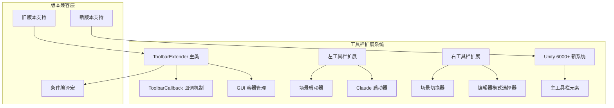
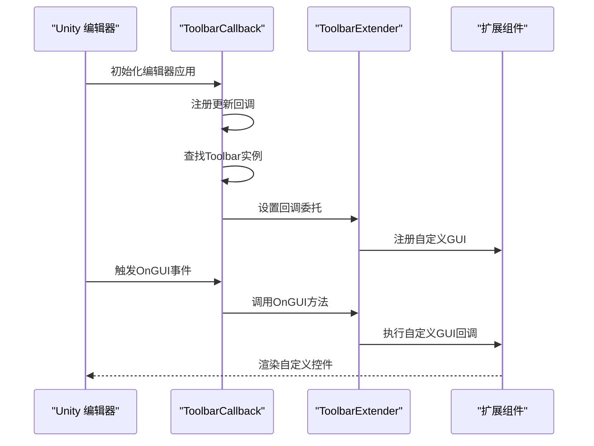
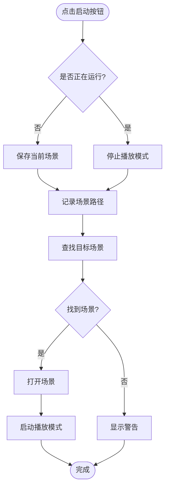
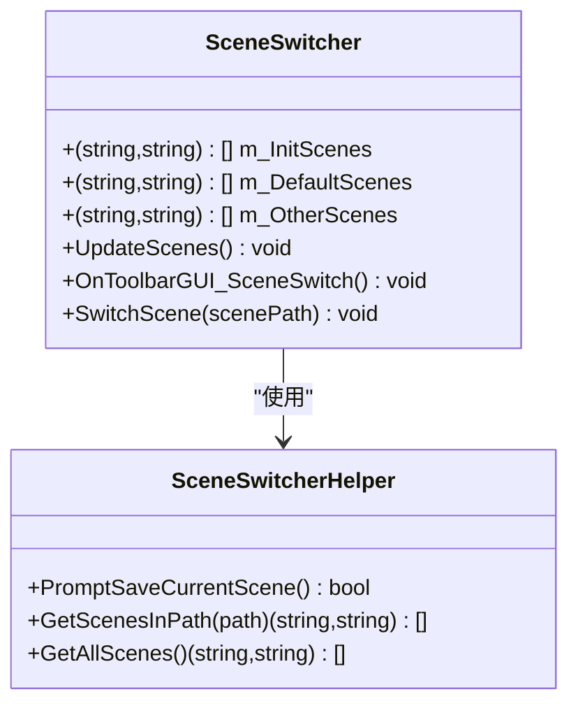
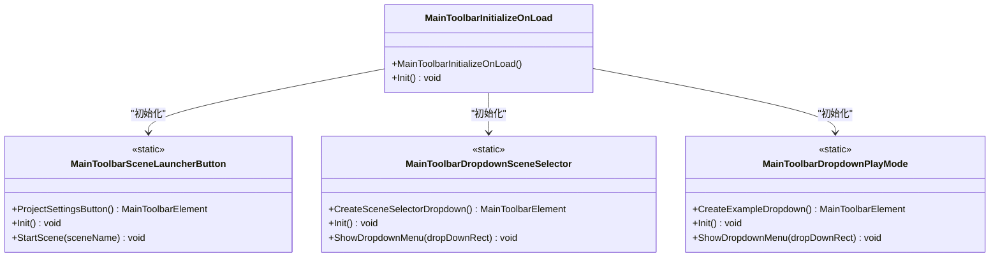
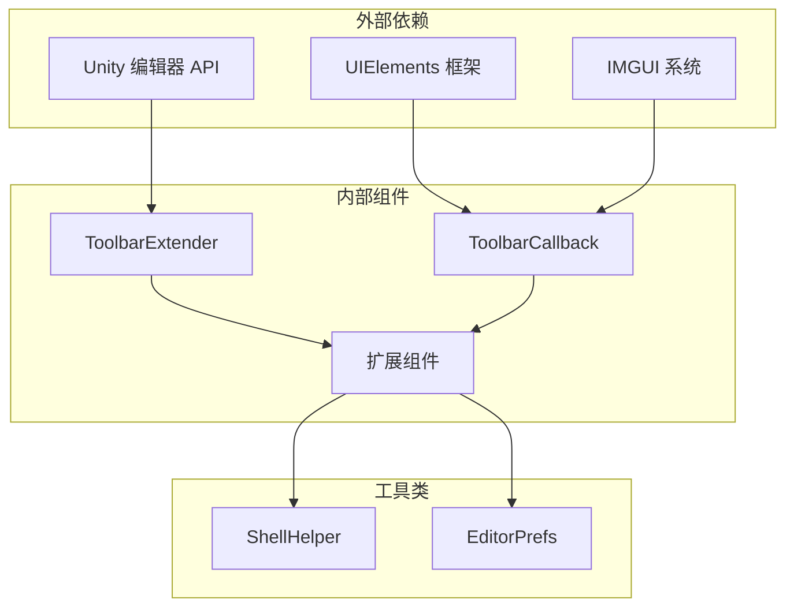

# 自定义扩展开发

<cite>
**本文档引用的文件**
- [ToolbarExtender.cs](file://Assets/Editor/ToolbarExtender/ToolbarExtender.cs)
- [ToolbarCallback.cs](file://Assets/Editor/ToolbarExtender/ToolbarCallback.cs)
- [UnityToolbarExtenderLeft.cs](file://Assets/Editor/ToolbarExtender/UnityToolbarExtenderLeft/UnityToolbarExtenderLeft.cs)
- [UnityToolbarExtenderRight.cs](file://Assets/Editor/ToolbarExtender/UnityToolbarExtenderRight/UnityToolbarExtenderRight.cs)
- [MainToolbarExtender.cs](file://Assets/Editor/ToolbarExtender/Unity6000_OR_New/MainToolbarExtender.cs)
- [ClaudeLauncher.cs](file://Assets/Editor/ToolbarExtender/UnityToolbarExtenderLeft/ClaudeLauncher.cs)
- [SceneLauncher.cs](file://Assets/Editor/ToolbarExtender/UnityToolbarExtenderLeft/SceneLauncher.cs)
- [SceneSwitcher.cs](file://Assets/Editor/ToolbarExtender/UnityToolbarExtenderRight/SceneSwitcher.cs)
- [EditorPlayMode.cs](file://Assets/Editor/ToolbarExtender/UnityToolbarExtenderRight/EditorPlayMode.cs)
- [ShellHelper.cs](file://Assets/TEngine/Editor/Utility/ShellHelper.cs)
- [TEngine.Editor.asmdef](file://Assets/TEngine/Editor/TEngine.Editor.asmdef)
</cite>

## 目录
1. [简介](#简介)
2. [项目结构](#项目结构)
3. [核心组件](#核心组件)
4. [架构概览](#架构概览)
5. [详细组件分析](#详细组件分析)
6. [依赖关系分析](#依赖关系分析)
7. [性能考虑](#性能考虑)
8. [故障排除指南](#故障排除指南)
9. [结论](#结论)
10. [附录](#附录)

## 简介

本项目提供了一个完整的Unity编辑器工具栏扩展系统，允许开发者在Unity编辑器的顶部工具栏中添加自定义按钮和功能。该系统支持多个Unity版本，包括较新的Unity 6000.3+版本和传统的旧版本，通过条件编译实现向后兼容。

系统的核心设计目标是：
- 提供统一的工具栏扩展接口
- 支持左右两侧的工具栏区域
- 实现跨版本兼容性
- 提供丰富的扩展示例
- 确保良好的性能和稳定性

## 项目结构

工具栏扩展系统采用模块化设计，主要包含以下核心组件：

**图表来源**
- [ToolbarExtender.cs:1-173](file://Assets/Editor/ToolbarExtender/ToolbarExtender.cs#L1-L173)
- [ToolbarCallback.cs:1-115](file://Assets/Editor/ToolbarExtender/ToolbarCallback.cs#L1-L115)

**章节来源**
- [ToolbarExtender.cs:1-173](file://Assets/Editor/ToolbarExtender/ToolbarExtender.cs#L1-L173)
- [UnityToolbarExtenderLeft.cs:1-21](file://Assets/Editor/ToolbarExtender/UnityToolbarExtenderLeft/UnityToolbarExtenderLeft.cs#L1-L21)
- [UnityToolbarExtenderRight.cs:1-25](file://Assets/Editor/ToolbarExtender/UnityToolbarExtenderRight/UnityToolbarExtenderRight.cs#L1-L25)

## 核心组件

### ToolbarExtender 主类

`ToolbarExtender` 是整个工具栏扩展系统的核心类，负责管理工具栏的布局和渲染。它提供了两个静态列表来管理左右两侧的GUI内容：

- `LeftToolbarGUI`: 左侧工具栏的回调函数列表
- `RightToolbarGUI`: 右侧工具栏的回调函数列表

该类使用反射机制动态获取Unity内部的工具栏信息，并根据不同的Unity版本调整布局参数。

**章节来源**
- [ToolbarExtender.cs:11-173](file://Assets/Editor/ToolbarExtender/ToolbarExtender.cs#L11-L173)

### ToolbarCallback 回调机制

`ToolbarCallback` 类实现了工具栏的回调机制，通过反射访问Unity内部的Toolbar类，注册自定义的GUI回调函数。该类支持多种Unity版本：

- Unity 2021.1+ 使用UIElements框架
- Unity 2020.1-2020.3 使用窗口后端系统
- Unity 2019.1-2019.3 使用IMGUIContainer
- 更早版本使用传统的IMGUI方法

**章节来源**
- [ToolbarCallback.cs:16-115](file://Assets/Editor/ToolbarExtender/ToolbarCallback.cs#L16-L115)

### GUI 容器管理

系统通过`GUILayout.BeginArea`和`GUILayout.BeginHorizontal`创建独立的GUI容器，确保自定义控件不会与Unity原生控件发生冲突。容器的尺寸和位置根据屏幕宽度和Unity版本动态计算。

**章节来源**
- [ToolbarExtender.cs:62-151](file://Assets/Editor/ToolbarExtender/ToolbarExtender.cs#L62-L151)

## 架构概览

工具栏扩展系统采用分层架构设计，实现了清晰的关注点分离：

**图表来源**
- [ToolbarCallback.cs:41-105](file://Assets/Editor/ToolbarExtender/ToolbarCallback.cs#L41-L105)
- [ToolbarExtender.cs:20-46](file://Assets/Editor/ToolbarExtender/ToolbarExtender.cs#L20-L46)

系统架构的关键特性：

1. **反射驱动**: 通过反射访问Unity内部类型，实现跨版本兼容
2. **回调机制**: 使用委托模式实现松耦合的扩展机制
3. **容器隔离**: 独立的GUI容器避免与其他控件冲突
4. **条件编译**: 针对不同Unity版本提供专门的实现

## 详细组件分析

### 左侧工具栏扩展

左侧工具栏扩展包含两个主要功能组件：

#### 场景启动器 (SceneLauncher)

场景启动器提供了一个一键启动指定场景的功能，具有以下特性：

- **场景缓存**: 使用`EditorPrefs`存储上次编辑的场景路径
- **智能切换**: 自动检测当前场景状态并进行相应处理
- **线程安全**: 使用延迟调用确保场景切换的正确性

**图表来源**
- [SceneLauncher.cs:62-118](file://Assets/Editor/ToolbarExtender/UnityToolbarExtenderLeft/SceneLauncher.cs#L62-L118)

#### Claude 启动器 (ClaudeLauncher)

Claude 启动器提供了一个集成终端启动功能，支持多平台操作：

- **跨平台支持**: 自动适配Windows、Mac和Linux环境
- **线程处理**: 使用独立线程启动外部程序，避免阻塞Unity主线程
- **错误处理**: 完善的异常捕获和日志记录机制

**章节来源**
- [SceneLauncher.cs:1-122](file://Assets/Editor/ToolbarExtender/UnityToolbarExtenderLeft/SceneLauncher.cs#L1-L122)
- [ClaudeLauncher.cs:1-51](file://Assets/Editor/ToolbarExtender/UnityToolbarExtenderLeft/ClaudeLauncher.cs#L1-L51)

### 右侧工具栏扩展

右侧工具栏扩展提供了更复杂的功能组合：

#### 场景切换器 (SceneSwitcher)

场景切换器是一个功能完整的场景管理工具，支持：

- **分类管理**: 将场景按初始化路径、默认路径和其他路径分类
- **智能搜索**: 使用Unity的AssetDatabase进行场景查找
- **安全切换**: 在切换前检查并提示保存未保存的更改

**图表来源**
- [SceneSwitcher.cs:106-171](file://Assets/Editor/ToolbarExtender/UnityToolbarExtenderRight/SceneSwitcher.cs#L106-L171)

#### 编辑器模式选择器 (EditorPlayMode)

编辑器模式选择器提供了一个下拉菜单来选择不同的资源加载模式：

- **模式管理**: 支持编辑器模式、单机模式、联机模式和WebGL模式
- **持久化存储**: 使用`EditorPrefs`保存用户的选择
- **动态刷新**: 当播放模式改变时自动更新显示

**章节来源**
- [SceneSwitcher.cs:1-174](file://Assets/Editor/ToolbarExtender/UnityToolbarExtenderRight/SceneSwitcher.cs#L1-L174)
- [EditorPlayMode.cs:1-83](file://Assets/Editor/ToolbarExtender/UnityToolbarExtenderRight/EditorPlayMode.cs#L1-L83)

### Unity 6000+ 新系统

对于Unity 6000.3及更高版本，系统提供了全新的工具栏扩展API：

#### 主工具栏元素

新系统使用`MainToolbarElement`属性来声明工具栏元素，支持：

- **元素注册**: 通过属性系统自动注册工具栏元素
- **位置控制**: 可以指定元素的停靠位置和索引
- **状态管理**: 自动处理元素的显示状态和刷新

**图表来源**
- [MainToolbarExtender.cs:11-382](file://Assets/Editor/ToolbarExtender/Unity6000_OR_New/MainToolbarExtender.cs#L11-L382)

**章节来源**
- [MainToolbarExtender.cs:1-382](file://Assets/Editor/ToolbarExtender/Unity6000_OR_New/MainToolbarExtender.cs#L1-L382)

## 依赖关系分析

工具栏扩展系统的依赖关系相对简单，主要依赖于Unity编辑器API：

**图表来源**
- [ToolbarExtender.cs:1-173](file://Assets/Editor/ToolbarExtender/ToolbarExtender.cs#L1-L173)
- [ToolbarCallback.cs:1-115](file://Assets/Editor/ToolbarExtender/ToolbarCallback.cs#L1-L115)

**章节来源**
- [TEngine.Editor.asmdef:1-25](file://Assets/TEngine/Editor/TEngine.Editor.asmdef#L1-L25)

## 性能考虑

### 内存管理

系统采用了轻量级的设计原则：

- **延迟初始化**: GUI样式和纹理仅在首次使用时创建
- **静态缓存**: 复用已创建的对象，避免重复分配
- **事件订阅**: 合理管理事件订阅，在适当时候取消订阅

### 渲染优化

- **容器复用**: 使用固定的GUI容器，减少布局计算开销
- **条件绘制**: 仅在需要时才执行昂贵的操作
- **异步处理**: 对于可能阻塞的操作使用异步或后台线程

### 版本兼容性

系统通过条件编译避免了不必要的代码执行：

- **编译时优化**: 不同版本的代码被编译到不同的构建中
- **反射缓存**: 反射获取的类型和成员信息被缓存复用
- **分支最小化**: 减少运行时的条件判断次数

## 故障排除指南

### 常见问题及解决方案

#### 工具栏不显示

**症状**: 自定义按钮无法显示在工具栏上

**可能原因**:
1. 编辑器重启问题
2. 版本兼容性问题
3. 组件初始化失败

**解决步骤**:
1. 重新启动Unity编辑器
2. 检查Unity版本是否受支持
3. 验证扩展组件是否正确注册

#### 按钮无响应

**症状**: 点击按钮没有反应

**可能原因**:
1. GUI样式问题
2. 事件处理异常
3. 线程安全问题

**解决步骤**:
1. 检查按钮的GUI样式配置
2. 查看Unity控制台中的错误日志
3. 确保事件处理函数正确实现

#### 性能问题

**症状**: 工具栏响应缓慢

**可能原因**:
1. 过多的GUI重绘
2. 阻塞操作
3. 内存泄漏

**解决步骤**:
1. 减少不必要的GUI重绘
2. 将耗时操作移到后台线程
3. 检查内存使用情况

**章节来源**
- [ShellHelper.cs:1-118](file://Assets/TEngine/Editor/Utility/ShellHelper.cs#L1-L118)

## 结论

Unity工具栏扩展系统提供了一个强大而灵活的框架，允许开发者轻松地扩展Unity编辑器的功能。系统的主要优势包括：

1. **跨版本兼容**: 通过条件编译支持多个Unity版本
2. **易于使用**: 简洁的API设计，便于快速开发
3. **性能优化**: 采用多种优化策略确保流畅的用户体验
4. **功能丰富**: 提供了完整的扩展示例和最佳实践

对于开发者来说，这个系统不仅是一个实用的工具，也是一个学习Unity编辑器扩展开发的好例子。通过研究其实现原理，可以更好地理解Unity编辑器的工作机制，并在此基础上开发更复杂的扩展功能。

## 附录

### 扩展开发最佳实践

#### 1. 设计原则

- **单一职责**: 每个扩展组件应该专注于一个特定的功能
- **松耦合**: 扩展组件之间应该尽量减少依赖关系
- **可测试性**: 考虑到扩展组件的可测试性设计

#### 2. 性能优化建议

- 使用静态缓存避免重复创建对象
- 合理使用事件订阅和取消订阅
- 避免在GUI线程中执行耗时操作
- 使用延迟调用处理可能阻塞的操作

#### 3. 错误处理

- 为所有外部调用添加适当的异常处理
- 提供有意义的错误日志
- 确保在异常情况下系统能够恢复

#### 4. 用户体验

- 提供清晰的视觉反馈
- 考虑用户的操作习惯
- 保持工具栏的整洁和一致性