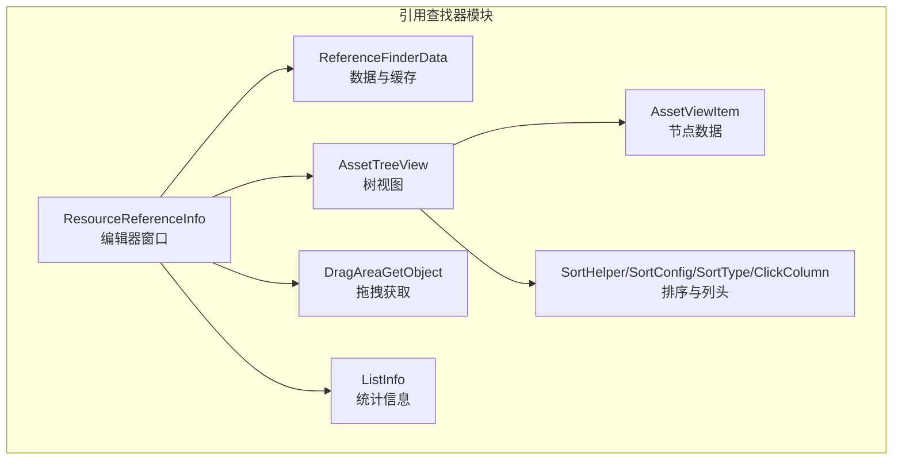
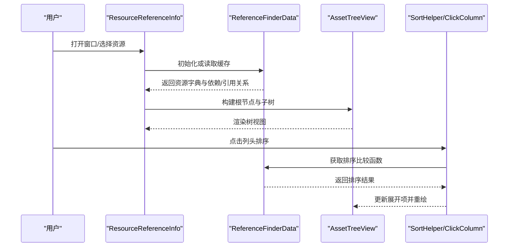
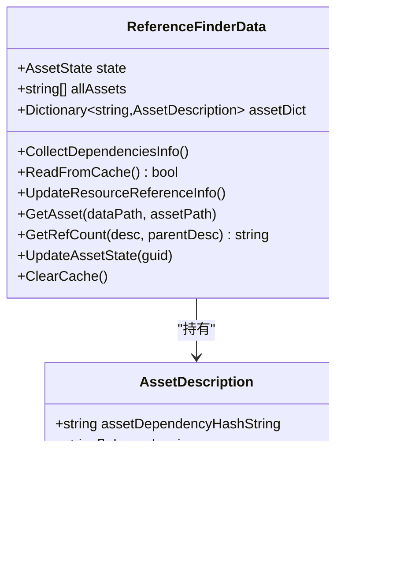
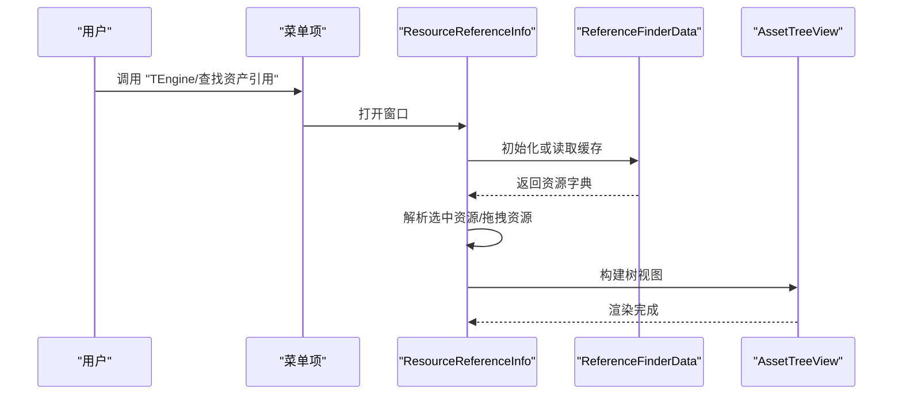
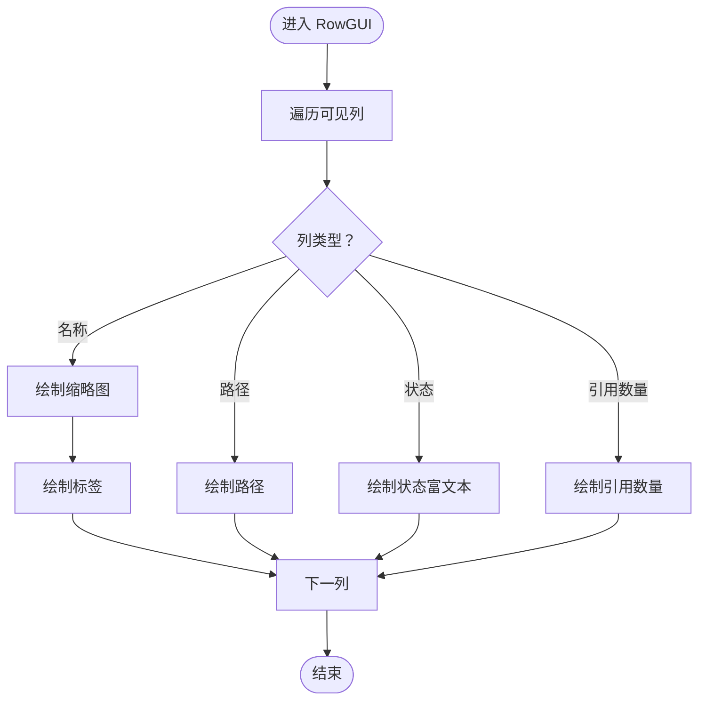
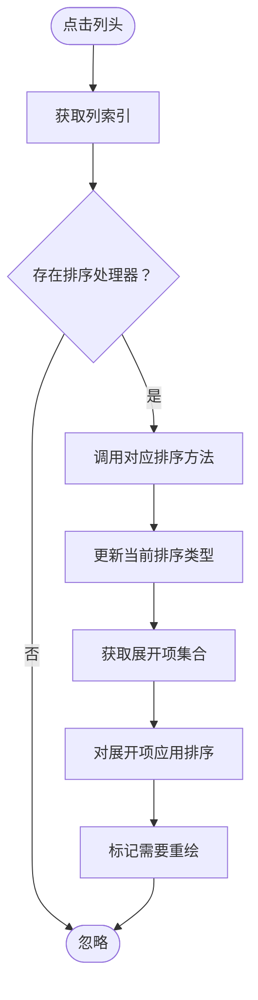
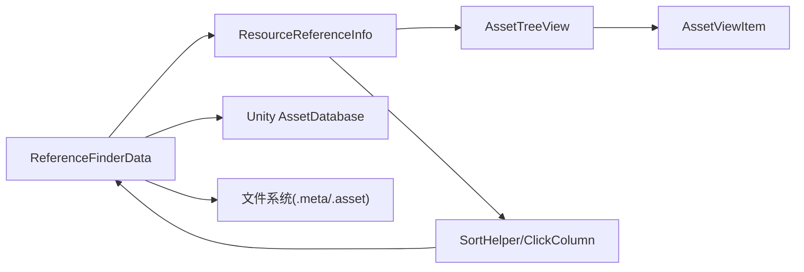

# 引用查找器

<cite>
**本文档引用的文件**
- [ReferenceFinderData.cs](file://Assets/Editor/ReferenceFinder/ReferenceFinderData.cs)
- [ResourceReferenceInfo.cs](file://Assets/Editor/ReferenceFinder/ResourceReferenceInfo.cs)
- [AssetTreeView.cs](file://Assets/Editor/ReferenceFinder/AssetTreeView.cs)
- [AssetViewItem.cs](file://Assets/Editor/ReferenceFinder/AssetViewItem.cs)
- [SortHelper.cs](file://Assets/Editor/ReferenceFinder/SortHelper.cs)
- [SortConfig.cs](file://Assets/Editor/ReferenceFinder/SortConfig.cs)
- [SortType.cs](file://Assets/Editor/ReferenceFinder/SortType.cs)
- [ClickColumn.cs](file://Assets/Editor/ReferenceFinder/ClickColumn.cs)
- [ListInfo.cs](file://Assets/Editor/ReferenceFinder/ListInfo.cs)
- [DragAreaGetObject.cs](file://Assets/Editor/ReferenceFinder/DragAreaGetObject.cs)
- [AssetBundleCollectorConfig.xml](file://Assets/Editor/AssetBundleCollector/AssetBundleCollectorConfig.xml)
- [AssetBundleCollectorSetting.asset](file://Assets/Editor/AssetBundleCollector/AssetBundleCollectorSetting.asset)
</cite>

## 目录
1. [简介](#简介)
2. [项目结构](#项目结构)
3. [核心组件](#核心组件)
4. [架构总览](#架构总览)
5. [详细组件分析](#详细组件分析)
6. [依赖关系分析](#依赖关系分析)
7. [性能考量](#性能考量)
8. [故障排查指南](#故障排查指南)
9. [结论](#结论)
10. [附录](#附录)

## 简介
本技术文档面向引用查找器（Reference Finder）模块，系统性阐述其架构设计、数据结构与存储机制、依赖关系追踪、可视化展示以及使用方法。引用查找器用于在Unity编辑器中对资源进行引用分析，支持“依赖模式”和“引用模式”，并提供树形视图展示、排序、缓存与增量更新能力。读者可据此完成资源搜索、依赖分析、引用统计等操作，并掌握最佳实践与性能优化技巧。

## 项目结构
引用查找器位于编辑器扩展目录下，核心文件组织如下：
- 数据层：ReferenceFinderData.cs（负责资源扫描、依赖解析、缓存与引用统计）
- 视图层：ResourceReferenceInfo.cs（编辑器窗口，负责交互、树构建与渲染）
- 可视化：AssetTreeView.cs、AssetViewItem.cs（TreeView实现与节点数据）
- 排序：SortHelper.cs、SortConfig.cs、SortType.cs、ClickColumn.cs（排序策略与列头交互）
- 辅助：ListInfo.cs（统计信息）、DragAreaGetObject.cs（拖拽获取资源）

图表来源
- [ReferenceFinderData.cs:1-417](file://Assets/Editor/ReferenceFinder/ReferenceFinderData.cs#L1-L417)
- [ResourceReferenceInfo.cs:1-307](file://Assets/Editor/ReferenceFinder/ResourceReferenceInfo.cs#L1-L307)
- [AssetTreeView.cs:1-174](file://Assets/Editor/ReferenceFinder/AssetTreeView.cs#L1-L174)
- [AssetViewItem.cs:1-9](file://Assets/Editor/ReferenceFinder/AssetViewItem.cs#L1-L9)
- [SortHelper.cs:1-111](file://Assets/Editor/ReferenceFinder/SortHelper.cs#L1-L111)
- [SortConfig.cs:1-33](file://Assets/Editor/ReferenceFinder/SortConfig.cs#L1-L33)
- [SortType.cs:1-11](file://Assets/Editor/ReferenceFinder/SortType.cs#L1-L11)
- [ClickColumn.cs:1-34](file://Assets/Editor/ReferenceFinder/ClickColumn.cs#L1-L34)
- [ListInfo.cs:1-9](file://Assets/Editor/ReferenceFinder/ListInfo.cs#L1-L9)
- [DragAreaGetObject.cs:1-29](file://Assets/Editor/ReferenceFinder/DragAreaGetObject.cs#L1-L29)

章节来源
- [ReferenceFinderData.cs:1-417](file://Assets/Editor/ReferenceFinder/ReferenceFinderData.cs#L1-L417)
- [ResourceReferenceInfo.cs:1-307](file://Assets/Editor/ReferenceFinder/ResourceReferenceInfo.cs#L1-L307)
- [AssetTreeView.cs:1-174](file://Assets/Editor/ReferenceFinder/AssetTreeView.cs#L1-L174)
- [AssetViewItem.cs:1-9](file://Assets/Editor/ReferenceFinder/AssetViewItem.cs#L1-L9)
- [SortHelper.cs:1-111](file://Assets/Editor/ReferenceFinder/SortHelper.cs#L1-L111)
- [SortConfig.cs:1-33](file://Assets/Editor/ReferenceFinder/SortConfig.cs#L1-L33)
- [SortType.cs:1-11](file://Assets/Editor/ReferenceFinder/SortType.cs#L1-L11)
- [ClickColumn.cs:1-34](file://Assets/Editor/ReferenceFinder/ClickColumn.cs#L1-L34)
- [ListInfo.cs:1-9](file://Assets/Editor/ReferenceFinder/ListInfo.cs#L1-L9)
- [DragAreaGetObject.cs:1-29](file://Assets/Editor/ReferenceFinder/DragAreaGetObject.cs#L1-L29)

## 核心组件
- ReferenceFinderData：核心数据容器与处理引擎，负责资源扫描、依赖解析、缓存读写、引用计数与状态更新。
- ResourceReferenceInfo：编辑器窗口，负责初始化数据、构建树视图、响应用户交互（拖拽、排序、展开/折叠）。
- AssetTreeView/AssetViewItem：TreeView实现与节点数据模型，承载显示逻辑与图标绘制。
- SortHelper/SortConfig/SortType/ClickColumn：排序体系，支持按名称/路径升/降序切换与快速翻转。
- ListInfo/DragAreaGetObject：辅助统计与拖拽交互。

章节来源
- [ReferenceFinderData.cs:16-417](file://Assets/Editor/ReferenceFinder/ReferenceFinderData.cs#L16-L417)
- [ResourceReferenceInfo.cs:10-307](file://Assets/Editor/ReferenceFinder/ResourceReferenceInfo.cs#L10-L307)
- [AssetTreeView.cs:8-174](file://Assets/Editor/ReferenceFinder/AssetTreeView.cs#L8-L174)
- [AssetViewItem.cs:5-9](file://Assets/Editor/ReferenceFinder/AssetViewItem.cs#L5-L9)
- [SortHelper.cs:6-111](file://Assets/Editor/ReferenceFinder/SortHelper.cs#L6-L111)
- [SortConfig.cs:5-33](file://Assets/Editor/ReferenceFinder/SortConfig.cs#L5-L33)
- [SortType.cs:3-11](file://Assets/Editor/ReferenceFinder/SortType.cs#L3-L11)
- [ClickColumn.cs:7-34](file://Assets/Editor/ReferenceFinder/ClickColumn.cs#L7-L34)
- [ListInfo.cs:3-9](file://Assets/Editor/ReferenceFinder/ListInfo.cs#L3-L9)
- [DragAreaGetObject.cs:6-29](file://Assets/Editor/ReferenceFinder/DragAreaGetObject.cs#L6-L29)

## 架构总览
引用查找器采用“数据-视图-交互”的分层架构：
- 数据层：ReferenceFinderData负责全量扫描与增量更新，维护资源字典、依赖列表、引用列表与状态。
- 视图层：ResourceReferenceInfo作为窗口入口，协调树构建、排序与渲染。
- 可视化层：AssetTreeView/AssetViewItem负责TreeView渲染、图标与单元格绘制。
- 排序层：SortHelper/SortConfig/SortType/ClickColumn统一管理排序策略与列头交互。
- 交互层：DragAreaGetObject支持从Project窗口拖拽资源到引用查找器。

图表来源
- [ResourceReferenceInfo.cs:43-70](file://Assets/Editor/ReferenceFinder/ResourceReferenceInfo.cs#L43-L70)
- [ReferenceFinderData.cs:51-113](file://Assets/Editor/ReferenceFinder/ReferenceFinderData.cs#L51-L113)
- [AssetTreeView.cs:39-51](file://Assets/Editor/ReferenceFinder/AssetTreeView.cs#L39-L51)
- [SortHelper.cs:49-75](file://Assets/Editor/ReferenceFinder/SortHelper.cs#L49-L75)
- [ClickColumn.cs:19-28](file://Assets/Editor/ReferenceFinder/ClickColumn.cs#L19-L28)

## 详细组件分析

### ReferenceFinderData 数据结构与存储机制
- 资源描述模型：内部类 AssetDescription，包含资源名称、路径、依赖GUID列表、被引用GUID列表、状态与依赖哈希字符串。
- 缓存机制：使用二进制序列化将GUID、依赖哈希与依赖索引写入 Library/ReferenceFinderCache 文件；读取时反序列化恢复字典与依赖关系，并即时计算引用关系。
- 并行扫描：根据CPU核心数确定线程数，将资源路径数组分片，每个线程独立解析元数据与依赖，最后合并到主线程字典。
- 依赖解析：通过正则提取.meta中的guid与资源文件中的guid，建立依赖映射；随后遍历字典填充被引用列表。
- 引用计数：递归计算引用数量，使用栈避免循环引用导致的无限递归，并缓存中间结果提升性能。
- 状态更新：基于文件修改时间判断资源是否变更或缺失，支持“缓存不匹配/丢失/无效/正常”四种状态提示。

图表来源
- [ReferenceFinderData.cs:16-417](file://Assets/Editor/ReferenceFinder/ReferenceFinderData.cs#L16-L417)

章节来源
- [ReferenceFinderData.cs:18-24](file://Assets/Editor/ReferenceFinder/ReferenceFinderData.cs#L18-L24)
- [ReferenceFinderData.cs:26-47](file://Assets/Editor/ReferenceFinder/ReferenceFinderData.cs#L26-L47)
- [ReferenceFinderData.cs:407-417](file://Assets/Editor/ReferenceFinder/ReferenceFinderData.cs#L407-L417)
- [ReferenceFinderData.cs:51-113](file://Assets/Editor/ReferenceFinder/ReferenceFinderData.cs#L51-L113)
- [ReferenceFinderData.cs:186-196](file://Assets/Editor/ReferenceFinder/ReferenceFinderData.cs#L186-L196)
- [ReferenceFinderData.cs:198-259](file://Assets/Editor/ReferenceFinder/ReferenceFinderData.cs#L198-L259)
- [ReferenceFinderData.cs:261-294](file://Assets/Editor/ReferenceFinder/ReferenceFinderData.cs#L261-L294)
- [ReferenceFinderData.cs:296-316](file://Assets/Editor/ReferenceFinder/ReferenceFinderData.cs#L296-L316)
- [ReferenceFinderData.cs:329-405](file://Assets/Editor/ReferenceFinder/ReferenceFinderData.cs#L329-L405)

### ResourceReferenceInfo 编辑器窗口与交互
- 菜单入口：通过菜单项打开窗口，自动初始化数据或从缓存加载。
- 拖拽支持：从Project窗口拖拽资源到窗口区域，自动解析为GUID集合并刷新树视图。
- 树构建：根据选中资源GUID构建根节点，递归生成子树；支持依赖/引用两种模式切换。
- 统计输出：在控制台输出预制体与材质的统计信息，便于快速定位问题。
- 工具栏：提供“更新本地缓存”、“依赖/引用模式切换”、“展开/折叠”等操作按钮。

图表来源
- [ResourceReferenceInfo.cs:43-60](file://Assets/Editor/ReferenceFinder/ResourceReferenceInfo.cs#L43-L60)
- [ResourceReferenceInfo.cs:82-107](file://Assets/Editor/ReferenceFinder/ResourceReferenceInfo.cs#L82-L107)
- [ResourceReferenceInfo.cs:109-141](file://Assets/Editor/ReferenceFinder/ResourceReferenceInfo.cs#L109-L141)
- [ResourceReferenceInfo.cs:143-200](file://Assets/Editor/ReferenceFinder/ResourceReferenceInfo.cs#L143-L200)

章节来源
- [ResourceReferenceInfo.cs:43-70](file://Assets/Editor/ReferenceFinder/ResourceReferenceInfo.cs#L43-L70)
- [ResourceReferenceInfo.cs:82-141](file://Assets/Editor/ReferenceFinder/ResourceReferenceInfo.cs#L82-L141)
- [ResourceReferenceInfo.cs:143-200](file://Assets/Editor/ReferenceFinder/ResourceReferenceInfo.cs#L143-L200)
- [ResourceReferenceInfo.cs:202-228](file://Assets/Editor/ReferenceFinder/ResourceReferenceInfo.cs#L202-L228)
- [ResourceReferenceInfo.cs:230-305](file://Assets/Editor/ReferenceFinder/ResourceReferenceInfo.cs#L230-L305)

### AssetTreeView/AssetViewItem 可视化与渲染
- TreeView实现：自定义多列头，支持名称、路径、状态、引用数量列；双击节点可定位到Project窗口。
- 图标绘制：根据资源类型获取缩略图或类型图标，增强可读性。
- 行渲染：按列绘制内容，状态列使用富文本颜色标识缓存状态。
- 展开/折叠：支持展开所有与折叠所有，并在排序后重新应用排序。

图表来源
- [AssetTreeView.cs:114-150](file://Assets/Editor/ReferenceFinder/AssetTreeView.cs#L114-L150)
- [AssetTreeView.cs:152-164](file://Assets/Editor/ReferenceFinder/AssetTreeView.cs#L152-L164)

章节来源
- [AssetTreeView.cs:8-23](file://Assets/Editor/ReferenceFinder/AssetTreeView.cs#L8-L23)
- [AssetTreeView.cs:53-110](file://Assets/Editor/ReferenceFinder/AssetTreeView.cs#L53-L110)
- [AssetTreeView.cs:114-150](file://Assets/Editor/ReferenceFinder/AssetTreeView.cs#L114-L150)
- [AssetViewItem.cs:5-9](file://Assets/Editor/ReferenceFinder/AssetViewItem.cs#L5-L9)

### 排序体系 SortHelper/SortConfig/SortType/ClickColumn
- 排序类型：None、AscByName、DescByName、AscByPath、DescByPath。
- 切换策略：同一组内循环切换，不同组间先恢复再切换，保证排序一致性。
- 比较函数：按名称或路径进行字符串比较；支持正/逆序。
- 快速翻转：同组内直接对依赖/引用列表做原地反转，避免重复排序。
- 列头交互：点击列头触发排序，更新展开项并重绘。

图表来源
- [ClickColumn.cs:19-28](file://Assets/Editor/ReferenceFinder/ClickColumn.cs#L19-L28)
- [SortHelper.cs:30-47](file://Assets/Editor/ReferenceFinder/SortHelper.cs#L30-L47)
- [SortHelper.cs:49-75](file://Assets/Editor/ReferenceFinder/SortHelper.cs#L49-L75)
- [SortConfig.cs:7-28](file://Assets/Editor/ReferenceFinder/SortConfig.cs#L7-L28)
- [SortType.cs:3-11](file://Assets/Editor/ReferenceFinder/SortType.cs#L3-L11)

章节来源
- [SortHelper.cs:6-111](file://Assets/Editor/ReferenceFinder/SortHelper.cs#L6-L111)
- [SortConfig.cs:5-33](file://Assets/Editor/ReferenceFinder/SortConfig.cs#L5-L33)
- [SortType.cs:3-11](file://Assets/Editor/ReferenceFinder/SortType.cs#L3-L11)
- [ClickColumn.cs:7-34](file://Assets/Editor/ReferenceFinder/ClickColumn.cs#L7-L34)

### 拖拽与统计辅助
- 拖拽获取：通过 DragAreaGetObject 在拖拽事件中获取Project窗口中的资源对象，转换为GUID集合。
- 统计信息：记录预制体与材质的数量与名称，汇总到控制台输出，辅助资源分析。

章节来源
- [DragAreaGetObject.cs:6-29](file://Assets/Editor/ReferenceFinder/DragAreaGetObject.cs#L6-L29)
- [ListInfo.cs:3-9](file://Assets/Editor/ReferenceFinder/ListInfo.cs#L3-L9)
- [ResourceReferenceInfo.cs:266-289](file://Assets/Editor/ReferenceFinder/ResourceReferenceInfo.cs#L266-L289)

## 依赖关系分析
引用查找器的依赖关系主要体现在以下方面：
- 数据依赖：ResourceReferenceInfo依赖ReferenceFinderData提供的资源字典与状态。
- 视图依赖：AssetTreeView依赖ResourceReferenceInfo传入的根节点与排序状态。
- 排序依赖：SortHelper依赖ReferenceFinderData中的资源描述以进行名称/路径比较。
- 缓存依赖：ReferenceFinderData依赖Unity的AssetDatabase与文件系统，读取.meta与资源文件。

图表来源
- [ReferenceFinderData.cs:51-113](file://Assets/Editor/ReferenceFinder/ReferenceFinderData.cs#L51-L113)
- [ResourceReferenceInfo.cs:143-200](file://Assets/Editor/ReferenceFinder/ResourceReferenceInfo.cs#L143-L200)
- [AssetTreeView.cs:39-51](file://Assets/Editor/ReferenceFinder/AssetTreeView.cs#L39-L51)
- [SortHelper.cs:49-75](file://Assets/Editor/ReferenceFinder/SortHelper.cs#L49-L75)

章节来源
- [ReferenceFinderData.cs:51-113](file://Assets/Editor/ReferenceFinder/ReferenceFinderData.cs#L51-L113)
- [ResourceReferenceInfo.cs:143-200](file://Assets/Editor/ReferenceFinder/ResourceReferenceInfo.cs#L143-L200)
- [AssetTreeView.cs:39-51](file://Assets/Editor/ReferenceFinder/AssetTreeView.cs#L39-L51)
- [SortHelper.cs:49-75](file://Assets/Editor/ReferenceFinder/SortHelper.cs#L49-L75)

## 性能考量
- 并行扫描：根据CPU核心数动态分配线程，将资源分片处理，显著缩短全量扫描时间。
- 缓存机制：二进制缓存减少重复解析，仅在资源修改时间变化时重建引用关系。
- 引用计数缓存：使用字典缓存中间结果，避免重复计算。
- 快速翻转：同组内排序时直接对列表做原地反转，降低排序成本。
- UI刷新：仅在必要时更新树视图，避免频繁重绘。

章节来源
- [ReferenceFinderData.cs:27-47](file://Assets/Editor/ReferenceFinder/ReferenceFinderData.cs#L27-L47)
- [ReferenceFinderData.cs:198-259](file://Assets/Editor/ReferenceFinder/ReferenceFinderData.cs#L198-L259)
- [ReferenceFinderData.cs:373-405](file://Assets/Editor/ReferenceFinder/ReferenceFinderData.cs#L373-L405)
- [SortHelper.cs:83-93](file://Assets/Editor/ReferenceFinder/SortHelper.cs#L83-L93)
- [AssetTreeView.cs:39-51](file://Assets/Editor/ReferenceFinder/AssetTreeView.cs#L39-L51)

## 故障排查指南
- 缓存异常：若出现“缓存不匹配/丢失/无效”，可通过工具栏按钮强制更新本地缓存。
- 循环引用：引用计数算法内置循环检测，遇到循环引用会发出日志提示，计数可能不准确。
- 资源缺失：当资源文件不存在时，状态显示为“丢失”，需检查资源路径或重新导入。
- 排序异常：若排序结果不符合预期，尝试切换排序组或重置排序类型。

章节来源
- [ReferenceFinderData.cs:318-327](file://Assets/Editor/ReferenceFinder/ReferenceFinderData.cs#L318-L327)
- [ReferenceFinderData.cs:329-371](file://Assets/Editor/ReferenceFinder/ReferenceFinderData.cs#L329-L371)
- [ResourceReferenceInfo.cs:202-228](file://Assets/Editor/ReferenceFinder/ResourceReferenceInfo.cs#L202-L228)

## 结论
引用查找器通过清晰的分层架构与高效的缓存/并行机制，实现了对Unity资源的快速依赖/引用分析与可视化展示。配合排序与拖拽交互，能够有效支撑资源管理、清理与优化工作流。建议在大型项目中定期更新缓存，合理使用依赖/引用模式，并结合统计输出进行资源治理。

## 附录

### 使用方法与操作流程
- 打开窗口：通过菜单项“TEngine/查找资产引用”打开引用查找器。
- 选择资源：在Project窗口中选择一个或多个资源，或直接拖拽到窗口区域。
- 查看结果：树视图展示所选资源及其依赖/引用关系；状态列显示缓存状态；引用数量列显示引用计数。
- 切换模式：工具栏切换“依赖模式/引用模式”，观察不同视角下的关系链。
- 排序：点击列头进行排序，支持名称/路径升/降序；展开后自动应用排序。
- 更新缓存：点击“更新本地缓存”按钮，重新扫描并写入缓存。

章节来源
- [ResourceReferenceInfo.cs:43-70](file://Assets/Editor/ReferenceFinder/ResourceReferenceInfo.cs#L43-L70)
- [ResourceReferenceInfo.cs:82-141](file://Assets/Editor/ReferenceFinder/ResourceReferenceInfo.cs#L82-L141)
- [ResourceReferenceInfo.cs:143-200](file://Assets/Editor/ReferenceFinder/ResourceReferenceInfo.cs#L143-L200)
- [AssetTreeView.cs:53-110](file://Assets/Editor/ReferenceFinder/AssetTreeView.cs#L53-L110)

### 资源管理最佳实践与清理建议
- 定期更新缓存：项目发生大规模资源变更后，使用“更新本地缓存”按钮刷新数据。
- 合理使用模式：依赖模式适合排查上游资源影响，引用模式适合定位下游使用方。
- 利用统计输出：关注预制体与材质的统计信息，识别潜在冗余资源。
- 清理无用资源：结合引用计数与状态提示，删除缺失或长期未使用的资源。
- 分包与打包：参考AssetBundleCollector配置，合理划分资源包，减少不必要的依赖链。

章节来源
- [AssetBundleCollectorConfig.xml:1-48](file://Assets/Editor/AssetBundleCollector/AssetBundleCollectorConfig.xml#L1-L48)
- [AssetBundleCollectorSetting.asset:18-218](file://Assets/Editor/AssetBundleCollector/AssetBundleCollectorSetting.asset#L18-L218)